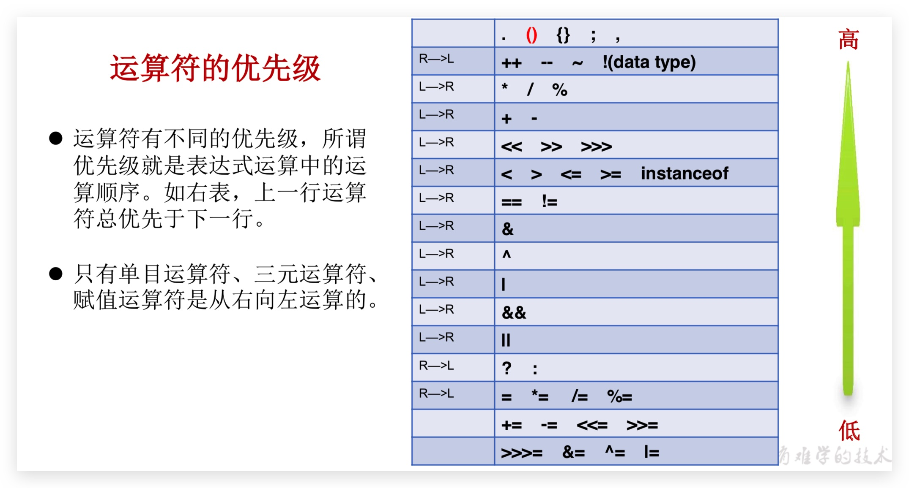

# 1 Basic Syntax

## introduce

### Java 简介

Java 最早是由 SUN 公司（已被 Oracle 收购）的[詹姆斯·高斯林](https://en.wikipedia.org/wiki/James_Gosling)（高司令，人称 Java 之父）在上个世纪 90 年代初开发的一种编程语言，最初被命名为 Oak，目标是针对小型家电设备的嵌入式应用，结果市场没啥反响。谁料到互联网的崛起，让 Oak 重新焕发了生机，于是 SUN 公司改造了 Oak，在 1995 年以 Java 的名称正式发布，原因是 Oak 已经被人注册了，因此 SUN 注册了 Java 这个商标。随着互联网的高速发展，Java 逐渐成为最重要的网络编程语言。

### 编译型语言和解释型语言

Java**介于编译型语言和解释型语言之间**。编译型语言如 C、C++，代码是直接编译成机器码执行，但是不同的平台（x86、ARM 等）CPU 的指令集不同，因此，需要编译出每一种平台的对应机器码。解释型语言如 Python、Ruby 没有这个问题，可以由解释器直接加载源码然后运行，代价是运行效率太低。而**Java 是将代码编译成一种“字节码”**，它类似于抽象的 CPU 指令，然后，**针对不同平台编写虚拟机，不同平台的虚拟机负责加载字节码并执行，这样就实现了“一次编写，到处运行”的效果**。当然，这是针对 Java 开发者而言。**对于虚拟机，需要为每个平台分别开发**。为了保证不同平台、不同公司开发的虚拟机都能正确执行 Java 字节码，SUN 公司制定了一系列的 Java 虚拟机规范。从实践的角度看，JVM 的兼容性做得非常好，低版本的 Java 字节码完全可以正常运行在高版本的 JVM 上。**JVM**(Java Virtual Machine) 是一个虚拟的计算机，具有指令集并使用不同的存储区域。负责执行指令，管理数据、内存、寄存器。

### JRE 和 JDK

- JRE(Java Runtime Environment)：是 Java 程序的运行时环境，包含 **JVM** 和**运行时所需要的核心类库** 。

- JDK(Java Development Kit)：是 Java 程序开发工具包，包含 **JRE** 和**开发人员使用的工具**。

  二者关系如下：

```ascii
 ┌─    ┌──────────────────────────────────┐
  │     │     Compiler, debugger, etc.     │
  │     └──────────────────────────────────┘
 JDK ┌─ ┌──────────────────────────────────┐
  │  │  │                                  │
  │ JRE │      JVM + Runtime Library       │
  │  │  │                                  │
  └─ └─ └──────────────────────────────────┘
        ┌───────┐┌───────┐┌───────┐┌───────┐
        │Windows││ Linux ││ macOS ││others │
        └───────┘└───────┘└───────┘└───────┘
```

安装 JDK 及环境变量配置，也可以使用 SDKMAN 直接安装

- JAVA_HOME
- Path

在`JAVA_HOME`的`bin`目录下找到很多可执行文件

- javac：这是 Java 的**编译**器，它用于把 Java 源码文件（以`.java`后缀结尾）编译为 Java 字节码文件（以`.class`后缀结尾）。如`javac Test.java`

- java：这个可执行程序其实就是 JVM，**运行**Java 程序，就是启动 JVM，然后让 JVM 执行指定的编译后的代码。如``javac Test`。

  :::tip

  在 Java 11 中可以通过`java Test.java`直接一个单文件源码！但是不能依赖其他库，所以基本没啥用！

  :::

- jar：用于把一组`.class`文件打包成一个`.jar`文件，便于发布；

- javadoc：用于从 Java 源码中自动提取注释并生成文档；

- jdb：Java 调试器，用于开发阶段的运行调试。

### JSR、JCP

- JSR 规范：Java Specification Request
- JCP 组织：Java Community Process

为了保证 Java 语言的规范性，SUN 公司搞了一个 JSR 规范，凡是想给 Java 平台加一个功能，比如说访问数据库的功能，大家要先创建一个 JSR 规范，定义好接口，这样，各个数据库厂商都按照规范写出 Java 驱动程序，开发者就不用担心自己写的数据库代码在 MySQL 上能跑，却不能跑在 PostgreSQL 上。

所以 JSR 是一系列的规范，从 JVM 的内存模型到 Web 程序接口，全部都标准化了。而负责审核 JSR 的组织就是 JCP。

一个 JSR 规范发布时，为了让大家有个参考，还要同时发布一个“参考实现”，以及一个“兼容性测试套件”：

- RI：Reference Implementation
- TCK：Technology Compatibility Kit

比如有人提议要搞一个基于 Java 开发的消息服务器，这个提议很好啊，但是光有提议还不行，得贴出真正能跑的代码，这就是 RI。如果有其他人也想开发这样一个消息服务器，如何保证这些消息服务器对开发者来说接口、功能都是相同的？所以还得提供 TCK。

通常来说，RI 只是一个“能跑”的正确的代码，它不追求速度，所以，如果真正要选择一个 Java 的消息服务器，一般是没人用 RI 的，大家都会选择一个有竞争力的商用或开源产品。

参考：[Java 消息服务 JMS 的 JSR](https://jcp.org/en/jsr/detail?id=914)

## keyword & reserved word

被 Java 语言赋予了特殊含义，用做专门用途的字符串(单词)，关键字中**所有字母都为小写（main 不是）**，详细可[查看官网文档](https://docs.oracle.com/javase/tutorial/java/nutsandbolts/_keywords.html)

- 用于定义数据类型的关键字

  class、interface、enum、byte、short、int、long、float、double、char、boolean、void

- 用于定义流程控制的关键字

  if、else、switch、case、default、while、do、for、break、continue、return

- 用于定义访问权限修饰符的关键字

  private、protected、public

- 用于定义类、函数、变量修饰符的关键字

  abstract、final、static、synchronized

- 用于定义类与类之间关系的关键字

  extends、implements

- 用于定义建立实例及引用实例，判断实例的关键字

  new、this、super、instanceof

- 用于异常处理的关键字

  try、catch、finally、throw、throws

- 用于包的关键字

  package、import

- 其他修饰符关键字

  native、strictfp、transient、volatile、assert

- （不是关键字，但也当关键字来用）用于定义数据类型值的字面值

  true、false、null

Java 保留字：现有 Java 版本尚未使用，但以后版本可能会作为关键字使用。goto 、const

## Identifier

- Java 对各种**变量、方法和类等要素命名时使用的字符序列称为标识符**。凡是自己可以起名字的地方都叫标识符，比如类的名字、方法的名字和变量的名字等
- **命名规则**： 硬性要求
  - 标识符可以包含 英文字母 26 个(区分大小写) 、 0-9 、 \$（美元符号） 和 \_（下划线）
  - 标识符不能以数字开头
  - 标识符不能是关键字或保留字，但能包含
  - 标识符不能包含空格
  - 标识符严格区分大小写
- **命名规范**： 软性建议
  - 包名：多单词组成时所有字母都小写`xxxyyyzzz`
  - 类名、接口名：所有单词的首字母大写（大驼峰式），不推荐包含`_`
  - 方法名、变量名： 首字母小写，后面每个单词首字母大写（小驼峰式）。
  - 常量名：所有字母都大写。多单词时每个单词用下划线连接`XXX_YYY_ZZZ`

## constant

定义变量的时候，如果加上`final`修饰符，这个变量就变成了常量。常量在定义时进行初始化后就不可再次赋值，再次赋值会导致编译错误。常量的作用是用有意义的变量名来**避免魔术数字**（Magic number），例如，不要在代码中到处写`3.14`，而是定义一个常量。如果将来需要提高计算精度，我们只需要在常量的定义处修改，例如，改成`3.1416`，而不必在所有地方替换`3.14`。根据习惯，常量名通常全部大写。

- **整数**常量、**浮点数**常量、**字符**常量、**字符串**常量、**布尔**常量、**空**常量

## variable

- 变量是**内存中的一个存储区域**，该区域的数据可以在同一类型范围内不断变化，变量是程序中最基本的存储单元。

- 格式： 数据类型 变量名 = 数据值;

- **变量的作用范围**：在 Java 中，多行语句用{ }括起来，编译器就能识别出语句块的开始和结束

- **注意**：

  - Java 中每个变量必须**先声明，后使用，不赋值不能使用**
  - 在同一个大括号范围内（**作用域内**），变量的名字不可以相同
  - 对于**byte 或者 short**类型变量，注意其**取值范围**
  - 对于 float 或者 long 类型变量，**后缀 F、L**不能丢

- java 11 中可以使用`var`来简化定义

  ```java
  StringBuilder sb = new StringBuilder();
  // 可改为
  var sb = new StringBuilder();
  // 编译器会根据赋值语句自动推断出变量sb的类型是StringBuilder。对编译器来说，语句：
  ```

## 数据类型

### 基本数据类型

数值型（整数型、浮点型）、字符型、布尔型

| 数据类型     | 关键字                              | 内存占用      | 取值范围                          |
| ------------ | ----------------------------------- | ------------- | --------------------------------- |
| 整数类型     | byte                                | 1 个字节      | -128~127                          |
| 整数类型     | short                               | 2 个字节      | -2^15~2^15-1 = -32768~32767       |
| 整数类型     | int（默认）                         | 4 个字节      | -2^31~2^31^-1（约 21 亿）         |
| 整数类型     | long                                | 8 个字节      | -2^63~2^63^-1                     |
| 单精度浮点数 | float（尾数可以精确到 7 位有效数字） | 4 个字节      | -3.403E38~3.403E38                |
| 双精度浮点数 | double（默认，精度是 float 的两倍） | 8 个字节      | -1.798E308~1.798E308              |
| 字符型       | char                                | 2 个字节      | 2^16 = 0~65535                    |
| 布尔类型     | boolean                             | 1 或 4 个字节 | 只有 true、false，不能用 0 等替代 |

### 引用数据类型

- 类（包含字符串 String）
- 接口
- 数组
- Lambda（也属于类？）

### 整数类型

- **Java 各整数类型有固定的表数范围和字段长度**，不受具体 OS 的影响，以保 证 Java 程序的可移植性。

- 默认为 int 型，声明 long 型常量须后加‘l’或‘L’。通常声明为 int 型，除非不足以表示较大的数，才使用 long。

- 整数的数值表示不但是**精确**的，而且**整数运算永远是精确的**，即使是除法也是精确的，因为两个整数相除只能得到结果的整数部分

  ::: danger

  整数的除法对于除数为 0 时运行时将报错，但编译不会报错。

  :::

  ::: danger

  要特别注意，整数由于存在范围限制，如果计算结果超出了范围，就会产生溢出，而溢出**不会出错**，却会得到一个奇怪的结果

  :::

### 浮点类型

- 与整数类型类似，**Java 浮点类型也有固定的表数范围和字段长度**，不受具体操作系统的影响。默认为 double 型，声明 float 型常量，须后加`f`或`F`。

- 浮点型常量有两种表示形式

  - 十进制数形式：如 5.12、512.0f、.512 （必须有小数点）
  - 科学计数法形式：如 5.12e2、512E2、100E-2

- float 尾数可以精确到 7 位有效数字（精度很难满足需求），double 精度是 float 的两倍，通常采用 double。注意：**数据范围与字节数不一定相关**，如**float 数据范围比 long 更加广泛**，但是 float 是 4 字节，long 是 8 字节。

- **浮点类型可能**只是一个**近似值**，并非精确的数值。

  - 0.1 换算成二进制是一个无限循环小数，即`2^-4+2^-5+...`
  - 0.5 换算成二进制可以精确表示，即`2^-1`

  由于浮点数存在运算误差，所以比较两个浮点数是否相等常常会出现错误的结果。正确的比较方法是判断两个浮点数之差的绝对值是否小于一个很小的数：

  ```java
  // 比较x和y是否相等，先计算其差的绝对值:
  double r = Math.abs(x - y);
  // 再判断绝对值是否足够小:
  if (r < 0.00001) {
      // 可以认为相等
  } else {
      // 不相等
  }
  ```

::: danger

整数运算在除数为`0`时会报错，而浮点数运算在除数为`0`时，不会报错，但会返回几个特殊值：

- `NaN`表示 Not a Number
- `Infinity`表示无穷大
- `-Infinity`表示负无穷大

```java
double d1 = 0.0 / 0; // NaN
double d2 = 1.0 / 0; // Infinity
double d3 = -1.0 / 0; // -Infinity
```

这三种特殊值在实际运算中很少碰到，我们只需要了解即可。

:::

### 字符型

- char 型数据用来表示通常意义上“字符”（2 字节），**Java 中的所有字符用来存储 Unicode 编码，读取到 JVM 中时会将字符编码转为 UTF-16 来存储，占两个字节**，可以存储大部分非生僻字（UTF-8 位不定长，3 个字节存储中文汉字）。故一个字符可以存储一个字母，一个汉字，或其他书面语的一个字符。

- 字符型变量的三种表现形式：

  - 字符常量是用单引号(‘ ’)括起来的**单个字符**。例如:char c1 = 'a'; char c2 = '中'; char c3 = '9';

  - Java 中还允许使用**转义字符**‘\’来将其后的字符转变为特殊字符型常量。

    例如`\n`换行符，`\'`单引，`\\`反斜杠，`\b`退格，`\r`回车、`\n`换行

  - 直接使用 **Unicode 值**来表示字符型常量:‘\uXXXX’。其中，XXXX 代表 一个十六进制整数。如:\u000a 表示 \n。

- char 类型是可以进行**运算**的。因为它都对应有 Unicode 码。

- 字符对应 ASCII 码（0~127）：48—'0'、65—'A'、97—'a'

### 布尔类型

- boolean 类型数据只允许取值 true 和 false，无 null。

  不可以使用 0 或非 0 的整数替代 false 和 true，这点和 C 语言不同。

- **boolean 在《Java 虚拟机规范》给出了 4 个字节（编译后用 int 替代），和 boolean 数组 1 个字节的定义（当 byte 数组处理）**

### 数据类型转换

有多种类型的数据混合运算时，系统首先自动将所有数据转换成容量最大的那种数据类型，然后再进行计算。**byte、char、short 之间不会相互转换，他们三者在计算时首先转换为 int 类型。**

**参与运算的有 byte、char、short**——>**int**——>**long**——>**float**——>**double**（boolean 不参与）

当把任何基本数据类型的值和 String 进行连接运算时(+)，基本数据类型的值将自动转化为 String 类型。

- **自动类型转换/提升**（隐式），范围**小**的类型向范围**大**的**类型提升**，如下：

  **编译器的常量优化**

  对于 byte、char、short 三种类型来说，若右侧赋值的**数值(不能为变量)**没有超过范围，那么 javac 编译器会自动隐含得帮我们**补上(byte) (short) (char)** ，否则编译报错。

  在给变量进行赋值时，若右侧的**表达式都是常量**，没有任何变量，那么 javac 编译器将会直接将若干个常量表达式计算得到结果。并根据是否超过范围决定编译成功与否。

  ```java
  byte a = 3;
  byte b = 4;
  byte c = a + b;//运算期间byte类型变量自动提升为int，但int类型不能赋值给byte类型，因此编译失败。
  byte d = 3 + 4;//常量在编译的时候（javac），已经确定了 3+4 的结果并没有超过byte类型的取值范围，可以赋值给d，成功

  char ch = 'A';
  System.out.println(ch + 1);//66
  char ch = '';//编译失败

  long a = 12345;//自动类型提升
  long b = 12313131312312313;//编译报错，过大的整数，转int失败

  float a = 12.3;//编译失败，double转float失败

  System.out .println(3+4+“Hello!”); //输出:7Hello!
  System.out.println(“Hello!”+3+4); //输出:Hello!34
  System.out.println(‘a’+1+“Hello!”); //输出:98Hello!
  System.out.println(“Hello”+‘a’+1); //输出:Helloa1，连接运算，不做数值运算！！若是俩char则做数值运算！！
  boolean b = true；
  System.out.println("Hello" + b);//输出：Hellotrue
  ```

- **强制类型转换**（显式），是自动类型转换的**逆过程**，将容量大的数据类型转换为容量小的数据类型。

  一般不推荐使用，有可能发生**精度损失**（浮点转成整数，直接**丢掉小数**，如果转型后超过了整型能表示的最大范围，将返回整型的最大值）

  ```java
  double a = 3.5;
  byte b = (byte)a;//3

  int a = 128;
  byte b = (byte)a;//-128
  //此处涉及进制转换
  //128的补码为（采用8位演示）：1000 0000
  //强转位byte：1就变为符号位了，代表-128
  ```

  ```java
  int n1 = (int) 12.3; // 12
  int n2 = (int) 12.7; // 12
  int n2 = (int) -12.7; // -12
  int n3 = (int) (12.7 + 0.5); // 13
  int n4 = (int) 1.2e20; // 2147483647
  ```

  **在使用+=、-=、\*=、/=、%=运算符进行赋值时，强制类型转换会自动完成，不会改变原有数据类型；++、--也一样。**

- 如果要进行**四舍五入**，可以对浮点数加上 0.5 再强制转型：

  ```java
  double d = 2.6;
  int n = (int) (d + 0.5);
  System.out.println(n);
  ```

- 通常，字符串不能直接转换为基本类型，但通过基本类型对应的包装类则可以实现把字符串转换成基本类型。

## 包装类

### 简介

- 针对八种基本数据类型定义相应的引用类型—`java.lang`下的包装类(封装类)，可以让让基本类型的数据**进行更多的操作**，此时 Java 才是真正的面向对象。如下其中 6 种数字类型都继承父类 Number。

  | 基本数据类型 | 引用数据类型  |
  | :----------: | :-----------: |
  |     byte     |     Byte      |
  |    short     |     Short     |
  |     int      |  **Integer**  |
  |     long     |     Long      |
  |    float     |     Float     |
  |    double    |    Double     |
  |     char     | **Character** |
  |   boolean    |    Boolean    |

### 装箱与拆箱

- 装箱：将基本数据类型的值转为引用数据类型，提供如下静态方法，其他包装类同理。

  - `Integer.valueOf(int num/String str)`，字符串必须是基本类型字符串，否则`NumberFormatException`

  - ~~利用其构造器，可传入基本类型、String。在 JDK9 时过时~~

    其中 Boolean 在传入字符串时底层方法为`return "true".equalsIgnoreCase(s)`

- 拆箱：将引用数据类型的值转为基本数据类型，提供如下成员方法，其他包装类同理。

  - `intValue()`该方法将 Integer 对象转为 int

- **自动拆装箱**：**JDK 5.0 后支持**基本类型数据和包装类型数据之间可以自动互相转换

### 基本类型与字符串转换

- 基本类型—>字符串：
  - **`基本类型的值+""`**：最简单方法，常用
  - **String 类的静态方法`valueOf(参数)`**
  - **包装类的静态方法`toString(参数)`**方法，不是 Object 类的`toString()`方法，重载
- 字符串—>基本类型：
  - **包装类的静态方法`parseXxx()`**
  - **包装类的静态方法`valueOf(参数)`，转包装类后再转基本类型**
- **注意：**
  1.  包装类都重写 Object 类中的`toString()` 方法，以**字符串**形式返回包装类的基本数据类型的值
  2.  除了 Character 外，包装类都有`valueOf(String s)`方法，根据 String 类型参数创建包装类对象
  3.  除了 Character 外，包装类都有`parseXXX(String s)`的静态方法，将字符串转为基本类型数据

### 包装类缓存

基本类型的包装类（除浮点数）都有其缓存，Boolean 为 true、false，Character 为 0~127，其他为-128~127（其有内部类）

不推荐用关系运算符比较，使用其方法比较如`equals()`。

- Integer 内部维护着一个 IntegerCache 的缓存，默认缓存范围是 [-128, 127]
- ...

### 进制转换

Long 或 Integer

- `static String toString(int/long num[,int radix])` 进制转换，默认转为十进制字符串
- `static String toBinary/Octal/HexString(int num)` 其他进制转二、八、十六进制字符串
- `static int parseInt/Long(String s[,int radix])` 将字符串参数解析为第二个参数指定的基数中的有符号长整数（**十进制**）。**字符串不能有进制前缀**

```java
// long a = 0b1010;// Java 7 引入了二进制的字面值常量，由前导 0b 或 0B 表示，它可以初始化所有的整数类型。
// long a = 012;// 0 为八进制前缀
long a = 0xA;// 0x或0X 为十六进制前缀

System.out.println(Long.toString(a,2));
System.out.println(Long.toString(a,8));
System.out.println(Long.toString(a,10));
System.out.println(Long.toString(a,16));
System.out.println("========================");

System.out.println(Long.toBinaryString(a));
System.out.println(Long.toOctalString(a));
System.out.println(a);// 等价于Long.toString(a)
System.out.println(Long.toHexString(a));
System.out.println("========================");

String b = "17";
System.out.println(parseLong(b, 8));
System.out.println(parseLong(b, 16));
```

```
1010
12
10
a
========================
1010
12
10
a
========================
15
23
```

## 字面值常量

通常，当我们向程序中插入一个字面值常量（**Literal**）时，编译器会确切地识别它的类型。当类型不明确时，必须辅以字面值常量关联来帮助编译器识别。代码示例：

```java
// operators/Literals.java
public class Literals {
  public static void main(String[] args) {
    int i1 = 0x2f; // 16进制 (小写)
    System.out.println("i1: " + Integer.toBinaryString(i1));
    int i2 = 0X2F; // 16进制 (大写)
    System.out.println("i2: " + Integer.toBinaryString(i2));
    int i3 = 0177; // 8进制 (前导0)
    System.out.println("i3: " + Integer.toBinaryString(i3));
    char c = 0xffff; // 最大 char 型16进制值
    System.out.println("c: " + Integer.toBinaryString(c));
    byte b = 0x7f; // 最大 byte 型16进制值  10101111;
    System.out.println("b: " + Integer.toBinaryString(b));
    short s = 0x7fff; // 最大 short 型16进制值
    System.out.println("s: " + Integer.toBinaryString(s));
    long n1 = 200L; // long 型后缀
    long n2 = 200l; // long 型后缀 (容易与数值1混淆)
    long n3 = 200;

    // Java 7 二进制字面值常量:
    byte blb = (byte)0b00110101;
    System.out.println("blb: " + Integer.toBinaryString(blb));
    short bls = (short)0B0010111110101111;
    System.out.println("bls: " + Integer.toBinaryString(bls));
    int bli = 0b00101111101011111010111110101111;
    System.out.println("bli: " + Integer.toBinaryString(bli));
    long bll = 0b00101111101011111010111110101111;
    System.out.println("bll: " + Long.toBinaryString(bll));
    float f1 = 1;
    float f2 = 1F; // float 型后缀
    float f3 = 1f; // float 型后缀
    double d1 = 1d; // double 型后缀
    double d2 = 1D; // double 型后缀
    // (long 型的字面值同样适用于十六进制和8进制 )
  }
}
```

Java 7 引入了二进制的字面值常量，由前导 `0b` 或 `0B` 表示，它可以初始化所有的整数类型。

结果如下：

```
i1: 101111
i2: 101111
i3: 1111111
c: 1111111111111111
b: 1111111
s: 111111111111111
blb: 110101
bls: 10111110101111
bli: 101111101011111010111110101111
bll: 101111101011111010111110101111
```

### 下划线

Java 7 中有一个深思熟虑的补充：我们可以在数字字面量中包含下划线 `_`，以使结果更清晰。这对于大数值的分组特别有用。代码示例：

```java
// operators/Underscores.java
public class Underscores {
    public static void main(String[] args) {
        double d = 341_435_936.445_667;
        System.out.println(d);
        int bin = 0b0010_1111_1010_1111_1010_1111_1010_1111;
        System.out.println(Integer.toBinaryString(bin));
        System.out.printf("%x%n", bin); // %x二进制，%n换行（仅用于printf和format）[1]
        long hex = 0x7f_e9_b7_aa;
        System.out.printf("%x%n", hex);
    }
}
```

输出结果:

```
3.41435936445667E8
101111101011111010111110101111
2fafafaf
7fe9b7aa
```

下面是合理使用的规则：

1.  仅限单 `_`，不能多条相连。
2.  数值开头和结尾不允许出现 `_`。
3.  `F`、`D` 和 `L`的前后禁止出现 `_`。
4.  二进制前导 `b` 和 十六进制 `x` 前后禁止出现 `_`。

::: tip

注意 `%n`的使用。熟悉 C 风格的程序员可能习惯于看到 `\n` 来表示换行符。问题在于它给你的是一个“Unix 风格”的换行符。此外，如果我们使用的是 Windows，则必须指定 `\r\n`。这种差异的包袱应该由编程语言来解决。这就是 Java 用 `%n` 实现的可以忽略平台间差异而生成适当的换行符，但只有当你使用 `System.out.printf()` 或 `System.out.format()` 时。对于 `System.out.println()`，我们仍然必须使用 `\n`；如果你使用 `%n`，`println()` 只会输出 `%n` 而不是换行符。

:::

### 指数计数法

指数总是采用一种我认为很不直观的记号方法:

```java
// operators/Exponents.java
// "e" 表示 10 的几次幂
public class Exponents {
    public static void main(String[] args) {
        // 大写 E 和小写 e 的效果相同:
        float expFloat = 1.39e-43f;
        expFloat = 1.39E-43f;
        System.out.println(expFloat);
        double expDouble = 47e47d; // 'd' 是可选的
        double expDouble2 = 47e47; // 自动转换为 double
        System.out.println(expDouble);
    }
}
```

输出结果:

```
1.39E-43
4.7E48
```

::: tip e

在科学与工程学领域，**e** 代表自然对数的基数，约等于 2.718 （Java 里用一种更精确的 **double** 值 `Math.E` 来表示自然对数）。指数表达式 "1.39 x e-43"，意味着 “1.39 × 2.718 的 -43 次方”。然而，自 FORTRAN 语言发明后，人们自然而然地觉得 e 代表 “**10 的几次幂**”。这种做法显得颇为古怪，因为 FORTRAN 最初是为科学与工程领域设计的。

理所当然，它的设计者应对这样的混淆概念持谨慎态度。但不管怎样，这种特别的表达方法在 C，C++ 以及现在的 Java 中顽固地保留下来了。所以倘若习惯 e 作为自然对数的基数使用，那么在 Java 中看到类似“1.39e-43f”这样的表达式时，请转换你的思维，从程序设计的角度思考它；它真正的含义是 “1.39 × 10 的 -43 次方”。

:::

## 运算符

::: tip

`++` `--`是唯一具有“副作用”的运算符（除那些涉及**赋值**的以外） —— 它们修改了操作数的值

:::

### 算术运算

- **算术运算符**：`+`、`-`、`*`、`/`、`%`、`++`、`--`、`+`（连接）

  - 对于除号`/`，它的整数除和小数除是有区别的。**整数之间做除法时，只保留整数部分而舍弃小数部分**。

    例如：int x=3510;x=x/1000\*1000，最终 x 值为 300

    ::: danger

    整数的除法对于除数为 0 时运行时将报错，但编译不会报错。

    :::

    ::: danger

    要特别注意，整数由于存在范围限制，如果计算结果超出了范围，就会产生溢出，而溢出**不会出错**，却会得到一个奇怪的结果

    :::

  - `++`、`--`：混合运算时比较麻烦，在单独使用时没有区别，只有**变量**才能使用，常量不能使用。**不改变原类型**。

    - 变量前：先算后用

    - 变量后：先用后算

      实际上，不管是前置 ++，还是后置 ++，都是先将变量的值加 1，然后才继续计算的。二者之间真正的区别是：

      - 前置 ++ 是将变量的值加 1 后，使用增值后的变量进行运算的
      - 后置 ++ 是首先将变量赋值给一个临时变量，接下来对原有变量的值加 1，然后使用那个临时变量进行运算。
      - 都不是原子操作

    ```java
    int n = 10;
    n += (n++) + (++n);//32
    ```

  - `+`在字符串中的操作： 连接、拼接字符串

    ```java
    int a = 10;
    int b = 20;
    String str = "hello";
    System.out.println(a + b + str);//30hello
    System.out.println(str+a+b);//hello1020
    ```

  - **取余和取模**（C、C++、java、JavaScript 中%是取余，Python 中%是取模），只对于整数有意义

    区别在于第一步的商**趋于 0(取余)**、**趋于负无穷(取模)**，**取余和取模同符号数结果相同**

    ```java
    取余(结果符号取决于被除数)				取模(结果符号取决于模数)
    5%3=2；					 			5%3=2；
    -5%-3=-2;							 -5%-3=-2；
    5%-3=2;								 5%-3=-1；
    -5%3=-2;							 -5%3=1；
    ```

### 赋值运算

- **赋值运算符（支持连续赋值）**

  - 基本赋值运算符：`=`

  - 复合赋值运算符：`+=`、`-=`、`*=`、`/=`、`%=`

    **在使用+=、-=、\*=、/=、%=复合运算符进行赋值时，强制类型转换会自动完成，不会改变本身的数据类型**

### 比较运算

**比较运算符**：`==`、`!=`、`<`、`>`、`<=`、`>=`、`"Hello" instanceof String`，结果是布尔值，不能连写

### 逻辑运算

**逻辑运算符**：是用来连接两个布尔类型结果的运算符，结果是布尔值，可以连写

- `&&`：短路与，符号左边是 false，右边不再运算；若是`&`需运算完
- `||`：短路或，符号左边是 true，右边不再运算；若是`|`需运算完

- `!`：逻辑非，取反
- `^`：逻辑异或

### 三元运算

**三元运算符**

数据类型 变量名 = 布尔类型表达式？结果 1：结果 2;

- 必须同时保证结果 1 和结果 2 符合左侧数据类型要求（可以统一为一个类型）
- 三元运算符的结果必须被使用。赋值或打印

### 位（bit）运算

::: danger 注意

运算时都要转为补码再考虑问题！

:::

**位运算符**：**不改变原变量数值**。输入输出都是对**整数类型的二进制补码**进行的运算！

- `&`：与运算，如`6 & 3 = 2`。`&=`也可使用

- `|`：或运算，如`6 | 3 =7`。`|=` 也可使用

- `~`：取反运算，如`~ 6 = -7`，正数取反，各二进制码按**补码**各位取反；负数取反，各二进制码按**补码**各位取反

- `^`：异或运算，如`6 ^3 = 5`，**一个数异或同一个数 2 次，则还是这个数**，可用于简单加密。 `^=`也可使用

  我们可以对 boolean 型变量执行与、或、异或运算，但不能执行非运算。对于布尔值，位运算符具有与逻辑运算符相同的效果，只是它们不会中途“短路”。

```
00000000 00000000 00000000 00000110				6的原码、补码
11111111 11111111 11111111 11111001				取反（符号位也要取反）后的补码
10000000 00000000 00000000 00000111				利用补码求原码（-1，取反），结果为-7
```

### 位（bit）移运算

::: danger 注意

运算时都要转为补码再考虑问题！

:::

**位运算符**：**不改变原变量数值**。输入输出都是对**整数类型的二进制补码**进行的运算！如下解释以及画图时也应用补码来解释！

- `<<`左移，被移除的高位丢弃，低位空缺位补 0。当顶替掉符号位时数值正负改变。

- `>>`右移，被移位的二进制最高位是 0，右移后所有空缺位补 0；最高位是 1，所有空缺位补 1。

- `>>>`无符号右移，使用“零扩展”（zero extension），即被移位二进制最高位无论是 0 或者是 1，空缺位都用 0 补。C/C++ 没有

  对`byte`、`short`和`char`类型进行移位时，会首先转换为`int`再进行位移，结果为 `int`。仅使用右值（rvalue）的 5 个低阶位（C 语言）。这可以防止我们移动超过`int`范围的位数。若对一个`long`值进行处理，最后得到的结果也是 `long`。

  移位可以与等号 `<<=` 或 `>>=` 或 `>>>=` 组合使用。左值被替换为其移位运算后的值。但是，问题来了，当无符号右移与赋值相结合时，若将其与`byte`或`short`一起使用的话，则结果错误。取而代之的是，它们被提升为`int`型并右移，但在重新赋值时被截断。在这种情况下，结果为 -1。下面是代码示例：

```java
// 测试无符号右移
public class URShift {
  public static void main(String[] args) {
    int i = -1;
    System.out.println(Integer.toBinaryString(i));// 11111111111111111111111111111111
    i >>>= 10;
    System.out.println(Integer.toBinaryString(i));// 1111111111111111111111
    long l = -1;
    System.out.println(Long.toBinaryString(l));// 1111111111111111111111111111111111111111111111111111111111111111
    l >>>= 10;
    System.out.println(Long.toBinaryString(l));// 111111111111111111111111111111111111111111111111111111

    short s = -1;
    System.out.println(Integer.toBinaryString(s));// 11111111111111111111111111111111
    s >>>= 10;
    System.out.println(Integer.toBinaryString(s));// 11111111111111111111111111111111
    byte b = -1;
    System.out.println(Integer.toBinaryString(b));// 11111111111111111111111111111111
    b >>>= 10;
    System.out.println(Integer.toBinaryString(b));// 11111111111111111111111111111111
    b = -1;// 这个例子直接打印
    System.out.println(Integer.toBinaryString(b));// 11111111111111111111111111111111
    System.out.println(Integer.toBinaryString(b>>>10));// 1111111111111111111111
  }
}
```

在上例中，结果并未重新赋值给变量 **b** ，而是直接打印出来，因此一切正常。下面是一个涉及所有位运算符的代码示例：

```java
// 使用位运算符
import java.util.*;
public class BitManipulation {
    public static void main(String[] args) {
        Random rand = new Random(47);
        int i = rand.nextInt();
        int j = rand.nextInt();
        printBinaryInt("-1", -1);
        printBinaryInt("+1", +1);
        int maxpos = 2147483647;
        printBinaryInt("maxpos", maxpos);
        int maxneg = -2147483648;
        printBinaryInt("maxneg", maxneg);
        printBinaryInt("i", i);
        printBinaryInt("~i", ~i);
        printBinaryInt("-i", -i);
        printBinaryInt("j", j);
        printBinaryInt("i & j", i & j);
        printBinaryInt("i | j", i | j);
        printBinaryInt("i ^ j", i ^ j);
        printBinaryInt("i << 5", i << 5);
        printBinaryInt("i >> 5", i >> 5);
        printBinaryInt("(~i) >> 5", (~i) >> 5);
        printBinaryInt("i >>> 5", i >>> 5);
        printBinaryInt("(~i) >>> 5", (~i) >>> 5);
        long l = rand.nextLong();
        long m = rand.nextLong();
        printBinaryLong("-1L", -1L);
        printBinaryLong("+1L", +1L);
        long ll = 9223372036854775807L;
        printBinaryLong("maxpos", ll);
        long lln = -9223372036854775808L;
        printBinaryLong("maxneg", lln);
        printBinaryLong("l", l);
        printBinaryLong("~l", ~l);
        printBinaryLong("-l", -l);
        printBinaryLong("m", m);
        printBinaryLong("l & m", l & m);
        printBinaryLong("l | m", l | m);
        printBinaryLong("l ^ m", l ^ m);
        printBinaryLong("l << 5", l << 5);
        printBinaryLong("l >> 5", l >> 5);
        printBinaryLong("(~l) >> 5", (~l) >> 5);
        printBinaryLong("l >>> 5", l >>> 5);
        printBinaryLong("(~l) >>> 5", (~l) >>> 5);
    }

    static void printBinaryInt(String s, int i) {
        System.out.println(
        s + ", int: " + i + ", binary:\n " +
        Integer.toBinaryString(i));
    }

    static void printBinaryLong(String s, long l) {
        System.out.println(
        s + ", long: " + l + ", binary:\n " +
        Long.toBinaryString(l));
    }
}

```

输出结果（前 32 行）：

```
-1, int: -1, binary:
11111111111111111111111111111111
+1, int: 1, binary:
1
maxpos, int: 2147483647, binary:
1111111111111111111111111111111
maxneg, int: -2147483648, binary:
10000000000000000000000000000000
i, int: -1172028779, binary:
10111010001001000100001010010101
~i, int: 1172028778, binary:
 1000101110110111011110101101010
-i, int: 1172028779, binary:
1000101110110111011110101101011
j, int: 1717241110, binary:
1100110010110110000010100010110
i & j, int: 570425364, binary:
100010000000000000000000010100
i | j, int: -25213033, binary:
11111110011111110100011110010111
i ^ j, int: -595638397, binary:
11011100011111110100011110000011
i << 5, int: 1149784736, binary:
1000100100010000101001010100000
i >> 5, int: -36625900, binary:
11111101110100010010001000010100
(~i) >> 5, int: 36625899, binary:
10001011101101110111101011
i >>> 5, int: 97591828, binary:
101110100010010001000010100
(~i) >>> 5, int: 36625899, binary:
10001011101101110111101011
    ...
```

结尾的两个方法 `printBinaryInt()` 和 `printBinaryLong()` 分别操作一个 **int** 和 **long** 值，并转换为二进制格式输出，同时附有简要的文字说明。除了演示 **int** 和 **long** 的所有位运算符的效果之外，本示例还显示 **int** 和 **long** 的最小值、最大值、+1 和 -1 值，以便我们了解它们的形式。注意高位代表符号：0 表示正，1 表示负。上面显示了 **int** 部分的输出。以上数字的二进制表示形式是带符号的补码（2's complement）。

```java
int i = 21;//....10101，数值位有5个
int i = -21;
System.out.println("i << 2 :" + (i << 2));//84，-84
System.out.println("i << 3 :" + (i << 3));//168，-168
System.out.println("i << 27 :" + (i << 27));//-1476395008，1476395008


int i = 21;//....10101，数值位有5个
int i = -21;
System.out.println("i >> 2 :" + (i >> 2));//5，-6
System.out.println("i >> 3 :" + (i >> 3));//2，-3
System.out.println("i >> 5 :" + (i >> 5));//0，-1 ，负数右移最小为-1

int i = 21;//....10101，数值位有5个
int i = -21;
System.out.println("i >> 2 :" + (i >>> 2));//5，1073741818
System.out.println("i >> 3 :" + (i >>> 3));//2，536870909
System.out.println("i >> 5 :" + (i >>> 5));//0，134217727
// 由此可得，无符号右移对于负数来说无意义
```

### 习题

交换两值

```java
// 最通用
int temp = num1;
num1 = num2;
num2 = temp;

//1.只能用于数值类型；2.可能相加超出范围
num1 = num1 + num2;
num2 = num1 - num2;
num1 = num1 - num2;

//只能用于数值类型
num1 = num1 ^ num2;
num2 = num1 ^ num2;
num1 = num1 ^ num2;
```

程序输出

```java
boolean x = true;
boolean y = false;
short z = 40;
if ((z++ == 40) && (y = true)) {
  z++;
}
if ((x = false) || (++z == 43)) {
  z++;
}
System.out.println("z = " + z);// 44
```



## 流程控制

### 顺序结构

### 判断语句

- If
- if...else...
- if...else if...else...
  - if else 和 三元运算符互换：取两数最大值

### 选择语句

- switch 语句中**表达式数据类型可以是 byte、char、short、int、Enum（可解决很多问题）、String(JDK7 及之后)**

```java
switch (表达式) {
  case 常量值1:
    语句1；
    break;
  case 常量值2:
    语句2；
    break;
    ......
  default:
    默认语句
    break;//default的break可省略不写，但不建议
}
```

- case 的**穿透性**

  在 switch 语句中，如果 case 的后面**不写 break**，将出现穿透现象，也就是**不会再判断下一个 case**的值，直接向后运行，直到**遇到 break**，或者**整体 switch 结束**。

- **case 后面的值为不可重复的常量，否则编译失败**

- switch 语句格式可以很灵活，**前后顺序可以颠倒**，**break 语句也可以省略（例如，季节）**

- default 位置可以很灵活，但推荐放最后！

- JDK 1.5 中可以在 switch **表达式中使用 Enum 定义的枚举类的对象**作为表达式, **case 子句可以直接使用枚举值的名字，无需添加枚举类作为限定**

### 循环语句

- for：（三角形图形，上右，下左）

  ```java
  for(初始化表达式; 布尔表达式; 步进表达式){
      循环体;
  }
  ```

  ```java
  int num = 1;
  for(System.out.print('a');num <= 3;System.out.print('c'),num++){
    System.out.print('b');
  }
  //输出结果：abcbcbc
  System.out.println(num);//4
  ```

  Java 5 引入了增强版 **for** 循环，用于**数组或集合（iterable）**。类似 JS 中 **for of**，类似 Python 中的 **for in**

  ```java
  for(float x : f){
    System.out.println(x);
  }
  ```

- while

  ```java
  初始化表达式;
  while(布尔表达式){
      循环体;
      步进表达式;
  }
  ```

- do...while

  ```java
  初始化表达式;
  do {
  	循环体;
  	步进表达式;
  } while(布尔表达式);
  ```

- **for 和 while 的区别**

  - 控制条件语句所控制的那个**变量**，在 for 循环结束后，就不能再被访问到了，而 while 循环结束还可以继续使用，如果你想**继续使用，就用 while**，**否则推荐使用 for**。原因是 for 循环结束，该变量就从内存中消失，能够提高内存的使用效率。
  - 在**已知循环次数**的时候使用推荐使用**for**，**循环次数未知**的时推荐使用**while**。
  - do while 绝对会执行一次。

### 跳出语句

- **break**：**跳出 switch**或者**当前最近的一层循环**，用在 if 中没用。

- **continue**：**结束本次最近的一层循环**，**继续下一次**的循环

- 可以用`标签:`来指定指明要终止的是哪一层语句块，否则只终止一层，标号语句必须紧接在循环的头部。

  ```java
  lable1: for(;;)
    ...
    break/continue lable1;
  ```

  **在 Java 里需要使用标签的唯一理由就是因为有循环嵌套存在，而且想从多层嵌套中 break 或 continue**。进一步说，它实际需要紧靠在循环语句的前方 —— 在标签和循环之间置入任何语句都是不明智的。而在循环之前设置标签的唯一理由是：我们希望在其中嵌套另一个循环或者一个开关。这是由于 **break** 和 **continue** 关键字通常只中断当前循环，但若搭配标签一起使用，它们就会中断并跳转到标签所在的地方开始执行。代码示例：

  ```java
  label1:
  outer-iteration {
    inner-iteration {
    // ...
    break; // [1]
    // ...
    continue; // [2]
    // ...
    continue label1; // [3]
    // ...
    break label1; // [4]
    }
  }
  ```

  **[1]** **break** 中断内部循环，并在外部循环结束。 **[2]** **continue** 移回内部循环的起始处。但在条件 3 中，**continue label1** 却同时中断内部循环以及外部循环，并移至 **label1** 处。 **[3]** 随后，它实际是继续循环，但却从外部循环开始。 **[4]** **break label1** 也会中断所有循环，并回到 **label1** 处，但并不重新进入循环。也就是说，它实际是完全中止了两个循环。

  ::: danger 注意

  这两个语句后面不能声明其他语句，因为永远执行不了，编译报错！

  :::

- **return**：

  - 退出当前方法
  - 指定一个方法返回值 (在方法返回类型非 **void** 的情况下)
  - 如果在方法签名中定义了返回值类型为 **void**，那么在代码执行结束时会有一个隐式的 **return**。 也就是说我们不用在总是在方法中显式地包含 **return** 语句。 **注意**：如果你的方法声明的返回值类型为非 **void** 类型，那么则必须确保每个代码路径都返回一个值。

### 扩展知识点

- 死循环：循环中的条件永远为 true，死循环的是永不结束的循环。（**死循环后语句执行不到，编译失败**）

  `while(true)`、`for(;;)`

- 嵌套循环：一个循环的循环体是另一个循环

## JShell 脚本工具

- JShell**脚本**工具是 JDK9 的新特性。当我们编写的代码非常少的时候，而又不愿意编写类，main 方法，也不愿意去编译和运行，这个时候可以使用 JShell 工具，**一步一步运行代码**。
- 命令行直接输入`JShell`命令，退出`/exit`

## main 方法

- main()方法作为程序的入口
- main()方法也是一个普通的静态方法
- main()方法可以作为我们与控制台交互的方式。加不加引号都可以（之前：使用 Scanner）
