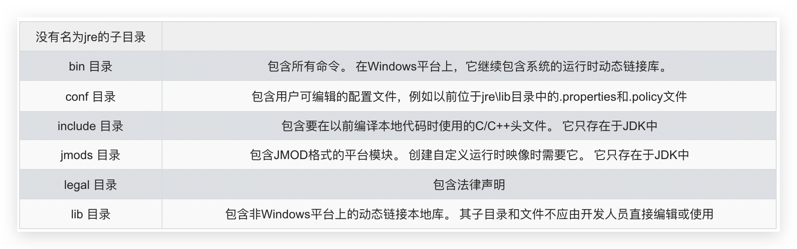

# 16 9,10,11 新特性

[[toc]]

从Java 9 这个版本开始，Java 的计划发布周期是 6 个月，下一个 Java 的主版本将于 2018 年 3 月发布，命名为 Java 18.3，紧接着再过六个月将发布 Java18.9。这意味着Java的更新从传统的以特性驱动的发布周期，转变为以时间驱动的(6 个月为周期)发布模式，并逐步的将 Oracle JDK 原商业特性进行开源。针对企业客户的需求，Oracle 将以三年为周期发布长期支持版本(long term
support)。

## Java 9 新特性

Java 9 提供了超过150项新功能特性，包括备受期待的模块化系统、可交互的 REPL 工具jshell，JDK 编译工具，Java 公共 API 和私有代码，以及安全增强、扩展提升、性能管理改善等。可以说Java 9是一个庞大的系统工程， 完全做了一个整体改变。官方提供的[新特性列表](https://docs.oracle.com/javase/9/whatsnew/toc.htm#JSNEW-GUID-C23AFD78-C777-460B-8ACE-58BE5EA681F6)，或参考 [Open JDK](http://openjdk.java.net/projects/jdk9/)

*   系统方面
    *   模块化系统 
    *   jShell命令 
*   语法方面
    *   接口的私有方法
    *   钻石操作符的使用升级
    *   语法改进：try 语句
*   API方面
    *   String 存储结构变更
    *   便利的集合特性：`of()`
    *   增强的 Stream API
    *   全新的 HTTP 客户端 API
    *   Deprecated 相关 API
*   多版本兼容jar包 
*   Javadoc 的 HTML5支持
*   Javascript 引擎升级：Nashorn
*   Java 的动态编译器


### JDK 和 JRE 目录结构变化





### 模块化系统：Jigsaw—>Modularity

谈到 Java 9 大家往往第一个想到的就是 Jigsaw 项目。众所周知，Java 已经 发展超过 20 年(95 年最初发布)，Java 和相关生态在不断丰富的同时也越 来越暴露出一些问题：

*   Java 运行环境的膨胀和臃肿。每次JVM启动的时候，至少会有30~60MB的内存 加载，主要原因是JVM需要加载`rt.jar`，不管其中的类是否被classloader加载，第一步整个jar都会被JVM加载到内存当中去(而模块化可以根据模块的需要加载程序运行需要的class) 
*   当代码库越来越大，创建复杂，盘根错节的“意大利面条式代码”的几率呈指数级的 增长。不同版本的类库交叉依赖导致让人头疼的问题，这些都阻碍了 Java 开发和 运行效率的提升。 
*   很难真正地对代码进行封装, 而系统并没有对不同部分(也就是 JAR 文件)之间 的依赖关系有个明确的概念。每一个公共类都可以被类路径之下任何其它的公共 类所访问到，这样就会导致无意中使用了并不想被公开访问的 API。 

本质上讲也就是说，用**模块来管理各个package**，通过声明某个package暴露，，模块(module)的概念，其实就是package外再裹一层，**不声明默认就是隐藏**。因此，模块化使得代码组织上更安全，因为它可以指定哪些部分可以暴露，哪些部分隐藏。 

实现目标：

-   模块化的主要目的在于减少内存的开销 
-   只须必要模块，而非全部jdk模块，可简化各种类库和大型应用的开发和维护 
-   改进 Java SE 平台，使其可以适应不同大小的计算设备 
-   改进其安全性，可维护性，提高性能 

模块将由通常的类和新的模块声明文件(`module-info.java`，在 src 目录下)组成。该文件是位于java代码结构的顶层，该模块描述符明确地定义了我们的模块需要什么依赖关系， 以及哪些模块被外部使用。在`exports`子句中未提及的所有包默认情况下将封装在模块中，不能在外部使用。`requires`指明对其它模块的依赖。和 ES6一样。


### Java 的 REPL工具：jShell 命令

产生背景：像Python 和 Scala 之类的语言早就有交互式编程环境 REPL (read - evaluate - print - loop)了，以交互式的方式对语句和表达式进行求值。开发者只需要输入一些代码， 就可以在编译前获得对程序的反馈。而之前的Java版本要想执行代码，必须创建文件、声明类、提供测试方法方可实现。 

设计理念：即写即得、快速运行

实现目标：

-   Java 9 中终于拥有了 REPL工具:jShell。让Java可以像脚本语言一样运行，从控制台启动jShell，利用jShell在没有创建类的情况下直接声明变量，计算表达式， 执行语句。即开发时可以在命令行里直接运行Java的代码，而无需创建Java文 件，无需跟人解释”public static void main(String[] args)”这句废话。 
-   jShell也可以从文件中加载语句或者将语句保存到文件中。 
-   jShell也可以是tab键进行自动补全和自动添加分号。 

调出jShell

```bash
jshell
```

 获取帮助

```bash
/help intro
```

.....


### 接口的私有方法

Java 8中规定接口中的方法除了抽象方法之外，还可以定义静态方法 和默认的方法。一定程度上，扩展了接口的功能，此时的接口更像是一个抽象类。 在Java 9中，接口更加的灵活和强大，连方法的访问权限修饰符都可 以声明为private的了，此时方法将不会成为你对外暴露的API的一部分。

详细查看前面部分笔记


### 钻石操作符使用升级

我们将能够与匿名实现类共同使用钻石操作符 (diamond operator) 在Java 8中如下的操作是会报错的：

```java
Comparator<Object> com = new Comparator<>(){
  @Override
  public int compare(Object o1, Object o2) { 
    return 0;
  } 
};
```

编译报错信息：`Cannot use “<>” with anonymous inner classes.`

Java 9中可以正常执行通过 


### try语句

Java 8 中，可以实现资源的自动关闭（实现了 Closeable），但是要求执行后必须关闭的所有资源必须在try子句中初始化，否则编译不通过。如下：

```java
try(InputStreamReader reader = new InputStreamReader(System.in)){ 
  //读取数据细节省略
}catch (IOException e){ 
  e.printStackTrace();
}
```

Java 9 中，用资源语句编写try将更容易，我们可以在try子句中使用已经初始 化过的资源，此时的资源是final的：

```java
InputStreamReader reader = new InputStreamReader(System.in); 
OutputStreamWriter writer = new OutputStreamWriter(System.out); 
try (reader; writer) {
  //reader是final的，不可再被赋值 
  //reader = null; 
  //具体读写操作省略
} catch (IOException e) { 
  e.printStackTrace();
}
```


### String 存储结构变更

Motivation 

The current implementation of the String class stores characters in a char array, using two bytes (sixteen bits) for each character. Data gathered from many different applications indicates that strings are a major component of heap usage and, moreover, that most String objects contain only Latin-1 characters. Such characters require only one byte of storage, hence half of the space in the internal char arrays of such String objects is going unused. 

Description 

We propose to change the internal representation of the String class from a UTF-16 char array to a byte array plus an encoding-flag field. The new String class will store characters encoded either as ISO-8859-1/Latin-1 (one byte per character), or as UTF-16 (two bytes per character), based upon the contents of the string. The encoding flag will indicate which encoding is used. 

String 再也不用 `char[]`来存储，改成了 `byte[]` 加上编码标记，节约了一些空间。 

```java
public final class String implements java.io.Serializable, Comparable<String>, CharSequence { 
  @Stable
	private final byte[] value;
}
```

那 StringBuffer 和 StringBuilder 是否仍无动于衷呢?都变了！

String-related classes such as AbstractStringBuilder, StringBuilder, and StringBuffer will be updated to use the same representation, as will the HotSpot VM‘s intrinsic(固有的、内置的) string operations.


### 集合工厂方法：快速创建只读集合

要创建一个只读、不可改变的集合，必须构造和分配它，然后添加元素，最后 包装成一个不可修改的集合。

```java
List<String> namesList = new ArrayList <>(); 
namesList.add("Joe"); 
namesList.add("Bob"); 
namesList.add("Bill");

namesList = Collections.unmodifiableList(namesList); 
System.out.println(namesList);

List<String> list = Collections.unmodifiableList(Arrays.asList("a", "b", "c")); 
Set<String> set = Collections.unmodifiableSet(new HashSet<>(Arrays.asList("a", "b", "c")));
```

缺点：我们一下写了五行。即它不能表达为单个表达式。Java 9因此引入了方便的方法，这使得类似的事情更容易表达。

```java
List<String> list = List.of("a", "b", "c");
Set<String> set = Set.of("a", "b", "c");
Map<String, Integer> map1 = Map.of("Tom", 12, "Jerry", 21, "Lilei", 33, "HanMeimei", 18);
Map<String, Integer> map2 = Map.ofEntries(Map.entry("Tom", 89), Map.entry("Jim", 78), Map.entry("Tim", 98));
```

调用集合中静态方法`of()`，可以将不同数量的参数传输到此工厂方法中。此功能 可用于Set和List，也可用于Map的类似形式。此时得到的集合，是不可变的:在 创建后，继续添加元素到这些集合会导致 “UnsupportedOperationException” 。 由于Java 8中接口方法的实现，可以直接在List，Set和Map的接口内定义这些方法， 便于调用。


### InputStream 加强

`InputStream` 终于有了一个非常有用的方法`transferTo`，可以用来将数据直接传输到 `OutputStream`，这是在处理原始数据流时非常常见的一种用法，如下示例。 

```java
ClassLoader cl = this.getClass().getClassLoader();
try (InputStream is = cl.getResourceAsStream("hello.txt");OutputStream os = new FileOutputStream("src\\hello1.txt")) { 
  is.transferTo(os); // 把输入流中的所有数据直接自动地复制到输出流中
} catch (IOException e) { 
  e.printStackTrace();
}
```


### 增强的 Stream API

在 Java 9 中，Stream API 变得更好，Stream 接口中添加了 4 个新的方法：`takeWhile`, `dropWhile`, `ofNullable`，还有个 `iterate` 方法的新重载方法，可以让你提供一个 Predicate (判断条件)来指定什么时候结束迭代。 

除了对 Stream 本身的扩展，Optional 和 Stream 之间的结合也得到了改进。 现在可以通过 Optional 的新方法 stream() 将一个 Optional 对象转换为一个 (可能是空的) Stream 对象。 

*   `takeWhile()`

    用于从 Stream 中**获取一部分数据**，接收一个 Predicate 来进行选择。在有序的 Stream 中，`takeWhile` 返回**从开头开始**的尽量多的元素。 

    ```java
    List<Integer> list = Arrays.asList(45, 43, 76, 87, 42, 77, 90, 73, 67, 88); 
    list.stream().takeWhile(x -> x < 50).forEach(System.out::println);
    
    System.out.println();
    
    list = Arrays.asList(1, 2, 3, 4, 5, 6, 7, 8); 
    list.stream().takeWhile(x -> x < 5).forEach(System.out::println);
    ```

*   `dropWhile()`

    dropWhile 的行为与 takeWhile 相反，返回**剩余**的元素。 

    ```java
    List<Integer> list = Arrays.asList(45, 43, 76, 87, 42, 77, 90, 73, 67, 88); 
    list.stream().dropWhile(x -> x < 50).forEach(System.out::println); 
    
    System.out.println();
    
    list = Arrays.asList(1, 2, 3, 4, 5, 6, 7, 8);
    list.stream().dropWhile(x -> x < 5).forEach(System.out::println);
    ```

*   `ofNullable()`

    Java 8 中 Stream 不能**存储单个null（只有一个元素，且为 null；多个 null 可以）**，否则会报空指针异常。而 Java 9 中的 `ofNullable` 方法允许我们创建**一个单元素（只能一个）** Stream，可以包含一个非空元素，也可以创建一个空 Stream。 

    ```java
    // 报NullPointerException
    // Stream<Object> stream1 = Stream.of(null);
    // System.out.println(stream1.count());
    // 不报异常，允许通过
    Stream<String> stringStream = Stream.of("AA", "BB", null); 
    System.out.println(stringStream.count());// 3
    // 不报异常，允许通过
    List<String> list = new ArrayList<>();
    list.add("AA");
    list.add(null); 
    System.out.println(list.stream().count());// 2
    // ofNullable():允许值为null
    Stream<Object> stream1 = Stream.ofNullable(null); System.out.println(stream1.count());// 0
    Stream<String> stream = Stream.ofNullable("hello world"); 
    System.out.println(stream.count());// 1
    ```

*   `iterate()`重载 

    这个 iterate 方法的新重载方法，可以让你提供一个 Predicate (判断条件)来指定什么时候结束迭代。 

    ```java
    // 原来的控制终止方式:
    Stream.iterate(1, i -> i + 1).limit(10).forEach(System.out::println);
    // 现在的终止方式:
    Stream.iterate(1, i -> i < 100, i -> i + 1).forEach(System.out::println);
    ```

    

### Optional 获取 Stream 的方法

*   Optional类中`stream()`的使用 

    ```java
    List<String> list = new ArrayList<>(); 
    list.add("Tom");
    list.add("Jerry");
    list.add("Tim");
    
    Optional<List<String>> optional = Optional.ofNullable(list); 
    Stream<List<String>> stream = optional.stream(); 
    stream.flatMap(x -> x.stream()).forEach(System.out::println);
    ```

    

### Javascript引擎升级：Nashorn

Nashorn 项目在 JDK 9 中得到改进，它为 Java 提供轻量级的 Javascript 运行时。 Nashorn 项目跟随 Netscape 的 Rhino 项目，目的是为了在 Java 中实现一个高性能但轻量级的 Javascript 运行时。Nashorn 项目使得 Java 应用能够嵌入 Javascript。它在 JDK 8 中为 Java 提供一个 Javascript 引擎。 

JDK 9 包含一个用来解析 Nashorn 的 ECMAScript 语法树的 API。这个 API 使得 IDE 和服务端框架不需要依赖 Nashorn 项目的内部实现类，就能够分析 ECMAScript 代码。 


## Java 10 新特性

JDK10一共定义了109个新特性，其中包含12个JEP（对于程序员来讲，真正的新特性其实就一个），还有一些新API和JVM规范以及JAVA语言规范上的改动。JDK10的12个JEP（JDK Enhancement Proposal特性加强提议）参阅[官方文档](http://openjdk.java.net/projects/jdk/10/)

*   286: Local-Variable Type Inference **局部变量类型推断**
*   296: Consolidate the JDK Forest into a Single Repository JDK库的合并
*   304: Garbage-Collector Interface 统一的垃圾回收接口
*   307: Parallel Full GC for G1 为G1提供并行的Full GC
*   310: Application Class-Data Sharing 应用程序类数据(AppCDS)共享
*   312: Thread-Local Handshakes ThreadLocal握手交互
*   313: Remove the Native-Header Generation Tool (javah) 移除JDK中附带的javah工具 
*   314: Additional Unicode Language-Tag Extensions 使用附加的Unicode语言标记扩展 
*   316: Heap Allocation on Alternative Memory Devices 能将堆内存占用分配给用户指定 的备用内存设备
*   317: Experimental Java-Based JIT Compiler 使用基于Java的JIT编译器
*   319: Root Certificates 根证书
*   322: Time-Based Release Versioning 基于时间的发布版本 

### 局部变量类型推断

*   产生背景

    开发者经常抱怨Java中引用代码的程度。局部变量的显示类型声明，常常被认为是不必须的，给一个好听的名字经常可以很清楚的表达出下面应该怎样继续。

*   好处

    减少了啰嗦和形式的代码，避免了信息冗余，而且对齐了变量名，更容易阅读! 

*   举例如下

    *   场景一：类实例化时，在声明一个变量时，我们总是习惯了敲打两次变量类型，第 一次用于声明变量类型，第二次用于构造器。

        ```java
        LinkedHashSet<Integer> set = new LinkedHashSet<>();
        ```

    *   场景二：返回值类型含复杂泛型结构。变量的声明类型书写复杂且较长，尤其是加上泛型的使用

        ```java
        Iterator<Map.Entry<Integer, Student>> iterator = set.iterator();
        ```

    *   场景三：经常声明一种变量，它只会被使用一次，而且是用在下一行代码中

        ```java
        URL url = new URL("http://www.atguigu.com"); 
        URLConnection connection = url.openConnection(); 
        Reader reader = new BufferedReader(new InputStreamReader(connection.getInputStream()));
        ```

        尽管 IDE可以帮我们自动完成这些代码，但当变量总是跳来跳去的时候，可读性还是会受到影响，因为变量类型的名称由各种不同长度的字符组成。而且， 有时候开发人员会尽力避免声明中间变量，因为**太多的类型声明只会分散注意力，不会带来额外的好处**。

*   工作原理

    在处理 var 时，编译器先是查看表达式右边部分，并根据右边变量值的类型进行推断，作为左边变量的类型，然后将该类型写入字节码当中。 

*   注意：

    *   var不是一个关键字

        你不需要担心变量名或方法名会与 var发生冲突，因为 var实际上并不是一个关键字， 而是一个类型名，只有在编译器需要知道类型的地方才需要用到它。除此之外，它就是一个普通合法的标识符。也就是说，除了不能用它作为类名，其他的都可以， 但极少人会用它作为类名。

    *   这不是JavaScript 

        首先我要说明的是，var并不会改变Java是一门静态类型语言的事实。编译器负责推断出类型，并把结果写入字节码文件，就好像是开发人员自己敲入类型一样。 下面是使用 IntelliJ（实际上是 Fernflower的反编译器）反编译器反编译出的代码

        ```java
        var url = new URL("http://www.atguigu.com"); 
        var connection = url.openConnection();
        var reader = new BufferedReader(new InputStreamReader(connection.getInputStream()));
        ```

        ||

        ```java
        URL url = new URL("http://www.atguigu.com"); 
        URLConnection connection = url.openConnection(); 
        BufferedReader reader = new BufferedReader(new InputStreamReader(connection.getInputStream()));
        ```

        从代码来看，就好像之前已经声明了这些类型一样。事实上，这一特性**只发生在编译阶段**，与运行时无关，所以对运行时的性能不会产生任何影响。所以请放心，这不是 JavaScript。 

*   **适用于以下情况**：

    ```java
    //1.局部变量的初始化，右边尽量写上
    var list = new ArrayList<>(); 
    
    //2.增强for循环中的索引 
    for(var v : list) {
      System.out.println(v);
    }
    
    //3.传统for循环中
    for(var i = 0;i < 100;i++) {
      System.out.println(i);
    }
    ```

*   在局部变量中使用时，如下情况不适用：

    ```java
    // 局部变量不赋值，就不能实现类型推断
    // var num ;
    
    // 没有初始化的局部变量声明
    // var s = null;
    
    // lambda表示式中，左边的函数式接口不能声明为var
    // Supplier<Double> sup = () -> Math.random();
    // var sup = () -> Math.random();
    
    // 方法引用中，左边的函数式接口不能声明为var
    // Consumer<String> con = System.out::println;
    // var con = System.out::println;
    
    // 数组的静态初始化中，注意如下的情况也不可以
    // int[] arr = {1, 2, 3, 4};
    // var arr = {1,2,3,4};
    
    // catch块
    // try{
    //
    // } catch(var e){
    //    e.printStackTrace();
    // }
    
    // 方法的返回类型
    // public var method1() {}
    
    // 方法的参数类型
    // public void method2(var num){}
    
    // 构造器的参数类型
    // public JavaTest(var i){}
    ```


###  集合新增创建不可变集合的方法

自 Java 9 开始，Jdk 里面为集合(List / Set / Map)都添加了 `of`（jdk9新增）和 `copyOf`（jdk10新增）方法，它们两个都用来创建不可变的集合，来看下它们的使用和区别。 

```java
//示例1:
var list1 = List.of("Java", "Python", "C"); 
var copy1 = List.copyOf(list1); System.out.println(list1 == copy1); // true
//示例2:
var list2 = new ArrayList<String>();
var copy2 = List.copyOf(list2); System.out.println(list2 == copy2); // false
//示例1和2代码基本一致，为什么一个为true,一个为false?
//从源码分析，可以看出 copyOf 方法会先判断来源集合是不是 AbstractImmutableList 类型的，如果是，就直接返回，如果不是，则调用 of 创 建一个新的集合。
```

注意：使用`of`和`copyOf`创建的集合为不可变集合，不能进行添加、删除、替换、 排序等操作，不然会报 `java.lang.UnsupportedOperationException`异常。


## Java 11 新特性

北京时间 2018年9 月 26 日，Oracle 官方宣布 Java 11 正式发布。这是 Java 大版本周期变化后的第一个长期支持版本，非常值得关注。从官网即可下载，最新发布的 Java11 将带来 ZGC、Http Client 等重要特性，一共包 含 17 个 JEP（JDK Enhancement Proposals，JDK 增强提案）。其实，总共更新不止17个，只是我们更关注如下的17个 JEP 更新。  参阅[官方文档](http://openjdk.java.net/projects/jdk/11/)

*   181: Nest-Based Access Control（基于嵌套的访问控制）
*   309: Dynamic Class-File Constants（动态的类文件常量）
*   315: Improve Aarch64 Intrinsics（改进 Aarch64 Intrinsics）
*   318: Epsilon: A No-Op Garbage Collector（Epsilon 垃圾回收器，又被称为"No-Op(无操作) "回收器 ）
*   320: Remove the Java EE and CORBA Modules（移除 Java EE 和 CORBA 模块，JavaFX 也已被移除）
*   321: HTTP Client (Standard)
*   323: Local-Variable Syntax for Lambda Parameters（用于 Lambda 参数的局部变量语法 ）
*   324: Key Agreement with Curve25519 and Curve448（采用 Curve25519 和 Curve448 算法 实现的密钥协议）
*   327: Unicode 10
*   328: Flight Recorder（飞行记录仪，黑匣子）
*   329: ChaCha20 and Poly1305 Cryptographic Algorithms（实现 ChaCha20 和 Poly1305 加密算法）
*   330: Launch Single-File Source-Code Programs（启动单个 Java 源代码文件的程序）
*   331: Low-Overhead Heap Profiling（低开销的堆分配采样方法）
*   332: Transport Layer Security (TLS) 1.3（对 TLS 1.3 的支持）
*   333: ZGC: A Scalable Low-Latency Garbage Collector (Experimental)（ZGC:可伸缩的低延迟垃圾回收器，实验阶段）
*   335: Deprecate the Nashorn JavaScript Engine（弃用 Nashorn JavaScript 引擎）
*   336: Deprecate the Pack200 Tools and API（弃用 Pack200 工具及其 API ）

对于企业来说，选择 11 将意味着长期的、可靠的、可预测的技术路线图。 其中免费的OpenJDK11 确定将得到 OpenJDK 社区的长期支持， LTS 版本将 是可以放心选择的版本。 新的长期支持版本**每三年发布一次**，根据后续的发布计划，下一个长期支持版 **Java 17** 将于2021年发布。 

从 JVM **GC** 的角度，JDK11 引入了两种新的 GC，其中包括也许是划时代意义的 **`ZGC`**，虽然其目前还是实验特性，但是从能力上来看这是 JDK 的一个巨大突破，为特定生产环境的苛刻需求提供了一个可能的选择。例如对部分企业核心存储等产品，如果能够保证不超过 10ms 的 GC 暂停，可靠性会上一个大的台阶，这是过去我们进行 GC 调优几乎做不到的，是能与不能的问题。

###  字符串处理方法

*   判断字符串是否为空白   `" ".isBlank(); // true ` 
*   去除首尾空白   `" Javastack ".strip(); // "Javastack" ` ，和 `trim()` 一样
*   去除尾部空格   `" Javastack ".stripTrailing(); // " Javastack" ` 
*   去除首部空格   `" Javastack ".stripLeading(); // "Javastack " ` 
*   复制字符串   `"Java".repeat(3);// "JavaJavaJava" ` 
*   行数统计   `"A\nB\nC".lines().count(); // 3 ` 	


### Optional 加强 

Optional 也增加了几个非常酷的方法，现在可以很方便的将一个 Optional 转换 成一个 Stream, 或者当一个空 Optional 时给它一个替代的。 

*   `boolean isEmpty()`  判断`value`是否为空。与 `isPresent()`相反。JDK 11 
*   `ifPresentOrElse(Consumer<?  super T> action, Runnable emptyAction)`  value非空，执行参数1功能；如果value 为空，执行参数2功能。JDK 9 
*    `Optional<T> or(Supplier<?  extends Optional<? extends T>> supplier)`  value非空，返回对应的Optional；value为空，返回形参封装的Optional。JDK 9 
*    `Stream<T> stream()`  value非空，返回仅包含此value的 Stream；否则，返回一个空的Stream。JDK 9 
*    `T orElseThrow()`  value非空，返回value；否则抛异常`NoSuchElementException`。JDK 10


###  局部变量类型推断升级

在var上添加注解的语法格式，在jdk10中是不能实现的。在JDK11中加入了这样的语法。 

```java
//错误的形式: 必须要有类型, 可以加上var 
//Consumer<String> con1 = (@Deprecated t) -> System.out.println(t.toUpperCase());
//正确的形式: 
//使用var的好处是在使用lambda表达式时给参数加上注解。 
Consumer<String> con2 = (@Deprecated var t) -> System.out.println(t.toUpperCase());
```


### 全新的HTTP 客户端API

HTTP，用于传输网页的协议，早在1997年就被采用在目前的1.1版本中。直到2015年，HTTP2才成为标准。 

HTTP/1.1和HTTP/2的主要区别是如何在客户端和服务器之间构建和传输数据。 HTTP/1.1依赖于请求/响应周期。 HTTP/2允许服务器“push”数据：它可以发送比客户端请求更多的数据。这使得它可以优先处理并发送对于首先加载网页至关重要的数据。 

这是 Java 9 开始引入的一个处理 HTTP 请求的的 HTTP Client API，该 API 支持同步和异步，而在 Java 11 中已经为正式可用状态，你可以在 java.net 包中找到这个 API。 它将替代仅适用于 blocking 模式的 HttpURLConnection（HttpURLConnection是在HTTP 1.0的时代创建的，并使用了协议无关的方法），并提供对WebSocket 和 HTTP/2的支持。 

```java
// 同步
HttpClient client = HttpClient.newHttpClient();
HttpRequest request = HttpRequest.newBuilder(URI.create("http://127.0.0.1:8080/test/")).build(); 
BodyHandler<String> responseBodyHandler = BodyHandlers.ofString(); 
HttpResponse<String> response = client.send(request, responseBodyHandler); 
String body = response.body();
System.out.println(body);
```

```java
// 异步
HttpClient client = HttpClient.newHttpClient();
HttpRequest request = HttpRequest.newBuilder(URI.create("http://127.0.0.1:8080/test/")).build(); 
BodyHandler<String> responseBodyHandler = BodyHandlers.ofString(); 
CompletableFuture<HttpResponse<String>> sendAsync = client.sendAsync(request, responseBodyHandler);
sendAsync.thenApply(t -> t.body()).thenAccept(System.out::println); 
//HttpResponse<String> response = sendAsync.get();
//String body = response.body();
//System.out.println(body);
```


### 更简化的编译运行程序

在我们的认知里面，要运行一个 Java 源代码必须先编译，再运行，两步执行动作。 而在未来的 Java 11 版本中，通过一个 java 命令就直接搞定了，如以下所示：

```bash
java Javastack.java
```

一个命令编译运行源代码的注意点：

*   执行源文件中的第一个类（文件中存放位置），第一个类必须包含`mian()`方法。
*   并且**不可以使用其它源文件**中的自定义类，本文件中的自定义类是可以使用的。 


### 废弃 Nashorn 引擎，启用 GraalVM

废除Nashorn javascript引擎，在后续版本准备移除掉，有需要的可以考虑使用 **`GraalVM`**。 


### ZGC

*   GC是java主要优势之一。 然而，当GC停顿太长，就会开始影响应用的响应时间。消除或者减少GC停顿时长，java将对更广泛的应用场景是一个更有吸引力的平台。此外，现代系统中可用内存不断增长，用户和程序员希望JVM能够以高效的方式充分利用这些内存，并且无需长时间的GC暂停时间。 

*   ZGC, A Scalable Low-Latency Garbage Collector（Experimental）, 这应该是JDK11最为瞩目的特性，没有之一。 但是后面带了Experimental，说明这还不建议用到生产环境。

*   ZGC是一个并发，基于region, 压缩型的垃圾收集器，只有root扫描阶段会 STW(stop the world)，因此GC停顿时间不会随着堆的增长和存活对象的增长而变长。

    优势:

    *   GC暂停时间不会超过10ms
    *   既能处理几百兆的小堆, 也能处理几个T的大堆(OMG)
    *   和G1相比, 应用吞吐能力不会下降超过15%
    *   为未来的GC功能和利用colord指针以及Load barriers优化奠定基础 
    *   初始只支持64位系统  

*   ZGC的设计目标是：支持TB级内存容量，暂停时间低(<10ms)，对整个程序吞吐量的影响小于15%。 将来还可以扩展实现机制，以支持不少令人 兴奋的功能，例如多层堆(即热对象置于DRAM和冷对象置于NVMe闪存)， 或压缩堆。 


## 在当前JDK中看不到什么？

### 一个标准化和轻量级的JSON API

一个标准化和轻量级的JSON API被许多Java开发人员所青睐。但是由于资金问 题无法在Java当前版本中见到，但并不会削减掉。Java平台首席架构师Mark Reinhold在JDK 9邮件列中说:“这个JEP将是平台上的一个有用的补充，但是在 计划中，它并不像Oracle资助的其他功能那么重要，可能会重新考虑JDK 10或 更高版本中实现。 ”


### 新的货币 API

对许多应用而言货币价值都是一个关键的特性，但JDK对此却几乎没有任何支持。 严格来讲，现有的`java.util.Currency`类只是代表了当前ISO 4217货币的一个数据结构， 但并**没有关联的值或者自定义货币**。JDK对货币的运算及转换也没有内建的支持， 更别说有一个能够代表货币值的标准类型了。 

此前，Oracle 公布的JSR 354定义了一套新的Java货币API：`JavaMoney`，计划会在Java 9中正式引入。但是目前没有出现在JDK 新特性中。不过，如果你用的是Maven的话，可以做如下的添加，即可使用相关的API处理货币：

```xml
<dependency> 
  <groupId>org.javamoney</groupId> 
  <artifactId>moneta</artifactId> 
  <version>0.9</version>
</dependency>
```


## 展望

随着云计算和 AI 等技术浪潮，当前的计算模式和场景正在发生翻天覆地的变化，不仅对 Java 的发展速度提出了更高要求，也深刻影响着 Java 技术的发展方向。传统的大型企业或互联网应用，正在被云端、容器化应用、模块化的微服务甚至是函数(FaaS， Function-as-a-Service)所替代。

Java虽然标榜面向对象编程，却毫不顾忌的加入面向接口编程思想，又扯出匿名对象之概念，每增加一个新的东西，对Java的根本所在的面向对象思想的一次冲击。反观Python，抓住面向对象的本质，又能在函数编程思想方面游刃有余。Java对标C/C++，以抛掉内存管理为卖点，却又陷入了JVM优化的噩梦。选择比努力更重要，选择Java的人更需要对它有更清晰的认识。 

Java 需要在新的计算场景下，改进开发效率。这话说的有点笼统，我谈一些自己的体会，Java 代码虽然进行了一些类型推断等改进，更易用的集合 API 等， 但仍然给开发者留下了过于刻板、形式主义的印象，这是一个长期的改进方向。 

