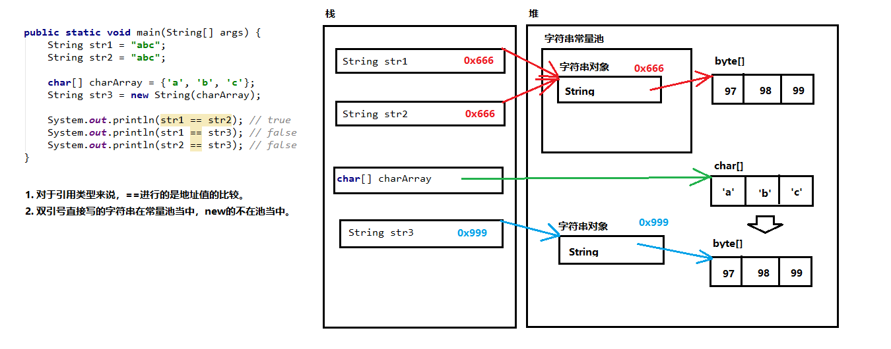
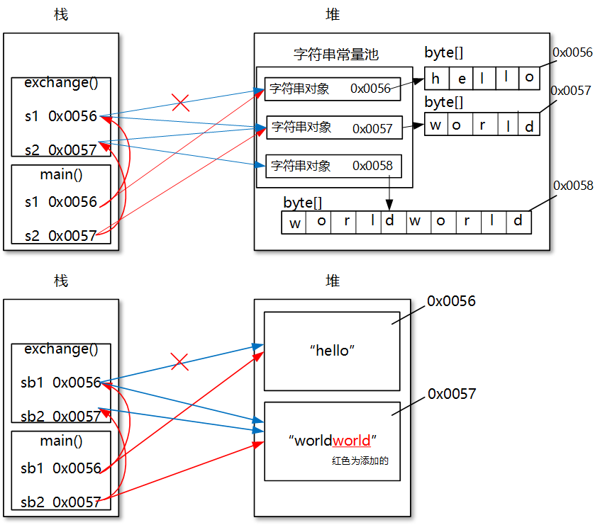

# 字符串

## String（java.lang）

### 简介

`String`效果上相当于`char[]`（Java 8 及之前），但底层是被`final`修饰的`byte[]`（Java 9 及之后）。且其实现了`Serializable`，`Comparable`，`CharSequence`接口。`String`**类**及其所有**属性**都被**声明为`final`**，是**常量**，其**值（地址值，不是底层数组）在创建后不能被更改**。

### 不可变性

由于它的底层结构，具有**不可变性**：

- 当对字符串重新赋值时，需要**重写指定内存区域赋值**，不能使用原有的 value 进行赋值

- 当执行`concat`，`substring`，`replace`等操作都**需要重新指定内存区域赋值**（与常量池无关）

- 字符串的`+`运算，若是**存在变量相加，先开空间再拼接，结果在堆中**；**只有常量则先拼接（类似字面量赋值），然后在常量池中找**，有就返回，没有就创建并放入常量池。如果拼接的结果调用`intern()`方法，**返回值就在常量池中**。字符串常量池中不会存储相同内容的字符串。

- 加`final`修饰的也是常量！

  ```java
  String str1 = "hello";
  String str2 = "hello";
  char[] charArray = {'h', 'e', 'l', 'l', 'o'};
  String str3 = new String(charArray);
  String str4 = "world";
  String str5 = "helloworld";

  System.out.println(str1 == str2);//true
  System.out.println(str1 == str3);//false，同理str2!=str3
  System.out.println(str5 == str1 + str4);//false
  System.out.println(str5 == "hello" + "world");//true
  System.out.println(str5 == str1 + "world");//false
  System.out.println(str5 == (str1 + "world").intern());//true
  System.out.println(str3.equals(str1));//true

  // 注意final
  String s1 = "helloworld";
  String s2 = "hello";
  String s3 = s2 + "world";
  System.out.println(s1 == s3);// false

  String s11 = "helloworld";
  final String s22 = "hello";
  String s33 = s22 + "world";
  System.out.println(s11== s33);// true
  ```

- 通过**字面量直接赋值**的定义字符串的会**放入（Java8）方法区（具体实现为元空间）的字符串常量池**中；但是**`new String`方式定义的不会放入**。



- 特别的，注意**对象中的 String 属性**

  ```java
  Person t1 = new Person("tom", 1);
  t1.setName("hh");
  t1.name = "xx";
  Person t2 = new Person("tom", 1);
  t2.setName("hh");
  t2.name = "xx";
  System.out.println(t1.name == t2.name);// "=="比较地址值，三处赋值操作都为 true，因此值在常量池中！
  ```

### 构造方法

- `String()`：初始化一个新创建的 String 对象，使其表示一个空字符序列

- `String(String original)`：初始化一个新创建的 String 对象

- `String(char/byte[] value [,int offset,int count])`：分配一个新的 String，它包含取自字符数组参数全部（或一个子数组）的字符

- `String(byte[] bytes[,int offset,int length][,String charsetName])`：通过使用指定的**字符集解码**指定的 byte （或子）数组，构造一个新的 String

- `String s = "hello"`：直接创建新的 String

  **字面值**作为**字符串对象**（新创建的字符串是该参数字符串的副本）和通过**构造方法**创建对象的不同

  ```java
  String s = new String("hello");
  String s = "hello";
  ```

  前者最多创建两对象，后者最多创建一个对象

- ……

### 常用方法

:::tip

**不改变原 String 值**

:::

**判断功能**

- `boolean isEmpty()` 字符串长度是否为 0

- `boolean contains(CharSequence cs)` 字符串中是否包含指定字符序列

- `boolean equals(Object anObject)` 字符串与指定字符串是否相等(**内容**)，推荐**常量放前面**

  `boolean equalsIgnoreCase(String str)` 字符串与指定字符串是否相等，忽略大小写

- `boolean startsWith(String prefix[,int toffset])` 从指定索引开始的子串是否以 prefix 开始

  `boolean endsWith(String suffix)` 字符串是否以 suffix 后缀结尾

- `boolean matches(String regex)` 判断此字符串是否匹配给定的正则表达式

**获取功能**

- `int length()`：返回字符串长度

- `String concat(String str)` 将字符串**拼接，本字符串不变**，常用`+`

- `char charAt(int index)` 返回指定索引的字符

- `int indexOf/lastIndexOf(int ch/String str)` 获取指定字符/字符串第一次/最后一次出现的索引

- `int indexOf/lastIndexOf(int ch/String str,int fromIndex)` 获取指定~从**[某索引开始**第一次出现的索引/最后一次出现的索引（从指定的索引开始**反向搜索**，但返回值还是正向数数）

  `ch`是`int`类型原因：`'a'`和`97`都能代表`'a'`

  ```JAVA
  String s = "qqqqqaq";
  int a = s.lastIndexOf("a",5);//大于等于5都能搜到，值为5；小于则返回值为-1
  ```

- `String substring(int startIndex[,int endIndex])` 获取`[start,end)`子串，没 end 到结尾

**替换**

- `String replace(CharSequence/char target, CharSequence/char replacement)`将**所有**target 字符或字符串替换为新的 replacement 字符串。CharSequence 是接口，String 实现了它。用于敏感词汇过滤
- `String replaceAll(String regex, String replacement)`使用给定的 replacement 替换此字符串所有**匹配给定的正则表达式的子字符串**

- `String replaceFirst(String regex, String replacement)`使用给定的 replacement 替换此字符串**匹配给定的正则表达式的第一个子字符串**

**转换功能**

- `String static valueOf(int i/char[] chs)` **静态方法**将 int 型和**字符数组型**数据转为字符串
- `String toLowerCase() /toUpperCase()` 将所有字符都转换为小写/大写，本身不变

- `byte[] getBytes([Charset c/String c])` 将字符串**转换为字节数组**；相反则直接构造器传入
- `char[] toCharArray()` 将字符串**转换为字符数组**；相反则直接构造器传入

**其他功能**

- **去空格**（去掉字符串**首尾**空格）

  `String trim()`

- **按字典比较**（按字典顺序比较，在 str 前返回负数，在 str 后返回正数，相等则返回 0）

  `int compareTo(String str)/compareIgnoreCase(String str)`

- **切片**：根据给定**正则表达式 regex**的匹配切片，返回字符串数组，**不包括 regex 字符串**。**最多不超过 limit 个**，如果超过了，剩下的全部都放到最后一个元素中。若要用英文句点`.`切分，必须写`\\.`。

  `String[] split(String regex [,int limit])`

  ```java
  String fbIds = "4542,4540,";
  String[] split = fbIds.split(",");
  System.out.println(split.length);// 2
  ```

- 若常量池中包括了一个等于此 String 对象的字符串（由 equals 确定），则返回池中字符串；否则将此字符串添加到池中，并返回其引用

  `inter()`

### 类型转换

String 与 基本类型或包装类型之间转换

- 基本类型 ——> 字符串：
  - **`基本类型的值+""`**：最简单方法，常用
  - **String 类的静态方法`valueOf(参数)`**
  - **包装类的静态方法`toString(参数)`**，不是 Object 类的`toString()`方法，重载
- 字符串 ——> 基本类型：
  - **包装类的静态方法`parseXxx()`**
  - **包装类的静态方法`valueOf(参数)`，转包装类后再转基本类型**

### 习题

- 字符串遍历 `char charAt(int index)`或`char[] toCharArray()`

- 统计大串中小串出现的次数 `int indexOf(String str,int fromIndex)`或`substring`

- 把字符串的首字母转成大写，其他小写 `String substring(int start,int end)`

- 把一个小数转换为保留两位小数的字符串，不考虑四舍五入：加空串转为字符串，再用 split 即可

  - 若考虑四舍五入，则可以将保留的数转为整数，再根据后一位值对整数进行加 1 与否

- 字符串必须只有字母和数字，如下是不是这种情况的：

  `(ch<='0'||ch>='9') && (ch<='A'||ch>='Z') && (ch<='a'||ch>='z')`

## StringBuilder（java.lang）

> StringBuffer 比 StringBuilder 每个方法都多 synchronized

`StringBuilder`(字符串缓冲区)，又称为**可变字符序列**，表示**字符容器**，其**内容和长度可变**，不同步，线程不安全。没有`override`Object 类的`equals()`方法，不能像 String 类对象可以用操作符+进行连接。

### 底层分析

- 它的**底层**是一个**`char[]`**（**Java 9 后为`byte[]`**），用来存放字符串内容

- 调用构造方法（默认长度为`s.length()+16`）或添加字符串时都会调用`append()`，并更新`count`即 StringBuilder 的长度，可通过`length()`获取

  它还有个属性`capacity`代表 StringBuilder 的容量，即底层数组的`length`，可通过`capacity()`获取

- 若添加的数据导致底层数据存不下了（大于），需扩容底层数组：

  - 先通过`count+s.length()`减去底层数组的`length`即 StringBuilder 的`capacity()` ，若大于 0 则扩容

  - 调用`Arrays.copyOf(char[] original,int newLength)`将原数组拷贝到新数组，底层为`System.arraycopy`，其中`newLength`为底层数组原有`capacity`**左移一位（即乘 2）并加 2**

    若左移一次后还不够，则直接用`count+s.length()`；甚至左移后超出范围变负值（之后再总结）

### 构造方法：

- `StringBuilder();`构造一个空的 StringBuilder 容器。
- `StringBuilder(String str)`：构造一个 StringBuilder 容器，并将字符串添加进去。
- `StringBuilder(int capacity)`：构造一个 StringBuilder 容器，并设置初始`capacity`。**推荐**使用。

### 常用方法

**在原 StringBuilder 对象中改变并返回本身**，原对象也改变

- **增**
  - `StringBuilder append(Object o)` 添加**任意类型数据**的**字符串形式**到末尾，并**返回当前对象**自身
  - `StringBuilder append(CharSequence c,int start,int end)`：插入其中[start,end)部分
  - `StringBuilder insert(int offset,Object o)` 在字符串的**offset 位置**插入**任意对象**，其余后移
- **删**
  - `StringBuilder delete(int start,int end)` 删除从**[start 到 end)**的字符串
  - `StringBuilder deleteCharAt(int index)` 删除指定位置字符
- **改**
  - `StringBuilder replace(int start,int end,String s)` 从**[start 到 end)**的对象替换为指定字符串
  - `void setCharAt(int index,char ch)` **替换指定位置的字符**
- **查**
  - `char charAt(int n)` 返回指定索引处的字符
  - `int indexOf(String str)` 返回指定字符串所在索引
- **反转**
  - `StringBuilder reverse()` 反转
- **截取（返回值类型不再是 StringBuilder 本身，原有对象不改变）**
  - `String substring(int start,int end)` 截取子串，没有 end 参数时截取到尾部
- **其他**

  - `int length()` 返回 StringBuilder 的长度（不是 capacity）
  - `void setLength(int newLength)` 设置 StringBuilder 长度
  - `int capacity()` 返回 StringBuilder 的容量
  - `public String toString()` 将当前 StringBuilder 对象**转换为 String 对象**

- **String 和 StringBuilder 转换**

  1. **String ---> StringBuilder** 通过构造函数传入或构造好之后 append()

  2. **StringBuilder ---> String** 调用`toString()`或 String 类的`valueOf()`静态方法

     ```java
     String str1 = sb.toString();
     String str2 = String.valueOf(sb);
     ```

### 试题

- **String、StringBuffer、StringBuilder 区别**

  - **String 内容、长度不可变，后两个可变**。String 拼接时，总是会在内存中创建一个新对象，影响性能
  - **StringBuffer 是同步的，数据安全，效率低；StringBuilder（5.0 新增）是不同步的，数据不安全，效率高**
  - 底层都是`char[]`（java8 中）；后两个初始创建**长度为`s.length()+16`的数组**，

- **StringBuilder 和数组的区别**

  二者都可以看做装其他数据的容器，但是 StringBuilder 的数据最终是一个字符串数据，而数组可以存放多种类型的数据，但必须是同一种数据类型的

- **参数传递问题**

  - 注意：（以下画图即可理解，如下图）

    **包装类、String 作为引用数据类型，是常量，具有不可变性。**

    **StringBuffer、StringBuilder 在赋值时不改变内容，调用方法时改变**

    **【重点】在于 String 内容不可变并且变量相加需要开空间再拼接，StringBuilder 等内容可以变**

```java
  String s1 = "hello";
  String s2 = "world";
  System.out.println(s1+"---"+s2);//hello---world
  change(s1,s2);
  System.out.println(s1+"---"+s2);//hello---world

  StringBuffer sb1 = new StringBuffer("hello");
  StringBuffer sb2 = new StringBuffer("world");
  System.out.println(sb1+"---"+sb2);//hello---world
  change(sb1,sb2);
  System.out.println(sb1+"---"+sb2);//hello---worldworld

  public static void change(String s1, String s2) {
  	s1 = s2;
  	s2 = s1+s2;
  }
  public static void change(StringBuffer sb1, StringBuffer sb2) {
  	sb1 = sb2;
  	sb2 = sb1.append(sb2);
  }
```



## StringJoiner（java.util）

> Java8 新增工具类，低层使用`StringBuilder`实现

`StringJoiner` 用于构造由 `delimiter`（界定符） 分隔的字符序列，并可选地以提供的`prefix`开头和以提供的`suffix`结尾。

在将某些内容添加到`StringJoiner`之前，其`sj.toString()`方法默认情况下将返回前缀 + 后缀。但是，如果调用`setEmptyValue()`方法，则将返回提供的 emptyValue 。例如，在使用集合符号创建表示空集合的字符串（即`{}`，前缀为`{`，后缀为`}`且未向 `StringJoiner` 添加任何内容）时，可以使用此方法。

- 例子：字符串`[George:Sally:Fred]`可能是由如下如下方式构造的：

  ```java
  StringJoiner sj = new StringJoiner(":", "[", "]");
  sj.add("George").add("Sally").add("Fred");
  String desiredString = sj.toString();
  ```

## Stream（java.util）

> 底层使用`StringJoiner`实现

- 语法

  ```java
  java.util.stream.Collectors.joining(CharSequence delimiter, CharSequence prefix, CharSequence suffix)
  ```

- 例子（效果同`StringJoiner`一样）

  ```java
  List<Integer> numbers = Arrays.asList(1, 2, 3, 4);
  String commaSeparatedNumbers = numbers.stream()
      .map(i -> i.toString())
      .collect(Collectors.joining(", "));
  ```
