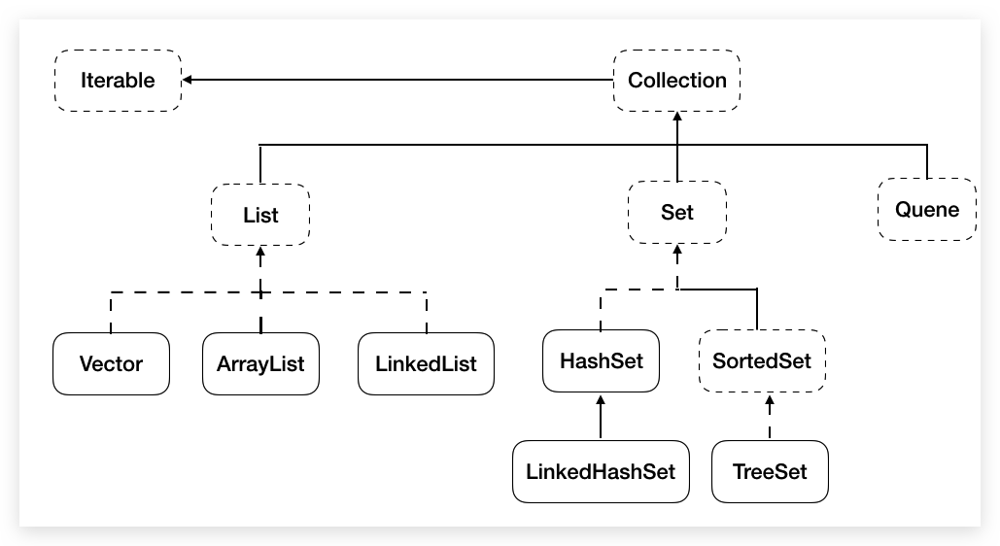

# Collection

:::tip 容器由来

- **对象数组：**数组可以存储基本数据类型和引用类型，存储引用类型的数组就叫**对象数组**

- **容器（container）**
- **由来** Java-->面向对象-->操作很多对象-->存储-->容器
  - **容器与数组的区别**
    1. **长度** 数组固定，容器（集合）可变
    2. **存储类型** 数组可以是基本类型和引用类型，容器（集合）只能是引用类型
    3. **元素类型** 数组只能存储同一类型，容器（集合）可以存储不同类型（一般也存储同一种类型）
    4. 方法 数组方法有限，增删改非常不便，效率也不高；集合就不同了，可选择性多
    5. 数据结构 数组元素有序可重复；集合可选择多

:::

## Collection（java.util）

### 简介

`Collection`是所有**单列集合**的**父接口**，在`Collection`中定义了单列集合`List`、`Set`和`Queue`通用的一些方法，这些方法可用于操作所有的单列集合。

由于其**重写**了`toString()`方法，所以可以直接打印其内容。这点与数组不同，数组需要借助`Arrays`工具类



### 常用方法

::: tip 注意

`Collection`如下方法底层会调用`equals()`判断，所以操作自定义类型时需要**重写**`equals()`

:::

- **添加**
  - `boolean add(E e)`：添加该对象到下一个索引，当成一个元素
  - `boolean addAll(Collection c)`：复制容器中其每一个元素，每个单独添加
- **删除**
  - `void clear()`：删除集合中所有元素，但集合还存在
  - `boolean remove(Object o)`：区别 List 中的
  - `boolean removeAll(Collection c)`：差集关系
  - `default boolean removeIf(Predicate<? super E> filter)`：根据条件删除
- **判断**
  - `boolean isEmpty()`
  - `boolean contains(Object o)` ：
  - `boolean containsAll(Collection<?> c)` ：**子集**关系
  - `boolean equals(Object o)`：（根据实际对象可能根据元素顺序依次）对比每个元素
  - `int hashCode()`
- **交集**
  - `boolean retainAll(Collection<?> c)`：交集
- **获取容量**
  - `int size()`
- **返回迭代器**，`Collection`特有
  - `Iterator iterator()`
- **集合**转**数组**
  - `Object[] toArray()`
- **Stream 流**

## Iterable（java.lang）

`Collection`接口继承了`java.lang.Iterable`接口，该接口有一个`iterator()`方法，返回一个实现了`Iterator`接口的对象。

## Iterator（java.util）

- `Iterator`对象称为迭代器（设计模式的一种），主要用于遍历 `Collection` 集合中的元素。
- GOF 给迭代器模式的定义为：提供一种方法访问一个容器（container）对象中各个元素，而又不需暴露该对象的内部细节。迭代器模式，就是为容器而生。类似于“公交车上的售票员”、“火车上的乘务员”、“空姐”。——检票
- `Iterator` **仅用于遍历集合**，`Iterator` 本身并不提供承装对象的能力。如果需要创建`Iterator` 对象，则必须有一个被迭代的集合。集合对象**每次**调用`iterator()`方法都得到一个**全新的迭代器对象**，**默认游标都在集合的第一个元素之前**。

常用方法：

- `Iterator<E> iterator()`: **获取`Collection`对应的迭代器**，用来遍历集合中的元素的。这个接口的泛型跟着所属集合走，集合是什么泛型，迭代器就是什么泛型。**每次调用都会得到一个全新的迭代器对象**。

- `boolean hasNext()`：如果**容器中还有元素可以迭代**，则**返回 true**。

- `E next()`：指针下移，并返回迭代的**元素**。

- `default void remove()`：删除集合的元素。但是是遍历过程中通过迭代器对象的`remove`方法，**不是集合对象的`remove`方法**。如果还未调用`next()`或在上一次调用 `next()` 方法之后已经调用了 `remove` 方法，再调用`remove`都会报`IllegalStateException`。

- ```java
    Iterator<String> iterator = c.iterator();
    while (iterator.hasNext()) {
        // iterator.remove();// 错误
        String next = iterator.next();
        if ("123".equals(next)) {
            iterator.remove();
        }
        // iterator.remove();// 错误
    }
  ```

* 迭代器执行原理如下：

  

  在调用`it.next()`方法之前必须要调用`it.hasNext()`进行检测。若不调用，且下一条记录无效，会抛出`NoSuchElementException`异常。

  `Iterator`迭代器对象在遍历集合时，内部采用指针的方式来跟踪集合中的元素。在调用`Iterator`的`next()`方法之前，迭代器的索引位于**第一个元素之前**，不指向任何元素，当第一次调用迭代器的`next()`方法后，迭代器的**索引会向后移动一位，指向第一个元素并将该元素返回**，当再次~。依此类推，直到`hasNext()`方法返回 false，表示到达了集合的末尾，终止对元素的遍历。

## for each 循环

- 增强 for 循环（也称 foreach 循环）是**JDK1.5**以后出来的一个高级 for 循环，专门用来**遍历`Array`和`Collection`**。它的内部**原理其实是个`Iterator`迭代器**，所以在遍历的过程中，**尽量不要对`Collection`中的元素进行增删操作**。

- `Collection<E> extends Iterable<E>`，（**所有 Collection**）实现此接口允许对象成为“**foreach**”语句目标。

  ```java
  ArrayList<String> arraylist = new ArrayList<>();
  for(String s:arraylist){
      System.out.println(s);
  }
  ```

## 并发修改异常

- `ConcurrentModificationException`现象：**迭代器遍历集合，集合修改集合元素**

- 原因：迭代器依赖于集合，而集合的改变导致迭代器预期的迭代次数发生改变

- 解决：

  - **迭代器遍历，并利用`Iterator`的`remove`方法**
  - **集合遍历，集合修改**（利用`get()`和`size()`），增加元素在集合末尾

  - 删除元素时并跟上 break 语句
