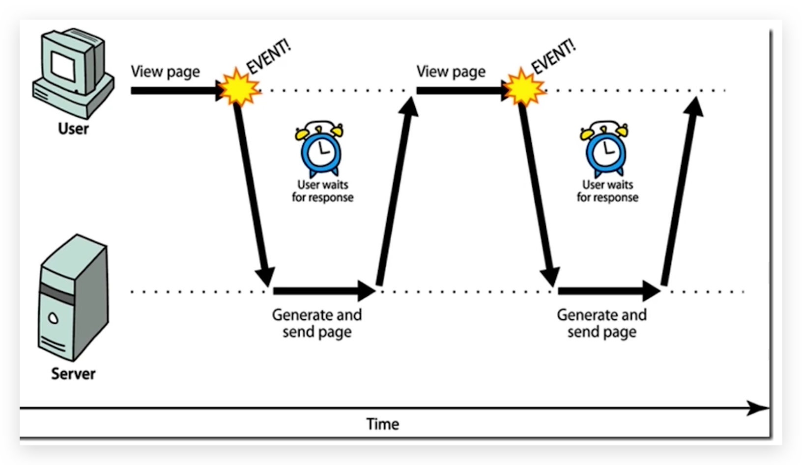
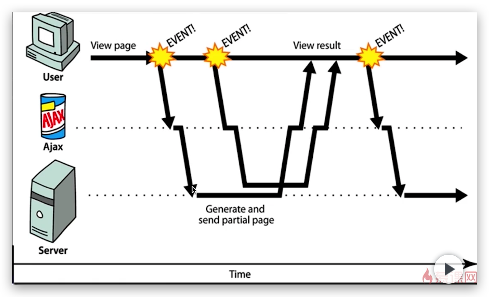

# 多线程基本概念

## 操作系统、程序、进程、线程

### 操作系统（OS）

操作系统（OS）是包含多个进程的容器，而每个进程又都是容纳多个线程的容器


### 程序（Program）

程序是为完成特定任务、用某种语言编写的一组**指令的集合**。即指**一段静态的代码**，**静态对象**。


### 进程（Process）🔥

**进程是正在运行的一个程序。是程序的一次执行过程**，是**系统进行资源分配的基本单位**

- 每个进程都有一个**独立的内存空间**，一个应用程序多次运行对应多个进程。
- 它是一个**动态的过程**，系统运行一个程序即是一个进程从创建、运行到消亡的过程，即生命周期。

Oracle 文档中定义进程是：使用fork（2）系统调用创建的UNIX环境（例如文件描述符，用户ID等），它被设置为运行程序

可以使用活动监视器查看，有进程、线程数量等


### 线程（Thread）🔥

**线程是进程中的一个执行单元/路径**，负责当前进程中程序的执行，是**处理机调度的基本单位**

Oracle 文档中定义线程是：在进程上下文中执行的一系列指令

- **每个线程拥有独立的运行栈和程序计数器**

- **一个进程中的多个线程共享相同的内存单元/内存地址空间**：它们从同一堆中分配对象，可以访问相同的变量和对象。这就使得线程间通信更简便、高效。但多个线程操作共享的系统资源可能会带来**安全隐患**

- **线程切换的开销小**

- 线程**一对一映射**到OS的内核线程，使用JNI实现的。若是支持协程的语言，可能几十个协程对应一个OS线程

    


### 【面试】进程和线程的关系和区别？🔥

<iframe id="embed_dom" name="embed_dom" frameborder="0" style="display:block;width:100%; height:645px;" src="https://www.processon.com/embed/601eac54e0b34d41a74224b6"></iframe>


### 【实例】一个 Java 应用程序至少有三个线程🔥

一个 Java 应用程序，至少有三个线程？：**main()主线程**，**gc()垃圾回收线程**，**异常处理线程**。当然如果发生异常，会影响主线程。查看debugger 模式时可以看到如下代码的线程

```java
public class Test {
    public static void main(String[] args) {
        System.out.println();
    }
}
```


*   main：主线程，程序的入口
*   Finalizer：负责对象的 finalize() 方法，垃圾回收，不推荐主动使用
*   Reference Handler：和 GC、引用相关的线程
*   Signal Dispatcher：信号调度，把操作系统发来的信号分发给适当的处理程序


### 【实例】房子

*   客厅：每个线程随时进出
*   厨房：线程并发，线程间通信
*   卫生间：需有锁
*   卧室：线程独立资源，如堆栈


## 多线程

### 概念

若**一个进程同一时间并行执行多个线程**，就是支持多线程的。一个进程中**至少有一个线程**


### 为什么需要多线程、优点 🔥

若是单核 CPU，只使用单个线程先后完成多个任务(调用多个方法)，肯定比用多个线程来完成用的时间更短（线程切换时间长），但是目前大部分都是多核 CPU，那多线程究竟有什么好处呢？为什么要使用多线程？

*   最主要的目的就是**提高CPU利用率**
    *   提高**处理速度**
    *   避免**无效等待**（IO时可以做其他事）
    *   **提高用户体验**，应用程序响应快，避免卡顿，缩短等待时间
        *   并行处理，提高性能，通常是服务器领域（例如Tomcat），用多个线程去接收进来的HTTP请求，而不是排队等待单一的线程处理
        *   在Android开发中，主线程的重要任务之一是绘制屏幕界面，即 UI 线程，该线程中不允许进行IO操作或网络请求，目的就是避免卡顿，影响用户的交互

*   **便于编程建模，改善程序结构**

    把这个大的任务A分解成几个小任务，任务B、任务C、任务D，分别建立程序模型，并通过多线程分别运行这几个任务，便于理解和修改

* **计算机性能定律：摩尔定律失效，阿姆达尔定律登上舞台**

    *   摩尔定律：当价格不变时，集成电路上可容纳的**元器件的数目**，约每隔18-24个月便会**增加一倍**，**性能也将提升一倍**。
    *   阿姆达尔定律：
        *   结论：一般情况下，处理器越多，程序执行的速度就会越快，但是会有一个上限，上限取决于程序中串行部分的比例，**并行的比例越高，多处理器的效果越明显**。但是大部分程序都是串行占比多！


### 单核、多核 CPU

- 单核 CPU，其实是一种假的多线程，因为在一个时间单元内，也只能执行一个线程的任务。例如：虽然有多车道，但是收费站只有一个工作人员在收费，只有收了费才能通过，那么 CPU 就好比收费人员。如果有某个人不想交钱，那么收费人员可以 把他“挂起”（晾着他，等他想通了，准备好了钱，再去收费）。但是因为 CPU 时间单元特别短，因此感觉不出来。
- 多核 CPU，能更好的发挥多线程的效率。现在的服务器都是多核的。


### 多线程的使用场景 🔥

- 为了**同时做多件不同的事**：开网页同时听歌；后台定时任务

- **为了提高工作效率、处理能力**：Tomcat；并行下载；NIO

    程序需要实现一些需要**等待的任务**时，如用户输入、文件读写操作、网络操作、搜索等

- 需要同时有很大并发量的时候：压测


### 多线程局限 🔥

*   性能问题：**上下文切换的消耗**
*   带来**线程安全问题**：
    *   **数据安全**问题：i++总数不一致
    *   **线程活跃性**问题：线程饥饿、死锁
*   异构化任务（任务结构不一样）很难高效并行。即对于串行任务无法改造为多线程


## 串行、并发、并行

### 异同 🔥

*   串行：按顺序执行
*   **并发**：指两个或多个线程在**同一个时间段内**发生，**逻辑上**同时发生，单核即可实现。左图

- **并行**：指两个或多个线程在**同一时刻**发生（同时发生），**物理上**同时发生，多核可以实现。**并行一定是并发，反之不是**。右图


### 是什么让并发和并行称为可能？🔥

*   CPU 升级，单核速度越来越快，多核
*   操作系统升级，抢占式任务处理，时间片轮转；多核操作升级
*   编程语言升级，支持并发


## 高并发

### 什么是高并发？

服务器短时间可以处理非常多个请求，如双十一、过年微信摇一摇红包


### 高并发和多线程的联系和不同？🔥

*   **多线程**是高并发其中一种重要的**解决方案**，**高并发**是一种服务器**状态**
*   高并发并不意味着是多线程，如 Redis


### 高并发的指标

*   QPS（Queries Per Second）：每秒查询数

*   TPS：每秒处理事务数

*   带宽

*   PV（Page View）：一天访问量。。。

*   UV（Unique Visitor）：一天访问量去重

*   IP：不同 IP 访问量

*   并发连接数（The number of concurrent connections）

*   服务器平均请求等待时间 TPR（Time per request）：across all concurrent request

    


## 同步异步、阻塞非阻塞

### 同步、异步 🔥

**被调用者**是否**主动告诉**调用者结果，不主动就需要调用者不断去检查了

鸣笛烧水壶就是异步的示例






### 阻塞、非阻塞 🔥

**调用者**（线程发出请求，如HTTP）是否阻塞等待


### 组合 🔥

*   同步阻塞：开始烧水后，我们一直盯着水壶
*   同步非阻塞：开始烧水后，我们每隔三五分钟过来看一下水壶
*   异步阻塞：带有鸣笛的水壶开始烧水后，我们一直盯着水壶。常用于结果影响后续进程
*   异步非阻塞：带有鸣笛的水壶开始烧水后，我们干其他事去了，鸣笛后再过来


## 线程的创建和使用

### java.lang.Thread

**静态常量**

- `Thread.MAX_PRIORITY`：10
- `Thread.MIN _PRIORITY`：1
- `Thread.NORM_PRIORITY`：5，默认

**构造方法**

- **`Thread()`**：分配一个新的线程对象。
- **`Thread(String name)`**：分配一个指定名字的新的线程对象
- **`Thread(Runnable target)`**：分配一个带有指定目标新的线程对象，它实现了 Runnable 接口中的`run`方法
- **`Thread(Runnable target,String name)`**：分配一个带有指定目标新的线程对象并指定名字

**常用方法 1**

- `void run()`：**线程在被调度时执行的操作**，若 target 有值，则调用 target 的`run()` 方法
- `void start()`：**启动线程，JVM 执行此线程对象的`run()`方法**
- `static Thread currentThread()`：返回当前线程，在 Thread 子类中就是 this，通常用于主线程和 Runnable 实现类
- `String getName()`：**获取当前线程名称**
- `void setName()`：**设置当前线程名称**，或通过线程**类的有参构造设置**

**常用方法 2**

- 线程**优先级**：通过`getPriority()`获取，通过`setPriority()`设置。

* `static void yield()`：**线程让步**

  **暂停**当前正在执行的线程（系统指定的毫秒数），把执行机会让给优先级相同或更高的线程，并执行其他线程。若队列中没有同优先级的线程，忽略此方法。**转为就绪状态**，该线程不会失去任何监视器的所有权（**不释放锁**），不会阻塞该线程。不确保真正让出，很少用。

* `th.join()`：**线程插队**

  当某个程序执行流中调用其他线程的`join()`方法时，调用线程将被**阻塞**，直到`join()`方法加入的 join 线程执行完毕，其他线程才可以抢占资源。

* `static void sleep(long millis)`：**线程睡眠**

  使**当前正在执行的线程**以指定的毫秒数**睡眠**，**不释放锁**，~~之后进入**阻塞**状态~~

- `th.interrupt()`：**中断线程**

  **请求终止线程**，仅设置了一个标志位，中断一个不在活动状态（阻塞）的线程没意义并会抛异常

  - 静态方法`interrupted()`-->**会清除中断标志位**
  - 普通方法`isInterrupted()`-->**不会清除中断标志位**

- `boolean isAlive()`：判断线程是否还**存活**

- ~~`th.stop()`：`@Deprecated(since="1.2")`~~

### 线程的分类

守护线程和用户线程在几乎每个方面都是相同的，唯一的区别是**判断 JVM 何时离开**

- 守护线程（后台线程，如坦克大战）
  - **守护线程是用来服务用户线程的**，通过在`start()`方法前调用`th.setDaemon(true)`可以把一个用户线程变成一个守护线程
  - **Java 垃圾回收**就是一个典型的守护线程
  - **若 JVM 中都是守护线程，当前 JVM 将退出**
- 用户线程

### 线程的创建方式

#### 继承 Thread 类

1.  定义子类继承 Thread 类。可以写无参和带参构造以便直接定义线程名称。
2.  子类中 Override 重写 Thread 类的`run()`方法，将线程的任务代码封装到`run()`方法中。
3.  创建 Thread 的子类对象，即创建了线程对象。
4.  调用线程对象的**`start()`**，JVM 将调用该线程的**`run()`**方法执行（多次启动一个线程非法，即使执行完毕）

#### 实现 Runnable 接口

1.  定义类实现 Runnable 接口
2.  @Override 重写接口中的`run()`方法，将线程的任务代码封装到`run()`方法中
3.  通过 Thread 类创建线程对象，并将 Runnable 接口的子类对象作为 Thread 类的构造函数的参数进行传递。**线程的任务都封装在 Runnable 接口实现类对象的 run 方法中，所以要在线程对象创建时就必须明确要运行的任务**
4.  调用**`start()`开启线程**，JVM 调用该线程的**`run()`**方法执行（多次启动一个线程非法，即使执行完毕）

#### 实现 Callable 接口

与使用 Runnable 相比， Callable 功能更强大些（JDK5.0 新增）：

- 使用`FutureTask`类封装实现了 `Callable` 接口的实现类，并传入 `Thread` 的构造方法中，调用 `start` 方法

- 相比`run()`方法需要实现 `call()` 方法，可以有**返回值**（支持**泛型**），可以**抛出异常**

  调用`FutureTask`的`get()`**阻塞等待任务代码执行完毕，获取返回值**

`Future`接口：

- 可以对具`Runnable`、`Callable`任务的执行结果进行取消、查询是否完成、获取结果等。
- `FutrueTask`是`Futrue`接口的**唯一的实现类**
- `FutureTask`同时实现了`Runnable`,`Future`接口。它既可以作为`Runnable`被线程执行，又可以作为`Future`得到`Callable`的返回值

#### 线程池

- 背景：经常创建和销毁、使用量特别大的资源，比如并发情况下的线程， 对性能影响很大。
- **线程池**：其实就是一个**容纳多个线程的容器**，其中的**线程可以反复使用**，使用完**自动归还**，省去了频繁创建线程对象的操作， 无需反复创建线程而消耗过多资源。
- 好处：
  - **降低资源消耗**（重复利用线程池中线程，不需要每次都创建）
  - **提高响应速度**（减少了创建新线程的时间）
  - **便于线程管理**
- **JDK 5.0 起**提供了线程池的顶级**接口**是 `java.util.concurrent.Executor`，但是严格意义上讲它只是一个**执行线程的工具**。**真正的线程池接口是 `java.util.concurrent.ExecutorService`** （官方建议**使用`java.util.concurrent.Executors`线程池工厂类**来创建线程池对象）：
  - `void execute(Runnable command)`：执行任务/命令，没有返回值，一般用来执行 `Runnable`
  - `<T> Future<T> submit(Callable<T> task)`：执行任务，有返回值，一般又来执行 `Callable`
  - `void shutdown()`：关闭线程池，不建议执行
- 常见`ExecutorService`线程池对象有：
  - `ExecutorService static newCachedThreadPool()`：可根据需要创建新线程的线程池
  - `ExecutorService static newFixedThreadPool(int maxThreads)`：可重用固定线程数的线程池
  - `ExecutorService static newSingleThreadExecutor()`：只有一个线程的线程池
  - `ExecutorService static newScheduledThreadPool(n)`：可安排在给定延迟后运行命令或者定期地执行
- 参数（常考）：
  - corePoolSize：核心池的大小
  - maximumPoolSize：最大线程数
  - keepAliveTime：线程没有任务时最多保持多长时间后会终止
  - setRejectedExecutionHandler
  - setThreadFactory

**匿名内部类实现多线程**

- **继承 Thread 类**

  ```java
  new Thread() {
  	@Override
  	public void run() {
  		for (int i = 0; i < 100; i++) {
  			System.out.println(getName() + "---" + i);
  		}
  	}
  }.start();
  ```

- **实现 Runnable 接口**

  ```java
  //lambda表达式实现
  new Thread(() -> {
      for (int i = 0; i < 100; i++) {
          System.out.println(Thread.currentThread().getName() + "---" + i);
      }
  }).start();
  //普通实现
  new Thread(new Runnable() {
  	@Override
  	public void run() {
  		for (int i = 0; i < 100; i++) {
  			System.out.println(Thread.currentThread().getName() + "---" + i);
  		}
  	}
  }).start();
  ```

* **实现 Callable 接口**

  ```java
  //普通实现
  class CallableThread implements Callable<Integer> {

      @Override
      public Integer call() throws Exception {
          int sum = 0;
          for (int i = 0; i < 100; i++) {
              System.out.println(Thread.currentThread().getName() + ":" + i);
              sum += i;
          }
          return sum;
      }
  }

  public class CallableTest {

      public static void main(String[] args) {
          CallableThread callableThread = new CallableThread();
          FutureTask<Integer> futureTask = new FutureTask<>(callableThread);
          new Thread(futureTask).start();
          Integer o = null;
          try {
              o = futureTask.get();
          } catch (InterruptedException | ExecutionException e) {
              e.printStackTrace();
          }
          System.out.println(o);
      }
  }

  //lambda表达式实现->方法引用
  public class CallableTest {

      public static void main(String[] args) {

          FutureTask<Integer> futureTask = new FutureTask(CallableTest::call);
          new Thread(futureTask).start();
          Integer o = null;
          try {
              o = futureTask.get();
          } catch (InterruptedException | ExecutionException e) {
              e.printStackTrace();
          }
          System.out.println(o);
      }

      private static Integer call() {
          int sum = 0;
          for (int i = 0; i < 100; i++) {
              System.out.println(Thread.currentThread().getName() + ":" + i);
              sum += i;
          }
          return sum;
      }
  }
  ```

* **线程池**

  ```java
  ExecutorService service = Executors.newFixedThreadPool(10);
  ThreadPoolExecutor service1 = (ThreadPoolExecutor) service;
  // 设置线程池的属性
  // System.out.println(service.getClass());
  // service1.setCorePoolSize(15);
  // service1.setKeepAliveTime();
  service.execute(new NumberThread());//适合适用于Runnable
  service.execute(new NumberThread1());//适合适用于Runnable
  service.submit(Callable callable);//适合使用于Callable
  //关闭连接池
  service.shutdown();
  ```

**区别**（实现 Runnable 接口的好处，其实 Thread 类也实现了 Runnable 接口）

1.  避免了 Java**单继承的局限性**

2.  多个线程可以共享同一个接口实现类的对象，非常适合多个相同线程来**处理同一个资源**

    增加程序的健壮性，实现**解耦**操作，代码可以被多个线程共享，**代码和线程独立**

3.  **线程池**只能放入实现 Runable 或 Callable 类线程，不能直接放入继承 Thread 的类

**`run()`和`start()`的区别**

- `run()`：仅仅是封装被线程执行的代码，直接调用是普通方法。
- `start()`：首先启动了线程，然后再由 jvm 去调用该线程的 run()方法。

**多线程的运行过程**

> **Java 程序运行原理（多线程）**：由 Java 命令启动 JVM（相当于启动了一个进程），接着由该进程创建启动多个线程，至少三个线程可以分析出来：**执行 main()函数的主线程**，该线程的任务代码都定义在 main 函数中，**负责垃圾回收的 GC 线程**，以及**异常处理线程**

- 多线程执行时，其实**每一个执行线程**都有一片自己**所属的栈内存**空间（还有 PC）。进行**方法的压栈和弹栈**。


### 线程调度

- **线程调度模型**（应用程序的执行都是**CPU 在多个线程间快速切换**完成的）
  - **分时调度模型（时间片）**：所有线程轮流使用 CPU 的使用权，平均分配每个线程占用 CPU 的时间片
  - **抢占式调度模型**：优先让**优先级高**的线程使用 CPU，如果线程的优先级相同，那么会随机选择一个，优先级高的线程获取的 CPU 时间片相对多一些
- **Java 的线程调度方法**
  - **同优先级**线程组成**先进先出队列**（先到先服务），使用**时间片**策略
  - 对**高优先级**，使用优先调度的**抢占式**策略

### 线程优先级

- 线程的优先级等级（通过 Thread 的静态常量）
  - `Thread.MAX_PRIORITY`：10
  - `Thread.MIN _PRIORITY`：1
  - `Thread.NORM_PRIORITY`：5，默认
- 方法
  - `getPriority()`：返回线程优先级
  - `setPriority(int newPriority)`：改变线程的优先级，需在 start 前设置
- 说明
  - **线程创建时继承父线程的优先级**
  - **低优先级只是获得调度的概率低**，并非一定是在高优先级线程之后才被调用


## 线程的生命周期

当线程被创建并启动以后，它既不是一启动就进入了执行状态，也不是一直处于执行状态。在线程的生命周期中， 有几种状态呢？在 API 中 **`java.lang.Thread`** **中的`State`内部枚举类中给出了六种线程状态**：

- **新建**：当一个 Thread 类或其子类的对象被声明并创建时，但是并未启动即调用 `start()`，新生的线程对象处于新建状态

  > **NEW**：Thread state for a thread which has not yet started.

- **可运行**：处于新建状态的线程被`start()`后，可能正在 JVM 中执行，也可能正在等待来自操作系统的其他资源如处理器

  > **RUNNABLE**：state for a runnable thread. A thread in the runnable state is executing in the Java virtual machine but it may be waiting for other resources from the operating system such as processor.

- **阻塞**：当一个线程试图获取一个对象锁，而该对象锁被其他的线程持有，则该线程进入 Blocked 状态；当该线程持有锁时，该线程将变成 Runnable 状态。

  > **BLOCKED**：Thread state for a thread blocked waiting for a monitor lock.A thread in the blocked state is waiting for a monitor lock to enter a synchronized block/method or reenter a synchronized block/method after calling `Object.wait`.

- **无限等待**：一个线程在等待另一个线程执行一个（唤醒）动作时，该线程进入 Waiting 状态。这个状态后是不能自动唤醒的

  > **WAITING**：state for a waiting thread.A thread is in the waiting state due to calling one of the following methods:
  >
  > - `Object.wait` with no timeout
  >
  > - `th.join` with no timeout
  >
  > - `LockSupport.park`
  >
  >   A thread in the waiting state is waiting for another thread to perform a particular action.
  >
  > For example, a thread that has called `Object.wait()` on an object is waiting for another thread to call `Object.notify()` or `Object.notifyAll()` on that object. A thread that has called `th.join()` is waiting for a specified thread to terminate.

- **计时等待**：同 waiting 状态，有几个方法有超时参数，调用他们将进入 Timed Waiting 状态。这一状态将一直保持到超时期满或者接收到唤醒通知。

  > **TIMED_WAITING**：Thread state for a waiting thread with a specified waiting time. A thread is in the timed waiting state due to calling one of the following methods with a specified positive waiting time:
  >
  > - `Thread.sleep`must with timeout
  > - `Object.wait` with timeout
  > - `th.join` with timeout
  > - `LockSupport.parkNanos`
  > - `LockSupport.parkUntil`

- **被终止**：因为`run`方法正常退出而终止（完成全部工作），或者因为没有捕获的异常终止了`run`方法而死亡，或者或线程被提前强制性地中止。

  > TERMINATED：Thread state for a terminated thread. The thread has completed execution.


释放锁和不释放锁的操作（未完）

释放锁的操作

- 当前线程的同步方法、同步代码块**执行结束**。
- 当前线程在同步代码块、同步方法中遇到**break、return 终止**了该代码块、该方法的继续执行。
- 当前线程在同步代码块、同步方法中出现了**未处理的 Error 或 Exception，导致异常结束**。
- 当前线程在同步代码块、同步方法中执行了线程对象的**`wait()`方法，当前线程暂停，并释放锁**。

不释放锁的操作

- 线程执行同步代码块或同步方法时，程序调用`Thread.sleep()`、`Thread.yield()`方法暂停当前线程的执行

- 线程执行同步代码块时，其他线程调用了该线程的`suspend()`方法将该线程 挂起，该线程不会释放锁(同步监视器)

  应尽量避免使用`suspend()`和`resume()`来控制线程

## 7.4 线程安全和同步

### 线程安全问题

- **卖票问题**

  - 相同的票出现多次：CPU 的一次操作必须是原子性的（但是输出语句不是原子的）
  - 出现负数的票：随机性和延迟导致

- **线程安全问题产生原因**

  - 多个线程在操作共享数据

  - 操作共享数据的代码有多条

    **当一个线程在执行操作共享数据的多条代码（非原子操作）过程中，其他线程参与了运算，就会导致**

### 线程同步

要解决上述多线程并发访问一个资源的安全性问题：也就是解决重复票与不存在票问题，Java 中提供了**同步机制 (synchronized)**来解决。有三种方式完成同步操作：**同步代码块**、**同步方法**、**Lock 锁机制**。

- **同步的优缺点：**
  - **好处**：解决线程的安全问题
  - **弊端**：相对**降低效率**，因为同步外的线程都会判断同步锁；若有**同步嵌套容易产生死锁**

#### 同步代码块

- `synchronized`关键字可以用于**方法中的某个区块中**，表示只对这个区块的**资源实行互斥访问**

  - **同步锁**：也称**对象锁**或对象**监视器**
    - 锁对象可以是**任意类型**
    - 多个线程对象要使用**同一把锁**

  ```java
  public class Ticket implements Runnable {

      private int ticketCount = 100;
  	private static final Object monitorLock = new Object();

      @Override
      public void run() {
          // 卖票窗口一直开着，不能在同步中，否则就会被一个线程执行完
          while (true) {
              // synchronized 需在内部写，否则其他线程会进不去。类似进入厕所然后锁门。需要包裹操作共享资源的代码。
              // 还可以写 this（注意唯一性）、Ticket.class
              synchronized (monitorLock) {
                  if (ticketCount > 0) {
                      try {
                          // 进入time waiting，提高错票几率
                          Thread.sleep(10);
                      } catch (Exception e) {
                          e.printStackTrace();
                      }
                      System.out.println(Thread.currentThread().getName() + "卖票，票号：" + ticketCount);
                      ticketCount--;
                  } else {
                      break;
                  }
              }
          }
      }
  }
  ```

#### 同步方法

- 使用`synchronized`修饰的方法就叫做同步方法，保证 A 线程执行该方法的时候其他线程只能在方法外等着。

  - **同步锁是谁**?

    - 对于**非 static 方法**，同步锁就是**this**，此时代表调用 run 方法的对象

    - 对于**static 方法**，我们使用当前方法所在类的字节码对象(**类名.class**)

      使用继承 Thread 类和同步方法实现时，需要写 `static synchronized`

  ```java
  public /*static*/ synchronized void sellTicket(){
       // TODO
  }
  ```

#### Lock 锁

- 从 JDK 5.0 开始，Java 提供了更强大的线程同步机制——通过**显式定义同步锁对象**来实现同步。`java.util.concurrent.locks.Lock` **接口**机制提供了比`synchronized`代码块和`synchronized`方法更广泛的锁定操作，同步代码块/同步方法具有的功能 Lock 都有，除此之外更强大，更体现面向对象。

- **Lock 接口的实现类`ReentrantLock`**。可在构造方法中设置是否为**公平锁**（按 FIFO 队列），但是效率可能会变低。

- **Lock 锁也称同步锁**，加锁与释放锁方法化了，如下：

  - `void lock()`：**加同步锁**

  - `void unlock()`：**释放同步锁**

    ```java
    public class Ticket implements Runnable {

        private int count = 100;
        private Lock lock = new ReentrantLock();

        @Override
        public void run() {
            while (true) {
                try {
                    // 加同步锁
                    lock.lock();
                    if (count > 0) {
                        try {
                            Thread.sleep(10);
                            System.out.println(Thread.currentThread().getName() + "-->正在卖第" + count + "张票");
                            count--;
                        } catch (InterruptedException e) {
                            e.printStackTrace();
                        }
                    } else {
                        break;
                    }
                } finally {
                    // 释放同步锁
                    lock.unlock();
                }
            }
        }

        public static void main(String[] args) {
            Ticket ticket = new Ticket();
            new Thread(ticket, "窗口1").start();
            new Thread(ticket, "窗口2").start();
            new Thread(ticket, "窗口3").start();
        }
    }
    ```

### 死锁问题(哲学家就餐)

- 指两个或两个以上的线程在执行的过程中，因**争夺资源**产生的一种**互相等待**现象

  不要使用 String 来做锁。如：String s1 = "Hello" 和 String s2 = "Hello" 其实是同一把锁；还会可能与其他类库发生死锁。

  ```java
  public class DeadLock {
      private static Object lock1 = new Object();
      private static Object lock2 = new Object();

      public static void main(String[] args) {
          new Thread(() -> {
              synchronized (lock1) {
                  System.out.println("t1 get lock1");
                  // 可在此处sleep提高死锁概率
                  synchronized (lock2) {
                      System.out.println("t1 get lock2");
                  }
              }
          }, "t1").start();

          new Thread(() -> {
              synchronized (lock2) {
                  System.out.println("t2 get lock2");
                  // 可在此处sleep提高死锁概率
                  synchronized (lock1) {
                      System.out.println("t2 get lock1");
                  }
              }
          }, "t2").start();
      }
  }
  // 可能出现的结果有：
  // 1
  t1 get lock1
  t1 get lock2
  t2 get lock2
  t2 get lock1
  // 2
  t2 get lock2
  t2 get lock1
  t1 get lock1
  t1 get lock2
  // 3
  t1 get lock1
  t2 get lock2
  // 4
  t2 get lock2
  t1 get lock1
  ```

## 7.5 线程间通信

**多个线程在处理同一个资源，但是处理的动作（线程的任务）却不相同**。

多个线程在处理同一个资源，并且任务不同时，需要线程通信来帮助解决线程之间对同一个变量的使用或操作。 就是多个线程在操作同一份数据时， 避免对同一共享变量的争夺。也就是我们需要通过一定的手段使各个线程能有效的利用资源。而这种手段即—— 等待唤醒机制。

### 等待唤醒机制

就是在一个线程进行了规定操作后，就进入等待状态`wait()`， 等待其他线程执行完他们的指定代码过后 再将其唤醒`notify()`；在有多个线程进行等待时， 如果需要，可以使用 `notifyAll()`来唤醒所有的等待线程。 wait/notify 就是线程间的一种协作机制。

- **`Object`类**（任意锁）中提供了三个方法。这些方法必须通过**同一个锁对象（this 调用或其他同一对象调用）在同步中（同步代码块、同步方法）调用，否则报`IllegalMonitorStateException`错。**Lock 有其自己的方法。
  - `wait([long timeout])`：**等待**并立即**释放锁**，线程进入 WAITING。**被唤醒若获得锁后从断点处执行后续代码**
  - `notify()`：唤醒正在排队等待同步资源的线程中优先级最高者结束等待，但**不释放锁**，被通知线程不能立即恢复执行线程，**需重新请求同步锁**
  - `notifyAll()`：唤醒正在排队等待资源的所有线程结束等待

> 哪怕只通知了一个等待的线程，被通知线程也不能立即恢复执行，因为它当初中断的地方是在同步块内，而此刻它已经不持有锁，所以她需要再次尝试去获取锁（很可能面临其它线程的竞争），成功后才能在当初调 用 wait 方法之后的地方恢复执行。
> 总结如下：
> 如果能获取锁，线程就从 WAITING 状态变成 RUNNABLE 状态； 否则，从 wait set 出来，又进入 entry set，线程就从 WAITING 状态又变成 BLOCKED 状态。

### 生产者消费者问题

> 生产者（Productor）将产品交给店员（Clerk），而消费者（）从店员处取走产品，店员一次只能持有固定数量的产品（比如 20），如果生产者试图生产更多的产品，店员会叫生产者停一下，如果店中有空位放产品了再通知生产者继续生产；如果店中没有产品了，店员会告诉消费者等一下，如果店中有产品了再通知消费者来取走产品。
>
> 分析：
>
> 1.  是否是多线程问题？是，生产者线程，消费者线程
>
> 2.  是否有共享数据？是，店员（或产品）
>
> 3.  是否涉及线程的通信？是

#### 同步代码块版本

```java
class Productor implements Runnable {

    private final Product product;

    public Productor(Product product) {
        this.product = product;
    }

    @Override
    public void run() {
        while (true) {
            synchronized (product) {
                // while 和 wait 一起使用；不能单独使用 if，可能会缺少一次判断
                // 不能使用 if...else，会导致 wait 唤醒后即使满足条件也不能生产或消费，浪费了 OS 资源
                while (product.productNum >= 20) {
                    try {
                        product.wait();
                    } catch (InterruptedException e) {
                        e.printStackTrace();
                    }
                }

                product.productNum++;
                System.out.println(Thread.currentThread().getName() + "：生产第" + product.productNum + "个产品");

                product.notifyAll();
            }
            try {
                // 放在同步外更合理，其他线程可以此时抢占资源
                Thread.sleep(100);
            } catch (InterruptedException e) {
                e.printStackTrace();
            }
        }
    }
}


class Consumer implements Runnable {

    private final Product product;

    public Consumer(Product product) {
        this.product = product;
    }

    @Override
    public void run() {
        while (true) {
            synchronized (product) {
                // while 和 wait 一起使用；不能单独使用 if，可能会缺少一次判断
                // 不能使用 if...else，会导致 wait 唤醒后即使满足条件也不能生产或消费，浪费了 OS 资源
                while (product.productNum <= 0) {
                    try {
                        product.wait();
                    } catch (InterruptedException e) {
                        e.printStackTrace();
                    }
                }

                System.out.println(Thread.currentThread().getName() + "：消费第" + product.productNum + "个产品");
                product.productNum--;

                product.notifyAll();
            }
            // 放在同步外更合理，其他线程可以此时抢占资源
            try {
                Thread.sleep(200);
            } catch (InterruptedException e) {
                e.printStackTrace();
            }
        }
    }
}

class Product {
    // 产品数量
    int productNum = 0;
}


public class PCTest {
    public static void main(String[] args) {
        Product product = new Product();
        new Thread(new Productor(product), "生产者1").start();
        new Thread(new Productor(product), "生产者2").start();
        new Thread(new Consumer(product), "消费者1").start();
        new Thread(new Consumer(product), "消费者2").start();
        new Thread(new Consumer(product), "消费者3").start();
        new Thread(new Consumer(product), "消费者4").start();
        new Thread(new Consumer(product), "消费者5").start();
    }
}
```

#### Lock 版本

```java
class Productor implements Runnable {

    private final Product product;

    public Productor(Product product) {
        this.product = product;
    }

    @Override
    public void run() {
        while (true) {

            try {
                product.lock.lock();
                // while 和 wait 一起使用；不能单独使用 if，可能会缺少一次判断
                // 不能使用 if...else，会导致 wait 唤醒后即使满足条件也不能生产或消费，浪费了 OS 资源
                while (product.productNum >= 20) {
                    try {
                        product.productor.await();
                    } catch (InterruptedException e) {
                        e.printStackTrace();
                    }
                }

                product.productNum++;
                System.out.println(Thread.currentThread().getName() + "：生产第" + product.productNum + "个产品");

                product.consumer.signalAll();
            } finally {
                product.lock.unlock();
            }


            try {
                // 放在同步外更合理，其他线程可以此时抢占资源
                Thread.sleep(100);
            } catch (InterruptedException e) {
                e.printStackTrace();
            }
        }
    }
}


class Consumer implements Runnable {

    private final Product product;

    public Consumer(Product product) {
        this.product = product;
    }

    @Override
    public void run() {
        while (true) {

            try {
                product.lock.lock();
                // while 和 wait 一起使用；不能单独使用 if，可能会缺少一次判断
                // 不能使用 if...else，会导致 wait 唤醒后即使满足条件也不能生产或消费，浪费了 OS 资源
                while (product.productNum <= 0) {
                    try {
                        product.consumer.await();
                    } catch (InterruptedException e) {
                        e.printStackTrace();
                    }
                }

                System.out.println(Thread.currentThread().getName() + "：消费第" + product.productNum + "个产品");
                product.productNum--;

                product.productor.signalAll();
            } finally {
                product.lock.unlock();
            }

            // 放在同步外更合理，其他线程可以此时抢占资源
            try {
                Thread.sleep(200);
            } catch (InterruptedException e) {
                e.printStackTrace();
            }
        }
    }
}

class Product {
    // 产品数量
    int productNum = 0;

    Lock lock = new ReentrantLock();
    Condition productor = lock.newCondition();
    Condition consumer = lock.newCondition();
}


public class PCTest {
    public static void main(String[] args) {
        Product product = new Product();
        new Thread(new Productor(product), "生产者1").start();
        new Thread(new Productor(product), "生产者2").start();
        new Thread(new Consumer(product), "消费者1").start();
        new Thread(new Consumer(product), "消费者2").start();
        new Thread(new Consumer(product), "消费者3").start();
        new Thread(new Consumer(product), "消费者4").start();
        new Thread(new Consumer(product), "消费者5").start();
    }
}
```

#### JUC 版本

## 习题

### synchronized 和 Lock 区别

- syn 是关键字属于 **JVM 层面**的（在同步中块中才能调用 wait/notify）；Lock 是接口，是 **Api 层面**的，JVM 将花费较少的时间来调度线程，性能更好。并且具有更好的扩展性（提供更多的子类）
- syn 是**隐式锁**，**出了作用域 或 抛异常会自动释放**；Lock 是**显式锁**（**手动开启和关闭锁**，别忘记关闭锁）
- syn 有代码块锁和方法锁；Lock 只有代码块锁
- **syn 不可中断**；**Lock 可中断**（tryLock 设置超时方法，lockInterruptibly()方代码块中，用 interrupt()方法中断）
- 使用 Lock 的 Condition 可以**精确唤醒**

优先使用顺序：Lock —> 同步代码块(已经进入了方法体，分配了相应资源) —> 同步方法 (在方法体之外)

### sleep 和 wait 异同

- sleep 是 Thread 的方法，可以在任何场景下调用；wait 是 Object 的方法，必须在同步中调用（同步代码块、同步方法）
- 若俩方法都在同步中调用，都会使线程进入 TIME/ WAITING 状态。但 sleep **不会释放锁**，休眠结束回到就绪状态；wait **等待**并立即**释放锁**，**被唤醒后若获得锁则从这里执行后续代码**

### 2 个线程向账户存钱并打印

银行有一个账户，有两个储户分别向同一个账户存 3000 元，每次存 1000，存 3 次。每次存完打印账户余额。

问题:该程序是否有安全问题，如果有，如何解决？此处采用继承 Thread 类来实现（实现 Runnable 接口稍简单）

```java
class Account {
    private double balance;

    public Account(double balance) {
        this.balance = balance;
    }

    //存钱
    public synchronized void deposit(double amt) {
        if (amt > 0) {
            balance += amt;
            System.out.println(Thread.currentThread().getName() + ":存钱成功。余额为：" + balance);
        }
    }
}

class Customer extends Thread {

    private Account acct;

    public Customer(Account acct, String name) {
        super(name);
        this.acct = acct;
    }

    @Override
    public void run() {

        for (int i = 0; i < 3; i++) {
            acct.deposit(1000);

            try {
                Thread.sleep(100);
            } catch (InterruptedException e) {
                e.printStackTrace();
            }
        }
    }
}

public class AccountTest {

    public static void main(String[] args) {
        Account acct = new Account(0);
        new Customer(acct, "甲").start();
        new Customer(acct, "乙").start();
    }
}
```

### 2 个线程交替打印 1-100

同步代码块、同步方法

```java
class PrintThread implements Runnable{

    private int count = 1;

    @Override
    public void run() {
        while (true) {
            // wait、notify 必须在同步中。且调用的对象与锁对象必须相同
            synchronized (this) {
                // 唤醒
                this.notifyAll();
                if (count <= 100) {
                    /*try {
                        // 不加锁时，增加线程安全问题发生的概率
                        Thread.sleep(100);
                    } catch (InterruptedException e) {
                        e.printStackTrace();
                    }*/
                    System.out.println(Thread.currentThread().getName()+":"+count++);

                    try {
                        // 等待并立即释放锁，唤醒后还是从这里继续，但是需要获取到锁，所以外层需要使用 while
                        this.wait();
                    } catch (InterruptedException e) {
                        e.printStackTrace();
                    }
                } else {
                    break;
                }
            }
        }
    }
}

public class PrintTest {

    public static void main(String[] args) {
        PrintThread printThread = new PrintThread();
        // 也可以将 run 方法内容写入普通方法中，采用方法引用来操作
        new Thread(printThread,"A").start();
        new Thread(printThread,"B").start();
    }
}
```

Lock 方式暂时没想到好点的方法

### 生产者消费者问题

见笔记

### 创建多线程的 4 种方式

见笔记
