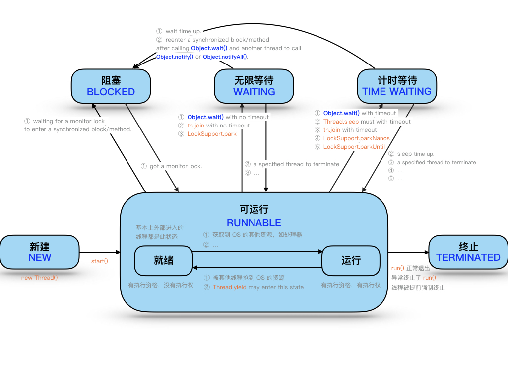

# 7 Thread2

[[toc]]

## 1 引入

并发与并行

- **并发**：指两个或多个事件在**同一个时间段内**发生，**逻辑上**同时发生
- **并行**：指两个或多个事件在**同一时刻**发生（同时发生），**物理上**同时发生

进程与线程

- **进程**：是**程序的一次执行过程**，是系统进行**资源分配**和**处理机调度的基本单位**，**每个进程都有一个独立的内存空间**，一个应用程序多次运行对应多个进程；系统运行一个程序即是一个进程从创建、运行到消亡的过程。
- **线程**：**线程是进程中的一个执行路径/单元**，负责当前进程中程序的执行，一个进程中至少有一个线程。
  - **多线程**：**一个进程中有多个线程**。**提高程序运行效率、CPU 使用率**；线程太多效率降低。

线程调度模型

1. **分时调度模型**：所有线程轮流使用 CPU 的使用权，平均分配每个线程占用 CPU 的时间片
2. **抢占式调度模型**：优先让优先级高的线程使用 CPU，如果线程的优先级相同，那么会随机选择一个，优先级高的线程获取的 CPU 时间片相对多一些（Java 使用）

## 2 多线程原理及实现

### 2.1 多线程原理

Java 程序运行原理：Java 命令启动 JVM（相当于启动了一个进程），由该进程创建启动多个线程，至少两个线程可以分析出来。**执行 main()函数的主线程**，**负责垃圾回收的线程**。==多线程执行时，其实**每一个执行线程**都有一片自己**所属的栈内存**空间。进行**方法的压栈和弹栈**==

### 2.2 Thread（java.lang）

==**构造方法**==

- **`Thread()`**：分配一个新的线程对象。
- **`Thread(String name)`**：分配一个指定名字的新的线程对象
- **`Thread(Runnable target)`**：分配一个带有指定目标新的线程对象。
- **`Thread(Runnable target,String name)`**：分配一个带有指定目标新的线程对象并指定名字（常用）

**常用方法**

- `void run()`：**此线程要执行的任务在此处定义代码**
- `void start()`：**此线程开始执行**；Java 虚拟机调用此线程的 run 方法
- `static Thread currentThread()`：返回对当前**正在执行的线程对象的引用**
- `String getName()`：**获取当前线程名称**
- `void setName()`：**设置当前线程名称**，或通过线程**类的有参构造设置**
- `static void sleep(long millis)`：使**当前正在执行的线程**以指定的毫秒数**暂停**

### 2.3 多线程的实现方式

- **继承 Thread 类**
  1. 继承 Thread 类。可以写无参和带参构造以便直接定义线程名称。
  2. @Override 重写 Thread 类的`run()`方法，将线程的任务代码封装到`run()`方法中
  3. 创建 Thread 类的子类对象
  4. 调用**`start()`开启线程**，JVM 调用该线程的**`run()`**方法执行（多次启动一个线程非法，即使执行完毕）
- **实现 Runnable 接口（常用）**
  1. 定义类实现 Runnable 接口
  2. @Override 重写接口中的`run()`方法，将线程的任务代码封装到`run()`方法中
  3. 通过 Thread 类创建线程对象，并将 Runnable 接口的子类对象作为 Thread 类的构造函数的参数进行传递。**线程的任务都封装在 Runnable 接口实现类对象的 run 方法中，所以要在线程对象创建时就必须明确要运行的任务**
  4. 调用**`start()`开启线程**，JVM 调用该线程的**`run()`**方法执行（多次启动一个线程非法，即使执行完毕）
- ==**区别（实现 Runnable 接口的好处）**==
  1. 避免了 java**单继承的局限性**
  2. 适合多个相同程序的代码去**处理同一个资源**
  3. 增加程序的健壮性，实现**解耦**操作，代码可以被多个线程共享，**代码和线程独立**
  4. **线程池**只能放入实现 Runable 或 Callable 类线程，不能直接放入继承 Thread 的类
- ==**run()和 start()的区别**==
  - run()：仅仅是封装被线程执行的代码，直接调用是普通方法。
  - start()：首先启动了线程，然后再由 jvm 去调用该线程的 run()方法。

### 2.4 匿名内部类实现多线程

- **继承 Thread 类**

  ```java
  new Thread() {
  	@Override
  	public void run() {
  		for (int i = 0; i < 100; i++) {
  			System.out.println(getName() + "---" + i);
  		}
  	}
  }.start();
  ```

- **实现 Runnable 接口**

  ```java
  //lambda表达式实现
  new Thread(() -> {
      for (int i = 0; i < 100; i++) {
          System.out.println(Thread.currentThread().getName() + "---" + i);
      }
  }).start();
  //普通实现
  new Thread(new Runnable() {
  	@Override
  	public void run() {
  		for (int i = 0; i < 100; i++) {
  			System.out.println(Thread.currentThread().getName() + "---" + i);
  		}
  	}
  }).start();
  ```

## 3 线程状态&调度

### 3.1 线程状态概述

当线程被创建并启动以后，它既不是一启动就进入了执行状态，也不是一直处于执行状态。在线程的生命周期中， 有几种状态呢？在 API 中 **`java.lang.Thread.State`** **这个枚举中给出了六种线程状态**：

| 线程状态                    |                                                                                    导致状态发生条件                                                                                    |
| --------------------------- | :------------------------------------------------------------------------------------------------------------------------------------------------------------------------------------: |
| **NEW**(新建)               |                                                                   线程刚被创建，但是并未启动。还没调用 start 方法。                                                                    |
| **Runnable**(可运行)        |                                             线程可以在 java 虚拟机中运行的状态，可能正在运行自己代码，也可能没有，这取决于操作系统处理器。                                             |
| **Blocked**(锁阻塞)         |                          当一个线程试图获取一个对象锁，而该对象锁被其他的线程持有，则该线程进入 Blocked 状 态；当该线程持有锁时，该线程将变成 Runnable 状态。                          |
| **Waiting**(无限等待)       |        一个线程在等待另一个线程执行一个（唤醒）动作时，该线程进入 Waiting 状态。进入这个 状态后是不能自动唤醒的，必须等待另一个线程调用 notify 或者 notifyAll 方法才能够唤醒。         |
| **Timed Waiting**(计时等待) | 同 waiting 状态，有几个方法有超时参数，调用他们将进入 Timed Waiting 状态。这一状态将一直保持到超时期满或者接收到唤醒通知。带有超时参数的常用方法有 Thread.sleep(1000) 、 Object.wait。 |
| **Terminated**(被终止)      |                                                       因为 run 方法正常退出而死亡，或者因为没有捕获的异常终止了 run 方法而死亡。                                                       |



### 3.2 线程调度

- 线程**优先级**：通过`getPriority()`获取，通过`setPriority()`设置。

  Java 线程默认优先级是 5(1-10 低到高,Thread 的**静态**常量 NORM_PRIORITY(MIN/MAX))。

- 线程**让步**：通过静态方法`Thread.yield()`设置

  **暂停**当前正在执行的线程对象（系统指定的毫秒数），并执行其他线程。**转为就绪状态**，该线程不会失去任何监视器的所有权（**不释放锁**），不会阻塞该线程。不确保真正让出，很少用。

- ==线程**休眠**==：通过静态方法`Thread.sleep(long millis)`设置

  让当前正在执行的线程**休眠**（**暂停**执行）系统指定的毫秒数，该线程不丢失任何监视器的所属权（**不释放锁**），休眠结束回到**就绪状态**

- ==线程**插队**==：线程调用方法`th.join()`，即 join 到当前线程，插队！必须等这个线程终止后当前线程猜可以抢占资源

  **等待该线程终止**，其他线程才可以抢占资源。

- **后台线程（守护线程，如坦克大战）**：通过`th.setDaemon(true)`设置

  当前正在运行的线程都是后台线程时，JVM 退出，该方法必须**在启动线程前调用**

- ==**中断**线程==：通过`th.interrupt()`设置

  **请求终止线程**，仅设置了一个标志位，中断一个不在活动状态（阻塞）的线程没意义并会抛异常

  - 静态方法 interrupted()-->**会清除中断标志位**
  - 普通方法 isInterrupted()-->**不会清除中断标志位**

### 3.3 线程间通信

**多个线程在处理==同一个资源==，但是处理的动作（线程的任务）却不相同**。

多个线程在处理同一个资源，并且任务不同时，需要线程通信来帮助解决线程之间对同一个变量的使用或操作。 就 是多个线程在操作同一份数据时， 避免对同一共享变量的争夺。也就是我们需要通过一定的手段使各个线程能有效 的利用资源。而这种手段即—— 等待唤醒机制。

#### 1 等待唤醒机制

就是在一个线程进行了规定操作后，就进入等待状态（wait()）， 等待其他线程执行完他们的指定代码过后 再将 其唤醒（notify()）；在有多个线程进行等待时， 如果需要，可以使用 notifyAll()来唤醒所有的等待线程。 wait/notify 就是线程间的一种协作机制。Effective Java 让**尽量使用 notifyAll**！！！

- **Object 类**（任意锁对象）中提供了三个方法：（这些方法必须通过**同一个锁对象在同步中调用**）
  - `wait([long timeout])`：==**等待**并立即**释放锁**，线程被阻塞。**被唤醒后若获得锁那么从这里执行后续代码**==
  - `notifyAll()`：唤醒该锁上的所有线程，被通知线程不能立即恢复执行线程，**重新请求同步锁**。但是**notifyAll 不会释放锁**
  - `notify()`：随机唤醒该锁上的单个线程，被通知线程不能立即恢复执行线程，**重新请求同步锁**。但是**notify 不会释放锁**

> 哪怕只通知了一个等待的线程，被通知线程也不能立即恢复执行，因为它当初中断的地方是在同步块内，而 此刻它已经不持有锁，所以她需要再次尝试去获取锁（很可能面临其它线程的竞争），成功后才能在当初调 用 wait 方法之后的地方恢复执行。
> 总结如下：
> 如果能获取锁，线程就从 WAITING 状态变成 RUNNABLE 状态； 否则，从 wait set 出来，又进入 entry set，线程就从 WAITING 状态又变成 BLOCKED 状态

## 4 线程安全

线程安全问题：

- **买票问题**

  - 相同的票出现多次：CPU 的一次操作必须是原子性的
  - 出现负数的票：随机性和延迟导致

- **线程安全问题产生原因**

  - 多个线程在操作共享数据

  - 操作共享数据的代码有多条

    **当一个线程在执行操作共享数据的多条代码过程中，其他线程参与了运算，就会导致**

### 4.1 线程同步

要解决上述多线程并发访问一个资源的安全性问题：也就是解决重复票与不存在票问题，Java 中提供了**同步机制 (synchronized)**来解决。有三种方式完成同步操作：**同步代码块**、**同步方法**、**锁机制**。

- **同步的优缺点：**
  - **好处**：解决线程的安全问题
  - **弊端**：相对**降低效率**，因为同步外的线程都会判断同步锁；若有同步嵌套容易产生**死锁**

#### 4.2.1 synchronized 关键字

- `synchronized`关键字可以用于**方法中的某个区块中**，表示只对这个区块的**资源实行互斥访问**

  - **同步锁**：也称**对象锁**或对象**监视器**
    - 锁对象可以是**任意类型**
    - 多个线程对象要使用**同一把锁**

- 使用`synchronized`修饰的方法就叫做同步方法，保证 A 线程执行该方法的时候其他线程只能在方法外等着。
  - **同步锁是谁**?
    - 对于**非 static 方法**，同步锁就是**this**
    - 对于**static 方法**，我们使用当前方法所在类的字节码对象(**类名.class**)

* **对某个对象加锁**

  ```java
  public class T {

      private int count = 10;
      private final Object lock = new Object();

      public void m() {
          synchronized (lock) { // 任何线程要执行下面的代码，都必须先拿到lock锁，锁信息记录在堆内存对象中的，不是在栈引用中
              // 如果lock已经被锁定，其他线程再进入时，就会阻塞等待
              // 所以 synchronized 是互斥锁
              count--;
              System.out.println(Thread.currentThread().getName() + " count = " + count);
          }
          // 当代码块执行完毕后，锁就会被释放，然后被其他线程获取
      }
  }
  ```

* **对 this 加锁**

  ```java
  public class T {

      private int count = 10;

      public void m() {
          synchronized (this) { // 任何线程要执行下面的代码，必须先拿到this锁
              // synchronized 锁定的不是代码块，而是 this 对象
              count--;
              System.out.println(Thread.currentThread().getName() + " count = " + count);
          }
      }
  }
  ```

* **synchronized 方法对 this 加锁**

  ```java
  public class T {

      private int count = 10;

      public synchronized void m() { // 等同于 synchronized (this) {
          count--;
          System.out.println(Thread.currentThread().getName() + " count = " + count);
      }
  }
  ```

* **synchronized 静态方法的同步锁**

  ```java
  public class T {

      private static int count = 10;

      public static synchronized void m() { // 等同于 synchronized (c_004.T.class) {
          count--;
          System.out.println(Thread.currentThread().getName() + " count = " + count);
      }
  }
  ```

##### 1 线程重入的问题

线程重入的问题（线程执行过程中，被其他线程打断）

因为 count-- 、Sout 都不是原子操作，为保证操作的原子性，加上 synchronized

```java
public class T implements Runnable{

    private int count = 10;

    @Override
    public /*synchronized*/ void run() {
        count--; // count--不是原子操作！！！
        System.out.println(Thread.currentThread().getName() + " count = " + count);
    }

    public static void main(String[] args) {
        T t = new T();
        for (int i = 0; i < 5; i++) {
            new Thread(t).start();
        }
    }
}
```

##### 2 同步方法和非同步方法是否可以同时调用？

可以。非同步方法不需要申请锁对象，直接就可以执行

```java
public class T {

    private int count = 10;

    public synchronized void m1() {
        System.out.println(Thread.currentThread().getName() + " m1 start");
        try {
            TimeUnit.SECONDS.sleep(10);
        } catch (InterruptedException e) {
            e.printStackTrace();
        }
        System.out.println(Thread.currentThread().getName() + " m1 end");
    }

    public void m2() {
        try {
            TimeUnit.SECONDS.sleep(5);
        } catch (InterruptedException e) {
            e.printStackTrace();
        }
    }

    public static void main(String[] args) {
        T t = new T();
        new Thread(t::m1); // 方法引用
        new Thread(t::m2);
    }
}
```

##### 3 对业务写方法加锁，而对读方法不加锁？

容易出现**脏读**问题。在执行写的过程中，因为读操作没有加锁，所以读会读取到未改完的脏数据。

可以对读也加锁，synchronized。但还是要根据业务，是否可以脏读。

```java
public class Account {

    String name; // 银行账户名称
    double balance; // 银行账余额

    public synchronized void set(String name, double balance) {
        this.name = name;
        try {
            TimeUnit.SECONDS.sleep(2);
        } catch (InterruptedException e) {
            e.printStackTrace();
        }
        this.balance = balance;
    }

    public /*synchronized*/ double getBalance() {
        return this.balance;
    }

    public static void main(String[] args) {
        Account a = new Account();
        new Thread(() -> a.set("张三", 100.0)).start();
        System.out.println(a.getBalance()); // 0.0
        try {
            TimeUnit.SECONDS.sleep(3);
        } catch (InterruptedException e) {
            e.printStackTrace();
        }
        System.out.println(a.getBalance()); // 100.0
    }
}
```

##### 4 一个同步方法是否可以调用另外一个同步方法

synchronized 是**可重入锁**，同一线程中，一个同步方法可以调用另外一个同步方法，一个线程已经拥有某个对象的锁，再次申请时仍然会得到该对象的锁

```java
public class T {

    synchronized void m1() {
        System.out.println("m1 start ");
        try {
            TimeUnit.SECONDS.sleep(1);
        } catch (InterruptedException e) {
            e.printStackTrace();
        }
        m2();
    }

    synchronized void m2() {
        try {
            TimeUnit.SECONDS.sleep(2);
        } catch (InterruptedException e) {
            e.printStackTrace();
        }
        System.out.println(" m2"); // 这句话会打印，调用m2时，不会发生死锁
    }
}
```

##### 5 同 4，但是是在父子类方法中

synchronized 是**可重入锁**，锁对象是 new 的那个对象（哪个调用方法，哪个就是 this）。父子类中重写方法、非重写方法都可以

```java
public class T {

    synchronized void n() {
        System.out.println("n start ");
        try {
            TimeUnit.SECONDS.sleep(1);
        } catch (InterruptedException e) {
            e.printStackTrace();
        }
        System.out.println("n end ");
    }

    public static void main(String[] args) {
        TT tt = new TT();
        tt.m();
    }
}

class TT extends T {
    //@Override
    synchronized void m() {
        System.out.println(" child m start ");
        super.n();
        System.out.println(" child m end ");
    }
}
```

##### 6 synchronized 代码块中，若发生异常锁会被释放

在并发处理过程中，有异常要多加小心，不然可能发生数据不一致的情况。比如，在一个 web app 处理过程中，多个 servlet 线程共同访问同一资源，这时如果异常处理不合适，第一个线程抛出异常，其他线程就会进入同步代码区，有可能访问到异常产生的数据。因此要非常小心处理同步业务员逻辑中的异常。**需要 try...catch 并回滚**！！！

```java
public class T {

    int count = 0;

    synchronized void m() {
        System.out.println(Thread.currentThread().getName() + " start");
        while (true) { //这里改为具体数值会更好，代表操作的步骤
            count++;
            System.out.println(Thread.currentThread().getName() + " count=" + count);
            try {
                TimeUnit.SECONDS.sleep(1);
            } catch (InterruptedException e) {
                e.printStackTrace();
            }
            if (count == 5) {  // 当count == 5 时，synchronized代码块会抛出异常
                int i = 1 / 0;
            }
        }
    }

    public static void main(String[] args) {
        T t = new T();
        new Thread(t::m, "t1").start(); // 执行到第5秒时，抛出 ArithmeticException
        // 如果抛出异常后，t2 会继续执行，就代表t2拿到了锁，即t1在抛出异常后释放了锁
        try {
            TimeUnit.SECONDS.sleep(3);
        } catch (InterruptedException e) {
            e.printStackTrace();
        }
        new Thread(t::m, "t2").start();
    }
}
/* 可能输出如下
t1 start
t1 count=1
t1 count=2
t1 count=3
t1 count=4
t1 count=5
t2 start
t2 count=6
Exception in thread "t1" java.lang.ArithmeticException: / by zero
	at com.conanan.thread.T.m(T.java:29)
	at java.lang.Thread.run(Thread.java:748)
t2 count=7
t2 count=8
*/
```

##### 7 synchronized 代码块中的语句越少越好

```java
public class T {

    int count = 0;

    synchronized void m1() {
        try {
            TimeUnit.SECONDS.sleep(2);
        } catch (InterruptedException e) {
            e.printStackTrace();
        }

        // 业务逻辑中，只有下面这句代码需要 sync， 这时不应该给整个方法上锁
        count++;

        try {
            TimeUnit.SECONDS.sleep(2);
        } catch (InterruptedException e) {
            e.printStackTrace();
        }
    }

    void m2() {
        try {
            TimeUnit.SECONDS.sleep(2);
        } catch (InterruptedException e) {
            e.printStackTrace();
        }

        // 业务逻辑中，只有下面这句需要 sync，这时不应该给整个方法上锁
        // 采用细粒度的锁，可以使线程争用时间变短，从而提高效率
        synchronized (this) {
            count++;
        }

        try {
            TimeUnit.SECONDS.sleep(2);
        } catch (InterruptedException e) {
            e.printStackTrace();
        }
    }
}
```

##### 8 锁对象的改变

锁定某个对象 o，如果 o 属性发生变化，不影响锁的使用。但是如果 o 变成另一个对象，即锁定的对象发生变化，所以锁对象通常要设置为 final 类型，保证引用不可以变。

```java
public class T {

    Object o = new Object();

    void m() {
        synchronized (o) {
            while (true) {
                System.out.println(Thread.currentThread().getName());
                try {
                    TimeUnit.SECONDS.sleep(1);
                } catch (InterruptedException e) {
                    e.printStackTrace();
                }
            }
        }
    }

    public static void main(String[] args) {
        T t = new T();
        new Thread(t::m, "线程1").start();

        try {
            TimeUnit.SECONDS.sleep(3);
        } catch (InterruptedException e) {
            e.printStackTrace();
        }

        Thread thread2 = new Thread(t::m, "线程2");
        t.o = new Object(); // 改变锁引用, 线程2也有机会运行，否则一直都是线程1 运行
        thread2.start();
    }

}
```

##### 9 不要以字符串常量作为锁定对象

不要以字符串常量作为锁定对象。在下面的例子中， m1 和 m2 其实是锁定的同一对象，这种情况下，还会可能与其他类库发生死锁，比如某类库中也锁定了字符串 "Hello"，但是无法确认源码的具体位置，所以两个 "Hello" 将会造成死锁，因为你的程序和你用的类库无意间使用了同一把锁

```java
public class T {

    String s1 = "Hello";
    String s2 = "Hello";

    void m1() {
        synchronized (s1) {

        }
    }

    void m2() {
        synchronized (s2) {

        }
    }
}
```

#### 4.2.2 wait/notifyAll

在一个线程进行了规定操作后，就进入等待状态（wait()）， 等待其他线程执行完他们的指定代码过后 再将 其唤醒（notify()）；在有多个线程进行等待时， 如果需要，可以使用 notifyAll()来唤醒所有的等待线程。 wait/notify 就是线程间的一种协作机制。Effective Java 让**尽量使用 notifyAll**！！！

- **Object 类**（任意锁对象）中提供了三个方法：（这些方法必须通过**同一个锁对象在同步中调用**）
  - `wait([long timeout])`：==**等待**并立即**释放锁**，线程被阻塞。**被唤醒后若获得锁那么从这里执行后续代码**==
  - `notifyAll()`：唤醒该锁上的所有线程，被通知线程不能立即恢复执行线程，**重新请求同步锁**。但是**notifyAll 不会释放锁**
  - `notify()`：随机唤醒该锁上的单个线程，被通知线程不能立即恢复执行线程，**重新请求同步锁**。但是**notify 不会释放锁**

> 哪怕只通知了一个等待的线程，被通知线程也不能立即恢复执行，因为它当初中断的地方是在同步块内，而 此刻它已经不持有锁，所以她需要再次尝试去获取锁（很可能面临其它线程的竞争），成功后才能在当初调 用 wait 方法之后的地方恢复执行。
> 总结如下：
> 如果能获取锁，线程就从 WAITING 状态变成 RUNNABLE 状态； 否则，从 wait set 出来，又进入 entry set，线程就从 WAITING 状态又变成 BLOCKED 状态

#### 4.2.3 volatile 关键字

> /ˈvɑː.lə.t̬əl/ 易变的；无定性的；无常性的；可能急剧波动的

volatile 关键字，使**一个变量在多个线程间可见**。volatile 并不能保证多个线程共同修改 running 变量所带来的不一致的问题，也就是说 volatile 不能替代 synchronized。即 **volatile 只能保证可见性，不能保证原子性**，synchronized 都可以保证，但性能比 volatile 低

**JMM**(Java Memory Model)：在 JMM 中，所有对象以及信息都存放在**主内存**中（包含堆、栈），而**每个线程都有自己的独立空间**，**存储**了需要用到的**变量的副本**，线程**对共享变量的操作**，都会在自己的**工作内存**中进行，然后**同步给主内存**

下面的代码中，running 是位于堆内存中的 t 对象的。当线程 t1 开始运行的时候，会把 running 值从内存中读到 t1 线程的工作区，在运行过程中直接使用这个 copy，并不会每次都会去读取堆内存，这样，当主线程修改 running 的值之后，t1 线程感知不到，所以不会停止运行。使用 volatile，将会在修改后强制所有线程都去堆内存中读取 running 的值

```java
public class T {

    /*volatile*/ boolean running = true;   // 对比有无volatile的情况下，整个程序运行结果的区别

    void m() {
        System.out.println(" m start ");
        while (running) { // 直到主线程将running设置为false，T线程才会退出
        /* 在while中加入一些语句，可见性问题可能就会消失，这是因为加入语句后，CPU可能就会出现空闲，
        然后就会同步主内存中的内容到工作内存。所以，可见性问题可能会消失 */
            /*try {
                TimeUnit.MILLISECONDS.sleep(10);
            } catch (InterruptedException e) {
                e.printStackTrace();
            }*/
        }
        System.out.println(" m end ");
    }

    public static void main(String[] args) {
        T t = new T();
        new Thread(t::m, "t1").start();
        try {
            TimeUnit.SECONDS.sleep(1);
        } catch (InterruptedException e) {
            e.printStackTrace();
        }
        t.running = false;
    }
}
```

volatile 只能保证可见性，不能保证原子性。如下（count++问题引起，非原子操作）：

```java
public class T {

    volatile int count = 0;
    /*AtomicInteger count = new AtomicInteger(0);*/

    /*synchronized*/ void m() {
        for (int i = 0; i < 10000; i++) {
            count++;
            /*count.incrementAndGet();*/
        }
    }
    public static void main(String[] args) {
        // 创建一个10个线程的list，执行任务皆是 m方法
        T t = new T();
        List<Thread> threads = new ArrayList<>();
        for (int i = 0; i < 10; i++) {
            threads.add(new Thread(t::m, "t-" + i));
        }

        // 启动这10个线程
        threads.forEach(Thread::start);
        // join 到主线程，防止主线程先行结束
        threads.forEach(thread -> {
            try {
                thread.join();
            } catch (InterruptedException e) {
                e.printStackTrace();
            }
        });
        // 10个线程，每个线程执行10000次，结果应为 100000
        System.out.println(t.count);  // 所得结果并不为 100000，说明volatile 不保证原子性
    }
}
```

解决方案：

1. 在方法上加上 synchronized 即可，synchronized 既保证可见性，又保证原子性

2. 或使用 AtomicInteger 代替 int（AtomicXXX 代表此类中的所有方法都是原子操作，并且可以保证可见性），但 AtomicXXX 类多个方法组合不构成原子性

#### 4.2.4 CountDownLatch 门闩

使用 Latch 替代 wait notify 来进行通信，好处是，通信简单，同时也可以指定等待时间。

使用 await 和 countDown 方法替代 wait 和 notify。

CountDownLatch 不涉及锁定，当 count 值为 0 时，当前线程继续运行

当不涉及同步，只涉及线程通信的时候，用 synchronized + wait + notify 就显得太重了，这时应该使用 CountDownLatch、cyclicbarrier、semaphore（信号量）

> 具体查看面试题第 2 个

#### 4.2.5 ReentrantLock 锁

- `java.util.concurrent.locks.Lock` **接口**机制提供了比 synchronized 代码块和 synchronized 方法更广泛的锁定操作，同步代码块/同步方法具有的功能 Lock 都有，除此之外更强大，更体现面向对象。 但是**抛出异常后不会自动释放锁**

- **Lock 接口的实现类`ReentrantLock`**

- **Lock 锁也称同步锁**，加锁与释放锁方法化了，如下：

  - public void **lock**()：**加同步锁**

  - public void **unlock**()：**释放同步锁**

    ```java
    public class ReentrantLock2 {

        ReentrantLock lock = new ReentrantLock();

        void m1() {
            lock.lock(); // 相当于 synchronized(this)
            try {
                for (int i = 0; i < 10; i++) {
                    try {
                        TimeUnit.SECONDS.sleep(1);
                    } catch (InterruptedException e) {
                        e.printStackTrace();
                    }
                    System.out.println(i);
                }
            } finally {
                lock.unlock(); // 使用完毕后，必须手动释放锁
                // 不同于synchronized，抛出异常后，不会自动释放锁，需要我们在finally中释放此锁
            }
        }

        void m2() {
            lock.lock(); // 相当于 synchronized(this)
            try {
                System.out.println("m2...");
            } finally {
                lock.unlock();
            }
        }

        public static void main(String[] args) {
            ReentrantLock2 r1 = new ReentrantLock2();
            new Thread(r1::m1, "t1").start(); // m1 已经执行，被t1占有锁this
            try {
                TimeUnit.SECONDS.sleep(1);
            } catch (InterruptedException e) {
                e.printStackTrace();
            }
            new Thread(r1::m2, "t2").start(); // 锁已经被其他线程占用，m1执行完毕后，才会执行
        }

    }
    ```

##### 1 尝试锁 tryLock

ReentrantLock 可以进行尝试锁定 tryLock， 这样无法获得锁、或者在指定时间内无法获得锁，线程可以决定是否继续等待

```java
public class ReentrantLock3 {

    ReentrantLock lock = new ReentrantLock();

    void m1() {
        lock.lock(); // 相当于 synchronized
        try {
            for (int i = 0; i < 10; i++) {
                try {
                    TimeUnit.SECONDS.sleep(1);
                } catch (InterruptedException e) {
                    e.printStackTrace();
                }
                System.out.println(i);
            }
        } finally {
            lock.unlock(); // 使用完毕后，必须手动释放锁
            // 不同于synchronized，抛出异常后，不会自动释放锁，需要我们在finally中释放此锁
        }
    }

    void m2() {
        // 尝试获取锁，返回true拿到了
        boolean flag = false;
        try {
            //boolean flag = lock.tryLock(); //不带参的不需要catch异常
            flag = this.lock.tryLock(5, TimeUnit.SECONDS);
            //根据是否获取到锁来决定后续业务逻辑
            if (flag){
                System.out.println("m2...");
            } else {
                System.out.println("m2 false!");
            }
        } catch (InterruptedException e) {
            e.printStackTrace();
        } finally {
            if (flag){
                lock.unlock();
            }
        }
    }

    public static void main(String[] args) {
        ReentrantLock3 r1 = new ReentrantLock3();
        new Thread(r1::m1, "t1").start(); // m1 已经执行，被t1占有锁this
        try {
            TimeUnit.SECONDS.sleep(1);
        } catch (InterruptedException e) {
            e.printStackTrace();
        }
        new Thread(r1::m2, "t2").start(); // 锁已经被其他线程占用，m1执行完毕后，m2不会执行（因为只等5秒）
    }
}
```

##### 2 lockInterruptibly

ReentrantLock 可以调用 lockInterruptibly 方法，使线程等待锁的过程中，可以通过对线程做 interrupt 操作来终端等待锁过程

```java
public class ReentrantLock4 {

    public static void main(String[] args) {
        ReentrantLock lock = new ReentrantLock();
        new Thread(() -> {
            lock.lock();
            try {
                System.out.println("t1 start");
                TimeUnit.SECONDS.sleep(Integer.MAX_VALUE);  // 线程一直占用锁
            } catch (InterruptedException e) {
                e.printStackTrace();
            } finally {
                lock.unlock();
            }

        }, "t1").start();

        Thread t2 = new Thread(() -> {

            try {
                lock.lockInterruptibly(); // t2 尝试获取锁

                System.out.println("t2 start");
            } catch (InterruptedException e) {
                System.out.println("t2 等待中被打断");
            } finally {
                lock.unlock(); // 没有锁定进行unlock就会抛出 IllegalMonitorStateException
            }
        }, "t2");
        t2.start();

        try {
            TimeUnit.SECONDS.sleep(4);
        } catch (InterruptedException e) {
            e.printStackTrace();
        }
        // 打断线程2的等待
        t2.interrupt();
    }
}
```

##### 3 公平锁

ReentrantLock 可以指定为公平锁，synchronized 是不公平锁

- 公平锁，先获取锁的人，在锁被释放时，优先获得锁。相对公平
- 不公平锁，无论先后，线程调度器将会随机给某个线程锁，不用计算线程时序，效率较高

```java
public class ReentrantLock5 extends Thread {

    private static ReentrantLock lock = new ReentrantLock(true);// 指定锁为公平锁

    @Override
    public void run() {
        for (int i = 0; i < 100; i++) {
            lock.lock();
            try {
                System.out.println(Thread.currentThread().getName() + "获取锁" + i);
            } finally {
                lock.unlock();
            }
        }
    }

    public static void main(String[] args) {
        ReentrantLock5 t1 = new ReentrantLock5();
        ReentrantLock5 t2 = new ReentrantLock5();
        t1.start();
        t2.start();
    }
}
```

##### 4 Condition/await/signalAll

使用 Lock 和 Condition 实现，可以精确唤醒某些线程。查看面试题 3 中的代码

- -

## 5 ThreadLocal

ThreadLocal：使用空间换时间，效率更高。但可能会导致内存泄漏。（Spring 等框架使用了很多）

线程同步：使用时间换空间，加锁

前情

```java
public class ThreadLocal1 {

    /*volatile*/ static Person p = new Person();

    public static void main(String[] args) {
        new Thread(() -> {
            try {
                TimeUnit.SECONDS.sleep(2);
            } catch (InterruptedException e) {
                e.printStackTrace();
            }
            System.out.println(p.name);//在加与不加volatile的情况下，这句话打印的值分别是？ 答：不写volatile有可能发生可见性问题
        }).start();

        new Thread(() -> {
            try {
                TimeUnit.SECONDS.sleep(1);
            } catch (InterruptedException e) {
                e.printStackTrace();
            }
            p.name = "lisi";
        }).start();
    }

    static class Person {
        String name = "zhangsan";
    }
}
```

如果想要**共享变量不可见**呢？ 就需要使用**ThreadLocal**，**线程局部变量**

```java
public class ThreadLocal2 {

    static ThreadLocal<Person> p = new ThreadLocal<>();

    public static void main(String[] args) {
        new Thread(() -> {
            try {
                TimeUnit.SECONDS.sleep(2);
            } catch (InterruptedException e) {
                e.printStackTrace();
            }
            System.out.println(p.get()); // 2. 虽然threadLocal时共享变量，但是取不到其他线程放入的值，所以此处为null
        }).start();

        new Thread(() -> {
            try {
                TimeUnit.SECONDS.sleep(1);
            } catch (InterruptedException e) {
                e.printStackTrace();
            }
            p.set(new Person()); // 1. 往线程局部变量放入一个person
        }).start();
    }

    static class Person {
        String name = "zhangsan";
    }
}
```

## 6 JUC

### 6.1 卖票问题引入

使用同步锁，效率不高

```java
public class TicketSeller3 {

    static List<String> tickets = new ArrayList<>();

    static {
        for (int i = 0; i < 1000; i++) {
            tickets.add("票号：" + i);
        }
    }

    public static void main(String[] args) {
        //10个窗口买票线程
        for (int i = 0; i < 10; i++) {
            new Thread(() -> {
                //每个窗口得循环执行
                while (true) {
                    synchronized (tickets) {
                        if (tickets.size() > 0) {
                            System.out.println(Thread.currentThread().getName() + "销售了 " + tickets.remove(0));

                        }
                    }
                }
            }, "window" + i).start();
        }
    }
}
```

可以使用并发容器 ConcurrentLinkedQueue。先对容器修改，再做判断，不会有问题

```java
public class TicketSeller4 {

    static ConcurrentLinkedQueue<String> queue = new ConcurrentLinkedQueue<>();

    static {
        for (int i = 0; i < 1000; i++) {
            queue.add("票号：" + i);
        }
    }

    public static void main(String[] args) {
        for (int i = 0; i < 10; i++) {
            new Thread(() -> {
                while (true) {
                    String t = queue.poll(); // 取出头，拿不到就是空值
                    if (t == null) {
                        break;
                    }
                    System.out.println(Thread.currentThread().getName()+"销售了" + t);
                }
            }).start();
        }
    }

}
```

### 6.2 ConcurrentMap/ConcurrentSkipListMap

```java
// skipMap: https://blog.csdn.net/sunxianghuang/article/details/52221913
public class T01_ConcurrentMap {

    public static void main(String[] args) {

        //Map<String, String> map = new Hashtable<>(); // 4106左右  全表锁
        //Map<String, String> map = Collections.synchronizedMap(new HashMap<>()); //4437左右
        Map<String, String> map = new ConcurrentHashMap<>(); // 2304左右，加的是分段所，将容器分为16段，每段都有一个锁 segment; 1.8以后 使用 Node + synchronized+CAS
        //Map<String, String> map = new ConcurrentSkipListMap<>(); //5583左右  并发且排序，插入效率较低，但是读取很快

        Random r = new Random();
        Thread[] ths = new Thread[100];
        CountDownLatch latch = new CountDownLatch(ths.length); // 启动了一个门闩，每有一个线程退出，门闩就减1，直到所有线程结束，门闩打开，主线程结束

        long start = System.currentTimeMillis();
        // 创建100个线程，每个线程添加100000个元素到map，并启动这些线程
        for (int i = 0; i < ths.length; i++) {
            ths[i] = new Thread(() -> {
                for (int j = 0; j < 100000; j++) {
                    map.put("a" + r.nextInt(100000), "a" + r.nextInt(1000000));
                }
                latch.countDown();
            }, "t" + i);
        }
        Arrays.asList(ths).forEach(Thread::start);

        try {
            latch.await();
        } catch (InterruptedException e) {
            e.printStackTrace();
        }

        long end = System.currentTimeMillis();
        System.out.println(end - start);
    }
}
```

### 6.3 CopyOnWriteList

监听器队列用的多，读多！

```java
public class T02_CopyOnWriteList {

    public static void main(String[] args) {

        List<String> list =
        //new ArrayList<>(); // 添加为非原子操作：Items[Size] 的位置存放此元素；增大 Size 的值。
        //Collections.synchronizedList(new ArrayList<>());
        //new Vector<>();
        new CopyOnWriteArrayList<>();  // 写时复制：写速极慢，每写一次需要全部复制，读取快

        Random r = new Random();
        Thread[] ths = new Thread[100];

        for (int i = 0; i < ths.length; i++) {
            ths[i] = new Thread(() -> {
                for (int j = 0; j < 1000; j++) {
                    list.add(j+"" + r.nextInt(100));
                }
            });
        }
        runAndComputeTime(ths);
        System.out.println(list.size());

    }

    static void runAndComputeTime(Thread[] ths) {
        long start = System.currentTimeMillis();
        Arrays.asList(ths).forEach(Thread::start);
        Arrays.asList(ths).forEach(t -> {
            try {
                t.join();
            } catch (InterruptedException e) {
                e.printStackTrace();
            }
        });
        long end = System.currentTimeMillis();
        System.out.println(end - start);
    }
}
```

### 6.4 ConcurrentLinkedQueue

```java
public class T04_ConcurrentQueue {


    public static void main(String[] args) {
        Queue<String> queue = new ConcurrentLinkedQueue<>(); // LinkedQueue，无界单向队列

        for (int i = 0; i < 10; i++) {
            queue.offer("a" + i); // 有返回值，返回false代表没有加入成功，true 代表成功，并且此方法不会阻塞
        }

        System.out.println(queue);
        System.out.println(queue.size());

        System.out.println(queue.poll()); // 取出队头
        System.out.println(queue.size());

        System.out.println(queue.peek()); // 取出队头，但是不删除队头
        System.out.println(queue.size());

        // 双端队列 Deque 发音： dai ke
        //Deque<String> deque = new ConcurrentLinkedDeque<>();
        //deque.addFirst();
        //deque.addLast();
        //deque.pollFirst();
        //deque.pollLast();
        //deque.peekFirst();
        //deque.peekLast();
    }

}
```

### 6.5 LinkedBlockingQueue

使用阻塞同步队列 LinkedBlockingQueue 完成**生产者消费者**模式，使用场景较多。

```java
public class T05_LinkedBlockingQueue {

    public static void main(String[] args) {

        BlockingQueue<String> queue = new LinkedBlockingQueue<>(); // LinkedQueue，无界单向队列

        // 启动生产者线程生产
        new Thread(() -> {
            for (int i = 0; i < 100; i++) {
                try {
                    // put 方法，给容器添加元素，如果容器已经满了，则会阻塞等待
                    queue.put("a" + i);
                } catch (InterruptedException e) {
                    e.printStackTrace();
                }
            }
        }, "producer").start();

        // 启用消费者线程消费
        for (int i = 0; i < 5; i++) {
            new Thread(() -> {
                while (true) {
                    try {
                        // 从队列中拿数据，如果空了，则会阻塞等待
                        System.out.println(Thread.currentThread().getName() + ":" + queue.take());
                    } catch (InterruptedException e) {
                        e.printStackTrace();
                    }
                }
            }, "consumer" + i).start();
        }
    }
}
```

### 6.6 ArrayBlockingQueue

```java
public class T06_ArrayBlockingQueue {


    public static void main(String[] args) throws InterruptedException {

        BlockingQueue queue = new ArrayBlockingQueue<>(10); // 有界队列

        for (int i = 0; i < 10; i++) {
            queue.put("a" + i);
        }

        //queue.put("a11"); // 满了会一直阻塞
        //queue.add("a11"); // 满了会抛出异常
        //System.out.println(queue.offer("a11")); // 满了会返回false
        System.out.println(queue.offer("a11", 1, TimeUnit.SECONDS)); // 会等待1s,满了返回false, 如果1s内有空闲,则添加成功后返回true

    }
}
```

### 6.7 LinkedTransferQueue

拥有 transfer 方法，传输，当 transfer 一个元素时，如果有 take 方法阻塞等待获取元素，则不向队列中保存，直接给等待的 take 方法；如果没有消费者线程，transfer 线程将会阻塞

情景：如果将元素放入队列，再拿给消费者线程，太慢了，如果需要的效率更高，可以使用 TransferQueue 来解决更高的并发

```java
public class T08_TransferQueue {

    public static void main(String[] args) {

        TransferQueue mq = new LinkedTransferQueue(); // 队列有容量

        // 先让消费者线程等待
        new Thread(() -> {
            try {
                System.out.println(mq.take());
            } catch (InterruptedException e) {
                e.printStackTrace();
            }
        }).start();

        // 再让生产者线程生产
        try {
            // put add offer 都不会阻塞，会添加到队列中，只有transfer才可以不放入队列等待消费者直接获取，所以transfer是有容量的
            mq.transfer("aaa");
        } catch (InterruptedException e) {
            e.printStackTrace();
        }

        //若先让生产者生成，再启动消费者，则transfer会阻塞，后续代码将无法执行
        /*new Thread(() -> {
            try {
                System.out.println(mq.take());
            } catch (InterruptedException e) {
                e.printStackTrace();
            }
        }).start();*/
    }
}
```

### 6.8 SynchronousQueue

```java
public class T09_SynchronousQueue {

    public static void main(String[] args) throws InterruptedException {

        BlockingQueue queue = new SynchronousQueue();

        new Thread(() -> {
            try {
                System.out.println(queue.take()); // 取不到就阻塞
            } catch (InterruptedException e) {
                e.printStackTrace();
            }
        }).start();

        //queue.add("aaa"); // IllegalStateException: Queue full  抛出异常，因为没有容量
        //boolean b = queue.offer("aaa"); // offer会返回false，因为没有容量添加失败
        queue.put("aaa");  // 会阻塞等待消费者线程获取,内部是transfer。

        System.out.println(queue.size()); // 长度为0
    }
}
```

### 6.9 DelayQueue

出队有个时间限制, 每个元素有一个等待时间, 可以按照等待时间排序元素

DelayQueue 元素必须为 **Delayed 接口**的实现类类型的，即必须**设置元素的等待时间**！

```java
public class T07_DelayQueue {

    public static void main(String[] args) throws InterruptedException {
        long timestamp = System.currentTimeMillis();
        MyTask myTask1 = new MyTask(timestamp + 1000); // 1s后执行
        MyTask myTask2 = new MyTask(timestamp + 2000);
        MyTask myTask3 = new MyTask(timestamp + 1500);
        MyTask myTask4 = new MyTask(timestamp + 2500);
        MyTask myTask5 = new MyTask(timestamp + 500);

        DelayQueue<MyTask> tasks = new DelayQueue<>(); // 无界队列
        tasks.put(myTask1);
        tasks.put(myTask2);
        tasks.put(myTask3);
        tasks.put(myTask4);
        tasks.put(myTask5);

        System.out.println(tasks);  // 确实按照我们拍的顺序执行的

        for (int i = 0; i < tasks.size(); i++) {
            System.out.println(tasks.take());
        }
    }

    static class MyTask implements Delayed {
        private long runningTime;

        public MyTask(long runTime) {
            this.runningTime = runTime;
        }

        // 这是每个元素的等待时间, 越是后加入的元素,时间等待的越长
        @Override
        public long getDelay(TimeUnit unit) {
            return unit.convert(runningTime - System.currentTimeMillis(), TimeUnit.MILLISECONDS);
        }

        // 这是排序规律,可以自己指定。此处按照执行等待时间降序！加入时间升序。等的越久先执行
        @Override
        public int compareTo(Delayed o) {
            return (int) (this.getDelay(TimeUnit.MILLISECONDS) - o.getDelay(TimeUnit.MILLISECONDS));
        }

        @Override
        public String toString() {
            return runningTime + "";
        }
    }

}
```

### 6.10 总结

Map/Set:

- 无并发
  - HashMap
  - TreeMap
  - LinkedHashMap
- 低并发（也别用这些）
- HashTable（更不应该用）
- Collections.synchronizedMap()
- 高并发
  - ConcurrentHashMap - 并发高
  - ConcurrentSkipListMap - 并发高 且 需要排序

队列

- 无并发:
  - ArrayList
  - LinkedList
- 低并发:
  - Vector
  - Collections.synchronizedList()
- 写少读多:
  - CopyOnWriteList（监听器队列等）
- 高并发
  - Queue：
    - ConcurrentLinkedQueue 非阻塞同步（加锁）队列。为什么没有 ConcurrentArrayQueue
  - BlockQueue 阻塞队列
    - LinkedBlockingQueue（无界队列）
    - ArrayBlockingQueue （有界队列）
    - LinkedTransferQueue（阻塞等待消费者消费，有容量。游戏服务器转发消息等）
    - SynchronousQueue（容量为 0 的 TransferQueue）
  - DelayQueue 执行定时任务

## 7 线程池

- **线程池**：其实就是一个**容纳多个线程的容器**，其中的**线程可以反复使用**，省去了频繁创建线程对象的操作， 无需反复创建线程而消耗过多资源。

### 7.1 Executor

> Executor /'eksə.kjutər/ n. 执行器；执行者；执行者号
>
> execute /ˈek.sə.kjuːt/ v. 执行；实施；实行；处死

Java 里面线程池的**顶级接口**是 `java.util.concurrent.Executor`，但是严格意义上讲它只是一个**执行线程的工具**。

可以**传入一个 Runnable 接口**，传递给 Executor 后由 `execute(Runnable command)`方法定义如何执行任务。**需要自己写实现类**。

```java
public class T01_MyExecutor implements Executor {


    public static void main(String[] args) {
        new T01_MyExecutor().execute(() -> System.out.println("hello executor"));
    }

    @Override
    public void execute(Runnable command) {
        //command.run(); //普通的方法调用
         new Thread(command).start(); //由Thread.start方法开启，并由JVM来调用其run方法
    }
}
```

### 7.2 ExecutorService

真正的线程池**接口**是 `java.util.concurrent.ExecutorService`，继承自 Executor 接口。

一个服务，在后台一直运行，等待任务抛入(submit)，并执行，抛入的任务又分为两个类型：传入**Callable**接口实现类（有返回值）；传入 Runnable 接口实现类（无返回值）

```java
public class T02_MyExecutorService implements ExecutorService {

    @Override
    public void shutdown() {

    }

    @Override
    public List<Runnable> shutdownNow() {
        return null;
    }

    @Override
    public boolean isShutdown() {
        return false;
    }

    @Override
    public boolean isTerminated() {
        return false;
    }

    @Override
    public boolean awaitTermination(long timeout, TimeUnit unit) throws InterruptedException {
        return false;
    }

    @Override
    public <T> Future<T> submit(Callable<T> task) {
        return null;
    }

    @Override
    public <T> Future<T> submit(Runnable task, T result) {
        return null;
    }

    @Override
    public Future<?> submit(Runnable task) {
        return null;
    }

    @Override
    public <T> List<Future<T>> invokeAll(Collection<? extends Callable<T>> tasks) throws InterruptedException {
        return null;
    }

    @Override
    public <T> List<Future<T>> invokeAll(Collection<? extends Callable<T>> tasks, long timeout, TimeUnit unit) throws InterruptedException {
        return null;
    }

    @Override
    public <T> T invokeAny(Collection<? extends Callable<T>> tasks) throws InterruptedException, ExecutionException {
        return null;
    }

    @Override
    public <T> T invokeAny(Collection<? extends Callable<T>> tasks, long timeout, TimeUnit unit) throws InterruptedException, ExecutionException, TimeoutException {
        return null;
    }

    @Override
    public void execute(Runnable command) {

    }
}
```

### 7.3 Executors

就是工具类/工厂类

方建议**使用`java.util.concurrent.Executors`线程池工厂类**来创建线程池对象（如 7.5，还有很多其他功能）

java.util.concurrent.Executors

Factory and utility methods for [Executor](#), [ExecutorService](#), [ScheduledExecutorService](#), [ThreadFactory](#), and [Callable](#) classes defined in this package. This class supports the following kinds of methods:

- Methods that create and return an [ExecutorService](#) set up with commonly useful configuration settings.
- Methods that create and return a [ScheduledExecutorService](#) set up with commonly useful configuration settings.
- Methods that create and return a "wrapped" ExecutorService, that disables reconfiguration by making implementation-specific methods inaccessible.
- Methods that create and return a [ThreadFactory](#) that sets newly created threads to a known state.
- Methods that create and return a [Callable](#) out of other closure-like forms, so they can be used in execution methods requiring `Callable`.

### 7.4 ThreadPool

```java
public class T05_ThreadPool {

    public static void main(String[] args) throws InterruptedException {

        ExecutorService service = Executors.newFixedThreadPool(5); // 固定长度的线程池
        for (int i = 0; i < 6; i++) { // 执行六个任务,  在只有五个固定容量的线程池中
            service.execute(() -> {
                try {
                    TimeUnit.MILLISECONDS.sleep(500);
                } catch (InterruptedException e) {
                    e.printStackTrace();
                }
                System.out.println(Thread.currentThread().getName());
            });
        }
        // [Running, pool size = 5, active threads = 5, queued tasks = 1, completed tasks = 0]
        // 内部一般是BlockingQueue
        // pool size =  5  线程池的容量
        // active thread = 5 激活的线程队列长度
        // queued tasks = 1 等待处理任务长度
        // completed task = 0 完成执行的任务数量
        System.out.println(service);

        // 关闭线程池
        service.shutdown(); // 所有任务未执行完毕，不会关闭，会Shutting down
        System.out.println(service.isTerminated()); // false 是否结束
        System.out.println(service.isShutdown()); // true 状态是否关闭
        //java.util.concurrent.ThreadPoolExecutor@3b9a45b3[Shutting down, pool size = 5, active threads = 5, queued tasks = 1, completed tasks = 0]
        System.out.println(service);

        TimeUnit.SECONDS.sleep(5); // 5s 后肯定执行完成了
        System.out.println(service.isTerminated()); // true
        System.out.println(service.isShutdown()); // true
        // java.util.concurrent.ThreadPoolExecutor@3b9a45b3[Terminated, pool size = 0, active threads = 0, queued tasks = 0, completed tasks = 6]
        System.out.println(service);

        // 线程池中维护了两个任务队列
        // 1. 未执行的任务队列
        // 2. 已执行的任务队列
    }

}
```

### 7.5 Callable/Future

The `Callable` interface is similar to [java.lang.Runnable](#), in that both are designed for classes whose instances are potentially executed by another thread. A `Runnable`, however, **does not return a result** and **cannot throw a checked exception**.

```java
public class T03_Callable implements Callable {
    /**
     * Computes a result, or throws an exception if unable to do so.
     *
     * @return computed result
     * @throws Exception if unable to compute a result
     */
    @Override
    public Object call() throws Exception {
        return null;
    }
}
```

`java.util.concurrent public interface Future<V>`

A Future represents the result of an asynchronous computation. Methods are provided to check if the computation is complete, to wait for its completion, and to retrieve the result of the computation. The result can only be retrieved using method get when the computation has completed, blocking if necessary until it is ready. Cancellation is performed by the cancel method. Additional methods are provided to determine if the task completed normally or was cancelled. Once a computation has completed, the computation cannot be cancelled. If you would like to use a Future for the sake of cancellability but not provide a usable result, you can declare types of the form Future<?> and return null as a result of the underlying task.
Sample Usage (Note that the following classes are all made-up.)

```java
public class T06_Future {

    public static void main(String[] args) throws ExecutionException, InterruptedException {

        // 未来任务, 既实现了Runnable 也实现了 Future。如下代码为Callable的实现类。不推荐！
        FutureTask<Integer> task = new FutureTask<>(() -> {
            TimeUnit.MILLISECONDS.sleep(500);
            return 100;
        });
        new Thread(task).start();

        System.out.println(task.get()); // 阻塞等待任务执行完成, 获取到返回值

        System.out.println("-------------------------------");

        //********************************
        // 使用ExecutorService的submit替代FutureTask
        ExecutorService service = Executors.newFixedThreadPool(5);
        Future<Integer> result = service.submit(() -> {
            TimeUnit.MILLISECONDS.sleep(500);
            return 1;
        });
        System.out.println(result.isDone()); // false 执行未完毕
        System.out.println(result.get()); // 1 ，阻塞方法，执行完毕才可以获得结果
        System.out.println(result.isDone()); // true  执行已完毕
        System.out.println(result.get()); // 一直等待
        System.out.println(service.shutdownNow()); // 立即关闭线程池

    }
}
```

### 7.6 newFixedThreadPool

固定容量线程池

```java
//并行计算
public class T07_ParallelComputing {

    public static void main(String[] args) throws ExecutionException, InterruptedException {
        long start = System.currentTimeMillis();
        List<Integer> result = getPrime(1, 200000);
        long end = System.currentTimeMillis();
        System.out.println(end - start); // 使用单线程计算的时间

        ExecutorService service = Executors.newFixedThreadPool(4);//4核CPU，可以使用4个线程，效率高。双核用俩任务也效率不明显
        ComputeTask t1 = new ComputeTask(1, 80000);
        ComputeTask t2 = new ComputeTask(80001, 130000);
        ComputeTask t3 = new ComputeTask(130001, 170000);
        ComputeTask t4 = new ComputeTask(170001, 200000);  // 这里为什么不均分? 因为数字越大, 质数的数量就越多
        // 提交任务给ExecutorService执行
        Future<List<Integer>> f1 = service.submit(t1);
        Future<List<Integer>> f2 = service.submit(t2);
        Future<List<Integer>> f3 = service.submit(t3);
        Future<List<Integer>> f4 = service.submit(t4);
        // 执行开始
        start = System.currentTimeMillis();
        f1.get();
        f2.get();
        f3.get();
        f4.get();
        end = System.currentTimeMillis();
        System.out.println(end - start);
        service.shutdown();
    }

    static class ComputeTask implements Callable<List<Integer>> {

        private int start, end;

        ComputeTask (int start, int end) {
            this.start = start;
            this.end = end;
        }

        @Override
        public List<Integer> call() throws Exception {
            return getPrime(start, end);
        }
    }


    static boolean isPrime(int num) {
        for (int i = 2; i < num / 2; i++) {
            if (num % i == 0) return false;
        }
        return true;
    }

    /**
     * 返回指定范围的质数列表
     */
    static List<Integer> getPrime(int start, int end) {
        List<Integer> list = new ArrayList<>();
        for (int i = 0; i < end; i++) {
            if (isPrime(i)) list.add(i);
        }
        return list;
    }
}
```

### 7.7 newCachedThreadPool

可缓存的线程，任意长度

当有个请求进入线程池内， 线程池将会启用一个线程，当再次有个请求进入线程池内，并且上个线程未结束，仍然会启用一个线程，当有线程执行完毕后，这个线程不会被清除，而是被缓存，当有请求进入时, 直接使用缓存线程调用。

跟 fixedThreadPool 类似, 只不过没有上限(最多 Integer 最大值), 是一种弹性操作。当线程一直不被使用, 缓存最多持续 1 分钟(**AliveTime**默认值),就会被线程池销毁。内部是 **DelayedWorkQueue**

```java
public class T08_CachedThreadPool {

    public static void main(String[] args) {
        ExecutorService service = Executors.newCachedThreadPool();
        // pool size 为0
        System.out.println(service); // java.util.concurrent.ThreadPoolExecutor@7f31245a[Running, pool size = 0, active threads = 0, queued tasks = 0, completed tasks = 0]cu'

        for (int i = 0; i < 2; i++) {
            service.execute(() -> {
                try {
                    TimeUnit.MILLISECONDS.sleep(500);
                } catch (InterruptedException e) {
                    e.printStackTrace();
                }
                System.out.println(Thread.currentThread().getName());
            });
        }
        // pool size 变为2
        System.out.println(service); // java.util.concurrent.ThreadPoolExecutor@7f31245a[Running, pool size = 2, active threads = 2, queued tasks = 0, completed tasks = 0]


        try {
            TimeUnit.SECONDS.sleep(80); // 最多持续1分钟,这里sleep80s
        } catch (InterruptedException e) {
            e.printStackTrace();
        }

        // pool size 变为0
        System.out.println(service); // java.util.concurrent.ThreadPoolExecutor@7f31245a[Running, pool size = 0, active threads = 0, queued tasks = 0, completed tasks = 2]

    }
}
```

### 7.8 newSingleThreadExecutor

线程池中只有一个线程，保证线程执行的时序性

```java
public class T09_SingleThreadPool {

    public static void main(String[] args) {
        ExecutorService service = Executors.newSingleThreadExecutor();
        for (int i = 0; i < 5; i++) {
            final int j = i;
            service.execute(() -> {
                System.out.println(j + " " + Thread.currentThread().getName());
            });
        }
    }
}
```

### 7.9 newScheduledThreadPool

> Scheduled: 计划中的,定时的

执行定时的任务，类似 Delay，可以替代 Timer

```java
public class T10_ScheduledPool {

    public static void main(String[] args) {
        ScheduledExecutorService service = Executors.newScheduledThreadPool(4);
        // 使用固定的频率执行某个任务
        // 四个参数
        // command: 执行的任务
        // initialDelay: 第一次执行延时多久执行
        // period: 每隔多久执行一次这个任务
        // unit: 时间单位
        service.scheduleAtFixedRate(() -> {
            try {
                TimeUnit.MILLISECONDS.sleep(new Random().nextInt(1000));
            } catch (InterruptedException e) {
                e.printStackTrace();
            }
            System.out.println(Thread.currentThread().getName());
        }, 0, 500, TimeUnit.MILLISECONDS);  // 每隔500ms打印一下线程名称
        // 线程执行1000ms,而每sleep 500 就要新启动一个线程
        // 上个线程未执行完毕,会启用新的线程执行
        // 如果线程池已满,只有延时
    }
}
```

### 7.10 newWorkStealingPool

工作窃取线程池

假设共有三个线程 A, B, C 同时执行，每个线程都维护自己的任务队列。当 A，B 线程池尚未处理任务结束，而 C 已经处理完毕，则 C 线程会从 A 或者 B 中窃取任务执行，这就叫工作窃取

WorkStealingPool 背后是使用 ForkJoinPool 实现的

```java
public class T11_WorkStealingPool {

    public static void main(String[] args) throws IOException {
        // CPU 核数（其实是线程数，我的电脑是2核4线程）
        System.out.println(Runtime.getRuntime().availableProcessors());

        // workStealingPool 会自动启动cpu核数个线程去执行任务
        ExecutorService service = Executors.newWorkStealingPool();
        service.execute(new R(1000));  // 我的cpu核数为4 启动5个线程,其中第一个是1s执行完毕,其余都是2s执行完毕,
                                                // 有一个任务会进行等待,当第一个执行完毕后,会再次偷取第5个任务执行
        for (int i = 0; i < Runtime.getRuntime().availableProcessors(); i++) {
            service.execute(new R(2000));
        }

        // 因为work stealing 是deamon线程,即后台线程,精灵线程,守护线程
        // 所以当main方法结束时, 此方法虽然还在后台运行,但是无输出
        // 可以通过对主线程阻塞解决
        System.in.read();
    }

    static class R implements Runnable {

        int time;

        R(int time) {
            this.time = time;
        }

        @Override
        public void run() {
            try {
                TimeUnit.MILLISECONDS.sleep(time);
            } catch (InterruptedException e) {
                e.printStackTrace();
            }
            System.out.println(Thread.currentThread().getName() + "  " + time);
        }
    }
}
```

### 7.11 ForkJoinPool

分而治之：Fork：分叉；Join：合并；

将一个任务拆分多个任务执行(可以无限切分)，然后将结果合并。1.7 加的 ForkJoinPool

比如大量的并行计算, 如下: 求 1000000 个数字之和, 使用多线程

```java
public class T12_ForkJoinPool {

    static int[] nums = new int[100_0000];
    static final int MAX_NUM = 5_0000; // 每个线程最多可以运行5万个数字相加
    static Random random = new Random();

    // 初始化这100_000个数字, 每个数字范围在100之内
    static {

        for (int i = 0; i < nums.length; i++) {
            nums[i] = random.nextInt(100);
        }
        // 所有数字和, 事先计算:
        //System.out.println(Arrays.stream(nums).sum()); // 使用单线程stream api 进行求和
    }

    /**
     * RecursiveAction: 递归操作 没有返回值
     * RecursiveTask: 递归操作,有返回值
     */
    /*
    static class AddTask extends RecursiveAction {

        int start, end;

        AddTask(int start, int end) {
            this.start = start;
            this.end = end;
        }

        @Override
        protected void compute() {

            // 进行计算
            // 如果计算的数的和的范围 小于 MAX_NUM, 进行计算,否则进行 fork
            if (end - start <= MAX_NUM) {
                long sum = 0;
                for (int i = start; i < end; i++) {
                    sum += nums[i];
                }
                System.out.println("sum = " + sum);
            } else {
                int middle = (end - start) / 2;
                AddTask subTask1 = new AddTask(start, middle);
                AddTask subTask2 = new AddTask(middle, end);
                subTask1.fork();
                subTask2.fork();
            }
        }
    }
    */

    static class AddTask2 extends RecursiveTask<Long> {

        int start, end;

        AddTask2(int start, int end) {
            this.start = start;
            this.end = end;
        }

        @Override
        protected Long compute() {
            // 进行计算
            // 如果计算的数的和的范围 小于 MAX_NUM, 进行计算,否则进行 fork
            if (end - start <= MAX_NUM) {
                long sum = 0;
                for (int i = start; i < end; i++) {
                    sum += nums[i];
                }
                return sum;
            } else {
                int middle = start + (end - start) / 2; // 注意这里，如果有问题，会抛出java.lang.NoClassDefFoundError: Could not initialize class java.util.concurrent.locks.AbstractQueuedSynchronizer$Node 异常
                AddTask2 subTask1 = new AddTask2(start, middle);
                AddTask2 subTask2 = new AddTask2(middle, end);
                subTask1.fork();
                subTask2.fork();
                return subTask1.join() + subTask2.join();
            }
        }
    }

    // 运行
    public static void main(String[] args) throws IOException {
        ForkJoinPool fjp = new ForkJoinPool();
        AddTask2 task = new AddTask2(0, nums.length);
        fjp.execute(task);
        System.out.println(task.join());

        //System.in.read();
    }

}
```

### 7.12 ThreadPoolExecutor

线程池的实现原理，除了 ForkJoinPool 与 WorkStealingPool 线程池，其他线程池大部分线程池背后都是 ThreadPoolExecutor

可以自定义线程

```java
public class T13_ThreadPoolExecutor {

    /*
    构造 ThreadPoolExecutor:
    corePoolSize            线程池核心线程数，最小线程数
    maximumPoolSize         最大线程数
    keepAlive               线程空闲后存活时间， 0代表永远不会消失
    timeUnit                单位
    BlockingQueue workQueue 任务容器

    具体查看每个线程池
     */
    public static void main(String[] args) {

    }
}
```

### 7.13 ParallelStreamAPI

```java
public class T14_ParallelStreamAPI {

    public static void main(String[] args) {

        List<Integer> nums = new ArrayList<>();
        Random random = new Random();
        for (int i = 0; i < 1_0000; i++) {
            nums.add(100_0000 + random.nextInt(100_0000));
        }

        long start, end;

        start = System.currentTimeMillis();
        nums.stream().forEach(v -> isPrime(v));
        end =System.currentTimeMillis();

        System.out.println(end - start);


        // 使用parallel stream api

        start = System.currentTimeMillis();
        nums.parallelStream().forEach(v -> isPrime(v));
        end =System.currentTimeMillis();

        System.out.println(end - start);
    }

    static boolean isPrime(int num) {
        for (int i = 2; i < num / 2; i++) {
            if (num % i == 0) return false;
        }
        return true;
    }
}
```

## 8 面试题

### 1 死锁问题(哲学家就餐)

- 指两个或两个以上的线程在执行的过程中，因**争夺资源**产生的一种**互相等待**现象

  ```java
  public class DieLockDemo {
      public static Object lock1 = new Object(); // 锁必须不一样，对应不同资源的操作
      public static Object lock2 = new Object(); // 锁必须不一样，对应不同资源的操作

      public static void main(String[] args) {
          new Thread(() -> {
              synchronized (lock1) {
                  System.out.println("t1 get lock1");
                  //Thread.sleep(1000); // 可以让t1 sleep一会，让t2线程可以有机会执行，提高死锁概率
                  synchronized (lock2) {
                      System.out.println("t1 get lock2");
                  }
              }
          }, "t1").start();

          new Thread(() -> {
              synchronized (lock2) {
                  System.out.println("t2 get lock2");
                  synchronized (lock1) {
                      System.out.println("t2 get lock1");
                  }
              }
          }, "t2").start();
      }
  }
  ```

### 2 监控容器的元素数目

实现一个容器，提供两个方法，add，size。写两个线程，线程 1 添加 10 个元素到容器中，线程 2 实现监控元素的个数，当个数到达 5 时，线程 2 给出提示并（线程 2）结束

1. 实现监控，需要用到**volitile**关键字，使 list 发生变化时，主动通知其他线程来更新工作空间

   ```java
   public class MyContainer2 {

       private volatile List<Object> list = new ArrayList<>();

       public void add(Object ele) {
           list.add(ele);
       }

       public int size() {
           return list.size();
       }

       public static void main(String[] args) {

           MyContainer2 container = new MyContainer2();

           new Thread(() -> {
               for (int i = 0; i < 10; i++) {
                   container.add(new Object());
                   System.out.println("add " + i);
                   try {
                       TimeUnit.SECONDS.sleep(1);
                   } catch (InterruptedException e) {
                       e.printStackTrace();
                   }

               }
           }, "t1").start();

           new Thread(() -> {
               while (true) {
                   if (container.size() == 5) {
                       break;
                   }
               }
               System.out.println("监测到容器长度为5，线程2立即退出");
           }, "t2").start();
       }
   }
   ```

   上述代码，共有以下几个问题：

   1. 不够精确，当 container.size == 5 还未执行 break 时，有可能被其他线程抢占；或者 container.add() 之后，还未打印，就被 t2 判断 size 为 5 直接推出了

   2. 损耗性能，t2 线程，一直在走 while 循环，很浪费性能

2. 采用等待唤醒机制（必须在同步代码中）

   使用 wait 和 notify：

   - wait()与 notify() 方法的调用必须**在同步代码块中**

   - wait 会释放锁，notify 不会释放锁

   - 锁定对象 a，调用 a.wait() 方法，当前线程就会进入等待状态，然后释放锁。

   - 当某线程调用 a.notify() / a.notifyAll()， 叫醒在 a 对象等待的所有线程

   ```java
   public class MyContainer3 {

       private List<Object> list = new ArrayList<>();

       public void add(Object ele) {
           list.add(ele);
       }

       public int size() {
           return list.size();
       }

       public static void main(String[] args) {

           MyContainer3 container = new MyContainer3();

           final Object lock = new Object();

           new Thread(() -> {
               synchronized (lock) {
                   System.out.println("t2 启动");
                   if (container.size() != 5) {
                       try {
                           lock.wait();
                       } catch (InterruptedException e) {
                           e.printStackTrace();
                       }
                   }
                   System.out.println("监测到容器长度为5，线程2立即退出");
                   lock.notify();
               }
           }, "t2").start();

           // 先启动t2线程，让t2线程进入等待状态
           try {
               TimeUnit.SECONDS.sleep(2);
           } catch (InterruptedException e) {
               e.printStackTrace();
           }

           new Thread(() -> {
               synchronized (lock) {
                   for (int i = 0; i < 10; i++) {
                       container.add(new Object());
                       System.out.println("add " + i);
                       // 当长度为5时，通知 t2 进行退出
                       if (container.size() == 5) {
                           lock.notify(); // notify 不会释放锁，即便通知t2，t2也获取不到锁
                           // 可以再wait一下，将锁释放，再让t2通知t1继续执行
                           try {
                               lock.wait();
                           } catch (InterruptedException e) {
                               e.printStackTrace();
                           }
                       }
                       try {
                           TimeUnit.SECONDS.sleep(1);
                       } catch (InterruptedException e) {
                           e.printStackTrace();
                       }
                   }
               }
           }, "t1").start();
       }
   }
   ```

3) 使用 CountDownLatch 实现（最简单的方式）。Latch：门闩

   使用 Latch 替代 wait notify 来进行通信，好处是，通信简单，同时也可以指定等待时间。

   使用 await 和 countDown 方法替代 wait 和 notify。

   CountDownLatch 不涉及锁定，当 count 值为 0 时，当前线程继续运行

   当不涉及同步，只涉及线程通信的时候，用 synchronized + wait + notify 就显得太重了，这时应该使用 CountDownLatch、cyclicbarrier、semaphore（信号量）

   ```java
   public class MyContainer5 {

       private volatile List<Object> list = new ArrayList<>();

       public void add(Object ele) {
           list.add(ele);
       }

       public int size() {
           return list.size();
       }

       public static void main(String[] args) {

           MyContainer5 container = new MyContainer5();

           // Count down 往下数  Latch 门闩
           // 门闩不能保证可见性，不是一种同步方式，只是一种线程通信方式，保证不了可见性
           // 门闩的等待，不会持有任何锁
           CountDownLatch latch = new CountDownLatch(1);

           new Thread(() -> {
               System.out.println("t2 启动");
               if (container.size() != 5) {
                   try {
                       latch.await();
                       // 指定等待时间
                       //latch.await(5000, TimeUnit.MILLISECONDS);
                   } catch (InterruptedException e) {
                       e.printStackTrace();
                   }
               }
               System.out.println("监测到容器长度为5，线程2立即退出");
           }, "t2").start();

           try {
               TimeUnit.SECONDS.sleep(1);
           } catch (InterruptedException e) {
               e.printStackTrace();
           }

           new Thread(() -> {
               System.out.println("t1 启动");
               for (int i = 0; i < 10; i++) {
                   container.add(new Object());
                   System.out.println("add " + i);
                   // 当长度为5时，撤掉一个门闩，此时门闩为0，门会打开，即t2会执行
                   if (container.size() == 5) {
                       latch.countDown();
                   }
                   try {
                       TimeUnit.SECONDS.sleep(1);
                   } catch (InterruptedException e) {
                       e.printStackTrace();
                   }
               }
           }, "t1").start();
       }
   }
   ```

### 3 能被阻塞调用的固定容量容器（线程间通信）

写一个固定容量的容器，拥有 put 和 get 方法，以及 getCount 方法。能够支持 2 个生产者线程以及 10 个消费者线程的阻塞调用。**生产者消费者模式**

- 如果调用 get 方法时，容器为空，get 方法就需要阻塞等待

- 如果调用 put 方法时，容器满了，put 方法就需要阻塞等待

实现方式：

- synchronized/wait/notify

  ```java
  public class MyContainer1<T> {

      private final LinkedList<T> list = new LinkedList<>();
      private final int MAX = 10;
      private int count = 0;

      public synchronized void put(T t) {
          while (MAX == count) { // 如果容量最大，释放锁等待    ///【这里为什么使用while，而不是使用if？？？】
              try {
                  this.wait();
              } catch (InterruptedException e) {
                  e.printStackTrace();
              }
          }
          // 否则 put
          list.add(t);
          ++count;
          this.notifyAll(); // 通知消费者线程，可以消费了
          // 【这里为什么调用 notifyAll 而不是 notify ？】
      }

      public synchronized T get() {
          while (list.size() == 0) { // 如果容量为空，释放锁等待
              try {
                  this.wait();
              } catch (InterruptedException e) {
                  e.printStackTrace();
              }
          }
          // 否则获取
          T t = list.removeFirst();
          count--;
          this.notifyAll(); // 通知生产者线程生产
          return t;
      }

      public static void main(String[] args) {
          MyContainer1<String> c = new MyContainer1<>();//存放字符串容器
          //启动消费者线程（每个线程消费5个）
          for (int i = 0; i < 10; i++) {
              new Thread(() -> {
                  for (int j = 0; j < 5; j++) {
                      System.out.println(c.get());
                  }
              },"consumer"+i).start();
          }

          //只为了延缓时间
          try {
              TimeUnit.SECONDS.sleep(2);
          } catch (InterruptedException e) {
              e.printStackTrace();
          }

          //启动生产者线程（每个线程生成25个）
          for (int i = 0; i < 2; i++) {
              new Thread(() -> {
                  for (int j = 0; j < 25; j++) {
                      c.put(Thread.currentThread().getName()+" "+j);
                  }
              },"producer"+i).start();
          }
      }
  }
  ```

  - 为什么使用 while 而不是使用 if ？（Effective Java 中提到 wait 一般和 while 使用）

    **wait 方法会释放锁**，若此时容器中元素被消费者消费了一部分，就是调用 notifyAll 唤醒所有线程（主要为了唤醒生成者）。

    此时若是 wait 的那个线程先得到锁对象，则继续从 wait 方法后继续执行，则没有什么问题。

    但是**若是其他线程先得到锁对象**并添加元素致使容器**容量变满**，此时**wait 的那个线程又得到锁对象**，**执行后续方法**。若是 if ，则不用判断继续添加元素（失败）；若是 while 则会再次判断容量，不满则添加。

  - 为什么调用 notifyAll 而不是 notify ？

    **因为 notify 有可能再次叫醒一个生产者线程**；生产者同理；详细解读：

    容器中元素若为 0，且消费者都 wait，若生产者向容器中添加元素满容量后还是唤醒了生产者，则最终生产者也 wait。所有线程都 wait 了，也就执行不了了。

    反过来若容器中元素满了，且生产者都 wait，若消费者消费完容器中的元素后还是唤醒了消费者，则最终消费者也 wait。所有线程都 wait 了，也就执行不了了。

* Lock/Condition/await/signalAll

  ```java
  public class MyContainer2<T> {

      private final LinkedList<T> list = new LinkedList<>();
      private final int MAX = 10;
      private int count = 0;

      private Lock lock = new ReentrantLock();
      private Condition producer = lock.newCondition();
      private Condition consumer = lock.newCondition();

      public void put(T t) {
          try {
              lock.lock();
              while (MAX == count) { // 如果容量最大，释放锁等待
                  producer.await();
              }
              // 否则 put
              list.add(t);
              ++count;
              consumer.signalAll(); // 通知消费者线程，可以消费了

          } catch (InterruptedException e) {
              e.printStackTrace();
          } finally {
              lock.unlock();
          }
      }

      public T get() {
          T t = null;
          try {
              lock.lock();
              while (list.size() == 0) { // 如果容量为空，释放锁等待
                  consumer.await();
              }
              // 否则获取
              t = list.removeFirst();
              count--;
              producer.signalAll(); // 通知生产者线程生产
          } catch (InterruptedException e) {
              e.printStackTrace();
          } finally {
              lock.unlock();
          }
          return t;
      }

      public static void main(String[] args) {
          MyContainer2<String> c = new MyContainer2<>();//存放字符串容器
          //启动消费者线程（每个线程消费5个）
          for (int i = 0; i < 10; i++) {
              new Thread(() -> {
                  for (int j = 0; j < 5; j++) {
                      System.out.println(c.get());
                  }
              }, "consumer" + i).start();
          }

          //只为了延缓时间
          try {
              TimeUnit.SECONDS.sleep(2);
          } catch (InterruptedException e) {
              e.printStackTrace();
          }

          //启动生产者线程（每个线程生成25个）
          for (int i = 0; i < 2; i++) {
              new Thread(() -> {
                  for (int j = 0; j < 25; j++) {
                      c.put(Thread.currentThread().getName() + " " + j);
                  }
              }, "producer" + i).start();
          }
      }
  }
  ```
