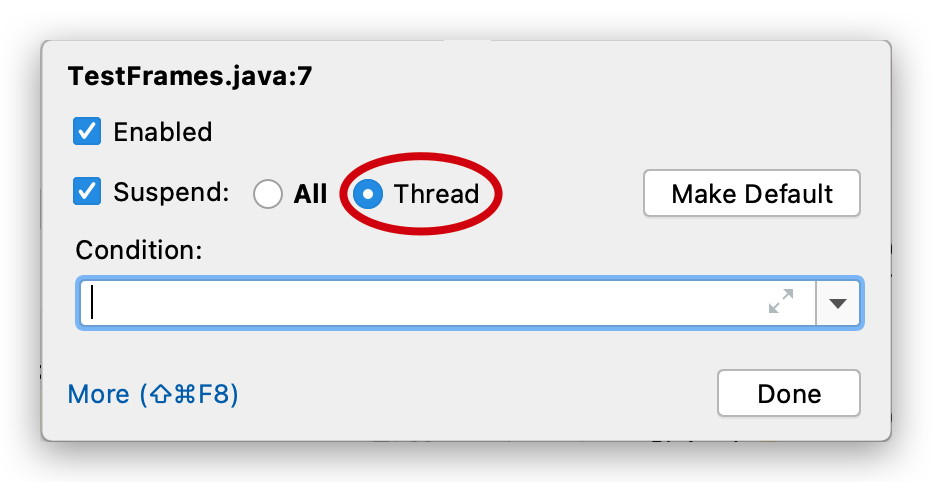

# 多线程—基本使用

## 线程调度模型

- **线程调度模型**（应用程序的执行都是**CPU 在多个线程间快速切换**完成的）
    - **分时调度模型（时间片）**：所有线程轮流使用 CPU 的使用权，平均分配每个线程占用 CPU 的时间片
    - **抢占式调度模型**：优先让**优先级高**的线程使用 CPU，如果线程的优先级相同，那么会随机选择一个，优先级高的线程获取的 CPU 时间片相对多一些
- **Java 的线程调度方法**
    - **同优先级**线程组成**先进先出队列**（先到先服务），使用**时间片**策略
    - 对**高优先级**，使用优先调度的**抢占式**策略


## 线程的创建和使用 🔥

### Thread 构造方法 🔥

- `Thread()`：分配一个新的线程对象。
- `Thread(String name)`：分配一个指定名字的新的线程对象
- `Thread(Runnable target)`：分配一个带有指定目标新的线程对象，它实现了 Runnable 接口中的`run`方法
- `Thread(Runnable target,String name)`：分配一个带有指定目标新的线程对象并**指定名字**


### 1. 继承 Thread 类—匿名内部类

1.  定义子类继承 Thread 类。可以写无参和带参构造以便直接定义线程名称。
2.  子类中 Override 重写 Thread 类的`run()`方法，将线程的任务代码封装到`run()`方法中。
3.  创建 Thread 的子类对象，即创建了线程对象。
4.  调用线程对象的**`start()`**，JVM 将调用该线程的**`run()`**方法执行（**多次启动一个线程非法，即使执行完毕**）

```java
@Slf4j(topic = "Test1")
public class Test1 {

    public static void main(String[] args) {
        Thread t1 = new Thread("t1") {
            @Override
            public void run() {
                log.debug("running");
            }
        };

        t1.start();

        log.debug("running");
    }
}
```


### 2. 实现 Runnable 接口

1.  定义类实现 Runnable 接口
2.  @Override 重写接口中的`run()`方法，将线程的任务代码封装到`run()`方法中
3.  通过 Thread 类创建线程对象，并将 Runnable 接口的子类对象作为 Thread 类的构造函数的参数进行传递。**线程的任务都封装在 Runnable 接口实现类对象的 run 方法中，所以要在线程对象创建时就必须明确要运行的任务**
4.  调用**`start()`开启线程**，JVM 调用该线程的**`run()`**方法执行（**多次启动一个线程非法，即使执行完毕**）

```java
@Slf4j(topic = "Test2")
public class Test2 {
    public static void main(String[] args) {
        // 普通实现
        Runnable r0 = new Runnable() {
            @Override
            public void run() {
                log.debug("running");
            }
        };

        // lambda表达式实现
        r1 = () -> log.debug("running");

        Thread t1 = new Thread(r1, "t1");
        t1.start();

        log.debug("running");

    }
}
```


### 3. 实现 Callable 接口 + Future

与使用 Runnable 相比， Callable 功能更强大些（JDK5.0 新增）：

- 使用`FutureTask`类封装实现了 `Callable` 接口的实现类，并传入 `Thread` 的构造方法中，调用 `start` 方法

- 相比`run()`方法，实现 Callable接口需要实现 `call()` 方法，可以有**返回值**（支持**泛型**），可以**抛出异常**

    调用`FutureTask`的`get()`**阻塞等待任务代码执行完毕，获取返回值**

`Future`接口：

- 可以对具`Runnable`、`Callable`任务的执行结果进行取消、查询是否完成、获取结果等。
- `FutrueTask`是`Futrue`接口的**唯一的实现类**
- `FutureTask`**同时实现了`Runnable`,`Future`接口**。它既可以作为`Runnable`被线程执行，又可以作为`Future`得到`Callable`的返回值

```java
@Slf4j(topic = "Test3")
public class Test3 {
    public static void main(String[] args) throws ExecutionException, InterruptedException {

        // 普通实现
        Callable<Integer> c0 = new Callable<Integer>() {
            @Override
            public Integer call() throws Exception {
                log.debug("Callable ...");
                Thread.sleep(2000);
                return 1 + 1;
            }
        };

        // lambda表达式实现
        FutureTask<Integer> c1 = new FutureTask<>(() -> {
            log.debug("Callable ...");
            Thread.sleep(2000);
            return 1 + 1;
        });

        Thread t1 = new Thread(c1, "t1");
        t1.start();

        int value = c1.get();
        log.debug("value: {}", value);
    }
}
```


### 线程池

- 背景：经常创建和销毁、使用量特别大的资源，比如并发情况下的线程， 对性能影响很大。
- **线程池**：其实就是一个**容纳多个线程的容器**，其中的**线程可以反复使用**，使用完**自动归还**，省去了频繁创建线程对象的操作， 无需反复创建线程而消耗过多资源。
- 好处：
    - **降低资源消耗**（重复利用线程池中线程，不需要每次都创建）
    - **提高响应速度**（减少了创建新线程的时间）
    - **便于线程管理**
- **JDK 5.0 起**提供了线程池的顶级**接口**是 `java.util.concurrent.Executor`，但是严格意义上讲它只是一个**执行线程的工具**。**真正的线程池接口是 `java.util.concurrent.ExecutorService`** （官方建议**使用`java.util.concurrent.Executors`线程池工厂类**来创建线程池对象）：
    - `void execute(Runnable command)`：执行任务/命令，没有返回值，一般用来执行 `Runnable`
    - `<T> Future<T> submit(Callable<T> task)`：执行任务，有返回值，一般又来执行 `Callable`
    - `void shutdown()`：关闭线程池，不建议执行
- 常见`ExecutorService`线程池对象有：
    - `ExecutorService static newCachedThreadPool()`：可根据需要创建新线程的线程池
    - `ExecutorService static newFixedThreadPool(int maxThreads)`：可重用固定线程数的线程池
    - `ExecutorService static newSingleThreadExecutor()`：只有一个线程的线程池
    - `ExecutorService static newScheduledThreadPool(n)`：可安排在给定延迟后运行命令或者定期地执行
- 参数（常考）：
    - corePoolSize：核心池的大小
    - maximumPoolSize：最大线程数
    - keepAliveTime：线程没有任务时最多保持多长时间后会终止
    - setRejectedExecutionHandler
    - setThreadFactory

```java
ExecutorService service = Executors.newFixedThreadPool(10);
ThreadPoolExecutor service1 = (ThreadPoolExecutor) service;
// 设置线程池的属性
// System.out.println(service.getClass());
// service1.setCorePoolSize(15);
// service1.setKeepAliveTime();
service.execute(new NumberThread());//适合适用于Runnable
service.execute(new NumberThread1());//适合适用于Runnable
service.submit(Callable callable);//适合使用于Callable
//关闭连接池
service.shutdown();
```


## 基本方法

- `static Thread currentThread()`：获取当前正在执行的线程，在 Thread 子类中就是 this，通常用于主线程和 Runnable 实现类
- `String getName()`：**获取当前线程名称**
- `void setName()`：**设置当前线程名称**，或通过线程**类的有参构造设置**
- `getId()`：获取线程长整型的 id（唯一）


## 常用方法—start & run 🔥

### start

`void start()`：**启动线程，JVM 执行此线程对象的`run()`方法**

该方法只是让线程进入**就绪**状态，里面代码不一定立刻运行（CPU 的时间片还没分给它）。每个线程对象的`start`方法只能调用一次，如果调用了多次会出现 `IllegalThreadStateException`


### run

`void run()`：**线程在被调度时执行底层的操作**。直接调用则没有多线程效果，仅仅是main线程中调用下该任务

如果在构造 Thread 对象时传递了 Runnable 参数，则线程启动后会调用 Runnable 中的 run 方法，否则默认不执行任何操作。但可以创建 Thread 的子类对象，来覆盖默认行为


## 常用静态方法—sleep & yield 🔥

### sleep

`static void sleep(long millis)` **最终进入阻塞状态**

**线程睡眠**。使**当前正在执行的线程**以指定的毫秒数**睡眠**，**不释放锁**

*   调用 sleep 会让当前线程**从 *Running* 进入 *Timed Waiting* 状态（最终进入阻塞状态）**

*   其它线程可以使用 interrupt 方法**打断**正在睡眠的线程，这时 sleep 方法会抛出 InterruptedException

*   睡眠结束后的线程**未必会立刻得到执行**

*   **建议用 `TimeUnit` 的 `sleep` 代替 Thread 的 sleep 来获得更好的可读性**

```java
@Slf4j(topic = "SleepTest")
public class SleepTest {
    public static void main(String[] args) {
        Thread t1 = new Thread(() -> {
            try {
                // Thread.sleep(2000);
                TimeUnit.SECONDS.sleep(2);
            } catch (InterruptedException e) {
                e.printStackTrace();
            }
        }, "t1");

        t1.start();
        log.debug("t1 state: {}", t1.getState());// RUNNABLE

        try {
            // 可能main线程快执行完了，才执行t1，所以让main线程休眠下
            TimeUnit.MILLISECONDS.sleep(500);
        } catch (InterruptedException e) {
            e.printStackTrace();
        }
        log.debug("t1 state: {}", t1.getState());// TIMED_WAITING
    }
}
```

```java
@Slf4j(topic = "interruptTest")
public class InterruptTest {
    public static void main(String[] args) throws InterruptedException {
        Thread t1 = new Thread(() -> {
            try {
                log.debug("enter sleep...");
                TimeUnit.SECONDS.sleep(2);
                log.debug("what's the fuck!!!");// 不会执行！！！interrupt 不是 notify
            } catch (InterruptedException e) {
                log.debug("be interrupt...");
                e.printStackTrace();
            }
        }, "t1");

        t1.start();
        TimeUnit.SECONDS.sleep(1);
        log.debug("interrupt...");
        t1.interrupt();

        // 22:11:31.589 [t1] DEBUG interruptTest - enter sleep...
        // 22:11:32.589 [main] DEBUG interruptTest - interrupt...
        // 22:11:32.589 [t1] DEBUG interruptTest - be interrupt...
    }
}
```


### yield

`static void yield()` **不会进入阻塞状态**

**线程让步**。**暂停**当前正在执行的线程（系统指定的毫秒数），把执行机会让给优先级相同或更高的线程，并执行其他线程。若队列中没有同优先级的线程，忽略此方法。**转为 RUNNABLE 的就绪状态（不会进入阻塞状态）**，该线程不会失去任何监视器的所有权（**不释放锁**）。**不确保真正让出，具体实现依赖操作系统的任务调度器，很少用，主要是为了测试和调试**。

```java
@Slf4j(topic = "yieldTest")
public class YieldTest {

    public static void main(String[] args) {

        Runnable task1 = () -> {
            int count = 0;
            for (; ; ) {
                System.out.println("=====> task1 " + count++);
            }
        };

        Runnable task2 = () -> {
            int count = 0;
            for (; ; ) {
                // 1 测试 yield（这个很明显）
                Thread.yield();
                System.out.println("            =====> task2 " + count++);
            }
        };

        Thread t1 = new Thread(task1, "t1");
        Thread t2 = new Thread(task2, "t2");
        // 2 测试优先级（看CPU空闲核心数吧，可能都并行执行了）
        // t1.setPriority(Thread.MIN_PRIORITY);
        // t2.setPriority(Thread.MAX_PRIORITY);
        t1.start();
        t2.start();
    }
}
```


### 线程优先级 🔥

- 线程的优先级等级（通过 Thread 的静态常量）
    - `Thread.MAX_PRIORITY`：10
    - `Thread.MIN _PRIORITY`：1
    - `Thread.NORM_PRIORITY`：5，默认
- 方法
    - `getPriority()`：返回线程优先级
    - `setPriority(int newPriority)`：改变线程的优先级，需在 start 前设置
- 说明
    - **线程创建时继承父线程的优先级**
    - 线程优先级仅仅会提示（hint）调度器优先调度该线程，调度器可以忽略它。若**CPU比较忙，那么优先级高的线程会获得更多的时间片**，但**CPU闲时，优先级几乎没作用**。**低优先级只是获得调度的概率低**，并非一定是在高优先级线程之后才被调用。看上面 yield 的代码测试。


## 常用方法—join 🔥

### join

`join([long n])`：**线程插队**。**底层就是 wait**

当**某个程序执行流中调用**其他线程的`join()`方法时，**执行流线程**将进入**WAITING 或 TIMED_WAITING**，直到`join()`方法加入的线程执行完毕（或**最多等待n毫秒**），**执行流线程**才进入**RUNNABLE状态**。


### 为什么需要 join？

下面的代码执行，打印 r 是什么？

```java
@Slf4j(topic = "testJoin")
public class TestJoin {
    static int r = 0;

    public static void main(String[] args) {
        test1();
    }

    private static void test1() {
        log.debug("开始");
        Thread t1 = new Thread(() -> {
            try {
                log.debug("开始");
                TimeUnit.SECONDS.sleep(1);
                log.debug("结束");
                r = 10;
            } catch (InterruptedException e) {
                e.printStackTrace();
            }

        }, "t1");
        t1.start();
        log.debug("结果为:{}", r);
        log.debug("结束");
    }
}
```

分析

*   因为主线程和线程 t1 是并行执行的，t1 线程需要 1 秒之后才能算出 r=10

*   而主线程一开始就要打印 r 的结果，所以只能打印出 r=0

解决方法

*   用 sleep 行不行？为什么？

    不行，不知道t1线程究竟要执行多久，所以main线程无法控制sleep的时间

*   用 join，加在 t1.start() 之后即可。目前可以。但是可以使用更好的 Callable 解决

```java
@Slf4j(topic = "testJoin")
public class TestJoin {

    static int r = 0;

    public static void main(String[] args) throws InterruptedException {
        test1();
    }

    private static void test1() throws InterruptedException {
        log.debug("开始");
        Thread t1 = new Thread(() -> {
            try {
                log.debug("开始");
                TimeUnit.SECONDS.sleep(1);
                log.debug("结束");
                r = 10;
            } catch (InterruptedException e) {
                e.printStackTrace();
            }

        }, "t1");
        t1.start();
        t1.join();
        log.debug("结果为:{}", r);
        log.debug("结束");
    }
}
```


### 等待多个结果

问，下面代码（伪代码） cost 大约多少秒？

```java
static int r1 = 0;
static int r2 = 0;
public static void main(String[] args) throws InterruptedException {
    test2();
}

private static void test2() throws InterruptedException {
    Thread t1 = new Thread(() -> {
        sleep(1);
        r1 = 10;
    });
    Thread t2 = new Thread(() -> {
        sleep(2);
        r2 = 20;
    });
    long start = System.currentTimeMillis();
    t1.start();
    t2.start();
    t1.join();
    t2.join();
    long end = System.currentTimeMillis();
    log.debug("r1: {} r2: {} cost: {}", r1, r2, end - start);
}
```

分析如下

*   第一个 join：等待 t1 时，t2 并没有停止，正在运行

*   第二个 join：1s 后，执行到此，t2 也运行了 1s，因此也只需再等待 1s。即总共 cost 2秒

如果颠倒两个 join 呢？一样！


## 常用方法—interrupt 🔥

### interrupt—中断线程 🔥

**请求终止线程**，仅设置了一个标志位，中断一个不在活动状态（阻塞）的线程**没意义并会抛异常**

*   如果**被打断的线程正在 sleep，join，wait** 会导致被打断的线程抛出 InterruptedException，并**清除打断标记（置为false）** 
*   如果**打断的正在运行的线程**，则会**设置打断标记（置为true）** ；
*   **park 的线程被打断**，也会**设置打断标记（置为true）**


### 普通方法 isInterrupted—线程是否被中断 🔥

**不会清除中断标志位**


### 静态方法 interrupted—线程是否被中断

**会清除中断标志位！！！**


### 打断线程正在 sleep，join，wait 的线程—没意义

```java
@Slf4j(topic = "testInterrupt1")
public class TestInterrupt1 {
    public static void main(String[] args) throws InterruptedException {
        test1();
    }


    private static void test1() throws InterruptedException {
        Runnable task1 = () -> {
            try {
                log.debug("sleep...");
                TimeUnit.SECONDS.sleep(5);
            } catch (InterruptedException e) {
                e.printStackTrace();
            }
        };

        Thread t1 = new Thread(task1, "t1");
        t1.start();

        TimeUnit.SECONDS.sleep(1);// 
        log.debug("interrupt...");
        t1.interrupt();
        TimeUnit.MILLISECONDS.sleep(50);// 打印前必须再等待下，因为中断标记清除比较慢！
        log.debug("中断标记：{}", t1.isInterrupted());// false
    }
}
```


### 打断正在运行的线程

```java
@Slf4j(topic = "testInterrupt1")
public class TestInterrupt1 {
    public static void main(String[] args) throws InterruptedException {
        test2();
    }

    private static void test2() throws InterruptedException {
        Runnable task1 = () -> {
            log.debug("running...");
            // 这里要是改为 sleep ，则中断标记将被置为 false
            while (true) {
                // 必须手动退出，否则一直执行。可以用于优雅停止！ 
                boolean flag = Thread.currentThread().isInterrupted();
                if (flag){
                    log.debug("被打断了，我主动退出");
                    break;
                }
            }
        };

        Thread t1 = new Thread(task1, "t1");
        t1.start();

        TimeUnit.SECONDS.sleep(1);// main 线程睡1秒，防止t1线程还未执行
        log.debug("interrupt...");
        t1.interrupt();
        TimeUnit.MILLISECONDS.sleep(50);// 打印前必须再等待下，因为中断标记清除比较慢！
        log.debug("中断标记：{}", t1.isInterrupted());// true
    }
}
```


## 其他方法

- `boolean isAlive()`：判断线程是否还**存活**，还没有运行完毕

- ~~`th.stop()`：`@Deprecated(since="1.2")`~~

- `Enum getState()`：获取线程状态

    Java 中线程状态是用 6 个 enum 表示，分别为：NEW, RUNNABLE, BLOCKED, WAITING, TIMED_WAITING, TERMINATED。详细见线程的生命周期


## 线程的分类 🔥

守护线程和用户线程在几乎每个方面都是相同的，唯一的区别是**判断 JVM 何时离开**

- 守护线程（后台线程，如坦克大战）
    - **守护线程是用来服务用户线程的**，通过在`start()`方法前调用`th.setDaemon(true)`可以把一个用户线程变成一个守护线程
    - **Java 垃圾回收**就是一个典型的守护线程
    - **若 JVM 中都是守护线程，当前 JVM 将退出**
- 用户线程


## 线程的生命周期 🔥

当线程被创建并启动以后，它既不是一启动就进入了执行状态，也不是一直处于执行状态。在线程的生命周期中， 有几种状态呢？在 API 中 **`java.lang.Thread`** **中的`State`内部枚举类中给出了六种线程状态**：

- **新建**：当一个 Thread 类或其子类的对象被声明并创建时，但是并未启动即调用 `start()`，新生的线程对象处于新建状态

    > **NEW**：Thread state for a thread which has not yet started.

- **可运行**：处于新建状态的线程被`start()`后，可能正在 JVM 中执行，也可能正在等待来自操作系统的其他资源如处理器

    > **RUNNABLE**：state for a runnable thread. A thread in the runnable state is executing in the Java virtual machine but it may be waiting for other resources from the operating system such as processor.

- **阻塞**：当一个线程试图获取一个对象锁，而该对象锁被其他的线程持有，则该线程进入 Blocked 状态；当该线程持有锁时，该线程将变成 Runnable 状态。

    > **BLOCKED**：Thread state for a thread blocked waiting for a monitor lock.A thread in the blocked state is waiting for a monitor lock to enter a synchronized block/method or reenter a synchronized block/method after calling `Object.wait`.

- **无限等待**：一个线程在等待另一个线程执行一个（唤醒）动作时，该线程进入 Waiting 状态。这个状态后是不能自动唤醒的

    > **WAITING**：state for a waiting thread.A thread is in the waiting state due to calling one of the following methods:
    >
    > - `Object.wait` with no timeout
    >
    > - `th.join` with no timeout
    >
    > - `LockSupport.park`
    >
    >     A thread in the waiting state is waiting for another thread to perform a particular action.
    >
    > For example, a thread that has called `Object.wait()` on an object is waiting for another thread to call `Object.notify()` or `Object.notifyAll()` on that object. A thread that has called `th.join()` is waiting for a specified thread to terminate.

- **计时等待**：同 waiting 状态，有几个方法有超时参数，调用他们将进入 Timed Waiting 状态。这一状态将一直保持到超时期满或者接收到唤醒通知。

    > **TIMED_WAITING**：Thread state for a waiting thread with a specified waiting time. A thread is in the timed waiting state due to calling one of the following methods with a specified positive waiting time:
    >
    > - `Thread.sleep`must with timeout
    > - `Object.wait` with timeout
    > - `th.join` with timeout
    > - `LockSupport.parkNanos`
    > - `LockSupport.parkUntil`

- **被终止**：因为`run`方法正常退出而终止（完成全部工作），或者因为没有捕获的异常终止了`run`方法而死亡，或者或线程被提前强制性地中止。

    > TERMINATED：Thread state for a terminated thread. The thread has completed execution.

<iframe id="embed_dom" name="embed_dom" frameborder="0" style="display:block;width:100%; height:645px;" src="https://www.processon.com/embed/60267a51f346fb64f5655b6a"></iframe>


释放锁和不释放锁的操作（未完）

释放锁的操作

- 当前线程的同步方法、同步代码块**执行结束**。
- 当前线程在同步代码块、同步方法中遇到**break、return 终止**了该代码块、该方法的继续执行。
- 当前线程在同步代码块、同步方法中出现了**未处理的 Error 或 Exception，导致异常结束**。
- 当前线程在同步代码块、同步方法中执行了线程对象的**`wait()`方法，当前线程暂停，并释放锁**。

不释放锁的操作

- 线程执行同步代码块或同步方法时，程序调用`Thread.sleep()`、`Thread.yield()`方法暂停当前线程的执行

- 线程执行同步代码块时，其他线程调用了该线程的`suspend()`方法将该线程 挂起，该线程不会释放锁(同步监视器)

    应尽量避免使用`suspend()`和`resume()`来控制线程


## OS 中查看线程进程的方式

### Windows

*   任务管理器可以查看进程和线程数，也可以用来杀死进程

*   `tasklist` 查看进程

    `tasklist | findstr java`

*   `taskkill` 杀死进程


### Linux

*   `ps -ef` 查看所有进程
*   `ps -fT -p <PID>` 查看某个进程（PID）的所有线程
*   `kill` 杀死进程
*   `top` 按大写 H 切换是否显示线程
*   `top -H -p <PID>` 查看某个进程（PID）的所有线程？


### Java

*   `jps` 命令查看所有 Java 进程

    `jps | grep Test`

*   `jstack <PID>` 查看某个 Java 进程（PID）某一刻的所有线程状态（快照）

*   `jconsole` 来查看某个 Java 进程中线程的运行情况（图形界面）

    需要以如下方式运行你的 java 类

    ```bash
    java -Djava.rmi.server.hostname=`ip地址` -Dcom.sun.management.jmxremote -Dcom.sun.management.jmxremote.port=`连接端口` -Dcom.sun.management.jmxremote.ssl=是否安全连接 -Dcom.sun.management.jmxremote.authenticate=是否认证 java类
    ```

    修改 /etc/hosts 文件将 127.0.0.1 映射至主机名

    如果要认证访问，还需要做如下步骤

    *   复制 jmxremote.password 文件
    *   修改 jmxremote.password 和 jmxremote.access 文件的权限为 600 即文件所有者可读写
    *   连接时填入 controlRole（用户名），R&D（密码）


## 线程运行原理 🔥

### Java Virtual Machine

JVM 由堆、方法区、虚拟机栈、本地方法栈、程序计数器所组成，其中栈内存是给谁用的呢？其实就是线程，每个线程启动后，虚拟机就会为其分配一块栈内存。

*   **每个栈**由多个**栈帧（Frame）**组成，对应着**每次方法调用时所占用的内存**。
*   **每个线程只能有一个活动栈帧**，对应着当前**正在执行的那个方法**。

画个图就很好理解了（具体还需要学习JVM）

<iframe id="embed_dom" name="embed_dom" frameborder="0" style="display:block;width:100%; height:545px;" src="https://www.processon.com/embed/602623c4e0b34d208a7f6e4b"></iframe>

多个线程 debug 时可以对要查看的多个线程都设置 suspend（挂起）为 Thread，才能让线程分别挂起，分别调试




### 线程的上下文切换

Thread Context Switch

因为以下一些原因导致 cpu 不再执行当前的线程，转而执行另一个线程的代码

*   线程的 cpu 时间片用完
*   垃圾回收
*   有更高优先级的线程需要运行
*   线程自己调用了 sleep、yield、wait、join、park、synchronized、lock 等方法

当 Context Switch 发生时，需要由操作系统**保存当前线程的状态**，并**恢复另一个线程的状态**，Java 中对应的概念就是**程序计数器**（Program Counter Register），它的作用是**记住下一条 jvm 指令的执行地址**，是**线程私有**的

*   状态包括程序计数器、虚拟机栈中每个栈帧的信息，如局部变量、操作数栈、返回地址等

*   Context Switch 频繁发生会影响性能


### Java 多线程的运行过程 🔥

**Java 程序运行原理（多线程）**：由 Java 命令启动 JVM（相当于启动了一个进程），接着由该进程创建启动多个线程，至少三个线程可以分析出来：**执行 main()函数的主线程**，该线程的任务代码都定义在 main 函数中，**负责垃圾回收的 GC 线程**，以及**异常处理线程**

- 多线程执行时，其实**每一个执行线程**都有一片自己**所属的栈内存**空间（还有 PC）。进行**方法的压栈和弹栈**。


- 

## 7.4 线程安全和同步

### 线程安全问题

- **卖票问题**

    - 相同的票出现多次：CPU 的一次操作必须是原子性的（但是输出语句不是原子的）
    - 出现负数的票：随机性和延迟导致

- **线程安全问题产生原因**

    - 多个线程在操作共享数据

    - 操作共享数据的代码有多条

        **当一个线程在执行操作共享数据的多条代码（非原子操作）过程中，其他线程参与了运算，就会导致**

### 线程同步

要解决上述多线程并发访问一个资源的安全性问题：也就是解决重复票与不存在票问题，Java 中提供了**同步机制 (synchronized)**来解决。有三种方式完成同步操作：**同步代码块**、**同步方法**、**Lock 锁机制**。

- **同步的优缺点：**
    - **好处**：解决线程的安全问题
    - **弊端**：相对**降低效率**，因为同步外的线程都会判断同步锁；若有**同步嵌套容易产生死锁**

#### 同步代码块

- `synchronized`关键字可以用于**方法中的某个区块中**，表示只对这个区块的**资源实行互斥访问**

    - **同步锁**：也称**对象锁**或对象**监视器**
        - 锁对象可以是**任意类型**
        - 多个线程对象要使用**同一把锁**

    ```java
    public class Ticket implements Runnable {
    
        private int ticketCount = 100;
    	private static final Object monitorLock = new Object();
    
        @Override
        public void run() {
            // 卖票窗口一直开着，不能在同步中，否则就会被一个线程执行完
            while (true) {
                // synchronized 需在内部写，否则其他线程会进不去。类似进入厕所然后锁门。需要包裹操作共享资源的代码。
                // 还可以写 this（注意唯一性）、Ticket.class
                synchronized (monitorLock) {
                    if (ticketCount > 0) {
                        try {
                            // 进入time waiting，提高错票几率
                            Thread.sleep(10);
                        } catch (Exception e) {
                            e.printStackTrace();
                        }
                        System.out.println(Thread.currentThread().getName() + "卖票，票号：" + ticketCount);
                        ticketCount--;
                    } else {
                        break;
                    }
                }
            }
        }
    }
    ```

#### 同步方法

- 使用`synchronized`修饰的方法就叫做同步方法，保证 A 线程执行该方法的时候其他线程只能在方法外等着。

    - **同步锁是谁**?

        - 对于**非 static 方法**，同步锁就是**this**，此时代表调用 run 方法的对象

        - 对于**static 方法**，我们使用当前方法所在类的字节码对象(**类名.class**)

            使用继承 Thread 类和同步方法实现时，需要写 `static synchronized`

    ```java
    public /*static*/ synchronized void sellTicket(){
         // TODO
    }
    ```

#### Lock 锁

- 从 JDK 5.0 开始，Java 提供了更强大的线程同步机制——通过**显式定义同步锁对象**来实现同步。`java.util.concurrent.locks.Lock` **接口**机制提供了比`synchronized`代码块和`synchronized`方法更广泛的锁定操作，同步代码块/同步方法具有的功能 Lock 都有，除此之外更强大，更体现面向对象。

- **Lock 接口的实现类`ReentrantLock`**。可在构造方法中设置是否为**公平锁**（按 FIFO 队列），但是效率可能会变低。

- **Lock 锁也称同步锁**，加锁与释放锁方法化了，如下：

    - `void lock()`：**加同步锁**

    - `void unlock()`：**释放同步锁**

        ```java
        public class Ticket implements Runnable {
        
            private int count = 100;
            private Lock lock = new ReentrantLock();
        
            @Override
            public void run() {
                while (true) {
                    try {
                        // 加同步锁
                        lock.lock();
                        if (count > 0) {
                            try {
                                Thread.sleep(10);
                                System.out.println(Thread.currentThread().getName() + "-->正在卖第" + count + "张票");
                                count--;
                            } catch (InterruptedException e) {
                                e.printStackTrace();
                            }
                        } else {
                            break;
                        }
                    } finally {
                        // 释放同步锁
                        lock.unlock();
                    }
                }
            }
        
            public static void main(String[] args) {
                Ticket ticket = new Ticket();
                new Thread(ticket, "窗口1").start();
                new Thread(ticket, "窗口2").start();
                new Thread(ticket, "窗口3").start();
            }
        }
        ```

### 死锁问题(哲学家就餐)

- 指两个或两个以上的线程在执行的过程中，因**争夺资源**产生的一种**互相等待**现象

    不要使用 String 来做锁。如：String s1 = "Hello" 和 String s2 = "Hello" 其实是同一把锁；还会可能与其他类库发生死锁。

    ```java
    public class DeadLock {
        private static Object lock1 = new Object();
        private static Object lock2 = new Object();
    
        public static void main(String[] args) {
            new Thread(() -> {
                synchronized (lock1) {
                    System.out.println("t1 get lock1");
                    // 可在此处sleep提高死锁概率
                    synchronized (lock2) {
                        System.out.println("t1 get lock2");
                    }
                }
            }, "t1").start();
    
            new Thread(() -> {
                synchronized (lock2) {
                    System.out.println("t2 get lock2");
                    // 可在此处sleep提高死锁概率
                    synchronized (lock1) {
                        System.out.println("t2 get lock1");
                    }
                }
            }, "t2").start();
        }
    }
    // 可能出现的结果有：
    // 1
    t1 get lock1
    t1 get lock2
    t2 get lock2
    t2 get lock1
    // 2
    t2 get lock2
    t2 get lock1
    t1 get lock1
    t1 get lock2
    // 3
    t1 get lock1
    t2 get lock2
    // 4
    t2 get lock2
    t1 get lock1
    ```

## 7.5 线程间通信

**多个线程在处理同一个资源，但是处理的动作（线程的任务）却不相同**。

多个线程在处理同一个资源，并且任务不同时，需要线程通信来帮助解决线程之间对同一个变量的使用或操作。 就是多个线程在操作同一份数据时， 避免对同一共享变量的争夺。也就是我们需要通过一定的手段使各个线程能有效的利用资源。而这种手段即—— 等待唤醒机制。

### 等待唤醒机制

就是在一个线程进行了规定操作后，就进入等待状态`wait()`， 等待其他线程执行完他们的指定代码过后 再将其唤醒`notify()`；在有多个线程进行等待时， 如果需要，可以使用 `notifyAll()`来唤醒所有的等待线程。 wait/notify 就是线程间的一种协作机制。

- **`Object`类**（任意锁）中提供了三个方法。这些方法必须通过**同一个锁对象（this 调用或其他同一对象调用）在同步中（同步代码块、同步方法）调用，否则报`IllegalMonitorStateException`错。**Lock 有其自己的方法。
    - `wait([long timeout])`：**等待**并立即**释放锁**，线程进入 WAITING。**被唤醒若获得锁后从断点处执行后续代码**
    - `notify()`：唤醒正在排队等待同步资源的线程中优先级最高者结束等待，但**不释放锁**，被通知线程不能立即恢复执行线程，**需重新请求同步锁**
    - `notifyAll()`：唤醒正在排队等待资源的所有线程结束等待

> 哪怕只通知了一个等待的线程，被通知线程也不能立即恢复执行，因为它当初中断的地方是在同步块内，而此刻它已经不持有锁，所以她需要再次尝试去获取锁（很可能面临其它线程的竞争），成功后才能在当初调 用 wait 方法之后的地方恢复执行。
> 总结如下：
> 如果能获取锁，线程就从 WAITING 状态变成 RUNNABLE 状态； 否则，从 wait set 出来，又进入 entry set，线程就从 WAITING 状态又变成 BLOCKED 状态。

### 生产者消费者问题

> 生产者（Productor）将产品交给店员（Clerk），而消费者（）从店员处取走产品，店员一次只能持有固定数量的产品（比如 20），如果生产者试图生产更多的产品，店员会叫生产者停一下，如果店中有空位放产品了再通知生产者继续生产；如果店中没有产品了，店员会告诉消费者等一下，如果店中有产品了再通知消费者来取走产品。
>
> 分析：
>
> 1.  是否是多线程问题？是，生产者线程，消费者线程
>
> 2.  是否有共享数据？是，店员（或产品）
>
> 3.  是否涉及线程的通信？是

#### 同步代码块版本

```java
class Productor implements Runnable {

    private final Product product;

    public Productor(Product product) {
        this.product = product;
    }

    @Override
    public void run() {
        while (true) {
            synchronized (product) {
                // while 和 wait 一起使用；不能单独使用 if，可能会缺少一次判断
                // 不能使用 if...else，会导致 wait 唤醒后即使满足条件也不能生产或消费，浪费了 OS 资源
                while (product.productNum >= 20) {
                    try {
                        product.wait();
                    } catch (InterruptedException e) {
                        e.printStackTrace();
                    }
                }

                product.productNum++;
                System.out.println(Thread.currentThread().getName() + "：生产第" + product.productNum + "个产品");

                product.notifyAll();
            }
            try {
                // 放在同步外更合理，其他线程可以此时抢占资源
                Thread.sleep(100);
            } catch (InterruptedException e) {
                e.printStackTrace();
            }
        }
    }
}


class Consumer implements Runnable {

    private final Product product;

    public Consumer(Product product) {
        this.product = product;
    }

    @Override
    public void run() {
        while (true) {
            synchronized (product) {
                // while 和 wait 一起使用；不能单独使用 if，可能会缺少一次判断
                // 不能使用 if...else，会导致 wait 唤醒后即使满足条件也不能生产或消费，浪费了 OS 资源
                while (product.productNum <= 0) {
                    try {
                        product.wait();
                    } catch (InterruptedException e) {
                        e.printStackTrace();
                    }
                }

                System.out.println(Thread.currentThread().getName() + "：消费第" + product.productNum + "个产品");
                product.productNum--;

                product.notifyAll();
            }
            // 放在同步外更合理，其他线程可以此时抢占资源
            try {
                Thread.sleep(200);
            } catch (InterruptedException e) {
                e.printStackTrace();
            }
        }
    }
}

class Product {
    // 产品数量
    int productNum = 0;
}


public class PCTest {
    public static void main(String[] args) {
        Product product = new Product();
        new Thread(new Productor(product), "生产者1").start();
        new Thread(new Productor(product), "生产者2").start();
        new Thread(new Consumer(product), "消费者1").start();
        new Thread(new Consumer(product), "消费者2").start();
        new Thread(new Consumer(product), "消费者3").start();
        new Thread(new Consumer(product), "消费者4").start();
        new Thread(new Consumer(product), "消费者5").start();
    }
}
```

#### Lock 版本

```java
class Productor implements Runnable {

    private final Product product;

    public Productor(Product product) {
        this.product = product;
    }

    @Override
    public void run() {
        while (true) {

            try {
                product.lock.lock();
                // while 和 wait 一起使用；不能单独使用 if，可能会缺少一次判断
                // 不能使用 if...else，会导致 wait 唤醒后即使满足条件也不能生产或消费，浪费了 OS 资源
                while (product.productNum >= 20) {
                    try {
                        product.productor.await();
                    } catch (InterruptedException e) {
                        e.printStackTrace();
                    }
                }

                product.productNum++;
                System.out.println(Thread.currentThread().getName() + "：生产第" + product.productNum + "个产品");

                product.consumer.signalAll();
            } finally {
                product.lock.unlock();
            }


            try {
                // 放在同步外更合理，其他线程可以此时抢占资源
                Thread.sleep(100);
            } catch (InterruptedException e) {
                e.printStackTrace();
            }
        }
    }
}


class Consumer implements Runnable {

    private final Product product;

    public Consumer(Product product) {
        this.product = product;
    }

    @Override
    public void run() {
        while (true) {

            try {
                product.lock.lock();
                // while 和 wait 一起使用；不能单独使用 if，可能会缺少一次判断
                // 不能使用 if...else，会导致 wait 唤醒后即使满足条件也不能生产或消费，浪费了 OS 资源
                while (product.productNum <= 0) {
                    try {
                        product.consumer.await();
                    } catch (InterruptedException e) {
                        e.printStackTrace();
                    }
                }

                System.out.println(Thread.currentThread().getName() + "：消费第" + product.productNum + "个产品");
                product.productNum--;

                product.productor.signalAll();
            } finally {
                product.lock.unlock();
            }

            // 放在同步外更合理，其他线程可以此时抢占资源
            try {
                Thread.sleep(200);
            } catch (InterruptedException e) {
                e.printStackTrace();
            }
        }
    }
}

class Product {
    // 产品数量
    int productNum = 0;

    Lock lock = new ReentrantLock();
    Condition productor = lock.newCondition();
    Condition consumer = lock.newCondition();
}


public class PCTest {
    public static void main(String[] args) {
        Product product = new Product();
        new Thread(new Productor(product), "生产者1").start();
        new Thread(new Productor(product), "生产者2").start();
        new Thread(new Consumer(product), "消费者1").start();
        new Thread(new Consumer(product), "消费者2").start();
        new Thread(new Consumer(product), "消费者3").start();
        new Thread(new Consumer(product), "消费者4").start();
        new Thread(new Consumer(product), "消费者5").start();
    }
}
```

#### JUC 版本

## 习题

### 实现 Runnable 接口的好处 🔥

**其实 Thread 类也是实现了 Runnable 接口**。start 启动线程中内部调用 run 方法时，若是 target 有值（Runnable对象）则调用该 Runnable 对象的 run 方法，无值则调用 Thread 重写的 run 方法。

构造方法初始化时会有

```java
// Thread.java
this.target = target;// 这个即是传入的 Runnable 对象。Thread 匿名内部类对象不会传入构造方法的
```

调用 start 方式时会调用

```java
// Thread.java
@Override
public void run() {
    if (target != null) {
        target.run();
    }
}
```

*   避免了 Java 类**单继承的局限性**
*   多个线程可以共享同一个接口实现类的对象，非常适合多个相同线程来**处理同一个资源**，增加程序的健壮性，实现**解耦**操作，**任务**代码可以被多个线程共享，**任务代码和线程独立**

*   **线程池**只能放入实现 Runable 或 Callable 类线程，不能直接放入继承 Thread 类的线程


### `run()`和`start()`的区别 🔥

- `run()`：仅仅是封装被线程执行的代码，直接调用是普通方法。
- `start()`：首先启动了线程，然后再由 jvm 去调用该线程的 run()方法。

### synchronized 和 Lock 区别

- syn 是关键字属于 **JVM 层面**的（在同步中块中才能调用 wait/notify）；Lock 是接口，是 **Api 层面**的，JVM 将花费较少的时间来调度线程，性能更好。并且具有更好的扩展性（提供更多的子类）
- syn 是**隐式锁**，**出了作用域 或 抛异常会自动释放**；Lock 是**显式锁**（**手动开启和关闭锁**，别忘记关闭锁）
- syn 有代码块锁和方法锁；Lock 只有代码块锁
- **syn 不可中断**；**Lock 可中断**（tryLock 设置超时方法，lockInterruptibly()方代码块中，用 interrupt()方法中断）
- 使用 Lock 的 Condition 可以**精确唤醒**

优先使用顺序：Lock —> 同步代码块(已经进入了方法体，分配了相应资源) —> 同步方法 (在方法体之外)

### sleep 和 wait 异同

- sleep 是 Thread 的方法，可以在任何场景下调用；wait 是 Object 的方法，必须在同步中调用（同步代码块、同步方法）
- 若俩方法都在同步中调用，都会使线程进入 TIME/ WAITING 状态。但 sleep **不会释放锁**，休眠结束回到就绪状态；wait **等待**并立即**释放锁**，**被唤醒后若获得锁则从这里执行后续代码**

### 2 个线程向账户存钱并打印

银行有一个账户，有两个储户分别向同一个账户存 3000 元，每次存 1000，存 3 次。每次存完打印账户余额。

问题:该程序是否有安全问题，如果有，如何解决？此处采用继承 Thread 类来实现（实现 Runnable 接口稍简单）

```java
class Account {
    private double balance;

    public Account(double balance) {
        this.balance = balance;
    }

    //存钱
    public synchronized void deposit(double amt) {
        if (amt > 0) {
            balance += amt;
            System.out.println(Thread.currentThread().getName() + ":存钱成功。余额为：" + balance);
        }
    }
}

class Customer extends Thread {

    private Account acct;

    public Customer(Account acct, String name) {
        super(name);
        this.acct = acct;
    }

    @Override
    public void run() {

        for (int i = 0; i < 3; i++) {
            acct.deposit(1000);

            try {
                Thread.sleep(100);
            } catch (InterruptedException e) {
                e.printStackTrace();
            }
        }
    }
}

public class AccountTest {

    public static void main(String[] args) {
        Account acct = new Account(0);
        new Customer(acct, "甲").start();
        new Customer(acct, "乙").start();
    }
}
```

### 2 个线程交替打印 1-100

同步代码块、同步方法

```java
class PrintThread implements Runnable{

    private int count = 1;

    @Override
    public void run() {
        while (true) {
            // wait、notify 必须在同步中。且调用的对象与锁对象必须相同
            synchronized (this) {
                // 唤醒
                this.notifyAll();
                if (count <= 100) {
                    /*try {
                        // 不加锁时，增加线程安全问题发生的概率
                        Thread.sleep(100);
                    } catch (InterruptedException e) {
                        e.printStackTrace();
                    }*/
                    System.out.println(Thread.currentThread().getName()+":"+count++);

                    try {
                        // 等待并立即释放锁，唤醒后还是从这里继续，但是需要获取到锁，所以外层需要使用 while
                        this.wait();
                    } catch (InterruptedException e) {
                        e.printStackTrace();
                    }
                } else {
                    break;
                }
            }
        }
    }
}

public class PrintTest {

    public static void main(String[] args) {
        PrintThread printThread = new PrintThread();
        // 也可以将 run 方法内容写入普通方法中，采用方法引用来操作
        new Thread(printThread,"A").start();
        new Thread(printThread,"B").start();
    }
}
```

Lock 方式暂时没想到好点的方法

### 生产者消费者问题

见笔记

### 创建多线程的 4 种方式

见笔记


## JMH 基准测试

*   基准测试工具选择，使用了比较靠谱的 JMH，它会执行程序预热，执行多次测试并平均
*   cpu 核数限制，有两种思路
    *   使用虚拟机，分配合适的核
    *   使用 msconfifig，分配合适的核，需要重启比较麻烦
*   并行计算方式的选择
    *   最初想直接使用 parallel stream，后来发现它有自己的问题
    *   改为了自己手动控制 thread，实现简单的并行计算

使用 archetype 创建 Maven 项目

```
mvn archetype:generate -DinteractiveMode=false -DarchetypeGroupId=org.openjdk.jmh -DarchetypeArtifactId=jmh-java-benchmark-archetype -DgroupId=org.sample -DartifactId=test -Dversion=1.0
```

进入该 test 项目，修改测试代码

```java
@Fork(1)
@BenchmarkMode(Mode.AverageTime)
@Warmup(iterations=3)
@Measurement(iterations=5)
public class MyBenchmark {

    static int[] ARRAY = new int[1000_000_00];
    static {
        Arrays.fill(ARRAY, 1);
    }


    @Benchmark
    public int c() throws Exception{
        int[] array = ARRAY;
        FutureTask<Integer> t1 = new FutureTask<>(()->{
            int sum = 0;
            for(int i = 0; i < 250_000_00;i++) {
                sum += array[i];
            }
            return sum;
        });
        FutureTask<Integer> t2 = new FutureTask<>(()->{
            int sum = 0;
            for(int i = 0; i < 250_000_00;i++) {
                sum += array[250_000_00+i];
            }
            return sum;
        });
        FutureTask<Integer> t3 = new FutureTask<>(()->{
            int sum = 0;
            for(int i = 0; i < 250_000_00;i++) {
                sum += array[500_000_00+i];
            }
            return sum;
        });
        FutureTask<Integer> t4 = new FutureTask<>(()->{
            int sum = 0;
            for(int i = 0; i < 250_000_00;i++) {
                sum += array[750_000_00+i];
            }
            return sum;
        });
        new Thread(t1).start();
        new Thread(t2).start();
        new Thread(t3).start();
        new Thread(t4).start();
        return t1.get() + t2.get() + t3.get()+ t4.get();
    }


    @Benchmark
    public int d() throws Exception {
        int[] array = ARRAY;
        FutureTask<Integer> t1 = new FutureTask<>(()->{
            int sum = 0;
            for(int i = 0; i < 1000_000_00;i++) {
                sum += array[i];
            }
            return sum;
        });
        new Thread(t1).start();
        return t1.get();
    }
}
```

打包后在 test 目录下执行 `java -jar [-Xmx2G] target/benchmarks.jar` 测试：

*   可以看到多核下，效率提升还是很明显的
*   单核下，性能几乎是一样的，甚至多线程代码还慢了一点