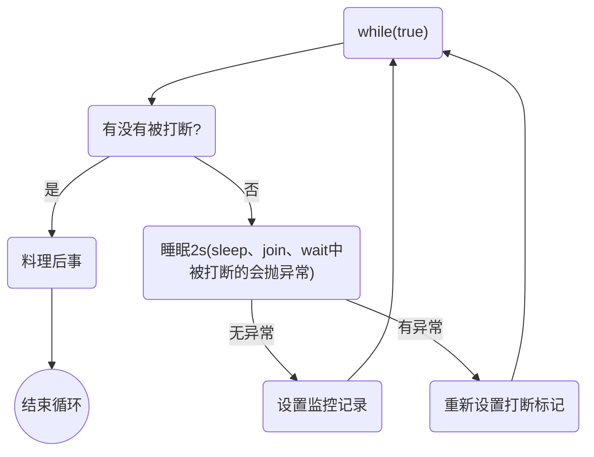

# 多线程—设计模式

## 两阶段终止—Two Phase Termination

### 用处

在一个线程 T1 中如何“优雅”终止线程 T2？这里的【优雅】指的是给 T2 一个料理后事的机会。


### 错误思路

*   使用线程对象的 stop() 方法停止线程

    stop 方法会真正杀死线程，如果这时线程**锁**住了共享资源，那么当它被杀死后就再也没有机会释放锁，其它线程将永远无法获取锁

*   使用 System.exit(int) 方法停止线程

    目的仅是停止一个线程，但这种做法会让整个程序都停止


### 两阶段终止模式




### interrupt 实现 🔥

```java
@Slf4j(topic = "TwoPhaseTermination")
public class TwoPhaseTermination {


    /* 监控线程 */
    private Thread monitor;

    /**
     * 启动监控线程
     */
    public void start(){
        monitor = new Thread(()->{
            Thread currentThread = Thread.currentThread();
            while (true){
                boolean flag = currentThread.isInterrupted();
                if (flag){
                    log.debug("料理后事，优雅停机");
                    break;
                }

                try {
                    // 1 正常情况，被打断无需额外处理
                    log.debug("执行监控记录");
                    // 2 非正常情况，在 sleep、join、wait 中被中断
                    // 每1秒执行一次，释放CPU，所以sleep
                    TimeUnit.SECONDS.sleep(1);
                } catch (InterruptedException e) {
                    e.printStackTrace();
                    // 由于 catch InterruptedException 后会清除中断标志，所以需要重设中断标志
                    currentThread.interrupt();
                }

            }
        });

        monitor.start();
    }

    /**
     * 优雅停止监控线程
     */
    public void stop(){
        monitor.interrupt();
    }


    public static void main(String[] args) throws InterruptedException {
        TwoPhaseTermination tpt = new TwoPhaseTermination();
        tpt.start();
        TimeUnit.SECONDS.sleep(3);
        tpt.stop();
    }
}
```


### volitile 实现 🔥

```java

```

