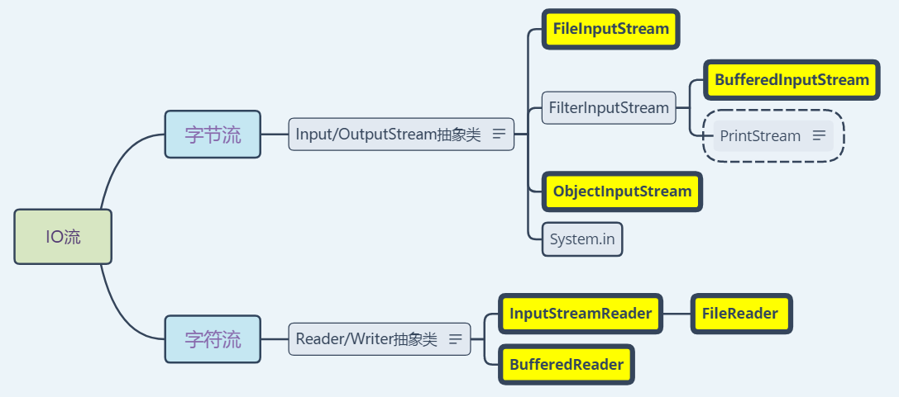
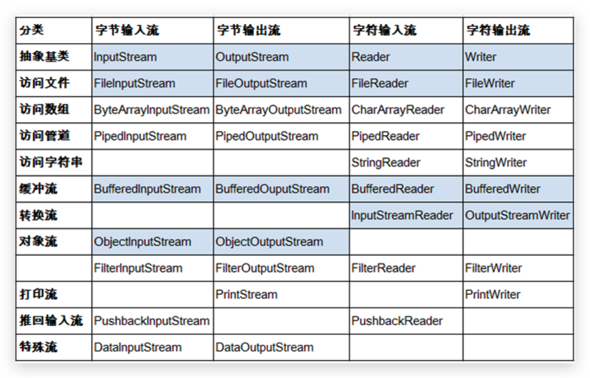

# 8 IO

[[toc]]

- 流，代表任何有能力产出数据的数据源对象或有能力接收数据的接收端对象，屏蔽了实际 I/O 设备处理细节

## 8.1 File

> File（文件）、Directory（目录/文件夹）、Path（路径）
>
> 目录路径（不区分大小写，在 Windows 中使用反斜杠，由于它又是转义字符，所以使用`\\`表示）
>
> - **绝对路径**：**完整的路径，以盘符开始**
> - **相对路径**：简化的路径，相对**当前项目**的路径。IDEA 中 @Test 相对于 Module ，若是 **main 方法则相对于 Project**
>
> 与系统有关的路径分隔符：
>
> - Windows 中是分号`;`
> - Linux、macOS 中是冒号`:`
>
> 与系统有关的默认名称分隔符：
>
> - Windows 中是反斜杠`\`
> - Linux、mac OS 中是正斜杠`/`
>
> 回车符`\r`和换行符`\n` ：
>
> - 回车符：回到一行的开头（return）。
> - 换行符：下一行（newline）。
>
> 系统中的换行：
>
> - Windows 系统里，每行结尾是 `回车+换行` ，即`\r\n`；
> - Unix 系统里，每行结尾只有 `换行` ，即`\n`；
> - Mac 系统里，每行结尾是 `回车` ，即`\r`。从 Mac OS X 开始与 Linux 统一都是`\n`。
>
> 在计算机中中文的存储分两个字节
>
> - 如果写的第一个字节是正数(0-127),那么显示的时候会查询 ASCII 表
> - 如果写的第一个字节是负数，那第一个和第二个字节组成一个中文显示，查询系统默认码表(GBK)

- File 类是**文件和目录路径名**的抽象表示，**与系统无关**。
- 想要在 Java 程序中**表示一个真实存在的文件或目录路径，那么必须有一个 File 对象**，但是 Java 程序中的**一个 File 对象，可能没有一个真实存在的文件或目录路径**。
- File 能新建、删除、重命名文件和目录，但不能访问文件内容（需要使用 IO）。
- File 对象可以作为参数传递给流的构造器。

### 构造方法

- `File(String pathname)`

  可以以**文件**或**目录路径**结尾；

  **存在**或**不存在**（路径分隔符可以使用静态成员变量表示）

  **相对**或**绝对**路径。若是**绝对路径**，则默认的当前路径在系统属性`user.dir`中存储（在 main 中相对于 Project，若在 @Test 中，则相对于 Module）：

  ```java
  System.getProperty("user.dir")
  ```

- `File(File/String parent,String child)`

  以 parent 为父路径，child 为子路径创建 File 对象。

- `File(Url url)`

### 静态成员变量

- `static String pathSeparator` 与系统有关的**路径分隔符**，为了方便，它被表示为一个字符串。
- `static char pathSeparatorChar` 与系统有关的路径分隔符。
  - Windows 中是分号`;`，Linux 中是冒号`:`
- `static String separator` 与系统有关的默认**文件名称分隔符**，为了方便，它被表示为一个字符串。
- `static char separatorChar` 与系统有关的默认名称分隔符。
  - Windows 中是反斜杠`\`，Linux、mac OS 中是正斜杠`/`

### 常用方法

- **获取**

  - `String getAbsolutePath()`：返回此 File 的**绝对路径名**

  - `String getPath()`：将此**File 转换为路径名，构造中传递的路径**。`toString`底层是`getPath`

  - `String getName()`：返回由此**File 表示的文件或目录路径**的名称，**构造中结尾部分文件或文件夹**

  - `long length()`：返回由此**File 表示的文件的长度**，**构造中指定的文件的大小(字节)**

    若构造给出的**路径不存在**或**路径为文件夹**，这个方法**返回 0**

  - `long lastModified()`：返回此抽象路径名表示的**文件最后一次被修改的时间(时间戳的毫秒值)**

  - `String getParent()`：**父目录**（**构造中**除最后一个名称外）的路径名字符串；若没有指定父目录则返回 null。

- **判断**

  - `boolean exists()/isFile()/isDirectory`：**判断路径 是否存在 / 以文件结尾 / 以目录结尾**

  - `boolean canRead()/canWrite()/isHidden()` **判断是否可读/可写/隐藏**

    若路径不存在，直接调用后几个方法都返回 false，所以一般先判断路径是否存在。

- **创建**

  - `boolean creatNewFile()`：当且仅当具有该名称的**文件不存在时创建一个新的空文件**

    **文件路径必须存在**，否则抛异常；只能创建文件；创建成功返回 true，否则返回 false

  - `File creatTempFile(String prefix,String suffix)` **创建临时文件**

  - `boolean mkdir()`：**目录不存在时创建由此 File 表示的目录**。**单级目录**，创建时检查父目录存在否

  - `boolean mkdirs()`：**目录不存在时创建由此 File 表示的目录，包括父目录**。**单/多级目录**

- **删除文件或目录**

  - `boolean delete()`
    1. 如果构造中没**写盘符路径**，默认在项目路径下(**相对路径**)
    2. 如果构造中路径不存在，不会删除
    3. 删除一个文件夹，文件夹中不能有内容
    4. **不走回收站**

- **重命名**

  - `boolean renameTo(File dest)`

    **路径相同为改名，路径不同为改名并剪切文件，且 dest 中不能存在该文件，否则返回 false**

- **遍历目录**(带参为**文件名过滤器**，需匿名内部类实现)

  - 遍历的是构造中的路径。若**路径不存在**或**不是目录结尾**，则抛出**空指针异常**
  - `String[] list([File[name]Filter filter])`：获取指定所有文件或文件夹**名称**的**字符串数组**
  - `File[] listFiles([File[name]Filter filter])`：获取指定所有文件或文件夹的**File 数组**

- **文件过滤器**

  - `java.io.FileFilter`接口
    - `boolean accept(File pathname)` ：测试指定抽象路径名是否应该包含在某个路径名列表中。
    - `File pathname`：要测试的**抽象路径名(File 对象)**
  - `java.io.FilenameFilter`接口
    - `boolean accept(File dir, String name)`：测试指定文件是否应该包含在某一文件列表中。
    - `dir`：被找到的文件**所在的目录**。
    - `name`：**文件的名称**。
  - 分析：`FileFilter`、`FilenameFilter`都是只有一个方法的接口，因此可以用**lambda 表达式**简写。

- **批量修改文件名**

  ```java
  File srcFilePath = new File("D:\\lol");

  //以下4选1
  //FileFilter接口匿名内部类实现
  File[] files = file.listFiles(new FileFilter() {
      @Override
      public boolean accept(File f) {
          return f.isFile() && f.getName().endsWith(".txt");
      }
  });
  //FileFilter接口lambda实现
  File[] files = file.listFiles(f -> f.isFile() && f.getName().endsWith(".txt"));


  //FilenameFilter接口匿名内部类实现
  File[] fileList = srcFilePath.listFiles(new FilenameFilter() {
  	@Override
  	public boolean accept(File dir, String name) {
  		return new File(dir, name).isFile() && name.endsWith(".txt");
  	}
  });
  //FilenameFilter接口lambda实现
  File[] files = file.listFiles((dir, name) -> new File(dir,name).isFile()&&name.endsWith(".txt"));


  File destFilePath = new File("D:\\lol\\new");
  destFilePath.mkdirs();
  for (File file : fileList) {
  	String newName = "new_".concat(file.getName());
  	File newFile = new File(destFilePath, newName);
  	file.renameTo(newFile);
  }
  ```

### 递归

- **方法定义中调用方法本身的现象**。还分有直接递归和间接递归(a 调 b，b 调 c，c 调 a)。

- **注意：**

  1. 要**有出口**可以停止，否则就是死递归
  2. **次数不能过多**，否则内存溢出
  3. **构造方法不能**递归使用

- 递归使用**前提**：**当调用方法的时候，方法主体不变，每次调用方法的参数不同**

- **递归输出指定目录下指定文件的绝对路径**

  ```java
  public static void getFile(File srcFilePath) {
  	File[] fileList = srcFilePath.listFile();
  	for (File file : fileList) {
  		if (file.isDirectory())
  			getFile(file);
  		else {
  			if (file.getName().endsWith(".txt"))
  				System.out.println(file.getAbsolutePath());
  		}
  	}
  }
  ```

- **递归删除指定目录及其包含所有文件、文件夹**

  ```java
  public static void deleteDir(File srcFilePath) {
  	File[] fileList = srcFilePath.listFiles();
  	for(File file:fileList) {
  		if(file.isDirectory())
  			deleteDir(file);
  		else
  			file.delete();
  	}
  	srcFilePath.delete();
  }
  ```

## 8.2 IO 原理及 stream 的分类

- I/O 是 Input/Output 的缩写， I/O 技术是非常实用的技术，用于**处理设备之间的数据传输**。如读/写文件，网络通讯等。 Java 程序中，对于数据的输入/输出操作**以”流(stream)” 的方式**进行。
- Java 中 I/O 操作主要指使用`java.io`包下的内容进行输入、输出操作。

根据流的角色不同分为：

- **节点流**：直接从数据源或目的地读写数据 （如下图中访问文件的文件流）
- **处理流**：不直接连接到数据源或目的地，而是“连接”在已存在的流（节点流或处理流）之上，通过对数据的处理为程序提供更为强大的读写功能，如 Buffered

根据数据的流向分为：

- **输入流** ：把数据从**`其他设备`**上读取到**`程序所在内存`**中的流。
- **输出流** ：把数据从**`内存中程序` **中写出到**`其他设备`**上的流。

根据数据单位类型分为：

- **字节流（8bit）** ：以字节为单位，读写数据的流。
- **字符流（16bit）** ：以字符为单位，读写数据的流。





## 8.3 InputStream、OutputStream

字节流可以传输任意文件数据。无论使用什么样的流对象，底层传输的始终为二进制数据，使用字节流。

`java.io.InputStream`**抽象类**是表示字节输入流的所有类的超类，可以读取字节信息到内存中。

`java.io.OutputStream`**抽象类**是表示字节输出流的所有类的超类，将指定的字节信息写出到目的地。

**`System.in`和 `System.out`也分别是`InputStream、OutputStream`**，可作为参数传递

### FileInputStream、FileOutputStream

`FileInputStream`

- 构造方法

  - `FileInputStream(File file/String name) throws FileNotFoundException`

    > 如果文件不存在，或是目录路径，或其他原因不能读取，则会抛异常

- 常用方法（以下读取方法会类似迭代器指针移动）

  - `int read()`

    从输入流中读取数据的下一个**字节**。返回 `0 ~ 255` 范围内的`int` 字节值。如果因为已经到达流末尾而没有可用的字节，则返回值 `-1`。**阻塞方法**。

  - `int read(byte[] b)` **常用**

    从此输入流中将最多 `b.length` 个字节的数据读入一个`byte[]`中。如果因为已经到达流末尾而没有可用的字节，则返回值`-1`。否则以**整数形式返回实际读取的字节数**。**阻塞方法**。

  - `int read(byte[] b, int off,int len)` 基本不用

    将输入流中最多`len` 个数据字节读入 `byte[]`。尝试读取 `len`个字节，但读取的字节也可能小于该值。以整数形式返回实际读取的字节数。如果因为流位于文件末尾而没有可用的字节，则返回值 `-1`。**阻塞方法**。

  - `close() throws IOException`

    程序中打开的文件 IO 资源不属于内存里的资源，垃圾回收机制无法回收该资源，所以应该显式关闭文件 IO 资源。

    > 流的关闭原则：先开后关，后开先关

`FileOutputStream`

- 构造方法

  - `FileOutputStream(File file/String name[,boolean append])`

    > 写入文件时路径必须存在，文件可以不存在；若文件存在，但不能被写入也会抛异常

- 常用方法

  - `void write(int b)`

    将指定的字节写入此输出流。`write()` 的常规协定是：向输出流写入一个**字节**。要写入的字节是参数 `b` 的**八个低位**。`b` 的 **24 个高位将被忽略**。 即写入`0~255`范围的。 一次写一个**字节**，虽然参数为`int`类型，但是**只会保留一个字节的信息**写出

  - `void write(byte[] b)`

    将 `b.length` 个字节从指定的 `byte[]`写入此输出流。`write(b)` 的常规协定是：底层是调用 `write(b, 0, b.length)` 。

  - `void write(byte[] b,int offset,int len)` **常用**

    将指定 `byte[]`中从偏移量 `offset`开始的 `len` 个字节写入此输出流。 每次写入只替换需要位置的数据

  - `void flush() throws IOException`

    刷新此输出流并强制写出所有缓冲的输出字符，但底层调用`OutputStream`的空实现方法，无用处。

  - `void close() throws IOException`

    程序中打开的文件 IO 资源不属于内存里的资源，垃圾回收机制无法回收该资源，所以应该显式关闭文件 IO 资源。

  - `getBytes()`：将字符串转为字节数组

### BufferedInputStream、BufferedOutputStream

- **缓冲流**的基本原理是在创建流对象时，会**创建一个内置的默认大小的缓冲区数组（8196Byte）**，**通过缓冲区读写**，减少系统 IO 次数，从而提高读写的效率。可以调用`flush`，或`close`自动刷新并关闭

- 当读取数据时，数据按块读入缓冲区，其后的读操作则直接访问缓冲区

- 当使用 BufferedInputStream 读取字节文件时，BufferedInputStream 会一次性从文件中读取 8192 个(8Kb)，存在缓冲区中，直到缓冲区装满了，才重新从文件中读取下一个 8192 个字节数组。

- 向流中写入字节时，不会直接写到文件，先写到缓冲区中直到缓冲区写满， BufferedOutputStream 才会把缓冲区中的数据一次性写到文件里。使用方法 `flush()`可以强制将缓冲区的内容全部写入输出流

- 构造方法（可以指定缓冲区大小，但一般不指定）

  - `BufferedInputStream(InputStream in[,int size])`：参数可以`FileInputStream`
  - `BufferedOutputStream(OutputStream out[,int size])`： 参数可以是`FileOuputStream`

- 常用方法

  - `void flush() throws IOException`

    子类重写了该方法（父类中是空实现方法）。刷新此输出流并强制写出所有缓冲的输出字符

  - 关闭流时，先关闭外层的。即还是后开的先关。但是**关闭外层的流后，系统会自动关闭内层的流**。

## 8.4 Reader、Writer

`java.io.Reader`**抽象类**是表示用于读取字符流的所有类的超类，可以读取字符信息到内存中。

`java.io.Writer`**抽象类**是表示用于写出字符流的所有类的超类，将指定的字符信息写出到目的地。

### 字符编码

**字符编码`Character Encoding`** : 就是一套自然语言的字符与二进制数之间的对应规则。

- **编码**（人能看懂的变成看不懂的）**字符数组、字符串** ——> **字节数组、字节**
- **解码**（人看不懂的变成看得懂的）**字节、字节数组** ——> **字符串、字符数组**

**字符集`Charset`**：编码表。是系统支持的所有字符的集合，包括各国家文字、标点符号、图形符号、数字等。

- 当指定了**编码**，它所对应的**字符集**自然就指定了，所以**编码**才是我们最终要关心的

  

* **ASCII 字符集**
  - ASCII（American Standard Code for Information Interchange，美国信息交换标准代码）是基于拉丁字母的一套电脑编码系统，用于显示现代英语，主要包括控制字符（回车键、退格、换行键等）和可显示字符（英文大小写字符、阿拉伯数字和西文符号）。
  - 基本的 ASCII 字符集，使用**7 位（bit）表示一个字符**，**共 128 字符**。ASCII 的**扩展字符集使用 8 位**（bit）表示一个字符，共 256 字符，方便支持欧洲常用字符。
* **ISO-8859-1 字符集**
  - 拉丁码表，别名 Latin-1，用于显示欧洲使用的语言，包括荷兰、丹麦、德语、意大利语、西班牙语等。
  - ISO-8859-1 使用单字节编码，兼容 ASCII 编码。
* **GBxxx 字符集**
  - GB 就是国标的意思，是为了显示中文而设计的一套字符集。
  - **GB2312**：简体中文码表。**最多两个字节**编码所有字符。一个小于 127 的字符的意义与原来相同。但两个大于 127 的字符连在一起时，就表示一个汉字，这样大约可以组合了包含 7000 多个简体汉字，此外数学符号、罗马希腊的字母、日文的假名们都编进去了，连在 ASCII 里本来就有的数字、标点、字母都统统重新编了两个字节长的编码，这就是常说的"全角"字符，而原来在 127 号以下的那些就叫"半角"字符了。
  - **GBK**：最常用的中文码表。是在 GB2312 标准基础上的扩展规范，使用了**双字节**编码方案，共收录了 21003 个汉字，完全兼容 GB2312 标准，同时支持繁体汉字以及日韩汉字 等。
  - **GB18030**：最新的中文码表。收录汉字 70244 个，采用多字节编码，每个字可以由**1 个、2 个或 4 个字节**组成。支持中国国内少数民族的文字，同时支持繁体汉字以及日韩汉字等。
* **Unicode 字符集**
  - Unicode 编码系统为表达任意语言的任意字符而设计，是业界的一种标准，也称为统一码、标准万国码。
  - 它**最多使用 4 个字节**的数字来表达每个字母、符号，或者文字。有三种编码方案，UTF-8、UTF-16 和 UTF-32。最为常用的 UTF-8 编码。
  - **UTF-8 编码**，可以用来表示 Unicode 标准中任何字符，它是电子邮件、网页及其他存储或传送文字的应用中，优先采用的编码。互联网工程工作小组（IETF）要求所有互联网协议都必须支持 UTF-8 编码。所以，我们开发 Web 应用，也要使用 UTF-8 编码。它使用**一至四个字节**为每个字符编码，编码规则：
    1. 128 个 US-ASCII 字符，只需一个字节编码。
    2. 拉丁文等字符，需要二个字节编码。
    3. 大部分**常用字（含中文），使用三个字节**编码。
    4. 其他极少使用的 Unicode 辅助字符，使用四字节编码。

### InputStreamReader、OutputStreamWriter

**转换流**：唯一可以**指定字符集**的流。将**字节流——>为字符流**读取；将**字符流——>字节流**输出；**看清楚**！

`InputStreamReader`

- 构造方法

  - `InputStreamReader(InputStream is)`：默认编码，IDEA 中默认为 UTF-8
  - `InputStreamReader(InputStream is,String charsetName)`：指定字符集，不区分大小写

- 成员方法

  - `int read()`

    一次读取一个字符。**阻塞方法**。

  - `int read(char[] chs)`

    一次读取一个字符数组。**阻塞方法**。

  - ...

`OutputStreamWriter`

- 构造方法

  - `OutputStreamWriter(OutputStream os)`：默认编码，IDE 中默认为 UTF-8
  - `OutputStreamWriter(OutputStream os,String charsetName)`：指定字符集，不区分大小写

- 成员方法

  - `void write(int c)`

    写一个字符

  - `void write(char[] chs)`

    写一个字符数组

  - `void write(char[] chs,int off,int len)`

    写一个字符数组的一部分

  - `void write(String str)`

    写一个字符串

  - `void write(String str,int off,int len)`

    写一个字符串的一部分

  - ...

    ```JAVA
    InputStreamReader isr = new InputStreamReader(new FileInputStream("test_1.txt"), "UTF-8");
    OutputStreamWriter osw = new OutputStreamWriter(new FileOutputStream("test_2.txt"), "UTF-8");
    char[] chs = new char[1024];
    int len = 0;
    while ((len = isr.read(chs)) != -1) {
    	osw.write(chs, 0, len);
    }
    isr.close();
    osw.close();
    ```

### FileReader、FileWriter

**简化构造方法编写**，但只能**读取系统默认编码**格式（IDEA 中设置为 UTF-8）的文件

`FileReader`：类本身没有成员方法

- 构造方法

  - `FileReader(File file/String fileName) throws FileNotFoundException`

    > 如果文件不存在，或是目录路径，或其他原因不能读取，则会抛异常

- 成员方法（以下读取方法会类似迭代器指针移动）

  - `int read()`

    读取单个**字符**。作为整数读取的字符，范围在 `0~ 65535` 之间（`0x00-0xffff`，2 个字节的 Unicode 码），如果已到达流的末尾，则返回 `-1`。这个方法将**阻塞**直到读取到字符、IO 错误、到达流末尾。**阻塞方法**。

  - `int read(char[] chs)` **推荐**，注意数组每次不会清空，只会替换

    每次读取`chs`的长度个字符到数组中。如果已到达流的末尾，则返回 -1。否则**返回读取到的有效字符个数**。**阻塞方法**。

  - `int read(char[] chs,int off,int len)` 一般不用，底层被其他方法调用

    每次读取部分长度个字符到数组中，读取到流的末尾时返回`-1` ，否则**返回读取到的有效字符个数**。**阻塞方法**。

  - `void flush() throws IOException`

    重写了父类的该方法，刷新此输出流并强制写出所有缓冲的输出字符。

  - `void close() throws IOException`

    程序中打开的文件 IO 资源不属于内存里的资源，垃圾回收机制无法回收该资源，所以应该显式关闭文件 IO 资源。

`FileWriter`

- 构造方法

  - `FileWriter(File file/String fileName[, boolean append]) throws FileNotFoundException`

    默认编码，不能指定。是否续写

    > 写入文件时路径必须存在，文件可以不存在；若文件存在，但不能被写入也会抛异常

- 成员方法

  - `void write(int c)`

    写一个字符

  - `void write(char[] chs)`

    写一个字符数组

  - `void write(char[] chs,int off,int len)` **推荐**

    写一个字符数组的一部分

  - `void write(String str)`

    写一个字符串

  - `void write(String str,int off,int len)` **推荐**

    写一个字符串的一部分

  - `void flush() throws IOException`

    重写了该方法，刷新此输出流并强制写出所有缓冲的输出字符。

  - `void close() throws IOException`

    程序中打开的文件 IO 资源不属于内存里的资源，垃圾回收机制无法回收该资源，所以应该显式关闭文件 IO 资源。

  - `toCharArray()`

    常用方法，将字符串转为字符数组

### BufferedReader、BufferedWriter

- 缓冲流的基本原理是在创建流对象时，会**创建一个内置的默认大小的缓冲区数组**，**通过缓冲区读写**，减少系统 IO 次数，从而提高读写的效率。

- 构造方法（可以指定缓冲区大小，但一般不指定）

  - `BufferedReader(Reader in[,int size])`
  - `BufferedWriter(Writer out[,int size])`

- 特有成员方法

  - `String readLine()`

    一次**读取一行字符串**，只包含该行内容，**不包含任何行终止符如换行符**，如果已到达流末尾，则返回`null`

  - `void newLine()`

    写一个**换行符**，根据系统来决定换行符

  - `void flush() throws IOException`

    刷新此输出流并强制写出所有缓冲的输出字符。

  - `void close() throws IOException`

    程序中打开的文件 IO 资源不属于内存里的资源，垃圾回收机制无法回收该资源，所以应该显式关闭文件 IO 资源。

## 8.5 `close`和`flush`

因为字符流是先写入**内存缓冲区**的原因，如果不关闭输出流，无法写出字符到文件中。但是关闭的流对象，是无法继续写出数据的。如果我们既想写出数据，又想继续使用流，就需要`flush` 方法了。

- `flush` ：刷新缓冲区，流对象可以继续使用。
- `close`：先刷新缓冲区，然后通知系统释放资源。流对象不可以再被使用了。

## 8.6 其他流

### \* 标准输入输出流—`System.in/out`

- `System`类下面有这样的两个字段

  - `static InputStream in` 标准输入流，默认输入设备是键盘

  - `static PrintStream out` 标准输出流，输出设备是显示器。`PrintStream` 是 `OutputStream`的子类，`FilterOutputStream`的子类

  - **重定向**：通过 System 类的`setIn`，`setOut`方法对默认设备进行改变

    ```java
    static void setIn(InputStream in)
    static void setOut(PrintStream out)
    ```

* 三种键盘录入方式

  - main 方法的 args 接收参数

  - **System.in 通过 BufferedReader 进行包装**

    ```java
    BufferedReader br = new BufferedReader(new InputStreamReader(System.in));
    ```

  - Scanner（util 包），可以解析基本类型和字符串的简单文本扫描器。 System.in 系统输入指的是通过**键盘录入**数据。

    ```java
    Scanner sc = new Scanner(System.in)
    ```

* 输出语句的原理和如何使用字符流输出数据

  - 原理

    ```java
    System.out.println("helloworld");

    PrintStream ps = System.out;
    ps.println("helloworld");
    ```

  - **把 System.out 用字符缓冲流包装一下使用**

    ```java
    BufferedWriter bw = new BufferedWriter(new OutputStreamWriter(System.out));

    ```

### \* 打印流—`PrintStream/Writer`

- 实现**将基本数据类型的数据格式转化为字符串输出，只输出**

- 打印流：`PrintStream`和`PrintWriter`

  - 提供了一系列重载的`print()`和`println()`方法，用于多种数据类型的输出，不查询字符集

  - `PrintStream`和`PrintWriter`的输出**不会抛出`IOException`异常**

  - `PrintStream`和`PrintWriter`有自动`flush`功能

  - `PrintStream`打印的所有字符都使用平台的默认字符编码转换为字节。在需要写入字符而不是写入字节的情况下，应该使用 `PrintWriter` 类

  - `System.out`返回的是`PrintStream`的实例

    ```java
    PrintStream ps = null; try {
      FileOutputStream fos = new FileOutputStream(new File("D:\\IO\\text.txt"));
      // 创建打印输出流,设置为自动刷新模式(写入换行符或字节 '\n' 时都会刷新输出缓冲区)
      ps = new PrintStream(fos, true);
      if (ps != null) {// 把标准输出流(控制台输出)改成文件
        System.setOut(ps);
      }
      for (int i = 0; i <= 255; i++) { // 输出ASCII字符
        System.out.print((char) i);
        if (i % 50 == 0) { // 每50个数据一行
          System.out.println(); // 换行
        }
      }
    } catch (FileNotFoundException e) {
      e.printStackTrace();
    }
    finally {
      if (ps != null) {
        ps.close();
      }
    }

    ```

### 数据流—`DataInput/OutputStream`

- 为了方便地操作 Java 语言的**基本数据类型**和**String**的数据，可以使用数据流。

- 数据流有两个类：（用于读取和写出基本数据类型、String 类的数据）

  `DataInputStream` 和 `DataOutputStream`分别“套接”在 `InputStream` 和 `OutputStream`子类的流上

- DataInputStream 中的方法

  - `Byte/char/short/int/long/float/double/boolean readBoolean()...`
  - `String readUTF() / void readFully(byte[] b)`
  - 注意：读取不同类型数据的顺序要和当初写入文件时保存的数据**顺序一致**

- DataOutputStream 中的方法：将上述的方法的 read 改为相应的 write 即可。

### \* 对象流 & 序列化—`ObjectInput/OutputStream`

- 对象流：用于存储和读取**基本数据类型数据或对象**的处理流。它的强大之处就是可以把 Java 中的对象写入到数据源中，也能把对象从数据源中还原回来。

- **对象的序列化**机制：允许把内存中的 Java 对象转换成平台无关的二进制流（字节序列，该字节序列包含该`对象的数据`、`对象的类型`和`对象中存储的属性`等信息），并**持久地保存**在磁盘上，或通过**网络传输**到另一个网络节点。

  序列化是 `RMI` （`Remote Method Invoke` – 远程方法调用）过程的参数和返回值都必须实现的机制，而`RMI`是 JavaEE 的基础。因此序列化机制是 JavaEE 平台的基础

- **对象的反序列化**机制：将二进制流（字节序列）读取并恢复为原来的 Java 对象。

- 如果需要让某个对象支持序列化机制，必须满足两个条件

  - 该类必须实现`java.io.Serializable` 接口（也可以实现`Externalizable`接口）

    `Serializable` 是一个**标记接口（没有要实现的方法）**，不实现此接口的类进行序列化或反序列化，会抛出`NotSerializableException` 。

  - **该类的所有属性必须是可序列化的**。如果**有一个属性不需要被序列化**的，则该属性必须注明是**瞬态**的，使**用`transient` 关键字修饰**。并且被`static`修饰的不能被序列化，不需要添加`transient`关键字，其值为成员变量的默认初始化值。

  - 实际使用时直接转换为 JSON 字符串来进行传递，不用对实体类实现 `Serializable` 接口

* 对于 JVM 可以**反序列化对象**，它必须是**能够找到 class 文件的类**。如果找不到该类的 class 文件，则抛 `ClassNotFoundException`。

  另外，当 JVM 反序列化对象时，能找到 class 文件，但是**class 文件在序列化对象之后发生了修改**，那么反序列化操作也会失败，**抛出一个`InvalidClassException`异常**。发生这个异常的原因如下：

  - 该类的序列版本号与从流中读取的类描述符的版本号不匹配
  - 该类包含未知数据类型
  - 该类没有可访问的无参数构造方法

* 凡是实现`Serializable`接口的类都有一个表示**序列化版本标识符**的静态变量：`static final long serialVersionUID`，用来**表明类的不同版本间的兼容性**。简言之，其目的是以序列化对象进行版本控制，有关各版本反序列化时是否兼容。如果类没有显示定义这个静态常量，它的值是 Java 运行时环境根据类的内部细节自动生成的。若类的实例变量做了修改，serialVersionUID 可能发生变化。故建议**显式声明**。

  简单来说，Java 的序列化机制是通过在运行时判断类的`serialVersionUID`来验证版本一致性的。在进行反序列化时，JVM 会把传来的字节流中的 serialVersionUID 与本地相应实体类的`serialVersionUID`进行比较，如果相同就认为是一致的，可以进行反序列化，否则就会出现序列化版本不一致的异常。(`InvalidCastException`)


`ObjectOutputStream`：把**Java 对象**按照**流的方式写入文本文件保存或者在网络中传输**

- 构造方法
  - `public ObjectOutputStream(OutputStream out)`
- 成员方法
  - `final void writeObject (Object obj)`：**将指定的对象写出**
  - ...

`ObjectInputStream`：**把文本文件中或网络中的流对象数据还原成对象**

- 构造方法
  - `ObjectInputStream(InputStream in)`
- 成员方法
  - `final Object readObject ()`：**读取一个对象，需按顺序读取，但一般一个流中不会写多个类型数据**
  - ...

### \* 随机访问文件流—`RandomAccessFile`

- `java.io.RandomAccessFile` ，直接继承于 `Object`，且实现了`DataInput`、`DataOutput`这两个接口，也就意味着这个类既可以读也可以写。其支持 “**随机访问**” 的方式，程序可以直接跳到文件的任意地方来读、写文件（支持只访问文件的部分内容、可以向已存在的文件后追加内容 ）。`RandomAccessFile` 对象包含一个**记录指针**，用以标示当前读写处的位置，并且可以自由移动记录指针。

  - `long getFilePointer()`：获取文件记录指针的当前位置，从 0 开始
  - `void seek(long position)`：将文件记录指针定位到 position 位置，可以结合 File 的`length()`方法

- 构造方法

  - `RandomAccessFile(File file/String name, String mode)`

    创建`RandomAccessFile`类实例需要指定一个`mode`参数，该参数指定`RandomAccessFile`的访问模式

    - `r`：以只读方式打开

    - `rw`：打开以便读取和写入，异常文件内容全丢失

    - `rwd`：打开以便读取和写入，同步文件内容的更新

    - `rws`：打开以便读取和写入，同步文件内容和元数据的更新

      如果模式为只读 r。则不会创建文件，而是会去读取一个已经存在的文件， 如果读取的文件不存在则会出现异常。 如果模式为 rw 读写。如果文件不存在则会去创建文件，如果存在则不会创建。

- 常用方法（同其他一致）

  - RandomAccessFile 作为输出流时，写出到的文件如果不存在，则在执行过程中自动创建。
  - 如果写出到的文件存在，则会对原有**文件内容进行覆盖**。（默认情况下，从头覆盖，其实是根据**指针**）

- 案例：

  - 我们可以用`RandomAccessFile`这个类，来实现一个**多线程断点下载**的功能， 用过下载工具的朋友们都知道，下载前都会建立两个临时文件，一个是与被下载文件大小相同的空文件，另一个是记录文件指针的位置文件，每次暂停的时候，都会保存上一次的指针，然后断点下载的时候，会继续从上一次的地方下载，从而实现断点下载或上传的功能，有兴趣的朋友们可以自己实现下。
  - 插入效果（复制后续字节）

### 字节数组输出流—`ByteArrayOutputStream`

上节中 RandomAccessFile 插入效果不好，可用该流替代 StringBuilder。数据将被写入该流中，最终再输出。

### 行号流—`LineNumberReader`

- **LineNumberReader 使用**(行号从 setLineNumber+1 开始)

  ```java
  LineNumberReader lnr = new LineNumberReader(new FileReader("name.txt"));
  lnr.setLineNumber(-1);
  String line = null;
  while((line=lnr.readLine())!=null) {
  	System.out.println(lnr.getLineNumber()+":"+line);
  }
  lnr.close();

  ```

### 合并流—`SequenceInputStream`

- 把多个输入流的数据写到一个输出流中。

- 构造方法：

  `SequenceInputStream(InputStream s1, InputStream s2)`

  `SequenceInputStream(Enumeration<? extends InputStream> e)`

## 8.7 IO 异常的处理

### JDK7 之前的处理

使用`try...catch...finally` 代码块，处理异常部分

```java
public class HandleException1 {
    public static void main(String[] args) {
        // 声明变量
        FileWriter fw = null;
        try {
            //创建流对象
            fw = new FileWriter("fw.txt");
            // 写出数据
            fw.write("黑马程序员"); //黑马程序员
        } catch (IOException e) {
            e.printStackTrace();
        } finally {
            try {
                if (fw != null) { //若不做判断，有可能fw为null，就不能调用方法，抛空指针异常
                    fw.close();
                }
            } catch (IOException e) {
                e.printStackTrace();
            }
        }
    }
}

```

### JDK7 的处理

使用 JDK7 优化后的**`try-with-resource` **语句（即**try 后可以跟括号“()”**），该语句确保了==**每个资源在语句结束时自动关闭**==。所谓的资源（resource）是指在程序完成后，必须关闭的对象。格式如下：

```java
try (创建流对象语句，如果有多个使用';'隔开) {
	// 读写数据
} catch (IOException e) {
	e.printStackTrace();
}

```

### JDK9 的处理

JDK9 中`try-with-resource` 的改进，对于**引入对象**的方式，支持的更加简洁。被引入的对象，同样可以自动关闭，无需手动 close，我们来了解一下格式：(但是外部 new 的流对象/资源还得异常处理，此时用 JDK7 的即可)

```java
// 被final修饰的对象
final Resource resource1 = new Resource("resource1");
// 普通对象
Resource resource2 = new Resource("resource2");

// 引入方式：直接引入
try (resource1; resource2) {
     // 使用对象
}

```

## `org.apache.common.io.FileUtils`

工作中常用 apache 提供的工具类

## 习题

以下程序的异常处理不合理，只是为了简写

### 复制文本文件的 5 种方式——字符流

```java
//基本字符流一次读写一个字符
private static void method1(String srcFilePath, String destFilePath) throws IOException {
	FileReader fr = new FileReader(srcFilePath);
	FileWriter fw = new FileWriter(destFilePath);
	int ch = 0;
	while ((ch = fr.read()) != -1) {
		fw.write(ch);
	}
	fr.close();
	fw.close();
}

//基本字符流一次读写一个字符数组
private static void method2(String srcFilePath, String destFilePath) throws IOException {
	FileReader fr = new FileReader(srcFilePath);
	FileWriter fw = new FileWriter(destFilePath);
	char[] chs = new char[1024];
	int len = 0;
	while((len=fr.read(chs))!=-1) {
		fw.write(chs, 0, len);
	}
	fr.close();
	fw.close();
}

//字符缓冲流一次读写一个字符
private static void method3(String srcFilePath, String destFilePath) throws IOException {
	BufferedReader br = new BufferedReader(new FileReader(srcFilePath));
	BufferedWriter bw = new BufferedWriter(new FileWriter(destFilePath));
	int ch = 0;
	while((ch=br.read())!=-1) {
		bw.write(ch);
	}
	br.close();
	bw.close();
}

//字符缓冲流一次读写一个字符数组
private static void method4(String srcFilePath, String destFilePath) throws IOException {
	BufferedReader br = new BufferedReader(new FileReader(srcFilePath));
	BufferedWriter bw = new BufferedWriter(new FileWriter(destFilePath));
	char[] chs = new char[1024];
	int len =0 ;
	while((len=br.read(chs))!=-1) {
		bw.write(chs, 0, len);
	}
	br.close();
	bw.close();
}

//字符缓冲流一次读写一行
private static void method5(String srcFilePath, String destFilePath) throws IOException {
	BufferedReader br = new BufferedReader(new FileReader(srcFilePath));
	BufferedWriter bw = new BufferedWriter(new FileWriter(destFilePath));
	String line = null;
	while((line=br.readLine())!=null) {
		bw.write(line);
		bw.newLine();
		//bw.flush();
	}
	br.close();
	bw.close();
}

```

### 复制二进制数据的 4 种方式——字节流

```java
//字节流一次读写一个字节
private static void method1(String srcFilePath, String destFilePath) throws IOException {
  FileInputStream fis = new FileInputStream(srcFilePath);
  FileOutputStream fos = new FileOutputStream(destFilePath);
  int by = 0;
  while((by=fis.read())!=-1) {
    fos.write(by);
  }
  fis.close();
  fos.close();
}

//字节流一次读写一个字节数组
private static void method2(String srcFilePath, String destFilePath) throws IOException {
  FileInputStream fis = new FileInputStream(srcFilePath);
  FileOutputStream fos = new FileOutputStream(destFilePath);
  byte[] bys = new byte[1024];
  int len =0;
  while((len=fis.read(bys))!=-1) {
    fos.write(bys,0,len);
  }
  fis.close();
  fos.close();
}

//缓冲字节流一次读取一个字节
private static void method3(String srcFilePath, String destFilePath) throws IOException {
  BufferedInputStream bis = new BufferedInputStream(new FileInputStream(srcFilePath));
  BufferedOutputStream bos = new BufferedOutputStream(new FileOutputStream(destFilePath));
  int by = 0;
  while((by=bis.read())!=-1) {
    bos.write(by);
  }
  bis.close();
  bos.close();
}

//缓冲字节流一次读取一个字节数组
private static void method4(String srcFilePath, String destFilePath) throws IOException {
  BufferedInputStream bis = new BufferedInputStream(new FileInputStream(srcFilePath));
  BufferedOutputStream bos = new BufferedOutputStream(new FileOutputStream(destFilePath));
  byte[] bys = new byte[1024];
  int len =0;
  while((len=bis.read(bys))!=-1) {
    bos.write(bys,0,len);
  }
  bis.close();
  bos.close();
}

```

### 把集合中的数据存储到文本文件中

```java
ArrayList<Student> arrayList = new ArrayList<>();
arrayList.add(new Student("zhangsan", 23));
arrayList.add(new Student("lisi", 24));
arrayList.add(new Student("wangwu", 25));
BufferedWriter bw = new BufferedWriter(new FileWriter("collection.txt"));
for (Student s : arrayList) {
	bw.write(s.getName() + ":" + s.getAge());
	bw.newLine();
	bw.flush();
}
bw.close();

```

### 把文本文件中的数据读取到集合并遍历集合

```java
BufferedReader br = new BufferedReader(new FileReader("test_1.txt"));
ArrayList<String> arrayList = new ArrayList<>();
String line = null;
while((line=br.readLine())!=null) {
	arrayList.add(line);
}
for(String s :arrayList)
	System.out.println(s);

```

### 在一个存储人名的文件中随机输出一个人名

```java
ArrayList<String> arrayList = new ArrayList<>();
BufferedReader br = new BufferedReader(new FileReader("name.txt"));
String line = null;
while((line=br.readLine())!=null) {
	arrayList.add(line);
}
br.close();
Random r = new Random();
int random = r.nextInt(arrayList.size());
System.out.println("幸运的猪："+arrayList.get(random));

```

### 复制单级文件夹中指定的文件并修改名称

```java
File srcPath = new File("day19-code\\src\\abc");
File destPath = new File("day19-code\\src\\copy_abc");
if (!destPath.exists())
    destPath.mkdirs();
File[] fileList = srcPath.listFiles(f -> f.isFile() && f.getName().endsWith(".java"));
for (File file : fileList) {
    String newName = file.getName().replace(".java", ".jad");
    File newFile = new File(destPath, newName);
    copyFile(file, newFile);//看下题
}

```

### 复制多级文件夹(整个文件夹复制到目的文件夹目录下)

```java
public static void main(String[] args) throws IOException {
    File srcPath = new File("day19-code\\src\\abc");
    File destPath = new File("day19-code\\src\\copy_abc");
    copyDirectory(srcPath,destPath);
}

private static void copyDirectory(File srcPath, File destPath) throws IOException {
    if (srcPath.isDirectory()) {
        File newDirectory = new File(destPath, srcPath.getName());
        newDirectory.mkdirs();
        File[] files = srcPath.listFiles();
        for (File f : files) {
            copyDirectory(f, newDirectory);
        }
    } else {
        copyFile(srcPath, new File(destPath, srcPath.getName()));
    }
}

private static void copyFile(File srcFilePath, File destFilePath) throws IOException {
	BufferedInputStream bis = new BufferedInputStream(new FileInputStream(srcFilePath));
    BufferedOutputStream bos = new BufferedOutputStream(new FileOutputStream(destFilePath));
	byte[] bys = new byte[1024];
	int len = 0;
	while((len=bis.read(bys))!=-1) {
		bos.write(bys,0,len);
	}
	bis.close();
	bos.close();
}

```

### 将一个文件中的字符串每一行排序后写入另一个文件中

```java
BufferedReader br = new BufferedReader(new FileReader("StringDemo.txt"));
BufferedWriter bw = new BufferedWriter(new FileWriter("newStringDemo.txt"));
String line = null;
while((line=br.readLine())!=null) {
	char[] chs = line.toCharArray();
	Arrays.sort(chs);
	bw.write(String.valueOf(chs));//String s = new String(chs);
	bw.newLine();
	bw.flush();
}
br.close();
bw.close();

```
