# 多线程—共享模型—管程（悲观锁，阻塞）

## 共享带来的线程安全问题

在 Java 中的体现

### 卖票问题

```java
@Slf4j(topic = "TestSafe")
public class TestSafe {
    public static void main(String[] args) throws InterruptedException {

        Runnable task = new Ticket();

        Thread t1 = new Thread(task, "窗口1");
        Thread t2 = new Thread(task, "窗口2");
        Thread t3 = new Thread(task, "窗口3");
        Thread t4 = new Thread(task, "窗口4");

        t1.start();
        t2.start();
        t3.start();
        t4.start();
    }
}

@Slf4j(topic = "Ticket")
class Ticket implements Runnable {
    private static int count = 1_000;// 线程竞争不明显可以增大票数

    @Override
    public void run() {
        while (true) {
            if (count <= 0) {
                log.debug("{}说: 票已经卖完了", Thread.currentThread().getName());
                break;
            }
            try {
                // 进入time waiting，提高线程切换概率，错票几率
                TimeUnit.MILLISECONDS.sleep(10);
                log.debug("{}卖了第{}张票", Thread.currentThread().getName(), count--);
            } catch (InterruptedException e) {
                e.printStackTrace();
            }
        }
    }
}
```

问题：

*   相同的票出现多次：CPU 的一次操作必须是原子性的（但是输出语句不是原子的）
*   出现负数的票：随机性和延迟导致


### 自增自减问题

两个线程对初始值为 0 的**静态变量（局部变量就不一样了）**一个做自增，一个做自减，各做 5000 次，结果是 0 吗？

```java
@Slf4j(topic = "TestCount")
public class TestCount {

    static int counter = 0;

    public static void main(String[] args) throws InterruptedException {
        test1();
    }
    
    public static void test1() throws InterruptedException {
        Thread t1 = new Thread(() -> {
            for (int i = 0; i < 5_000; i++) {
                counter++;
            }
        }, "t1");
        Thread t2 = new Thread(() -> {
            for (int i = 0; i < 5_000; i++) {
                counter--;
            }
        }, "t2");
        t1.start();
        t2.start();
        t1.join();
        t2.join();
        log.debug("{}", counter);
    }
}
```


### 问题分析

以上的结果可能是正数、负数、零。为什么呢？因为 Java 中对**静态变量（局部变量就不一样了）**的自增，自减并不是原子操作，要彻底理解，必须从字节码来进行分析。例如对于 i++ 而言（i 为静态变量），实际会产生如下的 JVM 字节码指令：

```
getstatic i // 获取静态变量i的值
iconst_1 // 准备常量1
iadd // 自增
putstatic i // 将修改后的值存入静态变量i
```

而对应 i-- 也是类似：

```
getstatic i // 获取静态变量i的值
iconst_1 // 准备常量1
isub // 自减
putstatic i // 将修改后的值存入静态变量i
```

而 Java 的内存模型如下，完成静态变量的自增，自减需要**在主存和工作内存中进行数据交换**：


如果是单线程以上 8 行代码是顺序执行（不会交错）没有问题：

```mermaid
sequenceDiagram
participant t1 as 线程1
participant i as static i
i ->> t1 : getstatic i 读取 0
t1 ->> t1 : iconst_1 准备常数 1
t1 ->> t1 : iadd 加法，线程内 i = 1
t1 ->> i : putstatic i 写入 1

i ->> t1 : getstatic i 读取 0
t1 ->> t1 : iconst_1 准备常数 1
t1 ->> t1 : isub 减去，线程内 i = -1
t1 ->> i : putstatic i 写入 1
```



但多线程下这 8 行代码可能**交错运行**

会出现负数的情况：

```mermaid
sequenceDiagram
participant t1 as 线程1
participant t2 as 线程2
participant i as static i
	i ->> t1 : getstatic i 读取 0
	t2 ->> t2 : iconst_1 准备常数 1
	t2 ->> t2 : isub 减去，线程内 i = -1
	t2 -->> t1 : 上下文切换
	
	i ->> t1 : getstatic i 读取 0
	t1 ->> t1 : iconst_1 准备常数 1
	t1 ->> t1 : iadd 加法，线程内 i = 1
	t1 ->> i : putstatic i 写入 1
	
	t1 -->> t2 : 上下文切换
	t2 ->> i : putstatic i 写入 -1
```



出现正数的情况：

```mermaid
sequenceDiagram
participant t1 as 线程1
participant t2 as 线程2
participant i as static i
	i ->> t1 : getstatic i 读取 0
	t1 ->> t1 : iconst_1 准备常数 1
	t1 ->> t1 : iadd 加法，线程内 i = 1
	t1 -->> t2 : 上下文切换
	
	i ->> t2 : getstatic i 读取 0
	t2 ->> t2 : iconst_1 准备常数 1
	t2 ->> t2 : isub 减法，线程内 i = -1
	t2 ->> i : putstatic i 写入 -1
	
	t2 -->> t1 : 上下文切换
	t1 ->> i : putstatic i 写入 1
```




### 线程安全问题总结 🔥

分时系统，线程切换时，对临界区数据读写的非原子性，以及缓存导致最终可能发生**线程安全问题**。出现该问题的原因：

*   **多个线程在操作共享资源**

*   **操作共享资源的代码有多条（可能是非原子操作）**

    即当一个线程在执行操作共享资源的多条代码（可能是非原子操作）过程中，其他线程参与了运算，就会导致

    OS的分时操作，线程切换，缓存


### 临界区 Critical Section

*   一个程序运行多个线程本身是没有问题的

*   问题出在多个线程访问**共享资源**

    *   多个线程读**共享资源**其实也没有问题

    *   在多个线程对**共享资源**读写操作时发生指令交错，就会出现问题

临界区(critical section)是指访问某一共享资源的**代码片段**，并且这段代码的执行**应为原子(atomic) 操作**，**即临界区内的代码必须对外是不可分割的，不会被线程切换所打断**

例如，下面代码中的临界区（必须有synchronized，否则无法保证临界区代码的原子操作）

```java
static int counter = 0;
synchronized static void increment() { 
    // 临界区
    counter++; 
}
synchronized static void decrement() { 
    // 临界区
    counter--; 
}
```


### 竞态条件 Race Condition

竞争条件是指多个任务以**非互斥**的方式同时进入临界区，大家对公共资源的访问是以竞争的方式并行进行的，因此公共资源的最终状态依赖于这些任务的临界区中的微操作**执行次序**。

多个线程在临界区内执行，由于代码的**执行序列不同**而导致结果无法预测，称之为发生了**竞态条件**


## 解决方案总览 🔥

为了**避免临界区的竞态条件发生**，有多种手段可以达到目的。

*   **阻塞式**的解决方案：
    *   同步锁机制：**synchronized**（同步代码块、同步方法）
    *   Lock锁机制：**Lock**

*   **非阻塞式**的解决方案
    *   **原子变量**


## synchronized 关键字 🔥

### 介绍

`synchronized`关键字可以用于**方法中的某个区块中**，表示只对这个区块的**资源实行互斥访问**。让同一时刻至多只有一个线程能持有【同步锁/对象锁/对象监视器】，其它线程再想获取这个【同步锁/对象锁/对象监视器】时就会**阻塞**住。这样就能保证拥有锁的线程可以安全的执行临界区内的代码，不用担心线程上下文切换

**注意**，虽然 java 中互斥和同步都可以采用 synchronized 关键字来完成，但它们还是有区别的：

*   **互斥**是保证临界区的竞态条件发生，同一时刻只能有一个线程执行临界区代码

*   **同步**是由于线程执行的先后、顺序不同、需要一个线程等待其它线程运行到某个点

**synchronized 的优缺点：**

- **好处**：解决线程的安全问题（互斥）
- **弊端**：相对**降低效率**（同步），因为同步外的线程都会判断同步锁；若有**同步嵌套容易产生死锁**

**同步锁/对象锁/对象监视器**

- 锁对象可以是**任意类型**
- 多个线程对象要使用**同一把锁**


### 语法1—同步代码块

锁的目标是对象！

```java
synchronized(对象){// 线程1进入后，线程2到这里就被 blocked
    // 临界区
}
```


### 卖票问题解决

```java
@Slf4j(topic = "SafeTicket")
class SafeTicket implements Runnable {
    private static int count = 1_000;// 线程竞争不明显可以增大票数

    // final Object lock = new Object();

    @Override
    public void run() {
        // 卖票窗口一直开着，不能在同步中，否则就会被一个线程执行完
        while (true) {
            // synchronized 需在内部写，否则其他线程会进不去。类似进入厕所然后锁门。需要包裹操作共享资源的代码。
            // 还可以写 this（注意唯一性）、SafeTicket.class、上面的对象 lock
            synchronized (this) {
                if (count <= 0) {
                    log.debug("{}说: 票已经卖完了", Thread.currentThread().getName());
                    break;
                }
                try {
                    // 进入time waiting，提高线程切换概率，错票几率
                    TimeUnit.MILLISECONDS.sleep(10);
                    log.debug("{}卖了第{}张票", Thread.currentThread().getName(), count--);
                } catch (InterruptedException e) {
                    e.printStackTrace();
                }
            }
        }
    }
}

@Slf4j(topic = "TestSafe")
public class TestSafe {
    public static void main(String[] args) throws InterruptedException {

        Runnable task = new Ticket();

        Thread t1 = new Thread(task, "窗口1");
        Thread t2 = new Thread(task, "窗口2");
        Thread t3 = new Thread(task, "窗口3");
        Thread t4 = new Thread(task, "窗口4");

        t1.start();
        t2.start();
        t3.start();
        t4.start();
    }
}
```


### 自增自减问题解决

```java
@Slf4j(topic = "TestCount")
public class TestCount {

    static int counter = 0;

    static final Object room = new Object();

    public static void main(String[] args) throws InterruptedException {
        // test1();
        test2();
    }

    /**
     * 同步代码块
     */
    public static void test2() throws InterruptedException {
        Thread t1 = new Thread(() -> {
            for (int i = 0; i < 5_000; i++) {
                synchronized (room) {
                    counter++;
                }
            }
        }, "t1");
        Thread t2 = new Thread(() -> {
            for (int i = 0; i < 5_000; i++) {
                synchronized (room) {
                    counter--;
                }
            }
        }, "t2");
        t1.start();
        t2.start();
        t1.join();
        t2.join();
        log.debug("{}", counter);
    }
}
```


### 原理 🔥

类比：

*   synchronized(对象) 中的对象，可以想象为一个房间（room），有唯一入口（门）房间只能一次进入一人进行计算，线程 t1，t2 想象成两个人

*   当线程 t1 执行到 synchronized(room) 时就好比 t1 进入了这个房间，并锁住了门拿走了钥匙，在门内执行count++ 代码

*   这时候如果 t2 也运行到了 synchronized(room) 时，它发现门被锁住了，只能在门外等待，发生了上下文切换，阻塞住了

*   这中间**即使 t1 的 cpu 时间片不幸用完，被踢出了门外**（不要错误理解为锁住了对象就能一直执行下去哦），这时**门还是锁住的，t1 仍拿着钥匙，t2 线程还在阻塞状态进不来**，只有**下次轮到 t1 自己再次获得时间片时才能开门进入**
*   **当 t1 执行完 synchronized{} 块内的代码，这时候才会从 obj 房间出来并解开门上的锁，唤醒 t2 线程把钥匙给他**。t2 线程这时才可以进入 obj 房间，锁住了门拿上钥匙，执行它的 count-- 代码

用图表示：

```mermaid
sequenceDiagram
participant t1 as 线程1
participant t2 as 线程2
participant i as static i
participant lock as 锁对象
	t2 ->> lock : 尝试获取锁
	note over t2,lock: 拥有锁
	i ->> t1 : getstatic i 读取 0
	t2 ->> t2 : iconst_1 准备常数 1
	t2 ->> t2 : isub 减去，线程内 i = -1
	t2 -->> t1 : 上下文切换
	
	t1 -x lock : 尝试获取锁，被阻塞（BLOCKED）
	
	t1 -->> t2 : 上下文切换
	t2 ->> i : putstatic i 写入 -1
	note over t2,lock: 拥有锁
	t2 ->> lock : 释放锁，并唤醒阻塞的线程
	
	note over t1,lock: 拥有锁
	i ->> t1 : getstatic i 读取 0
	t1 ->> t1 : iconst_1 准备常数 1
	t1 ->> t1 : iadd 加法，线程内 i = 1
	t1 ->> i : putstatic i 写入 1
	note over t1,lock: 拥有锁
	t1 ->> lock : 释放锁，并唤醒阻塞的线程
```




### 思考

synchronized 实际是用**对象锁**保证了**临界区内代码的原子性（临界区内的代码必须对外是不可分割的，不会被线程切换所打断）**。为了加深理解，请思考下面的问题（自增自减问题）：

*   如果把 synchronized(obj) 放在 for 循环的外面，如何理解？-- 对for循环整体保证原子性

*   如果 t1 synchronized(obj1) 而 t2 synchronized(obj2) 会怎样运作？-- 锁对象不同，无法保证同步互斥

*   如果 t1 synchronized(obj) 而 t2 没有加会怎么样？如何理解？-- 锁对象不同，一个有一个没有，则会发生线程安全问题

    加法不加锁则是正数几率大，减法不加锁则是负数几率大，为啥了。。


### 自增自减面向对象改进

```java
@Slf4j(topic = "TestCount2")
public class TestCount2 {

    public static void main(String[] args) throws InterruptedException {
        Room room = new Room();

        Thread t1 = new Thread(() -> {
            for (int i = 0; i < 5_000; i++) {
                room.increment();
            }
        }, "t1");
        Thread t2 = new Thread(() -> {
            for (int i = 0; i < 5_000; i++) {
                room.decrement();
            }
        }, "t2");
        t1.start();
        t2.start();
        t1.join();
        t2.join();
        log.debug("{}", room.getCount());
    }
}

class Room {
    private int count = 0;

    public void increment(){
        synchronized (this){
            count++;
        }
    }

    public void decrement(){
        synchronized (this){
            count--;
        }
    }

    public int getCount(){
        synchronized (this){
            return count;
        }
    }
}
```


### 语法2—同步方法 & 锁对象 🔥

**此时同步锁是谁？锁的目标还是对象**，不是锁方法！

- 对于**非 static 方法**，同步锁就是**this**，此时代表调用 run 方法的对象

- 对于**static 方法**，同步锁当前方法所在类的字节码对象(**类名.class**)，**与方法调用者无关**！！！

    使用继承 Thread 类和同步方法实现时，需要写 `static synchronized`

```java
class Test {
    public synchronized void test(){
        // 临界区
    }
}

// 等价于（自动转换）
class Test {
    public void test(){
        synchronized(this){
            // 临界区
        }
    }
}
```

```java
class Test {
    public synchronized static void test(){
        // 临界区
    }
}

// 等价于（自动转换）
class Test {
    public void test(){
        synchronized(Test.class){
            // 临界区
        }
    }
}
```

改进代码如下：

```java
@Slf4j(topic = "TestCount2")
public class TestCount2 {

    public static void main(String[] args) throws InterruptedException {
        Room room = new Room();

        Thread t1 = new Thread(() -> {
            for (int i = 0; i < 5_000; i++) {
                room.increment();
            }
        }, "t1");
        Thread t2 = new Thread(() -> {
            for (int i = 0; i < 5_000; i++) {
                room.decrement();
            }
        }, "t2");
        t1.start();
        t2.start();
        t1.join();
        t2.join();
        log.debug("{}", room.getCount());
    }
}

class Room {
    private int count = 0;

    public synchronized void increment() {
        count++;
    }

    public synchronized void decrement() {
        count--;
    }

    public synchronized int getCount() {
        return count;
    }
}
```


### "线程八锁" 🔥

考察 synchronized 锁住的是哪个对象

#### 情况1

结果：12 或 21

锁是 this 对象（底层查看 n1 对象头部信息）

```java
public class Test1 {

    public static void main(String[] args) {
        Number n1 = new Number();
        new Thread(n1::a).start();
        new Thread(n1::b).start();
    }
}

@Slf4j(topic = "Number")
class Number{
    public synchronized void a() {
        log.debug("1");
    }
    public synchronized void b() {
        log.debug("2");
    }
}
```


#### 情况2

结果：1s后12，或 2 1s后 1

```java
public class Test1 {

    public static void main(String[] args) {
        Number n1 = new Number();
        new Thread(n1::a).start();
        new Thread(n1::b).start();
    }
}

@Slf4j(topic = "Number")
class Number{
    public synchronized void a() {
        try {
            TimeUnit.SECONDS.sleep(1);// sleep 不会释放锁，会释放处理机
        } catch (InterruptedException e) {
            e.printStackTrace();
        }
        log.debug("1");
    }
    public synchronized void b() {
        log.debug("2");
    }
}
```


#### 情况3

结果：3 1s 12 或 23 1s 1 或 32 1s 1

*   若a先获得锁，则3先打印，1s后1打印，2打印
*   若b先获得锁，则2或3先打印，1s后1打印

```java
public class Test3 {

    public static void main(String[] args) {
        Number3 n1 = new Number3();
        new Thread(n1::a).start();
        new Thread(n1::b).start();
        new Thread(n1::c).start();
    }
}

@Slf4j(topic = "Number")
class Number3{
    public synchronized void a() {
        try {
            TimeUnit.SECONDS.sleep(1);
        } catch (InterruptedException e) {
            e.printStackTrace();
        }
        log.debug("1");
    }
    public synchronized void b() {
        log.debug("2");
    }

    public void c() {
        log.debug("3");
    }
}
```


#### 情况4

结果：2 1s 后 1

*   首先锁对象都不是同一个了！所以俩线程并行执行
*   a需要等1s，所以是先打印2，1s后打印1

```java
public class Test4 {

    public static void main(String[] args) {
        Number4 n1 = new Number4();
        Number4 n2 = new Number4();
        new Thread(n1::a).start();
        new Thread(n2::b).start();
    }
}

@Slf4j(topic = "Number")
class Number4{
    public synchronized void a() {
        try {
            TimeUnit.SECONDS.sleep(1);
        } catch (InterruptedException e) {
            e.printStackTrace();
        }
        log.debug("1");
    }
    public synchronized void b() {
        log.debug("2");
    }
}
```


#### 情况5

结果：2 1s 后 1

*   首先锁对象都不是同一个了！**static 方法不是看调用者，是看规则**！

    a的锁是Number4.class对象，b的锁是this对象，所以俩线程并行执行

*   a需要等1s，所以是先打印2，1s后打印1

```java
public class Test5 {

    public static void main(String[] args) {
        Number5 n1 = new Number5();
        new Thread(() -> n1.a()).start();
        new Thread(() -> n1.b()).start();
    }
}

@Slf4j(topic = "Number")
class Number5{
    public static synchronized void a() {
        try {
            TimeUnit.SECONDS.sleep(1);
        } catch (InterruptedException e) {
            e.printStackTrace();
        }
        log.debug("1");
    }
    public synchronized void b() {
        log.debug("2");
    }
}
```


#### 情况6

结果：1s后12，或 2 1s后 1

*   锁对象都是 Number6.class ，所以同步互斥运行

```java
public class Test6 {

    public static void main(String[] args) {
        new Thread(Number6::a).start();
        new Thread(Number6::b).start();
    }
}

@Slf4j(topic = "Number")
class Number6{
    public static synchronized void a() {
        try {
            TimeUnit.SECONDS.sleep(1);
        } catch (InterruptedException e) {
            e.printStackTrace();
        }
        log.debug("1");
    }
    public static synchronized void b() {
        log.debug("2");
    }
}
```


#### 情况7

*   结果：2 1s 后 1
    *   首先锁对象都不是同一个了，所以俩线程并行执行
    *   a需要等1s，所以是先打印2，1s后打印1

```java
public class Test7 {

    public static void main(String[] args) {
        Number7 n1 = new Number7();
        Number7 n2 = new Number7();
        new Thread(() -> n1.a()).start();
        new Thread(() -> n2.b()).start();
    }
}

@Slf4j(topic = "Number")
class Number7{
    public static synchronized void a() {
        try {
            TimeUnit.SECONDS.sleep(1);
        } catch (InterruptedException e) {
            e.printStackTrace();
        }
        log.debug("1");
    }
    public synchronized void b() {
        log.debug("2");
    }
}
```


#### 情况8

结果：1s后12，或 2 1s后 1

*   虽然看着是new了不同的对象，但是实际调用会转为类static调用，所以是同一锁对象

```java
public class Test8 {

    public static void main(String[] args) {
        Number8 n1 = new Number8();
        Number8 n2 = new Number8();
        new Thread(() -> n1.a()).start();
        new Thread(() -> n2.b()).start();
    }
}

@Slf4j(topic = "Number")
class Number8{
    public static synchronized void a() {
        try {
            TimeUnit.SECONDS.sleep(1);
        } catch (InterruptedException e) {
            e.printStackTrace();
        }
        log.debug("1");
    }
    public static synchronized void b() {
        log.debug("2");
    }
}
```


## 变量的线程安全分析 🔥

### 成员变量和静态变量是否线程安全？

*   如果它们**没有共享，则线程安全**
*   如果它们被**共享**了，根据它们的状态是否能够改变，又分两种情况
    *   如果**只有读**操作，则**线程安全**
    *   如果**有读写**操作，则这段代码是临界区，需要**考虑线程安全**


### 局部变量是否线程安全？

*   **局部变量**是**线程安全**的
*   但**局部变量引用的对象则未必**🔥
    *   如果该对象**没有逃离方法的作用访问**，它是**线程安全**的
    *   如果该对象**逃离方法的作用范围**，需要**考虑线程安全**


### 分析—成员变量—List#add × 🔥

```java
class Test {
    static final int THREAD_NUMBER = 2;
    static final int LOOP_NUMBER = 200;

    public static void main(String[] args) {
        ThreadUnsafe test = new ThreadUnsafe();
        for (int i = 0; i < THREAD_NUMBER; i++) {
            new Thread(() -> {
                test.method1(LOOP_NUMBER);
            }, "Thread" + i).start();
        }
    }
}

class ThreadUnsafe {

    /* 成员变量 */
    ArrayList<String> list = new ArrayList<>();

    public void method1(int loopNumber) {
        for (int i = 0; i < loopNumber; i++) {
            // 临界区, 会产生竞态条件
            method2();
            method3();
            // 临界区
        }
    }

    private void method2() {
        list.add("1");
    }

    private void method3() {
        list.remove(0);
    }
}
```

这里面本来method2执行完add后再执行method3的remove是无论如何不会出错的，但是在多线程下，**add方法不是原子性**的：

```java
public boolean add(E e) {
    ensureCapacityInternal(size + 1);  // Increments modCount!!
    elementData[size++] = e;
    return true;
}
```

**有可能2个线程同时操作add时，拿到了同一个size**，即**只添加了一个元素**！此时要是调用第二个remove就会抛如下异常：

```
Exception in thread "Thread0" java.lang.IndexOutOfBoundsException: Index: 0, Size: 0
	at java.util.ArrayList.rangeCheck(ArrayList.java:657)
	at java.util.ArrayList.remove(ArrayList.java:496)
	at _10_var_safe.ThreadUnsafe.method3(ThreadUnsafe.java:23)
	at _10_var_safe.ThreadUnsafe.method1(ThreadUnsafe.java:14)
	at _10_var_safe.ThreadUnsafe.lambda$main$0(ThreadUnsafe.java:37)
	at java.lang.Thread.run(Thread.java:748)
```

与自增自减不同的是，自增自减中2个线程，分别进行增、减操作，这里是一个线程内进行增减操作

分析：

*   无论哪个线程中的 method2 引用的都是同一个对象中的 list 成员变量

*   method3 与 method2 分析相同


### 分析—局部普通变量 ✓

如下代码：

```java
public static void test1() {
    int i = 10; 
    i++; 
}
```

每个线程调用 test1() 方法时局部变量 i，会在每个线程的栈帧内存中被创建多份，因此不存在共享

```
public static void test1();

	descriptor: ()V
    flags: ACC_PUBLIC, ACC_STATIC
	Code:
		stack=1, locals=1, args_size=0 
			0: bipush 10
			2: istore_0
			3: iinc 0, 1 
			6: return
		LineNumberTable:
			line 10: 0
			line 11: 3
			line 12: 6
		LocalVariableTable:
			Start Length Slot Name Signature
			3 		4 		0 	i 		I
```

如图：


### 分析—局部变量为引用对象 ✓

将 list 修改为局部变量

```java
class Test {
    static final int THREAD_NUMBER = 2;
    static final int LOOP_NUMBER = 200;

    public static void main(String[] args) {
        ThreadSafe test = new ThreadSafe();
        for (int i = 0; i < THREAD_NUMBER; i++) {
            new Thread(() -> {
                test.method1(LOOP_NUMBER);
            }, "Thread" + i).start();
        }
    }
}

class ThreadSafe {

    public void method1(int loopNumber) {
        ArrayList<String> list = new ArrayList<>();
        for (int i = 0; i < loopNumber; i++) {
            // 临界区, 会产生竞态条件
            method2(list);
            method3(list);
            // 临界区
        }
    }

    private void method2(ArrayList<String> list) {
        list.add("1");
    }

    private void method3(ArrayList<String> list) {
        list.remove(0);
    }
}
```

那么就不会有上述问题了

分析：

*   list 是局部变量，**每个线程调用时会创建其不同实例，没有共享**

*   而 method2 的参数是从 method1 中传递过来的，与 method1 中引用同一个对象

*   method3 的参数分析与 method2 相同


### 分析—局部变量为引用对象并暴露 × 

方法访问修饰符带来的思考，如果把 method2 和 method3 的方法修改为 public 会不会代理线程安全问题？

*   情况1：有其它线程调用 method2 和 method3

    没有问题，因为操作的list对象还是各线程私有的

*   情况2：在 情况1 的基础上，为 ThreadSafe 类添加子类，子类覆盖 method2 或 method3 方法，即

```java
class Test2 {
    static final int THREAD_NUMBER = 2;
    static final int LOOP_NUMBER = 200;

    public static void main(String[] args) {
        ThreadSafe2Sub test = new ThreadSafe2Sub();
        for (int i = 0; i < THREAD_NUMBER; i++) {
            new Thread(() -> test.method1(LOOP_NUMBER), "Thread" + i).start();
        }
    }
}


class ThreadSafe2 {

    public void method1(int loopNumber) {
        ArrayList<String> list = new ArrayList<>();
        for (int i = 0; i < loopNumber; i++) {
            // 临界区, 会产生竞态条件
            method2(list);
            method3(list);
            // 临界区
        }
    }

    public void method2(ArrayList<String> list) {
        list.add("1");
    }

    public void method3(ArrayList<String> list) {
        list.remove(0);
    }
}

class ThreadSafe2Sub extends ThreadSafe2{
    // @Override
    // public void method2(ArrayList<String> list) {
    //     new Thread(()-> list.add("1")).start();
    // }

    @Override
    public void method3(ArrayList<String> list) {
        new Thread(()-> list.remove(0)).start();
    }
}
```

这样就导致多个线程对同一资源进行操作，且操作的语句有多条！remove底层：

```java
public E remove(int index) {
    rangeCheck(index);

    modCount++;
    E oldValue = elementData(index);

    int numMoved = size - index - 1;
    if (numMoved > 0)
        System.arraycopy(elementData, index+1, elementData, index,
                         numMoved);
    elementData[--size] = null; // clear to let GC do its work

    return oldValue;
}
```


### 常见线程安全类—同步锁

*   StringBuffer
*   Random
*   ~~Vector~~：不推荐
*   ~~Hashtable~~：不推荐
*   java.util.concurrent 包下的类

这里说它们是线程安全的是指，**多个线程调用**它们**同一个实例的某个方法时**，是**线程安全**的。也可以理解为

```java
Hashtable table = new Hashtable();
new Thread(()->{
    table.put("key", "value1");
}).start();
new Thread(()->{
    table.put("key", "value2");
}).start();
```

它们的**每个方法是原子**的。但**注意**它们**多个方法的组合不是原子**的：

```java
Hashtable table = new Hashtable();
new Thread(()->{
    if(table.get("key")==null){
        table.put("key", "value");
    }
}).start();
```



```mermaid
sequenceDiagram
participant t1 as 线程1
participant t2 as 线程2
participant table
t1 ->> table : get("key") == null
t2 ->> table : get("key") == null
t2 ->> table : put("key", "value)
t1 ->> table : put("key", "value)
```

每个原子操作执行完后都会释放锁，并唤醒其他阻塞线程。这里的get、put方法都是同一把锁


### 常见线程安全类—不可变类

*   String
*   Integer

String、Integer 等都是不可变类，因为其内部的状态不可以改变，因此它们的方法都是线程安全的

有同学或许有疑问，String 有 replace，substring 等方法【可以】改变值啊，那么这些方法又是如何保证线程安全的呢？

因为**没有改变原有的值**，是**重新new一个对象并返回**的！


### 实例分析 🔥

**如下实例中，Servlet 都是单例的！！！所以其所有 Service、Dao 也都是单例的**

[Servlet参考博客](https://www.cnblogs.com/stono/p/14234241.html)


#### 例1

```java
public class MyServlet extends HttpServlet {
    // 是否安全？否
    Map<String,Object> map = new HashMap<>();
    // 是否安全？是
    String S1 = "...";
    // 是否安全？是
    final String S2 = "...";
    // 是否安全？否
    Date d1 = new Date();
    // 是否安全？否，只是 d2 这个引用值不能变，其对象内部属性是可变的
    final Date d2 = new Date();

    public void doGet(HttpServletRequest request, HttpServletResponse response) {
        // 使用上述变量
    }
}
```


#### 例2

```java
// MyServlet 只有一份，每个线程访问都会有一份
public class MyServlet extends HttpServlet {
    // 是否安全？成员变量，可能有线程安全问题。UserServiceImpl中有成员变量，并有对该成员变量的修改操作
    private UserService userService = new UserServiceImpl();
    
    public void doGet(HttpServletRequest request, HttpServletResponse response) {
        userService.update(...);
    }
}
public class UserServiceImpl implements UserService {
    // 记录调用次数
    // 成员变量，可能有线程安全问题
    private int count = 0;
    public void update() {
        // ...同样
        count++;
    }
}
```


#### 例3

```java
@Aspect
@Component// Spring组件默认单例
public class MyAspect {
    // 是否安全？成员变量，可能有线程安全问题
    private long start = 0L;
    @Before("execution(* *(..))")
    public void before() {
        start = System.nanoTime();
    }
    @After("execution(* *(..))")
    public void after() {
        long end = System.nanoTime();
        System.out.println("cost time:" + (end-start));
    }
}
```

可以使用环绕通知，将变量改为局部变量


#### 例4

```java
public class MyServlet extends HttpServlet {
    // 是否安全。是。没有对userService进行修改的操作
    private UserService userService = new UserServiceImpl();
    
    public void doGet(HttpServletRequest request, HttpServletResponse response) {
        userService.update(...);
    }
}
public class UserServiceImpl implements UserService {
    // 是否安全。是。没有对userDao进行修改的操作
    private UserDao userDao = new UserDaoImpl();
    public void update() {
        userDao.update();
    }
}
public class UserDaoImpl implements UserDao { 
    public void update() {
        String sql = "update user set password = ? where username = ?";
        // 是否安全。是。没有成员变量，只有局部变量一般都是线程安全的
        try (Connection conn = DriverManager.getConnection("","","")){
            // ...
        } catch (Exception e) {
            // ...
        }
    }
}
```


#### 例5

```java
public class MyServlet extends HttpServlet {
    // 是否安全。是。没有对userService进行修改的操作
    private UserService userService = new UserServiceImpl();
    
    public void doGet(HttpServletRequest request, HttpServletResponse response) {
        userService.update(...);
    }
}
public class UserServiceImpl implements UserService {
    // 是否安全。是。没有对userDao进行修改的操作
    private UserDao userDao = new UserDaoImpl();
    
    public void update() {
        userDao.update();
    }
}
public class UserDaoImpl implements UserDao {
    // 是否安全。否。成员变量，且有对成员变量的修改操作，如close
    private Connection conn = null;
    public void update() throws SQLException {
        String sql = "update user set password = ? where username = ?";
        conn = DriverManager.getConnection("","","");
        // ...
        conn.close();
    }
}
```


#### 例6

```java
public class MyServlet extends HttpServlet {
    // 是否安全。是
    private UserService userService = new UserServiceImpl();
    public void doGet(HttpServletRequest request, HttpServletResponse response) {
        userService.update(...);
    }
}
public class UserServiceImpl implements UserService { 
    // 是否安全。是
    public void update() {
        UserDao userDao = new UserDaoImpl();
        userDao.update();
    }
}
public class UserDaoImpl implements UserDao {
    // 是否安全，是，每次都会new UserDaoImpl，其实例中的成员变量不存在共享
    private Connection conn = null;
    public void update() throws SQLException {
        String sql = "update user set password = ? where username = ?";
        conn = DriverManager.getConnection("","","");
        // ...
        conn.close();
    }
}
```


#### 例7

```java
public abstract class Test {
    public void bar() {
        // 是否安全。否。局部变量为引用对象，并暴露了！
        SimpleDateFormat sdf = new SimpleDateFormat("yyyy-MM-dd HH:mm:ss");
        foo(sdf);
    }
    public abstract foo(SimpleDateFormat sdf);
    public static void main(String[] args) {
        new Test().bar();
    }
}
```

其中 foo 的行为是不确定的，可能导致不安全的发生，被称之为**外星方法**

```java
public void foo(SimpleDateFormat sdf) {
    String dateStr = "1999-10-11 00:00:00";
    for (int i = 0; i < 20; i++) {
        new Thread(() -> {
            try {
                sdf.parse(dateStr);
            } catch (ParseException e) {
                e.printStackTrace();
            }
        }).start();
    }
}
```

请比较 JDK 中 String 类的实现


#### 例8

```java
@Slf4j(topic = "Test3")
public class Test3 {

    private static Integer i = 0;
    public static void main(String[] args) throws InterruptedException {
        List<Thread> list = new ArrayList<>();
        for (int j = 0; j < 2; j++) {
            Thread thread = new Thread(() -> {
                for (int k = 0; k < 5000; k++) {
                    synchronized (i) {
                        i++;
                    }
                }
            }, "" + j);
            list.add(thread);
        }

        list.forEach(Thread::start);
        list.forEach(t -> {
            try {
                t.join();
            } catch (InterruptedException e) {
                e.printStackTrace();
            }
        });
        log.debug("{}", i);// 不够10000
    }
}
```

锁对象用的是成语变量 Integer i ，一直在变化，所以有线程安全问题


### 习题1—卖票练习 🔥

测试下面代码是否存在线程安全问题，并尝试改正。目前已是正确的了！

```java
@Slf4j(topic = "TestSell")
public class TestSell {

    // Random 为线程安全
    static Random random = new Random();

    // 随机 1~5
    public static int randomAmount() {
        return random.nextInt(5) + 1;
    }


    @RepeatedTest(10)
    void test() {
        // 初始化票数
        TicketWindow ticketWindow = new TicketWindow(1000);

        // 方便 join 同步，等待都完成后 main 线程执行统计。主线程中执行的，不涉及多线程
        List<Thread> list = new ArrayList<>();

        // 用来存储卖出去多少张票。共享资源，若使用 List#add 其方法不是同步的，有线程安全问题
        List<Integer> sellCount = new Vector<>();
        for (int i = 0; i < 2_000; i++) {
            Thread t = new Thread(() -> {
                try {
                    // 增加时间，以便线程切换几率，否则代码太少，很快就执行完了
                    TimeUnit.MILLISECONDS.sleep(randomAmount());
                } catch (InterruptedException e) {
                    e.printStackTrace();
                }
                // 分析这里的竞态条件
                // 该方法不是原子的，需要同步约束
                int count = ticketWindow.sell(randomAmount());
                // 该方法已经是同步的了，且和上面的不是同一共享资源，所以无需组合同步
                sellCount.add(count);
            });
            list.add(t);
            t.start();
        }
        list.forEach(t -> {
            try {
                t.join();
            } catch (InterruptedException e) {
                e.printStackTrace();
            }
        });
        log.debug("卖出的票 :{} \t余票: {}",
                sellCount.stream().mapToInt(c -> c).sum(),
                ticketWindow.getCount() );
        // 卖出的票 + 余票 应该等于初始票数
    }


}


// 售票窗口
class TicketWindow {
    private int count;

    public TicketWindow(int count) {
        this.count = count;
    }

    // 获取余票
    public int getCount() {
        return count;
    }

    // 售票。必须加上synchronized，保证原子性
    public synchronized int sell(int amount) {
        if (this.count >= amount) {
            this.count -= amount;
            return amount;
        } else {
            return 0;
        }
    }
}
```

不加sleep，使用脚本测试多次（有可能电脑太快了，还必须加sleep）。如下为cmd

```
for /L %n in (1,1,10) do java -cp ".;C:\Users\manyh\.m2\repository\ch\qos\logback\logback-classic\1.2.3\logback-classic-1.2.3.jar;C:\Users\manyh\.m2\repository\ch\qos\logback\logback-core\1.2.3\logback-core-1.2.3.jar;C:\Users\manyh\.m2\repository\org\slf4j\slf4j-api\1.7.25\slf4j-api-1.7.25.jar" cn.itcast.n4.exercise.ExerciseSell
```

*   -cp：classpath，因为利用了第三方库


### 习题2—转账 🔥

测试下面代码是否存在线程安全问题，并尝试改正。目前已是正确的了！但是**有很大缺陷**

```java
@Slf4j(topic = "TestTransfer")
public class TestTransfer {

    // Random 为线程安全
    static Random random = new Random();

    // 随机 1~100
    public static int randomAmount() {
        return random.nextInt(100) + 1;
    }


    @RepeatedTest(10)
    void test() throws InterruptedException {
        Account a = new Account(1000);
        Account b = new Account(1000);

        Thread t1 = new Thread(() -> {
            for (int i = 0; i < 1000; i++) {
                a.transfer(b, randomAmount());
            }
        }, "t1");
        Thread t2 = new Thread(() -> {
            for (int i = 0; i < 1000; i++) {
                b.transfer(a, randomAmount());
            }
        }, "t2");

        t1.start();
        t2.start();
        t1.join();
        t2.join();

        log.debug("total:{}", (a.getMoney() + b.getMoney()));
    }

}


class Account {
    private int money;

    public Account(int money) {
        this.money = money;
    }

    public int getMoney() {
        return money;
    }

    public void setMoney(int money) {
        this.money = money;
    }

    // 这里 money 共享资源其实是有 2个账户的，需要都保护起来。
    // 而 synchronized 同步方法锁对象是 this，不能都保护。即 a转b时其他a转b线程不能进入，但是b转a线程可以进入！
    // 此时需要将都保护起来。但是不能使用嵌套同步代码块，容易死锁。此时可以采用Account.class锁对象
    // 但是这是在同一时刻只能一个账户进行转账了，性能低下！！！
    public void transfer(Account target, int amount) {
        synchronized (Account.class) {
            if (this.money > amount) {
                this.setMoney(this.money - amount);
                target.setMoney(target.getMoney() + amount);
            }
        }
    }
}
```


## Monitor—管程/监视器 🔥

### Java 对象头形式 🔥

::: tip 参考资料

*   [简书](https://www.jianshu.com/p/3d38cba67f8b)

*   [markOop.hpp](https://link.jianshu.com/?t=https%3A%2F%2Fgithub.com%2Fdmlloyd%2Fopenjdk%2Fblob%2Fjdk%2Fjdk%2Fsrc%2Fhotspot%2Fshare%2Foops%2FmarkOop.hpp)
*   [CompressedOops](https://link.jianshu.com/?t=https%3A%2F%2Fwiki.openjdk.java.net%2Fdisplay%2FHotSpot%2FCompressedOops)
*   [JVM优化之压缩普通对象指针](https://link.jianshu.com/?t=http%3A%2F%2Fwww.iteye.com%2Ftopic%2F470404)
*   [What is in java object header](https://link.jianshu.com/?t=https%3A%2F%2Fstackoverflow.com%2Fquestions%2F26357186%2Fwhat-is-in-java-object-header)

:::

由于Java面向对象的思想，在JVM中需要大量存储对象，存储时为了实现一些额外的功能，需要在对象中添加一些标记字段用于增强对象功能，这些标记字段组成了对象头。

JVM中对象头的方式有以下两种，以 32 位虚拟机为例

普通对象（包括2个部分）：

```
|--------------------------------------------------------------|
|                     Object Header (64 bits)                  |
|------------------------------------|-------------------------|
|        Mark Word (32 bits)         |    Klass Word (32 bits) |
|------------------------------------|-------------------------|
```

由此可得出，int占用4字节，Integer 占用 4+8 = 12字节

数组对象（包括3个部分）

```
|---------------------------------------------------------------------------------|
|                                 Object Header (96 bits)                         |
|--------------------------------|-----------------------|------------------------|
|        Mark Word(32bits)       |    Klass Word(32bits) |  array length(32bits)  |
|--------------------------------|-----------------------|------------------------|
```


#### Mark Word 🔥

这部分主要用来存储对象自身的运行时数据，如hashcode、gc分代年龄等。`mark word`的位长度为JVM的一个Word大小，也就是说32位JVM的`Mark word`为32位，64位JVM为64位。
 为了让一个字大小存储更多的信息，JVM将字的最低两个位设置为标记位，不同标记位下的Mark Word示意如下：

```
|-------------------------------------------------------|--------------------|
|                  Mark Word (32 bits)                  |       State        |
|-------------------------------------------------------|--------------------|
| identity_hashcode:25 | age:4 | biased_lock:1 | lock:2 |       Normal       |
|-------------------------------------------------------|--------------------|
|  thread:23 | epoch:2 | age:4 | biased_lock:1 | lock:2 |       Biased       |
|-------------------------------------------------------|--------------------|
|               ptr_to_lock_record:30          | lock:2 | Lightweight Locked |
|-------------------------------------------------------|--------------------|
|               ptr_to_heavyweight_monitor:30  | lock:2 | Heavyweight Locked |
|-------------------------------------------------------|--------------------|
|                                              | lock:2 |    Marked for GC   |
|-------------------------------------------------------|--------------------|
```

**lock**:2位的锁状态标记位，由于希望用尽可能少的二进制位表示尽可能多的信息，所以设置了lock标记。该标记的值不同，整个mark word表示的含义不同。

| biased_lock | lock |   状态   |
| :---------: | :--: | :------: |
|      0      |  01  |   无锁   |
|      1      |  01  |  偏向锁  |
|      0      |  00  | 轻量级锁 |
|      0      |  10  | 重量级锁 |
|      0      |  11  |  GC标记  |

**biased_lock**：对象是否启用偏向锁标记，只占1个二进制位。为1时表示对象启用偏向锁，为0时表示对象没有偏向锁。
 **age**：4位的Java对象年龄。在GC中，如果对象在Survivor区复制一次，年龄增加1。当对象达到设定的阈值时，将会晋升到老年代。默认情况下，并行GC的年龄阈值为15，并发GC的年龄阈值为6。由于age只有4位，所以最大值为15，这就是`-XX:MaxTenuringThreshold`选项最大值为15的原因。
 **identity_hashcode**：25位的对象标识Hash码，采用延迟加载技术。调用方法`System.identityHashCode()`计算，并会将结果写到该对象头中。当对象被锁定时，该值会移动到管程Monitor中。
 **thread**：持有偏向锁的线程ID。
 **epoch**：偏向时间戳。
 **ptr_to_lock_record**：指向栈中锁记录的指针。
 **ptr_to_heavyweight_monitor**：指向管程Monitor的指针。

64位下的标记字与32位的相似：

```
|------------------------------------------------------------------------------|--------------------|
|                                  Mark Word (64 bits)                         |       State        |
|------------------------------------------------------------------------------|--------------------|
| unused:25 | identity_hashcode:31 | unused:1 | age:4 | biased_lock:1 | lock:2 |       Normal       |
|------------------------------------------------------------------------------|--------------------|
| thread:54 |       epoch:2        | unused:1 | age:4 | biased_lock:1 | lock:2 |       Biased       |
|------------------------------------------------------------------------------|--------------------|
|                       ptr_to_lock_record:62                         | lock:2 | Lightweight Locked |
|------------------------------------------------------------------------------|--------------------|
|                     ptr_to_heavyweight_monitor:62                   | lock:2 | Heavyweight Locked |
|------------------------------------------------------------------------------|--------------------|
|                                                                     | lock:2 |    Marked for GC   |
|------------------------------------------------------------------------------|--------------------|
```


#### Klass Word

这一部分用于**存储对象的类型指针**，该指针**指向它的类元数据**，**JVM通过这个指针确定对象是哪个类的实例**。该指针的位长度为JVM的一个字大小，即32位的JVM为32位，64位的JVM为64位。
 如果应用的对象过多，使用64位的指针将浪费大量内存，统计而言，64位的JVM将会比32位的JVM多耗费50%的内存。为了节约内存可以使用选项`+UseCompressedOops`开启指针压缩，其中，oop即ordinary object pointer普通对象指针。开启该选项后，下列指针将压缩至32位：

1.  每个Class的属性指针（即静态变量）
2.  每个对象的属性指针（即对象变量）
3.  普通对象数组的每个元素指针

当然，也不是所有的指针都会压缩，一些特殊类型的指针JVM不会优化，比如指向PermGen的Class对象指针(JDK8中指向元空间的Class对象指针)、本地变量、堆栈元素、入参、返回值和NULL指针等。


#### array length

如果对象是一个数组，那么对象头还需要有额外的空间用于存储数组的长度，这部分数据的长度也随着JVM架构的不同而不同：32位的JVM上，长度为32位；64位JVM则为64位。64位JVM如果开启`+UseCompressedOops`选项，**该区域长度也将由64位压缩至32位**。


### Monitor 工作原理 🔥

Monitor 被翻译为**监视器**或**管程**，OS中的概念。每个 Java 对象（此时可以称为**锁对象**）都可以关联一个 Monitor 对象，如果使用 synchronized 给对象上锁（重量级）之后，该对象头的Mark Word 中就被设置指向 Monitor 对象的指针

<iframe id="embed_dom" name="embed_dom" frameborder="0" style="display:block;width:100%; height:545px;" src="https://www.processon.com/embed/602e422c07912934224cfe8d"></iframe>

*   刚开始 Monitor 中 Owner 为 null
*   当 Thread-2 执行 synchronized(obj) 就会将 Monitor 的所有者 Owner 置为 Thread-2，Monitor中只能有一个 Owner
*   在 Thread-2 上锁的过程中，如果 Thread-3，Thread-4，Thread-5 也来执行 synchronized(obj)，就会进入EntryList BLOCKED
*   Thread-2 执行完同步代码块的内容，然后唤醒 EntryList 中等待的线程来竞争锁，竞争的时是非公平的
*   图中 WaitSet 中的 Thread-0，Thread-1 是之前获得过锁，但条件不满足进入 WAITING 状态的线程，后面讲wait-notify 时会分析

::: tip 注意

* synchronized 必须是**进入同一个对象（同一把锁）的 monitor** 才有上述的效果。

*   不加 synchronized 的对象不会关联监视器，不遵从以上规则

:::


## synchronized 原理

### 字节码 🔥

```java
public class Test {
    static final Object lock = new Object();
    static int counter = 0;
    public static void main(String[] args) {
        synchronized (lock) {
            counter++;
        }
    }
}
```

其对应的字节码如下：

```java
public static void main(java.lang.String[]);
	descriptor: ([Ljava/lang/String;)V
	flags: ACC_PUBLIC, ACC_STATIC
	Code:
		stack=2, locals=3, args_size=1
			0: getstatic #2 // <- lock引用 （synchronized开始）
            3: dup // 复制一份
            4: astore_1 // lock引用 -> slot 1。保存到slot1变量槽中，为了解锁
            5: monitorenter // 将 lock对象 MarkWord 置为 Monitor 指针，这里底层是c调用。这里就是synchronized代码了
            6: getstatic #3 // <- i
            9: iconst_1 // 准备常数 1
            10: iadd // +1
            11: putstatic #3 // -> i
            14: aload_1 // <- lock引用。拿到该引用
            15: monitorexit // 将 lock对象 MarkWord 重置, 唤醒 EntryList
            16: goto 24
            // 锁中异常，将锁释放
            19: astore_2 // e -> slot 2 
            20: aload_1 // <- lock引用
            21: monitorexit // 将 lock对象 MarkWord 重置(有hashcode等等), 唤醒 EntryList
            22: aload_2 // <- slot 2 (e)
            23: athrow // throw e
            // 锁中异常，将锁释放
            24: return
        Exception table:
			from to target type
			6 16 19 any
			19 22 19 any
		LineNumberTable:
			line 8: 0
			line 9: 6
			line 10: 14
			line 11: 24
		LocalVariableTable:
			Start Length Slot Name Signature
			0 25 0 args [Ljava/lang/String;
		StackMapTable: number_of_entries = 2
			frame_type = 255 /* full_frame */
				offset_delta = 19
				locals = [ class "[Ljava/lang/String;", class java/lang/Object ]
				stack = [ class java/lang/Throwable ]	
			frame_type = 250 /* chop */
				offset_delta = 4
```

::: tip 注意
方法级别的 synchronized 不会在字节码指令中有所体现

:::


### 小故事

JDK 从6开始对锁进行了改进

故事角色

* 老王 - JVM

*   小南 - 线程
*   小女 - 线程
*   房间 - 对象
*   房间门上 - 防盗锁 - Monitor
*   房间门上 - 小南书包 - 轻量级锁
*   房间门上 - 刻上小南大名 - 偏向锁
*   批量重刻名 - 一个类的偏向锁撤销到达 20 阈值
*   不能刻名字 - 批量撤销该类对象的偏向锁，设置该类不可偏向


### 锁—轻量级锁 🔥

轻量级锁的**使用场景**：如果一个对象虽然有多线程要加锁，但**加锁的时间是错开的（也就是没有竞争）**，那么可以使用轻量级锁来优化。

轻量级锁对使用者是透明的，即语法仍然是 synchronized

假设有两个方法同步块，利用同一个对象加锁

```java
static final Object obj = new Object();
public static void method1() {
    synchronized( obj ) {
        // 同步块 A
        method2();
    }
}
public static void method2() {
    synchronized( obj ) {
        // 同步块 B
    }
}
```

<iframe id="embed_dom" name="embed_dom" frameborder="0" style="display:block;width:100%; height:1545px;" src="https://www.processon.com/embed/602e5a0ef346fb64f569accc"></iframe>


### 锁—锁膨胀 🔥

如果在尝试加轻量级锁的过程中，CAS 操作无法成功，这时一种情况就是有其它线程为此对象加上了轻量级锁（有竞争），这时需要进行锁膨胀，将轻量级锁变为重量级锁（让解锁操作接下来的解锁操作进入到重量级锁的解锁）。

```java
public class Test {
    static Object obj = new Object();
    public static void method1() {
        synchronized( obj ) {
            // 同步块
        }
    }
}
```

<iframe id="embed_dom" name="embed_dom" frameborder="0" style="display:block;width:100%; height:745px;" src="https://www.processon.com/embed/602e8eaa07912934224d5784"></iframe>


### 锁—自旋优化（优化重量级锁） 🔥

**重量级锁竞争**的时候，还可以使用自旋来进行优化，**如果当前线程自旋成功（即这时候持锁线程已经退出了同步块，释放了锁），这时当前线程就可以避免阻塞，避免线程上下文切换**。

::: tip 线程切换

线程的阻塞唤醒需要从用户态切换到内核态，然后内核态切换tcb，切到另一个线程的内核态，再从内核态进入用户态，这是一个重量级的操作

:::

自旋重试成功的情况：

| 线程1（core1上）         | 对象 Mark              | 线程2（core2上）         |
| ------------------------ | ---------------------- | ------------------------ |
| -                        | 10（重量锁）           | -                        |
| 访问同步块，获取 monitor | 10（重量锁）重量锁指针 | -                        |
| 成功（加锁）             | 10（重量锁）重量锁指针 | -                        |
| 执行同步块               | 10（重量锁）重量锁指针 | -                        |
| 执行同步块               | 10（重量锁）重量锁指针 | 访问同步块，获取 monitor |
| 执行同步块               | 10（重量锁）重量锁指针 | 自旋重试                 |
| 执行完毕                 | 10（重量锁）重量锁指针 | 自旋重试                 |
| 成功（解锁）             | 01（无锁）             | 自旋重试                 |
| -                        | 10（重量锁）重量锁指针 | 成功（加锁）             |
| -                        | 10（重量锁）重量锁指针 | 执行同步块               |
| -                        | ...                    | ...                      |

自旋重试失败的情况：

| 线程1（core1上）         | 对象 Mark              | 线程2（core2上）         |
| ------------------------ | ---------------------- | ------------------------ |
| -                        | 10（重量锁）           | -                        |
| 访问同步块，获取 monitor | 10（重量锁）重量锁指针 | -                        |
| 成功（加锁）             | 10（重量锁）重量锁指针 | -                        |
| 执行同步块               | 10（重量锁）重量锁指针 | -                        |
| 执行同步块               | 10（重量锁）重量锁指针 | 访问同步块，获取 monitor |
| 执行同步块               | 10（重量锁）重量锁指针 | 自旋重试                 |
| 执行同步块               | 10（重量锁）重量锁指针 | 自旋重试                 |
| 执行同步块               | 10（重量锁）重量锁指针 | 自旋重试                 |
| 执行同步块               | 10（重量锁）重量锁指针 | 阻塞                     |
| -                        | ...                    | ...                      |

*   **自旋会占用 CPU 时间**，单核 CPU 自旋就是浪费，**多核 CPU 自旋才能发挥优势**。
*   在 Java 6 之后自旋锁是自适应的，比如对象刚刚的一次自旋操作成功过，那么认为这次自旋成功的可能性会高，就多自旋几次；反之，就少自旋甚至不自旋，总之，比较智能。
*   Java 7 之后不能控制是否开启自旋功能


### 锁—偏向锁（优化轻量级锁CAS） 🔥

#### 优化轻量级锁CAS

**轻量级锁在没有竞争时（就自己这个线程），每次重入仍然需要执行 CAS 操作（还需再次记录 lock record）。**

Java 6 中引入了偏向锁来做进一步优化：**只有第一次使用 CAS 时就将线程 ID 设置到对象的 Mark Word 头**，之后发现这个线程 ID 是自己的就表示没有竞争，不用重新 CAS。以后只要不发生竞争，这个对象就归该线程所有

例如：

```java
public class Test {
    static final Object obj = new Object();
    public static void m1() {
        synchronized( obj ) {
            // 同步块 A
            m2();
        }
    }
    public static void m2() {
        synchronized( obj ) {
            // 同步块 B
            m3();
        }
    }
    public static void m3() {
        synchronized( obj ) {
        }
        // 同步块 C
    }
}
```

```mermaid
flowchart TB
    subgraph 轻量级锁
    m1("m1内调用synchronized(obj)") -.生成锁记录.-> m1
    m1-- 用 锁记录 替换 Mark Word -->obj(对象)
    m2("m2内调用synchronized(obj)") -.生成锁记录.-> m2
    m2-- 用 锁记录 替换 Mark Word -->obj(对象)
    m3("m3内调用synchronized(obj)") -.生成锁记录.-> m3
    m3-- 用 锁记录 替换 Mark Word -->obj(对象)
   	end
```

```mermaid
flowchart TB
    subgraph 轻量级锁
    m1("m1内调用synchronized(obj)")
    m1-- 用 ThreadId 替换  Mark Word -->obj(对象)
    m2("m2内调用synchronized(obj)")
    m2-- 检查 ThreadId 是否是自己 -->obj(对象)
    m3("m3内调用synchronized(obj)")
    m3-- 检查 ThreadId 是否是自己 -->obj(对象)
   	end
```


#### 偏向状态

回忆一下对象头格式

```
|------------------------------------------------------------------------------|--------------------|
|                                  Mark Word (64 bits)                         |       State        |
|------------------------------------------------------------------------------|--------------------|
| unused:25 | identity_hashcode:31 | unused:1 | age:4 | biased_lock:1 | lock:2 |       Normal       |
|------------------------------------------------------------------------------|--------------------|
| thread:54 |       epoch:2        | unused:1 | age:4 | biased_lock:1 | lock:2 |       Biased       |
|------------------------------------------------------------------------------|--------------------|
|                       ptr_to_lock_record:62                         | lock:2 | Lightweight Locked |
|------------------------------------------------------------------------------|--------------------|
|                     ptr_to_heavyweight_monitor:62                   | lock:2 | Heavyweight Locked |
|------------------------------------------------------------------------------|--------------------|
|                                                                     | lock:2 |    Marked for GC   |
|------------------------------------------------------------------------------|--------------------|
```

一个对象创建时：

*   如果开启了偏向锁（默认开启），那么**对象创建后，markword 值为 0x05 即最后 3 位为 101**，这时它的 thread、epoch、age 都为 0，加锁时才会改变

*   **偏向锁是默认是延迟的**，不会在程序启动时立即生效，如果想避免延迟，可以加 VM 参数

     `-XX:BiasedLockingStartupDelay=0` 来禁用延迟

*   如果没有开启偏向锁，那么对象创建后，Mark Word 值为 0x01 即最后 3 位为 001，这时它的 hashcode、age 都为 0，第一次用到 hashcode 时才会赋值

查看Java对象头需要借助openjdk提供的工具

```xml
<!-- https://mvnrepository.com/artifact/org.openjdk.jol/jol-core -->
<dependency>
    <groupId>org.openjdk.jol</groupId>
    <artifactId>jol-core</artifactId>
    <version>0.14</version>
    <scope>provided</scope>
</dependency>
```


#### 测试延迟性

```java
@Slf4j(topic = "TestBiasedLock")
public class TestBiasedLock {

    public static void main(String[] args) throws InterruptedException {
        test1();
    }

    /**
     * 测试101
     */
    private static void test1(){
        log.debug(ClassLayout.parseInstance(new Dog()).toPrintable());

        // 偏向锁是默认是延迟的，不会在程序启动时立即生效。VM参数可以解决-XX:BiasedLockingStartupDelay=0
        // 或睡一会。TimeUnit.SECONDS.sleep(5);
        log.debug(ClassLayout.parseInstance(new Dog()).toPrintable());
    }
}

class Dog {

}
```

结果如下（从左往右，从上到下都是倒排的）：

```
 OFFSET  SIZE   TYPE DESCRIPTION                               VALUE
      0     4        (object header)                           05 00 00 00 (00000101 00000000 00000000 00000000) (5)
      4     4        (object header)                           00 00 00 00 (00000000 00000000 00000000 00000000) (0)
      8     4        (object header)                           22 dc 00 f8 (00100010 11011100 00000000 11111000) (-134161374)
     12     4        (loss due to the next object alignment)
Instance size: 16 bytes
Space losses: 0 bytes internal + 4 bytes external = 4 bytes total
```


#### 测试加锁

```java
@Slf4j(topic = "TestBiasedLock")
public class TestBiasedLock {

    public static void main(String[] args) throws InterruptedException {
        test2();
    }

    private static void test2(){
        Dog d = new Dog();
        ClassLayout classLayout = ClassLayout.parseInstance(d);
        new Thread(() -> {
            log.debug("synchronized 加锁前");
            System.out.println(classLayout.toPrintable());
            synchronized (d) {
                log.debug("synchronized 加锁中");
                System.out.println(classLayout.toPrintable());
            }
            log.debug("synchronized 加锁后");
            System.out.println(classLayout.toPrintable());
        }, "t1").start();
    }
}

class Dog {

}
```

结果如下（从左往右，从上到下都是倒排的）：

```
01:42:19.261 [t1] DEBUG TestBiasedLock - synchronized 加锁前
_999_demo.Dog object internals:
 OFFSET  SIZE   TYPE DESCRIPTION                               VALUE
      0     4        (object header)                           05 00 00 00 (00000101 00000000 00000000 00000000) (5)
      4     4        (object header)                           00 00 00 00 (00000000 00000000 00000000 00000000) (0)
      8     4        (object header)                           22 dc 00 f8 (00100010 11011100 00000000 11111000) (-134161374)
     12     4        (loss due to the next object alignment)
Instance size: 16 bytes
Space losses: 0 bytes internal + 4 bytes external = 4 bytes total

01:42:19.268 [t1] DEBUG TestBiasedLock - synchronized 加锁中
_999_demo.Dog object internals:
 OFFSET  SIZE   TYPE DESCRIPTION                               VALUE
      0     4        (object header)                           05 98 14 30 (00000101 10011000 00010100 00110000) (806656005)
      4     4        (object header)                           b3 7f 00 00 (10110011 01111111 00000000 00000000) (32691)
      8     4        (object header)                           22 dc 00 f8 (00100010 11011100 00000000 11111000) (-134161374)
     12     4        (loss due to the next object alignment)
Instance size: 16 bytes
Space losses: 0 bytes internal + 4 bytes external = 4 bytes total

01:42:19.270 [t1] DEBUG TestBiasedLock - synchronized 加锁后
_999_demo.Dog object internals:
 OFFSET  SIZE   TYPE DESCRIPTION                               VALUE
      0     4        (object header)                           05 98 14 30 (00000101 10011000 00010100 00110000) (806656005)
      4     4        (object header)                           b3 7f 00 00 (10110011 01111111 00000000 00000000) (32691)
      8     4        (object header)                           22 dc 00 f8 (00100010 11011100 00000000 11111000) (-134161374)
     12     4        (loss due to the next object alignment)
Instance size: 16 bytes
Space losses: 0 bytes internal + 4 bytes external = 4 bytes total
```

其中 00000000 00000000 01111111 10110011 00110000 00010100  100110 是线程id（OS分配的，和Java不一样）。只有第二次及之后才有。处于偏向锁的对象解锁后，线程 id 仍存储于对象头中


#### 禁用偏向锁

偏向锁适用于，竞争非常少的情况。当应用是一个多线程非常多的，此时应该禁用掉

添加 VM 参数 `-XX:-UseBiasedLocking` 禁用偏向锁。因为变量前是 `-` 所以关闭了，若是`+`则开启

上述代码测试结果：

```
01:57:17.769 [t1] DEBUG TestBiasedLock - synchronized 加锁前
_999_demo.Dog object internals:
 OFFSET  SIZE   TYPE DESCRIPTION                               VALUE
      0     4        (object header)                           01 00 00 00 (00000001 00000000 00000000 00000000) (1)
      4     4        (object header)                           00 00 00 00 (00000000 00000000 00000000 00000000) (0)
      8     4        (object header)                           22 dc 00 f8 (00100010 11011100 00000000 11111000) (-134161374)
     12     4        (loss due to the next object alignment)
Instance size: 16 bytes
Space losses: 0 bytes internal + 4 bytes external = 4 bytes total

01:57:17.775 [t1] DEBUG TestBiasedLock - synchronized 加锁中
_999_demo.Dog object internals:
 OFFSET  SIZE   TYPE DESCRIPTION                               VALUE
      0     4        (object header)                           00 b9 6d 06 (00000000 10111001 01101101 00000110) (107854080)
      4     4        (object header)                           00 70 00 00 (00000000 01110000 00000000 00000000) (28672)
      8     4        (object header)                           22 dc 00 f8 (00100010 11011100 00000000 11111000) (-134161374)
     12     4        (loss due to the next object alignment)
Instance size: 16 bytes
Space losses: 0 bytes internal + 4 bytes external = 4 bytes total

01:57:17.776 [t1] DEBUG TestBiasedLock - synchronized 加锁后
_999_demo.Dog object internals:
 OFFSET  SIZE   TYPE DESCRIPTION                               VALUE
      0     4        (object header)                           01 00 00 00 (00000001 00000000 00000000 00000000) (1)
      4     4        (object header)                           00 00 00 00 (00000000 00000000 00000000 00000000) (0)
      8     4        (object header)                           22 dc 00 f8 (00100010 11011100 00000000 11111000) (-134161374)
     12     4        (loss due to the next object alignment)
Instance size: 16 bytes
Space losses: 0 bytes internal + 4 bytes external = 4 bytes total
```

可以看到，加锁中最后为`000`即轻量锁。加锁前后为`001`即无锁


#### 撤销偏向锁—调用hashCode

调用了对象的 hashCode，但**偏向锁的对象 MarkWord 中存储的是线程 id**，如果调用 hashCode 会导致偏向锁被撤销（不够存线程ID）

*   **轻量级锁的hashCode会在无锁CAS转为轻量锁时记录到锁记录中**

*   **重量级锁会在 Monitor 中记录 hashCode**

测试在调用 hashCode 后使用偏向锁，记得去掉 `-XX:-UseBiasedLocking`

```
02:05:01.837 [t1] DEBUG TestBiasedLock - synchronized 加锁前
_999_demo.Dog object internals:
 OFFSET  SIZE   TYPE DESCRIPTION                               VALUE
      0     4        (object header)                           01 18 94 ad (00000001 00011000 10010100 10101101) (-1382803455)
      4     4        (object header)                           20 00 00 00 (00100000 00000000 00000000 00000000) (32)
      8     4        (object header)                           22 dc 00 f8 (00100010 11011100 00000000 11111000) (-134161374)
     12     4        (loss due to the next object alignment)
Instance size: 16 bytes
Space losses: 0 bytes internal + 4 bytes external = 4 bytes total

02:05:01.843 [t1] DEBUG TestBiasedLock - synchronized 加锁中
_999_demo.Dog object internals:
 OFFSET  SIZE   TYPE DESCRIPTION                               VALUE
      0     4        (object header)                           00 79 6c 07 (00000000 01111001 01101100 00000111) (124549376)
      4     4        (object header)                           00 70 00 00 (00000000 01110000 00000000 00000000) (28672)
      8     4        (object header)                           22 dc 00 f8 (00100010 11011100 00000000 11111000) (-134161374)
     12     4        (loss due to the next object alignment)
Instance size: 16 bytes
Space losses: 0 bytes internal + 4 bytes external = 4 bytes total

02:05:01.844 [t1] DEBUG TestBiasedLock - synchronized 加锁后
_999_demo.Dog object internals:
 OFFSET  SIZE   TYPE DESCRIPTION                               VALUE
      0     4        (object header)                           01 18 94 ad (00000001 00011000 10010100 10101101) (-1382803455)
      4     4        (object header)                           20 00 00 00 (00100000 00000000 00000000 00000000) (32)
      8     4        (object header)                           22 dc 00 f8 (00100010 11011100 00000000 11111000) (-134161374)
     12     4        (loss due to the next object alignment)
Instance size: 16 bytes
Space losses: 0 bytes internal + 4 bytes external = 4 bytes total
```


## 7.4 线程安全和同步

#### Lock 锁

- 从 JDK 5.0 开始，Java 提供了更强大的线程同步机制——通过**显式定义同步锁对象**来实现同步。`java.util.concurrent.locks.Lock` **接口**机制提供了比`synchronized`代码块和`synchronized`方法更广泛的锁定操作，同步代码块/同步方法具有的功能 Lock 都有，除此之外更强大，更体现面向对象。

- **Lock 接口的实现类`ReentrantLock`**。可在构造方法中设置是否为**公平锁**（按 FIFO 队列），但是效率可能会变低。

- **Lock 锁也称同步锁**，加锁与释放锁方法化了，如下：

    - `void lock()`：**加同步锁**

    - `void unlock()`：**释放同步锁**

        ```java
        public class Ticket implements Runnable {
        
            private int count = 100;
            private Lock lock = new ReentrantLock();
        
            @Override
            public void run() {
                while (true) {
                    try {
                        // 加同步锁
                        lock.lock();
                        if (count > 0) {
                            try {
                                Thread.sleep(10);
                                System.out.println(Thread.currentThread().getName() + "-->正在卖第" + count + "张票");
                                count--;
                            } catch (InterruptedException e) {
                                e.printStackTrace();
                            }
                        } else {
                            break;
                        }
                    } finally {
                        // 释放同步锁
                        lock.unlock();
                    }
                }
            }
        
            public static void main(String[] args) {
                Ticket ticket = new Ticket();
                new Thread(ticket, "窗口1").start();
                new Thread(ticket, "窗口2").start();
                new Thread(ticket, "窗口3").start();
            }
        }
        ```

### 死锁问题(哲学家就餐)

- 指两个或两个以上的线程在执行的过程中，因**争夺资源**产生的一种**互相等待**现象

    不要使用 String 来做锁。如：String s1 = "Hello" 和 String s2 = "Hello" 其实是同一把锁；还会可能与其他类库发生死锁。

    ```java
    public class DeadLock {
        private static Object lock1 = new Object();
        private static Object lock2 = new Object();
    
        public static void main(String[] args) {
            new Thread(() -> {
                synchronized (lock1) {
                    System.out.println("t1 get lock1");
                    // 可在此处sleep提高死锁概率
                    synchronized (lock2) {
                        System.out.println("t1 get lock2");
                    }
                }
            }, "t1").start();
    
            new Thread(() -> {
                synchronized (lock2) {
                    System.out.println("t2 get lock2");
                    // 可在此处sleep提高死锁概率
                    synchronized (lock1) {
                        System.out.println("t2 get lock1");
                    }
                }
            }, "t2").start();
        }
    }
    // 可能出现的结果有：
    // 1
    t1 get lock1
    t1 get lock2
    t2 get lock2
    t2 get lock1
    // 2
    t2 get lock2
    t2 get lock1
    t1 get lock1
    t1 get lock2
    // 3
    t1 get lock1
    t2 get lock2
    // 4
    t2 get lock2
    t1 get lock1
    ```

## 7.5 线程间通信

**多个线程在处理同一个资源，但是处理的动作（线程的任务）却不相同**。

多个线程在处理同一个资源，并且任务不同时，需要线程通信来帮助解决线程之间对同一个变量的使用或操作。 就是多个线程在操作同一份数据时， 避免对同一共享变量的争夺。也就是我们需要通过一定的手段使各个线程能有效的利用资源。而这种手段即—— 等待唤醒机制。

### 等待唤醒机制

就是在一个线程进行了规定操作后，就进入等待状态`wait()`， 等待其他线程执行完他们的指定代码过后 再将其唤醒`notify()`；在有多个线程进行等待时， 如果需要，可以使用 `notifyAll()`来唤醒所有的等待线程。 wait/notify 就是线程间的一种协作机制。

- **`Object`类**（任意锁）中提供了三个方法。这些方法必须通过**同一个锁对象（this 调用或其他同一对象调用）在同步中（同步代码块、同步方法）调用，否则报`IllegalMonitorStateException`错。**Lock 有其自己的方法。
    - `wait([long timeout])`：**等待**并立即**释放锁**，线程进入 WAITING。**被唤醒若获得锁后从断点处执行后续代码**
    - `notify()`：唤醒正在排队等待同步资源的线程中优先级最高者结束等待，但**不释放锁**，被通知线程不能立即恢复执行线程，**需重新请求同步锁**
    - `notifyAll()`：唤醒正在排队等待资源的所有线程结束等待

> 哪怕只通知了一个等待的线程，被通知线程也不能立即恢复执行，因为它当初中断的地方是在同步块内，而此刻它已经不持有锁，所以她需要再次尝试去获取锁（很可能面临其它线程的竞争），成功后才能在当初调 用 wait 方法之后的地方恢复执行。
> 总结如下：
> 如果能获取锁，线程就从 WAITING 状态变成 RUNNABLE 状态； 否则，从 wait set 出来，又进入 entry set，线程就从 WAITING 状态又变成 BLOCKED 状态。

### 生产者消费者问题

> 生产者（Productor）将产品交给店员（Clerk），而消费者（）从店员处取走产品，店员一次只能持有固定数量的产品（比如 20），如果生产者试图生产更多的产品，店员会叫生产者停一下，如果店中有空位放产品了再通知生产者继续生产；如果店中没有产品了，店员会告诉消费者等一下，如果店中有产品了再通知消费者来取走产品。
>
> 分析：
>
> 1.  是否是多线程问题？是，生产者线程，消费者线程
>
> 2.  是否有共享数据？是，店员（或产品）
>
> 3.  是否涉及线程的通信？是

#### 同步代码块版本

```java
class Productor implements Runnable {

    private final Product product;

    public Productor(Product product) {
        this.product = product;
    }

    @Override
    public void run() {
        while (true) {
            synchronized (product) {
                // while 和 wait 一起使用；不能单独使用 if，可能会缺少一次判断
                // 不能使用 if...else，会导致 wait 唤醒后即使满足条件也不能生产或消费，浪费了 OS 资源
                while (product.productNum >= 20) {
                    try {
                        product.wait();
                    } catch (InterruptedException e) {
                        e.printStackTrace();
                    }
                }

                product.productNum++;
                System.out.println(Thread.currentThread().getName() + "：生产第" + product.productNum + "个产品");

                product.notifyAll();
            }
            try {
                // 放在同步外更合理，其他线程可以此时抢占资源
                Thread.sleep(100);
            } catch (InterruptedException e) {
                e.printStackTrace();
            }
        }
    }
}


class Consumer implements Runnable {

    private final Product product;

    public Consumer(Product product) {
        this.product = product;
    }

    @Override
    public void run() {
        while (true) {
            synchronized (product) {
                // while 和 wait 一起使用；不能单独使用 if，可能会缺少一次判断
                // 不能使用 if...else，会导致 wait 唤醒后即使满足条件也不能生产或消费，浪费了 OS 资源
                while (product.productNum <= 0) {
                    try {
                        product.wait();
                    } catch (InterruptedException e) {
                        e.printStackTrace();
                    }
                }

                System.out.println(Thread.currentThread().getName() + "：消费第" + product.productNum + "个产品");
                product.productNum--;

                product.notifyAll();
            }
            // 放在同步外更合理，其他线程可以此时抢占资源
            try {
                Thread.sleep(200);
            } catch (InterruptedException e) {
                e.printStackTrace();
            }
        }
    }
}

class Product {
    // 产品数量
    int productNum = 0;
}


public class PCTest {
    public static void main(String[] args) {
        Product product = new Product();
        new Thread(new Productor(product), "生产者1").start();
        new Thread(new Productor(product), "生产者2").start();
        new Thread(new Consumer(product), "消费者1").start();
        new Thread(new Consumer(product), "消费者2").start();
        new Thread(new Consumer(product), "消费者3").start();
        new Thread(new Consumer(product), "消费者4").start();
        new Thread(new Consumer(product), "消费者5").start();
    }
}
```

#### Lock 版本

```java
class Productor implements Runnable {

    private final Product product;

    public Productor(Product product) {
        this.product = product;
    }

    @Override
    public void run() {
        while (true) {

            try {
                product.lock.lock();
                // while 和 wait 一起使用；不能单独使用 if，可能会缺少一次判断
                // 不能使用 if...else，会导致 wait 唤醒后即使满足条件也不能生产或消费，浪费了 OS 资源
                while (product.productNum >= 20) {
                    try {
                        product.productor.await();
                    } catch (InterruptedException e) {
                        e.printStackTrace();
                    }
                }

                product.productNum++;
                System.out.println(Thread.currentThread().getName() + "：生产第" + product.productNum + "个产品");

                product.consumer.signalAll();
            } finally {
                product.lock.unlock();
            }


            try {
                // 放在同步外更合理，其他线程可以此时抢占资源
                Thread.sleep(100);
            } catch (InterruptedException e) {
                e.printStackTrace();
            }
        }
    }
}


class Consumer implements Runnable {

    private final Product product;

    public Consumer(Product product) {
        this.product = product;
    }

    @Override
    public void run() {
        while (true) {

            try {
                product.lock.lock();
                // while 和 wait 一起使用；不能单独使用 if，可能会缺少一次判断
                // 不能使用 if...else，会导致 wait 唤醒后即使满足条件也不能生产或消费，浪费了 OS 资源
                while (product.productNum <= 0) {
                    try {
                        product.consumer.await();
                    } catch (InterruptedException e) {
                        e.printStackTrace();
                    }
                }

                System.out.println(Thread.currentThread().getName() + "：消费第" + product.productNum + "个产品");
                product.productNum--;

                product.productor.signalAll();
            } finally {
                product.lock.unlock();
            }

            // 放在同步外更合理，其他线程可以此时抢占资源
            try {
                Thread.sleep(200);
            } catch (InterruptedException e) {
                e.printStackTrace();
            }
        }
    }
}

class Product {
    // 产品数量
    int productNum = 0;

    Lock lock = new ReentrantLock();
    Condition productor = lock.newCondition();
    Condition consumer = lock.newCondition();
}


public class PCTest {
    public static void main(String[] args) {
        Product product = new Product();
        new Thread(new Productor(product), "生产者1").start();
        new Thread(new Productor(product), "生产者2").start();
        new Thread(new Consumer(product), "消费者1").start();
        new Thread(new Consumer(product), "消费者2").start();
        new Thread(new Consumer(product), "消费者3").start();
        new Thread(new Consumer(product), "消费者4").start();
        new Thread(new Consumer(product), "消费者5").start();
    }
}
```

#### JUC 版本

## 习题

### 实现 Runnable 接口的好处 🔥

**其实 Thread 类也是实现了 Runnable 接口**。start 启动线程中内部调用 run 方法时，若是 target 有值（Runnable对象）则调用该 Runnable 对象的 run 方法，无值则调用 Thread 重写的 run 方法。

构造方法初始化时会有

```java
// Thread.java
this.target = target;// 这个即是传入的 Runnable 对象。Thread 匿名内部类对象不会传入构造方法的
```

调用 start 方式时会调用

```java
// Thread.java
@Override
public void run() {
    if (target != null) {
        target.run();
    }
}
```

*   避免了 Java 类**单继承的局限性**
*   多个线程可以共享同一个接口实现类的对象，非常适合多个相同线程来**处理同一个资源**，增加程序的健壮性，实现**解耦**操作，**任务**代码可以被多个线程共享，**任务代码和线程独立**

*   **线程池**只能放入实现 Runable 或 Callable 类线程，不能直接放入继承 Thread 类的线程


### `run()`和`start()`的区别 🔥

- `run()`：仅仅是封装被线程执行的代码，直接调用是普通方法。
- `start()`：首先启动了线程，然后再由 jvm 去调用该线程的 run()方法。

### synchronized 和 Lock 区别

- syn 是关键字属于 **JVM 层面**的（在同步中块中才能调用 wait/notify）；Lock 是接口，是 **Api 层面**的，JVM 将花费较少的时间来调度线程，性能更好。并且具有更好的扩展性（提供更多的子类）
- syn 是**隐式锁**，**出了作用域 或 抛异常会自动释放**；Lock 是**显式锁**（**手动开启和关闭锁**，别忘记关闭锁）
- syn 有代码块锁和方法锁；Lock 只有代码块锁
- **syn 不可中断**；**Lock 可中断**（tryLock 设置超时方法，lockInterruptibly()方代码块中，用 interrupt()方法中断）
- 使用 Lock 的 Condition 可以**精确唤醒**

优先使用顺序：Lock —> 同步代码块(已经进入了方法体，分配了相应资源) —> 同步方法 (在方法体之外)

### sleep 和 wait 异同

- sleep 是 Thread 的方法，可以在任何场景下调用；wait 是 Object 的方法，必须在同步中调用（同步代码块、同步方法）
- 若俩方法都在同步中调用，都会使线程进入 TIME/ WAITING 状态。但 sleep **不会释放锁**，休眠结束回到就绪状态；wait **等待**并立即**释放锁**，**被唤醒后若获得锁则从这里执行后续代码**

### 2 个线程向账户存钱并打印

银行有一个账户，有两个储户分别向同一个账户存 3000 元，每次存 1000，存 3 次。每次存完打印账户余额。

问题:该程序是否有安全问题，如果有，如何解决？此处采用继承 Thread 类来实现（实现 Runnable 接口稍简单）

```java
class Account {
    private double balance;

    public Account(double balance) {
        this.balance = balance;
    }

    //存钱
    public synchronized void deposit(double amt) {
        if (amt > 0) {
            balance += amt;
            System.out.println(Thread.currentThread().getName() + ":存钱成功。余额为：" + balance);
        }
    }
}

class Customer extends Thread {

    private Account acct;

    public Customer(Account acct, String name) {
        super(name);
        this.acct = acct;
    }

    @Override
    public void run() {

        for (int i = 0; i < 3; i++) {
            acct.deposit(1000);

            try {
                Thread.sleep(100);
            } catch (InterruptedException e) {
                e.printStackTrace();
            }
        }
    }
}

public class AccountTest {

    public static void main(String[] args) {
        Account acct = new Account(0);
        new Customer(acct, "甲").start();
        new Customer(acct, "乙").start();
    }
}
```

### 2 个线程交替打印 1-100

同步代码块、同步方法

```java
class PrintThread implements Runnable{

    private int count = 1;

    @Override
    public void run() {
        while (true) {
            // wait、notify 必须在同步中。且调用的对象与锁对象必须相同
            synchronized (this) {
                // 唤醒
                this.notifyAll();
                if (count <= 100) {
                    /*try {
                        // 不加锁时，增加线程安全问题发生的概率
                        Thread.sleep(100);
                    } catch (InterruptedException e) {
                        e.printStackTrace();
                    }*/
                    System.out.println(Thread.currentThread().getName()+":"+count++);

                    try {
                        // 等待并立即释放锁，唤醒后还是从这里继续，但是需要获取到锁，所以外层需要使用 while
                        this.wait();
                    } catch (InterruptedException e) {
                        e.printStackTrace();
                    }
                } else {
                    break;
                }
            }
        }
    }
}

public class PrintTest {

    public static void main(String[] args) {
        PrintThread printThread = new PrintThread();
        // 也可以将 run 方法内容写入普通方法中，采用方法引用来操作
        new Thread(printThread,"A").start();
        new Thread(printThread,"B").start();
    }
}
```

Lock 方式暂时没想到好点的方法

### 生产者消费者问题

见笔记

### 创建多线程的 4 种方式

见笔记


