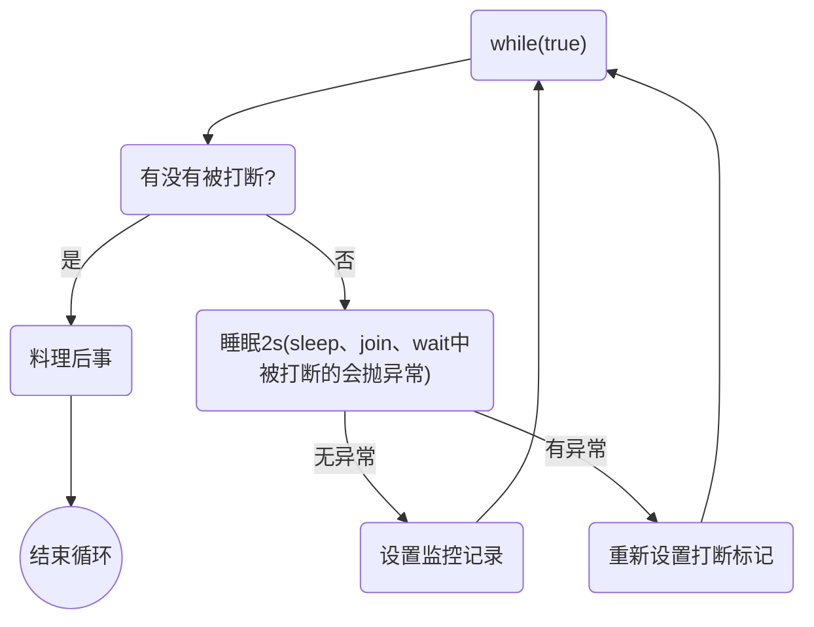
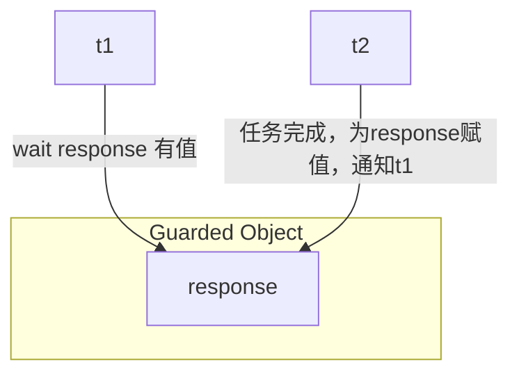
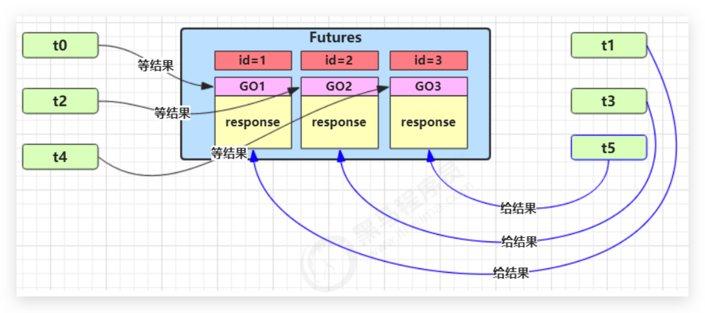
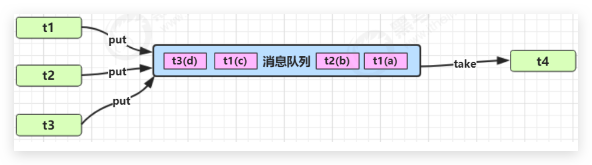

# 多线程—设计模式

## 两阶段终止—Two Phase Termination

### 用处

在一个线程 T1 中如何“优雅”终止线程 T2？这里的【优雅】指的是给 T2 一个料理后事的机会。


### 错误思路

*   使用线程对象的 stop() 方法停止线程

    stop 方法会真正杀死线程，如果这时线程**锁**住了共享资源，那么当它被杀死后就再也没有机会释放锁，其它线程将永远无法获取锁

*   使用 System.exit(int) 方法停止线程

    目的仅是停止一个线程，但这种做法会让整个程序都停止


### 两阶段终止模式




### interrupt 实现 🔥

```java
@Slf4j(topic = "TwoPhaseTermination")
public class TwoPhaseTermination {


    /* 监控线程 */
    private Thread monitor;

    /**
     * 启动监控线程
     */
    public void start(){
        monitor = new Thread(()->{
            Thread currentThread = Thread.currentThread();
            while (true){
                boolean flag = currentThread.isInterrupted();
                if (flag){
                    log.debug("料理后事，优雅停机");
                    break;
                }

                try {
                    // 1 正常情况，被打断无需额外处理
                    log.debug("执行监控记录");
                    // 2 非正常情况，在 sleep、join、wait 中被中断
                    // 每1秒执行一次，释放CPU，所以sleep
                    TimeUnit.SECONDS.sleep(1);
                } catch (InterruptedException e) {
                    e.printStackTrace();
                    // 由于 catch InterruptedException 后会清除中断标志，所以需要重设中断标志
                    currentThread.interrupt();
                }

            }
        });

        monitor.start();
    }

    /**
     * 优雅停止监控线程
     */
    public void stop(){
        monitor.interrupt();
    }


    public static void main(String[] args) throws InterruptedException {
        TwoPhaseTermination tpt = new TwoPhaseTermination();
        tpt.start();
        TimeUnit.SECONDS.sleep(3);
        tpt.stop();
    }
}
```


### volitile 实现 🔥

```java

```


## 同步模式—保护（监控）性暂停—Guarded Suspension

### 定义

即 Guarded（监控） Suspension（暂停），用在一个线程等待另一个线程的执行结果

要点：

*   有一个**结果需要从一个线程传递到另一个线程**，让他们关联同一个 **Guarded（监控）** Object
*   如果有结果**不断**从一个线程到另一个线程那么可以使用**消息队列（见生产者/消费者）**
*   JDK 中，**join 的实现、Future 的实现，采用的就是此模式**
*   因为要**等待**另一方的结果，因此归类到**同步模式**

**对比 join 实现好处**

*   **下载线程执行完毕后还可以做其他事，因为已经有notifyAll通知了**；而**join则必须等待线程执行完毕**！




### 实现—简单 🔥

```java
@Slf4j(topic = "GuardedObject")
public class GuardedObject {

    // 结果
    private Object response;

    /**
     * 获取结果
     *
     * @return response
     */
    public Object get() {
        synchronized (this) {
            while (response == null) {
                try {
                    this.wait();
                } catch (InterruptedException e) {
                    e.printStackTrace();
                }
            }
            return response;
        }
    }

    /**
     * 产生结果
     *
     * @param response response
     */
    public void complete(Object response) {
        synchronized (this) {
            // 给结果成员变量赋值，并唤醒等待线程
            this.response = response;
            this.notifyAll();
        }
    }


    public static void main(String[] args) {
        test1();
    }

    private static void test1(){
        // // 模拟线程1等待线程2下载结果
        GuardedObject guardedObject = new GuardedObject();

        new Thread(() -> {
            // 子线程下载
            try {
                List<String> download = Downloader.download();
                log.debug("download complete...");
                guardedObject.complete(download);
            } catch (IOException e) {
                e.printStackTrace();
            }
        }, "download-thread").start();

        log.debug("waiting...");
        // 主线程阻塞等待
        Object response = guardedObject.get();
        log.debug("get response: [{}] lines", ((List<String>) response).size());
    }
}
```

下载工具类：

```java
public class Downloader {

    public static List<String> download() throws IOException {
        URL url = new URL("https://www.qq.com/");
        URLConnection conn = url.openConnection();

        ArrayList<String> lines = new ArrayList<>();
        try (
                BufferedReader br = new BufferedReader(new InputStreamReader(conn.getInputStream(), StandardCharsets.UTF_8))
        ) {
            String line;
            while ((line = br.readLine()) != null) {
                lines.add(line);
            }
        }
        return lines;
    }
}
```

执行结果：

```
17:03:36.977 [main] DEBUG GuardedObject - waiting...
17:03:37.473 [download-thread] DEBUG GuardedObject - download complete...
17:03:37.473 [main] DEBUG GuardedObject - get response: [1805] lines
```


### 实现—超时 🔥

```java
@Slf4j(topic = "GuardedObject")
public class GuardedObject {

    // 结果
    private Object response;

    /**
     * 获取结果
     *
     * @param timeout 等待毫秒
     * @return response
     */
    public Object get(long timeout) {
        synchronized (this) {
            // 开始时间
            long beginTime = System.currentTimeMillis();
            // 经历时间
            long passTime = 0;
            while (response == null) {
                // 这一轮循环实际还需要等待的时间
                long waitTime = timeout - passTime;
                // 经历时间超过了设置的等待最大时间，则退出循环。优化为还需等待的时间是否小于等于0
                if (waitTime <= 0) {
                    break;
                }
                try {
                    // 这里只是等待timeout时间，等待完后又执行循环，需处理
                    // 并且若是虚假提前唤醒，则此时应该再等的时长应该少于timeout！！！用timeout减去已经cost的时长
                    this.wait(waitTime);
                } catch (InterruptedException e) {
                    e.printStackTrace();
                }
                passTime = System.currentTimeMillis() - beginTime;// 计算经历时间
            }
            return response;
        }
    }

    /**
     * 产生结果
     *
     * @param response response
     */
    public void complete(Object response) {
        synchronized (this) {
            // 给结果成员变量赋值，并唤醒等待线程
            this.response = response;
            this.notifyAll();
        }
    }


    public static void main(String[] args) {
        test2();
    }

    private static void test2(){
        // // 模拟线程1等待线程2下载结果
        GuardedObject guardedObject = new GuardedObject();

        new Thread(() -> {
            // 子线程下载
            try {
                TimeUnit.SECONDS.sleep(5);// 模拟下载时间过长，超时了
                List<String> download = Downloader.download();
                log.debug("download complete...");
                guardedObject.complete(download);// 这里如果传值为null，且不处理waitTime，则会多等一会
            } catch (IOException | InterruptedException e) {
                e.printStackTrace();
            }
        }, "download-thread").start();

        log.debug("waiting...");
        // 主线程阻塞等待
        Object response = guardedObject.get(2000);
        log.debug("get response: {}", response);
    }
}
```

执行结果：

```
17:46:32.233 [main] DEBUG GuardedObject - waiting...
17:46:34.237 [main] DEBUG GuardedObject - get response: null
17:46:37.608 [download-thread] DEBUG GuardedObject - download complete...
```


### 实现—多任务版（实例不太恰当） 🔥

还是一对一关系，不是生产者消费者的多对多

图中 Futures 就好比居民楼一层的信箱（每个信箱有房间编号），左侧的 t0，t2，t4 就好比等待邮件的居民，右侧的 t1，t3，t5 就好比邮递员。

如果需要在多个类之间使用 GuardedObject 对象，作为参数传递不是很方便，因此设计一个用来解耦的中间类，这样不仅能够解耦【结果等待者】和【结果生产者】，还能够同时支持多个任务的管理。



如下用邮箱的例子不是特别恰当，**因为实际中不是一对一**，应该邮递员少，并且用户实际是在不断等待信件的

```java
@Slf4j(topic = "GuardedObject")
public class GuardedObject {

    // 标识 guarded object
    private int id;

    // 结果
    private Object response;

    public GuardedObject() { }

    public GuardedObject(int id) {
        this.id = id;
    }

    public int getId() {
        return id;
    }

    /**
     * 获取结果
     *
     * @return response
     */
    public Object get() {
        synchronized (this) {
            while (response == null) {
                try {
                    this.wait();
                } catch (InterruptedException e) {
                    e.printStackTrace();
                }
            }
            return response;
        }
    }

    /**
     * 获取结果
     *
     * @param timeout 等待毫秒
     * @return response
     */
    public Object get(long timeout) {
        synchronized (this) {
            // 开始时间
            long beginTime = System.currentTimeMillis();
            // 经历时间
            long passTime = 0;
            while (response == null) {
                // 这一轮循环实际还需要等待的时间
                long waitTime = timeout - passTime;
                // 经历时间超过了设置的等待最大时间，则退出循环。优化为还需等待的时间是否小于等于0
                if (waitTime <= 0) {
                    break;
                }
                try {
                    // 这里只是等待timeout时间，等待完后又执行循环，需处理
                    // 并且若是虚假提前唤醒，则此时应该再等的时长应该少于timeout！！！用timeout减去已经cost的时长
                    this.wait(waitTime);
                } catch (InterruptedException e) {
                    e.printStackTrace();
                }
                passTime = System.currentTimeMillis() - beginTime;// 计算经历时间
            }
            return response;
        }
    }

    /**
     * 产生结果
     *
     * @param response response
     */
    public void complete(Object response) {
        synchronized (this) {
            // 给结果成员变量赋值，并唤醒等待线程
            this.response = response;
            this.notifyAll();
        }
    }

}
```

```java
public class Mailboxes {

    // 初始化邮箱（多少户订阅，第一个订阅的id为1，类推）
    public Mailboxes(int capacity) {
        this.createGuardedObjects(capacity);
    }

    // 产生唯一id（在这里防止Person、Postman创建重复）
    private static int i = 1;
    private static synchronized int generateId(){
        return i++;
    }


    // 对 GuardedObject 的创建、删除
    private static Map<Integer, GuardedObject> boxes = new Hashtable<>();


    /**
     * 初始化总订阅
     */
    private void createGuardedObjects(int capacity){
        for (int i1 = 0; i1 < capacity; i1++) {
            GuardedObject guardedObject = new GuardedObject(generateId());
            boxes.put(guardedObject.getId(), guardedObject);
        }
    }

    public static GuardedObject getGuardedObject(int id){
        // 递送完就销毁，但是不能调用 remove，会有 ConcurrentModificationException
        return boxes.get(id);
    }
}
```

```java
@Slf4j(topic = "TestMailboxes")
public class TestMailboxes {

    public static void main(String[] args) throws InterruptedException {

        // 邮局

        // 5户人家需要订阅邮箱
        final int CAPACITY = 5;
        new Mailboxes(CAPACITY);

        // 5户人家需要收信
        for (int i = 1; i <= CAPACITY; i++) {
            // 给用户分配id，并让他们等着收信就完事了
            new Person(i).start();
        }

        TimeUnit.SECONDS.sleep(1);

        // 生产信，派送（目前是邮递员和用户一一对应）
        for (int i = 1; i <= CAPACITY; i++) {
            new Postman(i, "内容" + i).start();
        }
    }
}

@Slf4j(topic = "Person")
class Person extends Thread {

    // 分配的 guardedObject id
    private final int guardedObjectId;

    public Person(int guardedObjectId) {
        this.guardedObjectId = guardedObjectId;
    }

    @Override
    public void run() {
        // 收信。收信人有门口邮箱号
        log.debug("等待信件 id:{}", guardedObjectId);
        GuardedObject guardedObject = Mailboxes.getGuardedObject(guardedObjectId);

        // 不断等着收信就完事了
        Object mail = guardedObject.get(5000);
        log.debug("收到信 id:{}, 内容:{}", guardedObjectId, mail);
    }
}


/**
 * 邮局调用邮递员来派送邮件
 */
@Slf4j(topic = "Postman")
class Postman extends Thread {

    // 信件上面都有目的地（这里用 guardedObject 的 id 表示）、信件内容
    private int id;
    private String mail;

    public Postman(int id, String mail) {
        this.id = id;
        this.mail = mail;
    }

    @Override
    public void run() {
        GuardedObject guardedObject = Mailboxes.getGuardedObject(id);
        log.debug("送信 id:{}, 内容:{}", id, mail);
        guardedObject.complete(mail);
    }
}
```

结果如下：

```
23:14:37.927 [Thread-3] DEBUG Person - 等待信件 id:4
23:14:37.927 [Thread-0] DEBUG Person - 等待信件 id:1
23:14:37.927 [Thread-1] DEBUG Person - 等待信件 id:2
23:14:37.927 [Thread-4] DEBUG Person - 等待信件 id:5
23:14:37.927 [Thread-2] DEBUG Person - 等待信件 id:3
23:14:38.929 [Thread-6] DEBUG Postman - 送信 id:2, 内容:内容2
23:14:38.929 [Thread-5] DEBUG Postman - 送信 id:1, 内容:内容1
23:14:38.929 [Thread-7] DEBUG Postman - 送信 id:3, 内容:内容3
23:14:38.929 [Thread-0] DEBUG Person - 收到信 id:1, 内容:内容1
23:14:38.929 [Thread-1] DEBUG Person - 收到信 id:2, 内容:内容2
23:14:38.929 [Thread-2] DEBUG Person - 收到信 id:3, 内容:内容3
23:14:38.929 [Thread-8] DEBUG Postman - 送信 id:4, 内容:内容4
23:14:38.929 [Thread-9] DEBUG Postman - 送信 id:5, 内容:内容5
23:14:38.929 [Thread-3] DEBUG Person - 收到信 id:4, 内容:内容4
23:14:38.930 [Thread-4] DEBUG Person - 收到信 id:5, 内容:内容5
```


## 异步模式—生产者消费者 🔥

### 定义

*   与前面的保护性暂停中的 GuardObject 不同，**不需要产生结果和消费结果的线程一一对应**

*   消费队列可以用来**平衡生产和消费的线程资源**

*   生产者仅负责产生结果数据，不关心数据该如何处理，而消费者专心处理结果数据

*   消息队列是**有容量限制**的，**满时不会再加入数据，空时不会再消耗数据**

*   JDK 中各种**阻塞队列**，采用的就是这种模式




### 实现—消息队列—sync版 🔥

```java
/**
 * 消息队列，不同于MQ。本类是线程间的，MQ是进程间的
 */
@Slf4j(topic = "MessageQueue")
public class MessageQueue {

    // 消息队列容器
    private final LinkedList<Message> messages = new LinkedList<>();

    // 消息队列容量
    private int capacity;

    public MessageQueue(int capacity) {
        this.capacity = capacity;
    }

    /**
     * 生产存入消息
     */
    public void put(Message message){
        // 不断生产消息
        while (true) {
            synchronized (messages) {
                // 检查队列是否满了
                while (messages.size() == capacity) {
                    try {
                        log.debug("队列已满，生产者线程等待");
                        messages.wait();
                    } catch (InterruptedException e) {
                        e.printStackTrace();
                    }
                }
                messages.addLast(message);
                log.debug("已生产消息, {},", message);
                messages.notifyAll();// 有消息了，唤醒等待的消费线程
            }

            try {
                // 生产完一个休息一下
                TimeUnit.SECONDS.sleep(1);
            } catch (InterruptedException e) {
                e.printStackTrace();
            }
        }
    }


    /**
     * 消费消息
     *
     * @return
     */
    public Message take() {

        synchronized (messages) {
            // 检查队列是否为空
            while (messages.isEmpty()) {
                try {
                    log.debug("队列为空，消费者线程等待");
                    messages.wait();
                } catch (InterruptedException e) {
                    e.printStackTrace();
                }
            }
            Message message = messages.removeFirst();
            log.debug("已消费消息, {},", message);
            messages.notifyAll();// 已经被消费了，唤醒等待的生产者线程
            return message;
        }
    }

}


class Message {
    // 目前id没啥意义
    private int id;

    private Object value;

    public Message(int id, Object value) {
        this.id = id;
        this.value = value;
    }

    public int getId() {
        return id;
    }

    public Object getValue() {
        return value;
    }

    @Override
    public String toString() {
        return "Message{" +
                "id=" + id +
                ", value=" + value +
                '}';
    }
}


class TestMessageQueue {
    public static void main(String[] args) {


        MessageQueue messageQueue = new MessageQueue(5);

        for (int i = 0; i < 2; i++) {
            int finalI = i;
            new Thread(() -> {
                messageQueue.put(new Message(finalI, "值" + finalI));
            }, "生产者" + i).start();
        }

        // 一天就5个人来消费
        for (int i = 0; i < 5; i++) {
            new Thread(() -> {
                try {
                    TimeUnit.SECONDS.sleep(1);
                    Message message = messageQueue.take();

                } catch (InterruptedException e) {
                    e.printStackTrace();
                }

            }, "消费者" + i).start();
        }
    }
}
```

结果如下：

```
00:09:17.234 [生产者0] DEBUG MessageQueue - 已生产消息, Message{id=0, value=值0},
00:09:17.238 [生产者1] DEBUG MessageQueue - 已生产消息, Message{id=1, value=值1},
00:09:18.236 [消费者4] DEBUG MessageQueue - 已消费消息, Message{id=0, value=值0},
00:09:18.237 [消费者1] DEBUG MessageQueue - 已消费消息, Message{id=1, value=值1},
00:09:18.237 [消费者2] DEBUG MessageQueue - 队列为空，消费者线程等待
00:09:18.237 [消费者0] DEBUG MessageQueue - 队列为空，消费者线程等待
00:09:18.237 [消费者3] DEBUG MessageQueue - 队列为空，消费者线程等待
00:09:18.240 [生产者0] DEBUG MessageQueue - 已生产消息, Message{id=0, value=值0},
00:09:18.240 [消费者3] DEBUG MessageQueue - 已消费消息, Message{id=0, value=值0},
00:09:18.240 [消费者0] DEBUG MessageQueue - 队列为空，消费者线程等待
00:09:18.240 [消费者2] DEBUG MessageQueue - 队列为空，消费者线程等待
00:09:18.241 [生产者1] DEBUG MessageQueue - 已生产消息, Message{id=1, value=值1},
00:09:18.241 [消费者2] DEBUG MessageQueue - 已消费消息, Message{id=1, value=值1},
00:09:18.241 [消费者0] DEBUG MessageQueue - 队列为空，消费者线程等待
00:09:19.245 [生产者0] DEBUG MessageQueue - 已生产消息, Message{id=0, value=值0},
00:09:19.245 [消费者0] DEBUG MessageQueue - 已消费消息, Message{id=0, value=值0},
00:09:19.245 [生产者1] DEBUG MessageQueue - 已生产消息, Message{id=1, value=值1},
00:09:20.246 [生产者1] DEBUG MessageQueue - 已生产消息, Message{id=1, value=值1},
00:09:20.247 [生产者0] DEBUG MessageQueue - 已生产消息, Message{id=0, value=值0},
00:09:21.247 [生产者1] DEBUG MessageQueue - 已生产消息, Message{id=1, value=值1},
00:09:21.247 [生产者0] DEBUG MessageQueue - 已生产消息, Message{id=0, value=值0},
00:09:22.247 [生产者1] DEBUG MessageQueue - 队列已满，生产者线程等待
00:09:22.247 [生产者0] DEBUG MessageQueue - 队列已满，生产者线程等待
```


### 实现—生产消费 🔥

生产者（Productor）将产品交给店员（Clerk），而消费者（Consumer）从店员处取走产品，店员一次只能持有固定数量的产品（比如20），如果生产者试图生产更多的产品，店员会叫生产者停一下，如果店中有空位放产品了再通知生产者继续生产；如果店中没有产品了，店员会告诉消费者等一下，如果店中有产品了再通知消费者来取走产品。

分析：

1.  是否是多线程问题？是，生产者线程，消费者线程

2.  是否有共享数据？是，店员（或产品）

3.  是否涉及线程的通信？是


#### sync 版

```java
class Productor implements Runnable {

    private final Product product;

    public Productor(Product product) {
        this.product = product;
    }

    @Override
    public void run() {
        while (true) {
            synchronized (product) {
                // while 和 wait 一起使用；不能单独使用 if，可能会缺少一次判断
                // 不能使用 if...else，会导致 wait 唤醒后即使满足条件也不能生产或消费，浪费了 OS 资源
                while (product.productNum >= 20) {
                    try {
                        product.wait();
                    } catch (InterruptedException e) {
                        e.printStackTrace();
                    }
                }

                product.productNum++;
                System.out.println(Thread.currentThread().getName() + "：生产第" + product.productNum + "个产品");

                product.notifyAll();
            }
            try {
                // 放在同步外更合理，其他线程可以此时抢占资源
                Thread.sleep(100);
            } catch (InterruptedException e) {
                e.printStackTrace();
            }
        }
    }
}


class Consumer implements Runnable {

    private final Product product;

    public Consumer(Product product) {
        this.product = product;
    }

    @Override
    public void run() {
        while (true) {
            synchronized (product) {
                // while 和 wait 一起使用；不能单独使用 if，可能会缺少一次判断
                // 不能使用 if...else，会导致 wait 唤醒后即使满足条件也不能生产或消费，浪费了 OS 资源
                while (product.productNum <= 0) {
                    try {
                        product.wait();
                    } catch (InterruptedException e) {
                        e.printStackTrace();
                    }
                }

                System.out.println(Thread.currentThread().getName() + "：消费第" + product.productNum + "个产品");
                product.productNum--;

                product.notifyAll();
            }
            // 放在同步外更合理，其他线程可以此时抢占资源
            try {
                Thread.sleep(200);
            } catch (InterruptedException e) {
                e.printStackTrace();
            }
        }
    }
}

class Product {
    // 产品数量
    int productNum = 0;
}


public class PCTest {
    public static void main(String[] args) {
        Product product = new Product();
        new Thread(new Productor(product), "生产者1").start();
        new Thread(new Productor(product), "生产者2").start();
        new Thread(new Consumer(product), "消费者1").start();
        new Thread(new Consumer(product), "消费者2").start();
        new Thread(new Consumer(product), "消费者3").start();
        new Thread(new Consumer(product), "消费者4").start();
        new Thread(new Consumer(product), "消费者5").start();
    }
}
```


#### Lock 版本

```java
class Productor implements Runnable {

    private final Product product;

    public Productor(Product product) {
        this.product = product;
    }

    @Override
    public void run() {
        while (true) {

            try {
                product.lock.lock();
                // while 和 wait 一起使用；不能单独使用 if，可能会缺少一次判断
                // 不能使用 if...else，会导致 wait 唤醒后即使满足条件也不能生产或消费，浪费了 OS 资源
                while (product.productNum >= 20) {
                    try {
                        product.productor.await();
                    } catch (InterruptedException e) {
                        e.printStackTrace();
                    }
                }

                product.productNum++;
                System.out.println(Thread.currentThread().getName() + "：生产第" + product.productNum + "个产品");

                product.consumer.signalAll();
            } finally {
                product.lock.unlock();
            }


            try {
                // 放在同步外更合理，其他线程可以此时抢占资源
                Thread.sleep(100);
            } catch (InterruptedException e) {
                e.printStackTrace();
            }
        }
    }
}


class Consumer implements Runnable {

    private final Product product;

    public Consumer(Product product) {
        this.product = product;
    }

    @Override
    public void run() {
        while (true) {

            try {
                product.lock.lock();
                // while 和 wait 一起使用；不能单独使用 if，可能会缺少一次判断
                // 不能使用 if...else，会导致 wait 唤醒后即使满足条件也不能生产或消费，浪费了 OS 资源
                while (product.productNum <= 0) {
                    try {
                        product.consumer.await();
                    } catch (InterruptedException e) {
                        e.printStackTrace();
                    }
                }

                System.out.println(Thread.currentThread().getName() + "：消费第" + product.productNum + "个产品");
                product.productNum--;

                product.productor.signalAll();
            } finally {
                product.lock.unlock();
            }

            // 放在同步外更合理，其他线程可以此时抢占资源
            try {
                Thread.sleep(200);
            } catch (InterruptedException e) {
                e.printStackTrace();
            }
        }
    }
}

class Product {
    // 产品数量
    int productNum = 0;

    Lock lock = new ReentrantLock();
    Condition productor = lock.newCondition();
    Condition consumer = lock.newCondition();
}


public class PCTest {
    public static void main(String[] args) {
        Product product = new Product();
        new Thread(new Productor(product), "生产者1").start();
        new Thread(new Productor(product), "生产者2").start();
        new Thread(new Consumer(product), "消费者1").start();
        new Thread(new Consumer(product), "消费者2").start();
        new Thread(new Consumer(product), "消费者3").start();
        new Thread(new Consumer(product), "消费者4").start();
        new Thread(new Consumer(product), "消费者5").start();
    }
}
```

#### JUC 版本

