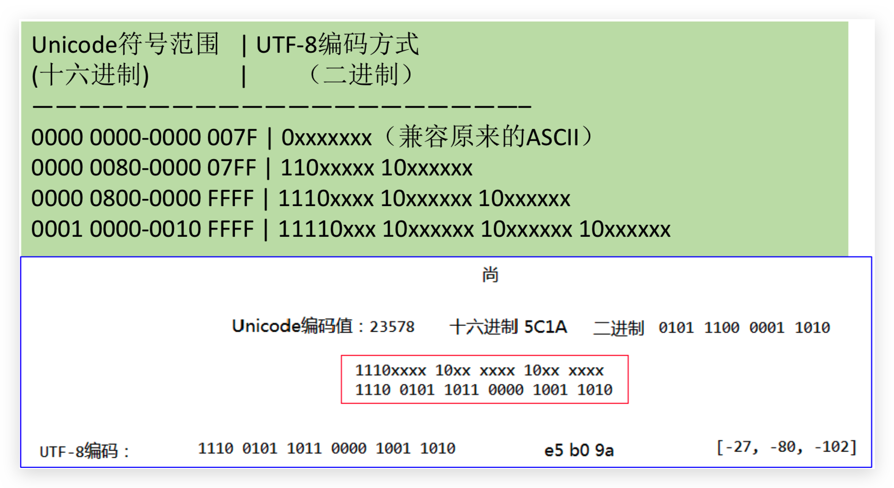

# 0 Basic

[[toc]]

::: tip
This is a tip
:::

::: warning
This is a warning
:::

::: danger STOP
This is a dangerous warning
:::

::: theorem 牛顿第一定律
假若施加于某物体的外力为零，则该物体的运动速度不变。

::: right
From [维基百科](https://zh.wikipedia.org/wiki/%E7%89%9B%E9%A1%BF%E8%BF%90%E5%8A%A8%E5%AE%9A%E5%BE%8B)
:::

::: tip
`@vuepress/theme-default` 的提示容器
:::

## 计算机字符编码

### 简介

字符：各种文字和符号的总称，包括各个国家的文字，标点符号，图形符号，数字等。

字符集：字符集是多个符号的集合，每个字符集包含的字符个数不同。

字符编码：字符集只是规定了有哪些字符，而最终决定采用哪些字符，每一个字符用多少字节表示等问题，则是由编码来决定的。计算机要准确的处理各种字符集文字，需要进行字符编码，以便计算机能够识别和存储各种文字。

### 常见字符编码及发展历史

Notepad++中查看，ANSI 在中国大陆即为 GBK（以前是 GB2312），最常用的是 GBK 和 UTF8 无 BOM 编码格式，UCS-2 即为人们常说的 Unicode 编码，又分为大端、小端。所谓 BOM 头(Byte Order Mark)就是文本文件中开始的几个并不表示任何字符的字节，用二
进制编辑器(如 bz.exe)就能看到了。UTF8 的 BOM 头为 0xEF 0xBB 0xBF、Unicode 大端模式为 0xFE 0xFF、Unicode 小端模式为 0xFF 0xFE。

#### ASCII 码

上个世纪 60 年代，美国制定了一套字符编码，对英语字符与二进制位之间的 关系，做了统一规定。这被称为 ASCII 码。ASCII 码一共规定了 128 个字符的编码，比如 空格“SPACE”是 32(二进制 00100000)，大写的字母 A 是 65(二进制 01000001)。这 128 个符号(包括 32 个不能打印出来的控制符号)，只占用了一个字节的后面 7 位，最前面的 1 位统一规定为 0。

- 0~31 及 127(共 33 个)是控制字符或通信专用字符(其余为可显示字符)，如控制符:LF(换行)、CR(回车)、FF(换页)、DEL(删除)、BS(退格)
- 32~126(共 95 个)是字符(32 是空格)，其中 48~57 为 0 到 9 十个阿拉伯数字。
- 65~90 为 26 个大写英文字母，97~122 号为 26 个小写英文字母，其余为一些标点符号、 运算符号等。
- 后 128 个称为扩展 ASCII 码。许多基于 x86 的系统都支持使用扩展(或“高”)ASCII。扩展 ASCII 码允许将每个字符的第 8 位用于确定附加的 128 个特殊符号字符、外来语字母和图形符号。

#### OEM 字符集的衍生

当计算机开始发展起来的时候，人们逐渐发现，ASCII 字符集里那可怜的 128 个字符已经不能再满足他们的需求了。人们就在想，一个字节能够表示的数字(编号)有 256 个，而 ASCII 字符只用到了 0x00~0x7F，也就是占用了前 128 个，后面 128 个数字不用白不用，因此很多人打起了后面这 128 个数字的主意。可是问题在于，很多人同时有这样的想法，但是大家对于 0x80-0xFF 这后面的 128 个数字分别对应什么样的字符，却有各自的想法。这就导致了当时销往世界各地的机器上出现了大量各式各样的 OEM 字符集。大家对于 0x00~0x7F 这个范围的解释基本是相同的，而对于后半部分 0x80~0xFF 的解释却不一定相同。甚至有时候同样的字符在不同 OEM 字符集中对应的字节也是不同的。不同的 OEM 字符集导致人们无法跨机器交流各种文档。

#### 多字节字符集(MBCS)和中文字符集

上面我们提到的字符集都是基于单字节编码，也就是说，一个字节翻译成一个字符。这对于拉 丁语系国家来说可能没有什么问题，因为他们通过扩展第 8 个比特，就可以得到 256 个字符了， 足够用了。但是对于亚洲国家来说，256 个字符是远远不够用的。因此这些国家的人为了用上电脑，又要保持和 ASCII 字符集的兼容，就发明了多字节编码方式，相应的字符集就称为多字节字符集(Muilti-Bytes Charecter Set)。例如中国使用的就是双字节字符集编码。

例如目前最常用的中文字符集 GB2312，涵盖了所有简体字符以及一部分其他字符;GBK(K 代表扩展的意思)则在 GB2312 的基础上加入了对繁体字符等其他非简体字符。这两个字符集的字符都是使用 1-2 个字节来表示。Windows 系统采用 936 代码页来实现对 GBK 字符集的编解码。在解析字节流的时候，如果遇到字节的最高位是 0 的话，那么就使用 936 代码页中的第 1 张码表进行解码，这就和单字节字符集的编解码方式一致了。如果遇到字节的最高位是 1 的话，那么就表示需要两个字节值才能对应一个字符。

假如你使用 GB2312 写了这么一句话：我叫 ABC。它的二进制编码是这样的：

```
11001110 11010010 10111101 11010000 01000001 01000002 01000003
```

全角是一种电脑字符，且每个全角字符占用两个标准字符(或半角字符)位置。通常的英文字母、数字键、符号键都是半角的，半角的显示内码都是一个字节。为了排列整齐，英文和其它拉丁文的字符和标点也提供了全角格式。在中文输入法中，切换全角和半角格式的快捷键为 SHIFT+空格。

#### ANSI 标准、国家标准、ISO 标准

不同 ASCII 衍生字符集的出现，让文档交流变得非常困难，因此各种组织都陆续进行了标准化流程。例如美国 ANSI 组织制定了 ANSI 标准字符编码(注意，我们现在通常说到 ANSI 编码，通常指的是平台的默认编码，例如英文操作系统中是 ISO-8859-1，中文系统是 GBK)，ISO 组织制定的各种 ISO 标准字符编码，还有各国也会制定一些国家标准字符集，例如中国的 GBK，GB2312 和 GB18030。操作系统在发布的时候，通常会往机器里预装这些标准的字符集还有平台专用的字符集，这样只要你的文档是使用标准字符集编写的，通用性就比较高了。

#### Unicode 的出现

虽然通过使用不同字符集，我们可以在一台机器上查阅不同语言的文档，但是我们仍然无法解决一个问题：如果一份文档中含有不同国家的不同语言的字符，那么无法在一份文档中显示所有字符。为了解决这个问题，我们需要一个全人类达成共识的巨大的字符集，这就是 Unicode 字符集。Unicode 字符集涵盖了目前人类使用的所有字符，并为每个字符进行统一编号，分配唯一的字符码(Code Point)。Unicode 字符集将所有字符按照使用上的频繁度划分为 17 个层面(Plane)，每个层面上有 216=65536 个字符码空间。其中第 0 个层面 BMP，基本涵盖了当今世界用到的所有字符。其他的层面要么是用来表示一些远古时期的文字，要么是留作扩展。我们平常用到的 Unicode 字符，一般都是位于 BMP 层面上的。目前 Unicode 字符集中尚有大量字符空间未使用。

#### 编码系统的变化

在 Unicode 出现之前，所有的字符集都是和具体编码方案绑定在一起的(即字符集 ≈ 编码方式)，都是直接将字符和最终字节流绑定死了，例如 ASCII 编码系统规定使用 7 比特来编码 ASCII 字符集;GB2312 以及 GBK 字符集，限定了使用最多 2 个字节来编码所有字符，并且规定了字节序。这样的编码系统通常用简单的查表，也就是通过代码页就可以直接将字符映射为存储设备上的字节流了。

Unicode 同样也不完美，这里就有三个问题，一个是，我们已经知道，英文字母只用一个字节表示就够了，第二个问题是如何才能区别 Unicode 和 ASCII?计算机怎么知道两个字节表示一个符号，而不是分别表示两个符号呢?第三个，如果和 GBK 等双字节编码方式一样，用最高位是 1 或 0 表示两个字节和一个字节，就少了很多值无法用于表示字符，不够表示所有字符。Unicode 在很长一段时间内无法推广，直到互联网的出现，为解决 Unicode 如何在网络上传输的问题，于是面向传输的众多 UTF(UCS Transfer Format)标准出现了，顾名思义，UTF-8 就是每次 8 个位传输数据，而 UTF-16 就是每次 16 个位。UTF-8 就是在互联网上使用最广的一种 Unicode 的实现方式，这是为传输而设计的编码，并使编码无国界，这样就可以显示全世界上所有文化的字符了。

UTF-8 最大的一个特点，就是它是一种变长的编码方式。它可以使用 1~4 个字节表示一个符号。从 unicode 到 uft-8 并不是直接的对应，而是要过一些算法和规则来转换(即 Uncidoe 字符集 ≠UTF-8 编码方式)。

早期字符编码、字符集和代码页等概念都是表达同一个意思。例如 GB2312 字符集、GB2312 编码，936 代码页，实际上说的是同个东西。但是对于 Unicode 则不同，Unicode 字符集只是定义了字符的集合和唯一编号，Unicode 编码，则是对 UTF-8、UCS-2/UTF-16 等具体编码方案的统称而已，并不是具体的编码方案。所以当需要用到字符编码的时候，你可以写 gb2312，codepage936，utf-8，utf-16，但请不要写 Unicode。造成乱码的原因就是因为使用了错误的字符编码去解码字节流，因此当我们在思考任何跟文本显示有关的问题时，请时刻保持清醒:当前使用的字符编码是什么。只有这样，我们才能正确分析和处理乱码问题。



## 进制

### 基础知识

- bit：位，最小的存储单元
- byte：字节，机器语言的单位

### 进制

- binary：二进制，以 0b 或 0B 开头
- octal：八进制，以数字 0 开头
- decimal：十进制
- hex：十六进制，以 0x 或 0X 开头

### 二进制

- Java 整数常量默认是 int 类型，当用二进制定义整数时，其第 32 位是符号位；当是 long 类型时，二进制默认占 64 位，第 64 位是符号位

- 二进制的整数有如下三种形式：

  - 原码：如果一个机器数字长是 n 位的话，约定最左边一位用作符号位，其余 n-1 位用于表示数值。
  - 反码：正数的反码等于其原码，而负数的反码则可以通过保留其符号位，将原码的数值位取反得到。
  - 补码：正数和 0 的补码就是该数字本身。负数的补码则是将其对应正数按位取反再加 1。

- **计算机以二进制补码的形式保存所有的整数（给一个二进制若不说明默认就是补码）**

  - 正数的原码、反码、补码都相同
  - **反码和补码的符号位可作为数值位的一部分看待，和数值位一起参与运算**
  - 补码系统的 0 就只有一个表示方式，在反码系统中，0 有二种表示方式，因此在判断数字是否为 0 时，只要比较一次即可。
  - 二进制数等于 0 时，符号位可以为 0 或 1(+0/-0)

- 为什么要使用原码、反码、补码表示形式呢？

  计算机辨别“符号位”显然会让计算机的基础电路设计变得十分复杂! 于是人们想出了将符号位也参与运算的方法. 我们知道, 根据运算法则减去一个正数等于加上一个负数, 即: 1-1 = 1 + (-1) = 0 , 所以机器可以只有加法而没有减法, 这样计算机运算的设计就更简单了。

- 8-bit 补码系统的整数（Java 中整数默认为 int，占 32 位，此处演示时采用 byte8 位）

  ```matlab
  00000000				0的原码、反码、补码
  01111111				+127的原码、反码、补码
  10000001				-127的补码
  10000000				-128的补码（最小值需根据-127的补码来运算）
  ```

- 以下用 4 位的补码数字来说明补码系统的数字表示方式

  在表示正数和零时，补码数字和一般二进制一样，唯一的不同是在补码系统中，正数的最高比特恒为 0，因此 4 位的补码正数，最大数字为 0111 (7)。

  补码数字的负数，最高比特恒为 1，4 位补码的数字中，最接近 0 的负数为 1111 (-1)，以此类推，因此绝对值最大的负数是 1000(-8)。

  由上可得，4 位数的补码取值范围为-8 ～ 7

### 进制补充（待完成）
