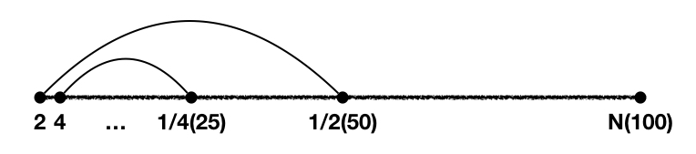

# 数组

## 数组

- **容器**：将多个数据存储到一起，每个数据称为该容器的元素

- **数组（Array）**： 存储数据**长度固定**的容器，多个数据的**数据类型要一致（存在自动类型转换）**。是**引用数据类型**， 创建数组对象会在内存中开辟**一整块连续的空间**，而数组名中引用的是这块连续空间的**首地址**。

  **它的元素相当于类的成员变量**，因此数组一经分配空间，其中的每个元素也被按照成员变量同样的方式被隐式初始化。所以若存放引用类型且未初始化则可能报 NPE。

- 注意：数组**对象**有**定长**特性，**长度一旦指定，不可更改（因为内存连续）**。**不要把变量名看成数组，它只是引用**

  ```java
  int[] arr1 = new int[3];
  System.out.println(arr1.length);//3
  arr1 = new int[5];
  System.out.println(arr1.length);//5
  ```

- 动态初始化：数组声明且为数组元素分配空间与赋值的操作分开进行（**必须指定长度，二维数组可以只指定第一个**）

  元素**默认值**：

  - 整型—`0`或`0L`
  - 浮点—`0.0f`或`0.0d`，`d`可省略
  - 布尔—`false`
  - char—Unicode 码`'\u0000'`（或 ASCII 码`0`，非`'0'`），是**空字符**，一个不可打印字符，不会看到任何输出
  - 引用类型（**包括包装类型**）—`null`

  ```java
  // 先分配空间
  int[] arr = new int[3];

  int[][] arr = new int[m][];// 每个一维数组都是默认初始化值null
  int[][] arr = new int[m][n];// 一维数组的名称分别为arr[0], arr[1], arr[2]...

  // 后续赋值
  ```

- 静态初始化：在定义数组的同时就为数组元素分配空间并赋值。有元素默认值，但是之后又把大括号内容赋值给数组了

  第二种可以用在任何地方，甚至用在方法的内部，可以传递。

  ```java
  // 分配空间并赋值
  int[] arr = new int[]{1,2,3};
  int[] arr = {1,2,3};//上述的简化版

  int[][] arr = new int[][]{{...},{...}};
  int[][] arr = {{...},{...}};
  ```

- **【注意】字符串有 length()方法，数组有 length 属性**；Java 中多维数组不必都是规则矩阵形式

- 数组内存图

  

- 数组中涉及的常见算法

  - 数组元素的赋值(杨辉三角、回形数等)
  - 求数值型数组中元素的最大值、最小值、平均数、总和等
  - 数组的复制、反转、查找(线性查找、二分法查找)
  - 数组元素的排序算法
  - 详见 doc

- 数组中常见异常：

  - ArrayIndexOutOfBoundsException：索引范围从 0 ～ length-1，小或大都不行。（Python 中可以，C 和 C++可以）
  - NullPointerExcption

## java.util.Arrays 🔥

Arrays 工具类是针对**数组进行操作**的工具类，包括排序和查找等大量**静态方法**，常用方法如下：

- `boolean equals(int[] a,int[] b)`**判断两个数组是否相等**，比较的是内容，顺序也得一致

- `toString(int[] arr)`将**数组转为字符串**，如[1, 2, 3]

- `void fill(int[] a,int val)`将指定值填充到数组之中，全部替换为 val！

- `sort(int[] arr,[ T[] a, Comparator<? super T> c ])` 给数组**排序**，无返回值

  - 若是数值，默认按升序
  - 若是字符串，默认按字母升序，先大写后小写，和 ASCII 表一致
  - 若是**自定义类型**，这个自定义类型需要**`Comparable`或`Comparator`接口的支持**

- `binarySearch(int[] arr,int key)`**二分查找**，需先排序

- `asList(int/String等[] arr)`**数组转集合**，**长度不能变！！！**转换的为 Arrays 中内部类 ArrayList！

  需要使用`List<Object> objectList = ArrayList<Object>(Arrays.asList(数组))；`注意：

  ```java
  List arr1 = Arrays.asList(123, 456);
  System.out.println(arr1.size());//2

  List arr1 = Arrays.asList(new int[]{123, 456});
  System.out.println(arr1.size());//1

  List arr2 = Arrays.asList(new Integer[]{123, 456});
  System.out.println(arr2.size());//2
  ```

- `copyOf(int/String等[] original, int from, int to)` **数组拷贝**，底层调用`System.arraycopy()`

## 习题

### 画图

```java
//*
//**
//***
//****
//*****

for (int i = 0; i < 5; i++) {
  for (int j = 0; j <= i; j++) {
    System.out.print("*");
  }
  System.out.println();
}
```

```java
//*****
//****
//***
//**
//*

for (int i = 0; i < 4; i++) {
  for (int j = 0; j < 4-i; j++) {
    System.out.print("*");
  }
  System.out.println();
}
```

```java
//*
//**
//***
//****
//*****
//****
//***
//**
//*

for (int i = 0; i < 5; i++) {
  for (int j = 0; j <=i ; j++) {
    System.out.print("*");
  }
  System.out.println();
}
for (int i = 0; i < 4; i++) {

  for (int k = 0; k < 4-i; k++) {
    System.out.print("*");
  }
  System.out.println();
}
```

### 对角线画圈

```java
//O***O
//*O*O*
//**O**
//*O*O*
//O***O

public static void printPic(int num){
    for (int i = 0; i < num; i++) {
        for (int j = 0; j < num; j++) {
            if(j==i||j==num-1-i){
                System.out.print("O");
            } else {
                System.out.print("*");
            }
        }
        System.out.println();
    }
}
```

### 九九乘法表

```java
public static void multiplicationTable(int num) {
  for (int i = 1; i <= num; i++) {
    for (int j = 1; j <= i; j++) {
      System.out.print(j+"*"+i+"="+j*i+"\t");
    }
    System.out.println();
  }
}
```

### 100 以内的所有质数

从 2 开始，到这个数减 1（优化为到`Math.sqrt()`），**都**不能被这个数整除。当有一个能被整除，跳出！



```java
public static void primeNumber(int num) {
  long startTime = System.currentTimeMillis();

  // 穷举num以内的质数（包括num）
  for (int i = 2; i <= num; i++) {
    boolean flag = true;
    // 从2到这个数减1
    // for (int j = 2; j < i; j++) {
    // 优化：对本身是质数的优化效果提升特别大
    for (int j = 2; j <= Math.sqrt(i); j++) {
      if (i % j == 0) {
        flag = false;
        break;// 优化：一旦被除尽，则跳出。对非质数有优化效果。
      }
    }
    if (flag) {
      System.out.println(i);
    }
  }

  long endTime = System.currentTimeMillis();
  System.out.println(endTime - startTime);
}
```

```java
public static void primeNumber(int num) {
  long startTime = System.currentTimeMillis();

  // 穷举num以内的质数（包括num）
  lable:for (int i = 2; i <= num; i++) {
    // 优化：对本身是质数的优化效果提升特别大
    for (int j = 2; j <= Math.sqrt(i); j++) {
      if (i % j == 0) {
        continue lable;// 优化：一旦被除尽，则继续下一个。对非质数有优化效果。
      }
    }
    System.out.println(i);
  }

  long endTime = System.currentTimeMillis();
  System.out.println(endTime - startTime);
}
```

### 最小公倍数和最大公约数

```java
//获取最大公约数
//1.获取两个数中的较小值
int min = (m <= n)? m : n;
//2.遍历
for(int i = min;i >= 1 ;i--){
  if(m % i == 0 && n % i == 0){
    System.out.println("最大公约数为：" + i);
    break;
  }
}

//获取最小公倍数
//1.获取两个数中的较大值
int max = (m >= n)? m : n;
//2.遍历
for(int i = max;i <= m * n;i++){
  if(i % m == 0 && i % n == 0){
    System.out.println("最小公倍数：" + i);
    break;
  }
}
```

### 水仙花数

输出所有的水仙花数，所谓水仙花数是指一个 3 位数，其各个位上数 字立方和等于其本身。`153 = 1*1*1 + 3*3*3 + 5*5*5`

```java
for (int i = 100; i < 1000; i++) {
  int bai = i/100%10; //%10可省略
  int shi = i/10%10;
  int ge = i/1%10;
  if(i==bai*bai*bai+shi*shi*shi+ge*ge*ge){
    System.out.println(i);
  }
}
```

### 完数

一个数恰好等于他的因子（除去这个数本身的其他约数）之和，这个数为完数，如：6=1+2+3。找出 1000 以内所有完数！

```java
public static void wanshu(int num){
  //int factor = 0;
  for(int i = 1;i <= num;i++){
    int factor = 0;
    for(int j = 1;j <= i/2;j++){
      if(i % j == 0){
        factor += j;
      }
    }

    if(i == factor){
      System.out.println(i);
    }
    //重置factor
    //factor = 0;
  }
}
```

### 实现四舍五入

定义 round 方法，接收一位小数，实现四舍五入运算，并返回结果（+0.5，强转 int）

```java
public static int round(double d){
    return (int) (d+0.5);
}
```

### 统计字符次数

统计字符出现次数。利用容量为 26 的数组保存字符出现次数

```java
public static void showTimes(char[] chs){
    int[] count = new int[26];
    for (int i = 0; i < chs.length; i++) {
        count[chs[i] - 97]++;
    }
    for (int i=0,ch=97 ;i<count.length;i++,ch++){
        if(count[i]!=0){
            System.out.println("符号"+(char)ch+"出现的次数:"+count[i]);
        }
    }
}
```

### int[] x,y[]

以下选项允许通过编译的是：

- `x[0]=y;` no
- `y[0] = x;` yes
- `y[0][0] = x;` no
- `x[0][0] = y;` no
- `y[0][0] = x[0];` yes
- `x = y;` no，类型需匹配！

### \*随机不重复数组

创建一个长度为 6 的 int 型数组，要求数组元素的值都在 1-30 之间，且是随机赋值。同时，要求 元素的值各不相同。

doc

### \*打印 char 数组的题

```java
int[] arr1 = {1,2,3};
System.out.println(arr1);// [I@2f7c7260

char[] arr2 = {'a','b','c'};
System.out.println(arr2);// abc
```

### \*数组除首位

定义一个 int 型的数组:int[] arr = new int[]{12,3,3,34,56,77,432};让数组的每个位置上的值去除以首位置的元素，得到的结果，作为该位置上的 新值。遍历新的数组。

```java
// 错误写法
for(int i= 0;i < arr.length;i++){
  arr[i] = arr[i] / arr[0];
}

// 正确写法1，从后到前
for(int i = arr.length – 1;i >= 0;i--){
  arr[i] = arr[i] / arr[0];
}

//正确写法2，不如写法1
int temp = arr[0];
for(int i= 0;i < arr.length;i++){
  arr[i] = arr[i] / temp;
}
```

### \*数组元素的赋值

#### \*杨辉三角

- 第一行有 1 个元素, 第 n 行有 n 个元素

- 每一行的第一个元素和最后一个元素都是 1

- 从第三行开始, 对于非第一个元素和最后一个元素的元素。

  `yanghui[i][j] = yanghui[i-1][j-1] + yanghui[i-1][j];`

  ```java
  //1.声明并初始化二维数组
  int[][] yangHui = new int[10][];

  //2.给数组的元素赋值
  for(int i = 0;i < yangHui.length;i++){
    yangHui[i] = new int[i + 1];

    //2.1 给首末元素赋值
    yangHui[i][0] = yangHui[i][i] = 1;
    //2.2 给每行的非首末元素赋值
    //if(i > 1){
    for(int j = 1;j < yangHui[i].length - 1;j++){
      yangHui[i][j] = yangHui[i-1][j-1] + yangHui[i-1][j];
    }
    //}
  }
  ```

#### \*回形数

doc

### \*数组的复制、反转、查找

#### 数组复制

需 new 新的

#### 数组反转

```java
public static void reverseArray(int[] arr){
    for (int i = 0; i < arr.length/2; i++) {
        int temp = arr[i];
        arr[i] = arr[arr.length-1-i];
        arr[arr.length-1-i]= temp;
    }
}
//或
public static void reverseArray(int[] arr){
    for (int min=0,max=arr.length-1;min<max;min++,max--) {
        int temp = arr[min];
        arr[min] = arr[max];
        arr[max]= temp;
    }
}
```

#### 二分查找

```java
//前提：所要查找的数组必须有序。
int[] arr = new int[]{-98,-34,2,34,54,66,79,105,210,333};

int dest = -34;
int head = 0;//初始的首索引
int end = arr.length - 1;//初始的末索引
boolean find = false;
while(head <= end){

  int middle = (head + end)/2;

  if(dest == arr[middle]){
    System.out.println("找到了指定的元素，位置为：" + middle);
    find = true;
    break;
  }else if(arr[middle] > dest){
    end = middle - 1;
  }else{//arr2[middle] < dest1
    head = middle + 1;
  }
}

if(find){
  System.out.println("很遗憾，没有找到的啦！");
}
```

### \*数组的排序

ppt 总结常考的

#### 选择排序

找剩余数组元素中最小的，放在首位

```java
public static void selectSort(int[] arr) {
    for (int i = 0; i < arr.length - 1; i++) {
        for (int j = i + 1; j < arr.length; j++) {
            if (arr[i] > arr[j]) {
                int temp = arr[i];
                arr[i] = arr[j];
                arr[j] = temp;
...
```

#### \*冒泡排序

相邻中最大的。。。

```java
public static void bubbleSort(int[] arr){
    for (int i = 0; i < arr.length-1; i++) {
        for(int j=0;j<arr.length-1-i;j++){
            if (arr[j]>arr[j+1]){
                int temp = arr[j];
                arr[j] = arr[j+1];
                arr[j+1] = temp;
...
```

#### \*快速排序
