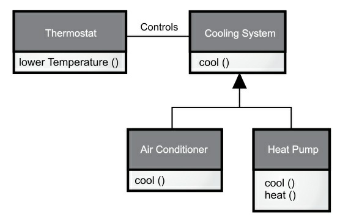
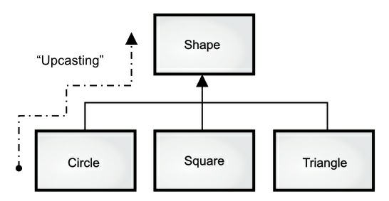
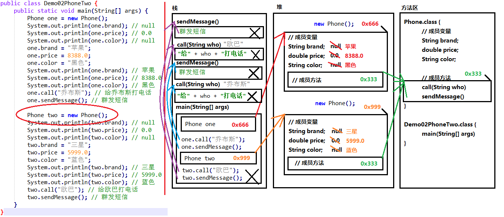
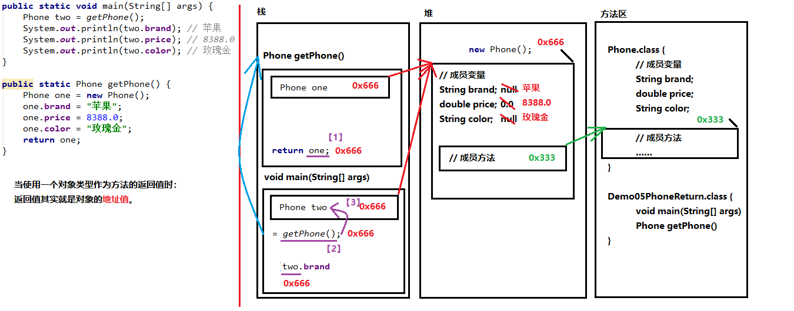
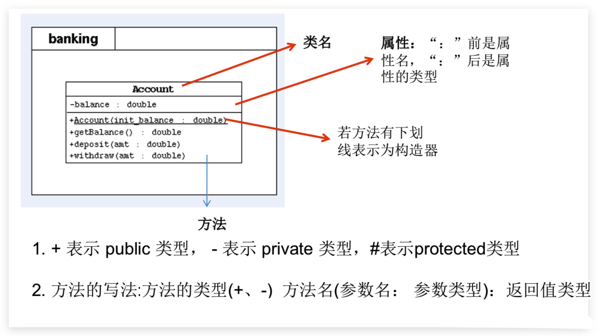
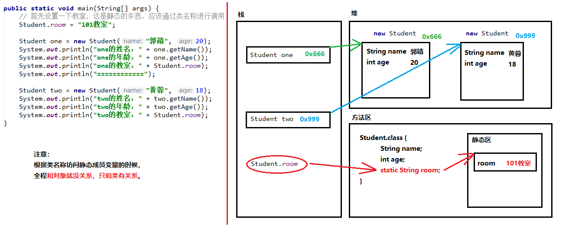

# 面向对象

## 面向对象

### 面向过程

面向过程编程也是一种编程范式或编程风格。它以过程（可以为理解方法、函数、操作）作为组织代码的基本单元，以**数据**（可以理解为成员变量、属性）与**方法**相分离为最主要的特点。面向过程风格是一种流程化的编程风格，通过拼接一组顺序执行的方法来操作数据完成一项功能。

### 面向对象

**面向对象编程**是一种**编程范式或编程风格**。它以类或对象作为组织代码的基本单元，并将封装、抽象、继承、多态四个特性，作为代码设计和实现的基石 。

Java 利用**万物皆对象**的思想和单一一致的语法方式来简化问题。**只要拥有对象的“引用”，就可以操纵该“对象”**。换句话说，我们无需直接接触电视，就可通过遥控器（引用）自由地控制电视（对象）的频道和音量。此外，没有电视，遥控器也可以单独存在。就是说，你仅仅有一个“引用”并不意味着你必然有一个与之关联的“对象”（为 null）。

Smalltalk 作为第一个成功的面向对象并影响了 Java 的程序设计语言 ，_Alan Kay_ 总结了其五大基本特征。通过这些特征，我们可理解“纯粹”的面向对象程序设计方法是什么样的：

1.  **万物皆对象**。你可以将对象想象成一种特殊的变量。它存储数据，但可以在你对其“发出请求”时执行本身的操作。理论上讲，你总是可以从要解决的问题身上抽象出概念性的组件，然后在程序中将其表示为一个对象。
2.  **程序是一组对象，通过消息传递来告知彼此该做什么**。要请求调用一个对象的方法，你需要向该对象发送消息。
3.  **每个对象都有自己的存储空间，可容纳其他对象**。或者说，通过封装现有对象，可制作出新型对象。所以，尽管对象的概念非常简单，但在程序中却可达到任意高的复杂程度。
4.  **每个对象都有一种类型**。根据语法，每个对象都是某个“类”的一个“实例”。其中，“类”（Class）是“类型”（Type）的同义词。一个类最重要的特征就是“能将什么消息发给它？”。
5.  **同一类所有对象都能接收相同的消息**。这实际是别有含义的一种说法，大家不久便能理解。由于类型为“圆”（Circle）的一个对象也属于类型为“形状”（Shape）的一个对象，所以一个圆完全能接收发送给"形状”的消息。这意味着可让程序代码统一指挥“形状”，令其自动控制所有符合“形状”描述的对象，其中自然包括“圆”。这一特性称为对象的“可替换性”，是 OOP 最重要的概念之一。

_Grady Booch_ 提供了对对象更简洁的描述：**一个对象具有自己的状态，行为和标识**。这意味着对象有自己的**内部数据**(提供状态)、**方法** (产生行为)，并**彼此区分**（每个对象在内存中都有唯一的地址）。

### 区别

面向过程和面向对象最基本的区别就是，**代码的组织方式不同**。面向过程风格的代码被组织成了一组方法集合及其数据结构（struct User），方法和数据结构的定义是分开的。面向对象风格的代码被组织成一组类，方法和数据结构被绑定一起，定义在类中。

```c
struct User {
  char name[64];
  int age;
  char gender[16];
};

struct User parse_to_user(char* text) {
  // 将text(“小王&28&男”)解析成结构体struct User
}

char* format_to_text(struct User user) {
  // 将结构体struct User格式化成文本（"小王\t28\t男"）
}

void sort_users_by_age(struct User users[]) {
  // 按照年龄从小到大排序users
}

void format_user_file(char* origin_file_path, char* new_file_path) {
  // open files...
  struct User users[1024]; // 假设最大1024个用户
  int count = 0;
  while(1) { // read until the file is empty
    struct User user = parse_to_user(line);
    users[count++] = user;
  }

  sort_users_by_age(users);

  for (int i = 0; i < count; ++i) {
    char* formatted_user_text = format_to_text(users[i]);
    // write to new file...
  }
  // close files...
}

int main(char** args, int argv) {
  format_user_file("/home/zheng/user.txt", "/home/zheng/formatted_users.txt");
}
```

```java
 public class User {
  private String name;
  private int age;
  private String gender;

  public User(String name, int age, String gender) {
    this.name = name;
    this.age = age;
    this.gender = gender;
  }

  public static User praseFrom(String userInfoText) {
    // 将text(“小王&28&男”)解析成类User
  }

  public String formatToText() {
    // 将类User格式化成文本（"小王\t28\t男"）
  }
}

public class UserFileFormatter {
  public void format(String userFile, String formattedUserFile) {
    // Open files...
    List users = new ArrayList<>();
    while (1) { // read until file is empty
      // read from file into userText...
      User user = User.parseFrom(userText);
      users.add(user);
    }
    // sort users by age...
    for (int i = 0; i < users.size(); ++i) {
      String formattedUserText = user.formatToText();
      // write to new file...
    }
    // close files...
  }
}

public class MainApplication {
  public static void main(Sring[] args) {
    UserFileFormatter userFileFormatter = new UserFileFormatter();
    userFileFormatter.format("/home/zheng/users.txt", "/home/zheng/formatted_users.txt");
  }
}

```

### 优劣

面向对象编程跟面向过程编程比起来，到底有哪些优势？

- 对于大规模复杂程序的开发，程序的处理流程并非单一的一条主线，而是错综复杂的网状结构。面向对象编程比起面向过程编程，更能应对这种复杂类型的程序开发。

  像 C 语言这种面向过程的编程语言，我们也可以按照功能的不同，把函数和数据结构放到不同的文件里，以达到给函数和数据结构分类的目的，照样可以实现代码的模块化。只不过面向对象编程本身提供了类的概念，强制你做这件事情，而面向过程编程并不强求。

- 面向对象编程相比面向过程编程，具有更加丰富的特性（封装、抽象、继承、多态）。利用这些特性编写出来的代码，更加易扩展、易复用、易维护。

- 从编程语言跟机器打交道的方式的演进规律中，我们可以总结出：面向对象编程语言比起面向过程编程语言，更加人性化、更加高级、更加智能。

## 抽象—Encapsulation

### 简介

**所有编程语言都提供抽象机制**。从某种程度上来说，问题的复杂度直接取决于抽象的类型和质量。这里的“类型”意思是：抽象的内容是什么？汇编语言是对底层机器的轻微抽象。接着出现的“命令式”语言（如 FORTRAN，BASIC 和 C）是对汇编语言的抽象。抽象这个概念是一个非常**通用的设计思想**，并不单单用在面向对象编程中，也可以用来指导架构设计等。而且这个特性也并不需要编程语言提供特殊的语法机制来支持，只需要提供“函数”这一非常基础的语法机制，就可以实现抽象特性、所以，它没有很强的“特异性”，有时候并不被看作面向对象编程的特性之一。

**抽象讲的是如何隐藏方法的具体实现，让调用者只需要关心方法提供了哪些功能，并不需要知道这些功能是如何实现的**。在面向对象编程中，我们常借助编程语言提供的接口类（比如 Java 中的 interface 关键字语法）或者抽象类（比如 Java 中的 abstract 关键字语法）这两种语法机制，来实现抽象这一特性。优点如下：

- 抽象及封装都是**处理复杂性的有效手段**。忽略掉一些非关键性的实现细节，只关注功能点不关注实现的设计思路
- 抽象作为一个非常宽泛的设计思想，在**代码设计中，起到非常重要的指导作用**。很多设计原则都体现了抽象这种设计思想，比如基于接口而非实现编程、开闭原则（对扩展开放、对修改关闭）、代码解耦（降低代码的耦合性）等。

### 示例

对于抽象这个特性，如下例子解释：

```java
public interface IPictureStorage {
  void savePicture(Picture picture);
  Image getPicture(String pictureId);
  void deletePicture(String pictureId);
  void modifyMetaInfo(String pictureId, PictureMetaInfo metaInfo);
}

public class PictureStorage implements IPictureStorage {
  // ...省略其他属性...
  @Override
  public void savePicture(Picture picture) { ... }
  @Override
  public Image getPicture(String pictureId) { ... }
  @Override
  public void deletePicture(String pictureId) { ... }
  @Override
  public void modifyMetaInfo(String pictureId, PictureMetaInfo metaInfo) { ... }
}
```

在上面的这段代码中，我们利用 Java 中的 interface 接口语法来实现抽象特性。调用者在使用图片存储功能的时候，只需要了解 IPictureStorage 这个接口类暴露了哪些方法就可以了，不需要去查看 PictureStorage 类里的具体实现逻辑。

实际上，抽象这个特性是非常容易实现的，并不需要非得依靠接口类或者抽象类这些特殊语法机制来支持。换句话说，并不是说一定要为实现类（PictureStorage）抽象出接口类（IPictureStorage），才叫作抽象。即便不编写 IPictureStorage 接口类，单纯的 PictureStorage 类本身就满足抽象特性。因为，类的方法是通过编程语言中的“函数”这一语法机制来实现的。通过函数包裹具体的实现逻辑，这本身就是一种抽象。调用者在使用函数的时候，并不需要去研究函数内部的实现逻辑，只需要通过函数的命名、注释或者文档，了解其提供了什么功能，就可以直接使用了。

## 封装—Encapsulation

### 简介

**封装也叫作访问控制或信息隐藏或者数据访问保护**。由于使用者对**类内部定义的 Field、Method、Constructor 等成员**的直接操作可能会导致错误或发生安全性问题。**类通过暴露有限的访问接口，授权外部仅能通过类提供的方式（或者叫方法）来访问内部信息或者数据**。

### 优缺点

优点

- **隐藏**一个类中不需要对外提供的**实现细节**，不可以随意访问、修改类中的属性，**加强可控性**
- **便于修改，增强代码的可维护性**
- **提高类的易用性**。只需了解暴露的方法即可，不用对每个属性都了解。使用者只能通过事先定制好的方法来访问数据，可以方便地**加入控制逻辑，限制对属性的不合理操作**

### 示例

常见到的设计模式如**单例模式**即使用了该思想

下面这段代码是金融系统中一个简化版的虚拟钱包的代码实现。在金融系统中，我们会给每个用户创建一个虚拟钱包，用来记录用户在我们的系统中的虚拟货币量。

```java
public class Wallet {
  private String id;
  private long createTime;
  private BigDecimal balance;
  private long balanceLastModifiedTime;
  // ...省略其他属性...

  public Wallet() {
     this.id = IdGenerator.getInstance().generate();
     this.createTime = System.currentTimeMillis();
     this.balance = BigDecimal.ZERO;
     this.balanceLastModifiedTime = System.currentTimeMillis();
  }

  // 注意：下面对get方法做了代码折叠，是为了减少代码所占文章的篇幅
  public String getId() { return this.id; }
  public long getCreateTime() { return this.createTime; }
  public BigDecimal getBalance() { return this.balance; }
  public long getBalanceLastModifiedTime() { return this.balanceLastModifiedTime;  }

  public void increaseBalance(BigDecimal increasedAmount) {
    if (increasedAmount.compareTo(BigDecimal.ZERO) < 0) {
      throw new InvalidAmountException("...");
    }
    this.balance.add(increasedAmount);
    this.balanceLastModifiedTime = System.currentTimeMillis();
  }

  public void decreaseBalance(BigDecimal decreasedAmount) {
    if (decreasedAmount.compareTo(BigDecimal.ZERO) < 0) {
      throw new InvalidAmountException("...");
    }
    if (decreasedAmount.compareTo(this.balance) > 0) {
      throw new InsufficientAmountException("...");
    }
    this.balance.subtract(decreasedAmount);
    this.balanceLastModifiedTime = System.currentTimeMillis();
  }
}

 Copied!
```

参照封装特性，对钱包的这四个属性的访问方式进行了限制。调用者只允许通过上述这六个方法来访问或者修改钱包里的数据。这样设计，是因为从业务的角度来说，id、createTime 在创建钱包的时候就确定好了，之后不应该再被改动，所以，我们并没有在 Wallet 类中，暴露 id、createTime 这两个属性的任何修改方法，比如 set 方法。而且，这两个属性的初始化设置，对于 Wallet 类的调用者来说，也应该是透明的，所以，我们在 Wallet 类的构造函数内部将其初始化设置好，而不是通过构造函数的参数来外部赋值。

对于钱包余额 balance 这个属性，从业务的角度来说，只能增或者减，不会被重新设置。所以，我们在 Wallet 类中，只暴露了 increaseBalance() 和 decreaseBalance() 方法，并没有暴露 set 方法。对于 balanceLastModifiedTime 这个属性，它完全是跟 balance 这个属性的修改操作绑定在一起的。只有在 balance 修改的时候，这个属性才会被修改。所以，我们把 balanceLastModifiedTime 这个属性的修改操作完全封装在了 increaseBalance() 和 decreaseBalance() 两个方法中，不对外暴露任何修改这个属性的方法和业务细节。这样也可以保证 balance 和 balanceLastModifiedTime 两个数据的一致性。

对于封装这个特性，需要编程语言本身提供访问权限控制来支持。例子中的 private、public 等关键字就是 Java 语言中的访问权限控制语法。private 关键字修饰的属性只能类本身访问，可以保护其不被类之外的代码直接访问。如果 Java 语言没有提供访问权限控制语法，所有的属性默认都是 public 的，那任意外部代码都可以通过类似 wallet.id=123; 这样的方式直接访问、修改属性，也就没办法达到隐藏信息和保护数据的目的了，也就无法支持封装特性了。

## 继承—Inheritance

### 简介

继承是用来表示类之间的 `is-a` 或`is-like-a`关系，比如猫是一种哺乳动物。当多个类中存在相同属性和行为时，将这些内容抽取到单独一个类中， 其他类无需再定义这些属性和行为，只要继承那个类即可。此处的其他类称为**子类（派生类或 subclass）**，单独的这个类称为**父类（基类 或超类 或 superclass）**。**一般规则是所有字段为私有，所有方法为公共**

注意继承的**规则**：

- **子类继承父类，就获取了父类（间接父类）所有的属性和方法**。但是子类不能直接访问父类中 private 的成员变量和方法。
- Java 只支持**单继承和多层继承**，**不允许多继承**
- 除`java.lang.Object`类之外的所有 java 类都直接或间接的继承于`java.lang.Object`类

### is-a & is-like-a

对于继承可能会引发争论：**继承应该只覆盖基类的方法(不应该添加基类中没有的方法)吗**？如果这样的话，基类和派生类就是相同的类型了，因为它们具有相同的接口。这会造成，你可以用一个派生类对象完全替代基类对象，这叫作"**纯粹替代**"，也经常被称作"替代原则"。在某种意义上，这是一种处理继承的理想方式。我们经常把这种基类和派生类的关系称为是一个`is-a`关系，因为可以说"圆是一个形状"。判断是否继承，就看在你的类之间有无这种`is-a`关系。

有时你在派生类添加了新的接口元素，从而扩展接口。虽然新类型仍然可以替代基类，但是这种替代不完美，原因在于基类无法访问新添加的方法。这种关系称为像是一个`is-like-a`关系。新类型不但拥有旧类型的接口，而且包含其他方法，所以不能说新旧类型完全相同。



以空调为例，假设房间里已经安装好了制冷设备的控制器，即你有了控制制冷设备的接口。想象一下，现在空调坏了，你重新安装了一个既制冷又制热的热力泵。热力泵就像是一个`is-like-a`空调，但它可以做更多。因为当初房间的控制系统被设计成只能控制制冷设备，所以它只能与新对象(热力泵)的制冷部分通信。新对象的接口已经扩展了，现有控制系统却只知道原来的接口，一旦看到这个设计，你就会发现，作为基类的制冷系统不够一般化，应该被重新命名为"温度控制系统"，也应该包含制热功能，这样的话，我们就可以使用替代原则了。上图反映了在现实世界中进行设计时可能会发生的事情。

当你看到替代原则时，很容易会认为纯粹替代是唯一可行的方式，并且使用纯粹替代的设计是很好的。但有些时候，你会发现必须得在派生(扩展)类中添加新方法(提供新的接口)。只要仔细审视，你可以很明显地区分两种设计方式的使用场合。

### 成员访问特点

::: tip 重点

继承 & 多态中成员访问特点总结为：**对象的多态性，只适用于成员方法**

:::

继承后**成员变量**：若重名则**就近**使用，使用 super 区分父类变量。**编译看左边，运行看左边**

- 子父类中出现了**同名**的**成员变量**，则创建子类对象时，访问有两种方式：
  - **直接通过子类对象访问**成员变量：**=左边对象是谁**，就优先用谁，没有则向**上**找
  - **间接通过成员方法访问**成员变量：该**方法属于谁**，就优先用谁，没有则向**上**找

继承后**构造方法**：无影响，但是子类构造方法默认调用父类构造方法

- **子类构造必须先调用父类构造方法进行初始化**，不写则默认**赠送 super()**，写则用写的**指定 super**调用
- 构造方法的名字是与类名一致的。所以子类是**无法继承**父类**构造方法**的

继承后**成员方法**：重名，子类重写父类方法。**编译看左边，运行看右边**

- 在父子类的继承关系中，创建子类对象，访问成员方法的规则：
  - **创建的对象(new)是谁，就优先用谁**，没有则向**上**找

### 优缺点

优点

- **通过共性抽取减少了代码冗余，提高代码复用性**。也可以通过其他方式来解决这个代码复用的问题，比如利用组合关系而不是继承关系
- 继承的出现更有利于**功能的扩展**
- 继承的出现让**类与类之间产生了关系，提供了多态的前提**。但是不要仅为了获取其他类中某个功能而去继承

缺点

- 过度使用继承，继承层次过深过复杂，就会导致代码可读性、可维护性变差。为了了解一个类的功能，我们不仅需要查看这个类的代码，还需要按照继承关系一层一层地往上查看“父类、父类的父类……”的代码。
- 子类和父类高度耦合，修改父类的代码，会直接影响到子类。继承这个特性也是一个非常有争议的特性。很多人觉得继承是一种反模式。我们应该尽量少用，甚至不用。

### 单继承

自从 C++ 引入以来，一个 OOP 问题变得尤为突出：是否所有的类都应该默认从一个基类继承呢？这个答案在 Java 中是肯定的（实际上，除 C++ 以外的几乎所有 OOP 语言中也是这样）。在 Java 中，这个最终基类的名字就是 `Object`。

Java 的单继承结构有很多好处。**由于所有对象都具有一个公共接口，因此它们最终都属于同一个基类**。相反的，对于 C++ 所使用的多继承的方案则是不保证所有的对象都属于同一个基类。从向后兼容的角度看，多继承的方案更符合 C 的模型，而且受限较少。

对于完全面向对象编程，我们必须要构建自己的层次结构，以提供与其他 OOP 语言同样的便利。我们经常会使用到新的类库和不兼容的接口。为了整合它们而花费大气力（有可能还要用上多继承）以获得 C++ 样的“灵活性”值得吗？如果从零开始，Java 这样的替代方案会是更好的选择。

另外，**单继承的结构使得垃圾收集器的实现更为容易**。这也是 Java 在 C++ 基础上的根本改进之一。

由于**运行期的类型信息会存在于所有对象中，所以我们永远不会遇到判断不了对象类型的情况**。这对于系统级操作尤其重要，例如异常处理。同时，这也让我们的编程具有更大的灵活性。

## 多态—Polymorphism

::: tip 提示

多态，也称为动态绑定 或 后期绑定 或 运行时绑定

:::

### 简介

多态提供了另一个维度的**接口与实现分离**，以**解耦做什么和怎么做**，消除类型之间耦合，因而一段代码就可以无差别地运行在所有不同的类型上了。多态可以理解为一个事物的多种形态。体现为**对象的多态性**，是指**父类的引用指向子类的对象**，在实际的代码运行过程中，**调用子类**的方法实现。**方法重载（@overload）实现编译时多态（有时不考虑这个）；方法重写（@override）实现运行时多态。**

Java 引用变量有两个类型：编译时类型和运行时类型

- 编译时类型由声明该变量时使用的类型决定

- 运行时类型由实际赋给该变量的对象决定

  **编译时，看左边；运行时，看右边**

若编译时类型和运行时类型不一致，就出现了对象的多态性，多态情况下

- “看左边”：看的是父类的引用（父类中不具备子类特有的方法）
- “看右边”：看的是子类的对象（实际运行的是子类重写父类的方法）

我们在处理类的层次结构时，通常把一个对象看成是它所属的基类，而不是把它当成具体类。通过这种方式，我们可以编写出不局限于特定类型的代码。这样的代码不会受添加的新类型影响，并且添加新类型是扩展面向对象程序以处理新情况的常用方法。通过派生新的子类来扩展设计的这种能力是封装变化的基本方法之一。

这种能力改善了我们的设计，且减少了软件的维护代价。如果我们把派生的对象类型统一看成是它本身的基类（“圆”当作“形状”，“自行车”当作“车”，“鸬鹚”当作“鸟”等等），编译器（compiler）在编译时期就无法准确地知道什么“形状”被擦除，哪一种“车”在行驶，或者是哪种“鸟”在飞行。这就是关键所在：当程序接收这种消息时，程序员并不想知道哪段代码会被执行。“绘图”的方法可以平等地应用到每种可能的“形状”上，形状会依据自身的具体类型执行恰当的代码。

如果不需要知道执行了哪部分代码，那我们就能添加一个新的不同执行方式的子类而不需要更改调用它的方法。那么编译器在不确定该执行哪部分代码时是怎么做的呢？举个例子，下图的 **BirdController** 对象和通用 **Bird** 对象中，**BirdController** 不知道 **Bird** 的确切类型却还能一起工作。从 **BirdController** 的角度来看，这是很方便的，因为它不需要编写特别的代码来确定 **Bird** 对象的确切类型或行为。那么，在调用 **move()** 方法时是如何保证发生正确的行为（鹅走路、飞或游泳、企鹅走路或游泳）的呢？


这个问题的答案，是面向对象程序设计的妙诀：在传统意义上，编译器不能进行函数调用。由非 OOP 编译器产生的函数调用会引起所谓的**早期绑定**，这个术语你可能从未听说过，不会想过其他的函数调用方式。这意味着编译器生成对特定函数名的调用，该调用会被解析为将执行的代码的绝对地址。

通过继承，程序直到运行时才能确定代码的地址，因此发送消息给对象时，还需要其他一些方案。为了解决这个问题，面向对象语言使用**后期绑定**的概念。当向对象发送信息时，被调用的代码直到运行时才确定。编译器确保方法存在，并对参数和返回值执行类型检查，但是它不知道要执行的确切代码。

为了执行后期绑定，Java 使用一个特殊的代码位来代替绝对调用。这段代码使用对象中存储的信息来计算方法主体的地址（此过程在多态性章节中有详细介绍）。因此，每个对象的行为根据特定代码位的内容而不同。当你向对象发送消息时，对象知道该如何处理这条消息。在某些语言中，必须显式地授予方法后期绑定属性的灵活性。例如，C++ 使用 **virtual** 关键字。在这些语言中，默认情况下方法不是动态绑定的。在 Java 中，动态绑定是默认行为，不需要额外的关键字来实现多态性。

为了演示多态性，我们编写了一段代码，它忽略了类型的具体细节，只与基类对话。该代码与具体类型信息分离，因此更易于编写和理解。而且，如果通过继承添加了一个新类型（例如，一个六边形），那么代码对于新类型的 Shape 就像对现有类型一样有效。因此，该程序是可扩展的。

代码示例：

```java
void doSomething(Shape shape) {
    shape.erase();
    // ...
    shape.draw();
}
```

此方法与任何 **Shape** 对话，因此它与所绘制和擦除的对象的具体类型无关。如果程序的其他部分使用 `doSomething()` 方法：

```java
Circle circle = new Circle();
Triangle triangle = new Triangle();
Line line = new Line();
doSomething(circle);
doSomething(triangle);
doSomething(line);
```

可以看到无论传入的“形状”是什么，程序都正确的执行了。



这是一个非常令人惊奇的编程技巧。分析下面这行代码：

```java
doSomething(circle);
```

当预期接收 **Shape** 的方法被传入了 **Circle**，会发生什么。由于 **Circle** 也是一种 **Shape**，所以 `doSomething(circle)` 能正确地执行。也就是说，`doSomething()` 能接收任意发送给 **Shape** 的消息。这是完全安全和合乎逻辑的事情。

这种把子类当成其基类来处理的过程叫做“向上转型”（**upcasting**）。在面向对象的编程里，经常利用这种方法来给程序解耦。再看下面的 `doSomething()` 代码示例：

```java
shape.erase();
// ...
shape.draw();
```

我们可以看到程序并未这样表达：“如果你是一个 Circle ，就这样做；如果你是一个 Square，就那样做...”。若那样编写代码，就需检查 Shape 所有可能的类型，如圆、矩形等等。这显然是非常麻烦的，而且每次添加了一种新的 Shape 类型后，都要相应地进行修改。在这里，我们只需说：“你是一种几何形状，我知道你能删掉 `erase()` 和绘制 `draw()`，你自己去做吧，注意细节。”

尽管我们没作出任何特殊指示，程序的操作也是完全正确和恰当的。我们知道，为 Circle 调用`draw()` 时执行的代码与为一个 Square 或 Line 调用 `draw()` 时执行的代码是不同的。但在将 `draw()` 信息发给一个匿名 Shape 时，根据 Shape 句柄当时连接的实际类型，会相应地采取正确的操作。这非常神奇，因为当 Java 编译器为 `doSomething()` 编译代码时，它并不知道自己要操作的准确类型是什么。

尽管我们确实可以保证最终会为 Shape 调用 `erase()` 和 `draw()`，但并不能确定特定的 Circle，Square 或者 Line 调用什么。最后，程序执行的操作却依然是正确的，这是怎么做到的呢？

发送消息给对象时，如果程序不知道接收的具体类型是什么，但最终执行是正确的，这就是对象的“多态性”（Polymorphism）。面向对象的程序设计语言是通过“**动态绑定**”的方式来**实现对象的多态性**的。编译器和运行时系统会负责对所有细节的控制；我们只需知道要做什么，以及如何利用多态性来更好地设计程序。

### 实现机制

- **继承**或者**实现接口**（二选一）

  ::: tip

  动态语言中的 duck-typing 语法也可以实现多态

  :::

- **子类可以重写父类中的方法**——意义体现，若不重写，则无意义

- **父类引用指向子类对象**——格式体现

### 多态的使用—虚拟方法调用

在编译期，只能调用父类中声明的方法，但在运行期，我们实际执行的是子类重写父类的方法。

虚拟方法调用(Virtual Method Invocation)，多态情况下：子类中定义了与父类同名同参数的方法，在多态情况下，将此时**父类的方法称为虚拟方法**，父类根据赋给它的不同子类对象，动态调用属于子类的该方法。即**参数的值传递机制体现对象多态性**。这样的方法调用在编译期是无法确定的。

### 成员访问特点

::: tip 重点

继承 & 多态中成员访问特点总结为：**对象的多态性，只适用于成员方法**

:::

- 成员变量：编译看左边，运行看左边。没有则向上找。
- 静态方法或变量：编译看左边，运行看左边（与类相关）。没有则向上找。
- **成员方法**：编译看**左**边，运行看**右**边（**依赖对象，因为有方法重写**）
- 构造方法：创建子类对象时访问父类构造方法对父类成员进行初始化

### 对象类型转换

- 基本数据类型的 Casting
  - 自动类型转换：小的数据类型可以自动转换成大的数据类型。略
  - 强制类型转换：可以把大的数据类型强制转换(casting)成小的数据类型。略
- 对**Java 对象的强制类型转换**称为**造型**

  - 从子类到父类的类型转换可以自动进行（多态）
  - 从父类到子类的类型转换必须通过造型(强制类型转换)实现。可能出现 ClassCastException，需先 instanceof 判断
  - 无继承关系的引用类型间的转换是非法的
  - 在造型前可以使用 instanceof 操作符测试一个对象的类型

- **instanceof** `x instanceof A`：检验 x 是否为类 A 的对象，返回值为 boolean 型
  - 要求 x 所属的类与类 A 必须是子类和父类的关系，否则编译错误。
  - 如果 x 属于类 A 的子类 B，x instanceof A 值也为 true。

### 优缺点

优点

- 改善代码的组织，提高代码的可读性
- **提高代码的可扩展性**——无论在最初创建项目时还是在添加新特性时都可以“生长”的程序

### 示例

多态也是很多设计模式、设计原则、编程技巧的代码实现基础，比如策略模式、基于接口而非实现编程、依赖倒置原则、里式替换原则、利用多态去掉冗长的 if-else 语句等等。

::: tip 动态语言中 duck-typing 语法

继承和实现接口来实现多态就不多赘述，下面来看下，如何用 duck-typing 来实现多态特性：

```python
class Logger:
    def record(self):
        print(“I write a log into file.”)

class DB:
    def record(self):
        print(“I insert data into db. ”)

def test(recorder):
    recorder.record()

def demo():
    logger = Logger()
    db = DB()
    test(logger)
    test(db)
```

duck-typing 实现多态的方式非常灵活。Logger 和 DB 两个类没有任何关系，既不是继承关系，也不是接口和实现的关系，但是只要它们都有定义了 record() 方法，就可以被传递到 test() 方法中，在实际运行的时候，执行对应的 record() 方法。也就是说，只要两个类具有相同的方法，就可以实现多态，并不要求两个类之间有任何关系，这就是所谓的 duck-typing，是一些动态语言所特有的语法机制。

:::

## 复用

代码复用是面向对象编程（OOP）最具魅力的原因之一。在本章里，你将学习到两种方式来达到这个目的：

- 继承
- 组合

### 继承

查看继承章节

### 组合 & 聚合

- **组合**（Composition）经常用来表示“**拥有**”关系（has-a relationship）。例如，“汽车拥有引擎”。**仅需要把对象的引用（object references）放置在一个新的类里**
- **聚合**（Aggregation）动态的**组合**。

使用“组合”关系给我们的程序带来极大的灵活性。通常新建的类中，成员对象会使用 `private` 访问权限，这样应用程序员则无法对其直接访问。我们就可以在不影响客户代码的前提下，从容地修改那些成员。我们也可以在“运行时"改变成员对象从而动态地改变程序的行为，这进一步增大了灵活性。而“继承”并不具备这种灵活性，因为编译器对通过继承创建的类进行了限制。

在面向对象编程中经常重点强调“继承”。在新手程序员的印象里，或许先入为主地认为“继承应当随处可见”。沿着这种思路产生的程序设计通常拙劣又复杂。相反，**在创建新类时首先要考虑“组合”**，因为它更简单灵活，而且设计更加清晰。

::: tip 组合和聚合的区别

组合和聚合都属于关联关系的一种，只是额外具有整体-部分的意义。至于是聚合还是组合，需要根据实际的业务需求来判断。可能相同超类和子类，在不同的业务场景，关联关系会发生变化。只看代码是无法区分聚合和组合的，具体是哪一种关系，只能从语义级别来区分。聚合关系中，整件不会拥有部件的生命周期，所以整件删除时，部件不会被删除。再者，多个整件可以共享同一个部件。组合关系中，整件拥有部件的生命周期，所以整件删除时，部件一定会跟着删除。而且，多个整件不可以同时共享同一个部件。这个区别可以用来区分某个关联关系到底是组合还是聚合。**两个类生命周期不同步，则是聚合关系，生命周期同步就是组合关系。**

:::

### 委托

Java 不直接支持的第三种重用关系称为委托。这**介于继承和组合之间**，因为你将一个成员对象放在正在构建的类中(比如组合)，但同时又在新类中公开来自成员对象的所有方法(比如继承)。例如，宇宙飞船需要一个控制模块:

```java
public class SpaceShipControls {
  void up(int velocity) {}
  void down(int velocity) {}
  void left(int velocity) {}
  void right(int velocity) {}
  void forward(int velocity) {}
  void back(int velocity) {}
  void turboBoost() {}
}
```

建造宇宙飞船的一种方法是使用继承:

```java
public class DerivedSpaceShip extends SpaceShipControls {
  private String name;

  public DerivedSpaceShip(String name) {
    this.name = name;
  }

  @Override
  public String toString() { return name; }

  public static void main(String[] args) {
    DerivedSpaceShip protector =
        new DerivedSpaceShip("NSEA Protector");
    protector.forward(100);
  }
}
```

然而， **DerivedSpaceShip** 并**不是**真正的“一种” **SpaceShipControls**（不属于`is-a`关系） ，即使你“告诉” **DerivedSpaceShip** 调用 `forward()`。更准确地说，一艘宇宙飞船包含了 **SpaceShipControls ，同时 SpaceShipControls** 中的所有方法都暴露在宇宙飞船中。委托解决了这个难题:

```java
public class SpaceShipDelegation {
  private String name;
  private SpaceShipControls controls =
    new SpaceShipControls();
  public SpaceShipDelegation(String name) {
    this.name = name;
  }
  // Delegated methods:
  public void back(int velocity) {
    controls.back(velocity);
  }
  public void down(int velocity) {
    controls.down(velocity);
  }
  public void forward(int velocity) {
    controls.forward(velocity);
  }
  public void left(int velocity) {
    controls.left(velocity);
  }
  public void right(int velocity) {
    controls.right(velocity);
  }
  public void turboBoost() {
    controls.turboBoost();
  }
  public void up(int velocity) {
    controls.up(velocity);
  }
  public static void main(String[] args) {
    SpaceShipDelegation protector =
      new SpaceShipDelegation("NSEA Protector");
    protector.forward(100);
  }
}
```

方法被转发到底层 **control** 对象，因此接口与继承的接口是相同的。但是，你对委托有更多的控制，因为你可以选择只在成员对象中提供方法的子集。

虽然 Java 语言不支持**委托**，但是开发工具常常支持。例如，上面的例子是使用 JetBrains Idea IDE 自动生成的。**调用 Generate 后选择 Delegated methods...**

### 继承与组合的选择

**当你想在新类中包含一个已有类的功能时，使用组合，而非继承**。也就是说，**在新类中嵌入一个对象（通常是私有的**），以实现其功能。新类的使用者看到的是你所定义的新类的接口，而非嵌入对象的接口。

有时让类的用户直接访问到新类中的组合成分是有意义的。只需将成员对象声明为 **public** 即可（可以把这当作“半委托”的一种）。成员对象隐藏了具体实现，所以这是安全的。当用户知道你正在组装一组部件时，会使得接口更加容易理解。下面的 car 对象是个很好的例子：

```java
class Engine {
    public void start() {}
    public void rev() {}
    public void stop() {}
}

class Wheel {
    public void inflate(int psi) {}
}

class Window {
    public void rollup() {}
    public void rolldown() {}
}

class Door {
    public Window window = new Window();

    public void open() {}
    public void close() {}
}

public class Car {
    public Engine engine = new Engine();
    public Wheel[] wheel = new Wheel[4];
    public Door left = new Door(), right = new Door(); // 2-door

    public Car() {
        for (int i = 0; i < 4; i++) {
            wheel[i] = new Wheel();
        }
    }

    public static void main(String[] args) {
        Car car = new Car();
        car.left.window.rollup();
        car.wheel[0].inflate(72);
    }
}
```

因为在这个例子中 car 的组合也是问题分析的一部分（不是底层设计的部分），所以声明成员为 **public** 有助于客户端程序员理解如何使用类，且降低了类创建者面临的代码复杂度。但是，记住这是一个特例。通常来说，属性还是应该声明为 **private**。

当使用继承时，使用一个现有类并开发出它的新版本。通常这意味着使用一个通用类，并为了某个特殊需求将其特殊化。稍微思考下，你就会发现，用一个交通工具对象来组成一部车是毫无意义的——车不包含交通工具，它就是交通工具。这种“是一个”的关系是用继承来表达的，而“有一个“的关系则用组合来表达。

## 创建对象的数据存储

### 内存分配

那么，程序在运行时是如何存储的呢？尤其是内存是怎么分配的。有 5 个不同的地方可以存储数据：

1.  **寄存器**（Registers）最快的存储区域，位于 CPU 内部 [^2](https://lingcoder.github.io/OnJava8/#/大多数微处理器芯片都有额外的高速缓冲存储器，但这是按照传统存储器而不是寄存器。)。然而，寄存器的数量十分有限，所以寄存器根据需求进行分配。我们对其没有直接的控制权，也无法在自己的程序里找到寄存器存在的踪迹（另一方面，C/C++ 允许开发者向编译器建议寄存器的分配）。
2.  **栈内存**（Stack）存在于常规内存 RAM（随机访问存储器，Random Access Memory）区域中，可通过栈指针获得处理器的直接支持。**栈指针下移分配内存，上移释放内存**，这是一种快速有效的内存分配方法，速度仅次于寄存器。创建程序时，Java 系统必须准确地知道栈内保存的所有项的生命周期。这种约束限制了程序的灵活性。因此，虽然在栈内存上存在一些 Java 数据，特别是对象引用，但 Java 对象却是保存在堆内存的。
3.  **堆内存**（Heap）这是一种通用的内存池（也在 RAM 区域），所有 Java 对象都存在于其中。与栈内存不同，编译器不需要知道对象必须在堆内存上停留多长时间。因此，用堆内存保存数据更具灵活性。创建一个对象时，只需用 `new` 命令实例化对象即可，当执行代码时，会自动在堆中进行内存分配。这种灵活性是有代价的：分配和清理堆内存要比栈内存需要更多的时间（如果可以用 Java 在栈内存上创建对象，就像在 C++ 中那样的话）。随着时间的推移，Java 的堆内存分配机制现在已经非常快，因此这不是一个值得关心的问题了。
4.  **常量存储**（Constant storage）常量值通常直接放在程序代码中，因为它们永远不会改变。如需严格保护，可考虑将它们置于只读存储器 ROM （只读存储器，Read Only Memory）中 [^3](https://lingcoder.github.io/OnJava8/#/一个例子是字符串常量池。所有文字字符串和字符串值常量表达式都会自动放入特殊的静态存储中。)。
5.  **非 RAM 存储**（Non-RAM storage）数据完全存在于程序之外，在程序未运行以及脱离程序控制后依然存在。两个主要的例子：（1）序列化对象：对象被转换为字节流，通常被发送到另一台机器；（2）持久化对象：对象被放置在磁盘上，即使程序终止，数据依然存在。这些存储的方式都是将对象转存于另一个介质中，并在需要时恢复成常规的、基于 RAM 的对象。Java 为轻量级持久化提供了支持。而诸如 JDBC 和 Hibernate 这些类库为使用数据库存储和检索对象信息提供了更复杂的支持。

### 基本类型的存储

有一组类型在 Java 中使用频率很高，它们需要特殊对待，这就是 Java 的基本类型。之所以这么说，是因为它们的创建并不是通过 `new` 关键字来产生。通常 `new` 出来的对象都是保存在堆内存中的，以此方式创建小而简单的变量往往是不划算的。所以对于这些基本类型的创建方法，Java 使用了和 C/C++ 一样的策略。也就是说，不是使用 `new` 创建变量，而是使用一个“自动”变量。 这个变量直接存储"值"，并置于栈内存中，因此更加高效。

Java 确定了每种基本类型的内存占用大小。 这些大小不会像其他一些语言那样随着机器环境的变化而变化。这种不变性也是 Java 更具可移植性的一个原因。

| 基本类型 | 大小    | 最小值    | 最大值         | 包装类型  |
| -------- | ------- | --------- | -------------- | --------- |
| boolean  | —       | —         | —              | Boolean   |
| char     | 16 bits | Unicode 0 | Unicode 216 -1 | Character |
| byte     | 8 bits  | -128      | +127           | Byte      |
| short    | 16 bits | - 215     | + 215 -1       | Short     |
| int      | 32 bits | - 231     | + 231 -1       | Integer   |
| long     | 64 bits | - 263     | + 263 -1       | Long      |
| float    | 32 bits | IEEE754   | IEEE754        | Float     |
| double   | 64 bits | IEEE754   | IEEE754        | Double    |
| void     | —       | —         | —              | Void      |

所有的数值类型都是有正/负符号的。布尔（boolean）类型的大小没有明确的规定，通常定义为取字面值 “true” 或 “false” 。基本类型有自己对应的包装类型，如果你希望在堆内存里表示基本类型的数据，就需要用到它们的包装类。

### 高精度数值

在 Java 中有两种类型的数据可用于高精度的计算。它们是 `BigInteger` 和 `BigDecimal`。尽管它们大致可以划归为“包装类型”，但是它们并没有对应的基本类型。

这两个类包含的方法提供的操作，与对基本类型执行的操作相似。也就是说，能对 int 或 float 做的运算，在 BigInteger 和 BigDecimal 这里也同样可以，只不过必须要通过调用它们的方法来实现而非运算符。此外，由于涉及到的计算量更多，所以运算速度会慢一些。诚然，我们牺牲了速度，但换来了精度。

BigInteger 支持任意精度的整数。可用于精确表示任意大小的整数值，同时在运算过程中不会丢失精度。 BigDecimal 支持任意精度的定点数字。例如，可用它进行精确的货币计算。

关于这两个类的详细信息，请参考 JDK 官方文档。

### 数组的存储

许多编程语言都支持数组类型。在 C 和 C++ 中使用数组是危险的，因为那些数组只是内存块。如果程序访问了内存块之外的数组或在初始化之前使用该段内存（常见编程错误），则结果是不可预测的。

Java 的设计主要目标之一是安全性，因此许多困扰 C 和 C++ 程序员的问题不会在 Java 中再现。在 Java 中，数组使用前需要被初始化，并且不能访问数组长度以外的数据。这种范围检查，是以每个数组上少量的内存开销及运行时检查下标的额外时间为代价的，但由此换来的安全性和效率的提高是值得的。（并且 Java 经常可以优化这些操作）。

当我们创建对象数组时，实际上是创建了一个引用数组，并且每个引用的初始值都为 **null** 。在使用该数组之前，我们必须为每个引用指定一个对象 。如果我们尝试使用为 **null** 的引用，则会在运行时报错。因此，在 Java 中就防止了数组操作的常规错误。

我们还可创建基本类型的数组。编译器通过将该数组的内存全部置零来保证初始化。本书稍后将详细介绍数组，特别是在数组章节中。

## 对象清理

在一些编程语言中，管理变量的生命周期需要大量的工作。一个变量需要存活多久？如果我们想销毁它，应该什么时候去做呢？变量生命周期的混乱会导致许多 bug，本小结向你介绍 Java 是如何通过释放存储来简化这个问题的。

### 作用域

大多数程序语言都有作用域的概念。作用域决定了在该范围内定义的变量名的可见性和生存周期。在 C、 C++ 和 Java 中，作用域是由大括号 {} 的位置决定的。例如：

```java
{
    int x = 12;
    // 仅 x 变量可用
    {
        int q = 96;
        // x 和 q 变量皆可用
    }
    // 仅 x 变量可用
    // 变量 q 不在作用域内
}
```

Java 的变量只有在其作用域内才可用。缩进使得 Java 代码更易于阅读。由于 Java 是一种自由格式的语言，额外的空格、制表符和回车并不会影响程序的执行结果。在 Java 中，你不能执行以下操作，即使这在 C 和 C++ 中是合法的：

```java
{
    int x = 12;
    {
        int x = 96; // Illegal
    }
}
```

在上例中， Java 编译器会在提示变量 x 已经被定义过了。因此，在 C/C++ 中将一个较大作用域的变量"隐藏"起来的做法，在 Java 中是不被允许的。 因为 Java 的设计者认为这样做会导致程序混乱。

### 对象作用域

Java 对象与基本类型具有不同的生命周期。当我们使用 new 关键字来创建 Java 对象时，它的生命周期将会超出作用域。因此，下面这段代码示例：

```java
{
    String s = new String("a string");
}
// 作用域终点
```

上例中，引用 s 在作用域终点就结束了。但是，引用 s 指向的字符串对象依然还在占用内存。在这段代码中，我们无法在这个作用域之后访问这个对象，因为唯一对它的引用 s 已超出了作用域的范围。在后面的章节中，我们还会学习怎么在编程中传递和复制对象的引用。

只要你需要，`new` 出来的对象就会一直存活下去。 相比在 C++ 编码中操作内存可能会出现的诸多问题，这些困扰在 Java 中都不复存在了。在 C++ 中你不仅要确保对象的内存在你操作的范围内存在，还必须在使用完它们之后，将其销毁。

那么问题来了：我们在 Java 中并没有主动清理这些对象，那么它是如何避免 C++ 中出现的内存被填满从而阻塞程序的问题呢？答案是：Java 的垃圾收集器会检查所有 `new` 出来的对象并判断哪些不再可达，继而释放那些被占用的内存，供其他新的对象使用。也就是说，我们不必担心内存回收的问题了。你只需简单创建对象即可。当其不再被需要时，能自行被垃圾收集器释放。垃圾回收机制有效防止了因程序员忘记释放内存而造成的“内存泄漏”问题。

## 类及其成员

类及其成员包括：成员变量、成员方法、构造器、代码块、内部类

- 面向对象的两个要素：

  - 类：是对**一类事物的描述，是抽象的、概念上**的定义。是一组相关**属性**和**行为**的集合。
    - **属性 = 成员变量 = Field（域/字段）**：就是该事物的**状态信息**
    - **行为 = 成员方法 = 函数 = Method**：就是该事物**能够做什么**
  - 对象：是**实际存在的该类事物的每个个体**，因而也称为实例(instance)。

- **类的定义格式**

  ```java
  public class ClassName {
      //成员变量，对应事物的属性，描述事物的状态信息
      //构造方法：创建事物对象
      //成员方法，对应事物的行为，描述事物能做什么
      //......
  }
  ```

- **对象的使用**

  - 类的实例化、创建对象：`类名 对象名 = new 类名();`
  - 使用对象访问类中的成员：`对象名.成员变量；` `对象名.成员方法()`

- 匿名对象：不定义对象的句柄，而直接调用这个对象的方法

  创建匿名对象直接调用方法，没有变量名；匿名对象可以作为方法的参数和返回值。只能调用一次。

- **两个对象使用同一方法**的内存图

  对象调用方法时，根据对象中方法标记（地址值），去类中寻找方法信息。这样哪怕是多个对象，方法信息 只保存一份，节约内存空间。

  

- **两个引用指向同一对象**的内存图

  

- **引用类型作为参数传递到方法中，传递的是地址值**

  

- **使用引用类型作为方法的返回值，返回值就是对象的地址值**

  

### Field（域 / 字段 / 成员变量）

- 语法格式：`修饰符 数据类型 属性名 = 初始化值 ;`
  修饰符：private、缺省、protected、public；static、final

- **字段的默认值**：

  - 整型—`0`或`0L`
  - 浮点—`0.0f`或`0.0d`，`d`可省略
  - 布尔—`false`
  - char—Unicode 码`'\u0000'`（或 ASCII 码`0`，非`'0'`），是**空字符**，一个不可打印字符，不会看到任何输出
  - 引用类型（**包括包装类型**）—`null`

- **成员变量与局部变量区别**

  |              | 成员变量                                           | 局部变量                                           |
  | ------------ | -------------------------------------------------- | -------------------------------------------------- |
  | 声明的位置   | 直接声明在类中                                     | 方法或构造器的形参、方法内部、代码块内、构造器内等 |
  | 修饰符       | private、默认、protected、public、static、final 等 | 不能用权限修饰符修饰，可以用 final 修饰            |
  | 初始化值     | 有默认初始化值                                     | 没有默认初始化值，必须显式赋值，方可使用           |
  | 内存加载位置 | 堆空间 或 方法区的静态域内                         | 栈空间                                             |
  | 生命周期     | **随着对象**的创建而存在，随着对象被垃圾回收而消失 | **随着方法**的调用而存在，随着方法的调用完毕而消失 |

### Method（方法）

- **方法定义格式**

  ```java
  [返回类型] [方法名](/* 参数列表 */)｛
  	方法体;
  	/* return 返回值;//停止方法，将返回值返回给调用处 */
  }
  ```

  **方法名**和**参数列表**统称为**方法签名**（signature of the method），**签名作为方法的唯一标识**。Java 中的方法只能作为类的一部分创建，且它只能被有权限的对象所调用。方法的返回值也称为**方法的副作用**

- **return**

  - 退出当前方法
  - 指定一个方法返回值 (在方法返回类型非 **void** 的情况下)
  - 如果在方法签名中定义了返回值类型为 **void**，那么在代码执行结束时会有一个隐式的 **return**。 也就是说我们不用在总是在方法中显式地包含 **return** 语句。 **注意**：如果你的方法声明的返回值类型为非 **void** 类型，那么则必须确保每个代码路径都返回一个值。

- 方法调用

  ```java
  method();
  ```

- 方法定义**注意事项**：

  - 方法必须定义在一个**类中**
  - 方法不能定义在另一个方法的里面，**不能嵌套**
  - 一个方法可以有多个 return 语句，但必须保证**同时只有一个 return 会被执行到**，return 后不能有语句

- 方法可用的修饰符：staitc、final、abstract、native

- **方法重载（overload）**：**同一类**中**方法名相同**，**参数列表不同**（类型 或 个数 或 多类型顺序 不同）

  与访问修饰符、返回值类型（可能只调用，不需要返回值）、参数名无关！

- **方法重写（override）**：**父子类**中，**方法名**、**参数列表必须相同**（不同则是特有方法）。满足以下条件为重写：

  - **访问权限**必须大于等于父类权限

  - **返回值类型**，对象类型必须小于等于父类（如 Object、String）；基本类型必须一致！若为 void，则都必须为 void；

  - **抛出的异常类型**小于等于父类方法的异常类型

    ```java
    class Father {

        int show(int a, int b) throws IOException { //重写中，子类方法抛出异常类型必须小于等于父类方法
            return 0;
        }
    }
    //下面哪些方法可以出现在Father的子类中？
    public/private/... short show(int a, long b){return 0;}//参数列表都不同了，是子类特有方法
    public int show(int a,int b){return 0;}//可以，方法重写
    private int show(int a,int b){return 0;}//不可以，权限小
    public short show(int a, int b){return 0;}//不可以，返回类型为基本类型必须一致！
    static int show(int a, int b){return 0;}//不可以，条件都满足，但是静态方法只能覆盖静态方法！！！
    ```

  * 若父类中有**私有方法、静态方法**，因为和**类相关**，子类也可以存在完全一样的方法，**不是重写**！

  > 从编译和运行的角度看：
  >
  > - 重载，是指允许存在多个同名方法，而这些方法的参数不同。编译器根据方法不 同的参数表，对同名方法的名称做修饰。对于编译器而言，这些同名方法就成了 不同的方法。它们的调用地址在编译期就绑定了。Java 的重载是可以包括父类 和子类的，即子类可以重载父类的同名不同参数的方法。所以对于重载而言，在方法调用之前，编译器就已经确定了所要调用的方法， 这称为“早绑定”或“静态绑定”;
  >
  > - 而对于多态（重写），只有等到方法调用的那一刻，解释运行器才会确定所要调用的具体方法，这称为“晚绑定”或“动态绑定”。
  >
  > 即方法重载（@overload）实现编译时多态性；方法重写（@override）实现运行时多态性。

- **可变参数**：JavaSE 5.0 中提供了 Varargs(variable number of arguments)机制，允许直接定 义能和多个实参相匹配的形参。从而，可以用一种更简单的方式，来传递个数可变的实参。（同 js 中 arguments 类似）

  - 可变形参的方法与**同名**的方法之间，彼此构成重载。当调用时不传递参数，此时编译器不知道该调用哪个，编译报错
  - 可变参数方法（**底层为数组**）的使用与方法参数部分使用数组是一致的，所以**不能与之重载**
  - 方法的参数部分有可变形参，需要放在形参声明的**最后**，且只能有一个可变个数形参

  ::: tip 注意

  你应该总是在重载方法的**一个版本上使用**可变参数列表，或者**压根不用**它。

  :::

  ```java
  public static void sum(int ... arr) {
      int sum = 0;
      for(int a:arr) {
          sum+=a;
      }
      System.out.println(sum);
  }
  ```

- **方法参数的值传递机制**

  Java 里方法的参数传递方式只有一种：**值传递**；画内存图即可明显看出。

  - 形参是基本数据类型：将实参基本数据类型变量的“数据值”传递给形参
  - 形参是引用数据类型：将实参引用数据类型变量的“地址值”传递给形参

- **递归**（**recursion**）方法：一个方法体内调用它自身

  **注意：**

  1. 要**有出口**可以停止，否则就是死递归
  2. **次数不能过多**，否则内存溢出 StackOverFlowError
  3. **构造方法不能**递归使用

### Constructor（构造器）

- 构造器的特征

  - 与类相同的名称
  - 不声明返回值类型（与声明为 void 不同）
  - 不能被 static、final、synchronized、abstract、native 修饰，不能有 return 语句返回值

- 构造器的**作用：创建对象;给对象进行初始化**

- 语法格式

  ```java
  修饰符 类名 (参数列表) {
    初始化语句;
  }
  ```

- 注意

  - Java 语言中，每个类都**至少有一个构造器**；无参构造器的修饰符与所属类的修饰符一致
  - 一旦显式**定义了构造器，则系统不再提供无参构造器**
  - 一个类可以创建多个**重载**的构造器
  - 父类的构造器**不可被子类继承**
  - 子类的构造器中首行默认为`super()`，且默认省略

### 代码块

- 作用：用来**初始化类、对象**
- 代码块如果有修饰的话，**只能使用 static**。因此可以分为如下：
  - 静态代码块
    - 内部可以有输出语句
    - **随着类的加载而执行，而且只执行一次**
    - 作用：**初始化类的信息**
    - 如果一个类中定义了多个静态代码块，则按照声明的先后顺序执行
    - 静态代码块的执行要优先于非静态代码块的执行
    - 静态代码块内只能调用静态的属性、静态的方法，不能调用非静态的结构
  - 非静态代码块
    - 内部可以有输出语句
    - **随着对象的创建而执行**。每创建一个对象，就执行一次非静态代码块
    - 作用：**可以在创建对象时，对对象的属性等进行初始化**
    - 如果一个类中定义了多个非静态代码块，则按照声明的先后顺序执行
    - 非静态代码块内可以调用静态的属性、静态的方法，或非静态的属性、非静态的方法

### 内部类

当一个事物的内部，还有一个部分**需要一个完整的结构进行描述**，而这个内部的完整的结构**又只为外部事物提供服务**，那么整个内部的完整结构最好使用内部类。Java 8 的 Lambda 表达式和方法引用减少了编写内部类的需求。

- 在 Java 中，允许**一个类的定义位于另一个类的内部**，前者称为**内部类**，后者称为**外部类**。

  Inner class 一般用在定义它的类或语句块之内，在外部引用它时必须给出完整的名称。不能与外部类名相同。

  内部类仍然是一个独立的类，在编译之后会内部类会被编译成独立的.class 文件，但是前面冠以外部类的类名 和\$符号 。比如，`Person$Heart.class`。分类如下：

- **成员内部类**（**static**成员内部类和**非 static**成员内部类）

  - 作为外部类的成员
    - 与外部类不同，Inner class 还可以声明为 private 或 protected（总共**4 种权限修饰符**）
    - 可以被 abstract 修饰，因此可以被其它的内部类继承
    - 可以**被 static 修饰**，但此时就不能再使用外层类的非 static 的成员变量。非 static 的成员内部类中的成员不能声明为 static 的，只有在外部类或 static 的成员内部类中才可声明 static 成员。
    - 可以**调用外部类的结构**
  - 作为一个类
    - 类内可以**定义属性、方法、构造器等**
    - 可以**被 abstract 修饰**，因此可以被其它的内部类继承
    - 可以**被 final 修饰**，表示此类不能被继承。言外之意，不使用 final，就可以被继承
    - **编译以后生成 OuterClass\$InnerClass.class 字节码文件**(也适用于局部内部类)

- **局部内部类**（不谈修饰符，一般在**代码块中、构造器中、方法中**）、**匿名内部类**

* 特点：（铁扇公主肚子里的孙猴子）

  - **内部类可以直接访问外部类的成员**，**包括私有成员**。
  - **外部类要访问**内部类的成员，必须要**建立内部类的对象**。

* 需要关注如下问题：

  - **如何实例化成员内部类的对象**

    - **非静态成员内部类**

      `Outer.Inner in = new Outer().new Inner();`**直接访问外部类中内部类成员**

      如果出现了**重名**现象，**访问外部类成员变量**格式是：**`外部类名称.this.外部类成员变量名`**

      【面试】

      ```java
      class Outer {
          public int num = 10;

          class Inner {
              public int num = 20;

              public viod show() {
                  int num  = 30;

                  System.out.println(num);//30
                  System.out.println(this.num);//20
                  System.out.println(Outer.this.num);//10
              }
          }
      }
      ```

    - **静态成员内部类**

      `Outer.Inner in = new Outer.Inner();`**不用创建外部类对象**，相当于外部类

      静态内部类只能访问外部类中的静态成员

      静态内部类中可以定义静态成员，**非静态内部类中不允许定义静态成员**

      【面试】

      ```java
      public class Test {
          public void func() {
              //位置1
          }

          class Inner {
          }

          public static void main(String[] args) {
              Test test = new Test();
              //位置2
          }
          //在位置1写 new Inner()  可以，外部类访问内部类要创建内部类对象
          //在位置2写 new Inner()  不可以，main方法时静态的，不能调用非静态内部类
          //在位置2写 new test.Inner()  不可以，不是静态内部类，可以test.new Inner()
          //在位置2写 new Test.Inner()  不可以，类名调用只能调用静态成员，除非内部类为静态
      }
      ```

    - **局部内部类**（包含**匿名内部类**）：定义在**方法内部**的类，只有**当前所属方法才能使用它**

      - 局部内部类，如果**访问所在方法的局部变量**，那么这个局部变量必须是【有效**final**的】

        备注：从 Java 8+开始，只要局部变量事实不变，那么 final 关键字可以省略。

        > new 出来的对象在堆内存当中。
        >
        > 局部变量是跟着方法走的，在栈内存当中。
        >
        > 方法运行结束之后，立刻出栈，局部变量就会立刻消失。
        >
        > 但是 new 出来的对象会在堆当中持续存在，直到垃圾回收消失。

    - **匿名内部类**：是局部内部类的简化写法。它的本质是一个**带具体实现的父类或者父接口的匿名的子类对象**

      - **前提**：匿名内部类必须**继承一个父类**或者**实现一个父接口**。

        ```java
        接口名称 对象名 = new 接口名称() { //new代表创建对象的动作；接口名称就是匿名内部类需要实现哪个接口
            // 覆盖重写所有抽象方法
        }; //{...}这才是匿名内部类的内容
        ```

      - **使用场景：**方法的参数是接口或抽象类，并且其中的方法不超过三个，嫌麻烦为了不写实现类或子类

      - 注意几点问题：

        - **匿名内部类**，在【**创建对象**】的时候，**只能使用唯一一次**。如果希望多次创建对象，而且类的内容一样的话，那么就需要使用单独定义的实现类了。
        - **匿名对象**，在【**调用方法**】的时候，**只能调用唯一一次**。如果希望同一个对象，调用多次方法，那么必须**给对象起个名字**。
        - 匿名内部类是省略了【实现类/子类名称】，但是匿名对象是省略了【对象名称】

* 定义一个类的时候，权限修饰符规则：

  - 外部类：public / (default)

  - 成员内部类：public / protected / (default) / private

  - **局部内部类**：什么都不能写

    ```java
    public class Demo {
        public static void main(String[] args) {
            new Demo(){ //匿名对象，匿名内部类
                void show(){
                    System.out.println("hello");
                }
            }.show();//hello
            //若是给对象起名，并用该名调用show方法，则编译不通过，因为父类中没有此方法，当前所属方法才能使用它
        }
    }
    ```

- 开发中局部内部类的使用 见《InnerClassTest1.java》

  ```java
  class Animal{

      String name = "小明";
      int age;

      public void eat(){
          System.out.println("动物：吃饭");
      }


      //静态成员内部类
      static class Dog{
          String name;
          int age;

          public void show(){
              System.out.println("卡拉是条狗");
              //eat(); //静态不能调用非静态
          }
      }
      //非静态成员内部类
      class Bird{
          String name = "杜鹃";

          public Bird(){
          }

          public void sing(){
              System.out.println("我是一只小小鸟");
              Animal.this.eat();//调用外部类的非静态属性
              eat();
              System.out.println(age);
          }

          public void display(String name){
              System.out.println(name);//方法的形参
              System.out.println(this.name);//内部类的属性
              System.out.println(Animal.this.name);//外部类的属性
          }
      }

      public void method(){
          //局部内部类
          class AA{
          }
      }

      {
          //局部内部类
          class BB{
          }
      }

      public Animal(){
          //局部内部类
          class CC{
          }
      }
  }
  ```

### JavaBean

JavaBean 是一种 Java 语言写成的可重用组件，符合如下标准的 Java 类：

- 类是公共的
- 有一个无参的公共的构造器
- 有属性，且有对应的 get、set 方法

### UML 类图



## this & super

### this

**this 可以调用类的属性、方法、另一个重载构造器（最多只能有一个 this，且在第一句）**

- 它在方法内部使用，即这个方法**所属对象的引用**

- 它在构造器内部使用，表示该构造器**正在初始化的对象**

  记住 ：方法**被哪个"对象"调用**，方法中的 this**就代表那个"对象"**。即谁在调用，this 就代表谁。

::: tip

- 使用 this**访问属性和方法**时， 如果**在本类中未找到，会从父类中查找**
- this 可以作为一个类中**构造器相互调用**的特殊格式，但不能调用自身构造器。如果一个类中声明了 n 个构造器，则最多有 n - 1 个构造器中使用了"this(形参列表)"

:::

那么什么时候使用 this 关键字呢？**当在（构造）方法内需要用到调用该方法的对象时**，就用 this。如：

- 可以用 this 来**区分成员变量和局部变量**
- **方法中调用该对象其他方法**（可不写 this）
- **构造器中调用其他构造器**，注意事项如上
- 在 **return** 语句中**返回对当前对象的引用**（**Builder 模式**）
- **向其他方法传递当前对象**

::: tip 原理介绍

```java
class Banana {
    void peel(int i) {
        /*...*/
    }
}
public class BananaPeel {
    public static void main(String[] args) {
        Banana a = new Banana(), b = new Banana();
        a.peel(1);
        // b.peel(2);
    }
}
```

在上述方法中，注释掉第二个 peel 方法调用，那么如何确定是对象 a 还是对象 b 调用的 peel 方法呢？编译器做了一些底层工作，所以你可以像这样编写代码。`peel()` 方法中第一个参数隐密地传入了一个指向操作对象的引用。因此，上述例子中的方法调用像下面这样：

```java
Banana.peel(a, 1)
Banana.peel(b, 1)
```

但是这是在内部实现的，不能直接这样编写代码，编译器会报错，但是这能说明到底发生了什么。假设现在在方法内部，你想获得对当前对象的引用。但是，对象引用是被秘密地传达给编译器——并不在参数列表中。方便的是，有一个关键字: **this** 。**this** 关键字只能在非静态方法内部使用。当你调用一个对象的方法时，**this** 生成了一个对象引用。你可以像对待其他引用一样对待这个引用。如果你在一个类的方法里调用其他该类中的方法，不要使用 **this**，直接调用即可，**this** 自动地应用于其他方法上了。因此你可以像这样：

```java
public class Apricot {
    void pick() {
        /* ... */
    }

    void pit() {
        pick();
        /* ... */
    }
}
```

在 `pit()` 方法中，你可以使用 `this.pick()`，但是没有必要。编译器自动为你做了这些。**this** 关键字只用在一些必须显式使用当前对象引用的特殊场合。例如，用在 **return** 语句中**返回对当前对象的引用**（**Builder 模式**）。

```java
public class Leaf {

    int i = 0;

    Leaf increment() {
        i++;
        return this;
    }

    void print() {
        System.out.println("i = " + i);
    }

    public static void main(String[] args) {
        Leaf x = new Leaf();
        x.increment().increment().increment().print();// i = 3
    }
}
```

因为 `increment()` 通过 **this** 关键字返回当前对象的引用，因此在相同的对象上可以轻易地执行多次操作。

**this** 关键字在**向其他方法传递当前对象**时也很有用：

```java
class Person {
    public void eat(Apple apple) {
        Apple peeled = apple.getPeeled();
        System.out.println("Yummy");
    }
}

class Peeler {
    static Apple peel(Apple apple) {
        // ... remove peel
        return apple; // Peeled
    }
}

class Apple {
    Apple getPeeled() {
        return Peeler.peel(this);
    }
}

public class PassingThis {
    public static void main(String[] args) {
        new Person().eat(new Apple());// Yummy
    }
}
```

**Apple** 因为某些原因（比如说工具类中的方法在多个类中重复出现，你不想代码重复），必须调用一个外部工具方法 `Peeler.peel()` 做一些行为。必须使用 **this** 才能将自身传递给外部方法。

:::

### super

在 Java 类中**使用 super 来调用父类中的指定操作**。访问父类中定义的属性、成员方法、构造器

在子父类中

- 子类中所有的构造器**默认都会访问父类中空参数的构造器**，即默认赠送`super()`
- 当父类中没有空参数的构造器时，子类的构造器必须通过`this(参数列表)`或者`super(参数列表)`语句**调用本类或者父类中相应的构造器**。且 this 和 super 只能**二选一，且必须放在构造器的首行**
- 如果子类构造器中既未显式调用父类或本类的构造器，且父类中又没有无参的构造器，则编译出错

::: tip

- super 的追溯不仅限于直接父类
- super 和 this 的用法相像，this 代表本类对象的引用，super 代表父类的内存空间的标识

:::

### 区别

| 区别点     | this                                                   | super                                                 |
| ---------- | ------------------------------------------------------ | ----------------------------------------------------- |
| 访问属性   | 访问本类中的属性，如果本类没有此属性则从父类中继续查找 | 直接访问父类中的属性，若没有则...                     |
| 调用方法   | 访问本类中的方法，如果本类没有此方法则从父类中继续查找 | 直接访问父类中的方法，若没有则...                     |
| 调用构造器 | 调用本类构造器，必须放在构造器的首行                   | 调用父类构造器，必须放在子类构造器的首行，若没有则... |

### this & super 内存图

**父类空间优先于子类对象产生**。在每次创建子类对象时，先初始化父类空间，再创建其子类对象本身。目的在于子类对象中包含了其对应的父类空间，便可以包含其父类的成员，如果父类成员非 private 修饰，则子类可以随意使用父类成员。代码体现在子类的构 造方法调用时，一定先调用父类的构造方法。


### this & super 顺序问题

- 为什么 super(...)和 this(...)调用语句不能同时在一个构造器中出现？

  因为两个都要出现在首行！所以只能存在一个

- 为什么 super(...)或 this(...)调用语句只能作为构造器中的第一句出现？

  无论通过哪个构造器创建子类对象，需要保证先初始化父类。目的在于当子类继承父类后，会继承父类中所有属性和方法，因此子类有必要知道父类如何为对象初始化！

## static

### 简介

某些特定的数据在**内存空间里只有一份**，如果一个成员使用了 static 关键字（静态的），那么这个成员不再属于自己，而是**属于所在类**，**由多个对象共享这个成员**。可用于修饰**成员变量、成员方法、代码块、内部类**。

::: tip

**abstract 和 static 不能同时使用**。abstract 修饰的方法没有方法体，static 修饰的方法可以类名调用，**编译失败**

:::

### 修饰成员

- **修饰属性 / 成员变量**：被修饰的称做**静态成员变量（或类变量）**，区别如下：

  - 静态成员变量（或类变量）：多个对象共享同一个静态变量。
  - 非静态变量（实例变量）：每个对象都独立的拥有一套类中的非静态变量。

  ::: tip

  - 静态变量**随着类的加载而加载**。可以通过`类.静态变量`的方式进行调用
  - 静态变量的**加载要早于对象的创建**。
  - 由于类只会加载一次，则静态变量在内存中也只会存在一份：存在**方法区的静态域中**。

  :::

  开发中，如何确定一个**属性**是否要声明为 static 的？

  - 属性是可以**被多个对象所共享**的，不会随着对象的不同而不同的。
  - 类中的**常量**也常常声明为 static

* **修饰方法**：被修饰的称做**静态方法**

  ::: tip

  - 静态方法**随着类的加载而加载**，可以通过`类.静态方法`的方式进行调用

  - 静态方法中，只能调用静态的方法或属性（由于生命周期）;非静态方法中，既可以调用非静态的方法或属性，也可以调用静态的方法或属性

  - 在静态的方法内，**不能使用 this 关键字、super 关键字**（由于生命周期）

    关于静态变量和静态方法的使用，大家都从生命周期的角度去理解。

  :::

  开发中，如何确定一个**方法**是否要声明为 static 的？

  - **操作静态属性的方法**，通常设置为 static 的
  - **工具类**中的方法，习惯上声明为 static 的。 比如：Math、Arrays、Collections

- **修饰代码块**

* **修饰内部类**

### 静态内存图



### 示例

- Arrays、Math、Collections 工具类
- 单例设计模式有用到

## final

### 简介

::: tip

**abstract 和 final 不能同时使用**。abstract 修饰类、方法是需要被实现、重写的，与 final 矛盾

:::

final，最终的。可以用来修饰的结构：类、方法、变量。

- **类**：**此类不能被其他类所继承**。比如：String 类、System 类、StringBuffer 类
- **方法**：表明**此方法不可以被重写**。比如：Object 类中`getClass()`，是 native 方法
- **变量（成员变量、局部变量）**：**此时的"变量"就称为是一个常量，名称大写，且只能被赋值一次。**。
  - final 修饰**属性（成员变量）**：由于成员变量有默认值，用 final 修饰后**必须手动赋值**！否则编译失败！可以考虑赋值的位置有：显式初始化、代码块初始化、构造器初始化（所有构造器都需赋值）。一般配合**static final 定义全局常量**
  - final 修饰**局部变量**：尤其是使用 final 修饰形参时，表明此形参是一个常量。当我们调用此方法时，给常量形参赋一个实参。一旦赋值以后，就只能在方法体内使用此形参，但不能进行重新赋值。
    - 基本类型：只能**赋值一次**，**不能再更改**。
    - 引用类型：只能指向一个对象，**地址不能再更改**。**不影响内部成员变量的修改**

### 习题

习题 1：

```java
public class Something {
    public int addOne(final int x) {
    	return ++x; // 编译报错
        // return x + 1; // OK
    }
}
```

习题 2：

```java
public class Something {
    public static void main(String[] args) {
        Other o = new Other();
        new Something().addOne(o);
    }
    public void addOne(final Other o) {
        // o = new Other(); // 编译报错
        o.i++; // OK
    }
}

class Other {
    public int i;
{
```

## 类的初始化

### 初始化时机

类的初始化时机就是在"在首次主动使用时"：

- 创建某个类的新实例时--new、反射、克隆或反序列化；
- 调用某个类的静态方法时；
- 使用某个类或接口的静态字段或对该字段赋值时（final 字段除外）；
- 调用 Java 的某些反射方法时
- 初始化某个类的子类时
- 在虚拟机启动时某个含有 main()方法的那个启动类。

除了以上几种情形以外（JVM 书中提及），所有其它使用 JAVA 类型的方式都是被动使用的，他们不会导致类的初始化。

### 初始化过程

::: tip 注意

- **静态成员的初始化**只有在**第一次使用静态成员**（如静态变量、静态方法）、**第一次创建对象**（构造器实际上也是静态方法）时进行；
- **非静态成员的初始化**只有在**创建对象**时才进行；

:::

如下考虑的是第一次创建对象时初始化过程，其他次只需去掉 1、2 步骤即可：

1.  （一般先考虑`main()`所在类）JVM 加载`main()`或其他静态成员所属类的`.class`文件，**若有基类则先加载基类**（虽然加载了父类，但是并没创建对象）
2.  执行**基类**对应`.class`中 **static 默认初始化**，静态变量**显示初始化**和**静态代码块初始化**这俩，后俩按其定义顺序执行。后执行派生类的上述 static 初始化。
3.  当所有基类和派生类的静态初始化执行完毕时，回到正创建对象的派生类的构造器中，开始**构造器初始化**
    1.  先根据隐藏的第一行`super()`来到**根基类** 的**无参构造器**，出现`this()`之类的也同理
    2.  初始化该类的非静态成员，执行对应`.class`中**非 static 默认初始化**，**显式初始化**和**构造代码块的初始化**，后俩按其定义顺序执行；执行该类**被调用的构造器定义的初始化（一般是无参构造）**。注意**方法重写**
    3.  执行**调用该类的派生类**之后的第 2 步初始化操作，重复如此

若是第一次使用静态成员，则只会初始化静态成员，即上述 1、2 步骤；若是其它次则仅仅调用静态成员

### 属性/成员变量赋值顺序

在**类中变量定义的顺序决定了它们初始化的顺序**。**即使变量定义散布在方法定义之间，它们仍会在任何方法（包括构造器）被调用之前得到初始化**。所以此时可能会造成重复初始化，这乍一看可能觉得效率不高，但**保证了正确的初始化**。试想，如果定义了一个重载构造器，在其中没有初始化该变量，会产生怎样的后果呢？

- ① 默认初始化

- ② 显式初始化/⑤ 在代码块中赋值（静态属性/成员变量也是如此）

- ③ 构造器中初始化

- ④ 有了对象以后，可以通过"对象.属性"或"对象.方法"的方式，进行赋值

  执行的先后顺序：① - ② / ⑤ - ③ - ④。此处结论在“初始化过程”中已经体现！

  ```java
  public class OrderTest {
      public static void main(String[] args) {
          Order order = new Order();
          System.out.println(order.orderId);// 4
      }
  }

  class Order{
      {
          orderId = 4;
      }
      int orderId = 3;
  }
  ```


### 习题 1

```java
class Bowl {
    Bowl(int marker) {
        System.out.println("Bowl(" + marker + ")");
    }

    void f1(int marker) {
        System.out.println("f1(" + marker + ")");
    }
}

class Table {
    static Bowl bowl1 = new Bowl(1);

    Table() {
        System.out.println("Table()");
        bowl2.f1(1);
    }

    void f2(int marker) {
        System.out.println("f2(" + marker + ")");
    }

    static Bowl bowl2 = new Bowl(2);
}

class Cupboard {
    Bowl bowl3 = new Bowl(3);
    static Bowl bowl4 = new Bowl(4);

    Cupboard() {
        System.out.println("Cupboard()");
        bowl4.f1(2);
    }

    void f3(int marker) {
        System.out.println("f3(" + marker + ")");
    }

    static Bowl bowl5 = new Bowl(5);
}

public class StaticInitialization {
    public static void main(String[] args) {
        System.out.println("main creating new Cupboard()");
        new Cupboard();
        System.out.println("main creating new Cupboard()");
        new Cupboard();
        table.f2(1);
        cupboard.f3(1);
    }

    static Table table = new Table();
    static Cupboard cupboard = new Cupboard();
}
/*
Bowl(1)
Bowl(2)
Table()
f1(1)
Bowl(4)
Bowl(5)
Bowl(3)
Cupboard()
f1(2)
main creating new Cupboard()
Bowl(3)
Cupboard()
f1(2)
main creating new Cupboard()
Bowl(3)
Cupboard()
f1(2)
f2(1)
f3(1)
*/
```

### 习题 2

```java
class Father{
    private int i = test();
    private static int j = method();

    static{
        System.out.print("1 ");
    }
    public Father(){
        System.out.print("2 ");
    }
    {
        System.out.print("3 ");
    }
    public int test() {
        System.out.print("4 ");
        return 1;
    }
    public static int method() {
        System.out.print("5 ");
        return 1;
    }
}

public class Son extends Father{
    private int i = test();
    private static int j = method();

    static{
        System.out.print("6 ");
    }
    public Son(){
        System.out.print("7 ");
    }
    {
        System.out.print("8 ");
    }
  	@Override
    public int test(){
        System.out.print("9 ");
        return 1;
    }
    public static int method(){
        System.out.print("10 ");
        return 1;
    }

    public static void main(String[] args) { //也可以放在其他类中
      	// 区别在于会加载 main 所属类
        new Father();// 5 1 10 6 4 3 2
        System.out.println();
        new Father();// 4 3 2

        Son.j = 1;// 5 1 10 6
        System.out.println();
        Son.j = 1;//

        new Son();//5 1 10 6 9 3 2 9 8 7
        System.out.println();
        new Son();//9 3 2 9 8 7
    }
}

class Test {
    public static void main(String[] args) {
        new Father();// 5 1 4 3 2
        System.out.println();
        new Father();// 4 3 2

        Son.j = 1;// 5 1 10 6
        System.out.println();
        Son.j = 1;//

        new Son();//5 1 10 6 9 3 2 9 8 7
        System.out.println();
        new Son();//9 3 2 9 8 7
    }
}
```

### 习题 3

```java
//总结：由父及子，静态先行
class Root{
    static{
        System.out.println("Root的静态初始化块");
    }
    {
        System.out.println("Root的普通初始化块");
    }
    public Root(){
        super();
        System.out.println("Root的无参数的构造器");
    }
}
class Mid extends Root{
    static{
        System.out.println("Mid的静态初始化块");
    }
    {
        System.out.println("Mid的普通初始化块");
    }
    public Mid(){
        super();
        System.out.println("Mid的无参数的构造器");
    }
    public Mid(String msg){
        //通过this调用同一类中重载的构造器
        this();
        System.out.println("Mid的带参数构造器，其参数值：" + msg);
    }
}
class Leaf extends Mid{
    static{
        System.out.println("Leaf的静态初始化块");
    }
    {
        System.out.println("Leaf的普通初始化块");
    }
    public Leaf(){
        //通过super调用父类中有一个字符串参数的构造器
        super("尚硅谷");
        System.out.println("Leaf的构造器");
    }
}
public class LeafTest{
    public static void main(String[] args){
        new Leaf();
        System.out.println();
        new Leaf();

    }
    /*
    Root的静态初始化块
    Mid的静态初始化块
    Leaf的静态初始化块
    Root的普通初始化块
    Root的无参数的构造器
    Mid的普通初始化块
    Mid的无参数的构造器
    Mid的带参数构造器，其参数值：尚硅谷
    Leaf的普通初始化块
    Leaf的构造器

    Root的普通初始化块
    Root的无参数的构造器
    Mid的普通初始化块
    Mid的无参数的构造器
    Mid的带参数构造器，其参数值：尚硅谷
    Leaf的普通初始化块
    Leaf的构造器
    */
}
```

### 习题 4

```java
class Father {
    static {
        System.out.println("11111111111");
    }
    {
        System.out.println("22222222222");
    }

    public Father() {
        System.out.println("33333333333");

    }
}

public class Son extends Father {
    static {
        System.out.println("44444444444");
    }
    {
        System.out.println("55555555555");
    }
    public Son() {
        System.out.println("66666666666");
    }


    public static void main(String[] args) { // 由父及子 静态先行
        System.out.println("77777777777");
        System.out.println("************************");
        new Son();
        System.out.println("************************");
        new Son();
        System.out.println("************************");
        new Father();
    }
}
/*
11111111111
44444444444
77777777777
************************
22222222222
33333333333
55555555555
66666666666
************************
22222222222
33333333333
55555555555
66666666666
************************
22222222222
33333333333
*/
```

## 访问控制

### package

- package 语句作为 Java 源文件**除注释外的第一条语句**，指明该文件中定义的类所在的包（若缺省该语句，则指定为无名包）

- 用处：

  - 包帮助管理大型软件系统:将功能相近的类划分到同一个包中。比如：MVC 的设计模式
  - 包可以包含类和子包，划分项目层次，便于管理
  - 解决类命名冲突的问题
  - 控制访问权限

- JDK 中主要的包：

  - `java.lang`----包含一些 Java 语言的核心类，如 String、Math、Integer、 System 和 Thread，提供常用功能
  - `java.util`----包含一些实用工具类，如定义系统特性、接口的集合框架类、使用与日期日历相关的函数。
  - `java.io` ----包含能提供多种输入/输出功能的类。
  - `java.net`----包含执行与网络相关的操作的类和接口。
  - `java.text`----包含了一些 java 格式化相关的类
  - `java.sql`----包含了 java 进行 JDBC 数据库编程的相关类/接口

- 生成与包名对应目录(目录中可以是绝对地址、相对地址、“.”可以表示当前目录)，运行时要加上包名

  ```java
  javac -d [目录] Hello.java
  cd 目录
  java cn.itcast.chapter01.Hello
  ```

### import

- 为使用定义在不同包中的 Java 类，需用 import 语句来引入指定包层次下所需要的类或全部类(.\*)。import 语句告诉编译器到哪里去寻找类。import 一般出现在 package 后，类定义之前

- 注意：

  - 在源文件中使用 import 显式的导入指定包下的类或接口

  - 声明在包的声明和类的声明之间。

  - 如果需要导入多个类或接口，那么就并列显式多个 import 语句即可

  - 如果在代码中使用不同包下的同名的类。那么就需要使用类的全类名的方式指明调用的是哪个类。

  - **已经导入 java.lang 包下的类。那么如果需要使用其子包下的类的话，仍然需要导入**

  - **静态导入**（static import）：调用指定类或接口下的静态的**属性或方法**，之后可以直接使用而**无需写类名**

    ```java
    // 如下仅为示例
    import static com.example.demo.Tools.add;

    public static void main(String[] args) {
      int add = add(1, 2);
    }
    ```

### 权限修饰符

|   访问范围   | private | default | protected | public |
| :----------: | :-----: | :-----: | :-------: | :----: |
|    同一类    |    √    |    √    |     √     |   √    |
|    同一包    |         |    √    |     √     |   √    |
| 不同包的子类 |         |         |     √     |   √    |
|   同一工程   |         |         |           |   √    |

- `private`（类访问级别）：除了**类本身和类内部的成员**，外界无法**直接访问**该元素。`private` 是类和调用者之间的屏障。任何试图访问私有成员的行为都会报编译时错误；
- `default`（包访问级别）：**类或类成员**没有修饰符为默认访问级别，该权限下的资源可以被**同一包（库组件）中其他类的成员访问**。
- `protected`（子类访问级别）：被修饰的类成员能被**本包中其他类**、**不同包中该类子类**访问
- `public`（公共访问级别）：**类或类成员**能被所有都能访问

::: tip

**外部类即 class 的修饰符只能是 public 或 默认**；

**类的成员（属性、方法、构造器、内部类）的权限修饰符可以是以上四种**

一个 Java 文件中可以有多个类，但是 public 修饰的只能有一个，且类名和文件名一致！

:::

### jar

- Java Archive File，Java 档案文件，是一种压缩文件，独立于任何操作系统。操作步骤如下：

  1. **编译生成**与包名对应目录的**class 文件**

     ```bash
     java -d . Hello.java
     ```

  2. 利用**jar 命令**将 cn 及其目录下的文件都**压缩成 jar 包**

     ```bash
     jar -cvf Hello.jar cn
     ```

  3. 由于目前 jar 包中没有**主清单属性**，修改 jar 包`META-INF`中`MANIFEST.MF`文件，**指定 main 方法所在类**

     ```bash
     Main-Class: cn.itcast.chapter01.Hello	//注意“:”后有空格
     ```

  4. **运行 jar 包**

     ```bash
     java -jar Hello.jar
     ```

  5. **解压 jar 包**

     ```bash
     jar -xvf Hello.jar
     ```

## 习题

### 值传递习题 1

```java
public class TransferTest {
  public static void main(String args[]) {
    TransferTest test = new TransferTest();
    test.first();
  }
  public void first() {
    int i = 5;
    Value v = new Value();
    v.i = 25;
    second(v, i);
    System.out.println(v.i);// 20
  }
  public void second(Value v, int i) {
    i = 0;
    v.i = 20;
    Value val = new Value();
    v = val;
    System.out.println(v.i + " " + i);// 15,0
  }
}

class Value {
  int i = 15;
}
```

### 非值传递习题

```java
public class Test {
  public static void main(String[] args){
    int a = 10;
    int b = 10;
    method(a,b);// 需要在method方法被调用后，仅打印出a=100，b=200，完成method的编码
    System.out.println("a=" + a);
    System.out.println("b=" + b);
  }

  // 方法编写处
  // 方法1。直接输出并exit
  public static void method(int a,int b){
    System.out.println("a=" + a*10);
    System.out.println("b=" + b*20);
    System.exit(0);
  }

  // 方法2，重写打印流
  private static void method(int a, int b) {
    PrintStream printStream = new PrintStream(System.out){
      @Override
      public void println(String s) {
        if ("a=10".equals(s)){
          s = "a=100";
        } else if ("b=10".equals(s)){
          s = "b=200";
        }
        super.println(s);
      }
    };
    System.setOut(printStream);
  }
}
```

### 递归简单练习

```java
public int sum(int num){
  if(num == 1){
    return 1;
  }
  else{
    return num + sum(num - 1);
  }
}

// 计算1-n之间所有自然数的乘积:n!
public int getSum1(int n) {

		if (n == 1) {
			return 1;
		} else {
			return n * getSum1(n - 1);
		}

	}
```

```java
// 已知有一个数列:f(0) = 1,f(1) = 4, f(n+2)=2*f(n+1) + f(n),其中n是大于0的整数，求f(10)的值。
public int f(int n){
  if(n == 0){
    return 1;
  }else if(n == 1){
    return 4;
  }else{
    return 2*f(n - 1) + f(n - 2);
  }
}
```

```java
// 已知一个数列:f(20) = 1,f(21) = 4,f(n+2) = 2*f(n+1)+f(n),其中n是大于0的整数，求f(10)的值。
public static int m1(int num){
  if (num==21){
    return 4;
  } else if (num == 20){
    return 1;
  } else {
    return m1(num+2)-2*m1(num+1);
  }
}
```

### 递归练习

```java
// 递归调用的次数？若k为10，则？
private static int count = 0;

public static int recursion(int k) {
  count++;
  System.out.println("count:"+count+" k:"+k);
  if (k<=0){
    return 0;
  }
  return recursion(k-1) + recursion(k-2);
}
```

### 斐波那契数列

```java
// 输入一个数据n，计算斐波那契数列(Fibonacci)的第n个值 1 1 2 3 5 8 13 21 34 55

```

### 汉诺塔

递归

### 快排

递归

### 多态练习 1

```java
public class FieldMethodTest {
  public static void main(String[] args) {
    Sub s = new Sub();
    System.out.println(s.count);//20
    s.display();//20

    Base b = s;//多态性
    System.out.println(b == s);//true
    System.out.println(b.count);//10
    b.display();//20
  }
}

class Base {
  int count = 10;

  public void display() {
    System.out.println(this.count);
  }
}

class Sub extends Base {
  int count = 20;

  public void display() {
    System.out.println(this.count);
  }
}
```

### 多态练习—可变参数重写

```java
public class InterviewTest1 {

  public static void main(String[] args) {
    Base1 base = new Sub1();
    base.add(1, 2, 3);// 此处父类引用调用方法，此方法被重写了，所以结果为sub_1

    Sub1 s = (Sub1) base;
    s.add(1, 2, 3);// 此处子类引用调用方法，直接调用确定的方法，所以结果为sub_2
  }
}

class Base1 {
  public void add(int a, int... arr) {
    System.out.println("base1");
  }
}

class Sub1 extends Base1 {

  // @Override //就是重写了
  public void add(int a, int[] arr) {
    System.out.println("sub_1");
  }

  // 不是这个方法重写父类！！！
  public void add(int a, int b, int c) {
    System.out.println("sub_2");
  }

}
```

### 如何证明多态是运行时绑定的？

```java
class Animal  {
  protected void eat() {
    System.out.println("animal eat food");
  }
}

class Cat  extends Animal  {
  protected void eat() {
    System.out.println("cat eat fish");
  }
}

class Dog  extends Animal  {
  public void eat() {
    System.out.println("Dog eat bone");
  }
}

class Sheep  extends Animal  {
  public void eat() {
    System.out.println("Sheep eat grass");
  }
}

public class InterviewTest {

  public static Animal  getInstance(int key) {
    switch (key) {
      case 0:
        return new Cat ();
      case 1:
        return new Dog ();
      default:
        return new Sheep ();
    }
  }

  public static void main(String[] args) {
    int key = new Random().nextInt(3);
    System.out.println(key);
    Animal  animal = getInstance(key);
    animal.eat();
  }
}
```

### 接口、抽象类问题 1

```java
interface A {
    int x = 0;
}
class B {
    int x = 1;
}
class C extends B implements A {
    public void pX() {
        // 编译不通过，因为x不明确。可以写super.x 和 A.x来调用类中和接口中的x
        System.out.println(x);
        //
    }
    public static void main(String[] args) {
        new C().pX();
    }
}
```

### 接口、抽象类问题 2

```java
interface Playable {
    void play();
}
interface Bounceable {
    void play();
}
interface Rollable extends Playable,Bounceable {
    Ball ball = new Ball("PingPang");
}

class Ball implements Rollable {
    private String name;
    public String getName() {
        return name;
    }
    public Ball(String name) {
        this.name = name;
    }
    public void play() {
        // 接口中已定义了该常量，且默认为public static final，此处重新赋值则编译报错
        ball = new Ball("Football");
        System.out.println(ball.getName());
    }
}
```

### 接口和抽象类的对比

| No. | 区别点       | 抽象类                                                             | 接口                                        |
| --- | ------------ | ------------------------------------------------------------------ | ------------------------------------------- |
| 1   | 定义         | 包含抽象方法的类                                                   | 主要是抽象方法和全局常量的集合 `            |
| 2   | 组成         | 构造方法、抽象方法、普通方法、 常量、变量                          | 常量、抽象方法、(jdk8.0:默认方法、静态方法) |
| 3   | 使用         | 子类继承抽象类(extends)                                            | 子类实现接口(implements)                    |
| 4   | 关系         | 抽象类可以实现多个接口                                             | 接口不能继承抽象类，但允许继承多个接口      |
| 5   | 常见设计模式 | 模板方法                                                           | 简单工厂、工厂方法、代理模式                |
| 6   | 对象         | 都通过对象的多态性产生实例化对象                                   |                                             |
| 7   | 局限         | 抽象类有单继承的局限                                               | 接口没有此局限                              |
| 8   | 实际         | 作为一个模板                                                       | 是作为一个标准或是表示一种能力              |
| 9   | 选择         | 如果抽象类和接口都可以使用的话，优先使用接口，因为避免单继承的局限 |                                             |

### 定义一个类的时候，权限修饰符规则

- 外部类：public / (default)

- 成员内部类：public / protected / (default) / private

- **局部内部类**：什么都不能写

  ```java
  public class Demo {
      public static void main(String[] args) {
          new Demo(){ //匿名对象，匿名内部类
              void show(){
                  System.out.println("hello");
              }
          }.show();//hello
          //若是给对象起名，并用该名调用show方法，则编译不通过，因为父类中没有此方法，当前所属方法才能使用它
      }
  }
  ```
