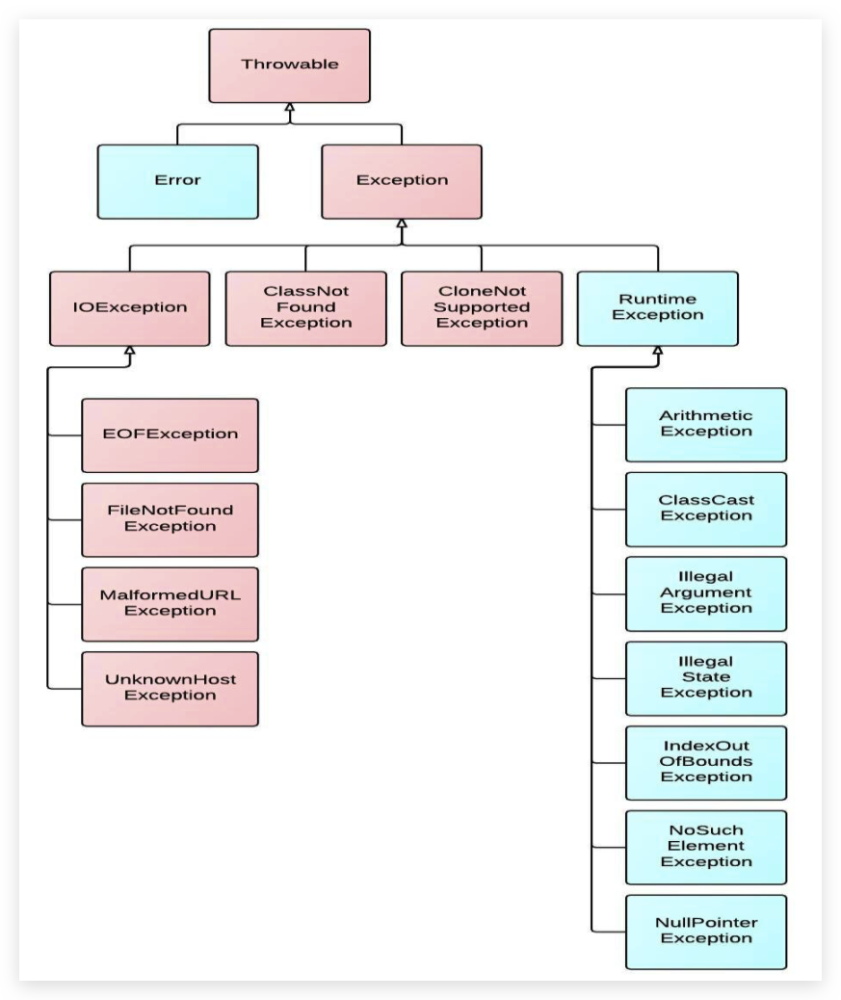

# Error & Exception

[[toc]]

- 程序执行中发生的不正常情况称为异常。

## 异常的体系

异常的根类是`java.lang.Throwable`，其下有两个子类：

- `java.lang.Error`

  **JVM 无法解决的严重问题**。如：JVM 系统内部错误、资源耗尽等严重情况。如栈 stack、堆 heap 内存耗尽**StackOverflowError（可能在递归时发生）**和**OutOfMemoryError（new 了非常多对象）**。一般不编写针对性的代码进行处理。

- `java.lang.Exception`

  其它因编程错误或偶然的外在因素导致的一般性问题，可以使用针对性的代码进行处理。

**Throwable 中的常用方法：**

- `public void printStackTrace()`打印异常的**详细信息**。

  包含了异常的类型，异常的原因 ，还包括异常出现的位置，在开发和调试阶段，都得使用 printStackTrace

- `public String getMessage()`获取发生异常的**原因**。提示**给用户**的时候,就提示错误原因。

## 异常的分类

我们平常说的异常就是指 Exception，因为这类异常一旦出现，我们就要对代码进行更正，修复程序。对于这些错误，一般有两种解决方法：一是遇到错误就终止程序 的运行。另一种方法是由程序员在编写程序时，就考虑到错误的 检测、错误消息的提示，以及错误的处理。

**捕获错误最理想的是在编译期间**，但**有的错误只有在运行时才会发生**。 比如：除数为 0，数组下标越界等。

**异常(Exception)的分类**：根据在编译时期还是运行时期去检查异常。Java 语言规范将派生于**Error**类和**RuntimeException**类的所有异常称为**非受查异常（unchecked 异常）**，其他为**受查异常（checked 异常）**

- **编译时期异常**：在编译时期就会检查，如果没有处理异常则编译失败。(IO、日期格式化异常)
- **运行时期异常**：在编译时期运行异常不会被检测，即不报错，但在运行时期检查异常。如：数学异常。**运行时发生时一定是程序的问题**，不完善，需要程序员做好**校验等**工作！




## 异常的处理

关于异常对象的产生：

- 系统自动生成的异常对象
- 手动的生成一个异常对象，并抛出（throw）

Java 提供的是异常处理的**抓抛模型**。

- 抓：可以理解为异常的处理方式：try-catch-finally 、 throws
- 抛：程序在正常执行的过程中，一旦出现异常，就会在异常代码处生成一个对应异常类的对象。该异常对象将被提交给 Java 运行时系统，这个过程称为抛出(throw)异常。一旦抛出对象以后，其后的代码就不再执行。

### 抓—捕获异常 try-catch-finally

**捕获异常**：Java 中对异常有针对性的语句进行捕获，可以对出现的异常进行指定方式的处理。

```java
try {
    //可能产生异常的代码
} catch (异常类名  变量名) {
    //异常的处理逻辑,异常异常对象之后,怎么处理异常对象
    //记录日志/打印异常信息/继续抛出异常
}
...
catch (异常类名 变量名) {

} finally {
    //一定会执行的代码
}
```

- 使用 try 将可能出现异常代码包装起来，在执行过程中，一旦出现异常，就会生成一个对应异常类的对象，根据此对象的类型，去 catch 中进行匹配。一旦 try 中的异常对象匹配到某一个 catch 时，就进入 catch 中进行异常的处理。一旦处理完成，就跳出当前的 try-catch 结构（只匹配一个。在没有写 finally 的情况）。继续执行其后的代码。

- catch 中的异常类型如果没有子父类关系，则谁声明在上，谁声明在下无所谓。也可以放入一个 catch 中。

  catch 中的异常类型如果满足子父类关系，则要求子类一定声明在父类的上面。否则，报错。

- 常用的异常对象处理的方式：

  - `String getMessage()`
  - `printStackTrace()`

* 在 try 结构中声明的变量，再出了 try 结构以后，就不能再被调用
* try-catch-finally 结构**可以嵌套**
* 多个异常使用捕获该如何处理
  - 多个异常分别处理
  - 多个异常**一次捕获，多次处理**（若捕获的异常**有子父类关系**，**父类放下面**；**没有**可以放在**一个 catch 中**）
  - 多个异常一次捕获一次处理
* **运行时异常**被抛出**可以不处理**。即不捕获也不声明抛出。

#### finally 代码块

**finally**：`try`中异常语句后的代码不被执行，**必须要执行的**可以放在`finally`中，如**释放系统资源**。但是当在`try...catch...`中**执行`System.exit(0)`**(表示**退出当前 Java 虚拟机**)，**`finally`才不会执行**

语法：`try...catch....finally`，不能单独使用

- 如果**finally 有 return 语句**，将**覆盖**原始的返回值，永远返回 finally 中的值。一般应避免该情况

  ```java
  public static int fin() {
      int a = 10;
      try {
          return a;
      } catch (Exception e) {
          System.out.println(e.getMessage());
      } finally {
          a = 40;
          return a; //最终返回40。这里若修改为return 4，最终就返回4
          // 若没有return a; 这行代码，则无论a怎么变化，还是会返回10；
      }
  }
  ```

### 抓—声明异常 throws

关键字**throws**运用于**方法声明之上**，用于**表示当前方法不处理异常**，而是**提醒**该方法的**调用者来处理异常**。

```java
修饰符 返回值类型 方法名(参数) throws 异常类名1,异常类名2…{   }
```

- 注意：

  - throws 关键字必须写在**方法声明处**，指明此方法执行时，可能会抛出的异常类型。

  - 一旦当方法体执行时，出现异常，仍会在异常代码处生成一个异常类的对象，此对象满足 throws 后异常

    类型时，就会被抛出。异常代码后续的代码，就不再执行！

  - throws 关键字后边声明的异常必须是**Exception 或者是 Exception 的子类**

  - 方法内部如果**抛出了多个异常对象**，那么 throws 后边必须也**声明多个异常**

    如果抛出的多个异常对象有**子父类关系**,那么**直接声明父类异常即可**

  - **调用**了一个声明**抛出异常的方法**,我们就必须的**处理**声明的异常

    - 要么**try-catch**自己处理异常
    - 要么继续使用**throws**声明抛出，交给方法的调用者处理，最终交给 JVM

> 开发中如何选择使用 try-catch-finally 还是使用 throws？
>
> - **如果父类中被重写的方法没有 throws 方式处理异常，则子类重写的方法也不能使用 throws**，意味着如果子类重写的方法中有异常，必须**使用 try-catch-finally 方式处理**。
> - **执行的方法 a 中，先后又调用了另外的几个方法**，这几个方法是**递进关系**执行的。我们建议这几个方法**使用 throws**的方式进行处理。而执行的方法 a 可以考虑使用 try-catch-finally 方式进行处理。（可能 try-catch 已经捕获了异常，之后的需要的数据没获取到）

### 抛—抛出异常 throw

在编写程序时，我们必须要考虑程序出现问题的情况。比如，在**定义方法**时，方法需要**接受参数**。那么，当调用方法使用接受到的参数时，首先需要**先对参数数据进行合法的判断**，数据若**不合法**，就应该**告诉调用者**，传递合法的数据进来。这时需要使用**抛出异常**的方式来告诉调用者。

- 在 java 中，提供了一个 throw 关键字，**throw 用在方法内，抛出一个指定的异常对象**

  - **创建一个异常对象**，封装一些提示信息(信息可以自己编写)。

  - 通过关键字**throw**将这个异常对象告知给调用者，并结束当前方法的执行

    ```java
    throw new 异常类名(参数);
    ```

- 注意：

  - throw 关键字必须写在**方法的内部**
  - throw 关键字后边 new 的对象必须是**Exception 或者 Exception 的子类对象**
  - throw 关键字抛出指定的异常对象,我们就必须处理这个异常对象
    - throw 关键字后边创建的是**RuntimeException**或是**其子类对象**,**可以不处理**,默认交给 JVM 处理
    - throw 关键字后边创建的是**编译异常**(写代码的时候报错),我们就**必须处理**,要么 throws,要么 try...catch

### 子父类异常注意事项

- 父类的方法**抛出或不抛出**异常，子类重写的方法抛出的异常必须**小于等于父类抛出的异常**（多态）

- 父类的方法**抛出**一个或多个**异常**，**子类**重写的方法**抛出的异常**必须**与父类相同**或是**其子类**或**不抛**

- 父类的方法**没有异常抛出**，子类重写的方法**不能有异常抛出**。若**产生异常则只能捕获处理**

## 自定义异常

- 自定义的异常类**继承`Exception`或`RuntimeException`（尽量继承这个，对代码没有侵入性）**

- 定义**空参构造**方法和**带异常信息的构造**方法

- 提供全局常量：serialVersionUID

  ```java
  public class MyException extends Exception/*RuntimeException*/ {
      static final long serialVersionUID = 1L;

      public MyException() {
      }

      public MyException(String message) {
          super(message);
      }
  }
  ```

## 习题

### 常见的异常，举例说明

- RuntimeException（unchecked）

  - NullPointerException

  - ArithmeticException

    ```java
    int a = 10;
    int b = 0;
    System.out.println(a / b);
    ```

  - ArrayIndexOutOfBoundsException

  - NumberFormatException

    ```java
    String str = "123";
    str = "abc";
    int num = Integer.parseInt(str);
    ```

  - InputMismatchException

    ```java
    Scanner scanner = new Scanner(System.in);
    int score = scanner.nextInt();
    System.out.println(score);
    scanner.close();
    ```

  - ClassCastException

    ```java
    Object obj = new Date();
    String str = (String)obj;
    ```

  - ……

- java.io.IOException

  - java.io.FileNotFoundException

- java.lang.ClassNotFoundException

- java.sql.SQLException

- java.lang.InterruptedException

### `throw`和`throws`区别

- throw：在方法体中，并且抛出一个异常对象。程序执行到 t 此时立即停止，它后面的语句都不执行。

  抛出的是**异常对象** ，说明这里**肯定有异常**产生。一般用于自定义异常，体现在选择语句中

- throws：在方法声明上，后面跟异常的类名，可以是多个，调用者处理

  **声明方法有异常**，是一种**可能性**，这个异常不一定会产生

### `final`,`finally`,`finallize`区别

- `final`：最终意思，可以修饰类、成员变量、成员方法。<a href="#final">详见此</a>
- `finally`：异常处理，用于释放资源，finally 中的代码一定会被执行，除非执行之前 jvm 退出
- `finalize`：Object 类的一个方法，用于垃圾回收

### `throw` 后代码

throw 语句后不能跟其他代码，否则永远执行不到，编译错误

```java
try {
    throw new Exception();
    System.out.println("怎么也执行不到，编译失败");
} catch (Exception e) {
    e.printStackTrace();
}
```

### 习题 1

```java
public class ReturnExceptionDemo {
    static void methodA() {
        try {
            System.out.println("进入方法A");
            throw new RuntimeException("制造异常");
        } finally {
            System.out.println("用A方法的finally");
        }
    }

    static void methodB() {
        try {
            System.out.println("进入方法B");
            return;
        } finally {
            System.out.println("调用B方法的finally");
        }
    }

    public static void main(String[] args) {
        try {
            methodA();
        } catch (Exception e) {
            System.out.println(e.getMessage());
        }
        methodB();

        // 进入方法A
        // 用A方法的finally
        // 制造异常
        // 进入方法B
        // 调用B方法的finally
    }
}
```
