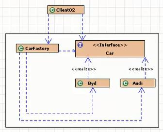
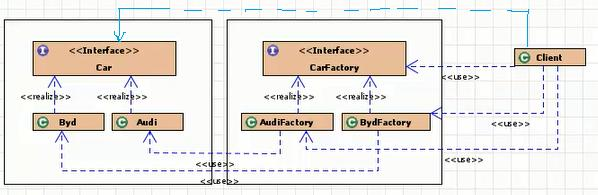

# 18 设计原则及设计模式

[[toc]]

## 设计原则

查看word

- **开**：开闭原则。一个软件实体应当对扩展开发，对修改关闭。控制需求变动风险，缩小维护成本。
- **口**：接口隔离原则。使用多个专门的接口比使用单一的总接口要好
- **合**：组合/聚合复用原则。要尽量使用合成/聚合，尽量不要使用继承
- **里**：里式替换原则。所有引用基类的地方必须可以使用其子类的对象替代
- **最**：最少知识原则（迪米特法则）。一个类应当对其他类有尽可能少的了解，两个类的访问，通过第三个中介类来实现。
- **单**：单一职责原则。把多于的职责分离出去，分别再创建一些类来完成每一个职责
- **依**：依赖倒置原则。实现类依赖接口或抽象类，面向抽象编程，减少类间的耦合性，提高系统的稳定

## 设计模式

设计模式是在大量的实践中总结和理论化之后优选的代码结构、编程风格、 以及解决问题的思考方式。有23种设计模式：

* 创建型模式（5）：抽象工厂模式、**工厂方法模式**、**单例模式**、建造者模式、原型模式。
* 结构型模式（7）：**适配器模式**、**装饰器模式**、**代理模式**、外观模式、桥接模式、组合模式、享元模式。
* 行为型模式（11）：策略模式、模板方法模式、观察者模式、迭代子模式、责任链模式、命令模式、备忘录模式、状态模式、访问者模式、中介者模式、解释器模式。


### 单例设计模式Singleton

> 学习static时遇到

确保类在一个虚拟机中**只有一个对象实例**，该实例必须**自动创建**，并且**对外提供**

- **优点**：由于单例模式只生成一个实例，**减少了系统性能开销**，当一个对象的 产生需要比较多的资源时，如读取配置、产生其他依赖对象时，则可 以通过在应用启动时直接产生一个单例对象，然后永久驻留内存的方 式来解决。

- **缺点**：没有抽象层，因此扩展很难；职责过重，在一定程序上违背了单一职责

- **实现**：

    1. 构造方法私有
    2. 在成员位置自己创建一个对象，加**私有**
    3. 通过一个公共的方法提供访问，加**静态**

    - **饿汉式**（类一加载就创建对象）（线程安全）

        ```java
        public class Student{
            private static Student s = new Student();
            private Student() {}
            public static Student getInstance() {
                return s;
            }
        }
        ```

    - **懒汉式**（用的时候才创建）（可能会出问题的单例模式）

        ```java
        //=================可能会出问题的单例模式，加 synchronized 能解决安全问题，但是效率差=================
        public class Teacher {
        
            private static Teacher t = null;
        
            private Teacher() {}
        
            public static /*synchronized*/ Teacher getInstance() {
                if (t == null) {
                    t = new Teacher();
                }
                return t;
            }
        }
        
        ```

        ```java
        //=================DCL，安全的，效率稍高的单例模式=================
        public class Singleton {
            //加volatile即可解决空指针问题（禁止编译优化，指令重排）
            private static /*volatile*/ Singleton instance;  
            
            private Singleton() {}
            
            public static Singleton getInstance() {
                if (instance == null) {
                    synchronized(Singleton.class) {
                        if (instance == null)
                            instance = new Singleton();  
                    }
                }
                return instance;
            }
        }
        ```

    - 线程安全的单例模式，还不用加锁，采用内部类

        ```java
        public class Singleton {
        
            private Singleton() {
            }
        
            private static class Inner {
                private static Singleton s = new Singleton();
            }
        
            public static Singleton getInstance() {
                return Inner.s;
            }
        
        }
        ```

    - 枚举实现

        ```java
        public enum Teacher {
        
            private static final Teacher t = new Teacher();
            
            public static Teacher getInstance(){
            	return t;
            }
        }
        ```

        

- **Runtime类（饿汉式）**每个Java应用程序都有一个Runtime类实例，使应用程序能够与其运行的环境相连

    `public Process exec(String command) throws IOException`在单独的进程中执行指定的字符串命令

    ```java
    Runtime r = Runtime.getRuntime();
    r.exec("calc");
    r.exec("notepad");
    r.exec("shutdown -s -t 10000");//10000秒后关机
    r.exec("shutdown -a");//取消关机
    ```

- 应用场景

    - **网站的计数器**，一般也是单例模式实现，否则难以同步
    - **应用程序的日志应用**，一般都使用单例模式实现，这一般是由于共享的日志文件一直处于打开状态，因为只能有一个实例去操作，否则内容不好追加
    - **数据库连接池**的设计一般也是采用单例模式，因为数据库连接是一种数据库资源
    - 项目中，**读取配置文件的类**，一般也只有一个对象。没有必要每次使用配置文件数据，都生成一个对象去读取
    - **Application** 也是单例的典型应用
    - Windows的**Task Manager** (任务管理器)就是很典型的单例模式
    - Windows的**Recycle Bin** (回收站)也是典型的单例应用。在整个系统运行过程中，回收站一直维护着仅有的一个实例


### 模板方法设计模式TemplateMethod

> 学习多态、抽象类时

- 抽象类体现的就是一种模板模式的设计，抽象类作为多个子类的通用模板，子类在抽象类的基础上进行扩展、改造，但子类总体上会保留抽象 类的行为方式。**模版方法设计模式就是定义一个算法的骨架，而将具体的算法延迟到子类中来实现** 

- 解决的问题：

    当功能内部一部分实现是确定的，一部分实现是不确定的。这时可以**把不确定的部分暴露出去，让子类去实现**。

    换句话说，在软件开发中实现一个算法时，整体步骤很固定、通用， 这些步骤已经在父类中写好了。但是某些部分易变，易变部分可以抽象出来，供不同子类实现。这就是一种模板模式。

- **优点：**在定义算法骨架的同时，可以很灵活的实现具体的算法，满足用户灵活多变的需求

- **缺点：**如果算法骨架有修改的话，则需要修改抽象类 

- 例子：计算for循环需要时间、复制一个视频需要的时间

    - 解决：
        - 定义抽象类，其中有计算耗时的非抽象方法，方法中调用一个抽象方法
        - 需要测试的代码通过实现该抽象类并重写抽象方法，但是重写后**不需要调用该方法，调用模板时自会调用**！
        - 在测试类中创建该实现类并调用计算耗时的方法

    ```JAVA
    public class TemplateTest {
        public static void main(String[] args) {
            SubTemplate t = new SubTemplate();
            t.spendTime();
        }
    }
    
    abstract class Template{
    
        //计算某段代码执行所需要花费的时间
        public void spendTime(){
            long start = System.currentTimeMillis();
            this.code();//不确定的部分、易变的部分
            long end = System.currentTimeMillis();
            System.out.println("花费的时间为：" + (end - start));
        }
        
        public abstract void code();
    }
    
    class SubTemplate extends Template{
    
        @Override
        public void code() {
            for(int i = 2;i <= 1000;i++){
                boolean isFlag = true;
                for(int j = 2;j <= Math.sqrt(i);j++){
    
                    if(i % j == 0){
                        isFlag = false;
                        break;
                    }
                }
                if(isFlag){
                    System.out.println(i);
                }
            }
        }
    }
    ```

- 模板方法设计模式是编程中经常用得到的模式。各个框架、类库中都有他的 影子，比如常见的有：

    - 数据库访问的封装
    - Junit单元测试
    - JavaWeb的Servlet中关于doGet/doPost方法调用
    - Hibernate中模板程序
    - Spring中JDBCTemlate、HibernateTemplate等


### 代理模式Proxy

> 接口的应用

* 应用场景：
    * 	安全代理：屏蔽对真实角色的直接访问。
    * 	远程代理：通过代理类处理远程方法调用(RMI)
    * 	延迟加载：先加载轻量级的代理对象，真正需要再加载真实对象
        比如你要开发一个大文档查看软件，大文档中有大的图片，有可能一个图片有 100MB，在打开文件时，不可能将所有的图片都显示出来，这样就可以使用代理模式，当需要查看图片时，用proxy来进行大图片的打开。

* 分类
    * 静态代理(静态定义代理类)
    * 动态代理(动态生成代理类）
        * JDK自带的动态代理，需要反射等知识
        * CGlib

```java
// 如下为静态代理
public class NetWorkTest {
    public static void main(String[] args) {
        Server server = new Server();
        //		server.browse();
        ProxyServer proxyServer = new ProxyServer(server);
        proxyServer.browse();
    }
}

interface NetWork{
    public void browse();
}

//被代理类
class Server implements NetWork{

    @Override
    public void browse() {
        System.out.println("真实的服务器访问网络");
    }
}
//代理类
class ProxyServer implements NetWork{
    private NetWork work;

    public ProxyServer(NetWork work){
        this.work = work;
    }

    public void check(){
        System.out.println("联网之前的检查工作");
    }

    @Override
    public void browse() {
        check();
        work.browse();
    }
}
```


### 工厂设计模式

实现了**创建者与调用者的分离**，即将创建对象的具体过程屏蔽隔离起来，达到提高灵活性的目的。

核心本质：实例化对象，用工厂方法代替 new 操作。将选择实现类、创建对象统一管理和控制。从而将调用者跟我们的实现类解耦。

> GOF 在《设计模式》一书中将工厂模式分为两类:工厂方法模式(Factory Method)与抽象工厂模式(Abstract Factory)。将简单工厂模式(Simple Factory)看为工厂方法模式的一种特例，两者归为一类。

#### 无工厂模式

```java
interface Car{ 
    void run();       
}
class Audi implements Car{
    public void run() { 
        System.out.println("奥迪在跑");               
    } 
}
class BYD implements Car{ 
    public void run() {
    System.out.println("比亚迪在跑"); 
    }                     
}
public class Client01 {
    public static void main(String[] args) { 
        Car a = new Audi();
        Car b = new BYD();
        a.run();
        b.run(); 
    }
}
```

 


#### 简单工厂模式

* 用来生产同一等级结构中的任意产品。(对于增加新的产品， 需要修改已有代码)

```java
// 汽车接口
interface Car { 
    void run();
}
// 两个实现类
class Audi implements Car {
    public void run() { 
        System.out.println("奥迪在跑");
    } 
}
class BYD implements Car { 
    public void run() {
        System.out.println("比亚迪在跑"); 
    }
}
```

```java
//工厂类
class CarFactory {
    // 方式一
    public static Car getCar(String type) {
        if ("奥迪".equals(type)) { 
            return new Audi();
        } else if ("比亚迪".equals(type)) { 
            return new BYD();
        } else {
            return null;
        } 
    }

    // 方式二
    public static Car getAudi() {
        return new Audi();
    }
    public static Car getByd() {
        return new BYD();
    }
}
```


 

调用者只要知道他要什么，从哪里拿，如何创建，不需要知道。分工，多出了一 个专门生产 Car 的实现类对象的工厂类。把调用者与创建者分离。

**简单工厂模式**也叫**静态工厂模式**，就是工厂类一般是使用静态方法，通过接收的 参数的不同来返回不同的实例对象。

缺点：对于增加新产品，不修改代码的话，是无法扩展的。**违反了开闭原则**(对扩展开放;对修改封闭)。


#### 工厂方法模式

* 为了避免简单工厂模式的缺点，不完全满足 OCP(对扩展开放，对修改关闭)。 工厂方法模式和简单工厂模式最大的不同在于，简单工厂模式只有一个(对于一 个项目或者一个独立的模块而言)工厂类，而工厂方法模式有一组实现了相同接 口的工厂类。这样在简单工厂模式里集中在工厂方法上的压力可以由工厂方法模式里不同的工厂子类来分担。
* 用来生产同一等级结构中的固定产品。(支持增加任意产品)

- **抽象工厂类负责**定义创建对象的**接口**，具体对象的创建工作由继承抽象工厂的具体类实现
- **优点**：客户端不需要负责对象的创建，从而明确了各个类的职责，如果有新的对象增加，只需要增加一个具体的类和具体的工厂类即可，不影响已有的代码，后期维护容易，增强了系统的扩展性
- **缺点**：需要额外的编写代码，增加了工作量

```java
// 汽车接口
interface Car{ 
    void run();
}

// 两个实现类
class Audi implements Car{
    public void run() { 
        System.out.println("奥迪在跑");
    } 
}
class BYD implements Car{ 
    public void run() {
        System.out.println("比亚迪在跑"); 
    }
}
```

```java
// 工厂接口 
interface Factory{
    Car getCar();
}

//两个工厂类
class AudiFactory implements Factory{
    public Audi getCar(){ 
        return new Audi();
    } 
}
class BydFactory implements Factory{ 
    public BYD getCar(){
        return new BYD(); 
    }
}
```

```java
public class Client {
    public static void main(String[] args) { 
        Car a = new AudiFactory().getCar(); 
        Car b = new BydFactory().getCar(); 
        a.run();
        b.run(); 
    }
}
```



简单工厂模式与工厂方法模式真正的避免了代码的改动了？没有。在简单工厂模式中，新产品的加入要修改工厂角色中的判断语句；而在工厂方法模式中，要么将判断逻辑留在抽象工厂角色中，要么在客户程序中将具体工厂角色写死(就像 上面的例子一样)。而且产品对象创建条件的改变必然会引起工厂角色的修改。 **面对这种情况，Java 的反射机制与配置文件的巧妙结合突破了限制——这在Spring 中完美的体现了出来。** 


#### 抽象工厂模式

* 抽象工厂模式和工厂方法模式的区别就在于需要创建对象的复杂程度上。而且 抽象工厂模式是三个里面最为抽象、最具一般性的。抽象工厂模式的用意为:给客户端提供一个接口，可以创建多个产品族中的产品对象。

    而且使用抽象工厂模式还要满足一下条件:

    * 系统中有多个产品族，而系统一次只可能消费其中一族产品。
    * 同属于同一个产品族的产品以其使用。

* 用来生产不同产品族的全部产品。(对于增加新的产品，无能为力;支持增加产品族)

* 它定义一个**具体的工厂类**负责创建一些类的实例

* 优点：客户端不需要负责对象的创建，从而明确了各个类的职责

* 缺点：这个静态工厂类负责所有对象的创建，如果有新的对象增加，或者某些对象的创建方式不同，就需要不断的修改工厂类，不利于后期的维护

```java
public abstract class Animal {
	public abstract void eat();
}
public class Dog extends Animal {
	@Override
	public void eat() {
		System.out.println("狗吃肉");
	}
}
public class AnimalFactory {
	private AnimalFactory() {};
	public static Animal creatAnimal(String type) {
		if(type.equals("dog")) {
			return new Dog();
		}
		else if(type.equals("cat")) {
			return new Cat();
		}
		return null;
	}
}
	//静态方法，类名调用
```


* * *

### 装饰设计模式

* 装饰模式就是使用被装饰类的一个子类的实例，在客户端将这个子类的实例交给装饰类。是继承的替代方案 
* 优点：使用装饰模式，可以提供比继承更灵活的扩展对象的功能，它可以动态的添加对象的功能，并且可以随意的组合这些功能 
* 缺点：正因为可以随意组合，所以就可能出现一些不合理的逻辑 
* 例子：IO流中
    * `BufferedReader br = new BufferedReader(new InputStreamReader(System.in))`

## 面试题