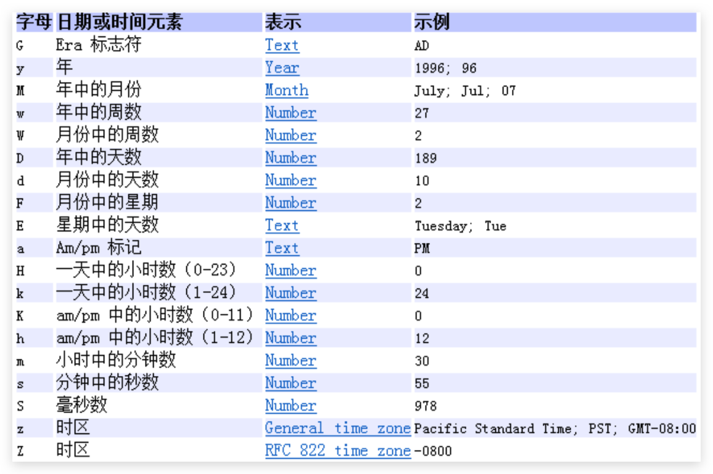

# 日期时间类（旧）

## System（java.lang）

- `long currentTimeMillis()` **获取当前时间戳的毫秒值**，东八区应加 8 个小时。测试程序效率

## Date（java.util）

- **Date**用于表示日期和时间，可以精确到**毫秒**

- **时间戳**是指格林威治时间 1970 年 01 月 01 日 00 时 00 分 00 秒起至现在的总**秒**数

- **构造方法**（只有两个没过时）

  - `Date()` 用于创建**当前**日期时间的 Date 对象
  - `Date(long date)` 用于创建**指定时间戳毫秒值**的 Date 对象，也可用时间戳/1000

- **成员方法**

  - `getTime()` 返回此对象的**时间戳的毫秒值**
  - `setTime()` 设置此对象的**时间戳的毫秒值**
  - `toString()` 把此 Date 对象转换为以下形式的 String：`dow mon dd hh:mm:ss zzz yyyy`，dow 是一周中的某一天 (Sun, Mon, Tue, Wed, Thu, Fri, Sat)，zzz 是时间标准

  ```java
  Date date = new Date();
  System.out.println(date); //Sun Oct 28 15:49:55 CST 2018，就是本地时间，这个CST是什么意思？

  long date = System.currentTimeMillis();//当前时间戳的毫秒值
  Date dd = new Date(date);
  System.out.println(dd); //Sun Oct 28 15:49:55 CST 2018
  ```

## Date（java.sql）

- 对应数据库中 date 类型，是`util.Date`的**子类**

- **构造方法**（只有一个没过时）

- `Date(long date)` 用于创建**指定时间戳毫秒值**的 Date 对象，也可用时间戳/1000

- **成员方法**

  - `getTime()` 返回此对象的**时间戳的毫秒值**
  - `setTime()` 设置此对象的**时间戳的毫秒值**
  - `toString()` 把此 Date 对象转换为以下形式的 String：`yyyy-MM-dd`

  ```java
  java.sql.Date date1 = new java.sql.Date(timeMillis);
  System.out.println(date1);//2019-10-04
  //其他方法同java.util.Date类似
  ```

- `sql.Date` —> `util.Date`

  ```java
  // 多态，直接赋值
  java.util.Date d = new java.sql.Date(timeMillis);
  ```

- `util.Date` —> `sql.Date`

  ```java
  // 通过时间戳的毫秒值间接转换
  java.sql.Date date = new java.sql.Date(new java.util.Date().getTime());
  ```

## DateFormat（java.text）

- Date 类的 API 不易于国际化，大部分被废弃了，`java.text.DateFormat`抽象类是一个不与语言环境有关的方式来格式化和解析日期的类。使用其实现类**`SimpleDateFormat` **

- 构造方法（无参构造为默认格式）

  - **指定格式构造**：`SimpleDateFormat sdf = new SimpleDateFormat(String pattern)`

  - **pattern**：指定格式，一般为 `yyyy-MM-dd HH:mm:ss`二十四小时制，详细的查看 API

    

- **格式化**`String format(Date d)`：Date--->String

  ```java
  Date date = new Date(); //Sun Oct 28 16:46:42 CST 2018
  SimpleDateFormat format = new SimpleDateFormat("yyyy年MM月dd日 HH：mm：ss");
  String s = format.format(date);
  System.out.println(s); //2018年10月28日 16：45：43
  ```

- **解析**`Date parse(String str)`：String--->Date

  该方法声明了一个异常，如果字符串和构造方法中格式不一致，程序会抛出`ParseException`

  ```java
  String s = "2018年10月28日 16：45：43";
  SimpleDateFormat format = new SimpleDateFormat("yyyy年MM月dd日 HH：mm：ss");
  Date parse = format.parse(s); //try...catch处理或throws处理
  System.out.println(parse); //Sun Oct 28 16:46:42 CST 2018
  ```

- 出生多少天

  ```java
  Scanner sc = new Scanner(System.in);
  //System.out.println("出生天数计算（不足一天按一天算）");
  //System.out.println("输入您的出生年月日（例，2000年01月01日）：");
  String birth = sc.next();
  SimpleDateFormat format = new SimpleDateFormat("yyyy年MM月dd日");
  Date date = format.parse(birth);
  long birthTime = date.getTime();
  int day = (int) Math.ceil((System.currentTimeMillis()-birthTime)/(24*60*60*1000*1.0));// 注意不足一天按一天算
  System.out.println("您出生"+day+"天了。");
  ```

## Calendar（java.util）

- 日历类，是**抽象类**。在 Date 后出现（JDK1.1），替换掉了许多 Date 的方法。该类将所有可能用到的时间信息封装为**静态成员变量**，方便获取。日历类就是方便获取各个时间属性的。

* **调用静态方法获取一个 Calendar 对象，就是 GregorianCalendar 对象**

  ```java
  Calendar calendar = Calendar.gerInstance();
  ```

* 调用它的子类`GregorianCalendar`的构造器

* 提供了如下字段等：

  - `YEAR`、`MONTH`、`DAY_OF_MONTH（DATE）`、`DAY_OF_WEEK`（周日为 1,1~7）
  - `HOUR`、`HOUR_OF_DAY`、`MINUTE`、`SECOND`

* **常用方法**(注意，**MONTH 从 0 开始**)

  - **获取指定日历字段**的**值**

    `int get(int field)`

  - 设置**指定日历字段**的**值**

    `void set(int field,int value)`

  - 设置**日历字段的值**(年月日时分秒等)

    `void set(int year,int month,int date,int hourofday,int minute,int second)`

  - 根据日历规则，为指定日历字段**加上**或**减去指定时间量**

    `void add(int field,int amount)`

  - **得到**对应的**Date 对象**

    `Date getTime()`

  - 使用给定的 `Date` 设置此 Calendar 的时间

    `void setTime(Date date)`

* 计算任意二月有多少天

  ```java
  public static int getNumOfDay(int year) {
      Calendar c = Calendar.getInstance();
      c.set(year,2,1);
      c.add(Calendar.DATE,-1);
      return c.get(Calendar.DAY_OF_MONTH);
  }
  ```

* **【面试】**

  - Date 类用来表示某个特定的瞬间，能够精确到毫秒。而在实际应用中，往往需要把一个日期中的年、月、日等信息单独返回进行显示或处理，这个类中的大部分方法都已被标记过时。Calendar 类基本取代了 Date 类，该类中定义了一系列用于完成日期和时间字段操作的方法。
    Calendar 的`getTime()`方法)返回一个表示 Calendar 时间值的 Date 对象，同时 Calendar 有一个`setTime(Date date)`方法接收一个 Date 对象，将 Date 对象表示的时间值设置给 Calendar 对象，通过这两个方法就可以完成 Date 和 Calendar 对象之间的转换。
