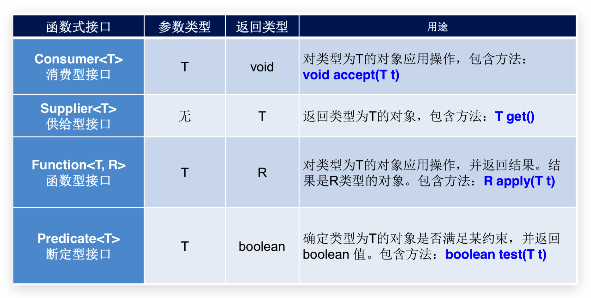
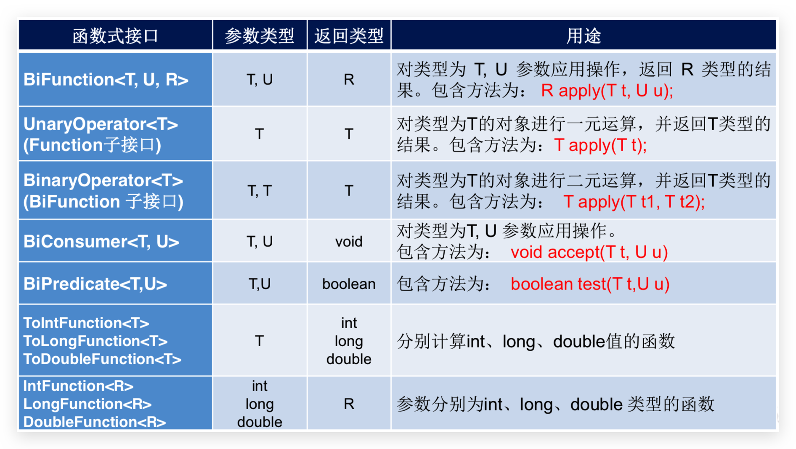

# Lambda

在数学中，函数就是有输入量、输出量的一套计算方案，也就是“拿什么东西做什么事情”。相对而言，**面向对象**过分强调“必须**通过对象的形式来做事情**”，而**函数式思想**则尽量忽略面向对象的复杂语法——**强调做什么及结果，而不是以什么形式做**。

面向对象的思想：做一件事情，找一个能解决这个事情的对象，调用对象的方法,完成事情.

函数式编程思想：只要能获取到结果，谁去做的，怎么做的都不重要，重视的是结果，不重视过程

- 冗余的 Runnable 代码分析

  - Thread 类需要 Runnable 接口作为参数，其中的抽象 run 方法是用来指定线程任务内容的核心；
  - 为了指定 run 的方法体，不得不需要 Runnable 接口的实现类；
  - 为了省去定义一个 RunnableImpl 实现类的麻烦，不得不使用匿名内部类；
  - 必须覆盖重写抽象 run 方法，所以方法名称、方法参数、方法返回值不得不再写一遍，且不能写错；
  - 而实际上，似乎只**有方法体才是关键所在**。

- 匿名内部类的好处与弊端

  - 一方面，匿名内部类可以帮我们省去实现类的定义；
  - 另一方面，匿名内部类的语法——确实太复杂了！

- 编程思想转换

  **做什么**，而不是怎么做，只要能够更好地达到目的，过程与形式其实并不重要。2014 年 3 月 Oracle 所发布的 Java 8 中，加入了 Lambda 表达式的重量级新特性，为我们打开了新世界的大门。

## 函数式接口

函数式接口在 Java 中是指：**有且仅有一个抽象方法的接口**。可以适用于 Lambda 使用的接口，只有确保接口为函数式接口，Java 中的 Lambda 才能顺利地进行**推导**。

> 备注：“语法糖”是指使用更加方便，但是原理不变的代码语法。例如在遍历集合时使用的 for-each 语法，其实底层的实现原理仍然是迭代器，这便是“语法糖”。从应用层面来讲，Java 中的 Lambda 可以被当做是匿名内部类的“语法糖”，但是二者在原理上是不同的。

**格式**

```java
修饰符 interface 接口名称 {
    /*public abstract*/ 返回值类型 方法名称(可选参数信息);
    // 其他非抽象方法内容，默认方法，静态方法，私有方法
}
```

`@FunctionalInterface`注解

Java 8 中专门为函数式接口引入的注解，可用于一个接口的定义上。一旦使用该注解来定义接口，**编译器将会强制检查**该接口是否确实有且仅有一个抽象方法，否则将会报错。不使用该注解也可以定义函数式接口。

## 函数式编程

- Lambda 表达式的标准格式为

  ```java
  (参数类型 参数名称) ‐> { 代码语句 }
  ```

  - 小括号内的语法与传统方法**参数列表一致**：无参数则留空；多个参数则用逗号分隔。
  - `->` 是新引入的语法格式，代表**指向动作**。
  - 大括号内的语法与传统**方法体**要求基本一致。

- 无参数返回值

  ```java
  new Thread( () ‐>  System.out.println("多线程任务执行！")).start());
  ```

- 有参数和返回值

  ```java
  Arrays.sort(students,(s1, s2)->{ //参数类型可以从students推导出，so可以省略
      return s1.getAge()-s2.getAge();
  });
  ```

  ```java
  Collections.sort(students, (o1, o2) -> o1.getAge()-o2.getAge()); //{}内只有一行表达式，可以省略{}和return
  ```

  ```java
  Arrays.sort(students, Comparator.comparingInt(Student::getAge)); //更简洁的写法,但{}中语句多时不能简写
  ```

- **可推导可省略**：Lambda 强调的是“做什么”而不是“怎么做”，凡可以根据上下文推导得知的信息，都可以省略。

  - **小括号内参数的类型**可以省略
  - 如果**小括号内有且仅有一个参**，则**小括号可以省略**
  - 如果**大括号内有且仅有一个语句**，则无论是否有返回值，都可以省略大括号、return 关键字及语句分号。

- Lambda 的语法非常简洁，完全没有面向对象复杂的束缚。但是使用时有几个问题需要特别注意：

  - 使用 Lambda 必须具有**函数式接口**，其本质就是一个**函数式接口的实例**

    无论是 JDK 内置的 Runnable 、 Comparator 接口还是自定义的接口，只有当接口中的抽象方法存在且唯一时，才可以使用 Lambda。

  - 使用 Lambda 必须**具有上下文类型推断**

    方法的参数或局部变量类型必须为**Lambda 对应的接口类型**，才能使用 Lambda 作为该接口的实例。

  - 若 Lambda 表达式抛出一个受检异常（即非运行时异常），那么该异常需要在目标接口的抽象方法上进行声明

## Lambda 的延迟执行

有些场景的代码执行后，结果不一定会被使用，从而造成性能浪费。而 Lambda 表达式是延迟执行的，这正好可以 作为解决方案，提升性能。

### 性能浪费的日志案例

```java
public static void main(String[] args) throws FileNotFoundException {
    String a = "hello";
    String b = "world";
    log(1,a+b);
}
public static void log(int level,String msg) {
    if (level==1) {
        System.out.println(msg);
    }
}
```

> 无论级别是否满足要求，作为`log` 方法的第二个参数，三个字符串一定会首先被拼接并传入方法内，然后才会进行级别判断。如果级别不符合要求，那么字符串的拼接操作就白做了，存在**性能浪费**。
>
> 备注：**SLF4J**是应用非常广泛的日志框架，它在记录日志时为了解决这种性能浪费的问题，并不推荐首先进行字符串的拼接，而是**将字符串的若干部分作为可变参数传入方法中**，仅在日志级别**满足要求**的情况下**才会进行字符串拼接**。例如： LOGGER.debug("变量{}的取值为{}。", "os", "macOS") ，其中的大括号 {} 为占位符。如果满足日志级别要求，则会将“os”和“macOS”两个字符串依次拼接到大括号的位置；否则不会进行字 符串拼接。这也是一种可行解决方案，但 Lambda 可以做到更好

### 体验 Lambda 的更优写法

函数式接口

```java
@FunctionalInterface
public interface MessageBuilder {
    String buildMessage();
}
```

然后对 `log` 方法进行改造

```java
public static void main(String[] args) throws FileNotFoundException {
    String a = "hello";
    String b = "world";
    log(1, () -> a + b );
}
public static void log(int level,MessageBuilder mb) {
    if (level==1) {
        System.out.println(mb.buildMessage());
    }
}
```

> 只有当级别满足要求的时候，才会进行三个字符串的拼接；否则三个字符串将不会进行拼接。
>
> 证明：只需在 lambda 大括号中打印一个语句，并让`log`方法传递的参数改为 2，发现打印语句不执行

## 常用的函数式接口

JDK 提供了大量常用的函数式接口以丰富 Lambda 的典型使用场景，它们主要在**`java.util.function`**中提供。

`java.lang.Runnable`、`java.util.Comparator`不再上述包中，但也是函数式接口

> 如下函数式接口强调的是状态的改变！不在乎具体实现细节！具体实现交给 Lambda 来完成！

Java 内置四大核心函数式接口



其他接口



### Supplier—生产型接口

`java.util.function.Supplier<T>`用来**获取一个泛型参数指定类型的对象数据**。由于这是一个函数式接口，这也就意味着对应的 Lambda 表达式**需要“对外提供”一个符合泛型类型**的对象数据。这个接口也称为**生产型接口**。

- 抽象方法 `T get()`

  ```java
  //求数组元素最大值
  public static void main(String[] args) {
    int[] arr = {1, 22, 55, 333, 66};
    int m = getMax(arr,() -> {
      int max = arr[0];
      for (int i = 1; i < arr.length; i++) {
        if (arr[i] > max)
          max = arr[i];
      }
      return max;
    });
    System.out.println(m);
  }

  public static int getMax(int[] arr,Supplier<Integer> supplier) {
    return supplier.get();
  }
  ```

### Consumer—消费型接口

`java.util.function.Consumer<T>`接口则正好与`Supplier`接口相反，它不是生产一个数据。**消费型接口**。

- 抽象方法`void accept(T t)`

  > 意为**消费一个指定泛型的数据**。

  ```java
  public static void main(String[] args) {
      String msg = "牛逼";
      consumeString(msg,s ‐> {
          //怎么处里消费随意
      }
  }

  public static void consumeString(String msg, Consumer<String> consumer) {
      consumer.accept(msg);
  }
  ```

- 默认方法`default Consumer<T> andThen(Consumer<T> c)`

  > 如果一个方法的参数和返回值全都是 Consumer 类型，那么就可以实现效果：**消费数据的时候，首先做一个操作， 然后再做一个操作，实现组合，哪个写前面则先消费**。返回值是本身，可以用链式编程，三个、四个操作都行。这个方法就是 Consumer 接口中的 default 方法 andThen 。

  ```java
  public static void main(String[] args) {
      /**
       * 下面的字符串数组当中存有多条信息，请按照格式“ 姓名：XX；性别：XX。 ”的格式将信息打印出来。
       * 要求将打印姓名的动作作为第一个Consumer接口的Lambda实例，将打印性别的动作作为第二个Consumer接口的Lambda实例，
       */
      String[] arr = {"迪丽热巴,女", "古力娜扎,女", "马尔扎哈,男"};
      consumerString(arr,
                     s -> System.out.print("姓名：" + s.split(",")[0] + "；"),
                     s -> System.out.println("性别：" + s.split(",")[1] + "。")
      );

  }

  public static void consumerString(String[] msg, Consumer<String> consumer1, Consumer<String> consumer2) {
      for (String s : msg) {
          consumer1.andThen(consumer2).accept(s);
      }
  }
  ```

### Predicate—判断

有时候我们需要**对某种类型的数据进行判断**，从而得到一个 boolean 值结果。这时可以使用 `java.util.function.Predicate<T>`接口。

- 抽象方法： `boolean test(T t)`

  ```java
  //判断字符串长度是否大于3
  public static void main(String[] args) {
      String msg = "hello";
      boolean b = panduan(msg, s -> s.length() > 3);
      System.out.println(b);

  }
  public static boolean panduan(String s, Predicate<String> predicate){
      return predicate.test(s);
  }
  ```

- 默认方法：`Predicate<T> and(Predicate<? super T> other)` ，与

- 默认方法：`Predicate<T> or(Predicate<? super T> other)` ，或

- 默认方法：`Predicate<T> negate()` ，非

- 静态方法：`static <T> Predicate<T> isEqual(Object targetRef)`，相等，根据`Objects.equals(O,O)`

  ```java
  System.out.println(Predicate.isEqual("test").test("test"));//true，返回Predicate实例，之后也可以用其他方法
  ```

  ```java
  public static void main(String[] args) {
      String msg = "hello";
      boolean b = panduan(msg,s -> s.length() > 3,s -> s.contains("w"));
      System.out.println(b);

  }
  public static boolean panduan(String s, Predicate<String> p1,Predicate<String> p2){
      return p1.and(p2).test(s); //and
      //return p1.or(p2).test(s); //or
      //return p1.negate().and(p2).test(s); //negate
  }
  ```

  ```java
  public static void main(String[] args) {
      /**
           * 数组当中有多条“姓名+性别”的信息如下，请通过 Predicate 接口的拼装将符合要求的字符串筛选到集合 ArrayList 中
           * 需要同时满足两个条件：1. 必须为女生； 2. 姓名为4个字。
           */
      String[] array = {"迪丽热巴,女", "古力娜扎,女", "马尔扎哈,男", "赵丽颖,女"};
      ArrayList<String> list = toList(array,
                                      s -> s.split(",")[0].length() == 4,
                                      s -> "女".equals(s.split(",")[1])
      );
      System.out.println(list);
  }

  public static ArrayList<String> toList(String[] arr, Predicate<String> p1, Predicate<String> p2) {
      ArrayList<String> list = new ArrayList<>();
      for (String s : arr) {
          if (p1.and(p2).test(s))
              list.add(s);
      }
      return list;
  }
  ```

### Function

`java.util.function.Function<T,R>` 接口用来**根据一个类型的数据得到另一个类型的数据**，前者称为前置条件， 后者称为后置条件。

- 抽象方法： `R apply(T t)`：根据类型 T 的参数获取类型 R 的结果。如`String`转`Integer`

- 默认方法：`Function<T,V> andThen(Function<? super R,? extends V> after)`，用来**组合操作**

  ```java
  public static void main(String[] args) {
      /**
           * 第一个操作是将字符串解析成为int数字，
           * 第二个操作是乘以10并转为字符串。两个操作通过 andThen 按照前后顺序组合到了一 起。
           */
      String msg = "1234";
      String string = change(msg, s -> Integer.valueOf(s), s -> (s * 10)+"" /*或String.valueOf()*/);
      System.out.println(string);
  }

  public static String change(String msg, Function<String, Integer> f1, Function<Integer, String> f2) {
      return f1.andThen(f2).apply(msg);
  }
  ```

  ```java
  public static void main(String[] args) {
      String str = "赵丽颖,20";
      //1. 将字符串截取数字年龄部分，得到字符串；
      //2. 将上一步的字符串转换成为int类型的数字；
      //3. 将上一步的int数字累加100，得到结果int数字
      int change = change(str,
                          s -> s.split(",")[1],
                          s -> Integer.parseInt(s),
                          i -> i + 100
      );
      System.out.println(change);
  }

  public static int change(String s, Function<String, String> f1,
                           Function<String, Integer> f2, Function<Integer, Integer> f3) {
      return f1.andThen(f2).andThen(f3).apply(s);
  }
  ```

## 方法引用

> 在使用 Lambda 表达式的时候，我们实际上传递进去的代码就是一种解决方案：拿什么参数做什么操作。那么考虑 一种情况：如果我们在 Lambda 中所指定的操作方案，已经有地方存在相同方案，那是否还有必要再写重复逻辑？

### 引用符::

**双冒号`::` 为引用运算符**，而它所在的**表达式被称为方法引用**。如果 Lambda 要表达的**函数方案（方法体）已经存在于某个方法的实现中（出入参一致仅代表对象::非静态方法和类名::静态方法）**，那么则可以通过双冒号来引用该方法作为 Lambda 的替代者。

**语义分析**

`System.out`对象中有一个重载的 `println(String)` 方法恰好就是我们所需要的。那么对于 `printString` 方法的函数式接口参数，对比下面两种写法，完全等效：

- Lambda 表达式写法： `s -> System.out.println(s);`
- 方法引用写法： `System.out::println`

第一种语义是指：拿到参数之后经 Lambda 之手，继而传递给 `System.out.println` 方法去处理。

第二种等效写法的语义是指：直接让 `System.out` 中的 `println` 方法来取代 Lambda

> 注：Lambda 中传递的参数 一定是方法引用中的那个方法可以接收的类型，否则会抛出异常

**推导与省略**

如果使用 Lambda，那么根据“可推导就是可省略”的原则，**无需指定参数类型**，**也无需指定的重载形式**——它们都将被自动推导。而如果使用方法引用，也是同样可以根据上下文进行推导。

函数式接口是 Lambda 的基础，而方法引用是 Lambda 的孪生兄弟。

### 对象::非静态方法

与上例相同。对象已经存在，方法也存在，可以使用`对象名::方法名`替代 lambda

```java
//Consumer中的void accept(T t)
//PrintStream中的void println(T t)
@Test
public void test1() {
  Consumer<String> con1 = str -> System.out.println(str);
  con1.accept("北京");

  System.out.println("*******************");
  PrintStream ps = System.out;
  Consumer<String> con2 = ps::println;
  con2.accept("beijing");
}

//Supplier中的T get()
//Employee中的String getName()
@Test
public void test2() {
  Employee emp = new Employee(1001,"Tom",23,5600);

  Supplier<String> sup1 = () -> emp.getName();
  System.out.println(sup1.get());

  System.out.println("*******************");
  Supplier<String> sup2 = emp::getName;
  System.out.println(sup2.get());
}
```

### 类名::静态方法

类已经存在，静态方法也存在，可以使用`类名::静态方法`替代 lambda

```java
public interface Calcable {
    int calc(int num);
}
// -------------------------------
public static void main(String[] args) {
    method(‐10, Math::abs);
}
private static void method(int num, Calcable lambda) {
    System.out.println(lambda.calc(num));
}
```

```java
//Comparator中的int compare(T t1,T t2)
//Integer中的int compare(T t1,T t2)
@Test
public void test3() {
  Comparator<Integer> com1 = (t1,t2) -> Integer.compare(t1,t2);
  System.out.println(com1.compare(12,21));

  System.out.println("*******************");

  Comparator<Integer> com2 = Integer::compare;
  System.out.println(com2.compare(12,3));

}

//Function中的R apply(T t)
//Math中的Long round(Double d)
@Test
public void test4() {
  Function<Double,Long> func = new Function<Double, Long>() {
    @Override
    public Long apply(Double d) {
      return Math.round(d);
    }
  };

  System.out.println("*******************");

  Function<Double,Long> func1 = d -> Math.round(d);
  System.out.println(func1.apply(12.3));

  System.out.println("*******************");

  Function<Double,Long> func2 = Math::round;
  System.out.println(func2.apply(12.6));
}
```

### 类名::非静态方法

当函数式接口方法的第一个参数是需要引用方法的调用者，并且第二个参数是需要引用方法的参数（或无参数）时，可以使用`类名::非静态方法`替代 lambda

### 通过 super 引用成员方法

如果存在继承关系，当 Lambda 中需要出现 super 调用时，也可以使用方法引用进行替代。

```java
@FunctionalInterface
public interface Greetable {
    void greet();
}
```

```java
public class Human {
    public void sayHello() {
        System.out.println("Hello!");
    }
}
```

```java
public class Man extends Human {
    @Override
    public void sayHello() {
        System.out.println("大家好,我是Man!");
    }
    //定义方法method,参数传递Greetable接口
    public void method(Greetable g){
        g.greet();
    }
    public void show(){ //在main中调用此方法时，会打印Hello！
        //method(()‐>super.sayHello());
        method(super::sayHello);
    }
}
```

### 通过 this 引用成员方法

this 代表当前对象，如果需要引用的方法就是当前类中的成员方法，那么可以使用`this::成员方法`的格式来使用方法引用

```java
@FunctionalInterface
public interface Richable {
    void buy();
}
```

```java
public class Husband {
    private void buyHouse() {
        System.out.println("买套房子");
    }
    private void marry(Richable lambda) {
        lambda.buy();
    }
    public void beHappy() { //main中调用此方法，会打印 买套房子
        //marry(() ‐> this.buyHouse());
        marry(this::buyHouse);
    }
}
```

## 构造器引用

和方法引用类似，函数式接口的抽象方法的形参列表和构造器的形参列表一致，抽象方法的返回值类型即为构造器所属的类的类型。由于构造器的名称与类名完全一样，并不固定。所以构造器引用使用`类名称::new` 的格式表示

```java
public class Person {
    private String name;
    ...
}
// ------------------
@FunctionalInterface
public interface PersonBuilder {
    Person buildPerson(String name);
}
// ------------------
public class Demo {
    public static void printName(String name, PersonBuilder builder) {
        System.out.println(builder.buildPerson(name).getName());
    }
    public static void main(String[] args) {
        //printName("赵丽颖", name ‐> new Person(name));
        printName("赵丽颖", Person::new);
    }
}
```

```java
//Supplier中的T get()
//Employee的空参构造器：Employee()
@Test
public void test1(){

  Supplier<Employee> sup = new Supplier<Employee>() {
    @Override
    public Employee get() {
      return new Employee();
    }
  };
  System.out.println("*******************");

  Supplier<Employee>  sup1 = () -> new Employee();
  System.out.println(sup1.get());

  System.out.println("*******************");

  Supplier<Employee>  sup2 = Employee :: new;
  System.out.println(sup2.get());
}

//Function中的R apply(T t)
@Test
public void test2(){
  Function<Integer,Employee> func1 = id -> new Employee(id);
  Employee employee = func1.apply(1001);
  System.out.println(employee);

  System.out.println("*******************");

  Function<Integer,Employee> func2 = Employee :: new;
  Employee employee1 = func2.apply(1002);
  System.out.println(employee1);

}

//BiFunction中的R apply(T t,U u)
@Test
public void test3(){
  BiFunction<Integer,String,Employee> func1 = (id,name) -> new Employee(id,name);
  System.out.println(func1.apply(1001,"Tom"));

  System.out.println("*******************");

  BiFunction<Integer,String,Employee> func2 = Employee :: new;
  System.out.println(func2.apply(1002,"Tom"));

}
```

## 数组的构造器引用

数组也是`Object` 的子类对象，所以同样**具有构造器**，只是语法稍有不同

```java
@FunctionalInterface
public interface ArrayBuilder {
    int[] buildArray(int length);
}
public class Demo {
    private static int[] initArray(int length, ArrayBuilder builder) {
        return builder.buildArray(length);
    }
    public static void main(String[] args) {
        //int[] array = initArray(10, length ‐> new int[length]);
        int[] array = initArray(10, int[]::new);
    }
}
```

```java
//Function中的R apply(T t)
@Test
public void test4(){
  Function<Integer,String[]> func1 = length -> new String[length];
  String[] arr1 = func1.apply(5);
  System.out.println(Arrays.toString(arr1));

  System.out.println("*******************");

  Function<Integer,String[]> func2 = String[] :: new;
  String[] arr2 = func2.apply(10);
  System.out.println(Arrays.toString(arr2));

}
```

## 习题

**Lambda 接口在 Java 中只能用于方法的参数！！！**

### Comparator 使用 🔥

使用 Collections.sort() 方法, 推荐直接使用 Stream，通过定制排序比较两个 Employee (先按年龄比，年龄相同按姓名比), 使用 Lambda 表达式作为参数传递。

```java
@Data
@NoArgsConstructor
@AllArgsConstructor
public class Employee {

	private int id;
	private String name;
	private int age;
	private double salary;

}
```

```java
public class LambdaTest {

    List<Employee> emps = Arrays.asList(
        new Employee(101, "张三", 18, 9999.99),
        new Employee(102, "李四", 59, 6666.66),
        new Employee(103, "王五", 18, 3333.33),
        new Employee(104, "赵六", 8, 7777.77),
        new Employee(105, "田七", 18, 5555.55)
    );

    @Test
    public void test1() {
        emps.stream().sorted((e1, e2) -> {
            if (e1.getAge() != e2.getAge()) {
                return Integer.compare(e1.getAge(), e2.getAge());
            } else {
                return e1.getName().compareTo(e2.getName());
            }
        }).forEach(System.out::println);

        /*Collections.sort(emps, (e1, e2) -> {
            if (e1.getAge() != e2.getAge()) {
                return Integer.compare(e1.getAge(), e2.getAge());
            } else {
                return e1.getName().compareTo(e2.getName());
            }
        });*/

        // Collections.sort 会提示直接使用如下方式
        /*emps.sort((e1, e2) -> {
            if (e1.getAge() != e2.getAge()) {
                return Integer.compare(e1.getAge(), e2.getAge());
            } else {
                return e1.getName().compareTo(e2.getName());
            }
        });*/
    }
}
```

### 函数式接口 1 🔥

1.  声明函数式接口，接口中声明抽象方法：`String getValue(String str);`
2.  声明类 LambdaTest，类中**编写方法**使用接口作为参数，将一个字符串转换成大写，并作为方法的返回值。
3.  再将一个字符串的第 2 个到第 4 个索引位置进行截取子串。

```java
@FunctionalInterface
public interface MyFunctional1 {
    String getValue(String str);
}
```

```java
@Test
public void test2(){
    String s = "abcdEfg";

    String s1 = strHandler(s, String::toUpperCase);
    System.out.println(s1);

    String s2 = strHandler(s, str -> str.substring(2, 5));
    System.out.println(s2);
}

/**
 * 用于处理字符串
 */
private String strHandler(String str, MyFunctional1 func){
    return func.getValue(str);
}
```

### 函数式接口 2 🔥

1.  声明一个带两个**泛型的函数式接口**，泛型类型为<T,R> : T 为参数，R 为返回值
2.  接口中声明对应抽象方法
3.  在 LambdaTest 类中**声明方法**，使用接口作为参数，计算两个 long 型参数的和
4.  再计算两个 long 型参数的乘积

```java
@FunctionalInterface
public interface MyFunctional2<T, R> {
    R calc(T t1, T t2);
}
```

```java
@Test
void test3() {
    long l = calcSum(2, 3, Long::sum);
    System.out.println(l);

    long ll = calcSum(2, 3, (l1, l2) -> l1 * l2);
    System.out.println(ll);
}

/**
 * 用于处理两个long数的计算
 */
private long calcSum(long l1, long l2, MyFunctional2<Long,Long> func){
    return func.calc(l1, l2);
}
```

### Pedicate 接口使用 🔥

```java
Integer[] arr = {-12345, 9999, 520, 0, -38, -7758520, 941213};

Predicate<Integer> p1 = i -> i >= 0; //使用lambda表达式创建Predicate对象p1,p1能判断整数是否是自然数
Predicate<Integer> p2 = i -> Math.abs(i) > 100; //使用lambda表达式创建Predicate对象p2,p2能判断整数的绝对值是否大于100
Predicate<Integer> p3 = i -> i % 2 == 0; //使用lambda表达式创建Predicate对象p3,p3能判断整数是否是偶数

int count1 = 0;
int count2 = 0;
int count3 = 0;
int count4 = 0;
for (Integer i : arr) {
    if (p1.test(i))
        count1++;
    if (p1.negate().test(i))
        count2++;
    if (p2.and(p3).test(i))
        count3++;
    if (p1.negate().or(p3).test(i))
        count4++;
}
System.out.println("自然数个数:"+count1);
System.out.println("负整数个数:"+count2);
System.out.println("绝对值大于100的偶数的个数:"+count3);
System.out.println("负整数或偶数的数的个数:"+count4);
```

### Function 接口使用 🔥

```java
/**
         * 1.	使用lambda表达式分别将以下功能封装到Function对象中
         * a)	求Integer类型ArrayList中所有元素的平均数
         * b)	将Map<String,Integer>中value存到ArrayList<Integer>中
         */
Function<ArrayList<Integer>, Integer> avg = list -> {
    int sum = 0;
    for (Integer i : list) {
        sum += i;
    }
    return sum / list.size();
};

Function<Map<String, Integer>, ArrayList<Integer>> change = map -> {
    ArrayList<Integer> list = new ArrayList<>();
    map.entrySet().stream().forEach(s -> list.add(s.getValue()));//或用values，addAll
    return list;
};

HashMap<String, Integer> students = new HashMap<>();
students.put("岑小村", 59);
students.put("谷天洛", 82);
students.put("渣渣辉", 98);
students.put("蓝小月", 65);
students.put("皮几万", 70);

int avg_score = change.andThen(avg).apply(students);
System.out.println(avg_score);
```
