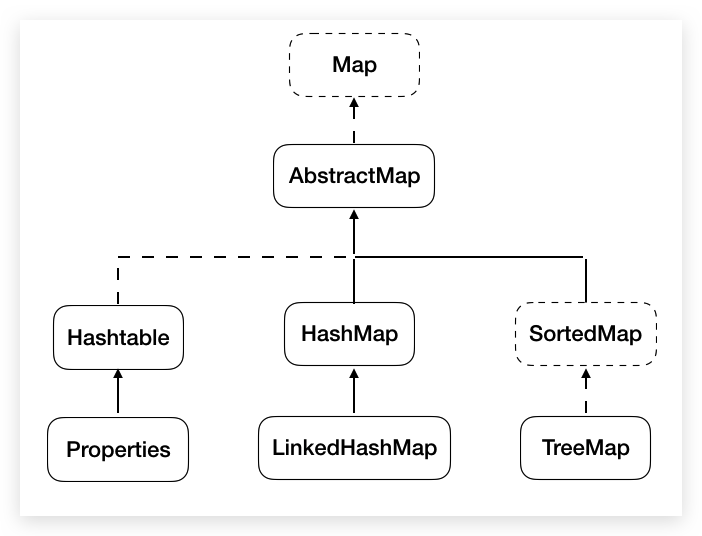
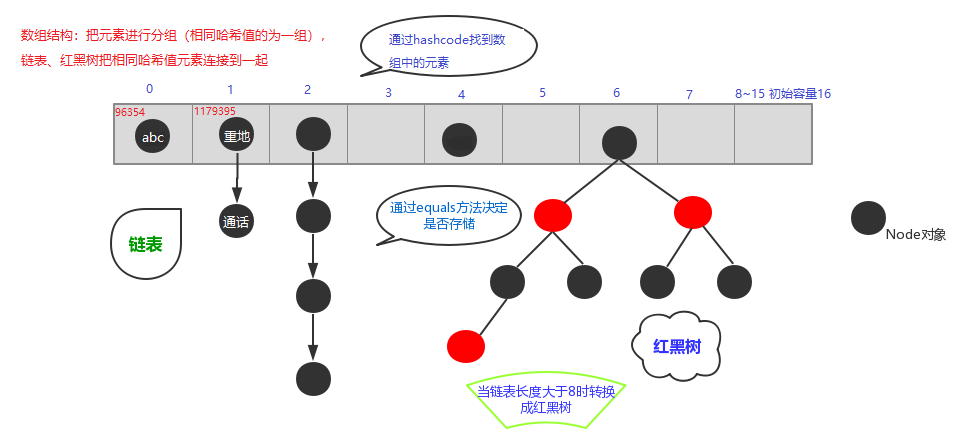

# Map



- **键值对**。类似函数：一个映射不能包含重复的键，每个键最多只能映射到一个值（**键唯一，值可重复**），其实现类都重写了`toString()`方法

- Map 中的**结构**：

  - key：无序、不可重复，使用 Set 存储。需重写 `equals()` 、`HahsCode()`（根据是否是 Hash 存储）
  - value：无序、可重复，使用 Collection 存储。需重写 `equals()`
  - Entry：一个 key-value 对构成了一个 Entry 对象，使用 Set 存储

- 带有`Hash*`存储自定义的对象时**必须重写**`hashCode()`和`equal()`方法，且重写的俩方法尽可能保持**一致性**（即相等的对象必须有相同的 hashCode ，不相等亦如此）

- **常用方法**

  - **添加、修改**

    - `V put(K key,V value)`

      如果键是第一次存储，就直接存储元素，**返回以前的值**null

      如果键不是第一次存储，就替换掉以前的值，并**返回以前的值**

    - `void putAll(Map<? extends K, ? extends V> m)`：每个元素单独 put

  - **删除**

    - `void clear()` 删除所有映射关系
    - `V remove(Object key`) 根据键删除键值对元素，key 为空返回 null，否则返回值

  - **获取**

    - `V get(Object key)` 根据键获取值
    - `Set<K> keySet()` 返回所有键的集合
    - `Collection<V> values()` 返回所有值的集合
    - `Set<Map.Entry<K,V>> entrySet()` 返回映射关系的 Set 集合

  - **判断**

    - `boolean isEmpty()` 是否为空
    - `boolean containsKey(Object key)` 是否包**含指定键值**
    - `boolean containsValue(Object value)` 是否**包含指定值**

  - **容量**

    - `int size()` 返回映射中键值对的对数

- **遍历方法**

  - **JDK1.8 及以后推荐使用`Stream`的`foreach()`方法，lambda 表达式**

  - **键值对（`entrySet()`/`getKey()`/`getValue()`）**，获取存储键值对对象的 Set 结合。推荐此方法。

    Map 集合一创建，就会在 Map 集合中创建一个 Entry 对象，用来记录键值对对象（`Map.Entry<K,V>`)

    ```java
    Set<Map.Entry<String, String>> set = hm.entrySet();
    for(Map.Entry<String, String> entry:set) {
    	System.out.println(entry);//1=hello
    	System.out.println(entry.getKey()+"---"+entry.getValue());//1---hello
    }
    ```

    - **键找值（`keySet()`/`get()`）**

      ```java
      Set<String> set = hm.keySet();
      for(String key:set) {
      	System.out.println(key+"---"+hm.get(key));
      }
      //或
      Iterator<String> it = set.iterator();
      while(it.hasNext()) {
      	String key  = it.next();
      	String value = hm.get(key);
      	System.out.println(key+"---"+value);
      }
      ```

    - **`values()`方法，存储 Map 中值的 Collection 集合**

      ```java
      Collection<String> values = hm.values();
      for(String value:values){
          System.out.println(value);
      }
      ```

## HashMap

- 底层数据结构是**哈希表（元素为链表或红黑树的数组）**，查询快。**根据`hashCode`决定元素的存放位置**，但**迭代出的元素顺序和存入顺序不一定一致**，底层存储**不稳定**（hash 重排）。

- HashMap 源码中的重要常量

  - `DEFAULT_INITIAL_CAPACITY` : HashMap 的默认容量，16
  - `MAXIMUM_CAPACITY` : HashMap 的最大支持容量，2^30
  - `DEFAULT_LOAD_FACTOR`:HashMap 的默认加载因子，0.75
  - `TREEIFY_THRESHOLD`:Bucket 中链表长度大于该默认值，转化为红黑树
  - `UNTREEIFY_THRESHOLD`:Bucket 中红黑树存储的 Node 小于该默认值，转化为链表
  - `MIN_TREEIFY_CAPACITY`:桶中的 Node 被树化时最小的 hash 表容量，64。（当桶中 Node 的数量大到需要变红黑树时，若 hash 表容量小于`MIN_TREEIFY_CAPACITY`时，此时应执行 resize 扩容操作这个`MIN_TREEIFY_CAPACITY`的值至少是`TREEIFY_THRESHOLD`的 4 倍）
  - `table`:存储元素的数组，总是 2 的 n 次幂
  - `entrySet`:存储具体元素的集
  - `size`:HashMap 中存储的键值对的数量
  - `modCount`:HashMap 扩容和结构改变的次数。
  - `threshold`:扩容的临界值，容量\*填充因子
  - `loadFactor`:填充因子

- **底层实现原理**（JDK7）：

  - `HashMap`的内部存储结构其实是**数组和链表**的结合。当实例化一个`HashMap`时， 系统会创建一个长度为`Capacity`的`Entry`数组，这个长度在哈希表中被称为容量 (Capacity)，在这个数组中可以存放元素的位置我们称之为“**桶**”（`bucket`），每个`bucket`都有自己的索引，系统可以根据索引快速的查找`bucket`中的元素。

    每个`bucket`中存储一个元素，即一个`Entry`对象，但每一个`Entry`对象可以带一个引用变量，用于指向下一个元素，因此，在一个桶中，就有可能生成一个`Entry`链。 而且新添加的元素作为链表的`head`。

    `HashMap map = new HashMap([int initialCapacity])`在实例化以后，底层创建了**长度是`initialCapacity`（默认 16）**的一维数组`Entry[] table`

  - 可能已经执行过多次`put(.)`，`map.put(key1,value1)`。首先，调用`key1`所在类的`hashCode()`和其他算法计算其 `hash`，此`hash`经过某种算法计算以后（位运算方式取模），得到在`Entry[]`中的存放位置。

    - 如果此位置上的数据为空，此时的 key1-value1 即 Entry 添加成功。 ——情况 1
    - 如果此位置上的数据不为空（意味着此位置上存在一个或多个数据（以链表形式存在）），比较 key1 和已经存在的一个或多个数据的`hash`：
      - 如果 key1 的`hash`与已经存在的数据的`hash`都不相同，此时 key1-value1 添加成功。——情况 2
      - 如果 key1 的`hash`和已经存在的某一个数据(key2-value2)的`hash`相同，继续比较：调用 key1 所在类的`equals(key2)`方法，比较：
        - 如果`equals()`返回`false`：此时 key1-value1 添加成功。——情况 3
        - 如果`equals()`返回`true`：使用**value1 替换 value2**。

  - 关于情况 2 和情况 3：此时 key1-value1 和原来的数据以链表的方式存储。

  - 当`HashMap`中的元素越来越多的时候，`hash`冲突的几率也就越来越高，因为数组的长度是固定的。所以为了提高查询的效率，就要对`HashMap`的数组进行扩容，而在`HashMap`数组扩容之后，最消耗性能的点就出现了：**原数组中的数据必须重新计算其在新数组中的位置**，并放进去，这就是`resize`。在超出临界值（**使用率大于等于 0.75，且要存放的位置非空**）时进行扩容。默认的扩容方式：扩容为原来容量的**2 倍**，并将原有的数据复制过来。所以如果我们已经预知`HashMap`中元素的个数， 那么预设元素的个数能够有效的提高`HashMap`的性能。

- JDK8 相较于 JDK7 在底层实现方面的不同：

  - `new HashMap([int initialCapacity])`底层没有创建一个长度为`initialCapacity`的数组（默认 16），首次调用`put()`方法时，底层创建长度为`initialCapacity`的数组

  - JDK8 底层的数组是：`Node[]`，而非`Entry[]`

    每个`bucket`中存储一个元素，即一个`Node`对象，但每一个`Node`对象可以带 一个引用变量`next`，用于指向下一个元素，因此，在一个桶中，就有可能 生成一个`Node`链。也可能是一个一个`TreeNode`对象，每一个`TreeNode`对象可以有两个叶子结点`left`和`right`，因此，在一个桶中，就有可能生成一个`TreeNode`树。而新添加的元素作为链表的`last`，或树的叶子结点。

  - JDK7 底层结构只有：数组+链表。JDK8 中底层结构：数组+链表/红黑树。

    - 形成链表时，七上八下（JDK7：新的元素指向旧的元素。JDK8：旧的元素指向新的元素，新元素在链表尾部）
    - 当数组的某一个索引位置上（桶）的元素以链表形式存在的数据个数 >= 8 且当前数组的长度 >= 64 时，此时此索引位置上的所数据改为使用红黑树存储；否则扩容，不进行转树操作。如果当映射关系被移除后， 下次`resize`方法时判断树的结点个数低于 6 个，也会把树再转为链表。

- `HashMap`中的内部类`Node`

  ```java
  static class Node<K,V> implements Map.Entry<K,V> {
    final int hash;
    final K key;
    V value;
    Node<K,V> next;
  }
  ```

  "重地"和""通话""元素不同，但哈希值相同，**哈希冲突**

  

- **哈希表元素唯一性**底层依赖两个方法：**`hashCode()`和`equals()`**，必须重写

  

## LinkedHashMap

- 继承`HashMap`，底层是**双向链表和哈希表**，迭代出的元素顺序和存入顺序**一致**

  在添加元素时重写了方法，`LinkedHashMap`中的内部类`Entry`

  ```java
  static class Entry<K,V> extends HashMap.Node<K,V> {
    Entry<K,V> before, after;
    Entry(int hash, K key, V value, Node<K,V> next) {
      super(hash, key, value, next); }
  }
  ```

- `LinkedHashMap`**插入性能略低**于 `HashMap`，但在**迭代访问** `Map` 里的**全部元素**时**有很好的性能**。

  ​

  ​

## TreeMap

- 底层数据结构是**红黑树（自平衡二叉树），有序**。使用`TreeMap`保存自定义元素，这个元素的**key 必须实现`Comparable`接口**或构造时**必须提供`Comparator`实现类**

  - 元素唯一性通过红黑树存储时确定，相同元素丢弃， **根据`compareTo`返回值是否是 0 来决定**
  - 元素的顺序通过红黑树存储，并通过**中（根）序遍历展示**

- **保证元素的排列方式（按照 key 排序）：**

  1. **自然排序（元素具备比较性）**：`Map` 中的 `key` 实现`Comparable`接口，重写`compareTo`。

     向 `TreeMap` 中添加元素时，只有第一个元素无须比较`compareTo()`方法，后面添加的所有元素都会调用`compareTo()`方法进行比较。且重写该对象对应的 `equals()` 方法时，应保证该方法与 `compareTo(Object obj)` 方法有一致的结果

  2. **比较器排序（集合具备比较性）**：集合构造方法接收`key`实现`Comparator`接口的对象，重写`compare`。

     向 `TreeMap` 中添加元素时，只有第一个元素无须比较`compare()`方法，后面添加的所有元素都会调用`compare()`方法进行比较。且重写该对象对应的 `equals()` 方法时，应保证该方法与 `compare()` 方法有一致的结果

  3. ```java
     TreeMap<Person,String> map = new TreeMap<>(
         Comparator.comparingInt(Person::getAge).thenComparing(Person::getName)
     );
     ```

## Hashtable

- 线程安全，效率低，相比 HashMap 来说**不能存储 null 的 key 或 value**

## Properties

- `java.util.Properties` 继承自`Hashtable` ，来表示一个持久的**属性集**。每个键及其对应值都是**`String`**。可以**保存在流中或从流中加载**，常用于处理配置文件。

- **特有功能**

  - `Object setProperty(String key,String value)` 添加元素，调用的父类的 put 方法
  - `String getProperty(String key)` 获取元素
  - `Set<String> stringPropertyNames()` 获取所有键的集合

- **和 IO 流结合的方法**

  - 把**键值对形式的文本**文件内容**加载**到集合中

    - `void load(InputStream inStream)`：不能读取含有中文的键值对
    - `void load(Reader reader)`：能读取含有中文的键值对，**所以一般用字符流**

  - 把集合中的数据**存储**到文本文件中

    - `void store(OutputStream out,String comments)`：不能写中文

    - `void store(Writer writer,String comments)`：**可以写中文**

      comments 说明保存文字的用途，不能使用中文会乱码，默认是 Unicode 编码。一般空串`""`

> 文本中的数据，必须是键值对形式，默认就是字符串，不用加双引。可使用=、空格等分隔。#为注释。

```java
public static void myLoad() throws IOException {
	BufferedInputStream bis = new BufferedInputStream(new FileInputStream("prop.txt"));
	Properties prop = new Properties();
	prop.load(bis);
	Set<String> set = prop.stringPropertyNames();
	for (String key : set) {
		if (key.equals("lisi")) {
			prop.setProperty(key, "100");//还需要保存到指定文件，略。方法同下方myStore()。
			break;
		}
	}
	bis.close();
}

public static void myStore() throws IOException {
	Properties prop = new Properties();
	prop.setProperty("zhangsan", "3");
	prop.setProperty("lisi", "4");
	prop.setProperty("wangwu", "5");
	BufferedOutputStream bos = new BufferedOutputStream(new FileOutputStream("prop.txt"));
	prop.store(bos, "mystore");
	bos.close();
}
```
