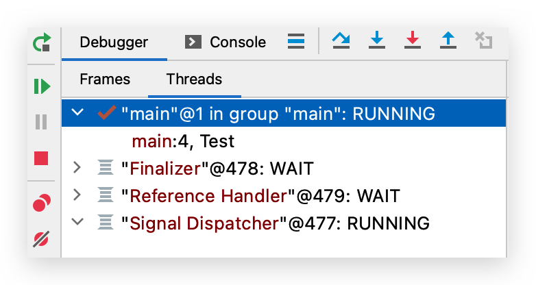

# 多线程—基本概念

## 思维导图

<iframe id="embed_dom" name="embed_dom" frameborder="0" style="display:block;width:725px; height:545px;" src="https://www.processon.com/embed/602b7b0d7d9c081db9a36542"></iframe>

## 操作系统、程序、进程、线程

### 操作系统（OS）

操作系统（OS）是包含多个进程的容器，而每个进程又都是容纳多个线程的容器

### 程序（Program）

程序是为完成特定任务、用某种程序设计语言编写的一组**指令的集合**。即指**一段静态的代码**，**静态对象**。

### 进程（Process）🔥

程序要运行，就必须将其加载到 CPU（如缓存器中），然后操作内存中的数据、磁盘中的数据、网络设置等。

**进程是正在运行的程序。是程序的一次执行过程**，是**系统进行资源分配的基本单位**。是**动态对象**。

- 每个进程都有一个**独立的内存空间**，一个应用程序多次运行对应多个进程。
- 它是一个**动态的过程**，系统运行一个程序即是一个进程从创建、运行到消亡的过程，即生命周期。

Oracle 文档中定义进程是：使用 fork（2）系统调用创建的 UNIX 环境（例如文件描述符，用户 ID 等），它被设置为运行程序

可以使用活动监视器查看，有进程、线程数量等


大部分程序可以同时运行多个实例进程（如浏览器），也有的程序只能同时运行一个实例进程（如网易云音乐）

### 线程（Thread）🔥

**线程是进程中的一个执行单元/路径**，负责当前进程中程序的执行，是**处理机调度的基本单位**

Oracle 文档中定义线程是：在进程上下文中执行的一系列指令

- **每个线程拥有独立的运行栈和程序计数器**

- **一个进程中的多个线程共享相同的内存单元/内存地址空间**：它们从同一堆中分配对象，可以访问相同的变量和对象。这就使得线程间通信更简便、高效。但多个线程操作共享的系统资源可能会带来**安全隐患**

- **线程切换的开销小**

- 线程**一对一映射**到 OS 的内核线程，使用 JNI 实现的。若是支持协程的语言，可能几十个协程对应一个 OS 线程

  

### 【面试】进程和线程的关系和区别？🔥

<iframe id="embed_dom" name="embed_dom" frameborder="0" style="display:block;width:100%; height:645px;" src="https://www.processon.com/embed/601eac54e0b34d41a74224b6"></iframe>

### 【实例】一个 Java 应用程序至少有三个线程 🔥

一个 Java 应用程序，至少有三个线程？：**main()主线程**，**gc()垃圾回收线程**，**异常处理线程**。当然如果发生异常，会影响主线程。查看 debugger 模式时可以看到如下代码的线程

```java
public class Test {
    public static void main(String[] args) {
        System.out.println();
    }
}
```



- main：主线程，程序的入口
- Finalizer：负责对象的 finalize() 方法，垃圾回收，不推荐主动使用
- Reference Handler：和 GC、引用相关的线程
- Signal Dispatcher：信号调度，把操作系统发来的信号分发给适当的处理程序

### 【实例】房子

- 客厅：每个线程随时进出
- 厨房：线程并发，线程间通信
- 卫生间：需有锁
- 卧室：线程独立资源，如堆栈

## 多线程

### 概念

若**一个进程同一时间并行执行多个线程**，就是支持多线程的。一个进程中**至少有一个线程**

### 为什么需要多线程、优点 🔥

若是单核 CPU，只使用单个线程先后完成多个任务(调用多个方法)，肯定比用多个线程来完成用的时间更短（线程切换时间长），但是目前大部分都是多核 CPU，那多线程究竟有什么好处呢？为什么要使用多线程？

- 最主要的目的就是**提高 CPU 利用率**

  - 提高**处理速度**
  - 避免**无效等待**（IO 时可以做其他事）
  - **提高用户体验**，应用程序响应快，避免卡顿，缩短等待时间
    - 并行处理，提高性能，通常是服务器领域（例如 Tomcat），用多个线程去接收进来的 HTTP 请求，而不是排队等待单一的线程处理
    - 在 Android 开发中，主线程的重要任务之一是绘制屏幕界面，即 UI 线程，该线程中不允许进行 IO 操作或网络请求，目的就是避免卡顿，影响用户的交互

- **便于编程建模，改善程序结构**

  把这个大的任务 A 分解成几个小任务，任务 B、任务 C、任务 D，分别建立程序模型，并通过多线程分别运行这几个任务，便于理解和修改

- **计算机性能定律：摩尔定律失效，阿姆达尔定律登上舞台**

  - 摩尔定律：当价格不变时，集成电路上可容纳的**元器件的数目**，约每隔 18-24 个月便会**增加一倍**，**性能也将提升一倍**。
  - 阿姆达尔定律：
    - 结论：一般情况下，处理器越多，程序执行的速度就会越快，但是会有一个上限，上限取决于程序中串行部分的比例，**并行的比例越高，多处理器的效果越明显**。但是大部分程序都是串行占比多！


### 多线程的使用场景 🔥

- 为了**同时做多件不同的事**：开网页同时听歌；后台定时任务

- **为了提高工作效率、处理能力**：Tomcat；并行下载；NIO

  程序需要实现一些需要**等待的任务**时，如用户输入、文件读写操作、网络操作、搜索等

- 需要同时有很大并发量的时候：压测

### 多线程局限 🔥

- 性能问题：**上下文切换的消耗**
- 带来**线程安全问题**：
  - **数据安全**问题：i++总数不一致
  - **线程活跃性**问题：线程饥饿、死锁、活锁
- 异构化任务（任务结构不一样）很难高效并行。即对于串行任务无法改造为多线程

## 串行、并发、并行

### 异同 🔥

- 串行：按顺序执行
- **并发**：指两个或多个线程在**同一个时间段内**发生，**逻辑上**同时发生，单核即可实现。左图

* **并行**：指两个或多个线程在**同一时刻**发生（同时发生），**物理上**同时发生，多核可以实现。**并行一定是并发，反之不是**。右图


### 单核、多核 CPU

- **单核 CPU**，其实是一种假的多线程，操作系统中的**任务调度器**，将 CPU 的**时间片（Win 下最小时间片为 15ms）**分给不同的线程使用，**一个时间片内只能执行一个线程的任务**，即线程还是**串行执行**的，但是因为时间片特别短，因此感觉不出来。总结一句话就是：**微观串行，宏观并发**。

  任务调度器具体如何分配时间片，有**分时调度模型**（时间片轮转，平分时间片）、**抢占式调度模型**（优先级高则时间片多）

  例如：虽然有多车道，但是收费站只有一个工作人员在收费，只有收了费才能通过，那么 CPU 就好比收费人员。如果有某个人不想交钱，那么收费人员可以 把他“挂起”（晾着他，等他想通了，准备好了钱，再去收费）。

- **多核 CPU**，在单核基础上可以**并行**执行多个线程，能更好的发挥多线程的效率。现在的服务器都是多核的。

### 是什么让并发和并行称为可能？🔥

- 操作系统升级，抢占式任务处理，时间片轮转；
- 单核 CPU 升级，频率越来越高，速度越来越开，让并发称为可能
- 多核 CPU 升级，让并行称为可能；
- 编程语言升级，支持并发

## 高并发

### 什么是高并发？

服务器短时间可以处理非常多个请求，如双十一、过年微信摇一摇红包

### 高并发和多线程的联系和不同？🔥

- **多线程**是高并发其中一种重要的**解决方案**，**高并发**是一种服务器**状态**
- 高并发并不意味着是多线程，如 Redis

### 高并发的指标

- QPS（Queries Per Second）：每秒查询数

- TPS：每秒处理事务数

- 带宽

- PV（Page View）：一天访问量。。。

- UV（Unique Visitor）：一天访问量去重

- IP：不同 IP 访问量

- 并发连接数（The number of concurrent connections）

- 服务器平均请求等待时间 TPR（Time per request）：across all concurrent request

## 同步异步、阻塞非阻塞

参考[知乎](https://zhuanlan.zhihu.com/p/22707398)

### 同步、异步 🔥

- **被调用者**是否**主动告诉**调用者结果，不主动则应用层还是在向系统内核轮训

- **以调用方角度来讲**，如果

  - **需要**等待结果返回，才能继续运行就是同步
  - **不需要**等待结果返回，就能继续运行就是异步

  即前序结果对后续**有影响时使用同步**；没有**影响时使用异步即可（如 IO、网络请求等）**

鸣笛烧水壶就是异步的示例


### 阻塞、非阻塞 🔥

**调用者**（线程发出请求，如 HTTP）是否阻塞等待

### 组合示例 🔥

- 同步阻塞：开始烧水后，我们一直盯着水壶
- 同步非阻塞：开始烧水后，我们每隔三五分钟过来看一下水壶
- 异步阻塞：带有鸣笛的水壶开始烧水后，我们一直盯着水壶。常用于结果影响后续进程
- 异步非阻塞：带有鸣笛的水壶开始烧水后，我们干其他事去了，鸣笛后再过来
