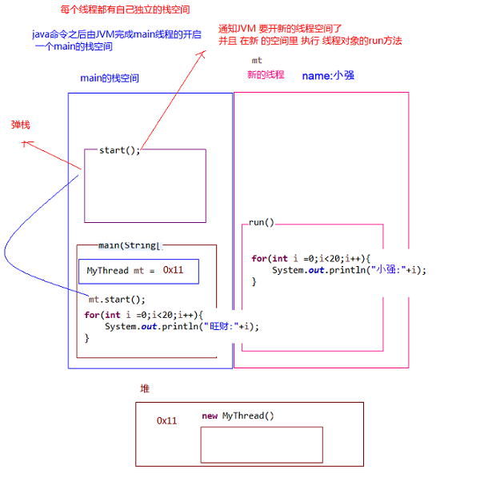

# 多线程—基本使用

## 线程调度模型

- **线程调度模型**（应用程序的执行都是**CPU 在多个线程间快速切换**完成的）
    - **分时调度模型（时间片）**：所有线程轮流使用 CPU 的使用权，平均分配每个线程占用 CPU 的时间片
    - **抢占式调度模型**：优先让**优先级高**的线程使用 CPU，如果线程的优先级相同，那么会随机选择一个，优先级高的线程获取的 CPU 时间片相对多一些
- **Java 的线程调度方法**
    - **同优先级**线程组成**先进先出队列**（先到先服务），使用**时间片**策略
    - 对**高优先级**，使用优先调度的**抢占式**策略


## 线程运行原理 🔥

### Java Virtual Machine

JVM 由堆、方法区、虚拟机栈、本地方法栈、程序计数器所组成，其中栈内存是给谁用的呢？其实就是线程，每个线程启动后，虚拟机就会为其分配一块栈内存。

*   **每个栈**由多个**栈帧（Frame）**组成，对应着**每次方法调用时所占用的内存**。
*   **每个线程只能有一个活动栈帧**，对应着当前**正在执行的那个方法**。

画个图就很好理解了（具体还需要学习JVM）

<iframe id="embed_dom" name="embed_dom" frameborder="0" style="display:block;width:100%; height:545px;" src="https://www.processon.com/embed/602623c4e0b34d208a7f6e4b"></iframe>

多个线程 debug 时可以对要查看的多个线程都设置 suspend（挂起）为 Thread，才能让线程分别挂起，分别调试


### 线程的上下文切换

Thread Context Switch

因为以下一些原因导致 cpu 不再执行当前的线程，转而执行另一个线程的代码

*   线程的 cpu 时间片用完
*   垃圾回收
*   有更高优先级的线程需要运行
*   线程自己调用了 sleep、yield、wait、join、park、synchronized、lock 等方法

当 Context Switch 发生时，需要由操作系统**保存当前线程的状态**，并**恢复另一个线程的状态**，Java 中对应的概念就是**程序计数器**（Program Counter Register），它的作用是**记住下一条 jvm 指令的执行地址**，是**线程私有**的

*   状态包括程序计数器、虚拟机栈中每个栈帧的信息，如局部变量、操作数栈、返回地址等

*   Context Switch 频繁发生会影响性能


### Java 多线程的运行过程 🔥

**Java 程序运行原理（多线程）**：由 Java 命令启动 JVM（相当于启动了一个进程），接着由该进程创建启动多个线程，至少三个线程可以分析出来：**执行 main()函数的主线程**，该线程的任务代码都定义在 main 函数中，**负责垃圾回收的 GC 线程**，以及**异常处理线程**

- 多线程执行时，其实**每一个执行线程**都有一片自己**所属的栈内存**空间（还有 PC）。进行**方法的压栈和弹栈**。




## 线程的创建和使用 🔥

### Thread 构造方法 🔥

- `Thread()`：分配一个新的线程对象。
- `Thread(String name)`：分配一个指定名字的新的线程对象
- `Thread(Runnable target)`：分配一个带有指定目标新的线程对象，它实现了 Runnable 接口中的`run`方法
- `Thread(Runnable target,String name)`：分配一个带有指定目标新的线程对象并**指定名字**


### 1. 继承 Thread 类—匿名内部类

1.  定义子类继承 Thread 类。可以写无参和带参构造以便直接定义线程名称。
2.  子类中 Override 重写 Thread 类的`run()`方法，将线程的任务代码封装到`run()`方法中。
3.  创建 Thread 的子类对象，即创建了线程对象。
4.  调用线程对象的**`start()`**，JVM 将调用该线程的**`run()`**方法执行（**多次启动一个线程非法，即使执行完毕**）

```java
@Slf4j(topic = "Test1")
public class Test1 {

    public static void main(String[] args) {
        Thread t1 = new Thread("t1") {
            @Override
            public void run() {
                log.debug("running");
            }
        };

        t1.start();

        log.debug("running");
    }
}
```


### 2. 实现 Runnable 接口

1.  定义类实现 Runnable 接口
2.  @Override 重写接口中的`run()`方法，将线程的任务代码封装到`run()`方法中
3.  通过 Thread 类创建线程对象，并将 Runnable 接口的子类对象作为 Thread 类的构造函数的参数进行传递。**线程的任务都封装在 Runnable 接口实现类对象的 run 方法中，所以要在线程对象创建时就必须明确要运行的任务**
4.  调用**`start()`开启线程**，JVM 调用该线程的**`run()`**方法执行（**多次启动一个线程非法，即使执行完毕**）

```java
@Slf4j(topic = "Test2")
public class Test2 {
    public static void main(String[] args) {
        // 普通实现
        Runnable r0 = new Runnable() {
            @Override
            public void run() {
                log.debug("running");
            }
        };

        // lambda表达式实现
        r1 = () -> log.debug("running");

        Thread t1 = new Thread(r1, "t1");
        t1.start();

        log.debug("running");

    }
}
```


### 3. 实现 Callable 接口 + Future

与使用 Runnable 相比， Callable 功能更强大些（JDK5.0 新增）：

- 使用`FutureTask`类封装实现了 `Callable` 接口的实现类，并传入 `Thread` 的构造方法中，调用 `start` 方法

- 相比`run()`方法，实现 Callable接口需要实现 `call()` 方法，可以有**返回值**（支持**泛型**），可以**抛出异常**

    调用`FutureTask`的`get()`**阻塞等待任务代码执行完毕，获取返回值**

`Future`接口：

- 可以对具`Runnable`、`Callable`任务的执行结果进行取消、查询是否完成、获取结果等。
- `FutrueTask`是`Futrue`接口的**唯一的实现类**
- `FutureTask`**同时实现了`Runnable`,`Future`接口**。它既可以作为`Runnable`被线程执行，又可以作为`Future`得到`Callable`的返回值

```java
@Slf4j(topic = "Test3")
public class Test3 {
    public static void main(String[] args) throws ExecutionException, InterruptedException {

        // 普通实现
        Callable<Integer> c0 = new Callable<Integer>() {
            @Override
            public Integer call() throws Exception {
                log.debug("Callable ...");
                Thread.sleep(2000);
                return 1 + 1;
            }
        };

        // lambda表达式实现
        FutureTask<Integer> c1 = new FutureTask<>(() -> {
            log.debug("Callable ...");
            Thread.sleep(2000);
            return 1 + 1;
        });

        Thread t1 = new Thread(c1, "t1");
        t1.start();

        int value = c1.get();
        log.debug("value: {}", value);
    }
}
```


### 线程池

- 背景：经常创建和销毁、使用量特别大的资源，比如并发情况下的线程， 对性能影响很大。
- **线程池**：其实就是一个**容纳多个线程的容器**，其中的**线程可以反复使用**，使用完**自动归还**，省去了频繁创建线程对象的操作， 无需反复创建线程而消耗过多资源。
- 好处：
    - **降低资源消耗**（重复利用线程池中线程，不需要每次都创建）
    - **提高响应速度**（减少了创建新线程的时间）
    - **便于线程管理**
- **JDK 5.0 起**提供了线程池的顶级**接口**是 `java.util.concurrent.Executor`，但是严格意义上讲它只是一个**执行线程的工具**。**真正的线程池接口是 `java.util.concurrent.ExecutorService`** （官方建议**使用`java.util.concurrent.Executors`线程池工厂类**来创建线程池对象）：
    - `void execute(Runnable command)`：执行任务/命令，没有返回值，一般用来执行 `Runnable`
    - `<T> Future<T> submit(Callable<T> task)`：执行任务，有返回值，一般又来执行 `Callable`
    - `void shutdown()`：关闭线程池，不建议执行
- 常见`ExecutorService`线程池对象有：
    - `ExecutorService static newCachedThreadPool()`：可根据需要创建新线程的线程池
    - `ExecutorService static newFixedThreadPool(int maxThreads)`：可重用固定线程数的线程池
    - `ExecutorService static newSingleThreadExecutor()`：只有一个线程的线程池
    - `ExecutorService static newScheduledThreadPool(n)`：可安排在给定延迟后运行命令或者定期地执行
- 参数（常考）：
    - corePoolSize：核心池的大小
    - maximumPoolSize：最大线程数
    - keepAliveTime：线程没有任务时最多保持多长时间后会终止
    - setRejectedExecutionHandler
    - setThreadFactory

```java
ExecutorService service = Executors.newFixedThreadPool(10);
ThreadPoolExecutor service1 = (ThreadPoolExecutor) service;
// 设置线程池的属性
// System.out.println(service.getClass());
// service1.setCorePoolSize(15);
// service1.setKeepAliveTime();
service.execute(new NumberThread());//适合适用于Runnable
service.execute(new NumberThread1());//适合适用于Runnable
service.submit(Callable callable);//适合使用于Callable
//关闭连接池
service.shutdown();
```


## 线程优先级 🔥

- 线程的优先级等级（通过 Thread 的静态常量）
    - `Thread.MAX_PRIORITY`：10
    - `Thread.MIN _PRIORITY`：1
    - `Thread.NORM_PRIORITY`：5，默认
- 方法
    - `getPriority()`：返回线程优先级
    - `setPriority(int newPriority)`：改变线程的优先级，需在 start 前设置
- 说明
    - **线程创建时继承父线程的优先级**
    - 线程优先级仅仅会提示（hint）调度器优先调度该线程，调度器可以忽略它。若**CPU比较忙，那么优先级高的线程会获得更多的时间片**，但**CPU闲时，优先级几乎没作用**。**低优先级只是获得调度的概率低**，并非一定是在高优先级线程之后才被调用。看上面 yield 的代码测试。


## 主线程 & 守护线程 🔥

默认情况下，Java 进程需要等待所有线程都运行结束，才会结束。有一种特殊的线程叫做守护线程，只要其它非守护线程运行结束了，即使守护线程的代码没有执行完，也会强制结束。

守护线程（后台线程）和用户线程在几乎每个方面都是相同的，唯一的区别是**判断 JVM 何时离开**

**守护线程是用来服务用户线程的**，在`start()`方法前调用`th.setDaemon(true)`可以把一个用户线程变成一个守护线程

**若 JVM 中都是守护线程，当前 JVM 将退出**

```java
@Slf4j(topic = "TestDaemon")
public class TestDaemon {

    public static void main(String[] args) throws InterruptedException {

        Thread t1 = new Thread(() -> {

            while (true){
                log.debug("{}正在运行...", Thread.currentThread().getName());
                if (Thread.currentThread().isInterrupted()){
                    break;
                }
            }
            log.debug("{}运行结束...", Thread.currentThread().getName());// daemon结束不会执行该行

        }, "daemon");
        // 设置该线程为守护线程
        t1.setDaemon(true);
        t1.start();
        TimeUnit.SECONDS.sleep(1);
        log.debug("{}运行结束...", Thread.currentThread().getName());
    }
}
```

**Java 垃圾回收线程**就是一个典型的守护线程

**Tomcat 中的 Acceptor（接收请求） 和 Poller（分发请求） 线程都是守护线程**，所以 Tomcat 接收到 shutdown 命令后，不会等待它们处理完当前请求


## 基本方法

- `static Thread currentThread()`：获取当前正在执行的线程，在 Thread 子类中就是 this，通常用于主线程和 Runnable 实现类
- `String getName()`：**获取当前线程名称**
- `void setName()`：**设置当前线程名称**，或通过线程**类的有参构造设置**
- `getId()`：获取线程长整型的 id（唯一）


## 常用方法—start & run 🔥

### start

`void start()`：**启动线程，JVM 执行此线程对象的`run()`方法**

该方法只是让线程进入**就绪**状态，里面代码不一定立刻运行（CPU 的时间片还没分给它）。每个线程对象的`start`方法只能调用一次，如果调用了多次会出现 `IllegalThreadStateException`


### run

`void run()`：**线程在被调度时执行底层的操作**。直接调用则没有多线程效果，仅仅是main线程中调用下该任务

如果在构造 Thread 对象时传递了 Runnable 参数，则线程启动后会调用 Runnable 中的 run 方法，否则默认不执行任何操作。但可以创建 Thread 的子类对象，来覆盖默认行为


## 常用静态方法—sleep & yield 🔥

### sleep

`static void sleep(long millis)` 

**线程睡眠**。使**当前正在执行的线程**以指定的毫秒数**睡眠**，**不释放锁**

*   调用 sleep 会让当前线程**从 *Running* 进入 *Timed Waiting* 状态**

*   其它线程可以使用 interrupt 方法**打断**正在睡眠的线程，这时 sleep 方法会抛出 InterruptedException

*   睡眠结束后的线程**未必会立刻得到执行**，需要得到处理器的等资源

*   **建议用 `TimeUnit` 的 `sleep` 代替 Thread 的 sleep 来获得更好的可读性**

```java
@Slf4j(topic = "SleepTest")
public class SleepTest {
    public static void main(String[] args) {
        Thread t1 = new Thread(() -> {
            try {
                // Thread.sleep(2000);
                TimeUnit.SECONDS.sleep(2);
            } catch (InterruptedException e) {
                e.printStackTrace();
            }
        }, "t1");

        t1.start();
        log.debug("t1 state: {}", t1.getState());// RUNNABLE

        try {
            // 可能main线程快执行完了，才执行t1，所以让main线程休眠下
            TimeUnit.MILLISECONDS.sleep(500);
        } catch (InterruptedException e) {
            e.printStackTrace();
        }
        log.debug("t1 state: {}", t1.getState());// TIMED_WAITING
    }
}
```

```java
@Slf4j(topic = "interruptTest")
public class InterruptTest {
    public static void main(String[] args) throws InterruptedException {
        Thread t1 = new Thread(() -> {
            try {
                log.debug("enter sleep...");
                TimeUnit.SECONDS.sleep(2);
                log.debug("what's the fuck!!!");// 不会执行！！！interrupt 不是 notify
            } catch (InterruptedException e) {
                log.debug("be interrupt...");
                e.printStackTrace();
            }
        }, "t1");

        t1.start();
        TimeUnit.SECONDS.sleep(1);
        log.debug("interrupt...");
        t1.interrupt();

        // 22:11:31.589 [t1] DEBUG interruptTest - enter sleep...
        // 22:11:32.589 [main] DEBUG interruptTest - interrupt...
        // 22:11:32.589 [t1] DEBUG interruptTest - be interrupt...
    }
}
```


### yield

`static void yield()` **不会进入阻塞状态**

**线程让步**。**暂停**当前正在执行的线程（系统指定的毫秒数），把执行机会让给优先级相同或更高的线程，并执行其他线程。若队列中没有同优先级的线程，忽略此方法。**转为 RUNNABLE 的就绪状态（不会进入阻塞状态）**，该线程不会失去任何监视器的所有权（**不释放锁**）。**不确保真正让出，具体实现依赖操作系统的任务调度器，很少用，主要是为了测试和调试**。

```java
@Slf4j(topic = "yieldTest")
public class YieldTest {

    public static void main(String[] args) {

        Runnable task1 = () -> {
            int count = 0;
            for (; ; ) {
                System.out.println("=====> task1 " + count++);
            }
        };

        Runnable task2 = () -> {
            int count = 0;
            for (; ; ) {
                // 1 测试 yield（这个很明显）
                Thread.yield();
                System.out.println("            =====> task2 " + count++);
            }
        };

        Thread t1 = new Thread(task1, "t1");
        Thread t2 = new Thread(task2, "t2");
        // 2 测试优先级（看CPU空闲核心数吧，可能都并行执行了）
        // t1.setPriority(Thread.MIN_PRIORITY);
        // t2.setPriority(Thread.MAX_PRIORITY);
        t1.start();
        t2.start();
    }
}
```


## 常用方法—join 同步 🔥

### join

`join([long n])`：**线程插队**。**底层就是 wait**

当**某个程序执行流中调用**其他线程的`join()`方法时，**执行流线程**将进入**WAITING 或 TIMED_WAITING**，直到`join()`方法加入的线程执行完毕（或**最多等待n毫秒**），**执行流线程**才进入**RUNNABLE状态**。


### 为什么需要 join？为了同步！

下面的代码执行，打印 r 是什么？

```java
@Slf4j(topic = "testJoin")
public class TestJoin {
    static int r = 0;

    public static void main(String[] args) {
        test1();
    }

    private static void test1() {
        log.debug("开始");
        Thread t1 = new Thread(() -> {
            try {
                log.debug("开始");
                TimeUnit.SECONDS.sleep(1);
                log.debug("结束");
                r = 10;
            } catch (InterruptedException e) {
                e.printStackTrace();
            }

        }, "t1");
        t1.start();
        log.debug("结果为:{}", r);
        log.debug("结束");
    }
}
```

分析

*   因为主线程和线程 t1 是并行执行的，t1 线程需要 1 秒之后才能算出 r=10

*   而主线程一开始就要打印 r 的结果，所以只能打印出 r=0

解决方法

*   用 sleep 行不行？为什么？

    不行，不知道t1线程究竟要执行多久，所以main线程无法控制sleep的时间

*   用 join，加在 t1.start() 之后即可。目前可以。但是可以使用更好的 Callable 解决

```java
@Slf4j(topic = "testJoin")
public class TestJoin {

    static int r = 0;

    public static void main(String[] args) throws InterruptedException {
        test1();
    }

    private static void test1() throws InterruptedException {
        log.debug("开始");
        Thread t1 = new Thread(() -> {
            try {
                log.debug("开始");
                TimeUnit.SECONDS.sleep(1);
                log.debug("结束");
                r = 10;
            } catch (InterruptedException e) {
                e.printStackTrace();
            }

        }, "t1");
        t1.start();
        t1.join();
        log.debug("结果为:{}", r);
        log.debug("结束");
    }
}
```


### 等待多个结果

问，下面代码（伪代码） cost 大约多少秒？

```java
static int r1 = 0;
static int r2 = 0;
public static void main(String[] args) throws InterruptedException {
    test2();
}

private static void test2() throws InterruptedException {
    Thread t1 = new Thread(() -> {
        sleep(1);
        r1 = 10;
    });
    Thread t2 = new Thread(() -> {
        sleep(2);
        r2 = 20;
    });
    long start = System.currentTimeMillis();
    t1.start();
    t2.start();
    t1.join();
    t2.join();
    long end = System.currentTimeMillis();
    log.debug("r1: {} r2: {} cost: {}", r1, r2, end - start);
}
```

分析如下

*   第一个 join：等待 t1 时，t2 并没有停止，正在运行

*   第二个 join：1s 后，执行到此，t2 也运行了 1s，因此也只需再等待 1s。即总共 cost 2秒

如果颠倒两个 join 呢？一样！因为t2 join完毕后，t1在此2s内已经执行完了


## 常用方法—interrupt 🔥

### interrupt—中断线程 🔥

**请求终止线程**，仅设置了一个标志位，中断一个不在活动状态（阻塞）的线程**没意义并会抛异常**

*   如果**被打断的线程正在 sleep，join，wait** 会导致被打断的线程抛出 InterruptedException，并**清除打断标记（置为false）** 
*   如果**打断的正在运行的线程**，则会**设置打断标记（置为true）** ；
*   **park 的线程被打断**，也会**设置打断标记（置为true）**


### 普通方法 isInterrupted—线程是否被中断 🔥

**不会清除中断标志位**


### 静态方法 interrupted—线程是否被中断

**会清除中断标志位！！！**


### 打断线程正在 sleep，join，wait 的线程—没意义

```java
@Slf4j(topic = "testInterrupt1")
public class TestInterrupt1 {
    public static void main(String[] args) throws InterruptedException {
        test1();
    }

    private static void test1() throws InterruptedException {
        Runnable task1 = () -> {
            try {
                log.debug("sleep...");
                TimeUnit.SECONDS.sleep(5);
            } catch (InterruptedException e) {
                e.printStackTrace();
            }
        };

        Thread t1 = new Thread(task1, "t1");
        t1.start();

        TimeUnit.SECONDS.sleep(1);// 
        log.debug("interrupt...");
        t1.interrupt();
        TimeUnit.MILLISECONDS.sleep(50);// 打印前必须再等待下，因为中断标记清除比较慢！
        log.debug("中断标记：{}", t1.isInterrupted());// false
    }
}
```


### 打断正在运行的线程—正常

```java
@Slf4j(topic = "testInterrupt1")
public class TestInterrupt1 {
    public static void main(String[] args) throws InterruptedException {
        test2();
    }

    private static void test2() throws InterruptedException {
        Runnable task1 = () -> {
            log.debug("running...");
            // 这里要是改为 sleep ，则中断标记将被置为 false
            while (true) {
                // 必须手动退出，否则一直执行。可以用于优雅停止！ 
                boolean flag = Thread.currentThread().isInterrupted();
                if (flag){
                    log.debug("被打断了，我主动退出");
                    break;
                }
            }
        };

        Thread t1 = new Thread(task1, "t1");
        t1.start();

        TimeUnit.SECONDS.sleep(1);// main 线程睡1秒，防止t1线程还未执行
        log.debug("interrupt...");
        t1.interrupt();
        TimeUnit.MILLISECONDS.sleep(50);// 打印前必须再等待下，因为中断标记清除比较慢！
        log.debug("中断标记：{}", t1.isInterrupted());// true
    }
}
```


### 打断 park 线程—正常

```java
@Slf4j(topic = "testInterrupt1")
public class TestInterrupt1 {
    public static void main(String[] args) throws InterruptedException {
        test3();
    }

    private static void test3() throws InterruptedException {
        Thread t1 = new Thread(() -> {
            log.debug("park...");
            LockSupport.park();// 该方法后面的代码不会执行，除非打断标记为true
            log.debug("unpark...");
            log.debug("打断状态：{}", Thread.currentThread().isInterrupted());// 不清除中断标记
            // log.debug("打断状态：{}", Thread.interrupted());// 清除中断标记为false
            // 再次执行无效（后面的代码会继续执行），因为打断标记已经为true，除非修改打断标记为false，如使用interrupted静态方法
            LockSupport.park();
            log.debug("unpark...");
        }, "t1");
        t1.start();
        TimeUnit.SECONDS.sleep(3);
        t1.interrupt();
    }
}
```


### 设计模式—两阶段终止 🔥

见设计模式


## ~~过时方法~~

还有一些不推荐使用的方法，这些方法已过时，**容易破坏同步代码块，造成线程死锁**

*   `stop()`：停止线程运行，@Deprecated(since="1.2")
*   `suspend()`：挂起（暂停）线程运行。wait、notify代替
*   `resume()`：恢复线程运行。wait、notify代替


## 应用—统筹分析 🔥

见应用章节


## OS 中查看线程进程的方式

### Windows

*   任务管理器可以查看进程和线程数，也可以用来杀死进程

*   `tasklist` 查看进程

    `tasklist | findstr java`

*   `taskkill` 杀死进程


### Linux

*   `ps -ef` 查看所有进程
*   `ps -fT -p <PID>` 查看某个进程（PID）的所有线程
*   `kill` 杀死进程
*   `top` 按大写 H 切换是否显示线程
*   `top -H -p <PID>` 查看某个进程（PID）的所有线程？


### Java

*   `jps` 命令查看所有 Java 进程

    `jps | grep Test`

*   `jstack <PID>` 查看某个 Java 进程（PID）某一刻的所有线程状态（快照）

*   `jconsole` 来查看某个 Java 进程中线程的运行情况（图形界面）

    需要以如下方式运行你的 java 类

    ```bash
    java -Djava.rmi.server.hostname=`ip地址` -Dcom.sun.management.jmxremote -Dcom.sun.management.jmxremote.port=`连接端口` -Dcom.sun.management.jmxremote.ssl=是否安全连接 -Dcom.sun.management.jmxremote.authenticate=是否认证 java类
    ```

    修改 /etc/hosts 文件将 127.0.0.1 映射至主机名

    如果要认证访问，还需要做如下步骤

    *   复制 jmxremote.password 文件
    *   修改 jmxremote.password 和 jmxremote.access 文件的权限为 600 即文件所有者可读写
    *   连接时填入 controlRole（用户名），R&D（密码）


## JMH 基准测试

*   基准测试工具选择，使用了比较靠谱的 JMH，它会执行程序预热，执行多次测试并平均
*   cpu 核数限制，有两种思路
    *   使用虚拟机，分配合适的核
    *   使用 msconfifig，分配合适的核，需要重启比较麻烦
*   并行计算方式的选择
    *   最初想直接使用 parallel stream，后来发现它有自己的问题
    *   改为了自己手动控制 thread，实现简单的并行计算

使用 archetype 创建 Maven 项目

```
mvn archetype:generate -DinteractiveMode=false -DarchetypeGroupId=org.openjdk.jmh -DarchetypeArtifactId=jmh-java-benchmark-archetype -DgroupId=org.sample -DartifactId=test -Dversion=1.0
```

进入该 test 项目，修改测试代码

```java
@Fork(1)
@BenchmarkMode(Mode.AverageTime)
@Warmup(iterations=3)
@Measurement(iterations=5)
public class MyBenchmark {

    static int[] ARRAY = new int[1000_000_00];
    static {
        Arrays.fill(ARRAY, 1);
    }


    @Benchmark
    public int c() throws Exception{
        int[] array = ARRAY;
        FutureTask<Integer> t1 = new FutureTask<>(()->{
            int sum = 0;
            for(int i = 0; i < 250_000_00;i++) {
                sum += array[i];
            }
            return sum;
        });
        FutureTask<Integer> t2 = new FutureTask<>(()->{
            int sum = 0;
            for(int i = 0; i < 250_000_00;i++) {
                sum += array[250_000_00+i];
            }
            return sum;
        });
        FutureTask<Integer> t3 = new FutureTask<>(()->{
            int sum = 0;
            for(int i = 0; i < 250_000_00;i++) {
                sum += array[500_000_00+i];
            }
            return sum;
        });
        FutureTask<Integer> t4 = new FutureTask<>(()->{
            int sum = 0;
            for(int i = 0; i < 250_000_00;i++) {
                sum += array[750_000_00+i];
            }
            return sum;
        });
        new Thread(t1).start();
        new Thread(t2).start();
        new Thread(t3).start();
        new Thread(t4).start();
        return t1.get() + t2.get() + t3.get()+ t4.get();
    }


    @Benchmark
    public int d() throws Exception {
        int[] array = ARRAY;
        FutureTask<Integer> t1 = new FutureTask<>(()->{
            int sum = 0;
            for(int i = 0; i < 1000_000_00;i++) {
                sum += array[i];
            }
            return sum;
        });
        new Thread(t1).start();
        return t1.get();
    }
}
```

打包后在 test 目录下执行 `java -jar [-Xmx2G] target/benchmarks.jar` 测试：

*   可以看到多核下，效率提升还是很明显的
*   单核下，性能几乎是一样的，甚至多线程代码还慢了一点