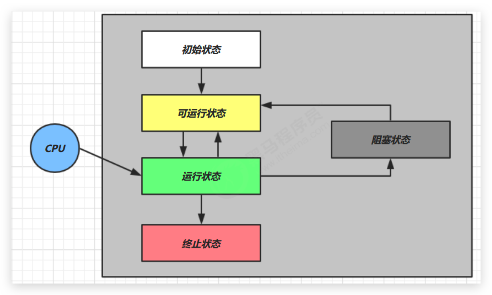

# 线程生命周期 🔥

## 五种状态—OS层面



*   【初始状态】仅是在语言层面创建了线程对象，还未与操作系统线程关联

*   【可运行状态】（就绪状态）指该线程已经被创建（与操作系统线程关联），可以由 CPU 调度执行

*   【运行状态】指获取了 CPU 时间片并运行中的状态

    当 CPU 时间片用完，会从【运行状态】转换至【可运行状态】，会导致线程的上下文切换

*   【阻塞状态】

    如果调用了**阻塞 API，如 BIO 读写文件**，这时该线程实际不会用到 CPU，会导致线程上下文切换，进入【阻塞状态】，等 BIO 操作完毕，会由操作系统唤醒阻塞的线程，转换至【可运行状态】

    与【可运行状态】的区别是，对【阻塞状态】的线程来说只要它们一直不唤醒，调度器就一直不会考虑调度它们

*   【终止状态】表示线程已经执行完毕，生命周期已经结束，不会再转换为其它状态


##  六种状态—Java层面

<iframe id="embed_dom" name="embed_dom" frameborder="0" style="display:block;width:100%; height:745px;" src="https://www.processon.com/embed/60267a51f346fb64f5655b6a"></iframe>

常用方法：

- `boolean isAlive()`：判断线程是否还**存活**，还没有运行完毕
- `Enum getState()`：获取线程状态

当线程被创建并启动以后，它既不是一启动就进入了执行状态，也不是一直处于执行状态。在线程的生命周期中， 有几种状态呢？在 API 中 **`java.lang.Thread`** **中的`State`内部枚举类中给出了六种线程状态**：

- **新建**：当一个 Thread 类或其子类的对象被声明并创建时，但是并未启动即调用 `start()`，新生的线程对象处于新建状态

    > **NEW**：Thread state for a thread which has not yet started.

- **可运行**：处于新建状态的线程被`start()`后，可能正在 JVM 中执行，也可能正在等待来自操作系统的其他资源如处理器

    > **RUNNABLE**：state for a runnable thread. A thread in the runnable state is executing in the Java virtual machine but it may be waiting for other resources from the operating system such as processor.

- **阻塞**：当一个线程试图获取一个对象锁，而该对象锁被其他的线程持有，则该线程进入 Blocked 状态；当该线程持有锁时，该线程将变成 Runnable 状态。

    > **BLOCKED**：Thread state for a thread blocked waiting for a monitor lock.A thread in the blocked state is waiting for a monitor lock to enter a synchronized block/method or reenter a synchronized block/method after calling `Object.wait`.

- **无限等待**：一个线程在等待另一个线程执行一个（唤醒）动作时，该线程进入 Waiting 状态。这个状态后是不能自动唤醒的

    > **WAITING**：state for a waiting thread.A thread is in the waiting state due to calling one of the following methods:
    >
    > - `Object.wait` with no timeout
    >
    > - `th.join` with no timeout
    >
    > - `LockSupport.park`
    >
    >     A thread in the waiting state is waiting for another thread to perform a particular action.
    >
    > For example, a thread that has called `Object.wait()` on an object is waiting for another thread to call `Object.notify()` or `Object.notifyAll()` on that object. A thread that has called `th.join()` is waiting for a specified thread to terminate.

- **计时等待**：同 waiting 状态，有几个方法有超时参数，调用他们将进入 Timed Waiting 状态。这一状态将一直保持到超时期满或者接收到唤醒通知。

    > **TIMED_WAITING**：Thread state for a waiting thread with a specified waiting time. A thread is in the timed waiting state due to calling one of the following methods with a specified positive waiting time:
    >
    > - `Thread.sleep`must with timeout
    > - `Object.wait` with timeout
    > - `th.join` with timeout
    > - `LockSupport.parkNanos`
    > - `LockSupport.parkUntil`

- **被终止**：因为`run`方法正常退出而终止（完成全部工作），或者因为没有捕获的异常终止了`run`方法而死亡，或者或线程被提前强制性地中止。

    > TERMINATED：Thread state for a terminated thread. The thread has completed execution.

```java
@Slf4j(topic = "TestState")
public class TestState {

    public static void main(String[] args) throws InterruptedException {

        // NEW
        Thread t1 = new Thread(() -> log.debug("{} running", Thread.currentThread().getName()), "t1");


        // RUNNABLE
        Thread t2 = new Thread(() -> {
            while (true){
                // TODO
            }
        }, "t2");
        t2.start();


        // TERMINATED
        Thread t3 = new Thread(() -> log.debug("{} running", Thread.currentThread().getName()), "t3");
        t3.start();


        // TIMED_WAITING
        Thread t4 = new Thread(() -> {
            synchronized (TestState.class){
                try {
                    TimeUnit.SECONDS.sleep(100);
                } catch (InterruptedException e) {
                    e.printStackTrace();
                }
            }
        }, "t4");
        t4.start();


        // WAITING
        Thread t5 = new Thread(() -> {
            try {
                t2.join();
            } catch (InterruptedException e) {
                e.printStackTrace();
            }
        }, "t5");
        t5.start();

        
        // BLOCKED
        Thread t6 = new Thread(() -> {
            synchronized (TestState.class){
                try {
                    TimeUnit.SECONDS.sleep(100);
                } catch (InterruptedException e) {
                    e.printStackTrace();
                }
            }
        }, "t6");
        t6.start();


        TimeUnit.MILLISECONDS.sleep(500);
        
        log.debug("T1 state {}", t1.getState());
        log.debug("T2 state {}", t2.getState());
        log.debug("T3 state {}", t3.getState());
        log.debug("T4 state {}", t4.getState());
        log.debug("T5 state {}", t5.getState());
        log.debug("T6 state {}", t6.getState());
    }
}
```


释放锁和不释放锁的操作（未完）

释放锁的操作

- 当前线程的同步方法、同步代码块**执行结束**。
- 当前线程在同步代码块、同步方法中遇到**break、return 终止**了该代码块、该方法的继续执行。
- 当前线程在同步代码块、同步方法中出现了**未处理的 Error 或 Exception，导致异常结束**。
- 当前线程在同步代码块、同步方法中执行了线程对象的**`wait()`方法，当前线程暂停，并释放锁**。

不释放锁的操作

- 线程执行同步代码块或同步方法时，程序调用`Thread.sleep()`、`Thread.yield()`方法暂停当前线程的执行

- 线程执行同步代码块时，其他线程调用了该线程的`suspend()`方法将该线程 挂起，该线程不会释放锁(同步监视器)

    应尽量避免使用`suspend()`和`resume()`来控制线程

