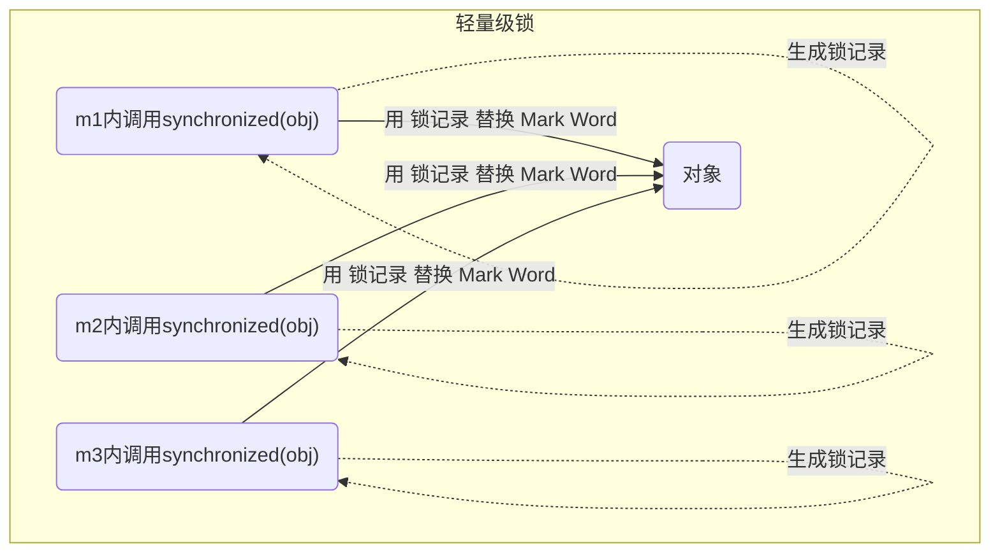
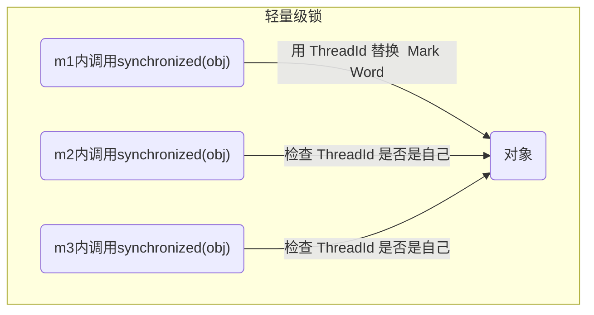

# Monitor & synchronized 原理

## Monitor—管程/监视器 🔥

### Java 对象头形式 🔥

::: tip 参考资料

- [简书](https://www.jianshu.com/p/3d38cba67f8b)

- [markOop.hpp](https://link.jianshu.com/?t=https%3A%2F%2Fgithub.com%2Fdmlloyd%2Fopenjdk%2Fblob%2Fjdk%2Fjdk%2Fsrc%2Fhotspot%2Fshare%2Foops%2FmarkOop.hpp)
- [CompressedOops](https://link.jianshu.com/?t=https%3A%2F%2Fwiki.openjdk.java.net%2Fdisplay%2FHotSpot%2FCompressedOops)
- [JVM 优化之压缩普通对象指针](https://link.jianshu.com/?t=http%3A%2F%2Fwww.iteye.com%2Ftopic%2F470404)
- [What is in java object header](https://link.jianshu.com/?t=https%3A%2F%2Fstackoverflow.com%2Fquestions%2F26357186%2Fwhat-is-in-java-object-header)

:::

由于 Java 面向对象的思想，在 JVM 中需要大量存储对象，存储时为了实现一些额外的功能，需要在对象中添加一些标记字段用于增强对象功能，这些标记字段组成了对象头。

JVM 中对象头的方式有以下两种，以 32 位虚拟机为例

普通对象（包括 2 个部分）：

```
|--------------------------------------------------------------|
|                     Object Header (64 bits)                  |
|------------------------------------|-------------------------|
|        Mark Word (32 bits)         |    Klass Word (32 bits) |
|------------------------------------|-------------------------|
```

由此可得出，int 占用 4 字节，Integer 占用 4+8 = 12 字节

数组对象（包括 3 个部分）

```
|---------------------------------------------------------------------------------|
|                                 Object Header (96 bits)                         |
|--------------------------------|-----------------------|------------------------|
|        Mark Word(32bits)       |    Klass Word(32bits) |  array length(32bits)  |
|--------------------------------|-----------------------|------------------------|
```

#### Mark Word 🔥

这部分主要用来存储对象自身的运行时数据，如 hashcode、gc 分代年龄等。`mark word`的位长度为 JVM 的一个 Word 大小，也就是说 32 位 JVM 的`Mark word`为 32 位，64 位 JVM 为 64 位。
为了让一个字大小存储更多的信息，JVM 将字的最低两个位设置为标记位，不同标记位下的 Mark Word 示意如下：

```
|-------------------------------------------------------|--------------------|
|                  Mark Word (32 bits)                  |       State        |
|-------------------------------------------------------|--------------------|
| identity_hashcode:25 | age:4 | biased_lock:1 | lock:2 |       Normal       |
|-------------------------------------------------------|--------------------|
|  thread:23 | epoch:2 | age:4 | biased_lock:1 | lock:2 |       Biased       |
|-------------------------------------------------------|--------------------|
|               ptr_to_lock_record:30          | lock:2 | Lightweight Locked |
|-------------------------------------------------------|--------------------|
|               ptr_to_heavyweight_monitor:30  | lock:2 | Heavyweight Locked |
|-------------------------------------------------------|--------------------|
|                                              | lock:2 |    Marked for GC   |
|-------------------------------------------------------|--------------------|
```

**lock**:2 位的锁状态标记位，由于希望用尽可能少的二进制位表示尽可能多的信息，所以设置了 lock 标记。该标记的值不同，整个 mark word 表示的含义不同。

| biased_lock | lock |   状态   |
| :---------: | :--: | :------: |
|      0      |  01  |   无锁   |
|      1      |  01  |  偏向锁  |
|      0      |  00  | 轻量级锁 |
|      0      |  10  | 重量级锁 |
|      0      |  11  | GC 标记  |

**biased_lock**：对象是否启用偏向锁标记，只占 1 个二进制位。为 1 时表示对象启用偏向锁，为 0 时表示对象没有偏向锁。
**age**：4 位的 Java 对象年龄。在 GC 中，如果对象在 Survivor 区复制一次，年龄增加 1。当对象达到设定的阈值时，将会晋升到老年代。默认情况下，并行 GC 的年龄阈值为 15，并发 GC 的年龄阈值为 6。由于 age 只有 4 位，所以最大值为 15，这就是`-XX:MaxTenuringThreshold`选项最大值为 15 的原因。
**identity_hashcode**：25 位的对象标识 Hash 码，采用延迟加载技术。调用方法`System.identityHashCode()`计算，并会将结果写到该对象头中。当对象被锁定时，该值会移动到管程 Monitor 中。
**thread**：持有偏向锁的线程 ID。
**epoch**：偏向时间戳。
**ptr_to_lock_record**：指向栈中锁记录的指针。
**ptr_to_heavyweight_monitor**：指向管程 Monitor 的指针。

64 位下的标记字与 32 位的相似：

```
|------------------------------------------------------------------------------|--------------------|
|                                  Mark Word (64 bits)                         |       State        |
|------------------------------------------------------------------------------|--------------------|
| unused:25 | identity_hashcode:31 | unused:1 | age:4 | biased_lock:1 | lock:2 |       Normal       |
|------------------------------------------------------------------------------|--------------------|
| thread:54 |       epoch:2        | unused:1 | age:4 | biased_lock:1 | lock:2 |       Biased       |
|------------------------------------------------------------------------------|--------------------|
|                       ptr_to_lock_record:62                         | lock:2 | Lightweight Locked |
|------------------------------------------------------------------------------|--------------------|
|                     ptr_to_heavyweight_monitor:62                   | lock:2 | Heavyweight Locked |
|------------------------------------------------------------------------------|--------------------|
|                                                                     | lock:2 |    Marked for GC   |
|------------------------------------------------------------------------------|--------------------|
```

#### Klass Word

这一部分用于**存储对象的类型指针**，该指针**指向它的类元数据**，**JVM 通过这个指针确定对象是哪个类的实例**。该指针的位长度为 JVM 的一个字大小，即 32 位的 JVM 为 32 位，64 位的 JVM 为 64 位。
如果应用的对象过多，使用 64 位的指针将浪费大量内存，统计而言，64 位的 JVM 将会比 32 位的 JVM 多耗费 50%的内存。为了节约内存可以使用选项`+UseCompressedOops`开启指针压缩，其中，oop 即 ordinary object pointer 普通对象指针。开启该选项后，下列指针将压缩至 32 位：

1.  每个 Class 的属性指针（即静态变量）
2.  每个对象的属性指针（即对象变量）
3.  普通对象数组的每个元素指针

当然，也不是所有的指针都会压缩，一些特殊类型的指针 JVM 不会优化，比如指向 PermGen 的 Class 对象指针(JDK8 中指向元空间的 Class 对象指针)、本地变量、堆栈元素、入参、返回值和 NULL 指针等。

#### array length

如果对象是一个数组，那么对象头还需要有额外的空间用于存储数组的长度，这部分数据的长度也随着 JVM 架构的不同而不同：32 位的 JVM 上，长度为 32 位；64 位 JVM 则为 64 位。64 位 JVM 如果开启`+UseCompressedOops`选项，**该区域长度也将由 64 位压缩至 32 位**。

### Monitor 工作原理 🔥

Monitor 被翻译为**监视器**或**管程**，OS 中的概念。每个 Java 对象（此时可以称为**锁对象**）都可以关联一个 Monitor 对象，如果使用 synchronized 给对象上锁（重量级）之后，该对象头的 Mark Word 中就被设置指向 Monitor 对象的指针

<iframe id="embed_dom" name="embed_dom" frameborder="0" style="display:block;width:100%; height:645px;" src="https://www.processon.com/embed/602e422c07912934224cfe8d"></iframe>

- 刚开始 Monitor 中 Owner 为 null
- 当 Thread-2 执行 synchronized(obj) 就会将 Monitor 的所有者 Owner 置为 Thread-2，Monitor 中只能有一个 Owner
- 在 Thread-2 上锁的过程中，如果 Thread-3，Thread-4，Thread-5 也来执行 synchronized(obj)，就会进入 EntryList BLOCKED
- Thread-2 执行完同步代码块的内容，然后唤醒 EntryList 中等待的线程来竞争锁，竞争的时是非公平的
- 图中 WaitSet 中的 Thread-0，Thread-1 是之前获得过锁，但条件不满足进入 WAITING 状态的线程，后面讲 wait-notify 时会分析

::: tip 注意

- synchronized 必须是**进入同一个对象（同一把锁）的 monitor** 才有上述的效果。

- 不加 synchronized 的对象不会关联监视器，不遵从以上规则

:::

## synchronized 字节码 🔥

```java
public class Test {
    static final Object lock = new Object();
    static int counter = 0;
    public static void main(String[] args) {
        synchronized (lock) {
            counter++;
        }
    }
}
```

其对应的字节码如下：

```java
public static void main(java.lang.String[]);
	descriptor: ([Ljava/lang/String;)V
	flags: ACC_PUBLIC, ACC_STATIC
	Code:
		stack=2, locals=3, args_size=1
			0: getstatic #2 // <- lock引用 （synchronized开始）
            3: dup // 复制一份
            4: astore_1 // lock引用 -> slot 1。保存到slot1变量槽中，为了解锁
            5: monitorenter // 将 lock对象 MarkWord 置为 Monitor 指针，这里底层是c调用。这里就是synchronized代码了
            6: getstatic #3 // <- i
            9: iconst_1 // 准备常数 1
            10: iadd // +1
            11: putstatic #3 // -> i
            14: aload_1 // <- lock引用。拿到该引用
            15: monitorexit // 将 lock对象 MarkWord 重置, 唤醒 EntryList
            16: goto 24
            // 锁中异常，将锁释放
            19: astore_2 // e -> slot 2
            20: aload_1 // <- lock引用
            21: monitorexit // 将 lock对象 MarkWord 重置(有hashcode等等), 唤醒 EntryList
            22: aload_2 // <- slot 2 (e)
            23: athrow // throw e
            // 锁中异常，将锁释放
            24: return
        Exception table:
			from to target type
			6 16 19 any
			19 22 19 any
		LineNumberTable:
			line 8: 0
			line 9: 6
			line 10: 14
			line 11: 24
		LocalVariableTable:
			Start Length Slot Name Signature
			0 25 0 args [Ljava/lang/String;
		StackMapTable: number_of_entries = 2
			frame_type = 255 /* full_frame */
				offset_delta = 19
				locals = [ class "[Ljava/lang/String;", class java/lang/Object ]
				stack = [ class java/lang/Throwable ]
			frame_type = 250 /* chop */
				offset_delta = 4
```

::: tip 注意
方法级别的 synchronized 不会在字节码指令中有所体现

:::

## 小故事

JDK 从 6 开始对锁进行了改进

故事角色

- 老王 - JVM

- 小南 - 线程
- 小女 - 线程
- 房间 - 对象
- 房间门上 - 防盗锁 - Monitor
- 房间门上 - 小南书包 - 轻量级锁
- 房间门上 - 刻上小南大名 - 偏向锁
- 批量重刻名 - 一个类的偏向锁撤销到达 20 阈值
- 不能刻名字 - 批量撤销该类对象的偏向锁，设置该类不可偏向

## synchronized 原理—轻量级锁 🔥

轻量级锁的**使用场景**：如果一个对象虽然有多线程要加锁，但**加锁的时间是错开的（也就是没有竞争）**，那么可以使用轻量级锁来优化。

轻量级锁对使用者是透明的，即语法仍然是 synchronized

假设有两个方法同步块，利用同一个对象加锁

```java
static final Object obj = new Object();
public static void method1() {
    synchronized( obj ) {
        // 同步块 A
        method2();
    }
}
public static void method2() {
    synchronized( obj ) {
        // 同步块 B
    }
}
```

<iframe id="embed_dom" name="embed_dom" frameborder="0" style="display:block;width:100%; height:1545px;" src="https://www.processon.com/embed/602e5a0ef346fb64f569accc"></iframe>

## synchronized 原理—锁膨胀 🔥

如果在尝试加轻量级锁的过程中，CAS 操作无法成功，这时一种情况就是有其它线程为此对象加上了轻量级锁（有竞争），这时需要进行锁膨胀，将轻量级锁变为重量级锁（让解锁操作接下来的解锁操作进入到重量级锁的解锁）。

```java
public class Test {
    static Object obj = new Object();
    public static void method1() {
        synchronized( obj ) {
            // 同步块
        }
    }
}
```

<iframe id="embed_dom" name="embed_dom" frameborder="0" style="display:block;width:100%; height:745px;" src="https://www.processon.com/embed/602e8eaa07912934224d5784"></iframe>

## synchronized 原理—自旋优化（优化重量级锁） 🔥

**重量级锁竞争**的时候，还可以使用自旋来进行优化，**如果当前线程自旋成功（即这时候持锁线程已经退出了同步块，释放了锁），这时当前线程就可以避免阻塞，避免线程上下文切换**。

::: tip 线程切换

线程的阻塞唤醒需要从用户态切换到内核态，然后内核态切换 tcb，切到另一个线程的内核态，再从内核态进入用户态，这是一个重量级的操作

:::

自旋重试成功的情况：

| 线程 1（core1 上）       | 对象 Mark              | 线程 2（core2 上）       |
| ------------------------ | ---------------------- | ------------------------ |
| -                        | 10（重量锁）           | -                        |
| 访问同步块，获取 monitor | 10（重量锁）重量锁指针 | -                        |
| 成功（加锁）             | 10（重量锁）重量锁指针 | -                        |
| 执行同步块               | 10（重量锁）重量锁指针 | -                        |
| 执行同步块               | 10（重量锁）重量锁指针 | 访问同步块，获取 monitor |
| 执行同步块               | 10（重量锁）重量锁指针 | 自旋重试                 |
| 执行完毕                 | 10（重量锁）重量锁指针 | 自旋重试                 |
| 成功（解锁）             | 01（无锁）             | 自旋重试                 |
| -                        | 10（重量锁）重量锁指针 | 成功（加锁）             |
| -                        | 10（重量锁）重量锁指针 | 执行同步块               |
| -                        | ...                    | ...                      |

自旋重试失败的情况：

| 线程 1（core1 上）       | 对象 Mark              | 线程 2（core2 上）       |
| ------------------------ | ---------------------- | ------------------------ |
| -                        | 10（重量锁）           | -                        |
| 访问同步块，获取 monitor | 10（重量锁）重量锁指针 | -                        |
| 成功（加锁）             | 10（重量锁）重量锁指针 | -                        |
| 执行同步块               | 10（重量锁）重量锁指针 | -                        |
| 执行同步块               | 10（重量锁）重量锁指针 | 访问同步块，获取 monitor |
| 执行同步块               | 10（重量锁）重量锁指针 | 自旋重试                 |
| 执行同步块               | 10（重量锁）重量锁指针 | 自旋重试                 |
| 执行同步块               | 10（重量锁）重量锁指针 | 自旋重试                 |
| 执行同步块               | 10（重量锁）重量锁指针 | 阻塞                     |
| -                        | ...                    | ...                      |

- **自旋会占用 CPU 时间**，单核 CPU 自旋就是浪费，**多核 CPU 自旋才能发挥优势**。
- 在 Java 6 之后自旋锁是自适应的，比如对象刚刚的一次自旋操作成功过，那么认为这次自旋成功的可能性会高，就多自旋几次；反之，就少自旋甚至不自旋，总之，比较智能。
- Java 7 之后不能控制是否开启自旋功能

## synchronized 原理—偏向锁（优化轻量级锁 CAS） 🔥

### 优化轻量级锁 CAS 🔥

**轻量级锁在没有竞争时（就自己这个线程），每次重入仍然需要执行 CAS 操作（还需再次记录 lock record）。**

Java 6 中引入了偏向锁来做进一步优化：**只有第一次使用 CAS 时就将线程 ID 设置到对象的 Mark Word 头**，之后发现这个线程 ID 是自己的就表示没有竞争，不用重新 CAS。以后只要不发生竞争，这个对象就归该线程所有

例如：

```java
public class Test {
    static final Object obj = new Object();
    public static void m1() {
        synchronized( obj ) {
            // 同步块 A
            m2();
        }
    }
    public static void m2() {
        synchronized( obj ) {
            // 同步块 B
            m3();
        }
    }
    public static void m3() {
        synchronized( obj ) {
        }
        // 同步块 C
    }
}
```





### 偏向状态

回忆一下对象头格式

```
|------------------------------------------------------------------------------|--------------------|
|                                  Mark Word (64 bits)                         |       State        |
|------------------------------------------------------------------------------|--------------------|
| unused:25 | identity_hashcode:31 | unused:1 | age:4 | biased_lock:1 | lock:2 |       Normal       |
|------------------------------------------------------------------------------|--------------------|
| thread:54 |       epoch:2        | unused:1 | age:4 | biased_lock:1 | lock:2 |       Biased       |
|------------------------------------------------------------------------------|--------------------|
|                       ptr_to_lock_record:62                         | lock:2 | Lightweight Locked |
|------------------------------------------------------------------------------|--------------------|
|                     ptr_to_heavyweight_monitor:62                   | lock:2 | Heavyweight Locked |
|------------------------------------------------------------------------------|--------------------|
|                                                                     | lock:2 |    Marked for GC   |
|------------------------------------------------------------------------------|--------------------|
```

一个对象创建时：

- 如果开启了偏向锁（默认开启），那么**对象创建后，markword 值为 0x05 即最后 3 位为 101**，这时它的 thread、epoch、age 都为 0，加锁时才会改变

- **偏向锁是默认是延迟的**，不会在程序启动时立即生效，如果想避免延迟，可以加 VM 参数

  `-XX:BiasedLockingStartupDelay=0` 来禁用延迟

- 如果没有开启偏向锁，那么对象创建后，Mark Word 值为 0x01 即最后 3 位为 001，这时它的 hashcode、age 都为 0，第一次用到 hashcode 时才会赋值

查看 Java 对象头需要借助 openjdk 提供的工具

```xml
<!-- https://mvnrepository.com/artifact/org.openjdk.jol/jol-core -->
<dependency>
    <groupId>org.openjdk.jol</groupId>
    <artifactId>jol-core</artifactId>
    <version>0.14</version>
    <scope>provided</scope>
</dependency>
```

### 测试延迟性

```java
@Slf4j(topic = "TestBiasedLock")
public class TestBiasedLock {

    public static void main(String[] args) throws InterruptedException {
        test1();
    }

    /**
     * 测试101
     */
    private static void test1(){
        log.debug(ClassLayout.parseInstance(new Dog()).toPrintable());

        // 偏向锁是默认是延迟的，不会在程序启动时立即生效。VM参数可以解决-XX:BiasedLockingStartupDelay=0
        // 或睡一会。TimeUnit.SECONDS.sleep(5);
        log.debug(ClassLayout.parseInstance(new Dog()).toPrintable());
    }
}

class Dog {

}
```

结果如下（从左往右，从上到下都是倒排的）：

```
21:21:16.604 [main] DEBUG TestBiasedLock - _999_demo.Dog object internals:
 OFFSET  SIZE   TYPE DESCRIPTION                               VALUE
      0     4        (object header)                           05 00 00 00 (00000101 00000000 00000000 00000000) (5)
      4     4        (object header)                           00 00 00 00 (00000000 00000000 00000000 00000000) (0)
      8     4        (object header)                           22 dc 00 f8 (00100010 11011100 00000000 11111000) (-134161374)
     12     4        (loss due to the next object alignment)
Instance size: 16 bytes
Space losses: 0 bytes internal + 4 bytes external = 4 bytes total
```

### 测试加锁

```java
@Slf4j(topic = "TestBiasedLock")
public class TestBiasedLock {

    public static void main(String[] args) throws InterruptedException {
        test2();
    }

    private static void test2() {
        Dog d = new Dog();
        ClassLayout classLayout = ClassLayout.parseInstance(d);
        new Thread(() -> {
            log.debug("synchronized 加锁前\n{}", classLayout.toPrintable());
            synchronized (d) {
                log.debug("synchronized 加锁中\n{}", classLayout.toPrintable());
            }
            log.debug("synchronized 加锁后\n{}",classLayout.toPrintable());
        }, "t1").start();
    }
}

class Dog {

}
```

结果如下（从左往右，从上到下都是倒排的，同一字节中是按照正常顺序排列）：

```
21:22:16.638 [t1] DEBUG TestBiasedLock - synchronized 加锁前
_999_demo.Dog object internals:
 OFFSET  SIZE   TYPE DESCRIPTION                               VALUE
      0     4        (object header)                           05 00 00 00 (00000101 00000000 00000000 00000000) (5)
      4     4        (object header)                           00 00 00 00 (00000000 00000000 00000000 00000000) (0)
      8     4        (object header)                           22 dc 00 f8 (00100010 11011100 00000000 11111000) (-134161374)
     12     4        (loss due to the next object alignment)
Instance size: 16 bytes
Space losses: 0 bytes internal + 4 bytes external = 4 bytes total

21:22:16.643 [t1] DEBUG TestBiasedLock - synchronized 加锁中
_999_demo.Dog object internals:
 OFFSET  SIZE   TYPE DESCRIPTION                               VALUE
      0     4        (object header)                           05 b8 19 86 (00000101 10111000 00011001 10000110) (-2045134843)
      4     4        (object header)                           a4 7f 00 00 (10100100 01111111 00000000 00000000) (32676)
      8     4        (object header)                           22 dc 00 f8 (00100010 11011100 00000000 11111000) (-134161374)
     12     4        (loss due to the next object alignment)
Instance size: 16 bytes
Space losses: 0 bytes internal + 4 bytes external = 4 bytes total

21:22:16.644 [t1] DEBUG TestBiasedLock - synchronized 加锁后
_999_demo.Dog object internals:
 OFFSET  SIZE   TYPE DESCRIPTION                               VALUE
      0     4        (object header)                           05 b8 19 86 (00000101 10111000 00011001 10000110) (-2045134843)
      4     4        (object header)                           a4 7f 00 00 (10100100 01111111 00000000 00000000) (32676)
      8     4        (object header)                           22 dc 00 f8 (00100010 11011100 00000000 11111000) (-134161374)
     12     4        (loss due to the next object alignment)
Instance size: 16 bytes
Space losses: 0 bytes internal + 4 bytes external = 4 bytes total
```

其中 00000000 00000000 01111111 10100100 10000110 00011001 100111 是线程 id（OS 分配的，和 Java 不一样）。只有第二次及之后才有。处于偏向锁的对象解锁后，线程 id 仍存储于对象头中

### 禁用偏向锁

偏向锁适用于，竞争非常少的情况。当应用是一个多线程非常多的，此时应该禁用掉

添加 VM 参数 `-XX:-UseBiasedLocking` 禁用偏向锁。因为变量前是 `-` 所以关闭了，若是`+`则开启

结果如下（从左往右，从上到下都是倒排的，同一字节中是按照正常顺序排列）：

```
01:57:17.769 [t1] DEBUG TestBiasedLock - synchronized 加锁前
_999_demo.Dog object internals:
 OFFSET  SIZE   TYPE DESCRIPTION                               VALUE
      0     4        (object header)                           01 00 00 00 (00000001 00000000 00000000 00000000) (1)
      4     4        (object header)                           00 00 00 00 (00000000 00000000 00000000 00000000) (0)
      8     4        (object header)                           22 dc 00 f8 (00100010 11011100 00000000 11111000) (-134161374)
     12     4        (loss due to the next object alignment)
Instance size: 16 bytes
Space losses: 0 bytes internal + 4 bytes external = 4 bytes total

01:57:17.775 [t1] DEBUG TestBiasedLock - synchronized 加锁中
_999_demo.Dog object internals:
 OFFSET  SIZE   TYPE DESCRIPTION                               VALUE
      0     4        (object header)                           00 b9 6d 06 (00000000 10111001 01101101 00000110) (107854080)
      4     4        (object header)                           00 70 00 00 (00000000 01110000 00000000 00000000) (28672)
      8     4        (object header)                           22 dc 00 f8 (00100010 11011100 00000000 11111000) (-134161374)
     12     4        (loss due to the next object alignment)
Instance size: 16 bytes
Space losses: 0 bytes internal + 4 bytes external = 4 bytes total

01:57:17.776 [t1] DEBUG TestBiasedLock - synchronized 加锁后
_999_demo.Dog object internals:
 OFFSET  SIZE   TYPE DESCRIPTION                               VALUE
      0     4        (object header)                           01 00 00 00 (00000001 00000000 00000000 00000000) (1)
      4     4        (object header)                           00 00 00 00 (00000000 00000000 00000000 00000000) (0)
      8     4        (object header)                           22 dc 00 f8 (00100010 11011100 00000000 11111000) (-134161374)
     12     4        (loss due to the next object alignment)
Instance size: 16 bytes
Space losses: 0 bytes internal + 4 bytes external = 4 bytes total
```

可以看到，加锁中最后为`000`即轻量锁。加锁前后为`001`即无锁（**除了偏向锁其他锁执行完后都是`001`无锁状态**）

### 撤销偏向锁—锁对象调用 hashCode

调用了对象的 hashCode，但**偏向锁的对象 MarkWord 中存储的是线程 id**，如果调用 hashCode 会导致偏向锁被撤销（不够存线程 ID），**升级为轻量锁**。

- **轻量级锁的 hashCode 会在无锁 CAS 转为轻量锁时记录到锁记录中**

- **重量级锁会在 Monitor 中记录 hashCode**

测试在调用 hashCode 后使用偏向锁，记得去掉 `-XX:-UseBiasedLocking`，加上

`-XX:BiasedLockingStartupDelay=0`

```java
@Slf4j(topic = "TestBiasedLock")
public class TestBiasedLock {

    public static void main(String[] args) throws InterruptedException {
        test2();
    }

    private static void test2() {
        Dog d = new Dog();
        d.hashCode();
        ClassLayout classLayout = ClassLayout.parseInstance(d);
        new Thread(() -> {
            log.debug("synchronized 加锁前\n{}", classLayout.toPrintable());
            synchronized (d) {
                log.debug("synchronized 加锁中\n{}", classLayout.toPrintable());
            }
            log.debug("synchronized 加锁后\n{}",classLayout.toPrintable());
        }, "t1").start();
    }
}

class Dog {

}
```

结果如下（从左往右，从上到下都是倒排的，同一字节中是按照正常顺序排列）：

```
21:25:59.886 [t1] DEBUG TestBiasedLock - synchronized 加锁前
_999_demo.Dog object internals:
 OFFSET  SIZE   TYPE DESCRIPTION                               VALUE
      0     4        (object header)                           01 18 94 ad (00000001 00011000 10010100 10101101) (-1382803455)
      4     4        (object header)                           20 00 00 00 (00100000 00000000 00000000 00000000) (32)
      8     4        (object header)                           22 de 00 f8 (00100010 11011110 00000000 11111000) (-134160862)
     12     4        (loss due to the next object alignment)
Instance size: 16 bytes
Space losses: 0 bytes internal + 4 bytes external = 4 bytes total

21:25:59.890 [t1] DEBUG TestBiasedLock - synchronized 加锁中
_999_demo.Dog object internals:
 OFFSET  SIZE   TYPE DESCRIPTION                               VALUE
      0     4        (object header)                           00 b9 c5 03 (00000000 10111001 11000101 00000011) (63289600)
      4     4        (object header)                           00 70 00 00 (00000000 01110000 00000000 00000000) (28672)
      8     4        (object header)                           22 de 00 f8 (00100010 11011110 00000000 11111000) (-134160862)
     12     4        (loss due to the next object alignment)
Instance size: 16 bytes
Space losses: 0 bytes internal + 4 bytes external = 4 bytes total

21:25:59.890 [t1] DEBUG TestBiasedLock - synchronized 加锁后
_999_demo.Dog object internals:
 OFFSET  SIZE   TYPE DESCRIPTION                               VALUE
      0     4        (object header)                           01 18 94 ad (00000001 00011000 10010100 10101101) (-1382803455)
      4     4        (object header)                           20 00 00 00 (00100000 00000000 00000000 00000000) (32)
      8     4        (object header)                           22 de 00 f8 (00100010 11011110 00000000 11111000) (-134160862)
     12     4        (loss due to the next object alignment)
Instance size: 16 bytes
Space losses: 0 bytes internal + 4 bytes external = 4 bytes total
```

加锁前后都是`001`即无锁，加锁中为`000`轻量锁，**轻量锁执行完后都是`001`无锁状态**

### 撤销偏向锁—锁竞争—其他线程使用锁 🔥

当有**其它线程使用偏向锁对象**时，会**将偏向锁升级为轻量级锁**。因为偏向锁本来是让该线程一直使用的，但是发生竞争，需**升级为轻量锁**

需要控制线程交替执行！

```java
@Slf4j(topic = "TestBiasedLock")
public class TestBiasedLock {

    public static void main(String[] args) {
        test3();
    }

    /**
     * 其他线程使用对象 撤销偏向锁
     */
    private static void test3() {
        Dog d = new Dog();
        ClassLayout classLayout = ClassLayout.parseInstance(d);
        Thread t1 = new Thread(() -> {
            log.debug("t1 synchronized 加锁前\n{}", classLayout.toPrintable());
            synchronized (d) {
                log.debug("t1 synchronized 加锁中\n{}", classLayout.toPrintable());
            }
            log.debug("t1 synchronized 加锁后\n{}", classLayout.toPrintable());

            // 这里和 wait、notify 撤销偏向锁不一样哦，因为锁对象都不一样！
            // t1 执行完再唤醒 t2（用同一把锁）。此时wait、notify不是重量锁
            synchronized (TestBiasedLock.class) {
                TestBiasedLock.class.notify();
            }

        }, "t1");
        t1.start();

        // 结果是要让t2先执行哦，可以放到t1前
        Thread t2 = new Thread(() -> {
            // 这里和 wait、notify 撤销偏向锁不一样哦，因为锁对象都不一样！
            // 等待唤醒
            synchronized (TestBiasedLock.class) {
                try {
                    TestBiasedLock.class.wait();
                } catch (InterruptedException e) {
                    e.printStackTrace();
                }
            }

            log.debug("t2 synchronized 加锁前\n{}", classLayout.toPrintable());
            synchronized (d) {
                log.debug("t2 synchronized 加锁中\n{}", classLayout.toPrintable());
            }
            log.debug("t2 synchronized 加锁后\n{}", classLayout.toPrintable());
        }, "t2");
        t2.start();
    }
}

class Dog {

}
```

结果如下（从左往右，从上到下都是倒排的，同一字节中是按照正常顺序排列）：

```
21:20:40.564 [t1] DEBUG TestBiasedLock - t1 synchronized 加锁前
_999_demo.Dog object internals:
 OFFSET  SIZE   TYPE DESCRIPTION                               VALUE
      0     4        (object header)                           05 00 00 00 (00000101 00000000 00000000 00000000) (5)
      4     4        (object header)                           00 00 00 00 (00000000 00000000 00000000 00000000) (0)
      8     4        (object header)                           22 dc 00 f8 (00100010 11011100 00000000 11111000) (-134161374)
     12     4        (loss due to the next object alignment)
Instance size: 16 bytes
Space losses: 0 bytes internal + 4 bytes external = 4 bytes total

21:20:40.569 [t1] DEBUG TestBiasedLock - t1 synchronized 加锁中
_999_demo.Dog object internals:
 OFFSET  SIZE   TYPE DESCRIPTION                               VALUE
      0     4        (object header)                           05 08 17 cc (00000101 00001000 00010111 11001100) (-870905851)
      4     4        (object header)                           cf 7f 00 00 (11001111 01111111 00000000 00000000) (32719)
      8     4        (object header)                           22 dc 00 f8 (00100010 11011100 00000000 11111000) (-134161374)
     12     4        (loss due to the next object alignment)
Instance size: 16 bytes
Space losses: 0 bytes internal + 4 bytes external = 4 bytes total

21:20:40.570 [t1] DEBUG TestBiasedLock - t1 synchronized 加锁后
_999_demo.Dog object internals:
 OFFSET  SIZE   TYPE DESCRIPTION                               VALUE
      0     4        (object header)                           05 08 17 cc (00000101 00001000 00010111 11001100) (-870905851)
      4     4        (object header)                           cf 7f 00 00 (11001111 01111111 00000000 00000000) (32719)
      8     4        (object header)                           22 dc 00 f8 (00100010 11011100 00000000 11111000) (-134161374)
     12     4        (loss due to the next object alignment)
Instance size: 16 bytes
Space losses: 0 bytes internal + 4 bytes external = 4 bytes total
```

由上面状态 101、101、101、101、000、001 改变可以得出 t1 线程都是偏向锁，t2 线程加锁前、中、后分别为偏向锁、轻量锁（竞争导致锁升级）、无锁。**轻量锁执行完后都是`001`无锁状态**

### 撤销偏向锁—锁对象调用 wait/notify

**wait/notify 机制只有重量级锁才有！只要调用了就变为重量级锁**

```java
@Slf4j(topic = "TestBiasedLock")
public class TestBiasedLock {

    public static void main(String[] args) {
        test4();
    }

    /**
     * 撤销偏向锁—锁对象调用 wait/notify
     */
    private static void test4() {
        Dog d = new Dog();
        ClassLayout classLayout = ClassLayout.parseInstance(d);

        // 结果是要让t1先执行哦
        Thread t1 = new Thread(() -> {
            log.debug("t1 synchronized 加锁前\n{}", classLayout.toPrintable());
            synchronized (d) {
                log.debug("t1 synchronized 加锁中\n{}", classLayout.toPrintable());
                try {
                    // 等待
                    d.wait();
                } catch (InterruptedException e) {
                    e.printStackTrace();
                }
            }
            log.debug("t1 synchronized 加锁后\n{}", classLayout.toPrintable());
        }, "t1");
        t1.start();


        Thread t2 = new Thread(() -> {
            try {
                TimeUnit.SECONDS.sleep(5);
            } catch (InterruptedException e) {
                e.printStackTrace();
            }

            synchronized (d){
                log.debug("t2 notify");
                d.notify();
            }

        }, "t2");
        t2.start();
    }
}

class Dog {

}
```

结果如下（从左往右，从上到下都是倒排的，同一字节中是按照正常顺序排列）：

```
21:48:53.705 [t1] DEBUG TestBiasedLock - t1 synchronized 加锁前
_999_demo.Dog object internals:
 OFFSET  SIZE   TYPE DESCRIPTION                               VALUE
      0     4        (object header)                           05 00 00 00 (00000101 00000000 00000000 00000000) (5)
      4     4        (object header)                           00 00 00 00 (00000000 00000000 00000000 00000000) (0)
      8     4        (object header)                           22 dc 00 f8 (00100010 11011100 00000000 11111000) (-134161374)
     12     4        (loss due to the next object alignment)
Instance size: 16 bytes
Space losses: 0 bytes internal + 4 bytes external = 4 bytes total

21:48:53.710 [t1] DEBUG TestBiasedLock - t1 synchronized 加锁中
_999_demo.Dog object internals:
 OFFSET  SIZE   TYPE DESCRIPTION                               VALUE
      0     4        (object header)                           05 08 83 5e (00000101 00001000 10000011 01011110) (1585645573)
      4     4        (object header)                           f9 7f 00 00 (11111001 01111111 00000000 00000000) (32761)
      8     4        (object header)                           22 dc 00 f8 (00100010 11011100 00000000 11111000) (-134161374)
     12     4        (loss due to the next object alignment)
Instance size: 16 bytes
Space losses: 0 bytes internal + 4 bytes external = 4 bytes total

21:48:58.703 [t2] DEBUG TestBiasedLock - t2 notify
21:48:58.706 [t1] DEBUG TestBiasedLock - t1 synchronized notify 后
_999_demo.Dog object internals:
 OFFSET  SIZE   TYPE DESCRIPTION                               VALUE
      0     4        (object header)                           fa 93 01 5e (11111010 10010011 00000001 01011110) (1577161722)
      4     4        (object header)                           f9 7f 00 00 (11111001 01111111 00000000 00000000) (32761)
      8     4        (object header)                           22 dc 00 f8 (00100010 11011100 00000000 11111000) (-134161374)
     12     4        (loss due to the next object alignment)
Instance size: 16 bytes
Space losses: 0 bytes internal + 4 bytes external = 4 bytes total
```

上面的状态：加锁前 101 偏向锁、加锁中 101 偏向锁、nofity 后 010 重量级锁（锁膨胀），**重量锁不会撤销标记**、因为**重量级锁是根据 monitor 的 owner 来判断锁状态的**

### 批量重偏向—同一类的对象撤销后第 20 次

都是**撤销**操作阈值

如果对象虽然被多个线程访问，但没有竞争，这时偏向了线程 T1 的对象仍有机会重新偏向 T2，**重偏向会重置对象的 Thread ID**。当**撤销偏向锁阈值超过 20 次**后，jvm 会这样觉得，我是不是偏向错了呢，于是会在给这些对象加锁时**不会撤销锁而是重新偏向至加锁线程**。**没超过阈值前，由于锁竞争会升级为轻量级锁，最终执行完后清空 Thread ID，并将锁状态置为`001`即无锁状态**

```java
@Slf4j(topic = "TestBiasedLock")
public class TestBiasedLock {

    public static void main(String[] args) {
        test5();
    }

    /**
     * 批量重偏向
     */
    private static void test5() {
        Vector<Dog> list = new Vector<>();
        Thread t1 = new Thread(() -> {
            for (int i = 0; i < 30; i++) {
                Dog d = new Dog();
                list.add(d);
                synchronized (d) {
                    log.debug(i + "\t" + ClassLayout.parseInstance(d).toPrintable());
                }
            }
            synchronized (list) {
                list.notify();
            }
        }, "t1");
        t1.start();

        Thread t2 = new Thread(() -> {
            synchronized (list) {
                try {
                    list.wait();
                } catch (InterruptedException e) {
                    e.printStackTrace();
                }
            }
            log.debug("===============> ");
            for (int i = 0; i < 30; i++) {
                Dog d = list.get(i);
                log.debug(i + "\t" + ClassLayout.parseInstance(d).toPrintable());
                synchronized (d) {
                    log.debug(i + "\t" + ClassLayout.parseInstance(d).toPrintable());
                }
                log.debug(i + "\t" + ClassLayout.parseInstance(d).toPrintable());
            }
        }, "t2");
        t2.start();
    }
}

class Dog {

}
```

结果如下（老师简化后的工具类）

```
[t1] - 0 00000000 00000000 00000000 00000000 00011111 11110011 11100000 00000101
[t1] - 1 00000000 00000000 00000000 00000000 00011111 11110011 11100000 00000101
[t1] - 2 00000000 00000000 00000000 00000000 00011111 11110011 11100000 00000101
[t1] - 3 00000000 00000000 00000000 00000000 00011111 11110011 11100000 00000101
[t1] - 4 00000000 00000000 00000000 00000000 00011111 11110011 11100000 00000101
[t1] - 5 00000000 00000000 00000000 00000000 00011111 11110011 11100000 00000101
[t1] - 6 00000000 00000000 00000000 00000000 00011111 11110011 11100000 00000101
[t1] - 7 00000000 00000000 00000000 00000000 00011111 11110011 11100000 00000101
[t1] - 8 00000000 00000000 00000000 00000000 00011111 11110011 11100000 00000101
[t1] - 9 00000000 00000000 00000000 00000000 00011111 11110011 11100000 00000101
[t1] - 10 00000000 00000000 00000000 00000000 00011111 11110011 11100000 00000101
[t1] - 11 00000000 00000000 00000000 00000000 00011111 11110011 11100000 00000101
[t1] - 12 00000000 00000000 00000000 00000000 00011111 11110011 11100000 00000101
[t1] - 13 00000000 00000000 00000000 00000000 00011111 11110011 11100000 00000101
[t1] - 14 00000000 00000000 00000000 00000000 00011111 11110011 11100000 00000101
[t1] - 15 00000000 00000000 00000000 00000000 00011111 11110011 11100000 00000101
[t1] - 16 00000000 00000000 00000000 00000000 00011111 11110011 11100000 00000101
[t1] - 17 00000000 00000000 00000000 00000000 00011111 11110011 11100000 00000101
[t1] - 18 00000000 00000000 00000000 00000000 00011111 11110011 11100000 00000101
[t1] - 19 00000000 00000000 00000000 00000000 00011111 11110011 11100000 00000101
[t1] - 20 00000000 00000000 00000000 00000000 00011111 11110011 11100000 00000101
[t1] - 21 00000000 00000000 00000000 00000000 00011111 11110011 11100000 00000101
[t1] - 22 00000000 00000000 00000000 00000000 00011111 11110011 11100000 00000101
[t1] - 23 00000000 00000000 00000000 00000000 00011111 11110011 11100000 00000101
[t1] - 24 00000000 00000000 00000000 00000000 00011111 11110011 11100000 00000101
[t1] - 25 00000000 00000000 00000000 00000000 00011111 11110011 11100000 00000101
[t1] - 26 00000000 00000000 00000000 00000000 00011111 11110011 11100000 00000101
[t1] - 27 00000000 00000000 00000000 00000000 00011111 11110011 11100000 00000101
[t1] - 28 00000000 00000000 00000000 00000000 00011111 11110011 11100000 00000101
[t1] - 29 00000000 00000000 00000000 00000000 00011111 11110011 11100000 00000101
[t2] - ===============>
[t2] - 0 00000000 00000000 00000000 00000000 00011111 11110011 11100000 00000101
[t2] - 0 00000000 00000000 00000000 00000000 00100000 01011000 11110111 00000000
[t2] - 0 00000000 00000000 00000000 00000000 00000000 00000000 00000000 00000001
[t2] - 1 00000000 00000000 00000000 00000000 00011111 11110011 11100000 00000101
[t2] - 1 00000000 00000000 00000000 00000000 00100000 01011000 11110111 00000000
[t2] - 1 00000000 00000000 00000000 00000000 00000000 00000000 00000000 00000001
[t2] - 2 00000000 00000000 00000000 00000000 00011111 11110011 11100000 00000101
[t2] - 2 00000000 00000000 00000000 00000000 00100000 01011000 11110111 00000000
[t2] - 2 00000000 00000000 00000000 00000000 00000000 00000000 00000000 00000001
[t2] - 3 00000000 00000000 00000000 00000000 00011111 11110011 11100000 00000101
[t2] - 3 00000000 00000000 00000000 00000000 00100000 01011000 11110111 00000000
[t2] - 3 00000000 00000000 00000000 00000000 00000000 00000000 00000000 00000001
[t2] - 4 00000000 00000000 00000000 00000000 00011111 11110011 11100000 00000101
[t2] - 4 00000000 00000000 00000000 00000000 00100000 01011000 11110111 00000000
[t2] - 4 00000000 00000000 00000000 00000000 00000000 00000000 00000000 00000001
[t2] - 5 00000000 00000000 00000000 00000000 00011111 11110011 11100000 00000101
[t2] - 5 00000000 00000000 00000000 00000000 00100000 01011000 11110111 00000000
[t2] - 5 00000000 00000000 00000000 00000000 00000000 00000000 00000000 00000001
[t2] - 6 00000000 00000000 00000000 00000000 00011111 11110011 11100000 00000101
[t2] - 6 00000000 00000000 00000000 00000000 00100000 01011000 11110111 00000000
[t2] - 6 00000000 00000000 00000000 00000000 00000000 00000000 00000000 00000001
[t2] - 7 00000000 00000000 00000000 00000000 00011111 11110011 11100000 00000101
[t2] - 7 00000000 00000000 00000000 00000000 00100000 01011000 11110111 00000000
[t2] - 7 00000000 00000000 00000000 00000000 00000000 00000000 00000000 00000001
[t2] - 8 00000000 00000000 00000000 00000000 00011111 11110011 11100000 00000101
[t2] - 8 00000000 00000000 00000000 00000000 00100000 01011000 11110111 00000000
[t2] - 8 00000000 00000000 00000000 00000000 00000000 00000000 00000000 00000001
[t2] - 9 00000000 00000000 00000000 00000000 00011111 11110011 11100000 00000101
[t2] - 9 00000000 00000000 00000000 00000000 00100000 01011000 11110111 00000000
[t2] - 9 00000000 00000000 00000000 00000000 00000000 00000000 00000000 00000001
[t2] - 10 00000000 00000000 00000000 00000000 00011111 11110011 11100000 00000101
[t2] - 10 00000000 00000000 00000000 00000000 00100000 01011000 11110111 00000000
[t2] - 10 00000000 00000000 00000000 00000000 00000000 00000000 00000000 00000001
[t2] - 11 00000000 00000000 00000000 00000000 00011111 11110011 11100000 00000101
[t2] - 11 00000000 00000000 00000000 00000000 00100000 01011000 11110111 00000000
[t2] - 11 00000000 00000000 00000000 00000000 00000000 00000000 00000000 00000001
[t2] - 12 00000000 00000000 00000000 00000000 00011111 11110011 11100000 00000101
[t2] - 12 00000000 00000000 00000000 00000000 00100000 01011000 11110111 00000000
[t2] - 12 00000000 00000000 00000000 00000000 00000000 00000000 00000000 00000001
[t2] - 13 00000000 00000000 00000000 00000000 00011111 11110011 11100000 00000101
[t2] - 13 00000000 00000000 00000000 00000000 00100000 01011000 11110111 00000000
[t2] - 13 00000000 00000000 00000000 00000000 00000000 00000000 00000000 00000001
[t2] - 14 00000000 00000000 00000000 00000000 00011111 11110011 11100000 00000101
[t2] - 14 00000000 00000000 00000000 00000000 00100000 01011000 11110111 00000000
[t2] - 14 00000000 00000000 00000000 00000000 00000000 00000000 00000000 00000001
[t2] - 15 00000000 00000000 00000000 00000000 00011111 11110011 11100000 00000101
[t2] - 15 00000000 00000000 00000000 00000000 00100000 01011000 11110111 00000000
[t2] - 15 00000000 00000000 00000000 00000000 00000000 00000000 00000000 00000001
[t2] - 16 00000000 00000000 00000000 00000000 00011111 11110011 11100000 00000101
[t2] - 16 00000000 00000000 00000000 00000000 00100000 01011000 11110111 00000000
[t2] - 16 00000000 00000000 00000000 00000000 00000000 00000000 00000000 00000001
[t2] - 17 00000000 00000000 00000000 00000000 00011111 11110011 11100000 00000101
[t2] - 17 00000000 00000000 00000000 00000000 00100000 01011000 11110111 00000000
[t2] - 17 00000000 00000000 00000000 00000000 00000000 00000000 00000000 00000001
[t2] - 18 00000000 00000000 00000000 00000000 00011111 11110011 11100000 00000101
[t2] - 18 00000000 00000000 00000000 00000000 00100000 01011000 11110111 00000000
[t2] - 18 00000000 00000000 00000000 00000000 00000000 00000000 00000000 00000001
[t2] - 19 00000000 00000000 00000000 00000000 00011111 11110011 11100000 00000101
[t2] - 19 00000000 00000000 00000000 00000000 00011111 11110011 11110001 00000101
[t2] - 19 00000000 00000000 00000000 00000000 00011111 11110011 11110001 00000101
[t2] - 20 00000000 00000000 00000000 00000000 00011111 11110011 11100000 00000101
[t2] - 20 00000000 00000000 00000000 00000000 00011111 11110011 11110001 00000101
[t2] - 20 00000000 00000000 00000000 00000000 00011111 11110011 11110001 00000101
[t2] - 21 00000000 00000000 00000000 00000000 00011111 11110011 11100000 00000101
[t2] - 21 00000000 00000000 00000000 00000000 00011111 11110011 11110001 00000101
[t2] - 21 00000000 00000000 00000000 00000000 00011111 11110011 11110001 00000101
[t2] - 22 00000000 00000000 00000000 00000000 00011111 11110011 11100000 00000101
[t2] - 22 00000000 00000000 00000000 00000000 00011111 11110011 11110001 00000101
[t2] - 22 00000000 00000000 00000000 00000000 00011111 11110011 11110001 00000101
[t2] - 23 00000000 00000000 00000000 00000000 00011111 11110011 11100000 00000101
[t2] - 23 00000000 00000000 00000000 00000000 00011111 11110011 11110001 00000101
[t2] - 23 00000000 00000000 00000000 00000000 00011111 11110011 11110001 00000101
[t2] - 24 00000000 00000000 00000000 00000000 00011111 11110011 11100000 00000101
[t2] - 24 00000000 00000000 00000000 00000000 00011111 11110011 11110001 00000101
[t2] - 24 00000000 00000000 00000000 00000000 00011111 11110011 11110001 00000101
[t2] - 25 00000000 00000000 00000000 00000000 00011111 11110011 11100000 00000101
[t2] - 25 00000000 00000000 00000000 00000000 00011111 11110011 11110001 00000101
[t2] - 25 00000000 00000000 00000000 00000000 00011111 11110011 11110001 00000101
[t2] - 26 00000000 00000000 00000000 00000000 00011111 11110011 11100000 00000101
[t2] - 26 00000000 00000000 00000000 00000000 00011111 11110011 11110001 00000101
[t2] - 26 00000000 00000000 00000000 00000000 00011111 11110011 11110001 00000101
[t2] - 27 00000000 00000000 00000000 00000000 00011111 11110011 11100000 00000101
[t2] - 27 00000000 00000000 00000000 00000000 00011111 11110011 11110001 00000101
[t2] - 27 00000000 00000000 00000000 00000000 00011111 11110011 11110001 00000101
[t2] - 28 00000000 00000000 00000000 00000000 00011111 11110011 11100000 00000101
[t2] - 28 00000000 00000000 00000000 00000000 00011111 11110011 11110001 00000101
[t2] - 28 00000000 00000000 00000000 00000000 00011111 11110011 11110001 00000101
[t2] - 29 00000000 00000000 00000000 00000000 00011111 11110011 11100000 00000101
[t2] - 29 00000000 00000000 00000000 00000000 00011111 11110011 11110001 00000101
[t2] - 29 00000000 00000000 00000000 00000000 00011111 11110011 11110001 00000101
```

### 批量撤销—同一类对象撤销后第 40 次

都是**撤销**操作阈值

**当撤销偏向锁阈值超过 40 次后**，jvm 会这样觉得，自己确实偏向错了，根本就不该偏向。于是整个类的所有对象都会变为不可偏向的，新建的对象也是不可偏向的

```java
@Slf4j(topic = "TestBiasedLock")
public class TestBiasedLock {

    public static void main(String[] args) throws InterruptedException {
        test6();
    }

    static Thread t1, t2, t3;

    /**
     * 批量撤销
     */
    private static void test6() throws InterruptedException {

        Vector<Dog> list = new Vector<>();
        int loopNumber = 39;
        t1 = new Thread(() -> {
            for (int i = 0; i < loopNumber; i++) {
                Dog d = new Dog();
                list.add(d);
                synchronized (d) {
                    log.debug(i + "\t" + ClassLayout.parseInstance(d).toPrintable());
                }
            }
            LockSupport.unpark(t2);
        }, "t1");
        t1.start();

        t2 = new Thread(() -> {
            LockSupport.park();
            log.debug("===============> ");
            for (int i = 0; i < loopNumber; i++) {
                Dog d = list.get(i);
                log.debug(i + "\t" + ClassLayout.parseInstance(d).toPrintable());
                synchronized (d) {
                    log.debug(i + "\t" + ClassLayout.parseInstance(d).toPrintable());
                }
                log.debug(i + "\t" + ClassLayout.parseInstance(d).toPrintable());
            }
            LockSupport.unpark(t3);
        }, "t2");
        t2.start();

        t3 = new Thread(() -> {
            LockSupport.park();
            log.debug("===============> ");
            for (int i = 0; i < loopNumber; i++) {
                Dog d = list.get(i);
                log.debug(i + "\t" + ClassLayout.parseInstance(d).toPrintable());
                synchronized (d) {
                    log.debug(i + "\t" + ClassLayout.parseInstance(d).toPrintable());
                }
                log.debug(i + "\t" + ClassLayout.parseInstance(d).toPrintable());
            }
        }, "t3");
        t3.start();

        t3.join();
        log.debug(ClassLayout.parseInstance(new Dog()).toPrintable());

    }
}

class Dog {

}
```

结果如下：略

- 第一次 39 个加 t1 的偏向锁
- 第二次前**19**个会发生锁竞争，最终**撤销锁**变为无锁状态，第 20 个开始发生批量重偏向，最终锁状态都是指向 t2 的偏向锁
- 第三次前 19 个无锁变为偏向锁，没啥说的。第 20 个开始锁竞争，会**撤销锁**，即 20 次
- 那么这个类的对象有了 39 次锁撤销，那么第 40 次以及之后创建该对象，则该对象默认为**无锁状态**

## synchronized 原理—锁消除 🔥

benchmarks 项目见前面章节

```java
@Fork(1)
@BenchmarkMode(Mode.AverageTime)
@Warmup(iterations=3)
@Measurement(iterations=5)
@OutputTimeUnit(TimeUnit.NANOSECONDS)
public class MyBenchmark {
    static int x = 0;
    @Benchmark
    public void a() throws Exception {
        x++;
    }

    // JIT（即时编译器）对Java字节码进行进一步优化
    // 发现锁对象就是局部变量，不会逃离作用范围，所以去掉该锁！这里面的x变量也是局部变量，不会共享，所以去掉该锁！
    @Benchmark
    public void b() throws Exception {
        Object o = new Object();
        synchronized (o) {
            x++;
        }
    }
}
```

```bash
java -jar benchmarks.jar

Benchmark Mode Samples Score Score error Units
c.i.MyBenchmark.a avgt 5 1.542 0.056 ns/op
c.i.MyBenchmark.b avgt 5 1.518 0.091 ns/op
```

禁用锁消除优化

```bash
java -XX:-EliminateLocks -jar benchmarks.jar
Benchmark Mode Samples Score Score error Units
c.i.MyBenchmark.a avgt 5 1.507 0.108 ns/op
c.i.MyBenchmark.b avgt 5 16.976 1.572 ns/op
```

## synchronized 原理—锁粗化

对相同对象多次加锁，导致线程发生多次重入，可以使用锁粗化方式来优化，这不同于之前讲的细分锁的粒度。
