# 多线程—共享模型—管程（悲观锁，阻塞）

## 共享带来的线程安全问题

在 Java 中的体现

### 卖票问题

```java
@Slf4j(topic = "TestSafe")
public class TestSafe {
    public static void main(String[] args) throws InterruptedException {

        Runnable task = new Ticket();

        Thread t1 = new Thread(task, "窗口1");
        Thread t2 = new Thread(task, "窗口2");
        Thread t3 = new Thread(task, "窗口3");
        Thread t4 = new Thread(task, "窗口4");

        t1.start();
        t2.start();
        t3.start();
        t4.start();
    }
}

@Slf4j(topic = "Ticket")
class Ticket implements Runnable {
    private static int count = 1_000;// 线程竞争不明显可以增大票数

    @Override
    public void run() {
        while (true) {
            if (count <= 0) {
                log.debug("{}说: 票已经卖完了", Thread.currentThread().getName());
                break;
            }
            try {
                // 进入time waiting，提高线程切换概率，错票几率
                TimeUnit.MILLISECONDS.sleep(10);
                log.debug("{}卖了第{}张票", Thread.currentThread().getName(), count--);
            } catch (InterruptedException e) {
                e.printStackTrace();
            }
        }
    }
}
```

问题：

*   相同的票出现多次：CPU 的一次操作必须是原子性的（但是输出语句不是原子的）
*   出现负数的票：随机性和延迟导致


### 自增自减问题

两个线程对初始值为 0 的**静态变量（局部变量就不一样了）**一个做自增，一个做自减，各做 5000 次，结果是 0 吗？

```java
@Slf4j(topic = "TestCount")
public class TestCount {

    static int counter = 0;

    public static void main(String[] args) throws InterruptedException {
        test1();
    }
    
    public static void test1() throws InterruptedException {
        Thread t1 = new Thread(() -> {
            for (int i = 0; i < 5_000; i++) {
                counter++;
            }
        }, "t1");
        Thread t2 = new Thread(() -> {
            for (int i = 0; i < 5_000; i++) {
                counter--;
            }
        }, "t2");
        t1.start();
        t2.start();
        t1.join();
        t2.join();
        log.debug("{}", counter);
    }
}
```


### 问题分析

以上的结果可能是正数、负数、零。为什么呢？因为 Java 中对**静态变量（局部变量就不一样了）**的自增，自减并不是原子操作，要彻底理解，必须从字节码来进行分析。例如对于 i++ 而言（i 为静态变量），实际会产生如下的 JVM 字节码指令：

```
getstatic i // 获取静态变量i的值
iconst_1 // 准备常量1
iadd // 自增
putstatic i // 将修改后的值存入静态变量i
```

而对应 i-- 也是类似：

```
getstatic i // 获取静态变量i的值
iconst_1 // 准备常量1
isub // 自减
putstatic i // 将修改后的值存入静态变量i
```

而 Java 的内存模型如下，完成静态变量的自增，自减需要**在主存和工作内存中进行数据交换**：

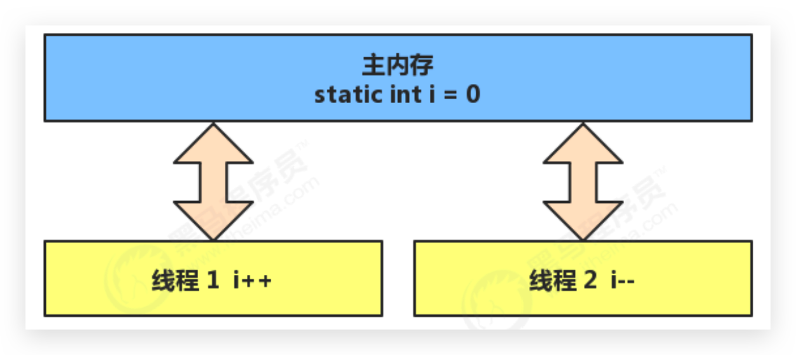

如果是单线程以上 8 行代码是顺序执行（不会交错）没有问题：

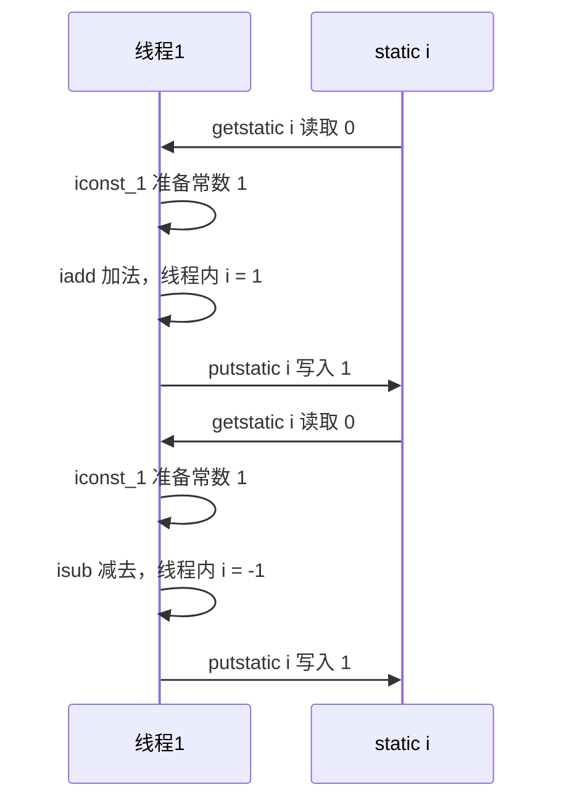

但多线程下这 8 行代码可能**交错运行**

会出现负数的情况：

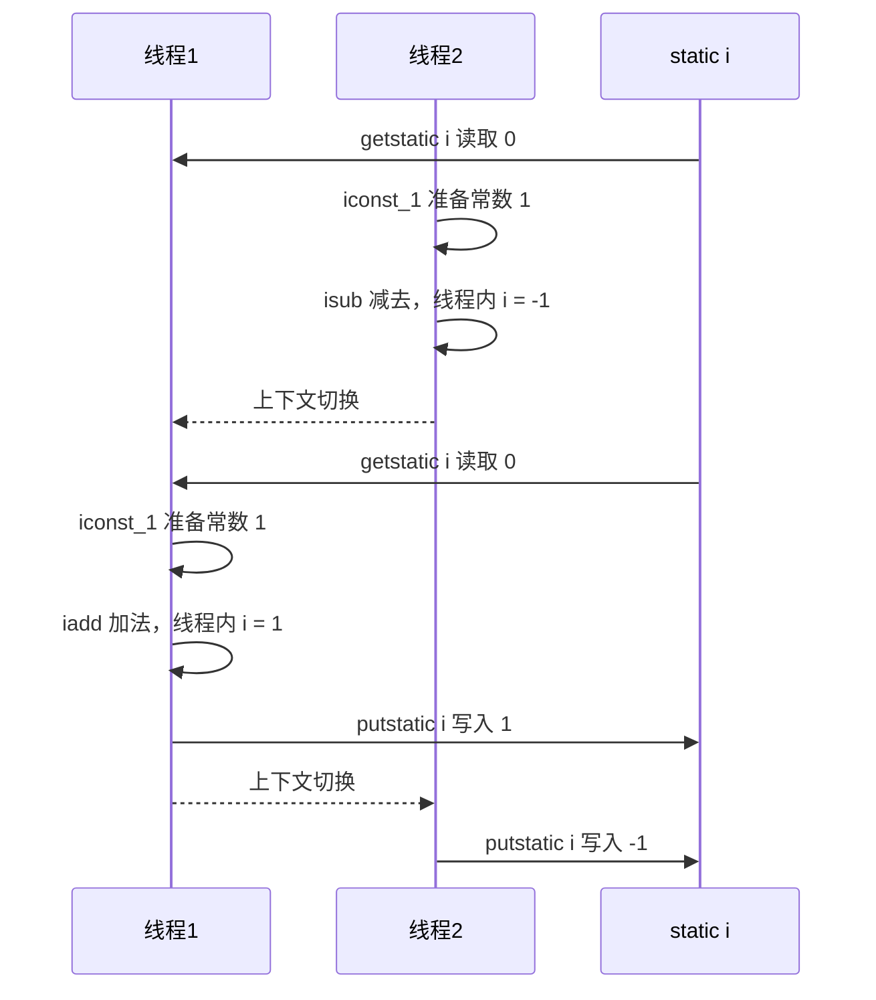

出现正数的情况：

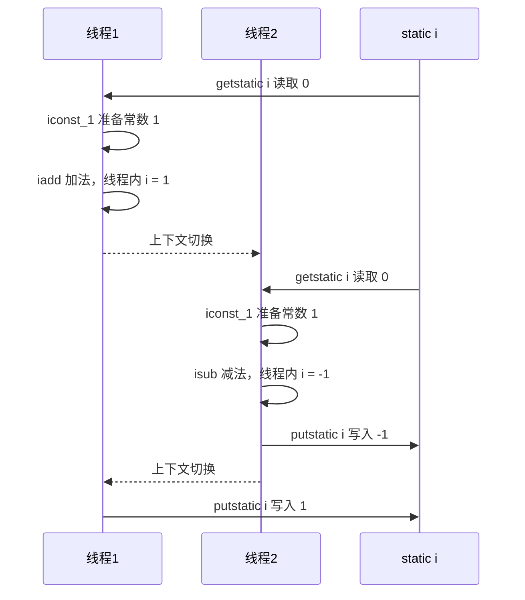


### 线程安全问题总结 🔥

分时系统，线程切换时，对临界区数据读写的非原子性，以及缓存导致最终可能发生**线程安全问题**。出现该问题的原因：

*   **多个线程在操作共享资源**

*   **操作共享资源的代码有多条（可能是非原子操作）**

    即当一个线程在执行操作共享资源的多条代码（可能是非原子操作）过程中，其他线程参与了运算，就会导致

    OS的分时操作，线程切换，缓存


### 临界区 Critical Section

*   一个程序运行多个线程本身是没有问题的

*   问题出在多个线程访问**共享资源**

    *   多个线程读**共享资源**其实也没有问题

    *   在多个线程对**共享资源**读写操作时发生指令交错，就会出现问题

临界区(critical section)是指访问某一共享资源的**代码片段**，并且这段代码的执行**应为原子(atomic) 操作**，**即临界区内的代码必须对外是不可分割的，不会被线程切换所打断**

例如，下面代码中的临界区（必须有synchronized，否则无法保证临界区代码的原子操作）

```java
static int counter = 0;
synchronized static void increment() { 
    // 临界区
    counter++; 
}
synchronized static void decrement() { 
    // 临界区
    counter--; 
}
```


### 竞态条件 Race Condition

竞争条件是指多个任务以**非互斥**的方式同时进入临界区，大家对公共资源的访问是以竞争的方式并行进行的，因此公共资源的最终状态依赖于这些任务的临界区中的微操作**执行次序**。

多个线程在临界区内执行，由于代码的**执行序列不同**而导致结果无法预测，称之为发生了**竞态条件**


### 解决方案总览 🔥

为了**避免临界区的竞态条件发生**，有多种手段可以达到目的。

*   **阻塞式**的解决方案：
    *   同步锁机制：**synchronized**（同步代码块、同步方法）
    *   Lock锁机制：**Lock**（JUC中介绍）

*   **非阻塞式**的解决方案
    *   **原子变量**（Automic）


## synchronized 关键字 🔥

### 介绍

`synchronized`关键字可以用于**方法中的某个区块中**，表示只对这个区块的**资源实行互斥访问**。让同一时刻至多只有一个线程能持有【同步锁/对象锁/对象监视器】，其它线程再想获取这个【同步锁/对象锁/对象监视器】时就会**阻塞**住。这样就能保证拥有锁的线程可以安全的执行临界区内的代码，不用担心线程上下文切换

**注意**，虽然 java 中互斥和同步都可以采用 synchronized 关键字来完成，但它们还是有区别的：

*   **互斥**是保证临界区的竞态条件发生，同一时刻只能有一个线程执行临界区代码

*   **同步**是由于线程执行的先后、顺序不同、需要一个线程等待其它线程运行到某个点

**synchronized 的优缺点：**

- **好处**：解决线程的安全问题（互斥）
- **弊端**：相对**降低效率**（同步），因为同步外的线程都会判断同步锁；若有**同步嵌套容易产生死锁**

**同步锁/对象锁/对象监视器**

- 锁对象可以是**任意类型**
- 多个线程对象要使用**同一把锁**


### 语法1—同步代码块

锁的目标是对象！

```java
synchronized(对象){// 线程1进入后，线程2到这里就被 blocked
    // 临界区
}
```


### 卖票问题解决

```java
@Slf4j(topic = "SafeTicket")
class SafeTicket implements Runnable {
    private static int count = 1_000;// 线程竞争不明显可以增大票数

    // final Object lock = new Object();

    @Override
    public void run() {
        // 卖票窗口一直开着，不能在同步中，否则就会被一个线程执行完
        while (true) {
            // synchronized 需在内部写，否则其他线程会进不去。类似进入厕所然后锁门。需要包裹操作共享资源的代码。
            // 还可以写 this（注意唯一性）、SafeTicket.class、上面的对象 lock
            synchronized (this) {
                if (count <= 0) {
                    log.debug("{}说: 票已经卖完了", Thread.currentThread().getName());
                    break;
                }
                try {
                    // 进入time waiting，提高线程切换概率，错票几率
                    TimeUnit.MILLISECONDS.sleep(10);
                    log.debug("{}卖了第{}张票", Thread.currentThread().getName(), count--);
                } catch (InterruptedException e) {
                    e.printStackTrace();
                }
            }
        }
    }
}

@Slf4j(topic = "TestSafe")
public class TestSafe {
    public static void main(String[] args) throws InterruptedException {

        Runnable task = new Ticket();

        Thread t1 = new Thread(task, "窗口1");
        Thread t2 = new Thread(task, "窗口2");
        Thread t3 = new Thread(task, "窗口3");
        Thread t4 = new Thread(task, "窗口4");

        t1.start();
        t2.start();
        t3.start();
        t4.start();
    }
}
```


### 自增自减问题解决

```java
@Slf4j(topic = "TestCount")
public class TestCount {

    static int counter = 0;

    static final Object room = new Object();

    public static void main(String[] args) throws InterruptedException {
        // test1();
        test2();
    }

    /**
     * 同步代码块
     */
    public static void test2() throws InterruptedException {
        Thread t1 = new Thread(() -> {
            for (int i = 0; i < 5_000; i++) {
                synchronized (room) {
                    counter++;
                }
            }
        }, "t1");
        Thread t2 = new Thread(() -> {
            for (int i = 0; i < 5_000; i++) {
                synchronized (room) {
                    counter--;
                }
            }
        }, "t2");
        t1.start();
        t2.start();
        t1.join();
        t2.join();
        log.debug("{}", counter);
    }
}
```


### 原理 🔥

类比：

*   synchronized(对象) 中的对象，可以想象为一个房间（room），有唯一入口（门）房间只能一次进入一人进行计算，线程 t1，t2 想象成两个人

*   当线程 t1 执行到 synchronized(room) 时就好比 t1 进入了这个房间，并锁住了门拿走了钥匙，在门内执行count++ 代码

*   这时候如果 t2 也运行到了 synchronized(room) 时，它发现门被锁住了，只能在门外等待，发生了上下文切换，阻塞住了

*   这中间**即使 t1 的 cpu 时间片不幸用完，被踢出了门外**（不要错误理解为锁住了对象就能一直执行下去哦），这时**门还是锁住的，t1 仍拿着钥匙，t2 线程还在阻塞状态进不来**，只有**下次轮到 t1 自己再次获得时间片时才能开门进入**
*   **当 t1 执行完 synchronized{} 块内的代码，这时候才会从 obj 房间出来并解开门上的锁，唤醒 t2 线程把钥匙给他**。t2 线程这时才可以进入 obj 房间，锁住了门拿上钥匙，执行它的 count-- 代码

用图表示：

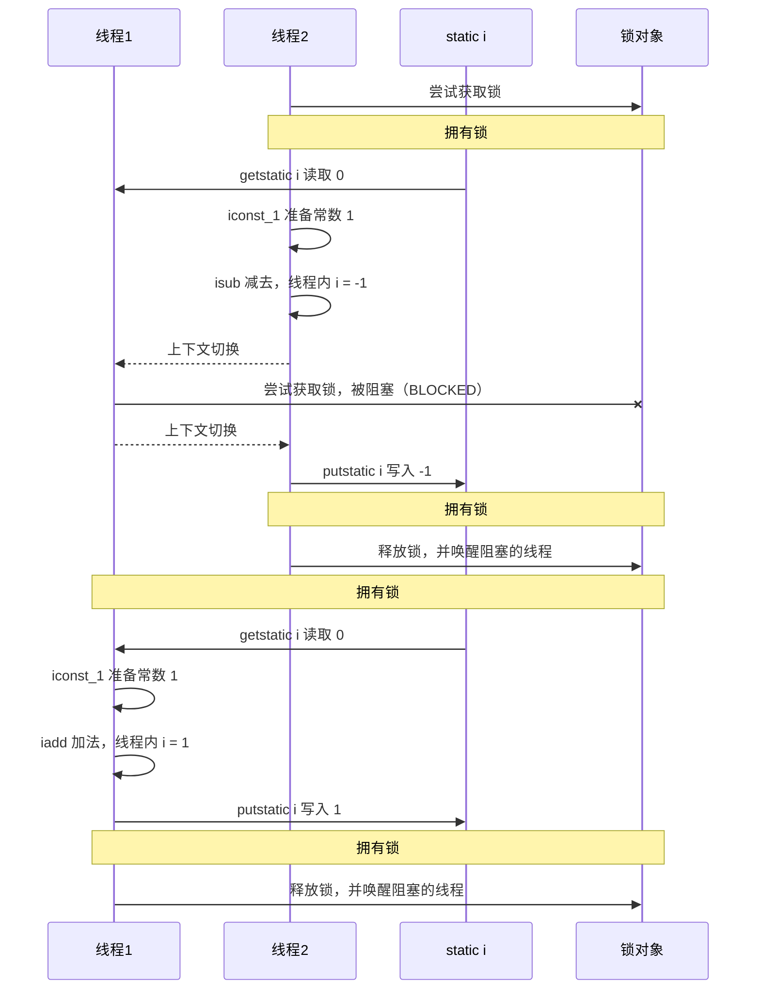


### 思考

synchronized 实际是用**对象锁**保证了**临界区内代码的原子性（临界区内的代码必须对外是不可分割的，不会被线程切换所打断）**。为了加深理解，请思考下面的问题（自增自减问题）：

*   如果把 synchronized(obj) 放在 for 循环的外面，如何理解？-- 对for循环整体保证原子性

*   如果 t1 synchronized(obj1) 而 t2 synchronized(obj2) 会怎样运作？-- 锁对象不同，无法保证同步互斥

*   如果 t1 synchronized(obj) 而 t2 没有加会怎么样？如何理解？-- 锁对象不同，一个有一个没有，则会发生线程安全问题

    加法不加锁则是正数几率大，减法不加锁则是负数几率大，为啥了。。


### 自增自减面向对象改进

```java
@Slf4j(topic = "TestCount2")
public class TestCount2 {

    public static void main(String[] args) throws InterruptedException {
        Room room = new Room();

        Thread t1 = new Thread(() -> {
            for (int i = 0; i < 5_000; i++) {
                room.increment();
            }
        }, "t1");
        Thread t2 = new Thread(() -> {
            for (int i = 0; i < 5_000; i++) {
                room.decrement();
            }
        }, "t2");
        t1.start();
        t2.start();
        t1.join();
        t2.join();
        log.debug("{}", room.getCount());
    }
}

class Room {
    private int count = 0;

    public void increment(){
        synchronized (this){
            count++;
        }
    }

    public void decrement(){
        synchronized (this){
            count--;
        }
    }

    public int getCount(){
        synchronized (this){
            return count;
        }
    }
}
```


### 语法2—同步方法 & 锁对象 🔥

**此时同步锁是谁？锁的目标还是对象**，不是锁方法！

- 对于**非 static 方法**，同步锁就是**this**，此时代表调用 run 方法的对象

- 对于**static 方法**，同步锁当前方法所在类的字节码对象(**类名.class**)，**与方法调用者无关**！！！

    使用继承 Thread 类和同步方法实现时，需要写 `static synchronized`

```java
class Test {
    public synchronized void test(){
        // 临界区
    }
}

// 等价于（自动转换）
class Test {
    public void test(){
        synchronized(this){
            // 临界区
        }
    }
}
```

```java
class Test {
    public synchronized static void test(){
        // 临界区
    }
}

// 等价于（自动转换）
class Test {
    public void test(){
        synchronized(Test.class){
            // 临界区
        }
    }
}
```

改进代码如下：

```java
@Slf4j(topic = "TestCount2")
public class TestCount2 {

    public static void main(String[] args) throws InterruptedException {
        Room room = new Room();

        Thread t1 = new Thread(() -> {
            for (int i = 0; i < 5_000; i++) {
                room.increment();
            }
        }, "t1");
        Thread t2 = new Thread(() -> {
            for (int i = 0; i < 5_000; i++) {
                room.decrement();
            }
        }, "t2");
        t1.start();
        t2.start();
        t1.join();
        t2.join();
        log.debug("{}", room.getCount());
    }
}

class Room {
    private int count = 0;

    public synchronized void increment() {
        count++;
    }

    public synchronized void decrement() {
        count--;
    }

    public synchronized int getCount() {
        return count;
    }
}
```


## "线程八锁" 🔥

考察 synchronized 锁住的是哪个对象

#### 情况1

结果：12 或 21

锁是 this 对象（底层查看 n1 对象头部信息）

```java
public class Test1 {

    public static void main(String[] args) {
        Number n1 = new Number();
        new Thread(n1::a).start();
        new Thread(n1::b).start();
    }
}

@Slf4j(topic = "Number")
class Number{
    public synchronized void a() {
        log.debug("1");
    }
    public synchronized void b() {
        log.debug("2");
    }
}
```


#### 情况2

结果：1s后12，或 2 1s后 1

```java
public class Test1 {

    public static void main(String[] args) {
        Number n1 = new Number();
        new Thread(n1::a).start();
        new Thread(n1::b).start();
    }
}

@Slf4j(topic = "Number")
class Number{
    public synchronized void a() {
        try {
            TimeUnit.SECONDS.sleep(1);// sleep 不会释放锁，会释放处理机
        } catch (InterruptedException e) {
            e.printStackTrace();
        }
        log.debug("1");
    }
    public synchronized void b() {
        log.debug("2");
    }
}
```


#### 情况3

结果：3 1s 12 或 23 1s 1 或 32 1s 1

*   若a先获得锁，则3先打印，1s后1打印，2打印
*   若b先获得锁，则2或3先打印，1s后1打印

```java
public class Test3 {

    public static void main(String[] args) {
        Number3 n1 = new Number3();
        new Thread(n1::a).start();
        new Thread(n1::b).start();
        new Thread(n1::c).start();
    }
}

@Slf4j(topic = "Number")
class Number3{
    public synchronized void a() {
        try {
            TimeUnit.SECONDS.sleep(1);
        } catch (InterruptedException e) {
            e.printStackTrace();
        }
        log.debug("1");
    }
    public synchronized void b() {
        log.debug("2");
    }

    public void c() {
        log.debug("3");
    }
}
```


#### 情况4

结果：2 1s 后 1

*   首先锁对象都不是同一个了！所以俩线程并行执行
*   a需要等1s，所以是先打印2，1s后打印1

```java
public class Test4 {

    public static void main(String[] args) {
        Number4 n1 = new Number4();
        Number4 n2 = new Number4();
        new Thread(n1::a).start();
        new Thread(n2::b).start();
    }
}

@Slf4j(topic = "Number")
class Number4{
    public synchronized void a() {
        try {
            TimeUnit.SECONDS.sleep(1);
        } catch (InterruptedException e) {
            e.printStackTrace();
        }
        log.debug("1");
    }
    public synchronized void b() {
        log.debug("2");
    }
}
```


#### 情况5

结果：2 1s 后 1

*   首先锁对象都不是同一个了！**static 方法不是看调用者，是看规则**！

    a的锁是Number4.class对象，b的锁是this对象，所以俩线程并行执行

*   a需要等1s，所以是先打印2，1s后打印1

```java
public class Test5 {

    public static void main(String[] args) {
        Number5 n1 = new Number5();
        new Thread(() -> n1.a()).start();
        new Thread(() -> n1.b()).start();
    }
}

@Slf4j(topic = "Number")
class Number5{
    public static synchronized void a() {
        try {
            TimeUnit.SECONDS.sleep(1);
        } catch (InterruptedException e) {
            e.printStackTrace();
        }
        log.debug("1");
    }
    public synchronized void b() {
        log.debug("2");
    }
}
```


#### 情况6

结果：1s后12，或 2 1s后 1

*   锁对象都是 Number6.class ，所以同步互斥运行

```java
public class Test6 {

    public static void main(String[] args) {
        new Thread(Number6::a).start();
        new Thread(Number6::b).start();
    }
}

@Slf4j(topic = "Number")
class Number6{
    public static synchronized void a() {
        try {
            TimeUnit.SECONDS.sleep(1);
        } catch (InterruptedException e) {
            e.printStackTrace();
        }
        log.debug("1");
    }
    public static synchronized void b() {
        log.debug("2");
    }
}
```


#### 情况7

*   结果：2 1s 后 1
    *   首先锁对象都不是同一个了，所以俩线程并行执行
    *   a需要等1s，所以是先打印2，1s后打印1

```java
public class Test7 {

    public static void main(String[] args) {
        Number7 n1 = new Number7();
        Number7 n2 = new Number7();
        new Thread(() -> n1.a()).start();
        new Thread(() -> n2.b()).start();
    }
}

@Slf4j(topic = "Number")
class Number7{
    public static synchronized void a() {
        try {
            TimeUnit.SECONDS.sleep(1);
        } catch (InterruptedException e) {
            e.printStackTrace();
        }
        log.debug("1");
    }
    public synchronized void b() {
        log.debug("2");
    }
}
```


#### 情况8

结果：1s后12，或 2 1s后 1

*   虽然看着是new了不同的对象，但是实际调用会转为类static调用，所以是同一锁对象

```java
public class Test8 {

    public static void main(String[] args) {
        Number8 n1 = new Number8();
        Number8 n2 = new Number8();
        new Thread(() -> n1.a()).start();
        new Thread(() -> n2.b()).start();
    }
}

@Slf4j(topic = "Number")
class Number8{
    public static synchronized void a() {
        try {
            TimeUnit.SECONDS.sleep(1);
        } catch (InterruptedException e) {
            e.printStackTrace();
        }
        log.debug("1");
    }
    public static synchronized void b() {
        log.debug("2");
    }
}
```


## 变量的线程安全分析 🔥

### 成员变量和静态变量是否线程安全？

*   如果它们**没有共享，则线程安全**
*   如果它们被**共享**了，根据它们的状态是否能够改变，又分两种情况
    *   如果**只有读**操作，则**线程安全**
    *   如果**有读写**操作，则这段代码是临界区，需要**考虑线程安全**


### 局部变量是否线程安全？

*   **局部变量**是**线程安全**的
*   但**局部变量引用的对象则未必**🔥
    *   如果该对象**没有逃离方法的作用访问**，它是**线程安全**的
    *   如果该对象**逃离方法的作用范围**，需要**考虑线程安全**


### 分析—成员变量—List#add × 🔥

```java
class Test {
    static final int THREAD_NUMBER = 2;
    static final int LOOP_NUMBER = 200;

    public static void main(String[] args) {
        ThreadUnsafe test = new ThreadUnsafe();
        for (int i = 0; i < THREAD_NUMBER; i++) {
            new Thread(() -> {
                test.method1(LOOP_NUMBER);
            }, "Thread" + i).start();
        }
    }
}

class ThreadUnsafe {

    /* 成员变量 */
    ArrayList<String> list = new ArrayList<>();

    public void method1(int loopNumber) {
        for (int i = 0; i < loopNumber; i++) {
            // 临界区, 会产生竞态条件
            method2();
            method3();
            // 临界区
        }
    }

    private void method2() {
        list.add("1");
    }

    private void method3() {
        list.remove(0);
    }
}
```

这里面本来method2执行完add后再执行method3的remove是无论如何不会出错的，但是在多线程下，**add方法不是原子性**的：

```java
public boolean add(E e) {
    ensureCapacityInternal(size + 1);  // Increments modCount!!
    elementData[size++] = e;
    return true;
}
```

**有可能2个线程同时操作add时，拿到了同一个size**，即**只添加了一个元素**！此时要是调用第二个remove就会抛如下异常：

```
Exception in thread "Thread0" java.lang.IndexOutOfBoundsException: Index: 0, Size: 0
	at java.util.ArrayList.rangeCheck(ArrayList.java:657)
	at java.util.ArrayList.remove(ArrayList.java:496)
	at _10_var_safe.ThreadUnsafe.method3(ThreadUnsafe.java:23)
	at _10_var_safe.ThreadUnsafe.method1(ThreadUnsafe.java:14)
	at _10_var_safe.ThreadUnsafe.lambda$main$0(ThreadUnsafe.java:37)
	at java.lang.Thread.run(Thread.java:748)
```

与自增自减不同的是，自增自减中2个线程，分别进行增、减操作，这里是一个线程内进行增减操作

分析：

*   无论哪个线程中的 method2 引用的都是同一个对象中的 list 成员变量

*   method3 与 method2 分析相同

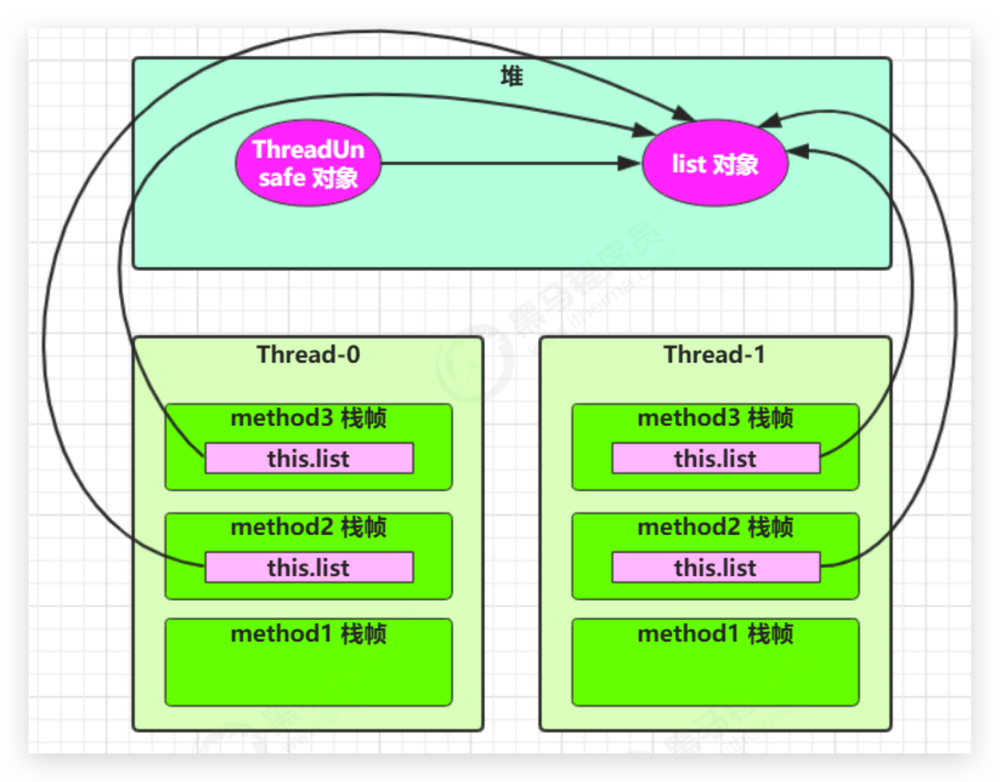


### 分析—局部普通变量 ✓

如下代码：

```java
public static void test1() {
    int i = 10; 
    i++; 
}
```

每个线程调用 test1() 方法时局部变量 i，会在每个线程的栈帧内存中被创建多份，因此不存在共享

```
public static void test1();

	descriptor: ()V
    flags: ACC_PUBLIC, ACC_STATIC
	Code:
		stack=1, locals=1, args_size=0 
			0: bipush 10
			2: istore_0
			3: iinc 0, 1 
			6: return
		LineNumberTable:
			line 10: 0
			line 11: 3
			line 12: 6
		LocalVariableTable:
			Start Length Slot Name Signature
			3 		4 		0 	i 		I
```

如图：


### 分析—局部变量为引用对象 ✓

将 list 修改为局部变量

```java
class Test {
    static final int THREAD_NUMBER = 2;
    static final int LOOP_NUMBER = 200;

    public static void main(String[] args) {
        ThreadSafe test = new ThreadSafe();
        for (int i = 0; i < THREAD_NUMBER; i++) {
            new Thread(() -> {
                test.method1(LOOP_NUMBER);
            }, "Thread" + i).start();
        }
    }
}

class ThreadSafe {

    public void method1(int loopNumber) {
        ArrayList<String> list = new ArrayList<>();
        for (int i = 0; i < loopNumber; i++) {
            // 临界区, 会产生竞态条件
            method2(list);
            method3(list);
            // 临界区
        }
    }

    private void method2(ArrayList<String> list) {
        list.add("1");
    }

    private void method3(ArrayList<String> list) {
        list.remove(0);
    }
}
```

那么就不会有上述问题了

分析：

*   list 是局部变量，**每个线程调用时会创建其不同实例，没有共享**

*   而 method2 的参数是从 method1 中传递过来的，与 method1 中引用同一个对象

*   method3 的参数分析与 method2 相同


### 分析—局部变量为引用对象并暴露 × 

方法访问修饰符带来的思考，如果把 method2 和 method3 的方法修改为 public 会不会代理线程安全问题？

*   情况1：有其它线程调用 method2 和 method3

    没有问题，因为操作的list对象还是各线程私有的

*   情况2：在 情况1 的基础上，为 ThreadSafe 类添加子类，子类覆盖 method2 或 method3 方法，即

```java
class Test2 {
    static final int THREAD_NUMBER = 2;
    static final int LOOP_NUMBER = 200;

    public static void main(String[] args) {
        ThreadSafe2Sub test = new ThreadSafe2Sub();
        for (int i = 0; i < THREAD_NUMBER; i++) {
            new Thread(() -> test.method1(LOOP_NUMBER), "Thread" + i).start();
        }
    }
}


class ThreadSafe2 {

    public void method1(int loopNumber) {
        ArrayList<String> list = new ArrayList<>();
        for (int i = 0; i < loopNumber; i++) {
            // 临界区, 会产生竞态条件
            method2(list);
            method3(list);
            // 临界区
        }
    }

    public void method2(ArrayList<String> list) {
        list.add("1");
    }

    public void method3(ArrayList<String> list) {
        list.remove(0);
    }
}

class ThreadSafe2Sub extends ThreadSafe2{
    // @Override
    // public void method2(ArrayList<String> list) {
    //     new Thread(()-> list.add("1")).start();
    // }

    @Override
    public void method3(ArrayList<String> list) {
        new Thread(()-> list.remove(0)).start();
    }
}
```

这样就导致多个线程对同一资源进行操作，且操作的语句有多条！remove底层：

```java
public E remove(int index) {
    rangeCheck(index);

    modCount++;
    E oldValue = elementData(index);

    int numMoved = size - index - 1;
    if (numMoved > 0)
        System.arraycopy(elementData, index+1, elementData, index,
                         numMoved);
    elementData[--size] = null; // clear to let GC do its work

    return oldValue;
}
```


### 常见线程安全类—同步锁

*   StringBuffer
*   Random
*   ~~Vector~~：不推荐
*   ~~Hashtable~~：不推荐
*   java.util.concurrent 包下的类

这里说它们是线程安全的是指，**多个线程调用**它们**同一个实例的某个方法时**，是**线程安全**的。也可以理解为

```java
Hashtable table = new Hashtable();
new Thread(()->{
    table.put("key", "value1");
}).start();
new Thread(()->{
    table.put("key", "value2");
}).start();
```

它们的**每个方法是原子**的。但**注意**它们**多个方法的组合不是原子**的：

```java
Hashtable table = new Hashtable();
new Thread(()->{
    if(table.get("key")==null){
        table.put("key", "value");
    }
}).start();
```

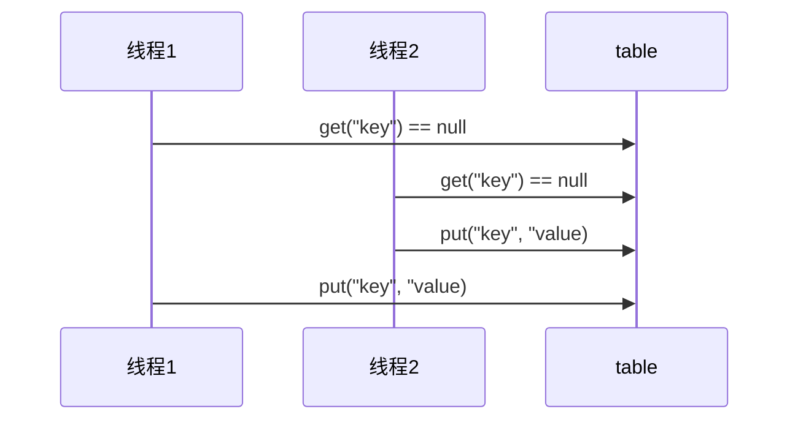

每个原子操作执行完后都会释放锁，并唤醒其他阻塞线程。这里的get、put方法都是同一把锁


### 常见线程安全类—不可变类

*   String
*   Integer

String、Integer 等都是不可变类，因为其内部的状态不可以改变，因此它们的方法都是线程安全的

有同学或许有疑问，String 有 replace，substring 等方法【可以】改变值啊，那么这些方法又是如何保证线程安全的呢？

因为**没有改变原有的值**，是**重新new一个对象并返回**的！


### 实例分析 🔥

**如下实例中，Servlet 都是单例的！！！所以其所有 Service、Dao 也都是单例的**

[Servlet参考博客](https://www.cnblogs.com/stono/p/14234241.html)


#### 例1

```java
public class MyServlet extends HttpServlet {
    // 是否安全？否
    Map<String,Object> map = new HashMap<>();
    // 是否安全？是
    String S1 = "...";
    // 是否安全？是
    final String S2 = "...";
    // 是否安全？否
    Date d1 = new Date();
    // 是否安全？否，只是 d2 这个引用值不能变，其对象内部属性是可变的
    final Date d2 = new Date();

    public void doGet(HttpServletRequest request, HttpServletResponse response) {
        // 使用上述变量
    }
}
```


#### 例2

```java
// MyServlet 只有一份，每个线程访问都会有一份
public class MyServlet extends HttpServlet {
    // 是否安全？成员变量，可能有线程安全问题。UserServiceImpl中有成员变量，并有对该成员变量的修改操作
    private UserService userService = new UserServiceImpl();
    
    public void doGet(HttpServletRequest request, HttpServletResponse response) {
        userService.update(...);
    }
}
public class UserServiceImpl implements UserService {
    // 记录调用次数
    // 成员变量，可能有线程安全问题
    private int count = 0;
    public void update() {
        // ...同样
        count++;
    }
}
```


#### 例3

```java
@Aspect
@Component// Spring组件默认单例
public class MyAspect {
    // 是否安全？成员变量，可能有线程安全问题
    private long start = 0L;
    @Before("execution(* *(..))")
    public void before() {
        start = System.nanoTime();
    }
    @After("execution(* *(..))")
    public void after() {
        long end = System.nanoTime();
        System.out.println("cost time:" + (end-start));
    }
}
```

可以使用环绕通知，将变量改为局部变量


#### 例4

```java
public class MyServlet extends HttpServlet {
    // 是否安全。是。没有对userService进行修改的操作
    private UserService userService = new UserServiceImpl();
    
    public void doGet(HttpServletRequest request, HttpServletResponse response) {
        userService.update(...);
    }
}
public class UserServiceImpl implements UserService {
    // 是否安全。是。没有对userDao进行修改的操作
    private UserDao userDao = new UserDaoImpl();
    public void update() {
        userDao.update();
    }
}
public class UserDaoImpl implements UserDao { 
    public void update() {
        String sql = "update user set password = ? where username = ?";
        // 是否安全。是。没有成员变量，只有局部变量一般都是线程安全的
        try (Connection conn = DriverManager.getConnection("","","")){
            // ...
        } catch (Exception e) {
            // ...
        }
    }
}
```


#### 例5

```java
public class MyServlet extends HttpServlet {
    // 是否安全。是。没有对userService进行修改的操作
    private UserService userService = new UserServiceImpl();
    
    public void doGet(HttpServletRequest request, HttpServletResponse response) {
        userService.update(...);
    }
}
public class UserServiceImpl implements UserService {
    // 是否安全。是。没有对userDao进行修改的操作
    private UserDao userDao = new UserDaoImpl();
    
    public void update() {
        userDao.update();
    }
}
public class UserDaoImpl implements UserDao {
    // 是否安全。否。成员变量，且有对成员变量的修改操作，如close
    private Connection conn = null;
    public void update() throws SQLException {
        String sql = "update user set password = ? where username = ?";
        conn = DriverManager.getConnection("","","");
        // ...
        conn.close();
    }
}
```


#### 例6

```java
public class MyServlet extends HttpServlet {
    // 是否安全。是
    private UserService userService = new UserServiceImpl();
    public void doGet(HttpServletRequest request, HttpServletResponse response) {
        userService.update(...);
    }
}
public class UserServiceImpl implements UserService { 
    // 是否安全。是
    public void update() {
        UserDao userDao = new UserDaoImpl();
        userDao.update();
    }
}
public class UserDaoImpl implements UserDao {
    // 是否安全，是，每次都会new UserDaoImpl，其实例中的成员变量不存在共享
    private Connection conn = null;
    public void update() throws SQLException {
        String sql = "update user set password = ? where username = ?";
        conn = DriverManager.getConnection("","","");
        // ...
        conn.close();
    }
}
```


#### 例7

```java
public abstract class Test {
    public void bar() {
        // 是否安全。否。局部变量为引用对象，并暴露了！
        SimpleDateFormat sdf = new SimpleDateFormat("yyyy-MM-dd HH:mm:ss");
        foo(sdf);
    }
    public abstract foo(SimpleDateFormat sdf);
    public static void main(String[] args) {
        new Test().bar();
    }
}
```

其中 foo 的行为是不确定的，可能导致不安全的发生，被称之为**外星方法**

```java
public void foo(SimpleDateFormat sdf) {
    String dateStr = "1999-10-11 00:00:00";
    for (int i = 0; i < 20; i++) {
        new Thread(() -> {
            try {
                sdf.parse(dateStr);
            } catch (ParseException e) {
                e.printStackTrace();
            }
        }).start();
    }
}
```

请比较 JDK 中 String 类的实现


#### 例8

```java
@Slf4j(topic = "Test3")
public class Test3 {

    private static Integer i = 0;
    public static void main(String[] args) throws InterruptedException {
        List<Thread> list = new ArrayList<>();
        for (int j = 0; j < 2; j++) {
            Thread thread = new Thread(() -> {
                for (int k = 0; k < 5000; k++) {
                    synchronized (i) {
                        i++;
                    }
                }
            }, "" + j);
            list.add(thread);
        }

        list.forEach(Thread::start);
        list.forEach(t -> {
            try {
                t.join();
            } catch (InterruptedException e) {
                e.printStackTrace();
            }
        });
        log.debug("{}", i);// 不够10000
    }
}
```

锁对象用的是成语变量 Integer i ，一直在变化，所以有线程安全问题


### 习题1—卖票练习 🔥

测试下面代码是否存在线程安全问题，并尝试改正。目前已是正确的了！

```java
@Slf4j(topic = "TestSell")
public class TestSell {

    // Random 为线程安全
    static Random random = new Random();

    // 随机 1~5
    public static int randomAmount() {
        return random.nextInt(5) + 1;
    }


    @RepeatedTest(10)
    void test() {
        // 初始化票数
        TicketWindow ticketWindow = new TicketWindow(1000);

        // 方便 join 同步，等待都完成后 main 线程执行统计。主线程中执行的，不涉及多线程
        List<Thread> list = new ArrayList<>();

        // 用来存储卖出去多少张票。共享资源，若使用 List#add 其方法不是同步的，有线程安全问题
        List<Integer> sellCount = new Vector<>();
        for (int i = 0; i < 2_000; i++) {
            Thread t = new Thread(() -> {
                try {
                    // 增加时间，以便线程切换几率，否则代码太少，很快就执行完了
                    TimeUnit.MILLISECONDS.sleep(randomAmount());
                } catch (InterruptedException e) {
                    e.printStackTrace();
                }
                // 分析这里的竞态条件
                // 该方法不是原子的，需要同步约束
                int count = ticketWindow.sell(randomAmount());
                // 该方法已经是同步的了，且和上面的不是同一共享资源，所以无需组合同步
                sellCount.add(count);
            });
            list.add(t);
            t.start();
        }
        list.forEach(t -> {
            try {
                t.join();
            } catch (InterruptedException e) {
                e.printStackTrace();
            }
        });
        log.debug("卖出的票 :{} \t余票: {}",
                sellCount.stream().mapToInt(c -> c).sum(),
                ticketWindow.getCount() );
        // 卖出的票 + 余票 应该等于初始票数
    }


}


// 售票窗口
class TicketWindow {
    private int count;

    public TicketWindow(int count) {
        this.count = count;
    }

    // 获取余票
    public int getCount() {
        return count;
    }

    // 售票。必须加上synchronized，保证原子性
    public synchronized int sell(int amount) {
        if (this.count >= amount) {
            this.count -= amount;
            return amount;
        } else {
            return 0;
        }
    }
}
```

不加sleep，使用脚本测试多次（有可能电脑太快了，还必须加sleep）。如下为cmd

```
for /L %n in (1,1,10) do java -cp ".;C:\Users\manyh\.m2\repository\ch\qos\logback\logback-classic\1.2.3\logback-classic-1.2.3.jar;C:\Users\manyh\.m2\repository\ch\qos\logback\logback-core\1.2.3\logback-core-1.2.3.jar;C:\Users\manyh\.m2\repository\org\slf4j\slf4j-api\1.7.25\slf4j-api-1.7.25.jar" cn.itcast.n4.exercise.ExerciseSell
```

*   -cp：classpath，因为利用了第三方库


### 习题2—转账 🔥

测试下面代码是否存在线程安全问题，并尝试改正。目前已是正确的了！但是**有很大缺陷**

```java
@Slf4j(topic = "TestTransfer")
public class TestTransfer {

    // Random 为线程安全
    static Random random = new Random();

    // 随机 1~100
    public static int randomAmount() {
        return random.nextInt(100) + 1;
    }


    @RepeatedTest(10)
    void test() throws InterruptedException {
        Account a = new Account(1000);
        Account b = new Account(1000);

        Thread t1 = new Thread(() -> {
            for (int i = 0; i < 1000; i++) {
                a.transfer(b, randomAmount());
            }
        }, "t1");
        Thread t2 = new Thread(() -> {
            for (int i = 0; i < 1000; i++) {
                b.transfer(a, randomAmount());
            }
        }, "t2");

        t1.start();
        t2.start();
        t1.join();
        t2.join();

        log.debug("total:{}", (a.getMoney() + b.getMoney()));
    }

}


class Account {
    private int money;

    public Account(int money) {
        this.money = money;
    }

    public int getMoney() {
        return money;
    }

    public void setMoney(int money) {
        this.money = money;
    }

    // 这里 money 共享资源其实是有 2个账户的，需要都保护起来。
    // 而 synchronized 同步方法锁对象是 this，不能都保护。即 a转b时其他a转b线程不能进入，但是b转a线程可以进入！
    // 此时需要将都保护起来。但是不能使用嵌套同步代码块，容易死锁。此时可以采用Account.class锁对象
    // 但是这是在同一时刻只能一个账户进行转账了，性能低下！！！
    public void transfer(Account target, int amount) {
        synchronized (Account.class) {
            if (this.money > amount) {
                this.setMoney(this.money - amount);
                target.setMoney(target.getMoney() + amount);
            }
        }
    }
}
```


## 线程间通信—wait、notify 等待唤醒机制 🔥

### 线程间通信 🔥

**多个线程在处理同一个资源，但是处理的动作（线程的任务）却不相同**，需要线程通信来帮助解决线程之间对同一个变量的使用或操作。 就是多个线程在操作同一份数据时， 避免对同一共享变量的争夺。也就是我们需要通过一定的手段使各个线程能有效的利用资源。而这种手段即—— **等待唤醒机制**。


### 小故事

*   由于条件不满足，小南不能继续进行计算

*   但小南如果一直占用着锁，其它人就得一直阻塞，效率太低

    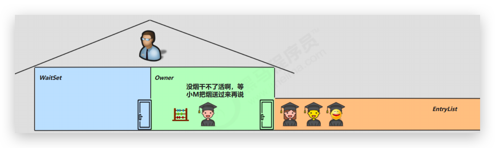

*   于是老王单开了一间休息室（调用 wait 方法），让小南到休息室（WaitSet）等着去了，但这时锁释放开，其它人可以由老王随机安排进屋

*   直到小M将烟送来，大叫一声 [ 你的烟到了 ] （调用 notify 方法）

    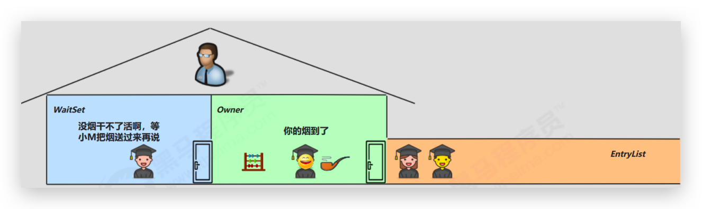

*   小南于是可以离开休息室，重新进入竞争锁的队列

    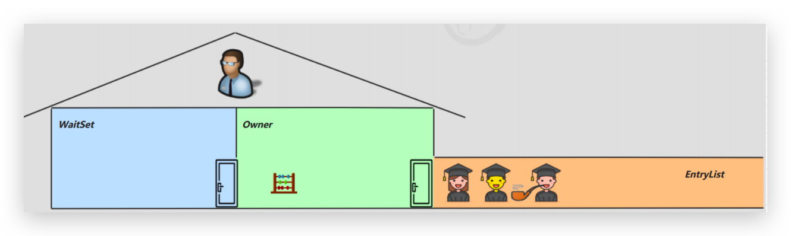


### 原理图解 🔥

<iframe id="embed_dom" name="embed_dom" frameborder="0" style="display:block;width:100%; height:645px;" src="https://www.processon.com/embed/602e422c07912934224cfe8d"></iframe>

*   Owner 线程发现条件不满足，调用 wait 方法，即可进入 WaitSet 变为 WAITING 状态

*   BLOCKED 和 WAITING 的线程**都处于阻塞状态**，**不占用 CPU 时间片**

*   **BLOCKED 线程会在 Owner 线程释放锁时唤醒**

    **WAITING 线程会在 Owner 所属 Monitor 调用 notify 或 notifyAll 时唤醒**，但唤醒后**并不意味者立刻获得锁**，仍需**进入EntryList 重新竞争**


### 方法 🔥

`Object`类（任意锁）中提供了三个方法，是线程之间进行协作的手段。这些方法必须通过**同一个锁对象（this 调用或其他同一对象调用）在同步中（同步代码块、同步方法，即必须获得锁、成为 Monitor 的 Owner）调用**，否则报`IllegalMonitorStateException`错。Lock 有其自己的方法。

- `wait([long timeout])`：让进入 obj 监视器的线程到 WaitSet 等待。

    **等待**并立即**释放锁**，线程进入 WAITING，**被唤醒若获得锁后从断点处执行后续代码**。

    有时限的等待, 到 n 毫秒后结束等待直接运行后续代码，或是被 notify

- `wait(long timeout, int nanos)`不会精确到nanos，只要nanos有正确的值，则给timeout++

- `notify()`：在 obj 上正在 WaitSet 等待的线程中挑一个唤醒。

    唤醒正在排队等待同步资源的线程中优先级最高者结束等待，但**它自己不释放锁**，被通知线程不能立即恢复执行线程，**需重新请求同步锁**

- `notifyAll()`：让 obj 上正在 WaitSet 等待的线程全部唤醒

    唤醒正在排队等待资源的所有线程结束等待

::: tip

哪怕只通知了一个等待的线程，被通知线程也不能立即恢复执行，因为它当初中断的地方是在同步块内，而此刻它已经不持有锁，所以她需要再次尝试去获取锁（很可能面临其它线程的竞争），成功后才能在当初调用 wait 方法之后的地方恢复执行。
总结如下：
如果能获取锁，线程就从 WAITING 状态变成 RUNNABLE 状态； 否则，从 WaitSet 出来，又进入 EntryList，线程就从 WAITING 状态又变成 BLOCKED 状态。

:::

```java
@Slf4j(topic = "Test1")
public class Test1 {

    final static Object obj = new Object();

    public static void main(String[] args) throws InterruptedException {
        new Thread(() -> {
            synchronized (obj) {
                log.debug("执行....");
                try {
                    obj.wait(); // 让线程在obj上一直等待下去
                } catch (InterruptedException e) {
                    e.printStackTrace();
                }
                log.debug("执行后续代码....");
            }
        }).start();

        new Thread(() -> {
            synchronized (obj) {
                log.debug("执行....");
                try {
                    obj.wait(); // 让线程在obj上一直等待下去
                } catch (InterruptedException e) {
                    e.printStackTrace();
                }
                log.debug("执行后续代码....");
            }
        }).start();

        // 主线程两秒后执行
        TimeUnit.SECONDS.sleep(2);
        log.debug("唤醒 obj 上其它线程");
        synchronized (obj) {
            obj.notify(); // 唤醒obj上一个线程
            // obj.notifyAll(); // 唤醒obj上所有等待线程
        }
    }
}
```


### sleep 与 wait 区别 🔥

*   sleep 是 Thread 方法，而 wait 是 Object 的方法
*   sleep 不需要强制和 synchronized 配合使用，但 wait 需要和 synchronized 一起用
*   sleep 在睡眠的同时，不会释放对象锁的，但 wait 在等待的时候会释放对象锁
*   状态都是 TIMED_WAITING


### 正确使用 wait、notify 步骤 🔥

先来个**格式**吧：

```java
synchronized(lock) {
    while(条件不成立) {
        lock.wait();
    }
    // 干活
}

synchronized(lock) {
	lock.notifyAll();
}
```

被唤醒后若获得锁则从wait后继续执行，这里由于是while，应该继续执行while条件判断

具体思路如下


#### sleep 方式

思考下面的解决方案好不好，为什么？

```java
@Slf4j(topic = "TestWaitNotify")
public class TestWaitNotify {

    static final Object room = new Object();
    static boolean hasCigarette = false;// 有烟吗

    public static void main(String[] args) throws InterruptedException {
        step1();
    }


    private static void step1() throws InterruptedException {
        new Thread(() -> {
            synchronized (room) {
                log.debug("有烟没？[{}]", hasCigarette);
                if (!hasCigarette) {
                    log.debug("没烟，先歇会！");
                    try {
                        sleep(2);
                    } catch (InterruptedException e) {
                        e.printStackTrace();
                    }
                }
                log.debug("有烟没？[{}]", hasCigarette);
                if (hasCigarette) {
                    log.debug("可以开始干活了");
                }
            }
        }, "小南").start();
        
        for (int i = 0; i < 5; i++) {
            new Thread(() -> {
                synchronized (room) {
                    log.debug("可以开始干活了");
                }
            }, "其它人").start();
        }
        
        sleep(1);
        new Thread(() -> {
            // 这里能不能加 synchronized (room)？不能，加了后在小南线程sleep时（不释放锁）主线程这里无法获取锁
            hasCigarette = true;
            log.debug("烟到了噢！");
        }, "送烟的").start();
    }
}
```

结果如下：

```
15:42:08.224 [小南] DEBUG TestWaitNotify - 有烟没？[false]
15:42:08.227 [小南] DEBUG TestWaitNotify - 没烟，先歇会！
15:42:09.226 [送烟的] DEBUG TestWaitNotify - 烟到了噢！
15:42:10.231 [小南] DEBUG TestWaitNotify - 有烟没？[true]
15:42:10.232 [小南] DEBUG TestWaitNotify - 可以开始干活了
15:42:10.232 [其它人] DEBUG TestWaitNotify - 可以开始干活了
15:42:10.232 [其它人] DEBUG TestWaitNotify - 可以开始干活了
15:42:10.233 [其它人] DEBUG TestWaitNotify - 可以开始干活了
15:42:10.233 [其它人] DEBUG TestWaitNotify - 可以开始干活了
15:42:10.233 [其它人] DEBUG TestWaitNotify - 可以开始干活了
```

问题如下：

* 小南线程未执行完毕时（包括sleep中）其它干活的线程，都要一直阻塞，效率太低
* 小南线程必须睡足 2s 后才能醒来，就算烟提前送到，也无法立刻醒来
* 加了 synchronized (room) 后，就好比小南在里面反锁了门睡觉，烟根本没法送进门，main 没加 synchronized 就好像 main 线程是翻窗户进来的
* 解决方法，使用 wait - notify 机制


#### wait + notify 改进

思考下面的实现行吗，为什么？

```java
@Slf4j(topic = "TestWaitNotify")
public class TestWaitNotify {

    static final Object room = new Object();
    static boolean hasCigarette = false;// 有烟吗

    public static void main(String[] args) throws InterruptedException {
        step2();
    }

    /**
     * wait、notify 方式
     */
    private static void step2() throws InterruptedException {
        new Thread(() -> {
            synchronized (room) {
                log.debug("有烟没？[{}]", hasCigarette);
                if (!hasCigarette) {
                    log.debug("没烟，先歇会！");
                    try {
                        room.wait();
                    } catch (InterruptedException e) {
                        e.printStackTrace();
                    }
                }
                log.debug("有烟没？[{}]", hasCigarette);
                if (hasCigarette) {
                    log.debug("可以开始干活了");
                }
            }
        }, "小南").start();

        for (int i = 0; i < 5; i++) {
            new Thread(() -> {
                synchronized (room) {
                    log.debug("可以开始干活了");
                }
            }, "其它人").start();
        }

        TimeUnit.SECONDS.sleep(1);
        new Thread(() -> {
            // 这里能不能加 synchronized (room)？不能，加了后在小南线程sleep时（不释放锁）主线程这里无法获取锁
            synchronized (room) {
                hasCigarette = true;
                log.debug("烟到了噢！");
                room.notify();
            }
        }, "送烟的").start();
    }
}
```

结果如下：

```
15:46:57.337 [小南] DEBUG TestWaitNotify - 有烟没？[false]
15:46:57.344 [小南] DEBUG TestWaitNotify - 没烟，先歇会！
15:46:57.344 [其它人] DEBUG TestWaitNotify - 可以开始干活了
15:46:57.344 [其它人] DEBUG TestWaitNotify - 可以开始干活了
15:46:57.344 [其它人] DEBUG TestWaitNotify - 可以开始干活了
15:46:57.344 [其它人] DEBUG TestWaitNotify - 可以开始干活了
15:46:57.344 [其它人] DEBUG TestWaitNotify - 可以开始干活了
15:46:58.344 [送烟的] DEBUG TestWaitNotify - 烟到了噢！
15:46:58.344 [小南] DEBUG TestWaitNotify - 有烟没？[true]
15:46:58.344 [小南] DEBUG TestWaitNotify - 可以开始干活了
```

问题如下：

* 解决了其它干活的线程阻塞的问题，但如果有其它线程也在等待条件呢？会不会叫醒了其他线程？


#### notify 虚假唤醒 + notifyAll

```java
@Slf4j(topic = "TestWaitNotify")
public class TestWaitNotify {

    static final Object room = new Object();
    static boolean hasCigarette = false;// 有烟吗
    static boolean hasTakeout = false;// 有外卖吗


    public static void main(String[] args) throws InterruptedException {
        // step1();
        // step2();
        step3();
    }

    private static void step3() throws InterruptedException {
        new Thread(() -> {
            synchronized (room) {
                log.debug("有烟没？[{}]", hasCigarette);
                if (!hasCigarette) {
                    log.debug("没烟，先歇会！");
                    try {
                        room.wait();
                    } catch (InterruptedException e) {
                        e.printStackTrace();
                    }
                }
                log.debug("有烟没？[{}]", hasCigarette);
                if (hasCigarette) {
                    log.debug("可以开始干活了");
                }
            }
        }, "小南").start();

        new Thread(() -> {
            synchronized (room) {
                Thread thread = Thread.currentThread();
                log.debug("外卖送到没？[{}]", hasTakeout);
                if (!hasTakeout) {
                    log.debug("没外卖，先歇会！");
                    try {
                        room.wait();
                    } catch (InterruptedException e) {
                        e.printStackTrace();
                    }
                }
                log.debug("外卖送到没？[{}]", hasTakeout);
                if (hasTakeout) {
                    log.debug("可以开始干活了");
                } else {
                    log.debug("没干成活...");
                }
            }
        }, "小女").start();

        for (int i = 0; i < 5; i++) {
            new Thread(() -> {
                synchronized (room) {
                    log.debug("可以开始干活了");
                }
            }, "其它人").start();
        }

        TimeUnit.SECONDS.sleep(1);
        // 送外卖的把小南线程唤醒了！！！没唤醒小女线程
        new Thread(() -> {
            synchronized (room) {
                hasTakeout = true;
                log.debug("外卖到了噢！");
                room.notify();
            }
        }, "送外卖的").start();
    }

}
```

结果如下：

```
15:55:04.411 [小南] DEBUG TestWaitNotify - 有烟没？[false]
15:55:04.414 [小南] DEBUG TestWaitNotify - 没烟，先歇会！
15:55:04.414 [其它人] DEBUG TestWaitNotify - 可以开始干活了
15:55:04.414 [其它人] DEBUG TestWaitNotify - 可以开始干活了
15:55:04.414 [其它人] DEBUG TestWaitNotify - 可以开始干活了
15:55:04.414 [其它人] DEBUG TestWaitNotify - 可以开始干活了
15:55:04.415 [其它人] DEBUG TestWaitNotify - 可以开始干活了
15:55:04.415 [小女] DEBUG TestWaitNotify - 外卖送到没？[false]
15:55:04.415 [小女] DEBUG TestWaitNotify - 没外卖，先歇会！
15:55:05.411 [送外卖的] DEBUG TestWaitNotify - 外卖到了噢！
15:55:05.411 [小南] DEBUG TestWaitNotify - 有烟没？[false]
```

问题如下：

*   notify 只能随机唤醒一个 WaitSet 中的线程，这时如果有其它线程也在等待，那么就可能唤醒不了正确的线程，称之为【虚假唤醒】
*   解决方法，改为 notifyAll。结果如下：

```
16:04:01.018 [小南] DEBUG TestWaitNotify - 有烟没？[false]
16:04:01.022 [小南] DEBUG TestWaitNotify - 没烟，先歇会！
16:04:01.022 [其它人] DEBUG TestWaitNotify - 可以开始干活了
16:04:01.022 [其它人] DEBUG TestWaitNotify - 可以开始干活了
16:04:01.023 [其它人] DEBUG TestWaitNotify - 可以开始干活了
16:04:01.023 [其它人] DEBUG TestWaitNotify - 可以开始干活了
16:04:01.023 [其它人] DEBUG TestWaitNotify - 可以开始干活了
16:04:01.023 [小女] DEBUG TestWaitNotify - 外卖送到没？[false]
16:04:01.023 [小女] DEBUG TestWaitNotify - 没外卖，先歇会！
16:04:02.019 [送外卖的] DEBUG TestWaitNotify - 外卖到了噢！
16:04:02.020 [小女] DEBUG TestWaitNotify - 外卖送到没？[true]
16:04:02.020 [小女] DEBUG TestWaitNotify - 可以开始干活了
16:04:02.020 [小南] DEBUG TestWaitNotify - 有烟没？[false]
```

问题如下：

* 用 notifyAll 仅解决某个线程的唤醒问题，但使用 if + wait 判断仅有一次机会，一旦条件不成立，就没有重新判断的机会了
* 解决方法，**用 while + wait，当条件不成立，再次 wait**


#### while + wait + notifyAll 🔥

```java
@Slf4j(topic = "TestWaitNotify")
public class TestWaitNotify {

    static final Object room = new Object();
    static boolean hasCigarette = false;// 有烟吗
    static boolean hasTakeout = false;// 有外卖吗

    public static void main(String[] args) throws InterruptedException {
        step4();
    }

    /**
     * while、wait、notifyAll 方式
     */
    private static void step4() throws InterruptedException {
        new Thread(() -> {
            synchronized (room) {
                log.debug("有烟没？[{}]", hasCigarette);
                while (!hasCigarette) {
                    log.debug("没烟，先歇会！");
                    try {
                        room.wait();
                    } catch (InterruptedException e) {
                        e.printStackTrace();
                    }
                }
                log.debug("有烟了，可以开始干活了");
            }
        }, "小南").start();

        new Thread(() -> {
            synchronized (room) {
                Thread thread = Thread.currentThread();
                log.debug("外卖送到没？[{}]", hasTakeout);
                while (!hasTakeout) {
                    log.debug("没外卖，先歇会！");
                    try {
                        room.wait();
                    } catch (InterruptedException e) {
                        e.printStackTrace();
                    }
                }
                log.debug("有外卖了，可以开始干活了");
            }
        }, "小女").start();

        for (int i = 0; i < 5; i++) {
            new Thread(() -> {
                synchronized (room) {
                    log.debug("可以开始干活了");
                }
            }, "其它人").start();
        }

        TimeUnit.SECONDS.sleep(1);
        // 送外卖的把小南线程唤醒了！！！没唤醒小女线程
        new Thread(() -> {
            synchronized (room) {
                hasTakeout = true;
                log.debug("外卖到了噢！");
                room.notifyAll();
            }
        }, "送外卖的").start();
    }

}
```


结果如下：

```
16:12:11.012 [小南] DEBUG TestWaitNotify - 有烟没？[false]
16:12:11.015 [小南] DEBUG TestWaitNotify - 没烟，先歇会！
16:12:11.015 [其它人] DEBUG TestWaitNotify - 可以开始干活了
16:12:11.015 [其它人] DEBUG TestWaitNotify - 可以开始干活了
16:12:11.015 [其它人] DEBUG TestWaitNotify - 可以开始干活了
16:12:11.015 [其它人] DEBUG TestWaitNotify - 可以开始干活了
16:12:11.016 [其它人] DEBUG TestWaitNotify - 可以开始干活了
16:12:11.016 [小女] DEBUG TestWaitNotify - 外卖送到没？[false]
16:12:11.016 [小女] DEBUG TestWaitNotify - 没外卖，先歇会！
16:12:12.012 [送外卖的] DEBUG TestWaitNotify - 外卖到了噢！
16:12:12.013 [小女] DEBUG TestWaitNotify - 有外卖了，可以开始干活了
16:12:12.013 [小南] DEBUG TestWaitNotify - 没烟，先歇会！
```


### 设计模式—保护性暂停 🔥

见设计模式


### join 原理—源码

```java
public final void join() throws InterruptedException {
    join(0);
}

public final synchronized void join(long millis)
    throws InterruptedException {
    long base = System.currentTimeMillis();
    long now = 0;

    if (millis < 0) {
        throw new IllegalArgumentException("timeout value is negative");
    }

    if (millis == 0) {
        while (isAlive()) {
            wait(0);
        }
    } else {
        while (isAlive()) {
            long delay = millis - now;
            if (delay <= 0) {
                break;
            }
            wait(delay);
            now = System.currentTimeMillis() - base;
        }
    }
}
```

join 体现的是【保护性暂停】模式，请参考之


### 设计模式—生产者消费者 🔥

见设计模式


## park、unpark 🔥

### 基本使用

它们是 LockSupport 类中的方法

```java
// 暂停当前线程
LockSupport.park(); 
// 恢复某个线程的运行
LockSupport.unpark(暂停线程对象)
```

先 park 再 unpark

```java
Thread t1 = new Thread(() -> {
    log.debug("start...");
    sleep(1);
    log.debug("park...");
    LockSupport.park();
    log.debug("resume...");
},"t1");
t1.start();

sleep(2);

log.debug("unpark...");
LockSupport.unpark(t1);
```

输出

```
18:42:52.585 c.TestParkUnpark [t1] - start... 
18:42:53.589 c.TestParkUnpark [t1] - park... 
18:42:54.583 c.TestParkUnpark [main] - unpark... 
18:42:54.583 c.TestParkUnpark [t1] - resume...
```

**先 unpark 再 park**

```java
Thread t1 = new Thread(() -> {
    log.debug("start...");
    sleep(2);
    log.debug("park...");
    LockSupport.park();
    log.debug("resume...");
}, "t1");
t1.start();

sleep(1);

log.debug("unpark...");
LockSupport.unpark(t1);
```

输出

```
18:43:50.765 c.TestParkUnpark [t1] - start... 
18:43:51.764 c.TestParkUnpark [main] - unpark... 
18:43:52.769 c.TestParkUnpark [t1] - park... 
18:43:52.769 c.TestParkUnpark [t1] - resume...
```


### 特点 🔥

与 Object 的 wait & notify 相比

*   **wait，notify 和 notifyAll 必须配合 Object Monitor** （sync）一起使用，**而 park，unpark 不必**
*   **park & unpark 是以线程为单位来【阻塞】和【唤醒】线程**，而 notify 只能随机唤醒一个等待线程，notifyAll 是唤醒所有等待线程，就不那么【**精确**】
*   **park & unpark 可以先 unpark，而 wait & notify 不能先 notify**
*   park后线程状态是 WAITING


### 底层原理 🔥

每个线程都有自己的一个 Parker 对象（底层C实现），由三部分组成 `_counter` ， `_cond` 和 `_mutex` 打个比喻

*   线程就像一个旅人，Parker 就像他随身携带的背包，`_cond` 条件变量就好比背包中的帐篷。`_counter` 就好比背包中的备用干粮（0 为耗尽，1 为充足）
*   **调用 park 就是要看需不需要停下来歇息**
    *   如果备用干粮耗尽，那么钻进帐篷歇息
    *   如果备用干粮充足，那么不需停留，继续前进
*   **调用 unpark，就好比令干粮充足**
    *   如果这时线程还在帐篷，就唤醒让他继续前进
    *   如果这时线程还在运行，那么下次他调用 park 时，仅是消耗掉备用干粮，不需停留继续前进
        *   因为背包空间有限，多次调用 unpark 仅会补充一份备用干粮

流程如下：

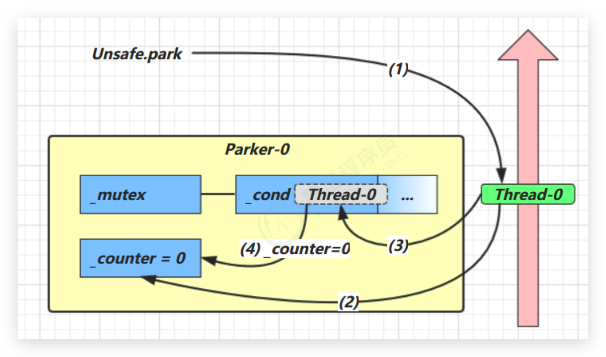

1.  当前线程调用 Unsafe.park() 方法

2.  检查 _counter ，本情况为 0，这时，获得 _mutex 互斥锁
3.  线程进入 _cond 条件变量阻塞
4.  设置 _counter = 0！！！本来就是0

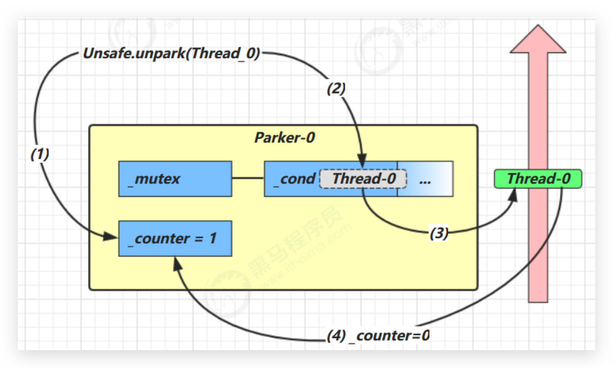

1.   调用 Unsafe.unpark(Thread_0) 方法，设置 _counter 为 1
2.  唤醒 _cond 条件变量中的 Thread_0
3.  Thread_0 恢复运行
4.  设置 _counter 为 0！！！因为运行了消耗所以又改为0

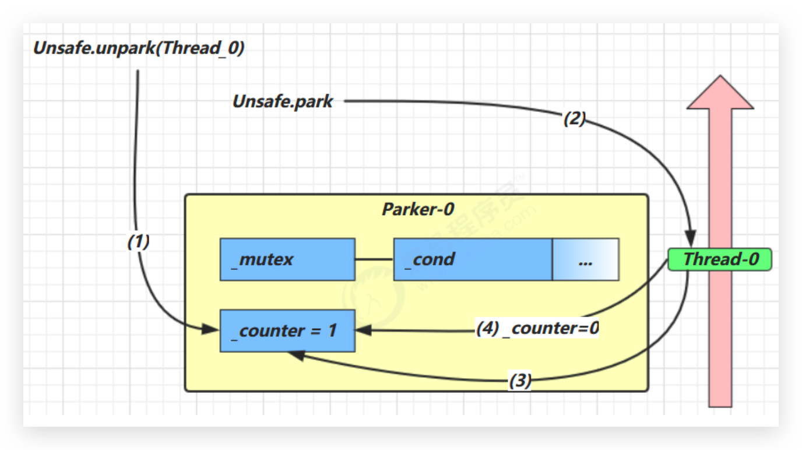

1.  调用 Unsafe.unpark(Thread_0) 方法，设置 _counter 为 1
2.  当前线程调用 Unsafe.park() 方法
3.  检查 _counter ，本情况为 1，这时线程**无需阻塞，继续运行**
4.  设置 _counter 为 0！！！因为运行了消耗所以又改为0


## 多把锁—锁粒度 🔥

一间大屋子有两个功能：睡觉、学习，互不相干。现在小南要学习，小女要睡觉，但如果只用一间屋子（一个对象锁）的话，那么并发度很低。解决方法是准备多个房间（多个对象锁）

例如：

```java
class BigRoom {
    public void sleep() {
        synchronized (this) {
            log.debug("sleeping 2 小时");
            Sleeper.sleep(2);
        }
    }
    public void study() {
        synchronized (this) {
            log.debug("study 1 小时");
            Sleeper.sleep(1);
        }
    }
}

public class Test {
    public static void main(String[] args) {
        BigRoom bigRoom = new BigRoom();
        
        new Thread(() -> {
            bigRoom.compute();
        },"小南").start();
        
        new Thread(() -> {
            bigRoom.sleep();
        },"小女").start();
    }
}
```

某次结果

```
12:13:54.471 [小南] c.BigRoom - study 1 小时
12:13:55.476 [小女] c.BigRoom - sleeping 2 小时
```

改进

```java
class BigRoom {
    private final Object studyRoom = new Object();
    private final Object bedRoom = new Object();
    
    public void sleep() {
        synchronized (bedRoom) {
            log.debug("sleeping 2 小时");
            Sleeper.sleep(2);
        }
    }
    
    public void study() {
        synchronized (studyRoom) {
            log.debug("study 1 小时");
            Sleeper.sleep(1);
        }
    }
}
public class Test {
    public static void main(String[] args) {
        BigRoom bigRoom = new BigRoom();
        
        new Thread(() -> {
            bigRoom.compute();
        },"小南").start();
        
        new Thread(() -> {
            bigRoom.sleep();
        },"小女").start();
    }
}
```

某次执行结果

```
12:15:35.069 [小南] c.BigRoom - study 1 小时
12:15:35.069 [小女] c.BigRoom - sleeping 2 小时
```

将**锁的粒度细分**（业务资源是没有关联的，否则无法细分）

*   好处，是可以**增强并发度**

*   坏处，**如果一个线程需要同时获得多把锁，就容易发生死锁**


## 线程活跃性 🔥

### 死锁 🔥

指两个或两个以上的线程在执行的过程中，因**争夺资源**产生的一种**互相等待**现象。一个线程需要同时获取多把锁，这时就容易发生死锁

不要使用 String 来做锁。如：String s1 = "Hello" 和 String s2 = "Hello" 其实是同一把锁；还会可能与其他类库发生死锁。

t1 线程 获得 A对象 锁，接下来想获取 B对象 的锁 t2 线程 获得 B对象 锁，接下来想获取 A对象的锁。例：

```java
public class DeadLock {
    private static final Object lock1 = new Object();
    private static final Object lock2 = new Object();

    public static void main(String[] args) {
        new Thread(() -> {
            synchronized (lock1) {
                System.out.println("t1 get lock1");
                // 可在此处sleep提高死锁概率
                synchronized (lock2) {
                    System.out.println("t1 get lock2");
                }
            }
        }, "t1").start();

        new Thread(() -> {
            synchronized (lock2) {
                System.out.println("t2 get lock2");
                // 可在此处sleep提高死锁概率
                synchronized (lock1) {
                    System.out.println("t2 get lock1");
                }
            }
        }, "t2").start();
    }
}
```

可能出现的结果有：

```
// 1 正常
t1 get lock1
t1 get lock2
t2 get lock2
t2 get lock1

// 2 正常
t2 get lock2
t2 get lock1
t1 get lock1
t1 get lock2

// 3 死锁
t1 get lock1
t2 get lock2

// 4 死锁
t2 get lock2
t1 get lock1
```


### 定位死锁—jps jstack sconsole 🔥

 `jps` 执行后

```
51203 RemoteMavenServer36
51204 RemoteMavenServer36
26357
51205 RemoteMavenServer36
95943 DeadLock
95942 Launcher
96462 Jps
```

 `jstack 95943`查看 95943 DeadLock

```
2021-02-23 21:51:28
Full thread dump OpenJDK 64-Bit Server VM (25.232-b09 mixed mode):

"Attach Listener" #14 daemon prio=9 os_prio=31 tid=0x00007fba44086800 nid=0xa203 waiting on condition [0x0000000000000000]
   java.lang.Thread.State: RUNNABLE

"DestroyJavaVM" #13 prio=5 os_prio=31 tid=0x00007fba4604e800 nid=0xe03 waiting on condition [0x0000000000000000]
   java.lang.Thread.State: RUNNABLE

"t2" #12 prio=5 os_prio=31 tid=0x00007fba4604d800 nid=0x5b03 waiting for monitor entry [0x00007000111df000]
   java.lang.Thread.State: BLOCKED (on object monitor)
	at _12_deadlock.DeadLock.lambda$main$1(DeadLock.java:30)
	- waiting to lock <0x000000076ac2dc88> (a java.lang.Object)
	- locked <0x000000076ac2dc98> (a java.lang.Object)
	at _12_deadlock.DeadLock$$Lambda$2/764977973.run(Unknown Source)
	at java.lang.Thread.run(Thread.java:748)

"t1" #11 prio=5 os_prio=31 tid=0x00007fba4604d000 nid=0x5903 waiting for monitor entry [0x00007000110dc000]
   java.lang.Thread.State: BLOCKED (on object monitor)
	at _12_deadlock.DeadLock.lambda$main$0(DeadLock.java:20)
	- waiting to lock <0x000000076ac2dc98> (a java.lang.Object)
	- locked <0x000000076ac2dc88> (a java.lang.Object)
	at _12_deadlock.DeadLock$$Lambda$1/1452126962.run(Unknown Source)
	at java.lang.Thread.run(Thread.java:748)

"Service Thread" #10 daemon prio=9 os_prio=31 tid=0x00007fba44828800 nid=0xa603 runnable [0x0000000000000000]
   java.lang.Thread.State: RUNNABLE

"C1 CompilerThread3" #9 daemon prio=9 os_prio=31 tid=0x00007fba45032800 nid=0x5703 waiting on condition [0x0000000000000000]
   java.lang.Thread.State: RUNNABLE

"C2 CompilerThread2" #8 daemon prio=9 os_prio=31 tid=0x00007fba45032000 nid=0xa703 waiting on condition [0x0000000000000000]
   java.lang.Thread.State: RUNNABLE

"C2 CompilerThread1" #7 daemon prio=9 os_prio=31 tid=0x00007fba45031000 nid=0xa903 waiting on condition [0x0000000000000000]
   java.lang.Thread.State: RUNNABLE

"C2 CompilerThread0" #6 daemon prio=9 os_prio=31 tid=0x00007fba49821800 nid=0x4203 waiting on condition [0x0000000000000000]
   java.lang.Thread.State: RUNNABLE

"Monitor Ctrl-Break" #5 daemon prio=5 os_prio=31 tid=0x00007fba4981f800 nid=0x4103 runnable [0x00007000109c7000]
   java.lang.Thread.State: RUNNABLE
	at java.net.SocketInputStream.socketRead0(Native Method)
	at java.net.SocketInputStream.socketRead(SocketInputStream.java:116)
	at java.net.SocketInputStream.read(SocketInputStream.java:171)
	at java.net.SocketInputStream.read(SocketInputStream.java:141)
	at sun.nio.cs.StreamDecoder.readBytes(StreamDecoder.java:284)
	at sun.nio.cs.StreamDecoder.implRead(StreamDecoder.java:326)
	at sun.nio.cs.StreamDecoder.read(StreamDecoder.java:178)
	- locked <0x000000076ac7af78> (a java.io.InputStreamReader)
	at java.io.InputStreamReader.read(InputStreamReader.java:184)
	at java.io.BufferedReader.fill(BufferedReader.java:161)
	at java.io.BufferedReader.readLine(BufferedReader.java:324)
	- locked <0x000000076ac7af78> (a java.io.InputStreamReader)
	at java.io.BufferedReader.readLine(BufferedReader.java:389)
	at com.intellij.rt.execution.application.AppMainV2$1.run(AppMainV2.java:61)

"Signal Dispatcher" #4 daemon prio=9 os_prio=31 tid=0x00007fba4a00b000 nid=0x3f07 runnable [0x0000000000000000]
   java.lang.Thread.State: RUNNABLE

"Finalizer" #3 daemon prio=8 os_prio=31 tid=0x00007fba4a008800 nid=0x3403 in Object.wait() [0x0000700010638000]
   java.lang.Thread.State: WAITING (on object monitor)
	at java.lang.Object.wait(Native Method)
	- waiting on <0x000000076ab08ed8> (a java.lang.ref.ReferenceQueue$Lock)
	at java.lang.ref.ReferenceQueue.remove(ReferenceQueue.java:144)
	- locked <0x000000076ab08ed8> (a java.lang.ref.ReferenceQueue$Lock)
	at java.lang.ref.ReferenceQueue.remove(ReferenceQueue.java:165)
	at java.lang.ref.Finalizer$FinalizerThread.run(Finalizer.java:216)

"Reference Handler" #2 daemon prio=10 os_prio=31 tid=0x00007fba4481d800 nid=0x4d03 in Object.wait() [0x0000700010535000]
   java.lang.Thread.State: WAITING (on object monitor)
	at java.lang.Object.wait(Native Method)
	- waiting on <0x000000076ab06c00> (a java.lang.ref.Reference$Lock)
	at java.lang.Object.wait(Object.java:502)
	at java.lang.ref.Reference.tryHandlePending(Reference.java:191)
	- locked <0x000000076ab06c00> (a java.lang.ref.Reference$Lock)
	at java.lang.ref.Reference$ReferenceHandler.run(Reference.java:153)

"VM Thread" os_prio=31 tid=0x00007fba44016800 nid=0x4f03 runnable

"GC task thread#0 (ParallelGC)" os_prio=31 tid=0x00007fba4480e800 nid=0x1c07 runnable

"GC task thread#1 (ParallelGC)" os_prio=31 tid=0x00007fba4480f000 nid=0x2003 runnable

"GC task thread#2 (ParallelGC)" os_prio=31 tid=0x00007fba4400c000 nid=0x1e03 runnable

"GC task thread#3 (ParallelGC)" os_prio=31 tid=0x00007fba4400c800 nid=0x2a03 runnable

"GC task thread#4 (ParallelGC)" os_prio=31 tid=0x00007fba4481a800 nid=0x5303 runnable

"GC task thread#5 (ParallelGC)" os_prio=31 tid=0x00007fba4400d000 nid=0x5103 runnable

"GC task thread#6 (ParallelGC)" os_prio=31 tid=0x00007fba4400d800 nid=0x2c03 runnable

"GC task thread#7 (ParallelGC)" os_prio=31 tid=0x00007fba4400e800 nid=0x2e03 runnable

"GC task thread#8 (ParallelGC)" os_prio=31 tid=0x00007fba46008800 nid=0x2f03 runnable

"GC task thread#9 (ParallelGC)" os_prio=31 tid=0x00007fba46009000 nid=0x3103 runnable

"VM Periodic Task Thread" os_prio=31 tid=0x00007fba4604c000 nid=0xa403 waiting on condition

JNI global references: 320


Found one Java-level deadlock:
=============================
"t2":
  waiting to lock monitor 0x00007fba4603deb8 (object 0x000000076ac2dc88, a java.lang.Object),
  which is held by "t1"
"t1":
  waiting to lock monitor 0x00007fba4603f2a8 (object 0x000000076ac2dc98, a java.lang.Object),
  which is held by "t2"

Java stack information for the threads listed above:
===================================================
"t2":
	at _12_deadlock.DeadLock.lambda$main$1(DeadLock.java:30)
	- waiting to lock <0x000000076ac2dc88> (a java.lang.Object)
	- locked <0x000000076ac2dc98> (a java.lang.Object)
	at _12_deadlock.DeadLock$$Lambda$2/764977973.run(Unknown Source)
	at java.lang.Thread.run(Thread.java:748)
"t1":
	at _12_deadlock.DeadLock.lambda$main$0(DeadLock.java:20)
	- waiting to lock <0x000000076ac2dc98> (a java.lang.Object)
	- locked <0x000000076ac2dc88> (a java.lang.Object)
	at _12_deadlock.DeadLock$$Lambda$1/1452126962.run(Unknown Source)
	at java.lang.Thread.run(Thread.java:748)

Found 1 deadlock.
```

看 Found one Java-level deadlock: 即可知道：t2线程拥有98的锁，等待88的锁，t1线程相反

 `jconsole`专门有检测死锁按钮


### 哲学家就餐问题 🔥

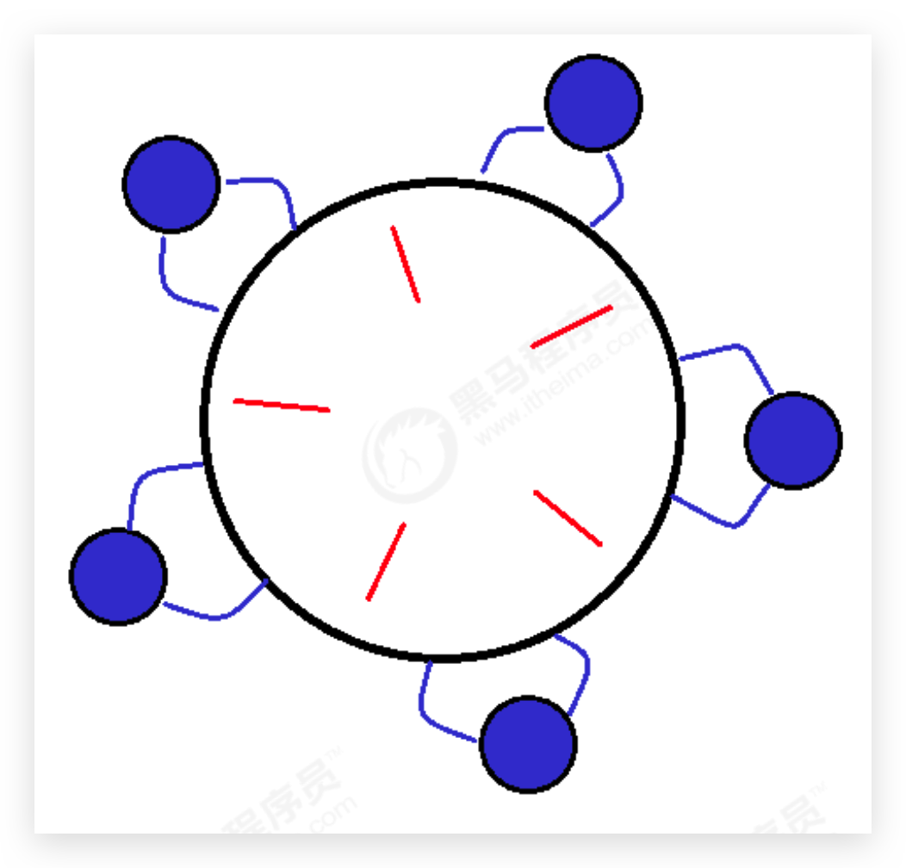

有五位哲学家，围坐在圆桌旁。

* 他们只做两件事，思考和吃饭，思考一会吃口饭，吃完饭后接着思考。

*   吃饭时要用两根筷子吃，桌上共有 5 根筷子，每位哲学家左右手边各有一根筷子。

*   如果筷子被身边的人拿着，自己就得等待

```java
/**
 * 筷子
 */
class Chopstick {

    String name;

    public Chopstick(String name) {
        this.name = name;
    }

    @Override
    public String toString() {
        return "筷子{" + name + '}';
    }
}


/**
 * 哲学家
 */
@Slf4j(topic = "Philosopher")
class Philosopher extends Thread {

    // 筷子充当锁
    final Chopstick left;
    final Chopstick right;

    public Philosopher(String name, Chopstick left, Chopstick right) {
        super(name);
        this.left = left;
        this.right = right;
    }

    @Override
    public void run() {
        while (true) {
            // 获得左手筷子
            synchronized (left) {
                // 获得右手筷子
                synchronized (right) {
                    try {
                        // 吃饭
                        log.debug("eating...");
                        TimeUnit.SECONDS.sleep(1);
                    } catch (InterruptedException e) {
                        e.printStackTrace();
                    }
                }
                // 放下右手筷子
            }
            // 放下左手筷子
        }
    }
}


public class TestPhilosopher {

    public static void main(String[] args) {

        Chopstick c1 = new Chopstick("筷子1");
        Chopstick c2 = new Chopstick("筷子2");
        Chopstick c3 = new Chopstick("筷子3");
        Chopstick c4 = new Chopstick("筷子4");
        Chopstick c5 = new Chopstick("筷子5");
        new Philosopher("苏格拉底", c1, c2).start();
        new Philosopher("柏拉图", c2, c3).start();
        new Philosopher("亚里士多德", c3, c4).start();
        new Philosopher("赫拉克利特", c4, c5).start();
        new Philosopher("阿基米德", c5, c1).start();
    }
}
```

执行不多会，就执行不下去了

```
22:07:22.593 [亚里士多德] DEBUG Philosopher - eating...
22:07:23.594 [亚里士多德] DEBUG Philosopher - eating...
```

使用`jstack`检查死锁

```
2021-02-23 22:08:26
Full thread dump OpenJDK 64-Bit Server VM (25.232-b09 mixed mode):

"Attach Listener" #17 daemon prio=9 os_prio=31 tid=0x00007fc28d117800 nid=0x9c03 waiting on condition [0x0000000000000000]
   java.lang.Thread.State: RUNNABLE

"DestroyJavaVM" #16 prio=5 os_prio=31 tid=0x00007fc28c85a000 nid=0x1203 waiting on condition [0x0000000000000000]
   java.lang.Thread.State: RUNNABLE

"阿基米德" #15 prio=5 os_prio=31 tid=0x00007fc28d81d800 nid=0x9d03 waiting for monitor entry [0x0000700004070000]
   java.lang.Thread.State: BLOCKED (on object monitor)
	at _12_deadlock.Philosopher.run(TestPhilosopher.java:51)
	- waiting to lock <0x000000076ac2fd40> (a _12_deadlock.Chopstick)
	- locked <0x000000076ac2fe40> (a _12_deadlock.Chopstick)

"赫拉克��特" #14 prio=5 os_prio=31 tid=0x00007fc293808800 nid=0x5b03 waiting for monitor entry [0x0000700003f6d000]
   java.lang.Thread.State: BLOCKED (on object monitor)
	at _12_deadlock.Philosopher.run(TestPhilosopher.java:51)
	- waiting to lock <0x000000076ac2fe40> (a _12_deadlock.Chopstick)
	- locked <0x000000076ac2fe00> (a _12_deadlock.Chopstick)

"亚里士多德" #13 prio=5 os_prio=31 tid=0x00007fc292018800 nid=0xa003 waiting for monitor entry [0x0000700003e6a000]
   java.lang.Thread.State: BLOCKED (on object monitor)
	at _12_deadlock.Philosopher.run(TestPhilosopher.java:51)
	- waiting to lock <0x000000076ac2fe00> (a _12_deadlock.Chopstick)
	- locked <0x000000076ac2fdc0> (a _12_deadlock.Chopstick)

"柏拉图" #12 prio=5 os_prio=31 tid=0x00007fc28d113000 nid=0x5a03 waiting for monitor entry [0x0000700003d67000]
   java.lang.Thread.State: BLOCKED (on object monitor)
	at _12_deadlock.Philosopher.run(TestPhilosopher.java:51)
	- waiting to lock <0x000000076ac2fdc0> (a _12_deadlock.Chopstick)
	- locked <0x000000076ac2fd80> (a _12_deadlock.Chopstick)

"苏格拉底" #11 prio=5 os_prio=31 tid=0x00007fc28b86c000 nid=0xa303 waiting for monitor entry [0x0000700003c64000]
   java.lang.Thread.State: BLOCKED (on object monitor)
	at _12_deadlock.Philosopher.run(TestPhilosopher.java:51)
	- waiting to lock <0x000000076ac2fd80> (a _12_deadlock.Chopstick)
	- locked <0x000000076ac2fd40> (a _12_deadlock.Chopstick)

"Service Thread" #10 daemon prio=9 os_prio=31 tid=0x00007fc29282d800 nid=0x5803 runnable [0x0000000000000000]
   java.lang.Thread.State: RUNNABLE

"C1 CompilerThread3" #9 daemon prio=9 os_prio=31 tid=0x00007fc29281d000 nid=0x5703 waiting on condition [0x0000000000000000]
   java.lang.Thread.State: RUNNABLE

"C2 CompilerThread2" #8 daemon prio=9 os_prio=31 tid=0x00007fc292814000 nid=0x5603 waiting on condition [0x0000000000000000]
   java.lang.Thread.State: RUNNABLE

"C2 CompilerThread1" #7 daemon prio=9 os_prio=31 tid=0x00007fc292813800 nid=0xa903 waiting on condition [0x0000000000000000]
   java.lang.Thread.State: RUNNABLE

"C2 CompilerThread0" #6 daemon prio=9 os_prio=31 tid=0x00007fc28d089800 nid=0x3f03 waiting on condition [0x0000000000000000]
   java.lang.Thread.State: RUNNABLE

"Monitor Ctrl-Break" #5 daemon prio=5 os_prio=31 tid=0x00007fc28d05a000 nid=0x4003 runnable [0x000070000354f000]
   java.lang.Thread.State: RUNNABLE
	at java.net.SocketInputStream.socketRead0(Native Method)
	at java.net.SocketInputStream.socketRead(SocketInputStream.java:116)
	at java.net.SocketInputStream.read(SocketInputStream.java:171)
	at java.net.SocketInputStream.read(SocketInputStream.java:141)
	at sun.nio.cs.StreamDecoder.readBytes(StreamDecoder.java:284)
	at sun.nio.cs.StreamDecoder.implRead(StreamDecoder.java:326)
	at sun.nio.cs.StreamDecoder.read(StreamDecoder.java:178)
	- locked <0x000000076ac7ac70> (a java.io.InputStreamReader)
	at java.io.InputStreamReader.read(InputStreamReader.java:184)
	at java.io.BufferedReader.fill(BufferedReader.java:161)
	at java.io.BufferedReader.readLine(BufferedReader.java:324)
	- locked <0x000000076ac7ac70> (a java.io.InputStreamReader)
	at java.io.BufferedReader.readLine(BufferedReader.java:389)
	at com.intellij.rt.execution.application.AppMainV2$1.run(AppMainV2.java:61)

"Signal Dispatcher" #4 daemon prio=9 os_prio=31 tid=0x00007fc28c80e000 nid=0x4207 runnable [0x0000000000000000]
   java.lang.Thread.State: RUNNABLE

"Finalizer" #3 daemon prio=8 os_prio=31 tid=0x00007fc291808800 nid=0x3303 in Object.wait() [0x00007000031c0000]
   java.lang.Thread.State: WAITING (on object monitor)
	at java.lang.Object.wait(Native Method)
	- waiting on <0x000000076ab08ed8> (a java.lang.ref.ReferenceQueue$Lock)
	at java.lang.ref.ReferenceQueue.remove(ReferenceQueue.java:144)
	- locked <0x000000076ab08ed8> (a java.lang.ref.ReferenceQueue$Lock)
	at java.lang.ref.ReferenceQueue.remove(ReferenceQueue.java:165)
	at java.lang.ref.Finalizer$FinalizerThread.run(Finalizer.java:216)

"Reference Handler" #2 daemon prio=10 os_prio=31 tid=0x00007fc28b818800 nid=0x4d03 in Object.wait() [0x00007000030bd000]
   java.lang.Thread.State: WAITING (on object monitor)
	at java.lang.Object.wait(Native Method)
	- waiting on <0x000000076ab06c00> (a java.lang.ref.Reference$Lock)
	at java.lang.Object.wait(Object.java:502)
	at java.lang.ref.Reference.tryHandlePending(Reference.java:191)
	- locked <0x000000076ab06c00> (a java.lang.ref.Reference$Lock)
	at java.lang.ref.Reference$ReferenceHandler.run(Reference.java:153)

"VM Thread" os_prio=31 tid=0x00007fc28d04f000 nid=0x4f03 runnable

"GC task thread#0 (ParallelGC)" os_prio=31 tid=0x00007fc28b816000 nid=0x2007 runnable

"GC task thread#1 (ParallelGC)" os_prio=31 tid=0x00007fc28d808800 nid=0x1b03 runnable

"GC task thread#2 (ParallelGC)" os_prio=31 tid=0x00007fc28e008800 nid=0x1c03 runnable

"GC task thread#3 (ParallelGC)" os_prio=31 tid=0x00007fc28d809000 nid=0x2a03 runnable

"GC task thread#4 (ParallelGC)" os_prio=31 tid=0x00007fc28e009000 nid=0x2b03 runnable

"GC task thread#5 (ParallelGC)" os_prio=31 tid=0x00007fc28e808800 nid=0x2c03 runnable

"GC task thread#6 (ParallelGC)" os_prio=31 tid=0x00007fc28e009800 nid=0x2e03 runnable

"GC task thread#7 (ParallelGC)" os_prio=31 tid=0x00007fc28d809800 nid=0x3003 runnable

"GC task thread#8 (ParallelGC)" os_prio=31 tid=0x00007fc28d80a000 nid=0x5103 runnable

"GC task thread#9 (ParallelGC)" os_prio=31 tid=0x00007fc28d00b000 nid=0x3203 runnable

"VM Periodic Task Thread" os_prio=31 tid=0x00007fc28b820000 nid=0xa403 waiting on condition

JNI global references: 15


Found one Java-level deadlock:
=============================
"阿基米德":
  waiting to lock monitor 0x00007fc28b8708b8 (object 0x000000076ac2fd40, a _12_deadlock.Chopstick),
  which is held by "苏格拉底"
"苏格拉底":
  waiting to lock monitor 0x00007fc28b86dc08 (object 0x000000076ac2fd80, a _12_deadlock.Chopstick),
  which is held by "��拉图"
"柏拉图":
  waiting to lock monitor 0x00007fc28b86db58 (object 0x000000076ac2fdc0, a _12_deadlock.Chopstick),
  which is held by "亚里士多德"
"亚里士多德":
  waiting to lock monitor 0x00007fc28b870808 (object 0x000000076ac2fe00, a _12_deadlock.Chopstick),
  which is held by "赫拉克利特"
"赫拉克利特":
  waiting to lock monitor 0x00007fc28b870758 (object 0x000000076ac2fe40, a _12_deadlock.Chopstick),
  which is held by "阿基米德"

Java stack information for the threads listed above:
===================================================
"阿基米德":
	at _12_deadlock.Philosopher.run(TestPhilosopher.java:51)
	- waiting to lock <0x000000076ac2fd40> (a _12_deadlock.Chopstick)
	- locked <0x000000076ac2fe40> (a _12_deadlock.Chopstick)
"苏格拉底":
	at _12_deadlock.Philosopher.run(TestPhilosopher.java:51)
	- waiting to lock <0x000000076ac2fd80> (a _12_deadlock.Chopstick)
	- locked <0x000000076ac2fd40> (a _12_deadlock.Chopstick)
"柏拉图":
	at _12_deadlock.Philosopher.run(TestPhilosopher.java:51)
	- waiting to lock <0x000000076ac2fdc0> (a _12_deadlock.Chopstick)
	- locked <0x000000076ac2fd80> (a _12_deadlock.Chopstick)
"亚里士多德":
	at _12_deadlock.Philosopher.run(TestPhilosopher.java:51)
	- waiting to lock <0x000000076ac2fe00> (a _12_deadlock.Chopstick)
	- locked <0x000000076ac2fdc0> (a _12_deadlock.Chopstick)
"赫拉克利特":
	at _12_deadlock.Philosopher.run(TestPhilosopher.java:51)
	- waiting to lock <0x000000076ac2fe40> (a _12_deadlock.Chopstick)
	- locked <0x000000076ac2fe00> (a _12_deadlock.Chopstick)

Found 1 deadlock.
```

这种线程没有按预期结束，执行不下去的情况，归类为【活跃性】问题，除了死锁以外，还有活锁和饥饿者两种情况


### 活锁 🔥

活锁出现在两个线程**互相改变对方的结束条件**，最后谁也无法结束，例如

```java
@Slf4j(topic = "LiveLock")
public class LiveLock {

    static volatile int count = 10;

    static final Object lock = new Object();

    public static void main(String[] args) {

        new Thread(() -> {
            // 期望减到 0 退出循环
            while (count > 0) {
                try {
                    TimeUnit.MILLISECONDS.sleep(200);
                    count--;
                    log.debug("count: {}", count);
                } catch (InterruptedException e) {
                    e.printStackTrace();
                }

            }
        }, "t1").start();
        new Thread(() -> {
            // 期望超过 20 退出循环
            while (count < 20) {
                try {
                    TimeUnit.MILLISECONDS.sleep(200);
                    count++;
                    log.debug("count: {}", count);
                } catch (InterruptedException e) {
                    e.printStackTrace();
                }
            }
        }, "t2").start();
    }
}
```

解决：

*   可以让线程交错开，同步执行；
*   增加随机睡眠时间来避免


### 饥饿—reentrantlock解决 🔥

很多教程中把饥饿定义为，一个线程由于**优先级太低**，**始终得不到 CPU 调度执行**，**也不能够结束**，饥饿的情况不易演示，讲**读写锁**时会涉及饥饿问题

下面我讲一下我遇到的一个线程饥饿的例子，先来看看使用**顺序加锁**的方式解决之前的死锁问题

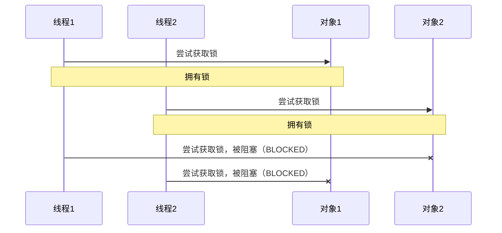

顺序加锁的解决方案

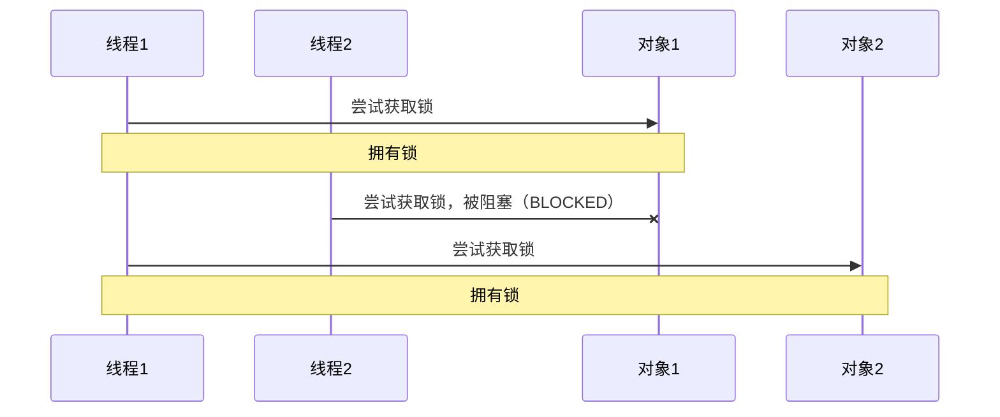

但是顺序加锁容易出现饥饿问题：

```java
/**
 * 筷子
 */
class Chopstick {

    String name;

    public Chopstick(String name) {
        this.name = name;
    }

    @Override
    public String toString() {
        return "筷子{" + name + '}';
    }
}


/**
 * 哲学家
 */
@Slf4j(topic = "Philosopher")
class Philosopher extends Thread {

    // 筷子充当锁
    final Chopstick left;
    final Chopstick right;

    public Philosopher(String name, Chopstick left, Chopstick right) {
        super(name);
        this.left = left;
        this.right = right;
    }

    @Override
    public void run() {
        while (true) {
            // 获得左手筷子
            synchronized (left) {
                // 获得右手筷子
                synchronized (right) {
                    try {
                        // 吃饭
                        log.debug("eating...");
                        TimeUnit.SECONDS.sleep(1);
                    } catch (InterruptedException e) {
                        e.printStackTrace();
                    }
                }
                // 放下右手筷子
            }
            // 放下左手筷子
        }
    }
}


public class TestPhilosopher {

    public static void main(String[] args) {

        Chopstick c1 = new Chopstick("1");
        Chopstick c2 = new Chopstick("2");
        Chopstick c3 = new Chopstick("3");
        Chopstick c4 = new Chopstick("4");
        Chopstick c5 = new Chopstick("5");
        new Philosopher("苏格拉底", c1, c2).start();
        new Philosopher("柏拉图", c2, c3).start();
        new Philosopher("亚里士多德", c3, c4).start();
        new Philosopher("赫拉克利特", c4, c5).start();
        // 本来 c5, c1 改变顺序，即可发现饥饿问题，阿基米德一直得不到执行，赫拉克利特执行最多
        new Philosopher("阿基米德", c1, c5).start();
    }
}
```

第一轮争夺左筷子时，苏和阿同时争夺c1，所以只有一个能争到且苏先运行则苏获取到

第二轮争夺右筷子时，c5没人和赫争（阿已经阻塞）所以赫执行最多


## ReentrantLock 🔥

相对于 synchronized 它具备如下特点

*   与 synchronized 一样，**都支持可重入**

*   **可中断**

*   可以设置**超时时间**

*   可以设置为**公平锁**（解决死锁、饥饿）

*   支持多个条件变量（**不满足条件调用 wait 可在多个 WaitSet 里等待**）


### 可重入


## 7.4 线程安全和同步

#### Lock 锁

- 从 JDK 5.0 开始，Java 提供了更强大的线程同步机制——通过**显式定义同步锁对象**来实现同步。`java.util.concurrent.locks.Lock` **接口**机制提供了比`synchronized`代码块和`synchronized`方法更广泛的锁定操作，同步代码块/同步方法具有的功能 Lock 都有，除此之外更强大，更体现面向对象。

- **Lock 接口的实现类`ReentrantLock`**。可在构造方法中设置是否为**公平锁**（按 FIFO 队列），但是效率可能会变低。

- **Lock 锁也称同步锁**，加锁与释放锁方法化了，如下：

    - `void lock()`：**加同步锁**

    - `void unlock()`：**释放同步锁**

        ```java
        public class Ticket implements Runnable {
        
            private int count = 100;
            private Lock lock = new ReentrantLock();
        
            @Override
            public void run() {
                while (true) {
                    try {
                        // 加同步锁
                        lock.lock();
                        if (count > 0) {
                            try {
                                Thread.sleep(10);
                                System.out.println(Thread.currentThread().getName() + "-->正在卖第" + count + "张票");
                                count--;
                            } catch (InterruptedException e) {
                                e.printStackTrace();
                            }
                        } else {
                            break;
                        }
                    } finally {
                        // 释放同步锁
                        lock.unlock();
                    }
                }
            }
        
            public static void main(String[] args) {
                Ticket ticket = new Ticket();
                new Thread(ticket, "窗口1").start();
                new Thread(ticket, "窗口2").start();
                new Thread(ticket, "窗口3").start();
            }
        }
        ```

#### 

## 习题

### 实现 Runnable 接口的好处 🔥

**其实 Thread 类也是实现了 Runnable 接口**。start 启动线程中内部调用 run 方法时，若是 target 有值（Runnable对象）则调用该 Runnable 对象的 run 方法，无值则调用 Thread 重写的 run 方法。

构造方法初始化时会有

```java
// Thread.java
this.target = target;// 这个即是传入的 Runnable 对象。Thread 匿名内部类对象不会传入构造方法的
```

调用 start 方式时会调用

```java
// Thread.java
@Override
public void run() {
    if (target != null) {
        target.run();
    }
}
```

*   避免了 Java 类**单继承的局限性**
*   多个线程可以共享同一个接口实现类的对象，非常适合多个相同线程来**处理同一个资源**，增加程序的健壮性，实现**解耦**操作，**任务**代码可以被多个线程共享，**任务代码和线程独立**

*   **线程池**只能放入实现 Runable 或 Callable 类线程，不能直接放入继承 Thread 类的线程


### `run()`和`start()`的区别 🔥

- `run()`：仅仅是封装被线程执行的代码，直接调用是普通方法。
- `start()`：首先启动了线程，然后再由 jvm 去调用该线程的 run()方法。

### synchronized 和 Lock 区别

- syn 是关键字属于 **JVM 层面**的（在同步中块中才能调用 wait/notify）；Lock 是接口，是 **Api 层面**的，JVM 将花费较少的时间来调度线程，性能更好。并且具有更好的扩展性（提供更多的子类）
- syn 是**隐式锁**，**出了作用域 或 抛异常会自动释放**；Lock 是**显式锁**（**手动开启和关闭锁**，别忘记关闭锁）
- syn 有代码块锁和方法锁；Lock 只有代码块锁
- **syn 不可中断**；**Lock 可中断**（tryLock 设置超时方法，lockInterruptibly()方代码块中，用 interrupt()方法中断）
- 使用 Lock 的 Condition 可以**精确唤醒**

优先使用顺序：Lock —> 同步代码块(已经进入了方法体，分配了相应资源) —> 同步方法 (在方法体之外)

### sleep 和 wait 异同

- sleep 是 Thread 的方法，可以在任何场景下调用；wait 是 Object 的方法，必须在同步中调用（同步代码块、同步方法）
- 若俩方法都在同步中调用，都会使线程进入 TIME/ WAITING 状态。但 sleep **不会释放锁**，休眠结束回到就绪状态；wait **等待**并立即**释放锁**，**被唤醒后若获得锁则从这里执行后续代码**

### 2 个线程向账户存钱并打印

银行有一个账户，有两个储户分别向同一个账户存 3000 元，每次存 1000，存 3 次。每次存完打印账户余额。

问题:该程序是否有安全问题，如果有，如何解决？此处采用继承 Thread 类来实现（实现 Runnable 接口稍简单）

```java
class Account {
    private double balance;

    public Account(double balance) {
        this.balance = balance;
    }

    //存钱
    public synchronized void deposit(double amt) {
        if (amt > 0) {
            balance += amt;
            System.out.println(Thread.currentThread().getName() + ":存钱成功。余额为：" + balance);
        }
    }
}

class Customer extends Thread {

    private Account acct;

    public Customer(Account acct, String name) {
        super(name);
        this.acct = acct;
    }

    @Override
    public void run() {

        for (int i = 0; i < 3; i++) {
            acct.deposit(1000);

            try {
                Thread.sleep(100);
            } catch (InterruptedException e) {
                e.printStackTrace();
            }
        }
    }
}

public class AccountTest {

    public static void main(String[] args) {
        Account acct = new Account(0);
        new Customer(acct, "甲").start();
        new Customer(acct, "乙").start();
    }
}
```

### 2 个线程交替打印 1-100

同步代码块、同步方法

```java
class PrintThread implements Runnable{

    private int count = 1;

    @Override
    public void run() {
        while (true) {
            // wait、notify 必须在同步中。且调用的对象与锁对象必须相同
            synchronized (this) {
                // 唤醒
                this.notifyAll();
                if (count <= 100) {
                    /*try {
                        // 不加锁时，增加线程安全问题发生的概率
                        Thread.sleep(100);
                    } catch (InterruptedException e) {
                        e.printStackTrace();
                    }*/
                    System.out.println(Thread.currentThread().getName()+":"+count++);

                    try {
                        // 等待并立即释放锁，唤醒后还是从这里继续，但是需要获取到锁，所以外层需要使用 while
                        this.wait();
                    } catch (InterruptedException e) {
                        e.printStackTrace();
                    }
                } else {
                    break;
                }
            }
        }
    }
}

public class PrintTest {

    public static void main(String[] args) {
        PrintThread printThread = new PrintThread();
        // 也可以将 run 方法内容写入普通方法中，采用方法引用来操作
        new Thread(printThread,"A").start();
        new Thread(printThread,"B").start();
    }
}
```

Lock 方式暂时没想到好点的方法

### 生产者消费者问题

见笔记

### 创建多线程的 4 种方式

见笔记


