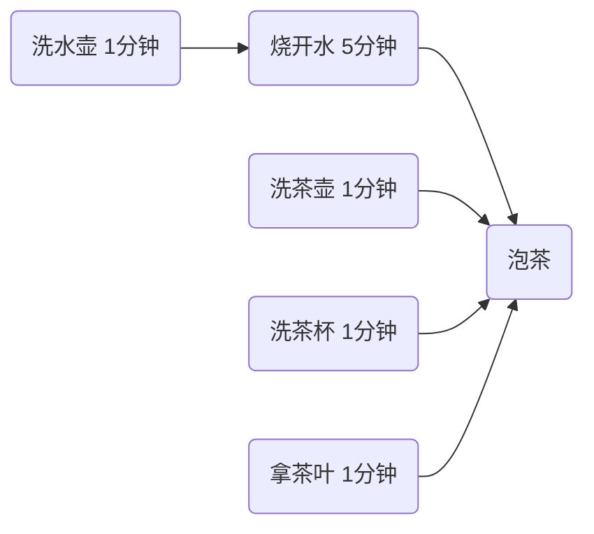
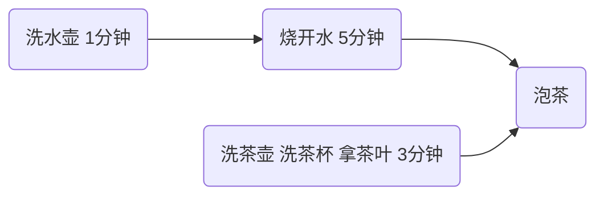

# 多线程应用

## 限流—防止CPU占用 100%

在没有利用 cpu 来计算时，**不要让 while(true) 空转浪费 cpu**，这时可以**使用 yield 或 sleep 来让出 cpu 的使用权给其他程序**。下面这种情况可能出现在服务器开发时，socket 开发时特别常见，监听调用。注意，一定要在单核下测试才更有说服力（从几乎100%到5%左右）。

### sleep 实现

```java
while(true) {
    try {
        Thread.sleep(50);
    } catch (InterruptedException e) {
        e.printStackTrace();
    }
}
```

*   可以用 wait 或 条件变量达到类似的效果
*   不同的是，后两种都需要加锁，并且需要相应的唤醒操作，一般适用于要进行同步的场景
*   sleep 适用于无需锁同步的场景


## 统筹—烧水泡茶

华罗庚《统筹方法》，是一种安排工作进程的数学方法。它的实用范围极广泛，在企业管理和基本建设中，以及关系复杂的科研项目的组织与管理中，都可以应用。怎样应用呢？主要是把**工序安排**好。

比如，想泡壶茶喝。当时的情况是：开水没有；水壶要洗，茶壶、茶杯要洗；火已生了，茶叶也有了。怎么办？

*   办法甲：洗好水壶，灌上凉水，放在火上；在等待水开的时间里，洗茶壶、洗茶杯、拿茶叶；等水开了，泡茶喝。

*   办法乙：先做好一些准备工作，洗水壶，洗茶壶茶杯，拿茶叶；一切就绪，灌水烧水；坐待水开了，泡茶喝。

*   办法丙：洗净水壶，灌上凉水，放在火上，坐待水开；水开了之后，急急忙忙找茶叶，洗茶壶茶杯，泡茶喝。

哪一种办法省时间？我们能一眼看出，第一种办法好，后两种办法都窝了工。

水壶不洗，不能烧开水，因而洗水壶是烧开水的前提。没开水、没茶叶、不洗茶壶茶杯，就不能泡茶，因而这些又是泡茶的前提。它们的相互关系，可以用下边的箭头图来表示：



从这个图上可以一眼看出，办法甲总共要6分钟（而办法乙、丙需要9分钟）。如果要缩短工时、提高工作效率，应当主要抓烧开水这个环节，而不是抓拿茶叶等环节。同时，洗茶壶茶杯、拿茶叶总共不过3分钟，大可利用“等水开”的时间来做。洗茶壶，洗茶杯，拿茶叶，或先或后，关系不大，而且同是一个人的活儿，因而可以合并成为：



参考图，用两个线程（两个人协作）模拟烧水泡茶过程，用 sleep(n) 模拟洗茶壶、洗水壶等耗费的时间


### join 实现

```java
@Slf4j(topic = "TestPlan")
public class TestPlan {

    public static void main(String[] args) {

        test1();


    }


    private static void test1() {
        Thread t1 = new Thread(() -> {
            try {
                log.debug("洗水壶");
                TimeUnit.SECONDS.sleep(1);// 模拟洗水壶1分钟

                log.debug("烧开水");
                TimeUnit.SECONDS.sleep(5);// 模拟烧开水5分钟
            } catch (InterruptedException e) {
                e.printStackTrace();
            }
        }, "老王");


        Thread t2 = new Thread(() -> {
            try {
                log.debug("洗茶壶");
                TimeUnit.SECONDS.sleep(1);// 模拟洗茶壶1分钟

                log.debug("洗茶杯");
                TimeUnit.SECONDS.sleep(1);// 模拟洗茶杯1分钟

                log.debug("拿茶叶");
                TimeUnit.SECONDS.sleep(1);// 模拟拿茶叶1分钟

                // t1执行完毕，通知t2，t2来控制时间泡茶
                t1.join();
                log.debug("泡茶");

            } catch (InterruptedException e) {
                e.printStackTrace();
            }
        }, "小王");

        t1.start();
        t2.start();
    }
}
```

join 解法缺陷：

*   上面模拟的是**小王等老王的水烧开了，小王泡茶**，如果反过来要实现老王等小王的茶叶拿来了，老王泡茶呢？代码最好能适应两种情况。即如何一方做完后**通知**另一方呢？
*   上面的两个线程其实是各执行各的，如果要**模拟老王把水壶交给小王泡茶**，或模拟**小王把茶叶交给老王泡茶**呢


### wait、notify 实现


