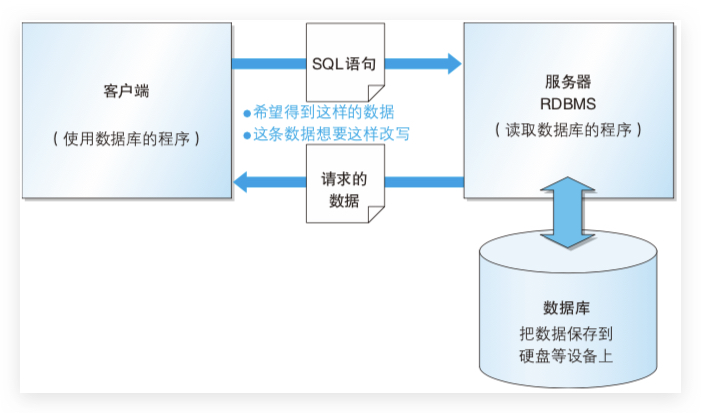
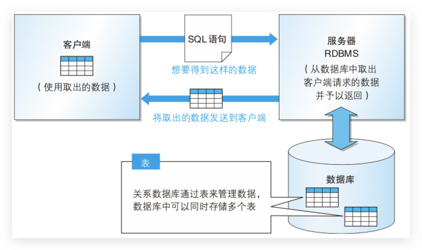

# 数据库简介

## 存储数据方式演变 🔥

从古至今人们都有存储数据的需求，比方说记录账目开支、货物清单、人口统计等等等等，存储的方式也一直在变化。

### 人工管理阶段

很久很久以前，人们把数据存在动物骨头上，后来存到竹片上，再后来存到纸上，直到近代发明了磁带留声机啥的，不过这些都是依赖人工进行整理、保存和查询的，特点就是效率低下、错误率高、查找不方便等等等等。

### 文件系统阶段 🔥

后来人们发明了计算机，为了管理各种数据，人们发明了一种叫文件系统的东东，可以方便的通过文件的存储路径和文件名来访问各个文件的内容，计算机程序也可以直接通过文件系统来操作各种文件，比人工管理爽多了。

### 数据库阶段 🔥

随着文件中存储的内容越来越多，在文件中修改和查找某些数据已经变得非常困难了，所以人们发明了一种专门的软件来管理存储的数据，这些数据依照一定格式保存，通过这个软件可以方便的对数据进行增删改查操作，从而极大的提升了数据管理效率，人们就把这个管理数据的软件叫做数据库管理系统（英文：`Database Management System`，简称：`DBMS`）。

## DBMS（数据库管理系统）

**DBMS**（数据库管理系统）由一个**互相关联的数据的集合**和一组用以**访问这些数据的程序**组成。这个数据集合通常称作数据库（database），其**本质上是一个文件系统**。DBMS 可以实现多个用户同时安全简单地操作大量数据。

DBMS 主要通过数据的保存格式(数据库的种类)来进行分类，现阶段主要有以下 5 种类型：

### 层次数据库(Hierarchical Database，HDB)

最古老的数据库之一，它把数据通过层次结构(树形结构)的方式表现出来。很少使用。

### 关系数据库(Relational Database，RDB)

1969 年诞生，和 Excel 工作表一样，它也采用**由行和列组成的二维表来管理数据**，使用专门 **SQL**(Structured
Query Language，结构化查询语言)对数据进行操作。这种类型的 DBMS 称为关系数据库管理系统(Relational Database Management System，RDBMS)。比较具有代表性的 RDBMS 有如下几种：

-   **MySQL**：**开源免费**的小型的数据库，**功能强大**。已经被 Oracle 收购了。

-   PostgreSQL：开源的RDBMS

-   **Oracle**：收费的大型数据库，Oracle 公司的产品。收购了 Sun 和 MySql

-   SQL Server：MicroSoft 公司收费的中型的数据库。C#、.net 等语言常使用

-   DB2 ：IBM 公司的数据库产品，收费的。常应用在银行系统中

-   SQLite: 嵌入式的小型数据库，应用在手机端，如：Android

### 面向对象数据库(Object Oriented Database，OODB)

把数据以及对数据的操作 集合起来以对象为单位进行管理。面向对象数据库就是用来保存这些对象的数据库。

### XML 数据库(XML Database，XMLDB)

最近几年（SQL基础教程书17年出版），XMLB 作为在网络上进行交互的数据的形式逐渐普及起来。 XML 数据库可以对 XML 形式的大量数据进行高速处理。

### 键值存储系统(Key-Value Store，KVS)

这是一种单纯用来保存查询所使用的主键(Key)和值(Value)的组合的数据库。具有编程语言知识的读者可以把它想象成关联数组或者散列 (hash)。需要对大量数据进行超高速查询的 Web 服务当中。

## RDBMS（关系数据库管理系统）🔥

### 系统架构 🔥

-   RDBMS 通常使用**客户端 / 服务器这样的 CS 系统结构**。
    RDBMS 既可以和其客户端安装在同一台计算机上，也可以分别安装在不同的计算机上。这样一来，不仅可以通过网络使二者相互关联，还可以实现多个客户端访问同一个 RDBMS。
-   通过从客户端向服务器端**发送SQL语句来实现数据库的读写操作**。

### 表的结构 🔥

-   关系数据库采用被称为数据库表的二维表来管理数据。表存储在由 RDBMS 管理的数据库中，可以存储多个表。
-   数据库表由表示数据项目的**列(字段)**和表示一条数据的**行(记录)**所组成，以**行(记录)为单位进行数据读写**。 

### 组成

-   N 个 **DataBase**（文件夹）

    -   N 个 **Table**（文件），其中有定义表的列名和列类型的表结构

        -   N 个**表记录**：一行一行的数据记录

### 特点

*   **持久化存储数据**的。其实数据库就是一个文件系统
*   **方便存储和管理**数据
*   使用了**统一的方式**操作关系型数据库 -- **SQL**

