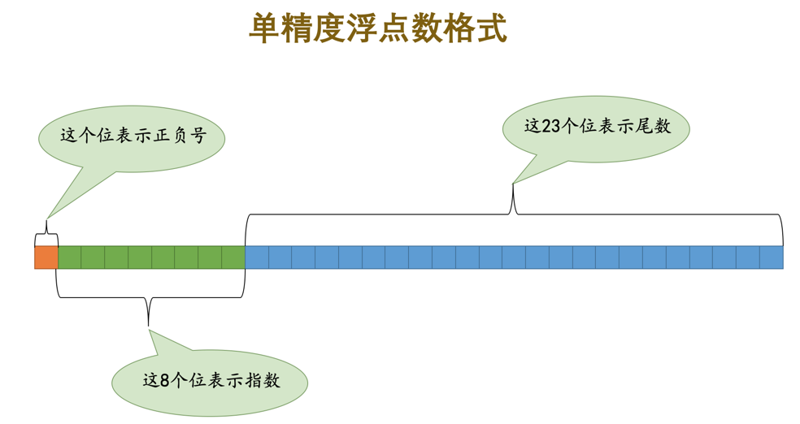
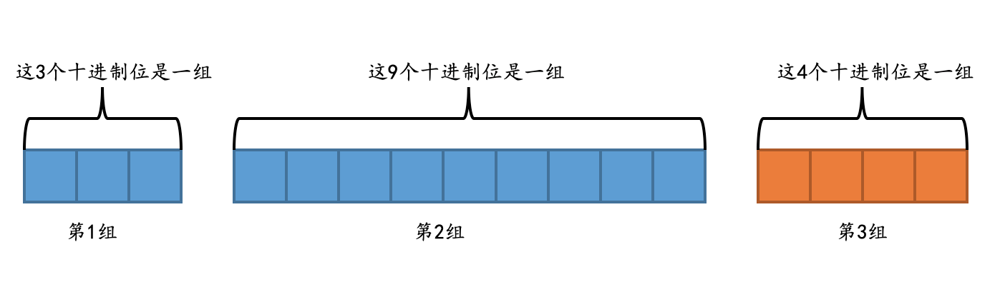

# SQL

## SQL 是什么？分类？

### 结构化查询语言

**结构化查询语言**(Structured Query Language)

-   是一种所有**关系型数据库**的**查询规范**，不同的数据库都支持。 
-   **通用**的数据库操作语言，可以用在不同的数据库中。 
-   不同的数据库 SQL 语句有一些**区别**，称为方言


### 分类

SQL语句**分类**

-   **DDL**（Data Definition Language）：**数据定义语言**
    **数据库、表**的操作：**CREATE / DROP / ALTER**
-   **DML**（Data Manipulation Language）：**数据操作语言**
    对**表记录**的操作：**SELECT / INSERT / UPDATE / DELETE**
-   **DQL**（Data Query Language）：**数据查询语言**，对**表**的**记录**进行查询
-   **DCL**（Data Control Language）：**数据控制语言**
    确认或者取消对数据库中的数据进行的变更；对用户权限的设置； COMMIT / ROLLABCK / GRANT / REVOKE


## 标准 SQL & 语法

每隔几年，ANSI(美国国家标准协会)或 ISO(国际标准化组织)等便会修订 SQL 的标准，进行语法的修订并追加新功能。《SQL基础教程》编写时(2016 年 5 月)使用的是 2011 年修订的最新版本(SQL:2011)。但是，SQL 的标准并不强制RDBMS必须使用国际标准化组织(ISO)为 SQL 制定了相应的标准，以此为基准的 SQL 称为标准 SQL 

标准SQL语法：

-   SQL语句可以在**单行或多行**书写，以**`;`结尾**
-   在 SQL 语句中**直接书写的字符串、日期或者数字**等称为**常数**

-   -   **字符串、日期** 需要用单引号`''`括起来
    -   **数字不需要，直接写**

-   只能使用**半角英文字母、数字、下划线(_)作为数据库、表和列的名称**。名称必须以**半角英文字母开头**
-   单词之间需要使用半角空格或者换行符进行分隔。MySQL 中也可以使用双引号做为分隔符。 
-   注释的三种写法

-   -   单行（MySQL需加空格）：`--空格`；
    -   多行：`/* */`；
    -   mysql特有：`#`

-   SQL**不区别大小写（**建议关键字使用大写，表名、别名、字段名等小写）。但是**插入的数据是区分大小写的！**


## MySQL语句使用注意事项

`MySQL`的基本运行过程就是：通过客户端程序发送命令给服务器程序，服务器程序按照接收的命令去操作实际的数据。在我们使用黑框框启动了`MySQL`客户端程序之后，界面上会一直显示一行字儿：`mysql>`，这是一个提示符，你可以在它后边输入我们的命令然后按下回车键就把命令从客户端程序发送到了服务器程序，在书写命令的时候需要注意下边这几点：

### 命令结束符号

在书写完一个命令之后需要以下边这几个符号之一结尾：

-   `;`
-   `\g`
-   `\G`

比如说我们执行一个简单的查询当前时间的命令：

```
mysql> SELECT NOW();
+---------------------+
| NOW()               |
+---------------------+
| 2018-02-06 17:50:55 |
+---------------------+
1 row in set (0.00 sec)

mysql>
```

其中的`SELECT`意味着这是一个查询命令，`NOW()`是`MySQL`内置的函数，用于返回当前时间。结果中`1 row in set (0.00 sec)`的意思是结果只有1行数据，用时0.00秒。使用`\g`可以起到一样的效果：

```
mysql> SELECT NOW()\g
+---------------------+
| NOW()               |
+---------------------+
| 2018-02-06 17:50:55 |
+---------------------+
1 row in set (0.00 sec)

mysql>
```

`\G`有一点特殊，它并不以表格的形式返回查询结果，而是以`垂直`的形式将每个列都展示在单独的一行中：

```
mysql> SELECT NOW()\G
*************************** 1. row ***************************
NOW(): 2018-02-06 17:51:51
1 row in set (0.00 sec)

mysql>
```

如果查询结果的列数非常多的话，使用`\G`可以让我们看清结果。


### 命令可以随意换行

并不是按了回车键就提交命令了，只要按回车键的时候输入的语句里没有`;`、`\g`或者`\G`这些语句结束符号，该语句就算是没结束。比如上边查询当前时间的命令还可以这么写：

```
mysql> SELECT
    -> NOW()
    -> ;
+---------------------+
| NOW()               |
+---------------------+
| 2018-02-06 17:57:15 |
+---------------------+
1 row in set (0.00 sec)

mysql>
```


### 可以一次提交多个命令

我们可以在一条语句里写多个命令(命令之间用上面说的结束符分隔)，比如这样：

```
mysql> SELECT NOW(); SELECT NOW(); SELECT NOW();
+---------------------+
| NOW()               |
+---------------------+
| 2018-02-06 18:00:05 |
+---------------------+
1 row in set (0.00 sec)

+---------------------+
| NOW()               |
+---------------------+
| 2018-02-06 18:00:05 |
+---------------------+
1 row in set (0.00 sec)

+---------------------+
| NOW()               |
+---------------------+
| 2018-02-06 18:00:05 |
+---------------------+
1 row in set (0.00 sec)

mysql>
```

连着输入了3个查询当前时间的命令，**只要没按回车键，就不会提交命令**。把命令都写在文件里再批量执行同理。


### 使用`\c`放弃本次操作

如果你想放弃本次编写的命令，可以在输入的命令后边加上`\c`，比如这样：

```
mysql> SELECT NOW()\c
mysql>
```

如果不使用`\c`，那客户端会以为这是一个多行命令，还在一直傻傻的等你输入命令～


### 命令大小写问题

`MySQL`默认对命令的大小写并没有限制，也就是说我们这样查询当前时间也是可以的：

```
mysql> select now();
+---------------------+
| now()               |
+---------------------+
| 2018-02-06 18:23:01 |
+---------------------+
1 row in set (0.00 sec)

mysql>
```

不过按照习俗，这些命令、函数什么的都是要大写的，而一些名称类的东西，比如数据库名，表名、列名啥的都是要小写的


### 字符串的表示（推荐`单引号`）

在命令里有时会使用到字符串，我们可以使用单引号`''`或者双引号`""`把字符串内容引起来，比如这样：

```
mysql> SELECT 'aaa';
+-----+
| aaa |
+-----+
| aaa |
+-----+
1 row in set (0.00 sec)

mysql>
```

这个语句只是简单的把字符串`'aaa'`又输出来了而已。但是一定要在字符串内容上加上引号，不然的话`MySQL`服务器会把它当作列名，比如这样就会返回一个错误：

```
mysql> SELECT aaa;
ERROR 1054 (42S22): Unknown column 'aaa' in 'field list'
mysql>
```

但是`MySQL`中有一种叫`ANSI_QUOTES`的模式，如果开启了这种模式，双引号就有其他特殊的用途了，至于是什么用途对于小白的你并不重要，你也不需要理解什么是个`ANSI_QUOTES`模式，重要的**建议你最好使用单引号来表示字符串**～


## MySQL 大小写问题 🔥

MySQL 在 Windows 下都不区分大小写，在 Linux 下，MySQL 对表名和数据库名是区分大小写的。

关于**表名大小**写的问题：

-   Oracle: `SELECT * FROM HEROS`与`SELECT * FROM heros`一样，因为 Oracle 会自动把`SELECT * FROM heros`转化为`SELECT * FROM HEROS`进行查询。**数据库中存的表是大写**的。
-   MySQL: `SELECT * FROM HEROS`与`SELECT * FROM heros`是否一样取决于参数`lower_case_table_names`，如`lower_case_table_names=1`，这两个查询是一样的。`SELECT * FROM HEROS`会自动转化为`SELECT * FROM heros`。因为**数据库中存的表名是小写**的。否则就有区别了。

关于**字符大小写**的问题：

-   Oracle: `SELECT * FROM heros WHERE role_main = 'ZHANGSHI'`与`SELECT * FROM heros WHERE role_main = 'zhangshi'`不一样，**字符大小写敏感**
-   MySQL: `SELECT * FROM heros WHERE role_main = 'ZHANGSHI'`与`SELECT * FROM heros WHERE role_main = 'zhangshi'`是否一样**与该字段的`collate`定义有关**


## MySQL 列数据类型 🔥

### 数字类型—整数（精确值）🔥

很显然，使用的字节数越多，意味着能表示的数值范围就越大，但是也就越耗费存储空间。根据表示一个数占用字节数的不同，`MySQL`把整数划分成如下所示的类型：

|             类型              | 占用的字节 |      无符号数取值范围      |            有符号数取值范围             |      含义      |
| :---------------------------: | :--------: | :------------------------: | :-------------------------------------: | :------------: |
|           `TINYINT`           |     1      |     0 ~ 2⁸-1<br/>0~255     |         -2⁷ ~ 2⁷-1<br/>-128~127         |  非常小的整数  |
|      标准SQL：`SMALLINT`      |     2      |   0 ~ 2¹⁶-1<br/>0~65535    |      -2¹⁵ ~ 2¹⁵-1<br/>-32768~32767      |    小的整数    |
|          `MEDIUMINT`          |     3      |  0 ~ 2²⁴-1<br/>0~16777215  |    -2²³ ~ 2²³-1<br/>-8388608~8388607    | 中等大小的整数 |
| 标准SQL：`INT`或别名`INTEGER` |     4      | 0 ~ 2³²-1<br/>0~4294967295 | -2³¹ ~ 2³¹-1<br/>-2147483648~2147483647 |   标准的整数   |
|           `BIGINT`            |     8      |         0 ~ 2⁶⁴-1          |              -2⁶³ ~ 2⁶³-1               |     大整数     |

以`TINYINT`为例，用1个字节，也就是8个位表示`有符号数`的话，就是既可以表示正数，也可以表示负数的话，需要有一个比特位表示正负号。但是如果表示`无符号数`的话，也就是只表示非负数的话，就不需要表示正负号，这是`有符号数`和`无符号数`的区别。


### 数字类型—浮点（不精确值）

#### 用二进制表示十进制小数

::: tip 用二进制表示十进制小数

浮点数是用来表示小数的，我们平时用的十进制小数也可以被转换成二进制后被计算机存储。比如`9.875`，这个小数可以被表示成这样：

```
9.875 = 8 + 1 + 0.5 + 0.25 + 0.125 = 1 × 2³ + 1 × 2⁰ + 1 × 2⁻¹ + 1 × 2⁻² + 1 × 2⁻³ 
```

也就是说，如果十进制小数`9.875`转换成二进制小数的话就是：`1001.111`。为了在计算机里存储这种二进制小数，我们统一把它们表示成`a × 2ⁿ`的科学计数法的形式，其中1≤`|a|`＜2（其首位数必然是1，二进制嘛），比如`1001.111`可以被表示成`1.001111 × 2³`，我们把小数点之后的`001111`称为`尾数`，把`2³`中的`3`称为`指数`，然后**只需要在计算机中的比特位中表示出`尾数`和`指数`就行了**。另外，小数也有正负之分，我们还需要单独的部分来表示小数的正负号。综上所述，表示一个浮点数需要下边几个部分：

-   **符号部分，占用1个比特位即可**。
-   **尾数部分，视具体浮点数格式而定**。
-   **指数部分，视具体浮点数格式而定**。

:::

#### 浮点数类型

很显然，我们表示一个浮点数使用的字节数越多，表示`尾数`和`指数`的范围就越大，也就是说可以表示的小数范围就越大，设计`MySQL`的大叔根据表示一个小数需要的不同字节数定义了如下的两种浮点数类型：

|   类型   | 占用的存储空间（单位：字节） |     绝对值最小非0值      |     绝对值最大非0值      |     含义     |
| :------: | :--------------------------: | :----------------------: | :----------------------: | :----------: |
| `FLOAT`  |              4               |     ±1.175494351E-38     |     ±3.402823466E+38     | 单精度浮点数 |
| `DOUBLE` |              8               | ±2.2250738585072014E-308 | ±1.7976931348623157E+308 | 双精度浮点数 |


以单精度浮点数类型`FLOAT`类型为例，它占用的4个字节的各个组成部分如下图所示：



另外需要注意的是，虽然有的十进制小数，比如`1.875`可以被很容易的转换成二进制数`1.111`，但是更多的小数是无法直接转换成二进制的，比如说`0.3`，它转换成的二进制小数就是一个无限小数，但是我们现在只能用4个字节或者8个字节来表示这个小数，所以只能进行一些舍入来近似的表示，所以我们说计算机的浮点数表示有时是**不精确**的。

#### 设置最大位数和小数位数

在定义浮点数类型时，还可以在`FLOAT`或者`DOUBLE`后边跟上两个参数，就像这样：

```
FLOAT(M, D)
DOUBLE(M, D)
```

对于我们用户而言，使用的都是十进制小数。如果我们事先知道表中的某个列要存储的小数在一定范围内，我们可以使用`FLOAT(M, D)`或者`DOUBLE(M, D)`来限制可以存储到本列中的小数范围。其中：

-   `M`表示该小数最多需要的十进制有效数字个数。

    注意是`有效数字`个数，比方说对于小数`-2.3`来说有效数字个数就是2，对于小数`0.9`来说有效数字个数就是`1`。

-   `D`表示该小数的小数点后的十进制数字个数。

    这个好理解，小数点后有几个十进制数字，`D`的值就是什么。

举个例子看一下，设置了`M`和`D`的单精度浮点数的取值范围的变化：

|     类型      |     取值范围     |
| :-----------: | :--------------: |
| `FLOAT(4, 1)` |   -999.9~999.9   |
| `FLOAT(5, 1)` |  -9999.9~9999.9  |
| `FLOAT(6, 1)` | -99999.9~99999.9 |
| `FLOAT(4, 0)` |    -9999~9999    |
| `FLOAT(4, 1)` |   -999.9~999.9   |
| `FLOAT(4, 2)` |   -99.99~99.99   |

可以看到，在D相同的情况下，M越大，该类型的取值范围越大；在M相同的情况下，D越大，该类型的取值范围越小。当然，`M`和`D`的取值也不是无限大的，`M`的取值范围是`1~255`，`D`的取值范围是`0~30`，而且`D`的值必须不大于`M`。`M`和`D`都是可选的，如果我们省略了它们，那它们的值按照机器支持的最大值来存储。


### 数字类型—定点（精确值）🔥

#### 定点数类型

正因为用浮点数表示小数可能会有不精确的情况，在一些情况下我们必须保证小数是精确的，所以设计`MySQL`的大叔们提出一种称之为`定点数`的数据类型，它也是存储小数的一种方式：

|      类型       | 占用的存储空间（单位：字节） |  取值范围  |
| :-------------: | :--------------------------: | :--------: |
| `DECIMAL(M, D)` |          取决于M和D          | 取决于M和D |

此处的`M`和`D`的含义与浮点数中的含义一样。`M`和`D`对取值范围的影响我们之前在唠叨浮点数的时候已经介绍过了，但是我们又说单精度浮点数类型`FLOAT(M, D)`占用的字节数一直都是4字节，双精度浮点数`DOUBLE(M, D)`占用的字节数一直都是8字节，它们占用的存储空间大小并不随着M和D的值的变动而变动，为啥到了这个所谓的定点数类型`DECIMAL(M, D)`中，它占用的存储空间大小就和`M`、`D`的取值有关了呢？哈哈，回答这个问题还得且听我细细道来。


#### 分析

我们说定点数是一种精确的小数，为了达到精确的目的我们就不能把它转换成二进制小数之后再存储(因为有很多十进制小数转为二进制小数后需要进行舍入操作，导致二进制小数表示的数值是不精确的)。其实转念一想，所谓的小数只是把两个十进制整数用小数点分割开来而已，我们只要把小数点左右的两个十进制整数给存储起来，那不就是精确的了么。比方说对于十进制小数`2.38`来说，我们可以把这个小数的小数点左右的两个整数，也就是`2`和`38`分别保存起来，那么不就相当于保存了一个精确的小数么，这波操作是不是很6。

当然事情并没有这么简单，对于给定`M`、`D`值的`DECIMAL(M, D)`类型，比如`DEMCIMAL(16, 4)`来说：

*   首先确定小数点左边的整数最多需要存储的十进制位数是12位，小数点右边的整数需要存储的十进制位数是4位，如图所示：

    

*   从小数点位置出发，每个整数每隔9个十进制位划分为1组，效果就是这样：

    

    从图中可以看出，如果不足9个十进制位，也会被划分成一组。

*   针对每个组中的十进制数字，将其转换为二进制数字进行存储，根据组中包含的十进制数字位数不同，所需的存储空间大小也不同，具体见下表：

    | 组中包含的十进制位数 | 占用存储空间大小（单位：字节） |
    | :------------------: | :----------------------------: |
    |         1或2         |               1                |
    |         3或4         |               2                |
    |         5或6         |               3                |
    |       7或8或9        |               4                |

    所以`DECIMAL(16, 4)`共需要占用`8`个字节的存储空间大小，这8个字节由下边3个部分组成：

    -   第1组包含3个十进制位，需要使用2个字节存储。
    -   第2组包含9个十进制位，需要使用4个字节存储。
    -   第3组包含4个十进制位，需要使用2个字节存储。

*   将转换完成的比特位序列的最高位设置为1。


#### 例子

这些步骤看的有一丢丢懵逼吧，别着急，举个例子就都清楚了。比方说我们使用定点数类型`DECIMAL(16, 4)`来存储十进制小数`1234567890.1234`，这个小数会被划分成3个部分：

```
1 234567890 1234
```

也就是：

-   第1组中包含整数`1`。
-   第2组中包含整数`234567890`。
-   第3组中包含整数`1234`。

然后将每一组中的十进制数字转换成对应的二进制数字：

-   第1组占用2个字节，整数`1`对应的二进制数就是（字节之间实际上没有空格，只不过为了大家理解上的方便我们加了一个空格）：

    ```
    00000000 00000001
    ```

    二进制看起来太难受，我们还是转换成对应的十六进制看一下：

    ```
    0x0001
    ```

-   第2组占用4个字节，整数`234567890`对应的十六进制数就是：

    ```
    0x0DFB38D2
    ```

-   第3组占用2个字节，整数`1234`对应的十六进制数就是：

    ```
    0x04D2
    ```

所以将这些十六进制数字连起来之后就是：

```
0x00010DFB38D204D2
```

最后还要将这个结果的最高位设置为1，所以最终十进制小数`1234567890.1234`使用定点数类型`DECIMAL(16, 4)`存储时共占用8个字节，具体内容为：

```
0x80010DFB38D204D2
```

有的同学会问，如果我们想使用定点数类型`DECIMAL(16, 4)`存储一个负数怎么办，比方说`-1234567890.1234`，这时只需要将`0x80010DFB38D204D2`中的每一个比特位都执行一个取反操作就好，也就是得到下边这个结果：

```
0x7FFEF204C72DFB2D
```

从上边的叙述中我们可以知道，对于`DECIMAL(M, D)`类型来说，给定的`M`和`D`的值不同，所需的存储空间大小也不同。可以看到，与浮点数相比，定点数需要更多的空间来存储数据，所以如果不是在某些需要存储精确小数的场景下，一般的小数用浮点数表示就足够了。

对于定点数类型`DECIMAL(M, D)`来说，`M`和`D`都是可选的，默认的`M`的值是10，默认的`D`的值是0，也就是说下列等式是成立的：

```
DECIMAL = DECIMAL(10) = DECIMAL(10, 0)
DECIMAL(n) = DECIMAL(n, 0)
```

另外`M`的范围是`1~65`，`D`的范围是`0~30`，且`D`的值不能超过`M`。


### 无符号数值类型的表示

对于数值类型，包括整数、浮点数和定点数，有些情况下我们只需要用到无符号数（就是非负数）。`MySQL`给我们提供了一个表示无符号数值类型的方式，就是在原数值类型后加一个单词`UNSIGNED`：

```
数值类型 UNSIGNED
```

大家可以把它当成一种新类型对待，比如`INT UNSIGNED`就表示无符号整数，`FLOAT UNSIGNED`表示无符号浮点数，`DECIMAL UNSIGNED`表示无符号定点数。

::: tip 提示

在使用的存储空间大小相同的情况下，无符号整数可以表示的正整数范围比有符号整数能表示的正整数范围大一倍。不过受浮点数和定点数具体的存储格式影响，无符号浮点数和定点数并不能提升正数的表示范围。

:::


### 数字类型


-   Fixed-Point 定点类型（精确值）
    `DECIMA` 和 `NUMERIC` 类型的存储精确的数值数据。在保持精确精度很重要时使用这些类型，例如使用货币数据。MySQL DECIMAL 以二进制格式存储值。
    在 DECIMAL 列声明中，可以（通常是）指定精度和小数位数。例如：`salary DECIMAL(5,2)`
    标准SQL要求`DECIMAL(5,2)`能够存储五位数和两位小数的任何值，因此可以存储在 salary 列中的值的范围`-999.99`是 `999.99`。
-   Floating-Point 浮点类型（近似值）
    `FLOAT`和`DOUBLE`类型代表近似数字数据值。MySQL对于单精度值使用四个字节，对于双精度值使用八个字节。
    对于FLOAT，SQL标准允许在括号中的关键字FLOAT后面的位中选择性地指定精度（但不是指数的范围）；也就是FLOAT（p）。 MySQL还支持这种可选的精度规范，但FLOAT（p）中的精度值仅用于确定存储大小。 精度从0到23会产生一个4字节的单精度FLOAT列。 从24到53的精度产生8字节双精度DOUBLE列。
    例如`DOUBLE(5,2)`表示最多5位，其中必须有2位小数，即最大值为999.99。从MySQL 8.0.17开始不推荐使用非标准语法，并且在将来的版本中将删除对它的支持。`FLOAT(M,D)` `DOUBLE(M,D)`
-   Bit 位类型
-   ……


### 日期和时间类型

-   `DATE`：日期类型，格式为`yyyy-MM-dd`，只有年月日，没时分秒

>   除了年月日之外，Oracle 中使用的 DATE 型还包含时分秒

-   `TIME`：时间类型，格式为`HH:mm:ss`
-   `DATETIME`：同时可以表示日期和时间，格式为`yyyy-MM-dd HH:mm:ss`
-   `TIMESTAMP`：同上，若不给这个字段赋值，或赋值为null，则默认使用当前系统时间


### 字符串类型

-   `CHAR`：固定长度字符串类型； `CHAR(255)`，数据的长度不足指定长度，补空格到指定长度！
    `VARCHAR`：可变长度**字符**串类型；`VARCHAR(65535)`

>   Oracle 中使用 VARCHAR2 型 ( MySQL 中也有 VARCHAR 这种数据类型，但并不推荐使用)

-   `BLOB`：**大字节类型**；tinyblob(2^ 8-1B)、blob(2^ 16-1B)、mediumblob(2^ 24-1B)、longblob(2^32-1B)
    `TEXT(CLOB)`：**大字符串类型**；tinytext(2^ 8-1B)、text(2^ 16-1B)、mediumtext(2^24-1 B)、longtext(2^32-1B)


### 常用的字段列类型 🔥

*   **身份证号**由于最后一位可能是X，所以就归为**字符串**了


## DDL

**无需COMMIT**

**
**

### 操作数据库 

#### 创建数据库(CREATE DATABASE)

```
CREATE DATABASE [IF NOT EXISTS] 数据库名 [CHARSET=UTF8];
```


#### 查看所有数据库(SHOW DATABASES)

```
SHOW DATABASES;
```

**
**

#### 查看数据库定义信息

包括创建语句和字符集

```
SHOW CREATE DATABASE 数据库名;
```


#### 修改数据库编码

```
ALTER DATABASE 数据库名 CHARACTER  SET UTF8;
```


#### 删除数据库(DROP DATABASE)

```
DROP DATABASE [IF EXISTS] 数据库名;
```


#### 切换数据库(USE 数据库名)

```
USE 数据库名;
```


#### 查看当前使用的数据库，MySQL特有

```
SELECT DATABASE();
```


### 操作表 

#### 创建表(CREATE TABLE)

```
CREATE TABLE [IF NOT EXISTS] 表名(
  列名 列类型 该列所需约束,
  列名 列类型 该列所需约束,
  ...
  列名 列类型 该列所需约束,
  PRIMARY KEY (列名)
);
-- 约束可以在定义列的时候进行设置，也可以在语句的末尾进行设置。但是NOT NULL约束只能以列为单位进行设置
DROP TABLE IF EXISTS `player`;
CREATE TABLE `player`  (
    `player_id` int(11) NOT NULL AUTO_INCREMENT,
    `team_id` int(11) NOT NULL,
    `player_name` varchar(255) CHARACTER SET utf8 COLLATE utf8_general_ci NOT NULL,
    `height` float(3, 2) NULL DEFAULT 0.00,
    PRIMARY KEY (`player_id`) USING BTREE,
    UNIQUE INDEX `player_name`(`player_name`) USING BTREE
) ENGINE = InnoDB CHARACTER SET = utf8 COLLATE = utf8_general_ci ROW_FORMAT = Dynamic;
-- 其中 player_name 字段的字符集是 utf8（推荐utf-8mb4），排序规则是 utf8_general_ci，代表对大小写不敏感，如果设置为utf8_bin，代表对大小写敏感，还有许多其他排序规则这里不进行介绍。
```

#### 复制表结构

```
CREATE TABLE 表名 LIKE 被复制的表名;
```


#### 查看当前数据库中所有表名称 🔥

```
SHOW TABLES;
```


#### **查看表结构 🔥**

```
DESC 表名;
```


#### 查看指定表的定义信息，包括SQL创建语句、字符集

```
SHOW CREATE TABLE 表名;
```


#### 删除表(DROP TABLE) 🔥

```
DROP TABLE [IF EXISTS] 表名;
```


#### 修改表名称(RENAME TO)

```
ALTER TABLE 原表名 RENAME TO 新表名; -- Oracle和PostgreSQL使用这个，MySQL8测试也可以使用
RENAME TABLE 原表名 TO 新表名;
```


#### 修改之添加列(ADD)

```
ALTER TABLE 表名 ADD /*COLUMN*/(
  列名 列类型 该列所需约束,
    列名 列类型 该列所需约束,
  ...
);
-- MySQL、Oracle、SQL Server中可以不用写COLUMN，PostgreSQL需写上
```


#### 修改之删除列(DROP)

```
ALTER TABLE 表名 DROP /*COLUMN*/ 列名;
-- MySQL、Oracle可以用 (列名，列名...)来删除多个列
-- MySQL、Oracle、SQL Server中可以不用写COLUMN，PostgreSQL需写上
```


#### 修改之修改列名/类型(CHANGE)

```
ALTER TABLE 表名 CHANGE 原列名 新列名 列类型 主键自增长 非空约束; -- 新的类型可能会影响到已存在数据
ALTER TABLE player RENAME COLUMN age to player_age -- RENAME也可以
```


#### 修改之修改列类型(MODIFY)

```
ALTER TABLE 表名 MODIFY 列名 列类型 主键自增长 非空约束 -- /新的类型可能会影响到已存在数据
```


#### 修改表的字符集

```
ALTER TABLE 表名 CHARACTER  SET UTF8;
```


## 列数据类型 🔥

-   

……


## 约束 🔥

对表中的数据进行限制，保证数据的正确性、有效性和完整性。用来**约束列**

**
**

### PRIMARY KEY

特点：**非空**、**唯一**、**被外键引用**。一般设置id为主键，不是业务字段（身份证等不建议做主键），一张表只能有一个字段

-   **创建表时设置主键**

```
CREATE TABLE stu(
    stuid CHAR(6) PRIMARY KEY
);

CREATE TABLE stu(
    stuid CHAR(6),
  PRIMARY KEY(stuid)
);
```

-   **修改表时添加主键**

```
ALTER TABLE stu ADD PRIMARY KEY(sid); -- CHANGE、MODIFY也行
```

-   **删除主键**

```
ALTER TABLE stu DROP PRIMARY KEY;
```


### AUTO_INCREMENT 🔥

保证在插入数据时主键列的唯一和非空特性，默认为1，根据读取的**上一条记录**的值

-   创建表时指定主键自增长

```
CREATE TABLE stu(
    stuid CHAR(6) PRIMARY KEY AUTO_INCREMENT
)[auto_increment = 1000]; -- []中设置主键起始值
```

-   修改表时设置主键自增长

```
ALTER TABLE stu MODIFY sid INT AUTO_INCREMENT; -- 或用CHANGE，需添加新名称
ALTER TABLE stu AUTO_INCREMENT = 2000; -- 设置主键起始值
```

-   修改表时删除主键自增长

```
ALTER TABLE stu MODIFY sid INT; -- 或用CHANGE，需添加新名称
```


### DELETE和TRUNCATE对自增长的影响 🔥

-   DELETE：删除所有的记录之后，自增长没有影响
-   TRUNCATE：删除以后，自增长又重新开始


### NOT NULL

因为某些列**不能设置为NULL**值，所以可以对列添加非空约束。可以设置**默认约束**

-   创建表时设置

```
CREATE TABLE stu(
        sid INT PRIMARY KEY AUTO_INCREMENT,
        sname VARCHAR(20) NOT NULL DEFAULT `王八蛋`, -- 默认值，不设置时使用默认值，设置为DEFAULT时使用默认值
);
```

-   修改表时设置

```
ALTER TABLE stu MODIFY name VARCHAR(20) NOT NULL; -- 或用CHANGE，需添加新名称
```

-   删除

```
ALTER TABLE stu MODIFY name VARCHAR(20); -- 或用CHANGE，需添加新名称
```


### UNIQUE

Navicat中显示在索引中

数据库某些列**不能设置重复**的值，所以可以对列添加唯一约束。**NULL中没有值，不存在重复的问题**

-   创建表时设置

```
CREATE TABLE stu(
        sid INT PRIMARY KEY AUTO_INCREMENT,
        phone_number VARCHAR(11) UNIQUE
);
```

-   修改表时设置

```
ALTER TABLE student MODIFY name VARCHAR(20); -- 或用CHANGE，需添加新名称
```

-   删除

```
ALTER TABLE stu DROP INDEX phone_number;
```


### FOREIGN KEY

外键：在从表（多）中与主表（一）主键对应的那一列，如：员工表中的 dep_id 

一张表中可以有**多个外键**。外键**可以为空**、**可以重复**、必须是另一表(可以是自己)的主键的值(**外键要引用主键**)

语法：

```
[CONSTRAINT 约束名称] FOREIGN KEY(外键列名) REFERENCES 关联表(关联表的主键) -- 约束名称可省略
```

-   **创建表时指定外键约束**

```
create talbe emp (
    empno int primary key,
    ...
    deptno int,
    CONSTRAINT fk_emp_dpet FOREIGN KEY(dpetno) REFERENCES dpet(dpetno)
    /*CONSTRAINT fk_emp FOREIGN KEY(mgr) REFERENCES emp(empno)*/
);
```

-   **修改表时添加外键约束**

```
ALERT TABLE emp
ADD CONSTRAINT fk_emp_dept FOREIGN KEY(deptno) REFERENCES dept(deptno);
```

-   **删除外键约束**

```
ALTER TABLE emp DROP FOREIGN KEY fk_emp_dept;/*约束名称*/
```


**外键的级联（谨慎使用）**：在修改和删除主表的主键时，同时更新或删除副表的外键值，称为级联操作。

```
create talbe emp (
    ...
    deptno int,
    CONSTRAINT fk_emp_dpet FOREIGN KEY(dpetno) REFERENCES dpet(dpetno) on update cascade on delete cascade 
);
```


## DML 🔥

### 插入数据(INSERT INTO) 🔥

```
START TRANSACTION; -- PostgreSQL中使用 BEGIN TRANSACTION; Oracle和DB2种不需要该语句

INSERT INTO 表名(
    列名1,列名2, ...
) VALUES(列值1, 列值2, ...),(列值1, 列值2, ...);-- 直接插入多行数据

COMMIT;
-- 列名和表名要一一对应
-- 没有指定的列等同于插入null值,插入记录总是插入一行
-- 要插入的值为null，则输入null
INSERT INTO 表名 
VALUES(列值1, 列值2);
-- 插入所有列。值的顺序必须与表创建时给出的列的顺序相同
-- Oracle中的多行INSERT
INSERT ALL INTO ProductIns VALUES ('0002', '打孔器',  '办公用品', 500, 320, '2009-09-11')
INTO ProductIns VALUES ('0003', '运动T恤',  '衣服', 4000, 2800, NULL)
```


### 蠕虫复制

将一张已经存在的表中的数据复制到另一张表中。SELECT子句可以使用任何SQL语法，但ORDER BY无效

```
INSERT INTO 表名1 SELECT * FROM 表名2; -- 复制所有
INSERT INTO 表名1(列1, 列2) SELECT 列1, 列2 FROM 表名2; -- 复制部分列
```

**
**

### 删除数据(DELETE FROM) 🔥

DELETE语句中不能使用GROUP BY、HAVING和ORDER BY三类子句，只能使用WHERE。

```
DELETE FROM 表名 [WHERE 条件];-- 若不加条件，则删除所有记录
-- DELETE每次从表中删除一行，并将该操作作为事务记录在日志中以便回滚，不清空 AUTO_INCREMENT 记录数
```


### 删除表中所有数据(TRUNCATE) 🔥

```
TRUNCATE [TABLE] 表名; 
-- TRUNCATE直接删除表并重新创建一张相同结构的新表，不能回滚， AUTO_INCREMENT置为0，效率比DELETE高
```


### 修改数据(UPDATE…SET)

使用UPDATE语句可以将值清空为NULL(但只限于未设置NOT NULL约束的列)。

```
UPDATE 表名 SET 列名1=列值1, 列名2=列值2, ... [WHERE 条件] -- 不加条件则将表中所有记录修改
UPDATE 表名 SET (列名1,列名2) = (列值1,列值2) [WHERE 条件] -- PostgreSQL和DB2中使用
```


## DCL 

### 查询用户

1.  切换到mysql数据库：`USE myql;`
2.  查询user表：`SELECT * FROM USER;`

>   **通配符： %** 表示可以在任意主机使用用户登录数据库


### 添加用户

-   语法：`CREATE USER '用户名'@'主机名' IDENTIFIED BY '密码';`，密码可以为空，不用密码即可登陆


### 删除用户

-   语法：`DROP USER '用户名'@'主机名';`


### 修改用户密码

-   语法：`UPDATE USER SET PASSWORD = PASSWORD('新密码') WHERE USER = '用户名';`
          `SET PASSWORD FOR '用户名'@'主机名' = PASSWORD('新密码');`
-   修改管理员密码：`mysqladmin -uroot -p password 新密码`

>   注意：需要在未登陆 MySQL 的情况下操作，新密码不需要加上引号。 


### MySQL 中忘记了 root 用户的密码？

1.  cmd(管理员) -- > `net stop mysql`，停止mysql服务
2.  使用无验证方式启动mysql服务： `mysqld --skip-grant-tables`
3.  打开新的cmd窗口,直接输入`mysql`命令，敲回车。就可以登录成功
4.  `use mysql;`
5.  `update user set password = password('你的新密码') where user = 'root';`
6.  关闭两个窗口
7.  打开任务管理器，手动结束`mysqld.exe` 的进程
8.  启动mysql服务：`net startmysql`
9.  使用新密码登录


### 权限管理（新添加的用户没有权限）

-   查询权限：`SHOW GRANTS FOR '用户名'@'主机名';`
-   授予权限：`grant 权限列表 on 数据库名.表名 to '用户名'@'主机名';`

```
GRANT ALL ON *.* TO 'zhangsan'@'localhost';
-- 给张三用户授予所有权限，在任意数据库任意表上
```

-   撤销权限：`revoke 权限列表 on 数据库名.表名 from '用户名'@'主机名';`，撤销所有同上