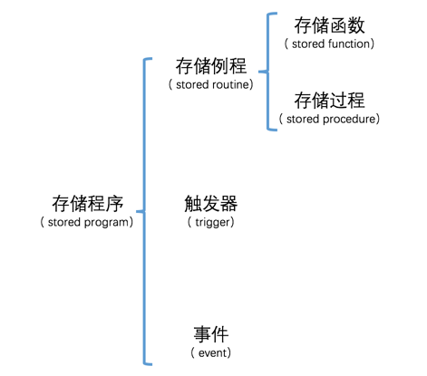
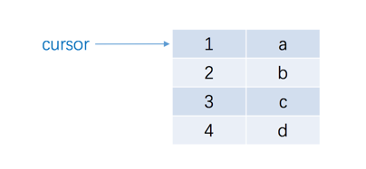

# 存储程序

## 简介

有时候为了完成一个常用的功能需要执行许多条语句，每次都在客户端里一条一条的去输入这么多语句是很烦的。设计`MySQL`的大叔非常贴心的给我们提供了一种称之为`存储程序`的东东，这个所谓的`存储程序`可以封装一些语句，然后给用户提供一种简单的方式来调用这个存储程序，从而间接地执行这些语句。根据调用方式的不同，我们可以把`存储程序`分为`存储例程`、`触发器`和`事件`这几种类型。其中`存储例程`需要我们去手动调用，而`触发器`和`事件`都是`MySQL`服务器在特定条件下自己调用的。`存储例程`又可以被细分为`存储函数`和`存储过程`。我们画个图表示一下：



## 自定义变量简介

生活中我们经常会遇到一些固定不变的值，比如数字`100`、字符串`'你好呀'`，我们把这些值固定不变的东东称之为`常量`。可是有时候为了方便，我们会使用某一个符号来代表一个值，它代表的值是可以变化的。比方说我们规定符号`a`代表数字`1`，之后我们又可以让符号`a`代表数字`2`，我们把这种值可以发生变化的东东称之为`变量`，其中符号`a`就称为这个变量的`变量名`。在`MySQL`中，我们可以通过`SET`语句来自定义一些我们自己的变量，比方说这样：

```
mysql> SET @a = 1;
Query OK, 0 rows affected (0.00 sec)

mysql>
```

上边的语句就表明我们定义了一个称之为`a`的变量，并且把整数`1`赋值给了这个变量。不过大家需要注意一下，设计MySQL的大叔规定，在我们的自定义变量前边必须加一个`@`符号（虽然有点儿怪，但这就是人家规定的，大家遵守就好了）。

如果我们之后想查看这个变量的值的话，使用`SELECT`语句就好了，不过仍然需要在变量名称前加一个`@`符号：

```
mysql> SELECT @a;
+------+
| @a   |
+------+
|    1 |
+------+
1 row in set (0.00 sec)

mysql>
```

同一个变量也可以存储存储不同类型的值，比方说我们再把一个字符串值赋值给变量`a`：

```
mysql> SET @a = '哈哈哈';
Query OK, 0 rows affected (0.01 sec)

mysql> SELECT @a;
+-----------+
| @a        |
+-----------+
| 哈哈哈    |
+-----------+
1 row in set (0.00 sec)

mysql>
```

除了把一个常量赋值给一个变量以外，我们还可以把一个变量赋值给另一个变量：

```
mysql> SET @b = @a;
Query OK, 0 rows affected (0.00 sec)

mysql> select @b;
+-----------+
| @b        |
+-----------+
| 哈哈哈    |
+-----------+
1 row in set (0.00 sec)

mysql>
```

这样变量`a`和`b`就有了相同的值`'哇哈哈'`！

我们还可以将某个查询的结果赋值给一个变量，前提是这个查询的结果只有一个值：

```
mysql> SET @a = (SELECT m1 FROM t1 LIMIT 1);
Query OK, 0 rows affected (0.00 sec)

mysql>
```

还可以用另一种形式的语句来将查询的结果赋值给一个变量：

```
mysql> SELECT n1 FROM t1 LIMIT 1 INTO @b;
Query OK, 1 row affected (0.00 sec)

mysql>
```

因为语句`SELECT m1 FROM t1 LIMIT 1`和`SELECT n1 FROM t1 LIMIT 1`的查询结果都只有一个值，所以它们可以直接赋值给变量`a`或者`b`。我们查看一下这两个变量的值：

```
mysql> SELECT @a, @b;
+------+------+
| @a   | @b   |
+------+------+
|    1 | a    |
+------+------+
1 row in set (0.00 sec)

mysql>
```

如果我们的查询结果是一条记录，该记录中有多个列的值的话，我们想把这几个值分别赋值到不同的变量中，只能使用`INTO`语句了：

```
mysql> SELECT m1, n1 FROM t1 LIMIT 1 INTO @a, @b;
Query OK, 1 row affected (0.00 sec)

mysql>
```

这条查询语句的结果集中只包含一条记录，我们把这条记录的`m1`列的值赋值到了变量`a`中，`n1`列的值赋值到了变量`b`中。


## 语句结束分隔符

在`MySQL`客户端的交互界面处，当我们完成键盘输入并按下回车键时，`MySQL`客户端会检测我们输入的内容中是否包含`;`、`\g`或者`\G`这三个符号之一，如果有的话，会把我们输入的内容发送到服务器。这样一来，如果我们想一次性给服务器发送多条的话，就需要把这些语句写到一行中，比如这样：

```
mysql> SELECT * FROM t1 LIMIT 1;SELECT * FROM t2 LIMIT 1;SELECT * FROM t3 LIMIT 1;
+------+------+
| m1   | n1   |
+------+------+
|    1 | a    |
+------+------+
1 row in set (0.00 sec)

+------+------+
| m2   | n2   |
+------+------+
|    2 | b    |
+------+------+
1 row in set (0.00 sec)

+------+------+
| m3   | n3   |
+------+------+
|    3 | c    |
+------+------+
1 row in set (0.00 sec)

mysql>
```

造成这一不便的原因在于，`MySQL`客户端检测输入结束用的符号和分隔各个语句的符号是一样的！其实我们也可以用`delimiter`命令来自定义`MySQL`的检测语句输入结束的符号，也就是所谓的`语句结束分隔符`，比如这样：

```
mysql> delimiter $
mysql> SELECT * FROM t1 LIMIT 1;
    -> SELECT * FROM t2 LIMIT 1;
    -> SELECT * FROM t3 LIMIT 1;
    -> $
+------+------+
| m1   | n1   |
+------+------+
|    1 | a    |
+------+------+
1 row in set (0.00 sec)

+------+------+
| m2   | n2   |
+------+------+
|    2 | b    |
+------+------+
1 row in set (0.00 sec)

+------+------+
| m3   | n3   |
+------+------+
|    3 | c    |
+------+------+
1 row in set (0.00 sec)

mysql>
```

`delimiter $`命令意味着修改语句结束分隔符为`$`，也就是说之后`MySQL`客户端检测用户语句输入结束的符号为`$`。上边例子中我们虽然连续输入了3个以分号`;`结尾的查询语句并且按了回车键，但是输入的内容并没有被提交，直到敲下`$`符号并回车，`MySQL`客户端才会将我们输入的内容提交到服务器，此时我们输入的内容里已经包含了3个独立的查询语句了，所以返回了3个结果集。

我们也可以将`语句结束分隔符`重新定义为`$`以外的其他包含单个或多个字符的字符串，比方说这样：

```
mysql> delimiter EOF
mysql> SELECT * FROM t1 LIMIT 1;
    -> SELECT * FROM t2 LIMIT 1;
    -> SELECT * FROM t3 LIMIT 1;
    -> EOF
+------+------+
| m1   | n1   |
+------+------+
|    1 | a    |
+------+------+
1 row in set (0.00 sec)

+------+------+
| m2   | n2   |
+------+------+
|    2 | b    |
+------+------+
1 row in set (0.00 sec)

+------+------+
| m3   | n3   |
+------+------+
|    3 | c    |
+------+------+
1 row in set (0.00 sec)

mysql>
```

我们这里采用了`EOF`作为`MySQL`客户端检测输入结束的符号，是不是很easy啊！当然，这个只是为了方便我们一次性输入多个语句，在输入完成之后最好还是改回我们常用的分号`;`吧：

```
mysql> delimiter ;
```

>   小贴士： 我们应该避免使用反斜杠（\）字符作为语句结束分隔符，因为这是MySQL的转义字符。


## 存储函数

### 创建存储函数

`存储函数`其实就是一种`函数`，只不过在这个函数里可以执行`MySQL`的语句而已。`函数`的概念大家都应该不陌生，它可以把处理某个问题的过程封装起来，之后我们直接调用函数就可以去解决这个问题了，简单方便又环保。`MySQL`中定义`存储函数`的语句如下：

```
CREATE FUNCTION 存储函数名称([参数列表])
RETURNS 返回值类型
BEGIN
    函数体内容
END
```

从这里我们可以看出，定义一个`存储函数`需要指定函数名称、参数列表、返回值类型以及函数体内容。如果该函数不需要参数，那参数列表可以被省略，函数体内容可以包括一条或多条语句，每条语句都要以分号`;`结尾。上边语句中的制表符和换行仅仅是为了好看，如果你觉得烦，完全可以把存储函数的定义都写在一行里，用一个或多个空格把上述几个部分分隔开就好！ 光看定义理解的不深刻，我们先写一个`存储函数`开开眼：

```
mysql> delimiter $
mysql> CREATE FUNCTION avg_score(s VARCHAR(100))
    -> RETURNS DOUBLE
    -> BEGIN
    ->     RETURN (SELECT AVG(score) FROM student_score WHERE subject = s);
    -> END $
Query OK, 0 rows affected (0.00 sec)

mysql> delimiter ;
```

我们定义了一个名叫`avg_score`的函数，它接收一个`VARCHAR(100)`类型的参数，声明的返回值类型是`DOUBLE`，需要注意的是，我们在`RETURN`语句后边写了一个`SELECT`语句，表明这个函数的返回结果就是根据这个查询语句产生的，也就是返回了指定科目的平均成绩。


### 存储函数的调用

我们自定义的函数和系统内置函数的使用方式是一样的，都是在函数名后加小括号`()`表示函数调用，调用有参数的函数时可以把参数写到小括号里边。函数调用可以放到查询列表或者作为搜索条件，或者和别的操作数一起组成更复杂的表达式，我们现在来调用一下刚刚写好的这个名为`avg_score`的函数吧：

```
mysql> SELECT avg_score('母猪的产后护理');
+------------------------------------+
| avg_score('母猪的产后护理')        |
+------------------------------------+
|                                 73 |
+------------------------------------+
1 row in set (0.00 sec)

mysql> SELECT avg_score('论萨达姆的战争准备');
+------------------------------------------+
| avg_score('论萨达姆的战争准备')          |
+------------------------------------------+
|                                    73.25 |
+------------------------------------------+
1 row in set (0.00 sec)

mysql>
```

通过调用函数的方式而不是直接写查询语句的方式来获取某门科目的平均成绩看起来就简介多了。

### 查看和删除存储函数

如果我们想查看我们已经定义了多少个存储函数，可以使用下边这个语句：

```
SHOW FUNCTION STATUS [LIKE 需要匹配的函数名]
```

由于这个命令得到的结果太多，我们就不演示了哈，大家可以自己试试。如果我们想查看某个函数的具体是怎么定义的，可以使用这个语句：

```
SHOW CREATE FUNCTION 函数名
```

比如这样：

```
mysql> SHOW CREATE FUNCTION avg_score\G
*************************** 1. row ***************************
            Function: avg_score
            sql_mode: ONLY_FULL_GROUP_BY,STRICT_TRANS_TABLES,NO_ZERO_IN_DATE,NO_ZERO_DATE,ERROR_FOR_DIVISION_BY_ZERO,NO_AUTO_CREATE_USER,NO_ENGINE_SUBSTITUTION
     Create Function: CREATE DEFINER=`root`@`localhost` FUNCTION `avg_score`(s VARCHAR(100)) RETURNS double
BEGIN
        RETURN (SELECT AVG(score) FROM student_score WHERE subject = s);
    END
character_set_client: utf8
collation_connection: utf8_general_ci
  Database Collation: utf8_general_ci
1 row in set (0.01 sec)

mysql>
```

虽然展示出很多内容，但是我们只要聚焦于名叫`Create Function`的那部分信息，该部分信息展示了这个存储函数的定义语句是什么样的（可以看到`MySQL`服务器为我们自动添加了`DEFINER=`root`@`localhost``，大家可以把这个内容先忽略掉）。

如果想删除某个存储函数，使用这个语句：

```
DROP FUNCTION 函数名
```

比如我们来删掉`avg_score`这个函数：

```
mysql> DROP FUNCTION avg_score;
Query OK, 0 rows affected (0.00 sec)

mysql>
```

什么？你以为到这里`存储函数`就唠叨完了么？那怎么可能～ 到现在为止我们只是勾勒出一个`存储函数`的大致轮廓，下边我们来详细说一下`MySQL`定义函数体时支持的一些语句。

### 函数体的定义

上边定义的`avg_score`的函数体里边只包含一条语句，如果只为了节省书写一条语句的时间而定义一个存储函数，其实也不是很值～ 其实存储函数的函数体中可以包含多条语句，并且支持一些特殊的语法来供我们使用，下边一起看看呗～

#### 在函数体中定义局部变量

我们在前边说过使用`SET`语句来自定义变量的方式，可以不用声明就为变量赋值。而在存储函数的函数体中使用变量前必须先声明这个变量，声明方式如下：

```
DECLARE 变量名1, 变量名2, ... 数据类型 [DEFAULT 默认值];
```

这些在函数体内声明的变量只在该函数体内有用，当存储函数执行完成后，就不能访问到这些变量了，所以这些变量也被称为`局部`变量。我们可以在一条语句中声明多个相同数据类型的变量。不过需要特别留心的是，函数体中的局部变量名不允许加`@`前缀，这一点和我们之前直接使用`SET`语句自定义变量的方式是截然不同的，特别注意一下。在声明了这个局部变量之后，才可以使用它，就像这样：

```
mysql> delimiter $;
mysql> CREATE FUNCTION var_demo()
-> RETURNS INT
-> BEGIN
->     DECLARE c INT;
->     SET c = 5;
->     RETURN c;
-> END $
Query OK, 0 rows affected (0.00 sec)

mysql> delimiter ;
```

我们定义了一个名叫`var_demo`而且不需要参数的函数，然后在函数体中声明了一个名称为`c`的`INT`类型的局部变量，之后我们调用`SET`语句为这个局部变量赋值了整数`5`，并且把局部变量`c`当作函数结果返回。我们调用一下这个函数：

```
mysql> select var_demo();
+------------+
| var_demo() |
+------------+
|          5 |
+------------+
1 row in set (0.00 sec)

mysql>
```

如果我们不对声明的局部变量赋值的话，它的默认值就是`NULL`，当然我们也可以通过`DEFAULT`子句来显式的指定局部变量的默认值，比如这样：

```
mysql> delimiter $
mysql> CREATE FUNCTION var_default_demo()
-> RETURNS INT
-> BEGIN
->     DECLARE c INT DEFAULT 1;
->     RETURN c;
-> END $
Query OK, 0 rows affected (0.00 sec)

mysql> delimiter ;
mysql>
```

在新创建的这个`var_default_demo`函数中，我们声明了一个局部变量`c`，并且指定了它的默认值为`1`，然后看一下该函数的调用结果：

```
mysql> SELECT var_default_demo();
+--------------------+
| var_default_demo() |
+--------------------+
|                  1 |
+--------------------+
1 row in set (0.00 sec)

mysql>
```

得到的结果是`1`，说明了我们指定的局部变量默认值生效了！另外，特别需要注意一下我们可以将某个查询语句的结果赋值给局部变量的情况，比如我们改写一下前边的`avg_score`函数：

```
CREATE FUNCTION avg_score(s VARCHAR(100))
RETURNS DOUBLE
BEGIN
    DECLARE a DOUBLE;
    SET a = (SELECT AVG(score) FROM student_score WHERE subject = s);
    return a;
END
```

我们先把一个查询语句的结果赋值给了局部变量`a`，然后再返回了这个变量。

>   小贴士： 在存储函数的函数体中，DECLARE语句必须放到其他语句的前边。

#### 在函数体中使用自定义变量

除了局部变量外，也可以在函数体中使用我们之前用过的自定义变量，比方说这样：

```
mysql> delimiter $
mysql>
mysql> CREATE FUNCTION user_defined_var_demo()
    -> RETURNS INT
    -> BEGIN
    ->     SET @abc = 10;
    ->     return @abc;
    -> END $
Query OK, 0 rows affected (0.00 sec)

mysql>
mysql> delimiter ;
mysql>
```

我们定义了一个名叫`user_defined_var_demo`的存储函数，函数体内直接使用了自定义变量`abc`，我们来调用一下这个函数：

```
mysql> SELECT user_defined_var_demo();
+-------------------------+
| user_defined_var_demo() |
+-------------------------+
|                      10 |
+-------------------------+
1 row in set (0.01 sec)

mysql>
```

虽然现在存储函数执行完了，但是由于在该函数执行过程中为自定义变量`abc`赋值了，那么在该函数执行完之后我们仍然可以访问到该自定义变量的值，就像这样：

```
mysql> SELECT @abc;
+------+
| @abc |
+------+
|   10 |
+------+
1 row in set (0.00 sec)

mysql>
```

这一点和在函数体中使用`DECLARE`声明的局部变量有明显区别，大家注意一下。

#### 存储函数的参数

在定义存储函数的时候，可以指定多个参数，每个参数都要指定对应的数据类型，就像这样：

```
参数名 数据类型
```

比如我们上边编写的这个`avg_score`函数：

```
CREATE FUNCTION avg_score(s VARCHAR(100))
RETURNS DOUBLE
BEGIN
    RETURN (SELECT AVG(score) FROM student_score WHERE subject = s);
END
```

这个函数只需要一个类型为`VARCHAR(100)`参数，我们这里给这个参数起的名称是`s`，不过这个参数名不要和函数体语句中的其他变量名、列名啥的冲突，比如上边的例子中如果把变量名`s`改为为`subject`，它就与下边用到`WHERE`子句中的列名冲突了。

另外，函数参数不可以指定默认值，我们在调用函数的时候，必须显式的指定所有的参数，并且参数类型也一定要匹配，比方说我们在调用函数`avg_score`时，必须指定我们要查询的课程名，不然会报错的：

```
mysql> select avg_score();
ERROR 1318 (42000): Incorrect number of arguments for FUNCTION xiaohaizi.avg_score; expected 1, got 0
mysql>
```

#### 判断语句的编写

像其他的编程语言一样，在存储函数的函数体里也可以使用判断的语句，语法格式如下：

```
IF 表达式 THEN
    处理语句列表
[ELSEIF 表达式 THEN
    处理语句列表]
... # 这里可以有多个ELSEIF语句
[ELSE
    处理语句列表]
END IF;
```

其中`处理语句列表`中可以包含多条语句，每条语句以分号`;`结尾就好。

我们举一个包含`IF`语句的存储函数的例子：

```
mysql> delimiter $
mysql> CREATE FUNCTION condition_demo(i INT)
-> RETURNS VARCHAR(10)
-> BEGIN
->     DECLARE result VARCHAR(10);
->     IF i = 1 THEN
->         SET result = '结果是1';
->     ELSEIF i = 2 THEN
->         SET result = '结果是2';
->     ELSEIF i = 3 THEN
->         SET result = '结果是3';
->     ELSE
->         SET result = '非法参数';
->     END IF;
->     RETURN result;
-> END $
Query OK, 0 rows affected (0.00 sec)

mysql> delimiter ;
mysql>
```

在我们定义的函数`condition_demo`中，它接收一个`INT`类型的参数，这个函数的处理逻辑如下：

1.  如果这个参数的值是`1`，就把`result`变量的值设置为`'结果是1'`。
2.  否则如果这个这个参数的值是`2`，就把`result`变量的值设置为`'结果是2'`。
3.  否则如果这个这个参数的值是`3`，就把`result`变量的值设置为`'结果是3'`。
4.  否则就把`result`变量的值设置为`'非法参数'`。

当然了，我们举的这个例子还是比较白痴的啦，只是为了说明语法怎么用而已。我们现在调用一下这个函数：

```
mysql> SELECT condition_demo(2);
+-------------------+
| condition_demo(2) |
+-------------------+
| 结果是2           |
+-------------------+
1 row in set (0.00 sec)

mysql> SELECT condition_demo(5);
+-------------------+
| condition_demo(5) |
+-------------------+
| 非法参数          |
+-------------------+
1 row in set (0.00 sec)

mysql>
```

#### 循环语句的编写

除了判断语句，`MySQL`还支持循环语句的编写，不过提供了3种形式的循环语句，我们一一道来：

-   `WHILE`循环语句：

    ```
    WHILE 表达式 DO
        处理语句列表
    END WHILE;
    ```

    这个语句的意思是：如果满足给定的表达式，则执行处理语句，否则退出循环。比如我们想定义一个计算从`1`到`n`这`n`个数的和（假设`n`大于`0`）的存储函数，可以这么写：

    ```
    mysql> delimiter $
    mysql> CREATE FUNCTION sum_all(n INT UNSIGNED)
    -> RETURNS INT
    -> BEGIN
    ->     DECLARE result INT DEFAULT 0;
    ->     DECLARE i INT DEFAULT 1;
    ->     WHILE i <= n DO
    ->         SET result = result + i;
    ->         SET i = i + 1;
    ->     END WHILE;
    ->     RETURN result;
    -> END $
    Query OK, 0 rows affected (0.00 sec)
    
    mysql> delimiter ;
    mysql>
    ```

    在函数`sum_all`中，我们接收一个`INT UNSIGNED`类型的参数，声明了两个`INT`类型的变量`i`和`result`。我们先测试一下这个函数：

    ```
    mysql> SELECT sum_all(3);
    +------------+
    | sum_all(3) |
    +------------+
    |          6 |
    +------------+
    1 row in set (0.00 sec)
    
    mysql>
    ```

    分析一下这个结果是怎么产生的，初始的情况下`result`的值默认是`0`，`i`的值默认是`1`，给定的参数`n`的值是`3`。这个存储函数的运行过程就是：

    1.  先判断`i <= n`是否成立，也就是`1 <= 3`是否成立，显然成立，然后执行处理语句，将`result`的值设置为`1`（`result + i` = `0 + 1`），`i`的值设置为`2`（`i + 1` = `1 + 1`）。
    2.  再判断`i <= n`是否成立，也就是`2 <= 3`是否成立，显然成立，然后执行处理语句，将`result`的值设置为`3`（`result + i` = `1 + 2`），`i`的值设置为`3`（`i + 1` = `2 + 1`）。
    3.  再判断`i <= n`是否成立，也就是`3 <= 3`是否成立，显然成立，然后执行处理语句，将`result`的值设置为`6`（`result + i` = `3 + 3`），`i`的值设置为`4`（`i + 1` = `3 + 1`）。
    4.  再判断`i <= n`是否成立，也就是`4 <= 3`是否成立，显然不成立，退出循环。

    所以最后返回的`result`的值就是`6`，也就是`1`、`2`、`3`这三个数的和。

-   `REPEAT`循环语句

    `REPEAT`循环语句和`WHILE`循环语句类似，只是形式上变了一下：

    ```
    REPEAT
        处理语句列表
    UNTIL 表达式 END REPEAT;
    ```

    先执行处理语句，再判断`表达式`是否成立，如果成立则退出循环，否则继续执行处理语句。与`WHILE`循环语句不同的一点是：WHILE循环语句先判断表达式的值，再执行处理语句，REPEAT循环语句先执行处理语句，再判断表达式的值，所以至少执行一次处理语句，所以如果`sum_all`函数用`REPEAT`循环改写，可以写成这样：

    ```
    CREATE FUNCTION sum_all(n INT UNSIGNED)
    RETURNS INT
    BEGIN
        DECLARE result INT DEFAULT 0;
        DECLARE i INT DEFAULT 1;
        REPEAT
            SET result = result + i;
            SET i = i + 1;
        UNTIL i > n END REPEAT;
        RETURN result;
    END
    ```

-   `LOOP`循环语句

    这只是另一种形式的循环语句：

    ```
    LOOP
        处理语句列表
    END LOOP;
    ```

    不过这种循环语句有一点比较奇特，它没有判断循环终止的条件？那这个循环语句怎么停止下来呢？其实可以把循环终止的条件写到处理语句列表中然后使用`RETURN`语句直接让函数结束就可以达到停止循环的效果，比方说我们可以这样改写`sum_all`函数：

    ```
    CREATE FUNCTION sum_all(n INT UNSIGNED)
    RETURNS INT
    BEGIN
        DECLARE result INT DEFAULT 0;
        DECLARE i INT DEFAULT 1;
        LOOP
            IF i > n THEN
                RETURN result;
            END IF;
            SET result = result + i;
            SET i = i + 1;
        END LOOP;
    END
    ```

    如果我们仅仅想结束循环，而不是使用`RETURN`语句直接将函数返回，那么可以使用`LEAVE`语句。不过使用`LEAVE`时，需要先在`LOOP`语句前边放置一个所谓的`标记`，比方说我们使用`LEAVE`语句再改写`sum_all`函数：

    ```
    CREATE FUNCTION sum_all(n INT UNSIGNED)
    RETURNS INT
    BEGIN
        DECLARE result INT DEFAULT 0;
        DECLARE i INT DEFAULT 1;
        flag:LOOP
            IF i > n THEN
                LEAVE flag;
            END IF;
            SET result = result + i;
            SET i = i + 1;
        END LOOP flag;
        RETURN result;
    END
    ```

    可以看到，我们在`LOOP`语句前加了一个`flag:`这样的东东，相当于为这个循环打了一个名叫`flag`的标记，然后在对应的`END LOOP`语句后边也把这个标记名`flag`给写上了。在存储函数的函数体中使用`LEAVE flag`语句来结束`flag`这个标记所代表的循环。

    >   小贴士： 其实也可以在BEGIN ... END、REPEAT和WHILE这些语句上打标记，标记主要是为了在这些语句发生嵌套时可以跳到指定的语句中使用的。


## 存储过程

### 创建存储过程

`存储函数`和`存储过程`都属于`存储例程`，都是对某些语句的一个封装。`存储函数`侧重于执行这些语句并返回一个值，而`存储过程`更侧重于单纯的去执行这些语句。先看一下`存储过程`的定义语句：

```
CREATE PROCEDURE 存储过程名称([参数列表])
BEGIN
    需要执行的语句
END
```

与`存储函数`最直观的不同点就是，`存储过程`的定义不需要声明`返回值类型`。我们先定义一个`存储过程`看看：

```
mysql> delimiter $
mysql> CREATE PROCEDURE t1_operation(
    ->     m1_value INT,
    ->     n1_value CHAR(1)
    -> )
    -> BEGIN
    ->     SELECT * FROM t1;
    ->     INSERT INTO t1(m1, n1) VALUES(m1_value, n1_value);
    ->     SELECT * FROM t1;
    -> END $
Query OK, 0 rows affected (0.00 sec)

mysql> delimiter ;
mysql>
```

我们建立了一个名叫`t1_operation`的存储过程，它接收两个参数，一个是`INT`类型的，一个是`CHAR(1)`类型的。这个存储过程做了3件事儿，一件是查询一下`t1`表中的数据，第二件是根据接收的参数来向`t1`表中插入一条语句，第三件是再次查询一下`t1`表中的数据。

### 存储过程的调用

`存储函数`执行语句并返回一个值，所以常用在表达式中。`存储过程`偏向于执行某些语句，并不能用在表达式中，我们需要显式的使用`CALL`语句来调用一个`存储过程`：

```
CALL 存储过程([参数列表]);
```

比方说我们调用一下`t1_operation`存储过程可以这么写：

```
mysql> CALL t1_operation(4, 'd');
+------+------+
| m1   | n1   |
+------+------+
|    1 | a    |
|    2 | b    |
|    3 | c    |
+------+------+
3 rows in set (0.00 sec)

+------+------+
| m1   | n1   |
+------+------+
|    1 | a    |
|    2 | b    |
|    3 | c    |
|    4 | d    |
+------+------+
4 rows in set (0.00 sec)

Query OK, 0 rows affected (0.00 sec)

mysql>
```

从执行结果中可以看到，存储过程在执行中产生的所有结果集，全部将会被显示到客户端。

>   小贴士： 只有查询语句才会产生结果集，其他语句是不产生结果集的。

### 查看和删除存储过程

与`存储函数`类似，`存储过程`也有相似的查看和删除语句，我们下边只列举一下相关语句，就不举例子了。

查看当前数据库中创建的`存储过程`都有哪些的语句：

```
SHOW PROCEDURE STATUS [LIKE 需要匹配的存储过程名称]
```

查看某个`存储过程`具体是怎么定义的语句：

```
SHOW CREATE PROCEDURE 存储过程名称
```

删除`存储过程`的语句：

```
DROP PROCEDURE 存储过程名称
```

### 存储过程中的语句

上边在唠叨`存储函数`中使用到的各种语句，包括变量的使用、判断、循环结构都可以被用在`存储过程`中，这里就不再赘述了。

### 存储过程的参数前缀

比`存储函数`强大的一点是，`存储过程`在定义参数的时候可以选择添加一些前缀，就像是这个样子：

```
参数类型 [IN | OUT | INOUT] 参数名 数据类型
```

可以看到可选的前缀有下边3种：

| 前缀    | 实际参数是否必须是变量 | 描述                                                         |
| ------- | ---------------------- | ------------------------------------------------------------ |
| `IN`    | 否                     | 用于调用者向存储过程传递数据，如果IN参数在过程中被修改，调用者不可见。 |
| `OUT`   | 是                     | 用于把存储过程运行过程中产生的数据赋值给OUT参数，存储过程执行结束后，调用者可以访问到OUT参数。 |
| `INOUT` | 是                     | 综合`IN`和`OUT`的特点，既可以用于调用者向存储过程传递数据，也可以用于存放存储过程中产生的数据以供调用者使用。 |


这么直接描述有些生硬哈，我们来举例子分别仔细分析一下：

-   `IN`参数

    先定义一个参数前缀是`IN`的存储过程`p_in`：

    ```
    mysql> delimiter $
    mysql> CREATE PROCEDURE p_in (
    ->     IN arg INT
    -> )
    -> BEGIN
    ->     SELECT arg;
    ->     SET arg = 123;
    -> END $
    Query OK, 0 rows affected (0.00 sec)
    
    mysql> delimiter ;
    mysql>
    ```

    这个`p_in`存储过程只有一个参数`arg`，它的前缀是`IN`。这个存储过程实际执行两个语句，第一个语句是用来读取参数`arg`的值，第二个语句是给参数`arg`赋值。我们调用一下`p_in`：

    ```
    mysql> SET @a = 1;
    Query OK, 0 rows affected (0.00 sec)
    
    mysql> CALL p_in(@a);
    +------+
    | arg  |
    +------+
    |    1 |
    +------+
    1 row in set (0.00 sec)
    
    Query OK, 0 rows affected (0.00 sec)
    
    mysql> SELECT @a;
    +------+
    | @a   |
    +------+
    |    1 |
    +------+
    1 row in set (0.00 sec)
    
    mysql>
    ```

    我们定义了一个变量`a`并把整数`1`赋值赋值给它，因为它是在客户端定义的，所以需要加`@`前缀，然后把它当作参数传给`p_in`存储过程。从结果中可以看出，第一个读取语句被成功执行，虽然第二个语句没有报错，但是在存储过程执行完毕后，再次查看变量`a`的值却并没有改变，这也就是说：IN参数只能被用于读取，对它赋值是不会被调用者看到的。

    另外，因为我们只是想在存储过程执行中使用IN参数，并不需要把执行过程中产生的数据存储到它里边，所以其实在调用存储过程时，将常量作为参数也是可以的，比如这样：

    ```
    mysql> CALL p_in(1);
    +------+
    | arg  |
    +------+
    |    1 |
    +------+
    1 row in set (0.00 sec)
    
    Query OK, 0 rows affected (0.00 sec)
    
    mysql>
    ```

-   `OUT`参数

    先定义一个前缀是`OUT`的存储过程`p_out`：

    ```
    mysql> delimiter $
    mysql> CREATE PROCEDURE p_out (
    ->     OUT arg INT
    -> )
    -> BEGIN
    ->     SELECT arg;
    ->     SET arg = 123;
    -> END $
    Query OK, 0 rows affected (0.00 sec)
    
    mysql> delimiter ;
    mysql>
    ```

    这个`p_out`存储过程只有一个参数`arg`，它的前缀是`OUT`，`p_out`存储过程也有两个语句，一个用于读取参数`arg`的值，另一个用于为参数`arg`赋值，我们调用一下`p_out`：

    ```
    mysql> SET @b = 2;
    Query OK, 0 rows affected (0.00 sec)
    
    mysql> CALL p_out(@b);
    +------+
    | arg  |
    +------+
    | NULL |
    +------+
    1 row in set (0.00 sec)
    
    Query OK, 0 rows affected (0.00 sec)
    
    mysql> SELECT @b;
    +------+
    | @b   |
    +------+
    |  123 |
    +------+
    1 row in set (0.00 sec)
    
    mysql>
    ```

    我们定义了一个变量`b`并把整数`2`赋值赋值给它，然后把它当作参数传给`p_out`存储过程。从结果中可以看出，第一个读取语句并没有获取到参数的值，也就是说OUT参数的值默认为`NULL`。在存储过程执行完毕之后，再次读取变量`b`的值，发现它的值已经被设置成`123`，说明在过程中对该变量的赋值对调用者是可见的！这也就是说：OUT参数只能用于赋值，对它赋值是可以被调用者看到的。

    另外，由于`OUT`参数只是为了用于将存储过程执行过程中产生的数据赋值给它后交给调用者查看，那么在调用存储过程时，实际的参数就不允许是常量！

-   `INOUT`参数

    知道了`IN`参数和`OUT`参数的意思，`INOUT`参数也就明白了，这种参数既可以在存储过程中被读取，也可以被赋值后被调用者看到，所以要求在调用存储过程时实际的参数必须是一个变量，不然还怎么赋值啊！`INOUT`参数类型就不具体举例子了，大家可以自己试试哈～

需要注意的是，如果我们不写明参数前缀的话，默认的前缀是IN！

由于存储过程可以传入多个`OUT`或者`INOUT`类型的参数，所以我们可以在一个存储过程中获得多个结果，比如这样：

```
mysql> delimiter $
mysql> CREATE PROCEDURE get_score_data(
    ->     OUT max_score DOUBLE,
    ->     OUT min_score DOUBLE,
    ->     OUT avg_score DOUBLE,
    ->     s VARCHAR(100)
    -> )
    -> BEGIN
    ->     SELECT MAX(score), MIN(score), AVG(score) FROM student_score WHERE subject = s INTO max_score, min_score, avg_score;
    -> END $
Query OK, 0 rows affected (0.02 sec)

mysql> delimiter ;
mysql>
```

我们定义的这个`get_score_data`存储过程接受4个参数，前三个参数都是`OUT`参数，第四个参数没写前缀，默认就是`IN`参数。存储过程的内容是将指定学科的最高分、最低分、平均分分别赋值给三个`OUT`参数。在这个存储过程执行完之后，我们可以通过访问这几个`OUT`参数来获得相应的最高分、最低分以及平均分：

```
mysql> CALL get_score_data(@a, @b, @c, '母猪的产后护理');
Query OK, 1 row affected (0.01 sec)

mysql> SELECT @a, @b, @c;
+------+------+------+
| @a   | @b   | @c   |
+------+------+------+
|  100 |   55 |   73 |
+------+------+------+
1 row in set (0.00 sec)

mysql>
```

### 存储过程和存储函数的不同点

`存储过程`和`存储函数`非常类似，我们列举几个它们的不同点以加深大家的对这两者区别的印象：

-   存储函数在定义时需要显式用`RETURNS`语句标明返回的数据类型，而且在函数体中必须使用`RETURN`语句来显式指定返回的值，存储过程不需要。
-   存储函数只支持`IN`参数，而存储过程支持`IN`参数、`OUT`参数、和`INOUT`参数。
-   存储函数只能返回一个值，而存储过程可以通过设置多个`OUT`参数或者`INOUT`参数来返回多个结果。
-   存储函数执行过程中产生的结果集并不会被显示到客户端，而存储过程执行过程中产生的结果集会被显示到客户端。
-   存储函数直接在表达式中调用，而存储过程只能通过`CALL`语句来显式调用。


## 触发器

我们使用`MySQL`的过程中可能会有下边这些需求：

-   在向`t1`表插入或更新数据之前对自动对数据进行校验，要求`m1`列的值必须在`1~10`之间，校验规则如下：
    -   如果插入的记录的`m1`列的值小于`1`，则按`1`插入。
    -   如果`m1`列的值大于`10`，则按`10`插入。
-   在向`t1`表中插入记录之后自动把这条记录插入到`t2`表。

也就是我们在对表中的记录做增、删、改操作前和后都可能需要让`MySQL`服务器自动执行一些额外的语句，这个就是所谓的`触发器`的应用场景。

### 创建触发器

我们看一下定义`触发器`的语句：

```
CREATE TRIGGER 触发器名
{BEFORE|AFTER}
{INSERT|DELETE|UPDATE}
ON 表名
FOR EACH ROW
BEGIN
    触发器内容
END
小贴士：

由大括号`{}`包裹并且内部用竖线`|`分隔的语句表示必须在给定的选项中选取一个值，比如`{BEFORE|AFTER}`表示必须在`BEFORE`、`AFTER`这两个之间选取一个。
```

其中`{BEFORE|AFTER}`表示触发器内容执行的时机，它们的含义如下：

| 名称     | 描述                                           |
| -------- | ---------------------------------------------- |
| `BEFORE` | 表示在具体的语句执行之前就开始执行触发器的内容 |
| `AFTER`  | 表示在具体的语句执行之后才开始执行触发器的内容 |


`{INSERT|DELETE|UPDATE}`表示具体的语句，`MySQL`中目前只支持对`INSERT`、`DELETE`、`UPDATE`这三种类型的语句设置触发器。

`FOR EACH ROW BEGIN ... END`表示对具体语句影响的每一条记录都执行我们自定义的触发器内容：

-   对于`INSERT`语句来说，`FOR EACH ROW`影响的记录就是我们准备插入的那些新记录。
-   对于`DELETE`语句和`UPDATE`语句来说，`FOR EACH ROW`影响的记录就是符合`WHERE`条件的那些记录（如果语句中没有`WHERE`条件，那就是代表全部的记录）。

>   小贴士： 如果触发器内容只包含一条语句，那也可以省略BEGN、END这两个词儿。

因为`MySQL`服务器会对某条语句影响的所有记录依次调用我们自定义的触发器内容，所以针对每一条受影响的记录，我们需要一种访问该记录中的内容的方式，`MySQL`提供了`NEW`和`OLD`两个单词来分别代表新记录和旧记录，它们在不同语句中的含义不同：

-   对于`INSERT`语句设置的触发器来说，`NEW`代表准备插入的记录，`OLD`无效。
-   对于`DELETE`语句设置的触发器来说，`OLD`代表删除前的记录，`NEW`无效。
-   对于`UPDATE`语句设置的触发器来说，`NEW`代表修改后的记录，`OLD`代表修改前的记录。

现在我们可以正式定义一个触发器了：

```
mysql> delimiter $
mysql> CREATE TRIGGER bi_t1
    -> BEFORE INSERT ON t1
    -> FOR EACH ROW
    -> BEGIN
    ->     IF NEW.m1 < 1 THEN
    ->         SET NEW.m1 = 1;
    ->     ELSEIF NEW.m1 > 10 THEN
    ->         SET NEW.m1 = 10;
    ->     END IF;
    -> END $
Query OK, 0 rows affected (0.02 sec)

mysql> delimiter ;
mysql>
```

我们对`t1`表定义了一个名叫`bi_t1`的`触发器`，它的意思就是在对`t1`表插入新记录之前，对准备插入的每一条记录都会执行`BEGIN ... END`之间的语句，`NEW.列名`表示当前待插入记录指定列的值。现在`t1`表中一共有4条记录：

```
mysql> SELECT * FROM t1;
+------+------+
| m1   | n1   |
+------+------+
|    1 | a    |
|    2 | b    |
|    3 | c    |
|    4 | d    |
+------+------+
4 rows in set (0.00 sec)

mysql>
```

我们现在执行一下插入语句并再次查看一下`t1`表的内容：

```
mysql> INSERT INTO t1(m1, n1) VALUES(5, 'e'), (100, 'z');
Query OK, 2 rows affected (0.00 sec)
Records: 2  Duplicates: 0  Warnings: 0

mysql> SELECT * FROM t1;
+------+------+
| m1   | n1   |
+------+------+
|    1 | a    |
|    2 | b    |
|    3 | c    |
|    4 | d    |
|    5 | e    |
|   10 | z    |
+------+------+
6 rows in set (0.00 sec)

mysql>
```

这个`INSERT`语句影响的记录有两条，分别是`(5, 'e')`和`(100, 'z')`，这两条记录将分别执行我们自定义的触发器内容。很显然`(5, 'e')`被成功的插入到了`t1`表中，而`(100, 'z')`插入到表中后却变成了`(10, 'z')`，这个就说明我们的`bi_t1`触发器生效了！

>   小贴士： 我们上边定义的触发器名`bi_t1`的`bi`是`before insert`的首字母缩写，`t1`是表名。虽然对于触发器的命名并没有什么特殊的要求，但是习惯上还是建议大家把它定义我上边例子中的形式，也就是`bi_表名`、`bd_表名`、`bu_表名`、`ai_表名`、`ad_表名`、`au_表名`的形式。

上边只是举了一个对`INSERT`语句设置`BEFORE`触发器的例子，对`DELETE`和`UPDATE`操作设置`BEFORE`或者`AFTER`触发器的过程是类似的，就不赘述了。

### 查看和删除触发器

查看当前数据库中定义的所有触发器的语句：

```
SHOW TRIGGERS;
```

查看某个具体的触发器的定义：

```
SHOW CREATE TRIGGER 触发器名;
```

删除触发器：

```
DROP TRIGGER 触发器名;
```

这几个命令太简单了，就不举例子了啊～

### 触发器使用注意事项

-   触发器内容中不能有输出结果集的语句。

    比方说：

    ```
    mysql> delimiter $
    mysql> CREATE TRIGGER ai_t1
        -> AFTER INSERT ON t1
        -> FOR EACH ROW
        -> BEGIN
        ->     SELECT NEW.m1, NEW.n1;
        -> END $
    ERROR 1415 (0A000): Not allowed to return a result set from a trigger
    mysql>
    ```

    显示的`ERROR`的意思就是不允许在触发器内容中返回结果集！

-   触发器内容中NEW代表记录的列的值可以被更改，OLD代表记录的列的值无法更改。

    `NEW`代表新插入或着即将修改后的记录，修改它的列的值将影响INSERT和UPDATE语句执行后的结果，而`OLD`代表修改或删除之前的值，我们无法修改它。比方说如果我们非要这么写那就会报错的：

    ```
    mysql> delimiter $
    mysql> CREATE TRIGGER bu_t1
        -> BEFORE UPDATE ON t1
        -> FOR EACH ROW
        -> BEGIN
        ->     SET OLD.m1 = 1;
        -> END $
    ERROR 1362 (HY000): Updating of OLD row is not allowed in trigger
    mysql>
    ```

    可以看到提示的错误中显示在触发器中`OLD`代表的记录是不可被更改的。

-   在BEFORE触发器中，我们可以使用`SET NEW.列名 = 某个值`的形式来更改待插入记录或者待更新记录的某个列的值，但是这种操作不能在AFTER触发器中使用，因为在执行AFTER触发器的内容时记录已经被插入完成或者更新完成了。

    比方说如果我们非要这么写那就会报错的：

    ```
    mysql> delimiter $
    mysql>     CREATE TRIGGER ai_t1
        ->     AFTER INSERT ON t1
        ->     FOR EACH ROW
        ->     BEGIN
        ->         SET NEW.m1 = 1;
        ->     END $
    ERROR 1362 (HY000): Updating of NEW row is not allowed in after trigger
    mysql>
    ```

    可以看到提示的错误中显示在AFTER触发器中是不允许更改`NEW`代表的记录的。

-   如果我们的`BEFORE`触发器内容执行过程中遇到了错误，那这个触发器对应的具体语句将无法执行；如果具体的操作语句执行过程中遇到了错误，那与它对应的`AFTER`触发器的内容将无法执行。

    >   小贴士： 对于支持事务的表，不论是执行触发器内容还是具体操作语句过程中出现了错误，会把这个过程中所有的语句都回滚。当然，作为小白的我们并不知道啥是个事务，啥是个回滚，这些进阶内容都在《MySQL是怎样运行的：从根儿上理解MySQL》中呢～


## 事件

有时候我们想让`MySQL`服务器在某个时间点或者每隔一段时间自动地执行一些语句，这时候就需要去创建一个`事件`。

### 创建事件

创建事件的语法如下：

```
CREATE EVENT 事件名
ON SCHEDULE
{
    AT 某个确定的时间点| 
    EVERY 期望的时间间隔 [STARTS datetime][END datetime]
}
DO
BEGIN
    具体的语句
END
```

`事件`支持两种类型的自动执行方式：

1.  在某个确定的时间点执行。

    比方说：

    ```
    CREATE EVENT insert_t1_event
    ON SCHEDULE
    AT '2019-09-04 15:48:54'
    DO
    BEGIN
        INSERT INTO t1(m1, n1) VALUES(6, 'f');
    END
    ```

    我们在这个`事件`中指定了执行时间是`'2019-09-04 15:48:54'`，除了直接填某个时间常量，我们也可以填写一些表达式：

    ```
    CREATE EVENT insert_t1
    ON SCHEDULE
    AT DATE_ADD(NOW(), INTERVAL 2 DAY)
    DO
    BEGIN
        INSERT INTO t1(m1, n1) VALUES(6, 'f');
    END
    ```

    其中的`DATE_ADD(NOW(), INTERVAL 2 DAY)`表示该事件将在当前时间的两天后执行。

2.  每隔一段时间执行一次。

    比方说：

    ```
    CREATE EVENT insert_t1
    ON SCHEDULE
    EVERY 1 HOUR
    DO
    BEGIN
        INSERT INTO t1(m1, n1) VALUES(6, 'f');
    END
    ```

    其中的`EVERY 1 HOUR`表示该事件将每隔1个小时执行一次。默认情况下，采用这种每隔一段时间执行一次的方式将从创建事件的事件开始，无限制的执行下去。我们也可以指定该事件开始执行时间和截止时间：

    ```
    CREATE EVENT insert_t1
    ON SCHEDULE
    EVERY 1 HOUR STARTS '2019-09-04 15:48:54' ENDS '2019-09-16 15:48:54'
    DO
    BEGIN
        INSERT INTO t1(m1, n1) VALUES(6, 'f');
    END
    ```

    如上所示，该事件将从'2019-09-04 15:48:54'开始直到'2019-09-16 15:48:54'为止，中间每隔1个小时执行一次。

    >   小贴士： 表示事件间隔的单位除了HOUR，还可以用YEAR、QUARTER、MONTH、DAY、HOUR、 MINUTE、WEEK、SECOND、YEAR_MONTH、DAY_HOUR、DAY_MINUTE、DAY_SECOND、HOUR_MINUTE、HOUR_SECOND、MINUTE_SECOND这些单位，根据具体需求选用我们需要的时间间隔单位。

在创建好`事件`之后我们就不用管了，到了指定时间，`MySQL`服务器会帮我们自动执行的。

### 查看和删除事件

查看当前数据库中定义的所有事件的语句：

```
SHOW EVENTS;
```

查看某个具体的事件的定义：

```
SHOW CREATE EVENT 事件名;
```

删除事件：

```
DROP EVENT 事件名;
```

这几个命令太简单了，就不举例子了啊～

### 事件使用注意事项

默认情况下，`MySQL`服务器并不会帮助我们执行事件，除非我们使用下边的语句手动开启该功能：

```
mysql> SET GLOBAL event_scheduler = ON;
Query OK, 0 rows affected (0.00 sec)

mysql>
```

>   小贴士： event_scheduler其实是一个系统变量，它的值也可以在MySQL服务器启动的时候通过启动参数或者通过配置文件来设置event_scheduler的值。这些所谓的系统变量、启动参数、配置文件的各种东东并不是我们小白现在需要掌握的，大家忽略它们就好了～


## 游标

### 游标简介

截止到现在为止，我们只能使用`SELECT ... INTO ...`语句将一条记录的各个列值赋值到多个变量里，比如在前边的`get_score_data`存储过程里有这样的语句：

```
SELECT MAX(score), MIN(score), AVG(score) FROM student_score WHERE subject = s INTO max_score, min_score, avg_score;
```

但是如果某个查询语句的结果集中有多条记录的话，我们就无法把它们赋值给某些变量了～ 所以为了方便我们去访问这些有多条记录的结果集，`MySQL`中引入了`游标`的概念。

我们下边以对`t1`表的查询为例来介绍一下`游标`，比如我们有这样一个查询：

```
mysql> SELECT m1, n1 FROM t1;
+------+------+
| m1   | n1   |
+------+------+
|    1 | a    |
|    2 | b    |
|    3 | c    |
|    4 | d    |
+------+------+
4 rows in set (0.00 sec)

mysql>
```

这个`SELECT m1, n1 FROM t1`查询语句对应的结果集有4条记录，`游标`其实就是用来标记结果集中我们正在访问的某一条记录。初始状态下它标记结果集中的第一条记录，就像这样：



我们可以根据这个`游标`取出它对应记录的信息，随后再移动游标，让它执向下一条记录。`游标`既可以用在存储函数中，也可以用在存储过程中，我们下边以存储过程为例来说明`游标`的使用方式，它的使用大致分成这么四个步骤：

1.  创建游标
2.  打开游标
3.  通过游标访问记录
4.  关闭游标

下边来详细介绍这几个步骤的详细情况。

### 创建游标

在创建游标的时候，需要指定一下与`游标`关联的查询语句，语法如下：

```
DECLARE 游标名称 CURSOR FOR 查询语句;
```

我们定义一个存储过程试一试：

```
CREATE PROCEDURE cursor_demo()
BEGIN
    DECLARE t1_record_cursor CURSOR FOR SELECT m1, n1 FROM t1;
END
```

这样名叫`t1_record_cursor`的游标就创建成功了。

>   小贴士： 如果存储程序中也有声明局部变量的语句，创建游标的语句一定要放在局部变量声明后头。

### 打开和关闭游标

在创建完游标之后，我们需要手动打开和关闭游标，语法也简单：

```
OPEN 游标名称;

CLOSE 游标名称;
```

`打开游标`意味着执行查询语句，创建一个该查询语句得到的结果集关联起来的`游标`，`关闭游标`意味着会释放该游标相关的资源，所以一旦我们使用完了`游标`，就要把它关闭掉。当然如果我们不显式的使用`CLOSE`语句关闭游标的话，在该存储过程的`END`语句执行完之后会自动关闭的。

我们再来修改一下上边的`cursor_demo`存储过程：

```
CREATE PROCEDURE cursor_demo()
BEGIN
    DECLARE t1_record_cursor CURSOR FOR SELECT m1, n1 FROM t1;

    OPEN t1_record_cursor;

    CLOSE t1_record_cursor;
END
```

### 使用游标获取记录

在知道怎么打开和关闭游标之后，我们正式来唠叨一下如何使用游标来获取结果集中的记录，获取记录的语句长这样：

```
FETCH 游标名 INTO 变量1, 变量2, ... 变量n
```

这个语句的意思就是把指定游标对应记录的各列的值依次赋值给`INTO`后边的各个变量。我们来继续改写一下`cursor_demo`存储过程：

```
CREATE PROCEDURE cursor_demo()
BEGIN
    DECLARE m_value INT;
    DECLARE n_value CHAR(1);

    DECLARE t1_record_cursor CURSOR FOR SELECT m1, n1 FROM t1;

    OPEN t1_record_cursor;

    FETCH t1_record_cursor INTO m_value, n_value;
    SELECT m_value, n_value;

    CLOSE t1_record_cursor;
END $
```

我们来调用一下这个存储过程：

```
mysql> CALL cursor_demo();
+---------+---------+
| m_value | n_value |
+---------+---------+
|       1 | a       |
+---------+---------+
1 row in set (0.00 sec)

Query OK, 0 rows affected (0.00 sec)

mysql>
```

额，奇怪，`t1`表里有4条记录，我们这里只取出了第一条？是的，如果想获取多条记录，那需要把 FETCH 语句放到循环语句中，我们再来修改一下`cursor_demo`存储过程：

```
CREATE PROCEDURE cursor_demo()
BEGIN
    DECLARE m_value INT;
    DECLARE n_value CHAR(1);
    DECLARE record_count INT;
    DECLARE i INT DEFAULT 0;

    DECLARE t1_record_cursor CURSOR FOR SELECT m1, n1 FROM t1;

    SELECT COUNT(*) FROM t1 INTO record_count;

    OPEN t1_record_cursor;

    WHILE i < record_count DO
        FETCH t1_record_cursor INTO m_value, n_value;
        SELECT m_value, n_value;
        SET i = i + 1;
    END WHILE;

    CLOSE t1_record_cursor;
END
```

这次我们又多使用了两个变量，`record_count`表示`t1`表中的记录行数，`i`表示当前游标对应的记录位置。每调用一次 FETCH 语句，游标就移动到下一条记录的位置。看一下调用效果：

```
mysql> CALL cursor_demo();
+---------+---------+
| m_value | n_value |
+---------+---------+
|       1 | a       |
+---------+---------+
1 row in set (0.00 sec)

+---------+---------+
| m_value | n_value |
+---------+---------+
|       2 | b       |
+---------+---------+
1 row in set (0.00 sec)

+---------+---------+
| m_value | n_value |
+---------+---------+
|       3 | c       |
+---------+---------+
1 row in set (0.00 sec)

+---------+---------+
| m_value | n_value |
+---------+---------+
|       4 | d       |
+---------+---------+
1 row in set (0.00 sec)

Query OK, 0 rows affected (0.00 sec)

mysql>
```

这回就把`t1`表中全部的记录就都遍历完了。

### 遍历结束时的执行策略

上边介绍的遍历方式需要我们首先获得查询语句结构集中记录的条数，也就是需要先执行下边这条语句：

```
SELECT COUNT(*) FROM t1 INTO record_count;
```

我们之所以要获取结果集中记录的条数，是因为我们需要一个结束循环的条件，当调用`FETCH`语句的次数与结果集中记录条数相等时就结束循环。

其实在`FETCH`语句获取不到记录的时候会触发一个事件，从而我们可以得知所有的记录都被获取过了，然后我们就可以去主动的停止循环。`MySQL`中响应这个事件的语句如下：

```
DECLARE CONTINUE HANDLER FOR NOT FOUND 处理语句;
```

只要我们在存储过程中写了这个语句，那么在`FETCH`语句获取不到记录的时候，服务器就会执行我们填写的处理语句。

```
!小贴士：

处理语句可以是简单的一条语句，也可以是由BEGIN ... END 包裹的多条语句。
```

我们接下来再来改写一下`cursor_demo`存储过程：

```
CREATE PROCEDURE cursor_demo()
BEGIN
    DECLARE m_value INT;
    DECLARE n_value CHAR(1);
    DECLARE not_done INT DEFAULT 1;

    DECLARE t1_record_cursor CURSOR FOR SELECT m1, n1 FROM t1;

    DECLARE CONTINUE HANDLER FOR NOT FOUND SET not_done = 0;

    OPEN t1_record_cursor;

    flag: LOOP
        FETCH t1_record_cursor INTO m_value, n_value;
        IF not_done = 0 THEN
            LEAVE flag;
        END IF;
        SELECT m_value, n_value, not_done;
    END LOOP flag;

    CLOSE t1_record_cursor;
END
```

我们声明了一个默认值为`1`的`not_done`变量和一个这样的语句：

```
DECLARE CONTINUE HANDLER FOR NOT FOUND SET not_done = 0;
```

`not_done`变量的值为`1`时表明遍历结果集的过程还没有结束，当`FETCH`语句无法获取更多记录时，就会触发一个事件，从而导致`MySQL`服务器主动调用上边的这个语句将`not_done`变量的值改为`0`。另外，我们把原先的`WHILE`语句替换成了`LOOP`语句，直接在`LOOP`语句的循环体中判断`not_done`变量的值，当它的值为`0`时就主动跳出循环。

让我们调用一下这个存储过程看一下效果：

```
mysql> call cursor_demo;
+---------+---------+----------+
| m_value | n_value | not_done |
+---------+---------+----------+
|       1 | a       |        1 |
+---------+---------+----------+
1 row in set (0.05 sec)

+---------+---------+----------+
| m_value | n_value | not_done |
+---------+---------+----------+
|       2 | b       |        1 |
+---------+---------+----------+
1 row in set (0.05 sec)

+---------+---------+----------+
| m_value | n_value | not_done |
+---------+---------+----------+
|       3 | c       |        1 |
+---------+---------+----------+
1 row in set (0.06 sec)

+---------+---------+----------+
| m_value | n_value | not_done |
+---------+---------+----------+
|       4 | d       |        1 |
+---------+---------+----------+
1 row in set (0.06 sec)

Query OK, 0 rows affected (0.07 sec)

mysql>
```