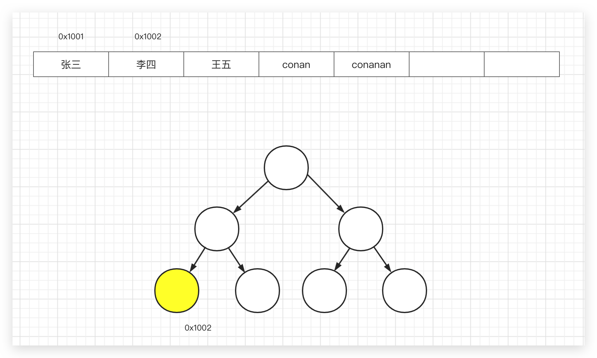
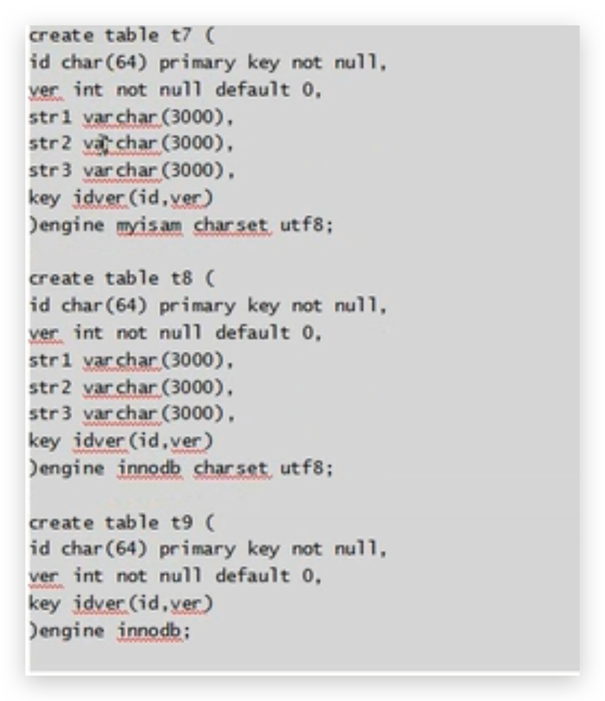
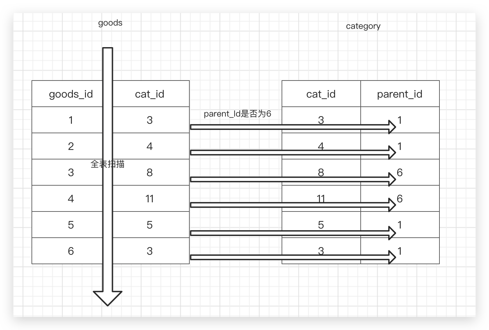

# MySQL 优化

## 表的优化

### 定长和变长分离

如 id int，占4个字节，char(4) 占4个字符长度，也是定长。即每一单元值占的字节是固定的。查询时就非常快。

所以推荐核心且常用的字段，指定定长且放在一张表中

而varchar，text，blob 这种变长字段，适合单放一张表，用主键和核心表关联起来


### 常用字段和不常用字段分离

结合具体业务分析，分析字段的**查询**场景，将查询频率低的字段，单拆出来


### 冗余字段—反范式

第三范式：略。拆分越细，则查询时关联的表越多。

一对多时，需要关联统计的字段上，添加冗余字段

如 BBS 中每个**板块**的**帖子数目**


## 列类型选择


### 字段类型优先级

字段类型优先级：**整形 > date，time 等 > enum，char > varchar > blob，text**

#### 整形

定长，没有国家、地区之分，没有字符集的差异。比如 tinyint 1,2,3,4,5 <--> char(1) a,b,c,d,e。从空间上都是占用1个字节，但是 order by 排序，整形快。而后者需要考虑字符集与校对集（排序规则）

#### time等

定长，运算快，节省空间。但是考虑时区写sql 时不方便，where create_time > '2021-1-1'。可以**考虑用时间戳**。xaprb 大佬博客中说明了关于 data/time 的选择，直接使用 int unsigned not null，存储 UTC 的 Unix 时间戳（最大值问题会解决的）

时间类型存储的选择，参考[xaprb 大佬的博客](https://www.xaprb.com/blog/2014/01/30/timestamps-in-mysql)

#### enum

能起约束值的目的

**内部用整形来存储**

enum 列与 enum 列相关联速度最快，但是与 char 联查时，内部要经历字符串与值的转化

#### char

定长，需要考虑字符集与校对集（排序规则）

如存储性别，以 UTF-8 为例。char(1)，占3个字节；enum('男','女')，内部转成数字来存，多一个转化过程；tinyint，定长1个字节

#### varchar

不定长，需要考虑字符集与校对集（排序规则），速度慢

#### text、blob

**无法使用内存临时表**，排序等操作只能使用外部排序（磁盘上进行）


### 够用就行

大的字段浪费内存，影响速度。

以年龄为例，tinyint unsigned not null 可以存储255岁，足够了，用 int 则浪费了3个字节

varchar(10), varchar(300)若存储的内存相同，但是在联表查询时需要花费更多内存


### 避免存 NULL

NULL 不利于索引，需要特殊的字节来标注，在磁盘中占据的空间更大。但是MySQL5.7已对 NULL 做了改进，占用大小区别不大了。仅查询不便了（where a != null 不行，只能 where a is not null）


## 索引类型

### BTree 索引

指数爆炸的反向

2^n-1，当n=32时，大致为42亿，而此时使用 BTree 可以最多查询 32 次即可查找到（二分查找思想）！




优点：

*   提高查询速度
*   提高排序速度（中序排列）
*   提高分组速度（先安装 group by 字段排序，然后分组，所以间接提高分组速度）


### Hash 索引

在 memory 表里，默认是 hash 索引，hash 的理论查询时间复杂度为O(1)。

既然hash索引查找如此高效，为什么不都用 hash 索引？

*   hash 函数计算的**结果是随机**的，如果是在磁盘上放置数据，比如主键为 id 的列，那么随着 id 的增长，id 对应的行在**磁盘上随机放置**。
*   此时**无法对范围查询进行优化**，只能精准查询快
*   此时**无法利用前缀索引**。比如在 BTree 中，field 列的值 'helloworld'，并加索引，查询 xx=helloworld，自然可以利用索引，xx=hello也可以利用索引（最左前缀索引）。但是hash('helloword')和hash('hello')两者的关系仍为随机。
*   此时**排序也无法优化**
*   **必须回行**，就是说通过索引拿到数据位置，必须回到表中取数据
*   hash冲突（这个也不会影响太多）。拉链算法，红黑树


## BTree 常见误区—在 where 条件常用列都加索引

例如，where cat_id = 3 and price > 100，查询第3个栏目，100元以上的商品。

误：在cat_id 和 price 上都加上索引。

原因：只能用上 cat_id 或 price 的索引，因为是**独立的索引，同时只能用上1个**

解决：实际中，建立联合索引。将多个列整体看作一个


## BTree 常见误区—多列索引—左前缀—顺序

例如：在多列上建立联合索引，查询哪个列，索引都将发挥作用？

误：多列索引上，索引是否发挥作用，需要**满足最左前缀要求**

以 index(a,b,c) 为例，**注意和顺序有关**！

| 语句                                          | 索引是否发挥作用                  |
| --------------------------------------------- | --------------------------------- |
| where a = 3                                   | 是，只使用了 a 列                 |
| where a = 3 and b = 5                         | 是，使用了 a，b列                 |
| where a = 3 and b = 5 and c = 4               | 是，使用了 a，b，c列              |
| where a = 3 or where c = 4                    | 否                                |
| where a = 3 and  c = 4                        | a列使用了索引，c未使用            |
| where a = 3 and b >5 and c = 4                | a列使用了索引，b使用了，c不能使用 |
| 同上, where a = 3 and b like 'xxx%' and c = 7 | a列使用了索引，b使用了，c不能使用 |

为便于理解，假设 abc 为各10米长的木板（**顺序**），河面宽30米，精确匹配，则走10米，like左前缀及返回查询，则走5米。走不到的木板即无法使用索引


## 面试题

### 联合索引练习

假设某个表有一个联合索引(c1,c2,c3,c4)，以下哪些能使用该联合索引的 c1,c2,c3 部分

```sql
CREATE TABLE tt(
c1 TINYINT NOT NULL DEFAULT 0,
c2 TINYINT NOT NULL DEFAULT 0,
c3 TINYINT NOT NULL DEFAULT 0,
c4 TINYINT NOT NULL DEFAULT 0,
c5 TINYINT NOT NULL DEFAULT 0,
index c1234(c1,c2,c3,c4)
);

INSERT INTO tt VALUES(1,3,5,6,7),(2,3,9,8,3),(4,3,2,7,5);
```

```sql
EXPLAIN SELECT * FROM tt where c1 = 1 and c2 = 1 and c4 > 1 and c3 = 1;

+--+-----------+-----+----------+-----+-------------+-----+-------+----+----+--------+---------------------+
|id|select_type|table|partitions|type |possible_keys|key  |key_len|ref |rows|filtered|Extra                |
+--+-----------+-----+----------+-----+-------------+-----+-------+----+----+--------+---------------------+
|1 |SIMPLE     |tt   |NULL      |range|c1234        |c1234|4      |NULL|1   |100     |Using index condition|
+--+-----------+-----+----------+-----+-------------+-----+-------+----+----+--------+---------------------+
and 同级，MySQL 自动重排优化。所以 c1,c2,c3,c4都能使用到。 key_len表示查询用到索引长度，建表时tinyint占用1字节，联合索引总占用4个字节
```

```sql
EXPLAIN SELECT * FROM tt where c1 = 1 and c2 = 1 and c4 = 1 order by c3;

+--+-----------+-----+----------+----+-------------+-----+-------+-----------+----+--------+---------------------+
|id|select_type|table|partitions|type|possible_keys|key  |key_len|ref        |rows|filtered|Extra                |
+--+-----------+-----+----------+----+-------------+-----+-------+-----------+----+--------+---------------------+
|1 |SIMPLE     |tt   |NULL      |ref |c1234        |c1234|2      |const,const|1   |33.33   |Using index condition|
+--+-----------+-----+----------+----+-------------+-----+-------+-----------+----+--------+---------------------+
c1,c2可以用到，c3用在排序上。c4无法使用
```

```sql
-- C: where c1 = x and c4 = x group by c3,c2
EXPLAIN SELECT count(*) FROM tt where c1 = 1 and c4 = 1 group by c3,c2;

+--+-----------+-----+----------+----+-------------+-----+-------+-----+----+--------+-----------------------------------------+
|id|select_type|table|partitions|type|possible_keys|key  |key_len|ref  |rows|filtered|Extra                                    |
+--+-----------+-----+----------+----+-------------+-----+-------+-----+----+--------+-----------------------------------------+
|1 |SIMPLE     |tt   |NULL      |ref |c1234        |c1234|1      |const|1   |33.33   |Using where; Using index; Using temporary|
+--+-----------+-----+----------+----+-------------+-----+-------+-----+----+--------+-----------------------------------------+

c1可以用到，c4无法使用，c3,c2顺序不同，无法使用
```

```sql
-- D: where c1 = ? and c5 = ? group by c2,c3
EXPLAIN SELECT count(*) FROM tt where c1 = 1 and c5 = 1 group by c2,c3;

+--+-----------+-----+----------+----+-------------+-----+-------+-----+----+--------+-----------+
|id|select_type|table|partitions|type|possible_keys|key  |key_len|ref  |rows|filtered|Extra      |
+--+-----------+-----+----------+----+-------------+-----+-------+-----+----+--------+-----------+
|1 |SIMPLE     |tt   |NULL      |ref |c1234        |c1234|1      |const|1   |33.33   |Using where|
+--+-----------+-----+----------+----+-------------+-----+-------+-----+----+--------+-----------+

c1可以用到，c2,c3用到分组上。c5无法使用
```

```sql
-- E: where c1 = ? and c2 = ? and c5 = ? order by c2,c3
EXPLAIN SELECT count(*) FROM tt where c1 = 1 and c2 = 1 and c5 = 1 order by c2,c3;

+--+-----------+-----+----------+----+-------------+-----+-------+-----------+----+--------+-----------+
|id|select_type|table|partitions|type|possible_keys|key  |key_len|ref        |rows|filtered|Extra      |
+--+-----------+-----+----------+----+-------------+-----+-------+-----------+----+--------+-----------+
|1 |SIMPLE     |tt   |NULL      |ref |c1234        |c1234|2      |const,const|1   |33.33   |Using where|
+--+-----------+-----+----------+----+-------------+-----+-------+-----------+----+--------+-----------+
c1,c2查询用到，c3排序用到，c2排序（没有必要了，已经=查询了，优化掉了），c5无法使用
```


### 场景题

有商品表，有主键、goods_id、栏目列 cat_id、价格 price。已经在 price 上架了索引，但安装价格查询还是很慢，可能是什么原因？怎么解决？

在实际场景中，电商网站的商品分类很多，直接在所有商品中按照价格查询商品是极少的，一般客户都是来到某个分类下再查。

所以可以去掉单独的 price 索引，加(cat_id,price) 联合索引。

如果根据日志分析许多人这样查：电脑->某品牌->价格，那么可以加(cat_id,brand_id,price)联合索引


## 聚簇索引 & 非聚簇索引

区别

*   Innodb 的**主索引文件上（主键索引），直接存放该行数据**，称为聚簇索引。**次索引指向对主键的引用（否则每个索引都要存储该行数据，炸了都）**；

    查询不指定排序时默认按照主键排序（主索引中有数据）

*   **MyISAM 索引是非聚簇索引，主索引和次索引都指向物理行（磁盘位置），所以查询不是索引的数据时需要回行！**

    因为索引和数据分为2个文件，数据在 xxx.myd，索引在 xxx.myi，当然还有其他文件如表信息文件xxx.frm；

    查询不指定排序时是乱序，因为按照磁盘存放的顺序读取

注意（InnoDB来说）：

*   主键索引既存储索引值，又在叶子汇总存储行的数据
*   如果没有主键，则会将 unique key 做主键
*   如果没有 unique，则系统生成一个内部的 rowid 做主键

聚簇索引优缺点：

*   优势：**根据主键查询条目比较少时，不用回行**（数据就在主键节点下）
*   劣势：如果碰到**不规则数据插入**时，造成频繁的**页分裂（树重排）**。但是对于**内存、固态硬盘来说，有随机读写功能**，页分裂差异不明显；而硬盘盘片需要转圈读取


## 索引覆盖

索引覆盖是指，如果**查询的列数据恰好是索引的一部分（MyISAM就不行了，需要 InnoDB）**，那么查询只需要在索引文件上进行，不需要回行（回表）到磁盘再找数据。这种查询非常快，称为索引覆盖

以 MyISAM 为例，select name form xx where id > 5。因为 MyISAM 是非聚簇索引，主次索引都指向磁盘，如果查询的值不是索引包含的数据则需要回行，name 没有在索引数据中所以不可能索引覆盖。

有个问题描述如下：

```sql
create table A(
	id varchar(64) primary key,
    ver int,
    -- ...
    t text(3000)， --长字段
    key iv(id,ver)
)
```

总共有10000条数据，为什么 select id from A order by id 特别慢？而 select id from A order by id,ver 非常快？

疑问：id, (id,ver) 都有索引， select id 应该都产生“索引覆盖”的效果，为什么前者慢后者快？

思路：从 InnoDB 和 MyISAM 索引的不同，索引覆盖这2个角度考虑分析：

*   对于 MyISAM 索引都是指向磁盘上的位置（**索引不存储其他列的数据**，统统指到磁盘）。而上面的SQL都应该走了索引且符合索引覆盖，所以不会是 MyISAM 引擎（该引擎上述2条语句速度不会有明显差异）。
*   InnoDB 表因为聚簇索引，id主索引要在**磁盘上跨n多块**（存储所有该行数据），导致速度慢，而另一个非主索引不会垮n多块？。即使 InnoDB 引擎，如果没有那几个长字段，2个语句的速度也不会有明显差异




## 索引优化—设计理想的索引

### 查询频繁、区分度高

*   查询频繁

*   区分度高

    100w用户，性别基本上五五开，若是按照性别索引则区分度就低。因为索引长度直接影响索引文件的大小，影响增删改的速度，间接影响查询速度（文件大，占用内存多）

    ```sql
    count(distinct brand_id) / count(*); -- 品牌的区分度
    ```

    尽量使用一个索引值能查询到近1条数据即可！

*   **长度小（区分度高，那么索引长度就小）**

*   尽量能覆盖常用查询字段


### 伪哈希索引—左前缀不易区分的列

如url列

http://www.baidu.com

http://www.qq.com

列的前11个字符都是一样的，不易区分，可以用如下2个办法解决：

*   把列内容倒过来存储，并建立索引。这样区分度大
*   伪hash索引。即使用hash算法将url列计算并存储到另一列如 hashurl中，查询时 where hashurl = hash(url)。缺点是**可能重复**


### 多列索引的原则—结合业务

多列索引考虑因素：列的**查询频率**，**列的区分度**，**列的查询顺序**。注意一定要**结合实际业务场景（观察日志一周）**。

虽然品牌的区分度大于分类，但是一般查询时顾客按照选大分类、小分类、品牌的顺序查询。

如选择 index(cat_id,brand_id) ， index(cat_id,shop_price) 建立索引，甚至可以再加 index(cat_id,brand_id,shop_price)，可以去掉第一个


### 索引与排序、分组

排序可能发生2种情况：

*   对于覆盖索引，直接在索引上查询时，就是有顺序的 using index（Extra中）。在 InnoDB 中，沿着索引字段排序，也是自然有序的；对于MyISAM，如果按照某索引字段排序，如id，但取出的字段中有未索引字段，如name，MyISAM的做法不是索引->回行，索引->回行。而是先取出所有行，在进行排序（Extra 为 **filesort**！！！）

*   若没使用到索引，则先取出数据，形成临时表坐**filesort！！！**（文件排序，但文件可能在磁盘上，也可能在内存中）

    where 条件的索引和 order by 的索引不一致也会产生 **filesort！！！**

我们争取目标：取出来的数据本身就是有序的，利用索引来排序


### 重复索引与冗余索引

重复索引：在同一个列如age或者顺序相同的几个列如age，school建立了多个索引，称为重复索引。没有任何帮助！只会增加索引文件大小，拖慢更新速度，去掉！！！

冗余索引：指2个索引所覆盖的列有重复。**顺序不同也可以是冗余索引！**


### 索引碎片与维护

在长期的数据更改中，索引文件和数据文件都将产生空洞，形成碎片。我们可以通过一个 `nop`操作（不产生对数据实质影响的操作）来修改表

比如表的引擎为 InnoDB，可以执行` alert table xxx engine innodb`，或`optimize table xxx`也可以修复

注意：修复表的数据及索引碎片，就会把所有数据文件重新整理一遍，使之对齐，这个过程如果表的行数比较大，也是非常消耗资源的操作，所以不能频繁的修复。

如果表的 update 操作很频繁，可以按照 周/月 来修复。如果不频繁，可以更长周期来修复


## SQL 语句优化

### SQL语句的时间都花在哪？

答：**等待**时间，**执行**时间。这2个时间并非孤立的，如果单条语句执行的快了，对其他语句的锁定也就少了


### SQL语句的执行时间又花在哪了？

*   查找：沿着索引查找，慢者可能全表扫描
*   取出：查到行后，把数据取出来（sending data）


### 如何查询快？

*   查询得快：联合索引的顺序，区分度，长度
*   取得快：索引覆盖
*   传输得少，更少的行和列

**切分查询**：按数据拆成多次。例如：插入1w行数据， 每1k条为单位插入

**分解查询**：按照逻辑把多表连接查询分成多个简单sql


### SQL 语句的优化思路

不查->少查->高效的查

*   不查：通过业务逻辑计算。比如论坛的注册会员数，可以根据前3个月统计的每天注册数，用程序来估算（没人在乎精确）
*   少查：尽量精准数据，少取行，新闻列表、评论内容等，一次10～30条左右
*   必须要查，尽量走在索引上查询
*   取时，取尽量少的列


## SQL语句优化—Explain

### 列名解释

| 列名            | 解释                                                         |
| :-------------- | :----------------------------------------------------------- |
| id              | 查询编号（有可能一个sql里有多个select查询）                  |
| **select_type** | 查询类型：显示本行是简单还是复杂查询                         |
| table           | 涉及到的表（真实名或别名或derived派生表，也可能为NULL，select 3+2） |
| partitions      | 匹配的分区：查询将匹配记录所在的分区。仅当使用 partition 关键字时才显示该列。对于非分区表，该值为 NULL。 |
| **type**        | 本次查询的表连接类型                                         |
| possible_keys   | 可能选择的索引                                               |
| **key**         | 实际选择的索引                                               |
| key_len         | 被选择的索引长度：一般用于判断联合索引有多少列被选择了       |
| ref             | 与索引比较的列。连接查询关联的键                             |
| **rows**        | **预计**需要扫描的行数，对 **InnoDB** 来说，这个值是**估值**，并不一定准确 |
| filtered        | 按条件筛选的行的百分比                                       |
| **Extra**       | 附加信息                                                     |

| select_type 的值     | 解释                                                         |
| :------------------- | :----------------------------------------------------------- |
| **SIMPLE**           | 简单查询 (**不使用关联查询或子查询**)                        |
| **PRIMARY**          | 如果包含关联查询或者子查询，则最外层的查询部分标记为 primary |
| UNION                | 联合查询中第二个及后面的查询                                 |
| DEPENDENT UNION      | 满足依赖外部的关联查询中第二个及以后的查询                   |
| UNION RESULT         | 联合查询的结果                                               |
| SUBQUERY             | 子查询中的第一个查询（非from子查询）                         |
| DEPENDENT SUBQUERY   | 子查询中的第一个查询，并且依赖外部查询                       |
| DERIVED              | 用到派生表的查询（from型子查询）                             |
| MATERIALIZED         | 被物化的子查询                                               |
| UNCACHEABLE SUBQUERY | 一个子查询的结果不能被缓存，必须重新评估外层查询的每一行     |
| UNCACHEABLE UNION    | 关联查询第二个或后面的语句属于不可缓存的子查询               |

| type 的值       | 解释                                                         |
| :-------------- | :----------------------------------------------------------- |
| system          | 查询对象表只有一行数据，且只能用于 MyISAM 和 Memory 引擎的表，这是最好的情况 |
| **const**       | 基于主键或唯一索引查询，最多返回一条结果                     |
| **eq_ref**      | 表连接时基于主键或非 NULL 的唯一索引完成扫描                 |
| **ref**         | 基于普通索引的等值查询，或者表间等值连接                     |
| fulltext        | 全文检索                                                     |
| ref_or_null     | 表连接类型是 ref，但进行扫描的索引列中可能包含 NULL 值       |
| index_merge     | 利用多个索引                                                 |
| unique_subquery | 子查询中使用唯一索引                                         |
| index_subquery  | 子查询中使用普通索引                                         |
| **range**       | 利用索引进行范围查询                                         |
| **index**       | 全索引扫描                                                   |
| **ALL**         | 全表扫描                                                     |

**上表的这些情况，查询性能从上到下依次是最好到最差。**

| Extra 常见的值                        | 解释                                                         | 例子                                                         |
| :------------------------------------ | :----------------------------------------------------------- | :----------------------------------------------------------- |
| **Using filesort**                    | 将用外部排序而不是索引排序，数据较小时从内存排序，否则需要在磁盘完成排序（取出text等） | explain select * from t1 order by create_time;               |
| **Using temporary**                   | 需要创建一个临时表来存储结构，通常发生对没有索引的列进行 GROUP BY 时 | explain select * from t1 group by create_time;               |
| **Using index**                       | 使用**覆盖索引**                                             | explain select a from t1 where a=111;                        |
| **Using where**                       | 使用 where 语句来处理结果                                    | explain select * from t1 where create_time=‘2019-06-18 14:38:24’; |
| Impossible WHERE                      | 对 where 子句判断的结果总是 false 而不能选择任何数据         | explain select * from t1 where 1<0;                          |
| Using join buffer (Block Nested Loop) | 关联查询中，被驱动表的关联字段没索引                         | explain select * from t1 straight_join t2 on (t1.create_time=t2.create_time); |
| Using index condition                 | 先条件过滤索引，再查数据                                     | explain select * from t1 where a >900 and a like “%9”;       |
| Select tables optimized away          | 使用某些聚合函数（比如 max、min）来访问存在索引的某个字段是  | explain select max(a) from t1;                               |


## in、exists、from 型子查询陷阱

### in 型子查询

题目：在 scshop 商城表中，查询6号栏目（大栏目，其下没有商品，只有子栏目）的商品。最直观的sql为

```sql
select goods_id,goods_name,cat_id from goods where cat_id in(select cat_id from category wehere parent_id = 6)
```

上述sql给我们的感觉是，先查询到内层的6号栏目的子栏目，如7，8，9，11，然后根据子栏目使用in查询外层

但是事实如下图，goods表全扫描，并逐行与category表对照，看parent_id = 6 是否成立



原因：MySQL的查询优化器，**针对in做了优化**，**被改成了 exist 子查询**的执行效果。**当goods表越大时，查询速度越慢**

具体查询可以类比如下（limit 1 当作逐行比较）：

```sql
select goods_id,cat_id from goods limit 1;-- 查询结果如 1,4
select * from category where cat_id = 4 and parent_id = 6;
```

改进为连接查询

```sql
select goods_id,cat_id,goods_name from goods g inner join (select cat_id from category where parent_id = 6) c using(cat_id); --using(cat_id) 是 on 的简写
```


### exists 先略


### from 型子查询

注意：**内层 from 语句查到的临时表，是没有索引的**。所以 from 的**返回内容要尽量少，需要排序在内层先排好序**！


## 奇淫巧技—强制使用索引—不推荐

查询pid为69的最小id

```sql
select min(id) from area where pid = 69;
```

使用limit可否实现呢？

```sql
select id from area where pid = 69 limit 1;
```

按理说InnoDB中主键索引已是排好序的，所以 limit 1就是最小的。也可以强制使用索引

```sql
select id from area use index(primary) where pid = 69 order by id desc limit 1;
```


## 误区

### MyISAM 的 count() 非常快

是比较快，但仅限于查询表的**所有行**时，以为MyISAM对行数进行了存储，一旦有条件查询，速度就不再快了，尤其是where条件的列上没有索引。

假如id<100的商家都是我们内部测试的，我们想查询真实的商家有多少？

```sql
select count(*) from t1 where id > 100;--1000w行使用了6s多
```

上面的sql很慢，可以如何优化呢？

改成查询所有数量减去 <= 100 的，数量少嘛

```sql
select ((select count(*) from t1) - (select count(*) from t1 where id <= 1000)) from t1;
```


### group by 误区

注意：

*   分组用于统计，而不用于筛选重复数据。

    不重复的行，分组统计数据用，而不要让查询产生n多重复数据。比如1->n连接时，栏目左连接商品表，将会产生重复行，用group by去重，效率很低

*   group by 的列要有索引，可以避免临时表及filesort

*   order by 的列要和 group by的一致，否则也会引起临时表。原因是group by和order by都需要排序，所以如果2者的列不一致，那必须经过至少1次排序

*    group by、order by 应用于左表


### union 优化—加 all

union 总是产生临时表，优化比较棘手：

*   注意union的字句条件要尽量具体（查询更少的行）
*   子句的结果在内存里并成结果集，自动去重复，去重复就得先排序。而加all之后不需要去重，union 尽量加all


## limit 及翻页优化

limit offset,n。当offset 非常大时，效率极低。原因是 mysql 并不是跳过 offset 行，然后单取 n 行，而是取 offset + n 行，然后放弃前 offset 行。

优化方法：

*   业务上解决

    不允许翻过100页。以百度为例，一般翻页到70页左右

*   不用 offset ，用条件查询

    但是得有序的列，并且有序的列不能删除，可逻辑删除（但是也不准了），如：

    ```sql
    select * from t where id > 5000000 limit 10;--几十秒
    ```

*   必须物理删除，还要用 offset 精确查询，还不限制用户分页，怎么办？离职！！！

    优化的思路：不查——少查——查询索引——少取列。那么可以只查索引，不查数据，先得到id，然后根据id查询具体条目。即**延迟关联**

    ```sql
    select * from t inner join
    (select id from t limit 50000000,10) tmp on t.id = tmp.id;--几秒
    ```

    


## 优化的思路

不查——少查——查询索引——少取列