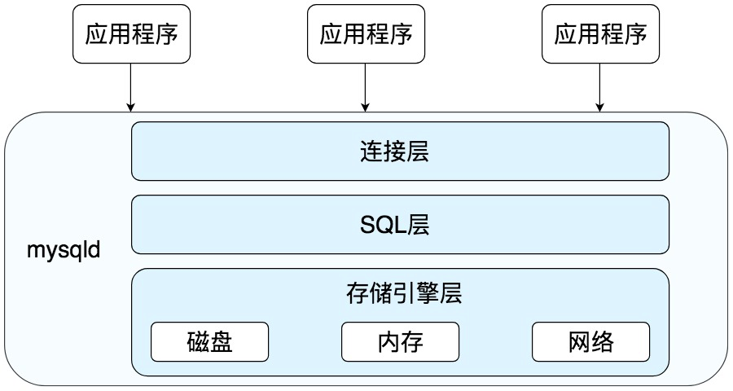
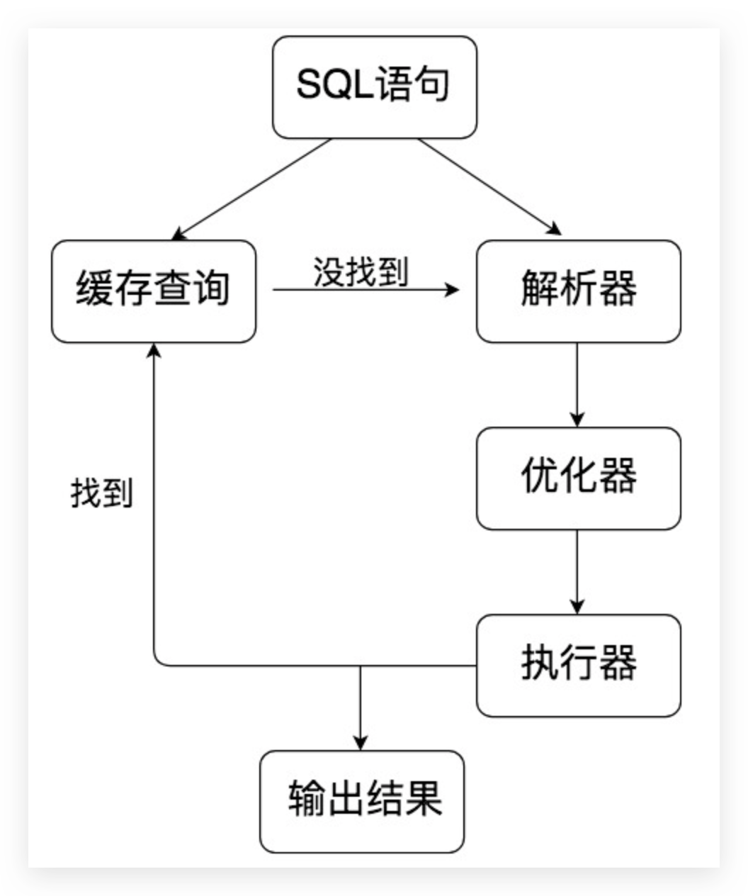

# MySQL 的系统架构

## 系统架构


MySQL 是 C/S 架构，服务端程序适用 mysqld，整体流程如下：



- **连接层**：客户端和服务器端建立连接，客户端发送 SQL 至服务端；
- **SQL 层**：对 SQL 语句进行查询处理；与数据库文件的存储方式无关；其结构如下：
- **存储引擎层**：与数据库文件打交道，负责数据的存储和读取。

## SQL 如何执行



- 查询缓存：Server 如果在查询缓存中发现了这条 SQL 语句，就会直接将结果返回给客户端；如果没有，就进入到解析器阶段。需要说明的是，因为查询缓存往往效率不高，所以在 MySQL8.0 之后就抛弃了这个功能。
- **解析器**：在解析器中对 SQL 语句进行语法分析、语义分析。
- **优化器**：在优化器中会确定 SQL 语句的执行路径，比如是根据全表检索，还是根据索引来检索等。
- **执行器**：在执行之前需要判断该用户是否具备权限，如果具备权限就执行 SQL 查询并返回结果。在 MySQL8.0 以下的版本，如果设置了查询缓存，这时会将查询结果进行缓存。

## 存储引擎

与 Oracle 不同的是，MySQL 的存储引擎采用了插件的形式，每个存储引擎都面向一种特定的数据库应用环境。同时开源的 MySQL 还允许开发人员设置自己的存储引擎，**且 MySQL 中每张表都可以设置为不同的存储引擎**。下面是一些常见的存储引擎：

- InnoDB 存储引擎：它是 MySQL 5.5 版本之后默认的存储引擎，最大的特点是支持事务、行级锁定、外键约束等。
- MyISAM 存储引擎：MySQL 5.5 版本之前是默认的存储引擎，不支持事务，也不支持外键，最大特点是速度快，占用资源少。
- Memory 存储引擎：使用系统内存作为存储介质，以便得到更快的响应速度。不过如果 mysqld 进程崩溃，则会导致所有的数据丢失，因此我们只有当数据是临时的情况下才使用 Memory 存储引擎。
- NDB 存储引擎：也叫做 NDB Cluster 存储引擎，主要用于 MySQL Cluster 分布式集群环境，类似于 Oracle 的 RAC 集群。
- Archive 存储引擎：它有很好的压缩机制，用于文件归档，在请求写入时会进行压缩，所以也经常用来做仓库。

## 索引

### 简介

- 索引是数据的目录（对应关系），能快速定位行数据的位置

- 提高了查询速度，降低了增删改的速度，并非索引越多越好
- 一般在查询频率高的列上加，而且在重复度低的列上效果更好

### 索引分类

- key：普通索引

- unique kye：唯一索引

- primary key：主键索引

- fulltext：全文索引（中文无效，需要分词，给分词加索引）

- 索引长度：建索引时，可以只索引列的前一部分内如，如前 10 个字符

- 多列索引：把 2 列或多列的值看成一个整体（如 first name，last name）

  注意，最左前缀原则。如：

  ```
  mysql> CREATE TABLE t1 (
  	xing CHAR(2),
  	ming char(5),
  	key xm (xing,ming)
  	);
  Query OK, 0 rows affected (0.08 sec)
  ```

  查看表索引

  ```
  mysql> SHOW INDEX FROM t1;
  +-------+------------+----------+--------------+-------------+-----------+-------------+----------+--------+------+------------+---------+---------------+---------+------------+
  | Table | Non_unique | Key_name | Seq_in_index | Column_name | Collation | Cardinality | Sub_part | Packed | Null | Index_type | Comment | Index_comment | Visible | Expression |
  +-------+------------+----------+--------------+-------------+-----------+-------------+----------+--------+------+------------+---------+---------------+---------+------------+
  | t1    |          1 | xm       |            1 | xing        | A         |           0 | NULL     | NULL   | YES  | BTREE      |         |               | YES     | NULL       |
  | t1    |          1 | xm       |            2 | ming        | A         |           0 | NULL     | NULL   | YES  | BTREE      |         |               | YES     | NULL       |
  +-------+------------+----------+--------------+-------------+-----------+-------------+----------+--------+------+------------+---------+---------------+---------+------------+
  2 rows in set (0.04 sec)
  ```

  插入数据

  ```sql
  INSERT into t1 VALUES('朱', '元璋')
  ```

  explain 查看是否使用到索引

  情况 1:

  ```
  mysql> explain select * from t1 where xing = '朱' and ming = '元璋';
  +----+-------------+-------+------------+------+---------------+-----+---------+-------------+------+----------+-------------+
  | id | select_type | table | partitions | type | possible_keys | key | key_len | ref         | rows | filtered | Extra       |
  +----+-------------+-------+------------+------+---------------+-----+---------+-------------+------+----------+-------------+
  |  1 | SIMPLE      | t1    | NULL       | ref  | xm            | xm  | 30      | const,const |    1 |   100.00 | Using index |
  +----+-------------+-------+------------+------+---------------+-----+---------+-------------+------+----------+-------------+
  1 row in set (0.06 sec)
  ```

  possible_keys 可能使用到的索引是 xm，key 实际使用到的索引是 xm

  情况 2:

  ```
  mysql> explain select * from t1 where ming = '元璋' and xing = '朱';
  +----+-------------+-------+------------+------+---------------+-----+---------+-------------+------+----------+-------------+
  | id | select_type | table | partitions | type | possible_keys | key | key_len | ref         | rows | filtered | Extra       |
  +----+-------------+-------+------------+------+---------------+-----+---------+-------------+------+----------+-------------+
  |  1 | SIMPLE      | t1    | NULL       | ref  | xm            | xm  | 30      | const,const |    1 |   100.00 | Using index |
  +----+-------------+-------+------------+------+---------------+-----+---------+-------------+------+----------+-------------+
  1 row in set (0.06 sec)
  ```

  possible_keys 可能使用到的索引是 xm，key 实际使用到的索引是 xm

  情况 3:

  ```
  mysql> explain select * from t1 where xing = '朱';
  +----+-------------+-------+------------+------+---------------+-----+---------+-------+------+----------+-------------+
  | id | select_type | table | partitions | type | possible_keys | key | key_len | ref   | rows | filtered | Extra       |
  +----+-------------+-------+------------+------+---------------+-----+---------+-------+------+----------+-------------+
  |  1 | SIMPLE      | t1    | NULL       | ref  | xm            | xm  | 9       | const |    1 |   100.00 | Using index |
  +----+-------------+-------+------------+------+---------------+-----+---------+-------+------+----------+-------------+
  1 row in set (0.06 sec)
  ```

  possible_keys 可能使用到的索引是 xm，key 实际使用到的索引是 xm

  情况 4:

  ```
  mysql> explain select * from t1 where ming = '元璋';
  +----+-------------+-------+------------+-------+---------------+-----+---------+------+------+----------+--------------------------+
  | id | select_type | table | partitions | type  | possible_keys | key | key_len | ref  | rows | filtered | Extra                    |
  +----+-------------+-------+------------+-------+---------------+-----+---------+------+------+----------+--------------------------+
  |  1 | SIMPLE      | t1    | NULL       | index | xm            | xm  | 30      | NULL |    1 |   100.00 | Using where; Using index |
  +----+-------------+-------+------------+-------+---------------+-----+---------+------+------+----------+--------------------------+
  1 row in set (0.16 sec)
  ```

  possible_keys 可能使用到的索引是 xm，key 实际使用到的索引是 xm。日？？？8.0.20 竟然 key 也是 xm！！测测 5.7 的

- 冗余索引

  ```
  mysql> CREATE TABLE t2 (
  	xing CHAR(2),
  	ming char(5),
  	key xm (xing,ming),
  	key ming(ming)
  );
  Query OK, 0 rows affected (0.11 sec)
  ```

### 语法总结

- 查看索引：show index from table_name

- 删除索引：

  - alert table table_name drop index index_name
  - drop index from table_name
  - 主键索引：alert table table_name drop primary key

- 添加索引：

  - alert table table_name add index/unique xm(xing,ming)

  - 主键索引：alert table table_name add primary key(xing)
