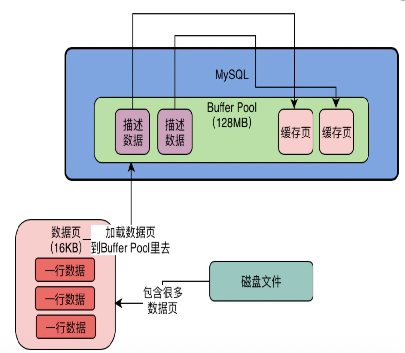
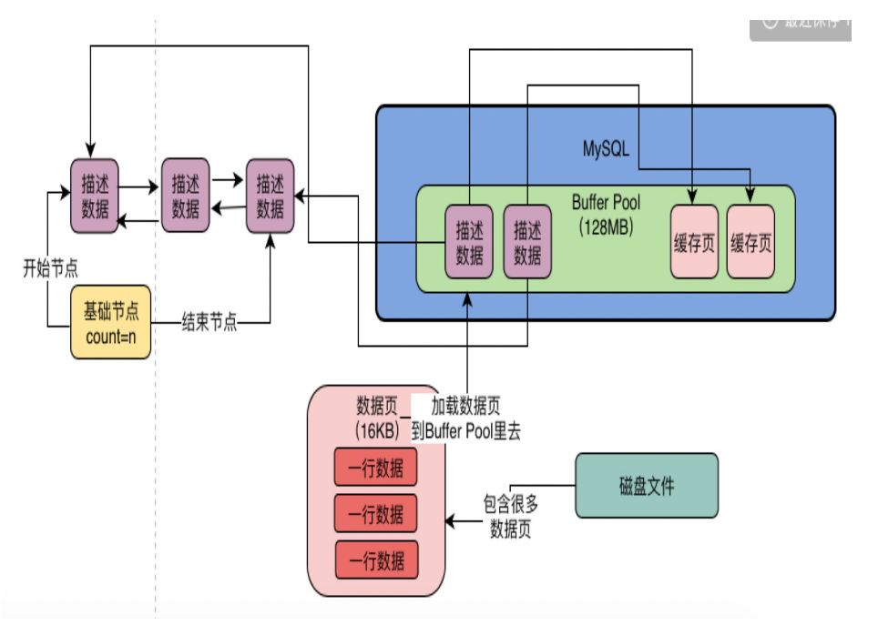

# MySQL 架构

## 系统是如何与 MySQL 打交道？

### 驱动的引入—建立连接

都知道，**访问数据库必须得跟数据库建立网络连接**。回忆 IDEA 中的数据库工具建立连接时是不是需要下载 driver，这个就是 **MySQL 的驱动，它会在底层跟数据库建立网络连接**。

当然 Java 代码如何使用该驱动呢？看如下 maven 依赖：

```xml
<dependency>
    <groupId>mysql</groupId>
    <artifactId>mysql-connector-java</artifactId>
    <scope>runtime</scope>
</dependency>
```

这就是 mysql 适配的 java 版本的连接驱动，当然还会有 Go、Python、JS 等版本


### 连接池（应用）—连接数量、复用

一个Java系统难道只会跟数据库建立一个连接吗？不可能，例如一个部署在 Tomcat 中的 Web 应用，**Tomcat 本身肯定是由多个线程来并发的处理同时接收到的多个请求**的。

这个时候，如果Tomcat中的多个线程并发处理多个请求的时候，都要去抢夺一个连接去访问数据库的话，那效率肯定是很低下的

若 Tomcat中的每个线程在每次访问数据库的时候，都基于MySQL驱动去创建一个数据库连接，然后执行SQL语句，然后执行完之后再销毁这个数据库连接。导致可能Tomcat中上百个线程会并发的频繁创建数据库连接，执行SQL语句，然后频繁的销毁数据库连接。这也是非常不好的，因为**每次建立一个数据库连接都很耗时**

所以一般我们必须要使用一个数据库连接池，也就是说在一个池子里维持多个数据库连接，让多个线程使用里面的不同的数据库连接去执行SQL语句，然后执行完SQL语句之后，不要销毁这个数据库连接，而是把连接放回池子里，后续还可以继续使用。

基于这样的一个数据库连接池的机制，就可以解决多个线程并发的使用多个数据库连接去执行SQL语句的问题，而且还避免了数据库连接使用完之后就销毁的问题，我们看下图的说明。


### 连接池（MySQL）

任何一个系统都会有一个数据库连接池去访问数据库，也就是说这个系统会有多个数据库连接，供多线程并发的使用。同时我们可能会有**多个系统同时去访问一个数据库**，这都是有可能的。那就是会有很多系统要与MySQL数据库建立很多个连接，那么MySQL也必然要**维护MySQL与系统之间的多个连接**，所以**MySQL架构体系中的第一个环节，就是连接池**。

实际上**MySQL中的连接池就是维护了与系统之间的多个数据库连接**。除此之外，你的系统每次跟MySQL建立连接的时候，还会根据你传递过来的账号和密码，进行**账号密码的验证，库表权限的验证**。


### MySQL 架构 & 执行流程

<iframe id="embed_dom" name="embed_dom" frameborder="0" style="display:block;width:100%; height:845px;" src="https://www.processon.com/embed/6011900ce401fd6d26c261d6"></iframe>


## 一条更新语句在 InnoDB 中的执行流程

### 图示

<iframe id="embed_dom" name="embed_dom" frameborder="0" style="display:block;width:100%; height:845px;" src="https://www.processon.com/embed/6012cd61e401fd6d26c6594e"></iframe>


### 更新语句在MySQL中是如何执行的？

首先假设我们有一条SQL语句是这样的：

```sql
update users set name='xxx' where id=10
```


### Buffer Pool—缓冲池

InnoDB存储引擎中有一个非常重要的放在**内存里的组件**，就是缓冲池（Buffer Pool），这里面会缓存很多的数据，以便于以后在查询的时候，万一你要是内存缓冲池里有数据，就可以不用去查磁盘了

要执行更新语句的时候 ，比如对“id=10”这一行数据，他其实会先将“id=10”这一行数据**看看是否在缓冲池里**，如果不在的话，那么会直接**从磁盘里加载到缓冲池里**来，而且接着还会**对这行记录加独占锁（不允许别人同时更新）**


### undo日志文件

接着下一步，假设“id=10”这行数据的name原来是“zhangsan”，现在我们要更新为“xxx”，那么此时我们得先把要更新的**原来的值**“zhangsan”和“id=10”这些信息，**写入到undo日志文件**中去。


### 更新buffer pool中的缓存数据

当我们把要更新的那行记录从磁盘文件加载到缓冲池，同时对他加锁之后，而且还把更新前的旧值写入undo日志文件之后，我们就可以正式开始更新这行记录了，**更新的时候**，**先是会更新缓冲池中的记录**，此时这个数据就是**脏数据**了。**磁盘和内存值不同**。

这里所谓的更新内存缓冲池里的数据，意思就是把内存里的“id=10”这行数据的name字段修改为“xxx”。那么为什么说此时这行数据就是脏数据了呢？因为这个时候磁盘上“id=10”这行数据的name字段还是“zhangsan”，但是内存里这行数据已经被修改了，所以就会叫他是脏数据。


### Redo Log Buffer—万一系统宕机，如何避免数据丢失？

接着我们来思考一个问题，按照上图的说明，现在已经把内存里的数据进行了修改，但是磁盘上的数据还没修改。那么此时万一MySQL所在的机器宕机了，必然会导致内存里修改过的数据丢失，这可怎么办呢？

这个时候，就必须要把对内存所做的修改写入到一个**Redo Log Buffer**里去，这也是内存里的一个缓冲区，是用来存放redo日志的，记录下来你对数据做了什么修改，比如对“id=10这行记录修改了name字段的值为xxx”，这就是一个日志。

这个redo日志其实是用来在MySQL突然**宕机**的时候，用来**恢复你更新过的数据**的。但此时redo日志还仅仅停留在内存缓冲区里


### 如果还没提交事务，MySQL宕机了怎么办？

到目前为止，其实还没有提交事务，那么此时如果MySQL崩溃，必然导致内存里Buffer Pool中的修改过的数据都丢失，同时你写入Redo Log Buffer中的redo日志也会丢失。那么此时数据丢失要紧吗？

其实是不要紧的，因为你一条更新语句，没提交事务，就代表他没执行成功，此时MySQL宕机虽然导致内存里的数据都丢失了，但是你会发现，磁盘上的数据依然还停留在原样子。也就是说，“id=1”的那行数据的name字段的值还是老的值，“zhangsan”，所以此时你的这个事务就是执行失败了，没能成功完成更新，你会收到一个数据库的异常。然后当mysql重启之后，你会发现你的数据并没有任何变化。所以此时如果mysql宕机，不会有任何的问题。


### 提交事务的时候将redo日志写入磁盘中

接着我们想要提交一个事务了，此时就会根据一定的策略（这个策略是通过**innodb_flush_log_at_trx_commit**来配置）把redo日志从redo log buffer里刷入到磁盘文件里去。此时可能处于的一个状态：

*   当这个参数的值为0的时候，那么你**提交事务**的时候，**不会把redo log buffer里的数据刷入磁盘文件**的，此时可能你都提交事务了，结果mysql宕机了，然后此时内存里的数据全部丢失。相当于你**提交事务成功**了，但是由于MySQL突然宕机，导致**内存中的数据和redo log buffer都丢失**了。**丢数据！**

*   当这个参数的值为1的时候，你**提交事务的时候，就必须把redo log从内存刷入到磁盘文件**里去，**只要事务提交成功**，**那么redo log就必然在磁盘里**了。此时你肯定会有一条redo日志说了，“我此时对哪个数据做了一个什么修改，比如name字段修改为xxx了”。

    然后哪怕此时buffer pool中更新过的数据还没刷新到磁盘里去，此时内存里的数据是已经更新过的“name=xxx”，然后磁盘上的数据还是没更新过的“name=zhangsan”。**有redo log保障最终一致！**mysql重启之后，他可以根据redo日志去恢复之前做过的修改

*   当这个参数的值为2的时候，意思就是，提交事务的时候，把redo日志**写入磁盘文件对应的os cache缓存**里去，而不是直接进入磁盘文件，**可能1秒后才会把os cache里的数据写入到磁盘文件**里去

    这种模式下，你提交事务之后，**redo log可能仅仅停留在os cache内存缓存**里，没实际进入磁盘文件，万一此时你要是机器宕机了，那么**os cache里的redo log就会丢失**，同样会让你感觉提交事务了，结果数据丢了

对于关系数据库这样严格的系统而言，**一般建议redo日志刷盘策略设置为1**，保证事务提交之后，数据绝对不能丢失


### bin log日志文件

不同之处

*   之前说的redo log，他是一种**偏向物理性质的重做日志**，因为他里面记录的是类似这样的东西，“对哪个**数据页**中的什么记录，做了个什么修改”。而且redo log本身是**属于InnoDB存储引擎特有**的一个东西。
*   而binlog叫做归档日志，他里面记录的是偏向于**逻辑性的日志**，类似于“对**users表中的id=10的一行数据做了更新操作，更新以后的值是什么**”。**属于mysql server自己的日志文件**

在我们提交事务的时候，会把redo log日志写入磁盘文件中去。然后其实在提交事务的时候，我们**同时还会把这次更新对应的binlog日志写入到磁盘文件中去**

对于binlog日志，其实也有不同的刷盘策略，有一个**sync_binlog**参数可以控制binlog的刷盘策略，他的默认值是0，

*   值为0时，此时你把binlog写入磁盘的时候，其实不是直接进入磁盘文件，而是进入os cache内存缓存。

    跟之前分析的一样，如果此时机器宕机，那么你在os cache里的**binlog日志是会丢失**的

*   值为1时，此时会强制在准备提交事务的时候，把binlog直接写入到磁盘文件里去，那么这样提交事务之后，哪怕机器宕机，磁盘上的binlog是不会丢失的


### 基于binlog和redo log完成事务的提交

当我们**把binlog写入磁盘文件**之后，接着就会完成**最终的事务提交**，此时会**把本次更新对应的binlog文件名称**和**这次更新的binlog日志在文件里的位置**，都**写入到redo log日志文件里**去，同时在redo log日志文件里**写入一个commit标记**。在完成这个事情之后，**才算最终完成了事务的提交**


### redo日志中写入commit标记的意义是什么？

用来**保持redo log日志与binlog日志一致**的。

举个例子，假设我们在提交事务的时候，一共有上图中的5、6、7三个步骤，必须是三个步骤都执行完毕，才算是提交了事务。那么在我们刚完成步骤5的时候，也就是redo log刚刷入磁盘文件的时候，mysql宕机了，此时怎么办？

这个时候因为没有最终的事务commit标记在redo日志里，所以此次事务可以判定为不成功。不会说redo日志文件里有这次更新的日志，但是binlog日志文件里没有这次更新的日志，不会出现数据不一致的问题。

如果要是完成步骤6的时候，也就是binlog写入磁盘了，此时mysql宕机了，怎么办？

同理，因为没有redo log中的最终commit标记，因此此时事务提交也是失败的。

**必须是在redo log中写入最终的事务commit标记了，然后此时事务提交成功**，而且redo log里有本次更新对应的日志，binlog里也有本次更新对应的日志 ，**redo log和binlog完全是一致的**。


### 后台IO线程随机将内存更新后的脏数据刷回磁盘

现在我们假设已经提交事务了，此时一次更新“update users set name='xxx' where id=10”，他已经把内存里的buffer pool中的缓存数据更新了，同时磁盘里有redo日志和binlog日志，都记录了把我们指定的“id=10”这行数据修改了“name='xxx'”。

此时我们会思考一个问题了，但是这个时候磁盘上的数据文件里的“id=10”这行数据的name字段还是等于zhangsan这个旧的值啊！

所以MySQL有一个后台的IO线程，会在之后某个时间里，随机的把内存buffer pool中的修改后的脏数据给刷回到磁盘上的数据文件里去。当IO线程把buffer pool里的修改后的脏数据刷回磁盘的之后，磁盘上的数据才会跟内存里一样，都是name=xxx这个修改以后的值了！

在你IO线程把脏数据刷回磁盘之前，哪怕mysql宕机崩溃也没关系，因为重启之后，会根据redo日志恢复之前提交事务做过的修改到内存里去，就是id=10的数据的name修改为了xxx，然后等适当时机，IO线程自然还是会把这个修改后的数据刷到磁盘上的数据文件里去的


### 思考题：执行更新操作的时候，为什么不能执行修改磁盘上的数据？

-   为什么MySQL在更新数据的时候，要大费周章的搞这么多事情，包括buffer pool、redo log、undo log、binlog、事务提交、脏数据。引入了一大堆的概念，有复杂的流程和步骤。
-   为什么他反而最关键的修改磁盘里的数据，要通过IO线程不定时的去执行？
-   为什么他不干脆直接就每次执行SQL语句，直接就更新磁盘里的数据得了？

edo(物理日志)记录的是哪一页哪个位置做了什么变动，顺序写，不用去用SQL找相应位置. binlog 记录完整的SQL, 可以依靠这个恢复某一个时刻的。 如果当确定redo日志和binlog日志都已经提交后,还要再次修改磁盘数据,首先性能会减慢，因为要确保更新成功,其次，如果修改磁盘数据时，宕机了,redo日志和Binlog保存的日志就没有作用。 如果每次执行SQL语句，直接更新磁盘数据, 频繁IO读写，性能很慢


### 思考题：IO线程没有刷回磁盘之前，mysql宕机重启之后是如何判断，在redo log中那些数据是需要恢复的呢？

有个 LSN 类似序列号，磁盘和 redolog 上面都有这个 LSN，如果当前 redolog LSN 存在但是磁盘不存在，说明就是需要恢复的


### 思考题：为什么要保证redo log和binlog数据一致性

因为innodb 是作为一个插件独立于mysql的，不一致，就说明数据出错了


## Buffer Pool

### 简介

Buffer Pool 是属于 InnoDB 特有的组件，**对于数据的所有操作都是在 Buffer Pool 中进行的**。其默认大小（占用内存）是 128MB，可以通过如下系统变量修改

```
[server]
innodb_buffer_pool_size = 2147483648
```

上述配置代表给 Buffer Pool 配置了 2GB 内存大小。


### 数据页 == 缓存页 == 索引页

Buffer Pool 中加载的数据结构是什么样子的？数据库的核心数据模型就是表+字段+行的概念。这里就不得不提到 MySQL **抽象**出来的概念——数据页，其默认大小为 16KB（即可以存储 16KB 大小的数据，所以实际表一个数据页可以存储多个行数据呢？），与操作系统页大小不同哦。

在操作数据时，数据库找到该行数据所在的数据页，并将该页加载到 Buffer Pool 中。加载到 Buffer Pool 中的数据页也被称为缓存页，两者此时完全一致。


### 缓存页的描述信息

对于每个缓存页都会有一个描述信息，用来描述这个缓存页的。如：这个数据页所属的表空间、数据页的编号、这个缓存页在 Buffer Pool 中的地址等等。

每个缓存页都会对应一个描述信息，这个描述信息本身也是一块数据，在Buffer Pool中，每个缓存页的描述数据放在最前面，然后各个缓存页放在后面。

注意一点，**Buffer Pool中的描述数据大概相当于缓存页大小的5%左右**，也就是每个缓存页的描述数据大概是800个字节左右的大小，然后假设你设置的buffer pool大小是128MB，**实际上Buffer Pool真正的最终大小会超出一些**，可能有个130多MB的样子，因为他里面还要存放每个缓存页的描述数据。


### 数据库启动时，初始化 Buffer Pool

数据库只要一启动，就会按照你设置的Buffer Pool大小，稍微再加大一点（因为要加上描述信息），去找操作系统申请一块内存区域，作为Buffer Pool的内存区域。

然后当内存区域申请完毕之后，数据库就会按照默认的缓存页的16KB的大小以及对应的800个字节左右的描述数据的大小，在Buffer Pool中划分出来一个一个的缓存页和一个一个的他们对应的描述数据。



只不过这个时候，Buffer Pool中的一个一个的缓存页都是空的，里面什么都没有，要等数据库运行起来之后，当我们要对数据执行增删改查的操作的时候，才会把数据对应的页从磁盘文件里读取出来，放入Buffer Pool中的缓存页中


### 从磁盘加载数据页时哪些缓存页是空的？free双向链表

默认情况下磁盘上的数据页和缓存页是一 一对应起来的，都是16KB，一个数据页对应一个缓存页。所以我们必须要知道Buffer Pool中哪些缓存页是空闲的状态。

所以数据库会为Buffer Pool设计一个**free链表**，他是一个**双向链表**数据结构，这个free链表里，每个节点就是一个空闲的缓存页的**描述数据块的地址**，也就是说，只要你一个**缓存页是空闲的，那么他的描述数据块就会被放入这个free链表**中。

刚开始数据库启动的时候，可能所有的缓存页都是空闲的，因为此时可能是一个空的数据库，一条数据都没有，所以**此时所有缓存页的描述数据块，都会被放入这个free链表中**

这个free链表还有一个**基础节点**，他会**引用链表的头节点和尾节点**，里面还存储了链表中有多少个描述数据块的节点，也就是有**多少个空闲的缓存页**。

****

### free 链表占用额外多少内存？

看上图我们会以为以为这个描述数据块，在Buffer Pool里有一份，在free链表里也有一份，好像在内存里有两个一模一样的描述数据块，是么？错！

其实这个free链表，他本身其实就是由Buffer Pool里的描述数据块组成的，你可以认为是每个描述数据块里都有两个指针，一个是free_pre，一个是free_next，分别指向自己的上一个free链表的节点，以及下一个free链表的节点。

通过Buffer Pool中的描述数据块的free_pre和free_next两个指针，就可以把所有的描述数据块串成一个free链表。上面为了画图需要，所以把描述数据块单独画了一份出来，表示他们之间的指针引用关系。

对于free链表而言，只有一个**基础节点是不属于Buffer Pool的**，他是**40字节**大小的一个节点，里面就存放了free链表的头节点的地址，尾节点的地址，还有free链表里当前有多少个节点。


### 思考

#### 内存碎片的问题 

大家可以想象一下，对于Buffer Pool而言，他里面会存放很多的缓存页以及对应的描述数据，那么假设Buffer Pool里的内存都用尽了，已经没有足够的剩余内存来存放缓存页和描述数据了，此时Buffer Pool里就一点内存都没有了吗？还是说Buffer Pool里会残留一些内存碎片呢？

如果你觉得Buffer Pool里会有内存碎片的话，那么你觉得应该怎么做才能尽可能减少Buffer Pool里的内存碎片呢？

1. buffer_pool 的size，是仅仅包含缓存页的大小，不包含描述数据的大小吧？ 
2. 如果在最后buffer_pool的内存使用完毕，则说明缓存页的的内存使用完毕，可以采取LRU的多种策略淘汰掉一些缓存页，重新Load出想要的数据。

缓存页是存放在内存中，那么就需要内存管理机制，LRU之类的。


#### Buffer Pool 和查询缓存区别

这里的 Buffer Pool 和查询缓存不是一回事，Buffer Pool 是用于增删改查的，而查询缓存只用于缓存查询数据，

查询缓存是针对单个表的，且只能读，如果这个表发生了增删改操作，该表的sqlcache全部要清空，mysql8之后移除了这玩意。buffer pool是数据缓存，基于他要做增删改查，提高速度

直接看mysql的源文件，show varialbles like '%datadir%';就可以看到每个库下面每个表有一个ibd文件，这个就是表空间的文件，数据页只是在里面的一个单元而已，并不是单独的磁盘文件


#### Buffer Pool 大小设置

Buffer Pool 设置偏大的话如果宕机会丢失较多数据，checkpoint游标来不及刷脏页，导致日志文件偏大，后续恢复时间偏长，有利有弊

我记得在 DBA的课程上有介绍 innodb-buffer-pool-size 推荐设置到 70%-80% 的内存。然后我去 MySQL 5.7 的官网上查证了下，有写道：On a dedicated database server, you might set the buffer pool size to 80% of the machine's physical memory size. 链接：https://dev.mysql.com/doc/refman/5.7/en/innodb-parameters.html#sysvar_innodb_buffer_pool_size