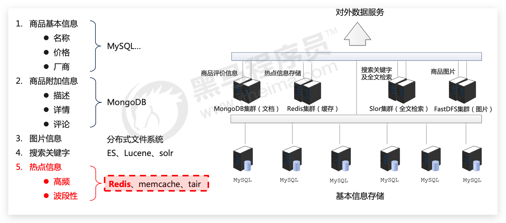
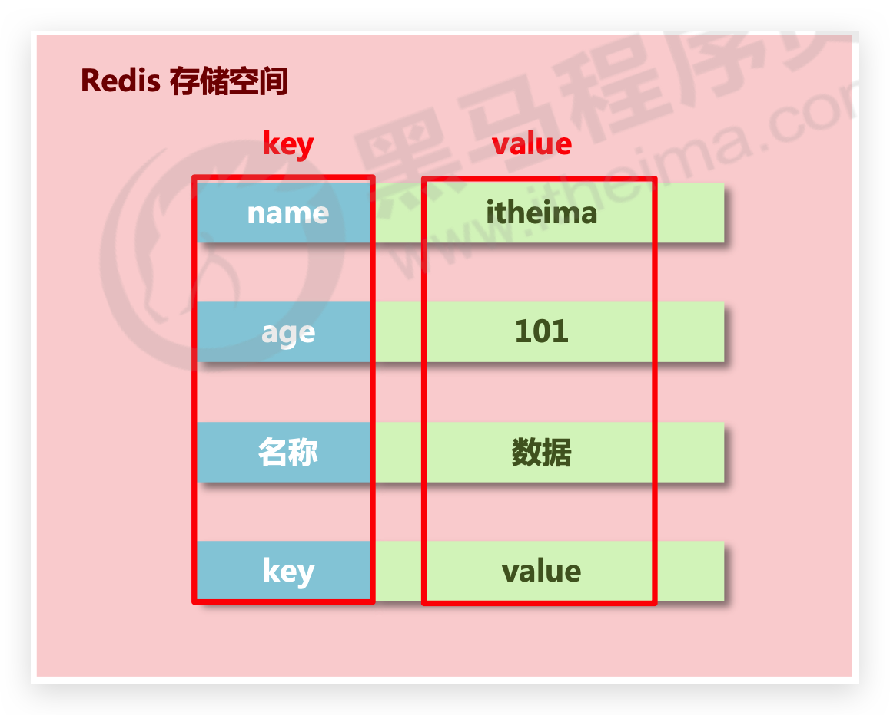

# 入门

## 引入

### 现象&问题

奥运会门票预售系统开放第一天，上午9点正式开始售票到中午12点，3个小时内，票务网站被浏览次数达到2000万次。12306、淘宝、京东在当时都会发生崩溃的现象。总结来说就是：

*   海量用户
*   高并发


### 原因

罪魁祸首就是**关系型数据库**

*   **性能**瓶颈：**磁盘IO性能低下**
*   **扩展**瓶颈：**数据关系复杂**，**扩展性差**，不便于大规模集群


### 解决思路

*   降低磁盘IO次数，越低越好：使用内存存储
*   去除数据间关系，越简单越好：不存储关系，仅存储数据

总结就是引入 NoSQL


### NoSQL

NoSQL：即 **Not-Only SQL**（**泛指**非关系型的数据库），作为关系型数据库的**补充**。

作用：应对基于海量用户和海量数据前提下的数据处理问题

特征：

*   可扩容，可伸缩
*   大数据量下高性能
*   灵活的数据模型
*   高可用

常见 Nosql 数据库:

*   Redis
*   memcache
*   HBase
*   MongoDB


### Redis 所处电商系统位置




## Redis 简介

### 概念

Redis（Remote Dictionary Server）是用 C 语言开发的一个开源的**高性能键值对**（key-value）数据库


### 特征

*   数据间没有必然的关联关系
*   内部采用单线程机制进行工作（6.0后支持多线程）
*   高性能。官方提供测试数据，50个并发执行100000 个请求,读的速度是110000 次/s,写的速度是81000次/s
*   多数据类型支持
    *   字符串类型 string
    *   列表类型 list
    *   散列类型 hash
    *   集合类型 set
    *   有序集合类型 sorted_set
*   持久化支持。可以进行数据灾难恢复


### 应用场景 🔥

*   缓存，为**热点数据加速查询**（主要场景），如热点商品、热点新闻、热点资讯、推广类、短链接等高访问量信息等
*   **即时信息查询**，如各位**排行榜**、各类网站访问**统计**、公交到站信息、在线人数信息（聊天室、网站）、设备信号等
*   **时效性信息控制**，如**验证码**控制、**投票控制**等
*   **分布式数据共享**，如**分布式集群架构中的 session 分离**
*   数据过期处理（可以精确到毫秒）
*   **任务队列**，如秒杀、抢购、12306购票排队等
*   **消息队列**
*   分布式锁（不推荐，推荐使用 zookepper）


## Redis 下载安装—6379

### 官网

*   [官网](https://redis.io)

*   [中文网](http://www.redis.net.cn/)

解压直接可以使用：

- redis.windows.conf：配置文件
- redis-cli.exe：redis 的客户端
- redis-server.exe：redis 服务器端


### docker-compose

```yml
version: '3.1'

services:
  redis:
    image: redis
    restart: "no"
    ports:
      - 6379:6379
```

启动 Redis 容器

*   执行`docker compose up -d`下载启动即可

进入 Redis 容器，使用 cli

*   执行`docker exec -it b2 redis-cli`。当然也可以进入 bash 后执行`redis-cli`


### 基本操作

清屏：执行`clear`

帮助：获取**命令**帮助文档，获取**组中所有命令**信息名称

```
help 命令名称
help @组名   -- 这里可以使用 tab 自动补全
```


## 数据存储类型—数据结构

**分析业务数据的特殊性**，是什么数据会存储在 Redis 中呢？据此来设计

### 作为缓存使用

原始业务功能设计

*   秒杀
*   618活动
*   双11活动
*   排队购票

运营平台监控到的突发高频访问数据

*   突发时政要闻，被强势关注围观

高频、复杂的统计数据

*   在线人数
*   投票排行榜


### 附加功能

系统功能优化或升级

*   单服务器升级集群

*   Session 管理
*   Token 管理


### 数据结构总览

*   redis 自身是一个 **Map**，其中所有的数据都是**采用 key : value 的形式存储**
*   **数据类型指的是存储的数据的类型**，也就是 **value** 部分的类型，**key 部分永远都是字符串**



常见类型如下：

- **字符串**类型 string
- **哈希**类型 hash ： map 格式
- **列表**类型 list ： linkedlist 格式。支持重复元素
- **集合**类型 set ： 不允许重复元素
- **有序集合**类型 sortedset：不允许重复元素，且元素有顺序

*   ...


## 1.3 命令操作

### 1.3.2 字符串 Strings

- 


### 1.3.3 哈希 Hashes

- 存储： **hset** key field value

  ```
  127.0.0.1:6379> hset myhash username lisi
  (integer) 1
  127.0.0.1:6379> hset myhash password 123
  (integer) 1
  ```

- 获取

  - **hget** key field: 获取指定的 field 对应的值

    ```
    127.0.0.1:6379> hget myhash username
    "lisi"
    ```

  - **hgetall** key：获取所有的 field 和 value

    ```
    127.0.0.1:6379> hgetall myhash
    1) "username"
    2) "lisi"
    3) "password"
    4) "123"
    ```

- 删除： **hdel** key field

  ```
  127.0.0.1:6379> hdel myhash username
  (integer) 1
  ```

### 1.3.4 列表 Lists

可以添加一个元素到列表的头部（左边）或者尾部（右边）

- 添加

  - **lpush** key value: 将元素加入列表左表

  - **rpush** key value：将元素加入列表右边

    ```
    127.0.0.1:6379> lpush myList a
    (integer) 1
    127.0.0.1:6379> lpush myList b
    (integer) 2
    127.0.0.1:6379> rpush myList c
    (integer) 3
    ```

- 获取

  - **lrange** key start end ：范围获取

    ```
    127.0.0.1:6379> lrange myList 0 -1
    1) "b"
    2) "a"
    3) "c"
    ```

- 删除

  - **lpop** key： 删除列表最左边的元素，并将元素返回
  - **rpop** key： 删除列表最右边的元素，并将元素返回

### 1.3.5 集合 Sets

不允许重复元素

- 存储：**sadd** key value

  ```
  127.0.0.1:6379> sadd myset a
  (integer) 1
  127.0.0.1:6379> sadd myset a
  (integer) 0
  ```

- 获取：**smembers** key:获取 set 集合中所有元素

  ```
  127.0.0.1:6379> smembers myset
  1) "a"
  ```

- 删除：**srem** key value:删除 set 集合中的某个元素

  ```
  127.0.0.1:6379> srem myset a
  (integer) 1
  ```

### 1.3.6 有序集合 Sorted sets

不允许重复元素，且元素有顺序。每个元素都会关联一个 double 类型的分数，redis 正是通过分数来为集合中的成员进行从小到大的排序。

- 存储：**zadd** key score value

  ```
  127.0.0.1:6379> zadd mysort 60 zhangsan
  (integer) 1
  127.0.0.1:6379> zadd mysort 50 lisi
  (integer) 1
  127.0.0.1:6379> zadd mysort 80 wangwu
  (integer) 1
  ```

- 获取：**zrange** key start end [withscores]

  ```
  127.0.0.1:6379> zrange mysort 0 -1
  1) "lisi"
  2) "zhangsan"
  3) "wangwu"

  127.0.0.1:6379> zrange mysort 0 -1 withscores
  1) "zhangsan"
  2) "60"
  3) "wangwu"
  4) "80"
  5) "lisi"
  6) "500"
  ```

- 删除：**zrem** key value

  ```
  127.0.0.1:6379> zrem mysort lisi
  (integer) 1
  ```

### 1.3.7 通用命令

- `keys *` : 查询所有的键
- `type key` ： 获取键对应的 value 的类型
- `del key`：删除指定的 key value

## 1.4 Redis 持久化

redis 中数据存储在内存，当 redis 服务器重启或电脑重启，数据会丢失，可以将 redis 内存中的数据持久化保存到硬盘的文件中。

- redis 持久化机制

  - **RDB**：默认方式，不需要进行配置。在一定的间隔时间中，检测 key 的变化情况，然后持久化数据

    1. 编辑 redis.windwos.conf 文件

       ```nginx
       #   after 900 sec (15 min) if at least 1 key changed
       save 900 1
       #   after 300 sec (5 min) if at least 10 keys changed
       save 300 10
       #   after 60 sec if at least 10000 keys changed
       save 60 10000
       ```

    2. 命令行中重新启动 redis 服务器，并指定配置文件名称`redis-server.exe redis.windows.conf`

  - AOF：日志记录的方式，可以记录每一条命令的操作。可以每一次命令操作后，持久化数据。不推荐

    1. 编辑 redis.windwos.conf 文件

       ```nginx
       appendonly no（关闭aof） # --> appendonly yes （开启aof）

       # appendfsync always ： 每一次操作都进行持久化
       appendfsync everysec ： 每隔一秒进行一次持久化
       # appendfsync no	 ： 不进行持久化
       ```

    2. 命令行中重新启动 redis 服务器，并指定配置文件名称。同上

## 1.5 Jedis

### 1.5.1 Jedis 简介

Jedis: Redis 官方推出的一款 java 操作 redis 数据库的工具（后续会使用 Spring Data Redis）

- 使用步骤

  1. 导入 jedis 的 jar 包

  2. 使用

     ```java
     //1. 获取连接
     Jedis jedis = new Jedis("localhost",6379);
     //2. 操作
     jedis.set("username","zhangsan");
     //3. 关闭连接
     jedis.close();
     ```

### 1.5.2 Jedis 操作 Redis 中的数据结构

```java
//获取连接
@Before
public void init(){
    Jedis jedis = new Jedis();//如果使用空参构造，默认值 "localhost",6379端口
}
//关闭连接
@After
public void close(){
    jedis.close();
}
```

- 字符串 Strings：`set`、`setex`、`del`、`get`

  ```java
  //存储
  jedis.set("username","zhangsan");
  //获取
  String username = jedis.get("username"); //zhangsan

  //可以使用setex()方法存储可以指定过期时间的 key value
  jedis.setex("activecode",20,"hehe");//将activecode：hehe键值对存入redis，并且20秒后自动删除该键值对
  ```

- 哈希 Hashes（map 格式）：`hset`、`hdel`、`hget`、`hgetAll`

  ```java
  // 存储hash
  jedis.hset("user","name","lisi");
  jedis.hset("user","age","23");
  jedis.hset("user","gender","female");

  // 获取hash
  String name = jedis.hget("user", "name"); //lisi
  // 获取hash的所有map中的数据
  Map<String, String> user = jedis.hgetAll("user");
  ```

- 列表 Lists：`lpush/rpush`、`lpop/rpop`、`lrange`

  ```java
  jedis.lpush("mylist","a","b","c");//从左边存
  jedis.rpush("mylist","a","b","c");//从右边存

  // list 范围获取
  List<String> mylist = jedis.lrange("mylist", 0, -1); // [c,b,a,a,b,c]

  // list 弹出
  String element1 = jedis.lpop("mylist");//c
  String element2 = jedis.rpop("mylist");//c
  List<String> mylist2 = jedis.lrange("mylist", 0, -1); // ,b,a,a,b]
  ```

- 集合 Sets：`sadd`、`srem`、`smembers`

  ```java
  // set 存储
  jedis.sadd("myset","java","php","c++");

  // set 获取
  Set<String> myset = jedis.smembers("myset"); //[c++,java,php]
  ```

- 有序集合 Sorted sets：`zadd`、`zrem`、`zrange [withscores]`

  ```java
  jedis.zadd("mysortedset",3,"亚瑟");
  jedis.zadd("mysortedset",30,"后裔");
  jedis.zadd("mysortedset",55,"孙悟空");

  // sortedset 获取
  Set<String> mysortedset = jedis.zrange("mysortedset", 0, -1);
  ```

### 1.5.3 Jedis 连接池-JedisPool

- 使用

  1. 创建`JedisPool`连接池对象
  2. 调用方法`getResource()`方法获取 Jedis 连接

  ```java
  //0.创建一个配置对象，耦合度高！
  JedisPoolConfig config = new JedisPoolConfig();
  config.setMaxTotal(50);
  config.setMaxIdle(10);

  //1.创建Jedis连接池对象
  JedisPool jedisPool = new JedisPool(config,"localhost",6379);

  //2.获取连接
  Jedis jedis = jedisPool.getResource();
  //3. 使用
  jedis.set("hehe","heihei");
  //4. 关闭 归还到连接池中
  jedis.close();
  ```

- **JedisUtils**

  ```java
  /**
   JedisPool工具类
      加载配置文件，配置连接池的参数
      提供获取连接的方法
   */
  public class JedisPoolUtils {
      private static JedisPool jedisPool;
      static{
          //读取配置文件
          InputStream is = JedisPoolUtils.class.getClassLoader().getResourceAsStream("jedis.properties");
          //创建Properties对象
          Properties pro = new Properties();
          //关联文件
          try {
              pro.load(is);
          } catch (IOException e) {
              e.printStackTrace();
          }
          //获取数据，设置到JedisPoolConfig中
          JedisPoolConfig config = new JedisPoolConfig();
          config.setMaxTotal(Integer.parseInt(pro.getProperty("maxTotal")));
          config.setMaxIdle(Integer.parseInt(pro.getProperty("maxIdle")));
          //初始化JedisPool
          jedisPool = new JedisPool(config,pro.getProperty("host"),Integer.parseInt(pro.getProperty("port")));
      }
      /**
       * 获取连接方法
       */
      public static Jedis getJedis(){
          return jedisPool.getResource();
      }
  }
  ```

## 1.6 案例

需求：

- 提供 index.html 页面，页面中有一个省份 下拉列表
- 当页面加载完成后 发送 ajax 请求，加载所有省份

注意：使用**redis**缓存一些**不经常发生变化的数据**。

- **数据库的数据一旦发生改变，则需要更新缓存**。
  - 数据库的表执行增删改的相关操作，需要将 redis 缓存数据清空，再次存入
  - 在 service 对应的增删改方法中，将 redis 数据删除。
