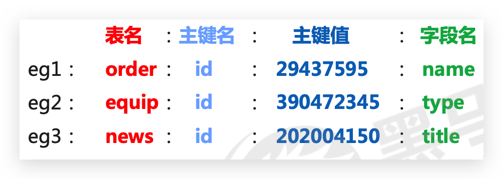
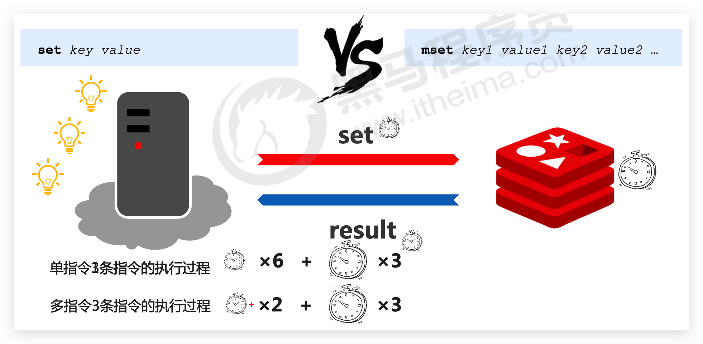
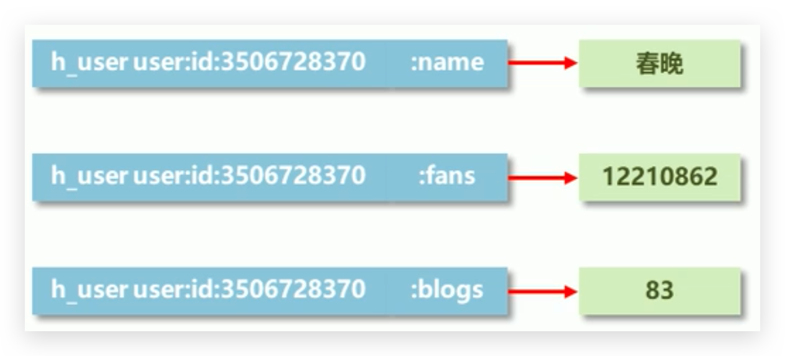
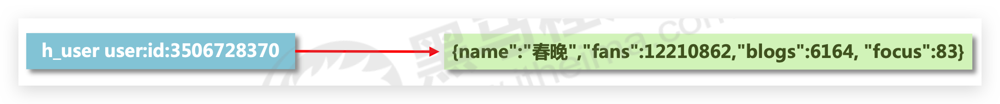

# string

## 介绍

* 字符串（string）键是Redis最基本的键值对类型，这种类型的键值对会在数据库中把**单独的一个键**和**单独的一个值**关联起来
* 被关联的键和值既可以是**普通的文字数据**，也可以是图片、视频、音频、压缩文件等更为**复杂的二进制数据**
* **如果字符串以整数的形式展示，可以作为数字操作使用**，但本质还是字符串！
* 数据最大存储量

  * **512MB**，也不可能存储这么大的值！
* 数值计算最大范围(java中的long的最大值)

  * 9223372036854775807
* 数据操作不成功的反馈与数据正常操作之间的差异

  * 表示运行结果是否成功

    * (integer) 0 → false 失败
    * (integer) 1 → true 成功
  * 表示运行结果值

    * (integer) 3 → 3 3个
    * (integer) 1 → 1 1个
* 数据未获取到

  * (nil)等同于null

## 🔥KEY 的命名约定

数据库中的热点数据key命名惯例



## 🔥SET为字符串键设置值

设置即为**添加、修改**

```bash
set key value
```

实例

```
127.0.0.1:6379> set name conan
OK

127.0.0.1:6379> set name conanan
OK
```

### 可选参数 EX PX NX XX

从 Redis 2.6.12 版本开始， `SET` 命令的行为可以通过一系列参数来修改：

- `EX seconds` ： 将键的过期时间设置为 `seconds` **秒**。 执行 `SET key value EX seconds` 的效果等同于执行 `SETEX key seconds value` 。
- `PX milliseconds` ： 将键的过期时间设置为 `milliseconds` **毫秒**。 执行 `SET key value PX milliseconds` 的效果等同于执行 `PSETEX key milliseconds value` 。
- `NX` ： 只在键不存在时， 才对键进行设置操作。 执行 `SET key value NX` 的效果等同于执行 `SETNX key value` 。
- `XX` ： 只在键已经存在时， 才对键进行设置操作。

::: tip

因为 `SET` 命令可以通过参数来实现 `SETNX` 、`SETXX`、 `SETEX` 以及 `PSETEX` 命令的效果， 所以 Redis 将来的版本可能会移除并废弃这几个命令。
:::

## SETNX/SETXX❗️改变覆盖规则

* NX：只会在**键没有值**的情况下执行**设置**操作，并返回OK表示设置成功；如果键已经存在，那么SET命令将放弃执行设置操作，并返回空值nil表示设置失败
* XX：只会在**键已经有值**的情况下执行**设置**操作，并返回OK表示设置成功；如果给定的键并没有值，那么SET命令将放弃执行设置操作，并返回空值nil表示设置失败

## SETEX / PSETEX❗️设置过期时间

设置数据具有指定的生命周期

```bash
setex key seconds value  -- 秒
psetex key milliseconds value -- 毫秒
```

实例

```bash
127.0.0.1:6379> setex tel 3 110
OK
127.0.0.1:6379> get tel
"110"
127.0.0.1:6379> get tel
(nil)
```

但是记住，**再次执行会重置时间**，如：

```bash
127.0.0.1:6379> setex tel 3 110
OK
127.0.0.1:6379> setex tel 60 110 -- 重置为60秒
OK
127.0.0.1:6379> setex tel 110 -- 重置永久
OK
```

## 🔥GET获取字符串键的值

如果键 `key` 不存在， 那么返回特殊值 `nil` ； 否则， 返回键 `key` 的值。

如果键 `key` 的值**并非string类型**， 那么返回一个**错误**， 因为 `GET` 命令只能用于字符串值。

查询命令：

```bash
get key
```

查询一个存在的key：

```bash
127.0.0.1:6379> get name
"conanan"
```

查询一个不存在的key：

```bash
127.0.0.1:6379> get age
(nil)
```

Redis的数据库要求**所有键必须拥有与之相关联的值**，所以如果一个键有值，那么我们就说这个键存在于数据库；相反，如果一个键没有值，那么我们就说这个键不存在于数据库

## GETSET 获取旧值并设置新值

就像GET命令和SET命令的组合版本，GETSET首先获取字符串键目前已有的值，接着为键设置新值，最后把之前获取到的旧值返回给用户

```bash
GETSET key newValue
```

## 🔥MSET一次为多个字符串键设置值

添加、修改多个数据：

```bash
mset key1 value1 key2 value2 ...
```

其中`m`为 mutiple 多个意思

```bash
127.0.0.1:6379> mset a 1 b 2 c 3
OK
```

## MSETNX 键不存在的情况下批量设置值

略

## 🔥MGET

获取多个数据：

```bash
mget key1 key2 ...
```

实例

```bash
127.0.0.1:6379> mget a b c d
1) "1"
2) "2"
3) "3"
4) (nil) --注意这里
-- 注意整个返回的格式
```

## SET 和 MSET 对比

单数据操作与多数据操作的选择之惑



基本上选择`mset`不会有问题，但是要注意实际数据大小！太少这俩没太大区别；太多太多也不能使用他俩，一条一条处理不行，单线程处理太多数据也不行，应该拆分数据后使用`mset`

## STRLEN

获取数据字符个数（字符串长度）：

```bash
strlen key
```

实例

```bash
127.0.0.1:6379> get name
"conanan"
127.0.0.1:6379> strlen name
(integer) 7
127.0.0.1:6379>
```

注意中文：

```bash
127.0.0.1:6379> set c_name 哈哈
OK
127.0.0.1:6379> get c_name
"\xe5\x93\x88\xe5\x93\x88"
127.0.0.1:6379> strlen c_name
(integer) 6
```

## GETRANGE 获取字符串值指定索引范围上的内容

通过使用GETRANGE命令，用户可以获取字符串值从start索引开始，直到end索引为止的所有内容

```bash
GETRANGE key start end
```

GETRANGE命令接受的是**闭区间**索引范围

## SETRANGE 对字符串值的指定索引范围进行设置

通过使用SETRANGE命令，用户可以将字符串键的值从索引index开始的部分替换为指定的新内容，被替换内容的长度**取决于新内容的长度**：

```bash
SETRANGE key index substitute
```

## APPEND 追加新内容到值的末尾

**追加**信息到原始信息后部（如果**原始信息存在就追加，否则新建**）：

```bash
append key value
```

注意：**返回的是追加完毕后的长度**！

```bash
127.0.0.1:6379> set name conanan
OK
127.0.0.1:6379> append name ' and lan'
(integer) 15
127.0.0.1:6379> get name
"conanan and lan"
```

## 🔥DEL所有类型都可删除

删除命令：

```bash
del key [key ...]
```

删除一个存在的key，返回影响的数量1：

```
127.0.0.1:6379> del name
(integer) 1
```

删除一个不存在的key，返回影响的数量0：

```
127.0.0.1:6379> del name
(integer) 0
```

删除多个

```
127.0.0.1:6379> set name a
OK
127.0.0.1:6379> set age 1
OK
127.0.0.1:6379> del name age
(integer) 2
```

## 🔥INCR / INCRBY / INCRBYFLOAT

设置数值数据增加指定范围的值（但是值为负数时即是减法操作）

```bash
incr key
incrby key increment 
incrbyfloat key increment
```

## DECR / DECRBY

设置数值数据减少指定范围的值（但是值为负数时即是加法操作）

```bash
decr key
decrby key increment
```

## ====================

## 🔥【场景】分布式数据库主键 ID

大型企业级应用中，分表操作是基本操作，使用多张表存储同类型数据，但是对应的主键 id 必须保证统一性 ，不能重复。Oracle 数据库具有 sequence 设定，可以解决该问题，但是 MySQL数据库并不具有类似的机制，那么如何解决?

可以**利用 string 存储数字类型，并利用 incr 命令来生成主键id**

string 作为数值操作注意：

* string在redis内部存储默认就是一个字符串，当**遇到增减类操作incr，decr时会转成数值型进行计算**。
* **redis所有的操作都是原子性的**，采用**单线程**处理所有业务，命令是一个一个执行的，因此**无需考虑并发**

  **带来的数据影响**。
* 注意：按数值进行操作的数据，如果**原始数据不能转成数值**，或**超越了redis 数值上限范围**，将**报错**。 9223372036854775807（java中long型数据最大值，Long.MAX_VALUE）

结论：

* **redis用于控制数据库表主键id，为数据库表主键提供生成策略，保障数据库表的主键唯一性**
* 此方案**适用于所有数据库，且支持数据库集群**


## 🔥【场景】限速器

* 为了防止网站内容被网络爬虫抓取，网站管理者通常会限制每个IP地址在固定时间段内能够访问的页面数量，比如1min之内最多只能访问30个页面，超过这一限制的用户将被要求进行身份验证，确认本人并非网络爬虫，或者等到限制解除之后再进行访问。
* 为了防止用户的账号遭到暴力破解，网上银行通常会对访客的密码试错次数进行限制，如果一个访客在尝试登录某个账号的过程中，连续好几次输入了错误的密码，那么这个账号将被冻结，只能等到第二天再尝试登录，有的银行还会向账号持有者的手机发送通知来汇报这一情况。

实现这些限制机制的其中一种方法是使用限速器，它可以限制用户在**指定时间段之内能够执行某项操作的次数**。

* **输入成功后需要重置！**
* **错误后减1即可**


## 🔥【场景】密码错误限制

密码输入错误3次后，3小时后解封

解决方案

* 设计计数器，记录调用次数，用于控制业务执行次数。以用户id作为key，使用次数作为value
* 在调用前获取次数，判断是否超过限定次数

  * 不超过次数的情况下，每次调用计数+1
  * 业务调用失败，计数-1
* 为计数器设置生命周期为指定周期，例如1秒/分钟，自动清空周期内使用次数

错误时调用

```bash
127.0.0.1:6379> get u:01
(nil)
127.0.0.1:6379> set u:01 1 ex 10 -- 设置超时时间
OK

127.0.0.1:6379> get u:01
"1" -- 若是大于等于限制次数，则之间返回，否则执行 incr
127.0.0.1:6379> incr u:01
(integer) 2
```

改进：

* 取消最大值的判定，利用incr操作超过最大值抛出异常的形式替代每次判断是否大于最大值（但是存储占用会变大）
* 判断是否为nil

  * 如果是，设置为Max-次数-1
  * 如果不是，计数+1
  * 业务调用失败，计数-1
* 遇到异常即+操作超过上限，视为使用达到上限


## 🔥【场景】数据时效性

业务场景：

* “最强女生”启动海选投票，只能通过微信投票，每个微信号每 4 小时只能投1票。
* 电商商家开启热门商品推荐，热门商品不能一直处于热门期，每种商品热门期维持3天，3天后自动取消热门。
* 新闻网站会出现热点新闻，热点新闻最大的特征是时效性，如何自动控制热点新闻的时效性。

通过`SET`的 `ex` 或`px` 参数控制数据的生命周期，通过数据是否失效控制业务行为，适用于所有具有时效性限定控制的操作

## 主页高频访问信息显示控制思考

例如新浪微博大V主页显示粉丝数与微博数量。解决如下（但是不推荐下面的存储格式）：

* 在redis中为大V用户设定用户信息，**以用户主键和属性值作为key**，后台设定定时刷新策略即可

  
* 在redis中**以json格式**存储大V用户信息（不推荐），定时刷新（也可以**使用hash类型**，推荐）

  