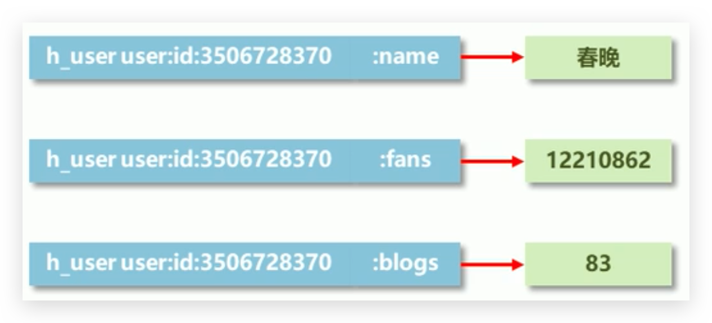
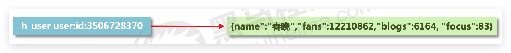

# hash

## string 类型存储困惑

例如新浪微博大V主页显示粉丝数与微博数量。解决如下：

* 在redis中为大V用户设定用户信息，**以用户主键和属性值作为key**，后台设定定时刷新策略即可

  

  缺点就是**太分散了**
* 在redis中**以json格式**存储大V用户信息，定时刷新

  

  缺点就是频繁**更新太麻烦了**
* 可以使用如下类型

  

## hash 介绍

* 新的存储需求：对一系列存储的数据进行编组，方便管理，典型应用存储对象信息
* 需要的存储结构：一个存储空间保存多个键值对数据
* hash 类型：**底层使用哈希表**结构实现数据存储
* hash存储结构优化

  * 如果**field数量较少**，存储结构优化为**类数组**结构
  * 如果**field数量较多**，存储结构使用**HashMap结构**
* **hash类型下的value只能存储字符串！**，不允许存储其他数据类型，不存在嵌套现象。如果数据未获取到， 对应的值为(**nil**)
* 每个 hash 可以存储 23^2 - 1 个键值对
* **hash类型十分贴近对象的数据存储形式**，并且可以**灵活添加删除对象属性**。但hash设计**初衷不是为了存储大量对象而设计**的，切记**不可滥用**，更不可以将hash作为对象列表使用
* **hgetall 操作可以获取全部属性**，如果内部field过多，遍历整体数据效率就很会低，有**可能成为数据访问瓶颈**
* string存储对象（json）与hash存储对象

  * string存储对象，当做整体。**读为主**
  * hash存储对象，**修改为主**。也可以里面存储string


## 🔥HSET 为字段设置值

根据给定的字段是否已经存在于散列中，HSET命令的行为也会有所不同：

* 如果给定字段并不存在于散列当中，那么这次设置就是一次创建操作，命令将在散列里面关联起给定的字段和值，然后返回1。
* 如果给定的字段原本已经存在于散列里面，那么这次设置就是一次更新操作，命令将使用用户给定的新值去覆盖字段原有的旧值，然后返回0。

```bash
hset key field value
```

实例

```bash
127.0.0.1:6379> hset user name conan
(integer) 1
127.0.0.1:6379> hset user age 18
(integer) 1
```

## 🔥HSETNX 只在字段不存在的情况下为它设置值

```bash
hsetnx key field value
```

* 在字段不存在并且成功为它设置值时返回1
* 在字段已经存在并导致设置操作未能成功执行时返回0。

## 🔥HGET

获取数据命令：

```bash
hget key field
```

实例

```bash
127.0.0.1:6379> hget user name
"conan"
```

## 🔥HINCRBY / HINCRBYFLOAT

设置指定字段的**数值数据增加指定范围的值（可负数）**

```bash
hincrby key field increment 
hincrbyfloat key field increment
```

## HSTRLENA 获取字段值的字节长度

## HEXISTS❗️检查字段是否存在

获取哈希表中是否存在指定的字段

```bash
hexists key field
```

尽量不要用，应在业务逻辑层做判断，redis 只做数据的存改

## 🔥HDEL/DEL 删除字段/键

删除数据字段、key命令：

```bash
hdel key field1 [field2]
del key
```

实例

```bash
127.0.0.1:6379> hdel user name
(integer) 1

127.0.0.1:6379> hdel user name age
(integer) 1 --上面已经删了 name 所以这次只删了一个

127.0.0.1:6379> hgetall user
(empty array)

127.0.0.1:6379> hget user name
(nil)


-- 假设已经添加了值
127.0.0.1:6379> del user
(integer) 1

127.0.0.1:6379> hgetall user
(empty array)
```

## 🔥HLEN 获取散列包含的字段数量

用户可以通过使用HLEN命令获取给定散列包含的**字段数量**：

```bash
HLEN key
```

## HMSET 一次为多个字段设置值

添加/修改多个数据。有则改，没则加

```bash
hmset key field1 value1 field2 value2 ...
```

HMSET命令在设置成功时返回OK

## HMGET 一次获取多个字段的值

获取多个数据

```bash
hmget key field1 field2 ...
```

## 🔥HKEYS、HVALS、HGETALL 获取所有字段、所有值、所有字段和值

注意，是无序的，不应有侥幸心里

```bash
hkeys key 
hvals key
HGETALL KEY
```

实例

```bash
127.0.0.1:6379> hmset user name conan age 18
OK

127.0.0.1:6379> hkeys user
1) "name"
2) "age"

127.0.0.1:6379> hvals user
1) "conan"
2) "18"

127.0.0.1:6379> hgetall user
1) "name"
2) "conan"
3) "age"
4) "18"
```

## ====================

## 🔥【比较】string vs hash

### hash 优点

* **散列的最大优势，就是它只需要在数据库里面创建一个键，就可以把任意多的字段和值存储到散列里面**。相反，因为每个字符串键只能存储一个键值对，所以如果用户要使用字符串键去存储多个数据项，就只能在数据库中创建多个字符串键。

  数据库键数量增多带来的问题主要和资源有关：

  * 为了对数据库以及数据库键的使用情况进行统计，Redis会为每个数据库键存储一些额外的信息，并因此带来一些额外的内存消耗。对于单个数据库键来说，这些额外的内存消耗几乎可以忽略不计，但是当数据库键的数量达到上百万、上千万甚至更多的时候，这些额外的内存消耗就会变得比较可观。
  * 当散列包含的字段数量比较少的时候，Redis就会使用特殊的内存优化结构去存储散列中的字段和值。与字符串键相比，这种内存优化结构存储相同数据所需要的内存要少得多。使用内存优化结构的散列越多，内存优化结构的效果也就越明显。在一定条件下，对于相同的数据，使用散列键进行存储比使用字符串键存储要节约一半以上的内存，有时候甚至会更多。
  * 除了需要耗费更多内存之外，更多的数据库键也需要占用更多的CPU。每当Redis需要对数据库中的键进行处理时，数据库包含的键越多，进行处理所需的CPU资源就会越多，处理所耗费的时间也会越长，典型的情况包括：

    * 统计数据库和数据库键的使用情况。
    * 对数据库执行持久化操作，或者根据持久化文件还原数据库。
    * 通过模式匹配在数据库中查找某个键，或者执行类似的查找操作

  这些操作的执行时间都会受到数据库键数量的影响。
* 除了资源方面的优势之外，散列键还可以**有效地组织起相关的多项数据，让程序产生更容易理解的数据**，使得针对数据的批量操作变得更方便。

### string 优点

* 虽然散列键命令和字符串键命令在部分功能上有重合的地方，但是**字符串键命令提供的操作比散列键命令更为丰富**。比如，字符串能够使用SETRANGE命令和GETRANGE命令设置或者读取字符串值的其中一部分，或者使用APPEND命令将新内容追加到字符串值的末尾，而散列键并不支持这些操作。
* **Redis的键过期功能**，这一功能可以在指定时间到达时，自动删除指定的键。因为**键过期功能针对的是整个键**，用户**无法为散列中的不同字段设置不同的过期时间**，所以当一个散列键过期的时候，它包含的所有字段和值都将被删除。与此相反，如果用户使用字符串键存储信息项，就不会遇到这样的问题——用户可以为每个字符串键分别设置不同的过期时间，让它们根据实际的需要自动被删除。

### 字符串键和散列键的选择


* 如果程序需要为每个数据项**单独设置过期时间**，那么使用**字符串**键。
* 如果程序需要对数据项执行诸如**SETRANGE、GETRANGE或者APPEND等操**作，那么**优先考虑使用字符串键**。当然，用户也可以选择把数据存储在散列中，然后将类似SETRANGE、GETRANGE这样的操作交给客户端执行。
* 如果程序需要**存储的数据项比较多**，并且希望尽可能地**减少存储数据所需的内存**，就应优先考虑使用**散列键**。
* 如果**多个数据项在逻辑上属于同一组或者同一类**，那么应该**优先考虑使用散列键**。

## 🔥【场景】使用散列键重新实现计数器

略

## 🔥【场景】实现短网址生成程序

创建短网址本质上就是要创建出短网址ID与目标网址之间的映射，并在用户访问短网址时，根据短网址的ID从映射记录中找出与之相对应的目标网址。比如微博的短网址程序就将短网址http://t.cn/RqRRZ8n中的ID值RqRRZ8n映射到了http://redisdoc.com/geo/index.html这个网址上面，当用户访问短网址http://t.cn/RqRRZ8n时，程序就会根据这个短网址的ID值RqRRZ8n找出与之对应的目标网址http://redisdoc.com/geo/index.html，并将用户引导至目标网址上面去

因为Redis的散列非常适合用来存储短网址ID与目标网址之间的映射，所以我们可以基于Redis的散列实现

## 🔥【场景】实现用户登录会话

为了方便用户，网站一般都会为已登录的用户生成一个加密令牌，然后把这个令牌分别存储在服务器端和客户端，之后每当用户再次访问该网站的时候，网站就可以通过验证客户端提交的令牌来确认用户的身份，从而使得用户不必重复地执行登录操作。

另外，为了防止用户因为长时间不输入密码而遗忘密码，以及为了保证令牌的安全性，网站一般都会为令牌设置一个过期期限（比如一个月），当期限到达之后，用户的会话就会过时，而网站则会要求用户重新登录。

上面描述的这种使用令牌来避免重复登录的机制一般称为登录会话（login session），通过使用Redis的散列

## 🔥【场景】存储图数据

在构建地图应用、设计电路图、进行任务调度、分析网络流量等多种任务中，都需要对图（graph）数据结构实施建模，并存储相关的图数据。对于不少数据库来说，想要高效、直观地存储图数据并不是一件容易的事情，但是Redis却能够以多种不同的方式表示图数据结构，其中一种方式就是使用散列。

例如，假设我们想要存储图3-20所示的带权重有向图，那么可以创建一个图3-21所示的散列键，这个散列键会以start_vertex->end_vertex的形式将各个顶点之间的边存储到散列的字段中，并将字段的值设置成边的权重。通过这种方法，我们可以将图的相关数据全部存储到散列中

适合用来存储节点较多但边较少的稀疏图（sparsegraph）


## 🔥【场景】使用散列键重新实现文章存储程序

略

## 🔥【场景】电商网站购物车设计与实现

### 业务分析

* 仅分析购物车的redis存储模型

  * 添加、浏览、更改数量、删除、清空
* 购物车于数据库间持久化同步(不讨论)
* 购物车于订单间关系(不讨论)

  * 提交购物车:读取数据生成订单
  * 商家临时价格调整:隶属于订单级别
* 未登录用户购物车信息存储(不讨论)

  * cookie存储
  * 手机端使用 localstorage？


### 解决方案

* 以客户id作为key，每位客户创建一个hash存储结构存储对应的购物车信息
* 将商品编号作为field，购买数量作为value进行存储
* 添加商品:追加全新的field与value
* 浏览:遍历hash
* 更改数量:自增/自减，设置value值
* 删除商品:删除field
* 清空:删除key

### 当前设计是否加速了购物车的呈现

当前仅仅是将数据存储到了redis中，并没有起到加速的作用，商品信息还需要二次查询数据库

* 每条购物车中的商品记录保存成两条field
* field1专用于保存**购买数量**

  * 命名格式：商品id:nums
  * 保存数据：数值
* field2专用于保存购物车中显示的**信息**，包含文字描述，图片地址，所属商家信息等

  * 命名格式：商品id:info
  * 保存数据：**json**

## 🔥【场景】限量抢购

### 业务分析

双11活动日，销售手机充值卡的商家对移动、联通、电信的30元、50元、100元商品推出抢购活动，每种商品抢购上限1000张

### 解决方案

* 以商家id作为key
* 将参与抢购的商品id（三大运营商之类的）作为field
* 将参与抢购的商品数量作为对应的value
* 抢购时使用**降值**的方式控制产品数量
* 实际业务中还有超卖等实际问题，这里不做讨论