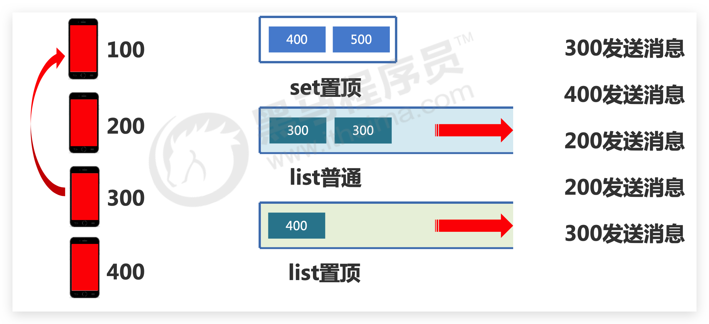

# list

## 介绍

- 数据存储需求：存储多个数据，并对数据进入存储空间的**顺序**进行区分
- 需要的存储结构：一个存储空间保存多个数据，且通过数据可以体现**进入顺序**
- list 类型：保存多个数据，底层使用**双向链表**存储结构实现
- list 中保存的**数据都是 string 类型**的，数据总容量是有限的，最多 232 - 1 个元素 (4294967295)。
- list 具有**索引**的概念（lrem），但是操作数据时**通常以队列的形式进行入队出队操作**，或**以栈的形式进行入栈出栈操作**

  获取全部数据操作**结束索引设置为-1**

## 🔥LPUSH / RPUSH

添加/修改数据，返回 list 长度

```
lpush key value1 [value2] ......
rpush key value1 [value2] ......
```

示例

```
127.0.0.1:6379> lpush list1 a b
(integer) 2
127.0.0.1:6379> lpush list1 c
(integer) 3
```

## LPUSHX / RPUSHX 只对已存在的列表执行推入操作

当用户调用LPUSH命令或RPUSH命令尝试将元素推入列表的时候，如果给定的列表并不存在，那么命令将自动创建一个空列表，并将元素推入刚刚创建的列表中。

而LPUSHX / RPUSHX则相反！且**每次只能推入单个元素**

## 🔥LPOP / RPOP

**移除并返回数据**

```
lpop key
rpop key
```

示例

```bash
127.0.0.1:6379> lpush list2 a b c
(integer) 3
127.0.0.1:6379> lrange list2 0 -1
1) "c"
2) "b"
3) "a"
127.0.0.1:6379> lpop list2
"c"
127.0.0.1:6379> lpop list2
"b"
127.0.0.1:6379> lpop list2
"a"
127.0.0.1:6379> lpop list2
(nil)
```

## 🔥RPOPLPUSH 将右端弹出的元素推入左端

```bash
RPOPLPUSH sourceList targetList
```

* RPOPLPUSH命令会返回被弹出的元素作为结果。
* RPOPLPUSH命令允许用户将源列表和目标列表设置为**同一个列表**，在这种情况下，RPOPLPUSH命令的效果相当于将列表最右端的元素变成列表最左端的元素。
* 如果用户传给RPOPLPUSH命令的源列表并不存在，那么RPOPLPUSH命令将放弃执行弹出和推入操作，只返回一个空值nil表示命令执行失败

## BLPOP / BRPOP / BRPOPLPUSH 阻塞版

**规定时间内有则直接获取并移除数据，否则等 timeout**后停止等待

```
blpop key1 [key ...] timeout
brpop key1 [key ...] timeout
brpoplpush source destination timeout -- 待办
```

## 🔥LRANGE / LINDEX / LLEN

获取数据

LINDEX处理超出范围的索引（对于一个长度为N的非空列表来说）：

* 它的正数索引必然大于等于0，并且小于等于N-1。
* 它的负数索引必然小于等于-1，并且大于等于-N。

  如果用户给定的索引超出了这一范围，那么LINDEX命令将返回空值，以此来表示给定索引上并不存在任何元素

LRANGE命令也需要处理超出范围的索引：

* 如果用户给定的起始索引和结束索引都超出了范围，那么LRANGE命令将返回空列表作为结果。
* 如果用户给定的其中一个索引超出了范围，那么LRANGE命令将对超出范围的索引进行修正，然后再执行实际的范围获取操作；其中超出范围的起始索引会被修正为0，而超出范围的结束索引则会被修正为-1

```bash
lrange key start stop -- [左闭右闭]，start为0，stop为-1时查询全部。-1 0 则是 empty。0 -2 则是0~倒数第2个
lindex key index
llen key
```

示例

```bash
127.0.0.1:6379> lrange list1 0 -1
1) "c"
2) "b"
3) "a"

127.0.0.1:6379> lrange list1 -1 0
(empty array)

127.0.0.1:6379> lrange list1 0 -2
1) "c"
2) "b"
```

```bash
127.0.0.1:6379> lindex list1 0
"c"
127.0.0.1:6379> lindex list1 1
"b"
127.0.0.1:6379> lindex list1 2
"a"
127.0.0.1:6379> lindex list1 3
(nil)
```

```bash
127.0.0.1:6379> llen list1
(integer) 3
```

## LSET 为指定索引设置新元素

```bash
LSET list index new_element
```

* LSET命令在设置成功时将返回OK
* 因为LSET命令只能对列表中已存在的索引进行设置，所以如果用户给定的索引超出了列表的有效索引范围，那么LSET命令将返回一个错误

## LINSERT 将元素插入列表

通过使用LINSERT命令，用户可以将一个新元素插入列表某个指定元素的前面或者后面

```bash
LINSERT list BEFORE | AFTER target_element new_element
```

LINSERT命令第二个参数的值可以是BEFORE或者AFTER，它们分别用于指示命令将新元素插入目标元素的**前面或者后面（这里是指LRANGE从左到右为先后顺序）**。命令在完成插入操作之后会返回列表当前的长度。

## LTRIM 修剪列表

LTRIM命令接受一个列表和一个索引范围作为参数，并移除列表中位于给定**索引范围之外**的所有元素，只保留给定范围之内（**左闭右闭**）的元素：

```bash
LTRIM list start end
```

## LREM 删除任意数据

移除指定数据

```
lrem key count value
```

count参数的值决定了LREM命令移除元素的方式：

* 如果count参数的值等于0，那么LREM命令将移除列表中包含的所有指定元素。
* 如果count参数的值大于0，那么LREM命令将从列表的左端开始向右进行检查，并移除最先发现的count个指定元素。
* 如果count参数的值小于0，那么LREM命令将从列表的右端开始向左进行检查，并移除最先发现的abs(count)个指定元素（abs(count)即count的绝对值）。

示例

```bash
127.0.0.1:6379> rpush 001 a b c d e
(integer) 5

127.0.0.1:6379> lrange 001 0 -1
1) "a"
2) "b"
3) "c"
4) "d"
5) "e"

127.0.0.1:6379> lrem 001 1 c
(integer) 1

127.0.0.1:6379> lrange 001 0 -1
1) "a"
2) "b"
3) "d"
4) "e"


127.0.0.1:6379> rpush 001 a b c a a c a
(integer) 11

127.0.0.1:6379> lrange 001 0 -1
 1) "a"
 2) "b"
 3) "d"
 4) "e"
 5) "a"
 6) "b"
 7) "c"
 8) "a"
 9) "a"
10) "c"
11) "a"

127.0.0.1:6379> lrem 001 10 a
(integer) 5

127.0.0.1:6379> lrange 001 0 -1
1) "b"
2) "d"
3) "e"
4) "b"
5) "c"
6) "c"
```

## ====================

## 🔥【场景】先进先出队列

先进先出队列的应用非常广泛，各式各样的应用程序中都有使用。举个例子，很多电商网站都会在节日时推出一些秒杀活动，这些活动会放出数量有限的商品供用户抢购，秒杀系统的一个特点就是在短时间内会有大量用户同时进行相同的购买操作，如果使用事务或者锁去实现秒杀程序，那么就会因为锁和事务的重试特性而导致性能低下，并且由于重试行为的存在，成功购买商品的用户可能并不是最早执行购买操作的用户，因此这种秒杀系统实际上是不公平的。

解决上述问题的方法之一就是把用户的购买操作都放入先进先出队列里面，然后以队列方式处理用户的购买操作，这样程序就可以在不使用锁或者事务的情况下实现秒杀系统，并且得益于先进先出队列的特性，这种秒杀系统可以按照用户执行购买操作的顺序来判断哪些用户可以成功执行购买操作，因此它是公平的。

## 🔥【场景】分页

将给定的元素有序地放入一个列表中，然后使用`LRANGE`命令从列表中取出指定数量的元素，从而实现分页这一概念

但是通常**第一页的信息来自于 list**，**第 2 页及更多的信息通过数据库的形式加载**

## 🔥【场景】带有阻塞功能的消息队列

在构建应用程序的时候，有时会遇到一些非常耗时的操作，比如发送邮件，将一条新微博同步给上百万个用户，对硬盘进行大量读写，执行庞大的计算等。因为这些操作非常耗时，所以如果我们直接在响应用户请求的过程中执行它们，那么用户就需要等待非常长时间。

例如，为了验证用户身份的有效性，有些网站在注册新用户的时候，会向用户给定的邮件地址发送一封激活邮件，用户只有在点击了验证邮件里面的激活链接之后，新注册的账号才能够正常使用。

## 🔥【场景】朋友圈点赞顺序列表


操作参考 lrem

## 🔥【场景】微博关注列表

twitter、新浪微博、腾讯微博中个人用户的关注列表需要按照用户的关注顺序进行展示，粉丝列表需要将**最近关注的粉丝在前面**

`lpush` `lrange`

## 🔥【场景】最新的新闻或资讯

新闻、资讯类网站如何将最新的新闻或资讯按照发生的时间顺序展示?

`lpush` `lrange`

## 🔥【场景】日志消息队列

企业运营过程中，分布式系统将产生出大量的运营数据，如何**保障多台服务器操作日志的统一顺序输出**

`lpush` `lrange`，但是实际不是使用 ELK 技术栈吗？


## 🔥【场景】微信消息排序

**业务场景**

使用微信的过程中，当微信接收消息后，会默认将最近接收的消息置顶，当多个好友及关注的订阅号同时发 送消息时，该排序会不停的进行交替。同时还可以将重要的会话设置为置顶。一旦用户离线后，再次打开微 信时，消息该按照什么样的顺序显示?

**业务分析**



**解决方案**

* 依赖list的数据具有顺序的特征对消息进行管理，将list结构作为栈使用
* 对置顶与普通会话分别创建独立的list分别管理
* 当某个list中接收到用户消息后，将消息发送方的id从list的一侧加入list(此处设定左侧)
* 多个相同id发出的消息反复入栈会出现问题，在入栈之前无论是否具有当前id对应的消息，先删除对应id
* 推送消息时先推送置顶会话list，再推送普通会话list，推送完成的list清除所有数据
* **消息的数量，也就是微信用户对话数量采用计数器的思想另行记录，伴随list操作同步更新**

使用 sorted_set 也可以解决，score 按照时间戳设置即可