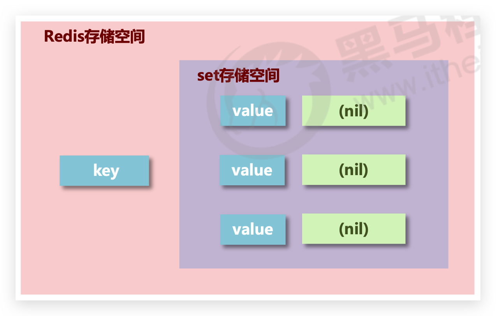

# set—大量数据

## 介绍

*   新的存储需求：存储**大量**的数据，在**查询方面提供更高的效率（list由于双向链表结构，查询慢）**
*   需要的存储结构：能够保存大量的数据，高效的内部存储机制，便于查询
*   **set类型与hash存储结构完全相同**，**仅存储键**，不存储值(**nil**)，键即为值，并且值是**不允许重复**的




## 增删改查

### sadd

添加数据

```bash
sadd key member1 [member2 ...]
```

示例

```bash
127.0.0.1:6379> sadd users a b
(integer) 2

127.0.0.1:6379> sadd users c
(integer) 1
```


### smembers

获取全部数据

```bash
smembers key
```

示例

```bash
127.0.0.1:6379> smembers users
1) "c"
2) "b"
3) "a"
```


### srem

删除数据

```bash
srem key member1 [member2 ...]
```

示例

```bash
127.0.0.1:6379> srem users b
(integer) 1

127.0.0.1:6379> smembers users
1) "c"
2) "a"
```


### scard

获取集合数据**总量**

```bash
scard key
```

实例

```bash
127.0.0.1:6379> scard users
(integer) 2
```


## 逻辑判断—不推荐

### sismember

判断集合中是否包含指定数据

```bash
sismember key member
```

示例

```bash
127.0.0.1:6379> sismember users a
(integer) 1
127.0.0.1:6379> sismember users b
(integer) 0
127.0.0.1:6379> sismember users c
(integer) 1
```

1 为 true，0 为 false


## 随机抽取 🔥

### srandmember 🔥

随机**获取**集合中指定数量的数据

```bash
srandmember key [count]
```

示例

```bash
127.0.0.1:6379> sadd news n1 n2 n3 n4 n5
(integer) 5

127.0.0.1:6379> srandmember news 3
1) "n4"
2) "n1"
3) "n2"

127.0.0.1:6379> srandmember news 10
1) "n4"
2) "n3"
3) "n1"
4) "n2"
5) "n5"
```


### spop

随机获取集合中的某个数据并将该数据**移出**集合

```bash
spop key [count]
```

示例

```bash
127.0.0.1:6379> sadd news n1 n2 n3 n4 n5
(integer) 5

127.0.0.1:6379> spop news 3
1) "n1"
2) "n4"
3) "n2"

127.0.0.1:6379> smembers news
1) "n3"
2) "n5"
```


### 【场景】随机固定数量推荐

#### 业务场景

每位用户首次使用今日头条时会设置3项爱好的内容，但是后期为了增加用户的活跃度、兴趣点，必须让用户 对其他信息类别逐渐产生兴趣，增加客户留存度，如何实现?


#### 业务分析

*   系统分析出各个分类的最新或最热点信息条目并组织成set集合
*   随机挑选其中部分信息
*   配合用户关注信息分类中的热点信息组织成展示的全信息集合


#### 总结

redis 应用于随机推荐类信息检索，例如热点歌单推荐，热点新闻推荐，热卖旅游线路，应用APP推荐，大V推荐等

使用`srandmember` 或`spop`实现


## 集合运算 🔥

### sinter / sunion / sdiff —交并差 🔥

求多个集合的交、并、差集

```
sinter key1 [key2 ...] 
sunion key1 [key2 ...] 
sdiff key1 [key2 ...]
```

示例

```bash
127.0.0.1:6379> sadd u1 u3 u4 u5 u6 u7
(integer) 5

127.0.0.1:6379> sadd u2 u5 u7 u9
(integer) 3

127.0.0.1:6379> sinter u1 u2
1) "u7"
2) "u5"

127.0.0.1:6379> sunion u1 u2
1) "u3"
2) "u4"
3) "u7"
4) "u6"
5) "u5"
6) "u9"

127.0.0.1:6379> sdiff u1 u2
1) "u4"
2) "u3"
3) "u6"
127.0.0.1:6379> sdiff u2 u1
1) "u9"
```


### sinterstore / sunionstore / sdiffstore —交并差并存储 🔥

求多个集合的交、并、差集并存储到指定集合中

```bash
sinterstore destination key1 [key2 ...] 
sunionstore destination key1 [key2 ...] 
sdiffstore destination key1 [key2 ...]
```

示例略


### smove 移动 🔥

将指定数据从原始集合中**移动（移动完原始集合就没有了）**到目标集合中

```bash
smove source destination member
```

示例

```bash
127.0.0.1:6379> smove u1 u2 u3
(integer) 1
```


### 【场景】共同好友、关联搜索

#### 业务场景

脉脉为了促进用户间的交流，保障业务成单率的提升，需要让每位用户拥有大量的好友，事实上职场新人不 具有更多的职场好友，如何快速为用户积累更多的好友?

新浪微博为了增加用户热度，提高用户留存性，需要微博用户在关注更多的人，以此获得更多的信息或热门 话题，如何提高用户关注他人的总量?

QQ新用户入网年龄越来越低，这些用户的朋友圈交际圈非常小，往往集中在一所学校甚至一个班级中，如何 帮助用户快速积累好友用户带来更多的活跃度?

微信公众号是微信信息流通的渠道之一，增加用户关注的公众号成为提高用户活跃度的一种方式，如何帮助 用户积累更多关注的公众号?

美团外卖为了提升成单量，必须帮助用户挖掘美食需求，如何推荐给用户最适合自己的美食?


#### 解决方案

使用 set 的交并差运算


#### 总结 🔥

*   redis 应用于同类信息的关联搜索，二度关联搜索，深度关联搜索
*   显示共同关注(一度)
*   显示共同好友(一度)
*   由用户A出发，获取到好友用户B的好友信息列表(一度)
*   由用户A出发，获取到好友用户B的购物清单列表(二度)
*   由用户A出发，获取到好友用户B的游戏充值列表(二度)


## 注意事项

*   set 类型**不允许数据重复**，如果添加的数据在 set 中已经存在，将**只保留一份**
*   set 虽然与hash的存储结构相同，但是**无法启用hash中存储值的空间**


## 【场景】权限排重—示例

集团公司共具有12000名员工，内部OA系统中具有700多个角色，3000多个业务操作，23000多种数据，每 位员工具有一个或多个角色，如何快速进行业务操作的权限校验?

利用 set 不允许存储相同值，来合并权限 set。当然这是示例，一般会用框架，至于是否在 redis 中实现不确定！


## 【场景】网站访问量—去重

### 业务场景

公司对旗下新的网站做推广，统计网站的PV(访问量),UV(独立访客),IP(独立IP)。 

*   PV：网站被访问次数，可通过刷新页面提高访问量 
*   UV：网站被不同用户访问的次数，可通过cookie统计访问量，相同用户切换IP地址，UV不变 
*   IP：网站被不同IP地址访问的总次数，可通过IP地址统计访问量，相同IP不同用户访问，IP不变


### 解决方案

*   利用set集合的数据去重特征，记录各种访问数据
*   建立string类型数据，利用incr统计日访问量(PV) 
*   建立set模型，记录不同cookie数量(UV)，重复的存储不进来，最终计算数量即可
*   建立set模型，记录不同IP数量(IP)，重复的存储不进来，最终计算数量即可


## 【场景】网站黑、白名单

### 业务场景—黑名单

资讯类信息类网站追求高访问量，但是由于其信息的价值，往往容易被不法分子利用，通过爬虫技术，快速获取信息，个别特种行业网站信息通过爬虫获取分析后，可以转换成商业机密进行出售。例如第三方火 车票、机票、酒店刷票代购软件，电商刷评论、刷好评。

同时爬虫带来的伪流量也会给经营者带来错觉，产生错误的决策，有效避免网站被爬虫反复爬取成为每个网站都要考虑的基本问题。在基于技术层面区分出爬虫用户后，需要将此类用户进行有效的**屏蔽**，这就是**黑名单**的典型应用。

PS：不是说爬虫一定做摧毁性的工作，有些小型网站需要爬虫为其带来一些流量。


### 业务场景—白名单

对于安全性更高的应用访问，仅仅靠黑名单是不能解决安全问题的，此时需要设定可访问的用户群体，依赖白名单做更为苛刻的访问验证。


### 解决方案

*   基于经营战略设定问题用户发现、鉴别规则
*   周期性更新满足规则的用户黑名单，加入set集合
*   用户行为信息达到后与黑名单进行比对，确认行为去向
*   黑名单过滤IP地址：应用于开放游客访问权限的信息源
*   黑名单过滤设备信息：应用于限定访问设备的信息源
*   黑名单过滤用户：应用于基于访问权限的信息源


