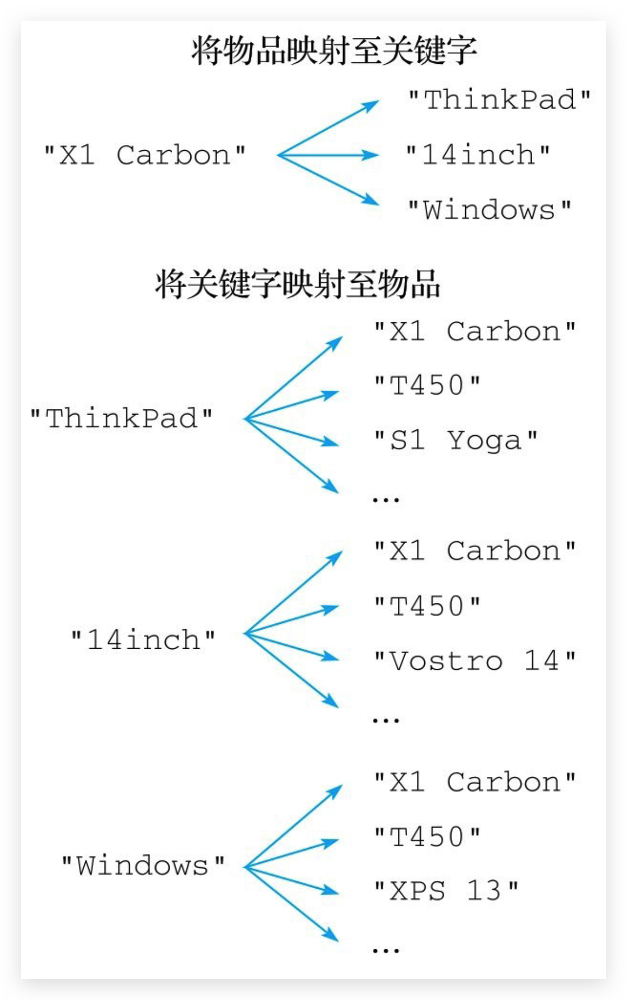

# set—大量数据

## 介绍

介绍

* 新的存储需求：存储**大量**的数据，在**查询方面提供更高的效率（list由于双向链表结构，查询慢）**
* **set类型与hash存储结构完全相同**，**仅存储键**，不存储值(**nil**)，键即为值，并且值是**不允许重复**的，如果添加的数据在 set 中已经存在，将**只保留一份**
* set 虽然与hash的存储结构相同，但是**无法启用hash中存储值的空间**

list 和 set 区别：

* 列表可以存储**重复元素**，而集合只会存储**非重复元素**，尝试将一个已存在的元素添加到集合将被忽略。
* 列表以**有序**方式存储元素，而集合则以**无序**方式存储元素。

这两个区别带来的差异主要跟命令的复杂度有关：

* 在执行像LINSERT和LREM这样的列表命令时，即使命令只针对单个列表元素，程序有时也不得不遍历整个列表以确定指定的元素是否存在，因此这些命令的**复杂度都为O(N)**。
* 对于集合来说，因为所有针对单个元素的集合命令都不需要遍历整个集合，所以**复杂度都为O(1)**。


## 🔥SADD 将元素添加到集合

添加数据

```bash
sadd key member1 [member2 ...]
```

返回成功添加的新元素数量作为返回值

示例

```bash
127.0.0.1:6379> sadd users a b
(integer) 2

127.0.0.1:6379> sadd users c
(integer) 1

127.0.0.1:6379> sadd users c
(integer) 0 -- 忽略重复元素
```

## 🔥SREM 从集合中移除元素

```bash
srem key member1 [member2 ...]
```

返回被移除的元素数量。如果用户给定的元素并不存在于集合当中，那么SREM命令将忽略不存在的元素，只移除那些确实存在的元素。

示例

```bash
127.0.0.1:6379> srem users b
(integer) 1

127.0.0.1:6379> smembers users
1) "c"
2) "a"
```

## 🔥SMOVE 将元素从一个集合移动到另一个集合

将指定数据从原始集合中**移动（移动完原始集合就没有了）**到目标集合中

```bash
smove source destination member
```

如果用户想要移动的元素并不存在于源集合，那么SMOVE将放弃执行移动操作，并返回0表示移动操作执行失败。

即使用户想要移动的元素已经存在于目标集合，SMOVE命令仍然会将指定的元素从源集合移动到目标集合，并覆盖目标集合中的相同元素。从结果来看，这种移动不会改变目标集合包含的元素，只会导致被移动的元素从源集合中消失。

示例

```bash
127.0.0.1:6379> smove s1 s2 e1
(integer) 1
```

## 🔥SMEMBERS 获取集合包含的所有元素

```bash
smembers key
```

注意返回的元素是无序排列的

示例

```bash
127.0.0.1:6379> smembers users
1) "c"
2) "b"
3) "a"
```

## 🔥 SCARD 获取集合包含的元素数量

```bash
scard key
```

实例

```bash
127.0.0.1:6379> scard users
(integer) 2
```

## SISMEMBER❗️检查给定元素是否存在于集合

不推荐使用逻辑运算，应该在业务代码中判断

```bash
sismember key member
```

示例

```bash
127.0.0.1:6379> sismember users a
(integer) 1
127.0.0.1:6379> sismember users b
(integer) 0
127.0.0.1:6379> sismember users c
(integer) 1
```

1 为 true，0 为 false

## 🔥SRANDMEMBER 随机获取集合中指定数量的元素

```bash
srandmember key [count]
```

* SRANDMEMBER命令接受一个可选的count参数，用于指定用户想要获取的元素数量，如果用户没有给定这个参数，那么SRANDMEMBER命令默认只获取一个元素
* 如果count参数的值为正数，那么SRANDMEMBER命令将返回count个**不重复**的元素

  当count参数的值大于集合包含的元素数量时，SRANDMEMBER命令将返回集合包含的**所有元素**
* 如果count参数的值为负数，那么SRANDMEMBER命令将随机返回abs(count)个元素（abs(count)也即是count的绝对值），并且在这些元素当中**允许出现重复**的元素

  因为count参数为负数的SRANDMEMBER命令**允许返回重复元素**，所以即使abs(count)的值大于集合包含的元素数量，SRANDMEMBER命令也会按照要求**返回abs(count)个元素，可能会超过总数哦**

示例

```bash
127.0.0.1:6379> sadd news n1 n2 n3 n4 n5
(integer) 5

127.0.0.1:6379> srandmember news 3
1) "n4"
2) "n1"
3) "n2"

127.0.0.1:6379> srandmember news 10
1) "n4"
2) "n3"
3) "n1"
4) "n2"
5) "n5"
```

## 🔥SPOP 随机地从集合中移除指定数量的元素

```bash
spop key [count]
```

count参数，用于指定需要被移除的元素数量。如果用户没有给定这个参数，那么SPOP命令默认只移除一个元素

示例

```bash
127.0.0.1:6379> sadd news n1 n2 n3 n4 n5
(integer) 5

127.0.0.1:6379> spop news 3
1) "n1"
2) "n4"
3) "n2"

127.0.0.1:6379> smembers news
1) "n3"
2) "n5"
```

## SINTER / SUNION / SDIFF 交并差

求多个集合的交、并、差集

```
sinter key1 [key2 ...] 
sunion key1 [key2 ...] 
sdiff key1 [key2 ...]
```

示例

```bash
127.0.0.1:6379> sadd u1 u3 u4 u5 u6 u7
(integer) 5

127.0.0.1:6379> sadd u2 u5 u7 u9
(integer) 3

127.0.0.1:6379> sinter u1 u2
1) "u7"
2) "u5"

127.0.0.1:6379> sunion u1 u2
1) "u3"
2) "u4"
3) "u7"
4) "u6"
5) "u5"
6) "u9"

127.0.0.1:6379> sdiff u1 u2
1) "u4"
2) "u3"
3) "u6"
127.0.0.1:6379> sdiff u2 u1
1) "u9"
```

## 🔥SINTERSTORE / SUNIONSTORE / SDIFFSTORE 交并差并存储

求多个集合的交、并、差集并存储到指定集合中

```bash
sinterstore destination_key key1 [key2 ...] 
sunionstore destination_key key1 [key2 ...] 
sdiffstore destination_key key1 [key2 ...]
```

示例略

::: tip

因为对集合执行交集、并集、差集等集合计算需要耗费大量的资源，所以用户**应该尽量使用SINTERSTORE等命令**来存储并重用计算结果，而不要每次都重复进行计算。

此外，当集合计算涉及的元素数量非常大时，Redis服务器在进行计算时可能会被阻塞。这时，我们可以**考虑使用Redis的复制功能**，通过**从服务器**来执行集合计算任务，从而**确保主服务器可以继续处理其他客户端发送的命令请求**。

:::

## ====================

## 🔥【场景】唯一计数器—网站访问量去重

公司对旗下新的网站做推广，统计网站的PV(访问量),UV(独立访客),IP(独立IP)。

* PV：网站被访问次数，可通过刷新页面提高访问量
* UV：网站被不同用户访问的次数，可通过cookie统计访问量，相同用户切换IP地址，UV不变
* IP：网站被不同IP地址访问的总次数，可通过IP地址统计访问量，相同IP不同用户访问，IP不变

解决方案

* 利用set集合的数据去重特征，记录各种访问数据
* 建立string类型数据，利用incr统计日访问量(PV)
* 建立set模型，记录不同cookie数量(UV)，重复的存储不进来，最终计算数量即可
* 建立set模型，记录不同IP数量(IP)，重复的存储不进来，最终计算数量即可

## 🔥【场景】打标签

为了对网站上的内容进行分类标识，很多网站都提供了打标签（tagging）功能。

比如论坛可能会允许用户为帖子添加标签，这些标签既可以对帖子进行归类，又可以让其他用户快速地了解到帖子要讲述的内容。

再比如，一个图书分类网站可能会允许用户为自己收藏的每一本书添加标签，使得用户可以快速地找到被添加了某个标签的所有图书，并且网站还可以根据用户的这些标签进行数据分析，从而帮助用户找到他们可能感兴趣的图书。

除此之外，购物网站也可以为自己的商品加上标签，比如“新上架”“热销中”“原装进口”等，方便顾客了解每件商品的不同特点和属性。类似的例子还有很多。

就是对一个元素的不同标签采用 set 存储而已

## 🔥【场景】点赞

使用集合来存储对内容进行了点赞的用户，从而确保**每个用户只能对同一内容点赞一次**，并通过使用不同的集合命令来实现查看点赞数量、查看所有点赞用户以及取消点赞等功能

## 🔥【场景】投票—点赞的多元化

问答网站、文章推荐网站、论坛这类注重内容质量的网站上通常都会提供投票功能，用户可以通过投票来支持一项内容或者反对一项内容：

* 一项内容获得的支持票数越多，就会被网站安排到越明显的位置，使得网站的用户可以更快速地浏览到高质量的内容。
* 与此相反，一项内容获得的反对票数越多，它就会被网站安排到越不明显的位置，甚至被当作广告或者无用内容隐藏起来，使得用户可以忽略这些低质量的内容。

对于**每一项需要投票的内容**，这个程序都会使用**两个集合**来分别存储投**支持票的用户**以及投**反对票的用户**，然后通过对这两个集合执行命令来实现投票、取消投票、统计投票数量、获取已投票用户名单等功能。

## 🔥【场景】社交关系

微博、Twitter以及类似的社交网站都允许用户通过加关注或者加好友的方式，构建一种社交关系。这些网站上的每个用户都可以关注其他用户，也可以被其他用户关注。通过正在关注名单（followinglist），用户可以查看自己正在关注的用户及其人数；通过关注者名单（follower list），用户可以查看有哪些人正在关注自己，以及有多少人正在关注自己。

* 程序为**每个用户维护两个集合**，一个集合存储用户的**正在关注名单**，而另一个集合则存储用户的**关注者名单**。
* 当一个用户（关注者）关注另一个用户（被关注者）的时候，程序会将被关注者添加到关注者的正在关注名单中，并将关注者添加到被关注者的关注者名单里面。
* 当关注者取消对被关注者的关注时，程序会将被关注者从关注者的正在关注名单中移除，并将关注者从被关注者的关注者名单中移除。

## 🔥【场景】抽奖

把所有参与抽奖活动的玩家都添加到一个集合中，然后通**过 SRANDMEMBER 命令随机地选出获奖者**

考虑到保留完整的抽奖者名单可能会有用，所以这个抽奖程序使用了随机获取元素的SRANDMEMBER命令而不是随机移除元素的SPOP命令。在不需要保留完整的抽奖者名单的情况下，我们也可以使用SPOP命令去实现抽奖程序

## 🔥【场景】随机固定数量推荐

#### 业务场景

每位用户首次使用今日头条时会设置3项爱好的内容，但是后期为了增加用户的活跃度、兴趣点，必须让用户 对其他信息类别逐渐产生兴趣，增加客户留存度，如何实现?

#### 业务分析

* 系统分析出各个分类的最新或最热点信息条目并组织成set集合
* 随机挑选其中部分信息
* 配合用户关注信息分类中的热点信息组织成展示的全信息集合

#### 总结

redis 应用于随机推荐类信息检索，例如热点歌单推荐，热点新闻推荐，热卖旅游线路，应用APP推荐，大V推荐等

使用`srandmember` 或`spop`实现

## 🔥【场景】共同好友、关联搜索

### 业务场景

脉脉为了促进用户间的交流，保障业务成单率的提升，需要让每位用户拥有大量的好友，事实上职场新人不 具有更多的职场好友，如何快速为用户积累更多的好友?

新浪微博为了增加用户热度，提高用户留存性，需要微博用户在关注更多的人，以此获得更多的信息或热门 话题，如何提高用户关注他人的总量?

QQ新用户入网年龄越来越低，这些用户的朋友圈交际圈非常小，往往集中在一所学校甚至一个班级中，如何 帮助用户快速积累好友用户带来更多的活跃度?

微信公众号是微信信息流通的渠道之一，增加用户关注的公众号成为提高用户活跃度的一种方式，如何帮助 用户积累更多关注的公众号?

美团外卖为了提升成单量，必须帮助用户挖掘美食需求，如何推荐给用户最适合自己的美食?

### 解决方案

使用 set 的交并差运算

### 总结 🔥

* redis 应用于同类信息的关联搜索，二度关联搜索，深度关联搜索
* 显示共同关注(一度)
* 显示共同好友(一度)
* 由用户A出发，获取到好友用户B的好友信息列表(一度)
* 由用户A出发，获取到好友用户B的购物清单列表(二度)
* 由用户A出发，获取到好友用户B的游戏充值列表(二度)

## 🔥【场景】推荐关注—仅参考

从用户的**正在关注集合中随机选出**指定数量的用户作为种子用户，然后对这些种子用户的**正在关注集合**执行**并集**计算，最后从这个并集中**随机**地选出一些用户作为推荐关注的对象

## 🔥【场景】使用反向索引构建商品筛选器

比如对于笔记本电脑筛选器来说，如果我们单击图中“品牌”一栏的ThinkPad图标，那么筛选器将只在页面中展示ThinkPad品牌的笔记本电脑。如果我们继续单击“尺寸”一栏中的“13.3英寸[插图]”选项，那么筛选器将只在页面中展示ThinkPad品牌13.3英寸的笔记本电脑，诸如此类。

实现商品筛选器的方法之一是使用**反向索引**，这种数据结构可以为**每个物品添加多个关键字**，然后**根据关键字去反向获取相应的物品**。举个例子，对于"X1 Carbon"这台笔记本电脑来说，我们可以为它添加"ThinkPad"、"14inch"、"Windows"等关键字，然后通过这些关键字来反向获取"X1 Carbon"这台笔记本电脑。

实现反向索引的关键是要在物品和关键字之间构建起双向的映射关系，比如对于刚刚提到的"X1Carbon"笔记本电脑来说，反向索引程序需要构建出图所示的两种映射关系：



* 第一种映射关系将"X1 Carbon"映射至它带有的各个关键字。
* 第二种映射关系将"ThinkPad"、"14inch"、"Windows"等多个关键字映射至"X1 Carbon"。

反向索引程序，对于用户给定的**每一件物品**，这个程序都会使用**一个集合去存储物品带有的多个关键字**，与此同时，对于**这件物品的每一个关键字，程序都会使用一个集合去存储关键字与物品之间的映射**。因为构建反向索引所需的这两种映射都是**一对多映射**，所以使用集合来存储这两种映射关系的做法是可行的

## 🔥【场景】权限排重—仅参考

集团公司共具有12000名员工，内部OA系统中具有700多个角色，3000多个业务操作，23000多种数据，每 位员工具有一个或多个角色，如何快速进行业务操作的权限校验?

利用 set 不允许存储相同值，来合并权限 set。当然这是示例，一般会用框架，至于是否在 redis 中实现不确定！

## 🔥【场景】网站黑、白名单

### 业务场景—黑名单

资讯类信息类网站追求高访问量，但是由于其信息的价值，往往容易被不法分子利用，通过爬虫技术，快速获取信息，个别特种行业网站信息通过爬虫获取分析后，可以转换成商业机密进行出售。例如第三方火 车票、机票、酒店刷票代购软件，电商刷评论、刷好评。

同时爬虫带来的伪流量也会给经营者带来错觉，产生错误的决策，有效避免网站被爬虫反复爬取成为每个网站都要考虑的基本问题。在基于技术层面区分出爬虫用户后，需要将此类用户进行有效的**屏蔽**，这就是**黑名单**的典型应用。

PS：不是说爬虫一定做摧毁性的工作，有些小型网站需要爬虫为其带来一些流量。

### 业务场景—白名单

对于安全性更高的应用访问，仅仅靠黑名单是不能解决安全问题的，此时需要设定可访问的用户群体，依赖白名单做更为苛刻的访问验证。

### 解决方案

* 基于经营战略设定问题用户发现、鉴别规则
* 周期性更新满足规则的用户黑名单，加入set集合
* 用户行为信息达到后与黑名单进行比对，确认行为去向
* 黑名单过滤IP地址：应用于开放游客访问权限的信息源
* 黑名单过滤设备信息：应用于限定访问设备的信息源
* 黑名单过滤用户：应用于基于访问权限的信息源