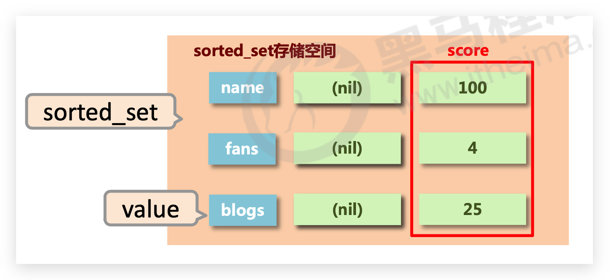
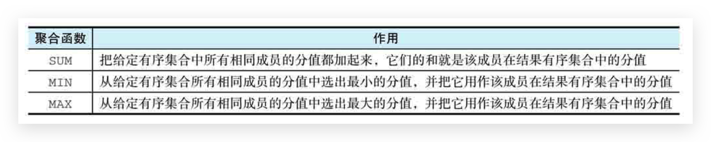
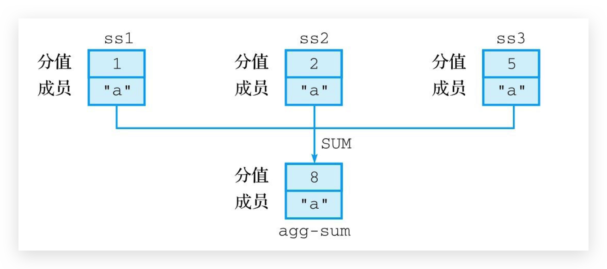
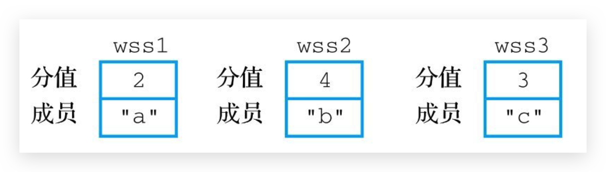
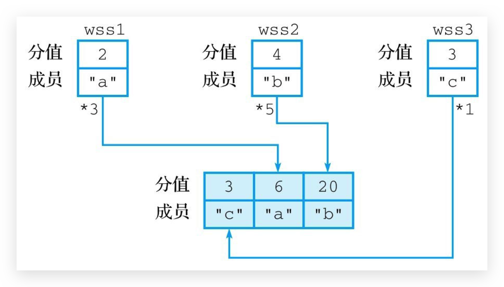
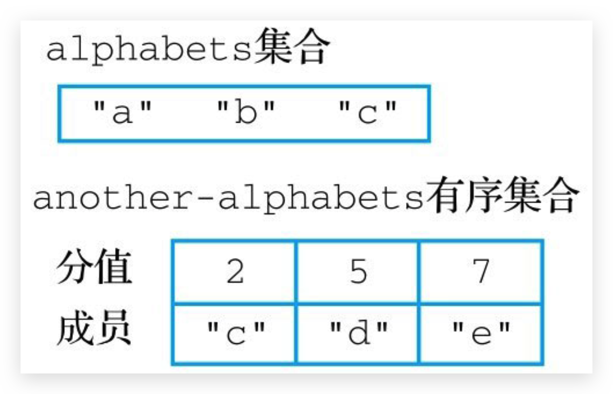
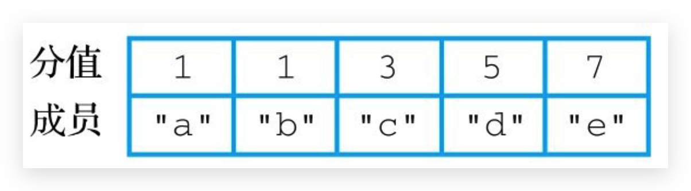
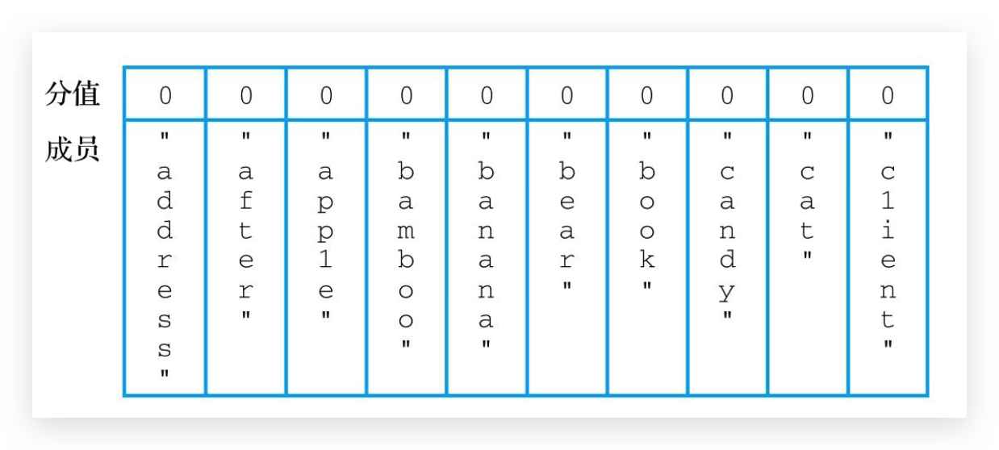

# sorted_set

## 介绍

*   新的存储需求：数据**排序**有利于数据的有效展示，需要提供一种可以根据自身特征进行排序的方式
*   sorted_set类型：在 set 的存储结构基础上**添加可排序字段score**
*   score保存的数据存储空间是**64位**，如果是整数范围是-9007199254740992~9007199254740992
*   score保存的数据也可以是一个双精度的double值，基于双精度浮点数的特征，可能会丢失精度，使用时候要慎重
*   sorted_set 底层存储还是基于set结构的，因此数据**不能重复**，如果**重复添加**相同的数据，**score值将被反复覆盖**，保留最后一次修改的结果




## 🔥ZADD 添加或更新成员

```bash
ZADD sorted_set score member [score member]
```

在**默认**情况下，ZADD命令将返回**成功添加的新成员数量**作为返回值

示例

```bash
127.0.0.1:6379> zadd salary 3500 conan 4000 conanan 2000 zhangsan
(integer) 3

127.0.0.1:6379> zadd salary 5000 conanan
(integer) 0 --修改score
```


### XX / NX 选项

从Redis 3.0.2版本开始，Redis允许用户在执行ZADD命令时，通过使用可选的XX选项或者NX选项来显式地指示命令只执行更新操作或者只执行添加操作

```
zadd sorted_set [xx|nx] score member [score member ...]
```

*   带有XX选项的ZADD命令只会对有序集合已有的成员进行**更新**，而不会向有序集合添加任何新成员
*   带有NX选项的ZADD命令只会向有序集合**添加新成员**，而不会对已有的成员进行任何更新


### CH 被修改成员的数量

在**默认**情况下，ZADD命令会**返回新添加成员的数量**作为返回值，但是从Redis 3.0.2版本开始，用户可以通过给定**CH**选项，让ZADD命令返回被修改（**changed**）成员的数量作为返回值

```
zadd sorted_set [ch] score member [score member ...]
```

“被修改成员”指的是**新添加**到有序集合的成员，以及分值**被更新**了的成员


## 🔥ZREM 移除指定的成员

用户可以从有序集合中移除指定的一个或多个成员以及与这些成员相关联的分值

```
zrem sorted_set member [member ...]
```

返回**被移除成员的数量**

实例

```bash
127.0.0.1:6379> zrem salary zhangsan
(integer) 1
```

如果用户给定的某个成员并不存在于有序集合中，那么ZREM将自动忽略该成员


## 🔥ZREMRANGEBYRANK 移除指定排名范围内的成员

从**升序排列的有序集合中移除位于指定排名范围内的成员**，然后返回被移除成员的数量

```
ZREMRANGEBYRANK sorted_set start end
```

命令接受的也是一个闭区间范围，也就是说，排名为start和end的成员也将被移除

以下代码展示了如何移除salary有序集合中升序排名0～3位的4个成员

```bash
127.0.0.1:6379> zremrangebyrank salary 0 3
(integer) 4 
```

从salary有序集合中移除排名倒数前3位的成员

```bash
127.0.0.1:6379> zremrangebyrank salary -3 -1
(integer) 3
```


## 🔥ZREMRANGEBYSCORE 移除指定分值范围内的成员

```bash
zremrangebyscore key min max
```

从有序集合中移除位于指定分值范围内的成员，并在移除操作执行完毕返回被移除成员的数量

*   min max 也可以使用 `(`、`-inf`、`+inf`

## 🔥ZSCORE 获取成员的分值

用户可以获取与给定成员相关联的分值

```
zscore sorted_set member
```

示例

```bash
127.0.0.1:6379> zscore salary conanan
"5000"
127.0.0.1:6379> zscore salary conanann
(nil)
```

如果用户给定的有序集合并不存在，或者有序集合中并未包含给定的成员，那么ZSCORE命令将返回空值


## 🔥ZRANK、ZREVRANK 获取成员在有序集合中的排名

取得给定成员在有序集合中的排名

```bash
zrank sorted_set member
zrevrank sorted_set member
```

*   其中ZRANK命令返回的是成员的**升序**排列排名，即成员在按照分值从小到大进行排列时的排名，
*   ZREVRANK命令返回的则是成员的**降序**排列排名，即成员在按照分值从大到小进行排列时的排名
*   如果用户给定的有序集合并不存在，或者用户给定的成员并不存在于有序集合当中，那么ZRANK命令和ZREVRANK命令将返回一个空值

示例

```bash
127.0.0.1:6379> zrange salary 0 -1 withscores
1) "conan"
2) "3500"
3) "zhangsan"
4) "3500"
5) "conanan"
6) "5500"

127.0.0.1:6379> zrank salary conan
(integer) 0
127.0.0.1:6379> zrank salary zhangsan
(integer) 1
127.0.0.1:6379> zrank salary conanan
(integer) 2
```

注意：score相同但是排名不同！**不是很公平**！


## 🔥ZINCRBY 对成员的分值执行自增或自减操作

对有序集合中指定成员的分值执行自增操作，为其加上指定的增量（加上负增量也行哦）

```bash
zincrby sorted_set increment member
```

在执行完自增操作之后，将返回给定成员当前的分值

示例

```bash
127.0.0.1:6379> zincrby salary 500 conanan
"5500"
```

注意：

*   如果用户在执行ZINCRBY命令时，给定成员并不存在于有序集合中，或者给定的有序集合并不存在，那么ZINCRBY命令将直接把给定的成员添加到有序集合中，并把给定的增量设置为该成员的分值，效果相当于执行ZADD命令


## 🔥ZCARD 获取有序集合的大小

取得有序集合的基数，即有序集合包含的成员数量

```bash
zcard sorted_set
```

实例

```bash
127.0.0.1:6379> zcard salary
(integer) 2
```


## 🔥ZCOUNT 统计指定分值范围内的成员数量

统计出有序集合中分值介于指定范围之内的成员数量

```bash
zcount sorted_set min max
```

*   min max 也可以使用 `(`、`-inf`、`+inf`

统计出salary有序集合中分值介于3000～5000之间的成员数量

```bash
127.0.0.1:6379> zcount salary 3000 5000
(integer) 4 -- 4个成员
```


## 🔥ZRANGE、ZREVRANGE 获取指定索引范围内的成员

以升序排列或者降序排列方式，从有序集合中获取指定索引范围内的成员

```bash
zrange sorted_set start end [withscores]
zrevrange sorted_set start end [withscores]
```

*   ZRANGE命令用于获取按照分值大小实施**升序排列**的成员，
*   ZREVRANGE命令则用于获取按照分值大小实施**降序排列**的成员
*   命令中的start索引和end索引指定的是**闭区间索引范围**。且记住是**排序后才使用start、end截取**
*   如果用户给定的有序集合并不存在，那么ZRANGE命令和ZREVRANGE命令将返回一个空列表


### WITHSCORES 获取成员及其分值

默认情况下，ZRANGE命令和ZREVRANGE命令只会返回指定索引范围内的成员，如果用户想要在获取这些成员的同时也获取与之相关联的分值，那么可以在调用ZRANGE命令或者ZREVRANGE命令的时候，给定可选的WITHSCORES选项


## 🔥ZRANGEBYSCORE、ZREVRANGEBYSCORE 获取指定分值范围内的成员

通过使用ZRANGEBYSCORE命令或者ZREVRANGEBYSCORE命令，用户可以以升序排列或者降序排列的方式获取有序集合中分值介于指定范围内的成员

```bash
zrangebyscore sorted_set min max [withscores] [limit offset count]
zrevrangebyscore sorted_set max min [withscores] [limit offset count]
```

*   命令的min参数和max参数分别用于指定用户想要获取的成员的最小分值和最大分值
*   不过需要注意的是，俩命令**接受min参数和max参数的顺序正好相反**。
*   min max 也可以使用 `(`、`-inf`、`+inf`


### WITHSCORES 获取成员及其分值


### LIMIT 限制命令返回的成员数量

LIMIT选项接受offset和count两个参数作为输入，其中**offset**参数用于指定命令在返回结果之前需要**跳过的成员数量**，而**count**参数则用于指示命令最多可以**返回多少个成员**


### ( 使用开区间分值范围

如果用户想要定义的是开区间而不是闭区间，那么可以在给定分值范围时，在分值参数的前面加上一个单括号“(”，这样，具有给定分值的成员就不会出现在命令返回的结果当中

以下命令只会返回分值大于3500且小于5000的成员，但并不会返回分值等于3500或者等于5000的成员

```bash
127.0.0.1:6379> zrangebyscore salary (3500 (5000 withscores
```


### 使用无限值作为范围

min参数和max参数除了可以是普通的分值或者带有(符号的分值之外，还可以是特殊值**+inf**或者**-inf**，前者用于表示**无穷大**，而后者则用于表示**无穷小**：当我们只想定义分值范围的上限或者下限，而不是同时定义分值范围的上限和下限时，+inf和-inf就可以派上用场

如果我们想要获取salary有序集合中所有分值小于5000的成员，那么可以执行以下命令

```bash
127.0.0.1:6379> zrangebyscore salary -inf (5000 withscores
```

如果我们想要获取salary有序集合中所有分值大于4000的成员，那么可以执行以下命令

```bash
127.0.0.1:6379> zrangebyscore salary (4000 +inf withscores
```


## 🔥ZINTERSTORE、ZUNIONSTORE 交并

```bash
zinterstore destination numkeys sorted_set [sorted_set...] [WEIGHTS weight] [AGGREGATE SUM|MIN|MAX]
zunionstore destination numkeys sorted_set [sorted_set...] [WEIGHTS weight] [AGGREGATE SUM|MIN|MAX]
```

*   numbers参数用于指定**参与计算的有序集合数量**
*   之后的一个或多个sorted_set参数则用于指定参与计算的各个有序集合键
*   计算得出的结果则会存储到destination参数指定的键中
*   返回计算结果包含的成员数量
*   **值相同的会将score相加**


### AGGREGATE 指定聚合函数

通过这个选项，用户可以决定使用哪个聚合函数来计算结果有序集合成员的分值

在没有显式地使用AGGREGATE选项指定聚合函数的情况下，ZUNIONSTORE和ZINTERSTORE**默认使用SUM作为聚合函数**



```bash
127.0.0.1:6379> zinterstore agg-sum 3 ss1 ss2 ss3 AGGREGATE SUM
(integer) 1
127.0.0.1:6379> zrange agg-sum 0 -1 withscores
1) "a"
2) "8"
```




### WEIGHTS 设置权重

在默认情况下，ZUNIONSTORE和ZINTERSTORE将直接使用给定有序集合的成员分值去计算结果有序集合的成员分值，但是在有需要的情况下，用户也可以通过可选的WEIGHTS参数为各个给定有序集合的成员分值设置权重

在使用WEIGHTS选项时，用户需要为每个给定的有序集合分别设置一个权重，命令会将这个权重与成员的分值相乘，得出成员的新分值，然后执行聚合计算；与此相反，如果用户在使用WEIGHTS选项时，不想改变某个给定有序集合的分值，那么只需要将那个有序集合的权重设置为1即可

如果我们对图所示的3个有序集合执行以下命令



```bash
127.0.0.1:6379> zunionstore weighted-result 3 wss1 wss2 wss3 weigths 3 5 1
```

那么wss1有序集合成员"a"的分值2将被乘以3，变为6; wss2有序集合成员"b"的分值4则会被乘以5，变为20;wss3有序集合成员的分值3则会保持不变；通过进行并集计算，命令最终将得出图所示的结果有序集合weighted-result




### 使用 set 作为输入

ZUNIONSTORE和ZINTERSTORE除了可以使用sorted_set作为输入之外，还可以使用set作为输入：在默认情况下，这两个命令将把给定集合看作所有成员的分值都为1的有序集合来进行计算。如果有需要，用户也可以使用WEIGHTS选项来改变给定集合的分值，比如，如果你希望某个集合所有成员的分值都被看作10而不是1，那么只需要在执行命令时把那个集合的权重设置为10即可。



```bash
127.0.0.1:6379> zunionstore mixed 2 alphabets another-alphabets
(integer) 5
```




## ZRANGEBYLEX、ZREVRANGEBYLEX 返回指定字典序范围内的成员

对于拥有不同分值的有序集合成员来说，成员的大小将由分值决定，至于**分值相同的成员，它们的大小则由该成员在字典序中的大小决定**

这种排列规则的一个特例是，当有序集合的所有成员**都拥有相同的分值**时，有序集合的成员将**不再根据分值进行排序**，而是**根据字典序进行排序**。在这种情况下，本章前面介绍的根据分值对成员进行操作的命令，比如ZRANGEBYSCORE、ZCOUNT和ZREMRANGEBYSCORE等，都将不再适用

为了让用户可以对字典序排列的有序集合执行类似ZRANGEBYSCORE这样的操作，Redis提供了相应的**ZRANGEBYLEX**、**ZREVRANGEBYLEX**、**ZLEXCOUNT**和**ZREMRANGEBYLEX**命令，这些命令可以分别对字典序排列的有序集合执行升序排列的范围获取操作、降序排列的范围获取操作、统计位于字典序指定范围内的成员数量以及移除位于字典序指定范围内的成员，本章接下来将分别对这些命令进行介绍。

```
ZRANGEBYLEX sorted_set min max [limit offset count]
ZREVRANGEBYLEX sorted_set max min [limit offset count]
```

命令的min参数和max参数用于指定用户想要获取的字典序范围，它们的值可以是以下4种值之一：

*   带有`[`符号的值表示在结果中包含与给定值具有同等字典序大小的成员。
*   带有`(`符号的值表示在结果中不包含与给定值具有同等字典序大小的成员。
*   加号`+`表示无穷大。
*   减号`-`表示无穷小。



举个例子，对于图所示的words有序集合来说，如果我们想要通过ZRANGEBYLEX命令获取words有序集合包含的所有成员，那么只需要将min参数的值设置为-, max参数的值设置为+即可

如果我们想要获取words有序集合中所有以字母"a"开头的成员，那么只需要将min参数的值设置为[a ,max参数的值设置为(b即可

如果我们想要获取words有序集合中所有字典序小于字母"c"的成员，那么只需要将min参数的值设置为-, max参数的值设置为(c即可


### LIMIT 限制命令返回的成员数量


## ZLEXCOUNT 统计位于字典序指定范围内的成员数量

对于按照字典序排列的有序集合，用户可以使用ZLEXCOUNT命令统计有序集合中位于字典序指定范围内的成员数量

```bash
ZLEXCOUNT sorted_set min max
```

通过执行以下命令，我们可以统计出words有序集合中以字母"a"开头的成员数量

```bash
127.0.0.1:6379> ZLEXCOUNT words [a (b
```

用以下命令，统计出有序集合中字典序大于等于字母"b"的成员数量

```bash
127.0.0.1:6379> ZLEXCOUNT words [b +
```


## ZREMRANGEBYLEX 移除位于字典序指定范围内的成员

对于按照字典序排列的有序集合，用户可以使用ZREMRANGEBYLEX命令去移除有序集合中位于字典序指定范围内的成员

```bash
ZREMRANGEBYLEX sorted_set min max
```

在移除用户指定的成员之后，将返回被移除成员的数量作为命令的返回值

以下代码展示了如何移除words有序集合中所有以字母"b"开头的成员

```bash
127.0.0.1:6379> ZREMRANGEBYLEX words [b (c
```


## 🔥ZPOPMAX、ZPOPMIN 弹出分值最高和最低的成员

Redis 5.0版本新添加的两个命令，分别用于移除并返回有序集合中分值最大和最小的N个元素

```bash
ZPOPMAX sorted_set [count]
ZPOPMIN sorted_set [count]
```

其中被移除元素的数量可以通过可选的count参数来指定。如果用户没有显式地给定count参数，那么命令默认只会移除一个元素


## 🔥BZPOPMAX、BZPOPMIN 阻塞式最大/最小元素弹出操作

Redis 5.0版本新添加的两个命令，BZPOPMAX命令和BZPOPMIN命令分别是ZPOPMAX命令以及ZPOPMIN命令的阻塞版本，这两个阻塞命令都接受任意多个有序集合和一个**秒级精度**的超时时限作为参数

```bash
BZPOPMAX sorted_set [sorted_set ...] timeout
BZPOPMIN sorted_set [sorted_set ...] timeout
```

接收到参数的BZPOPMAX命令和BZPOPMIN命令会依次检查用户给定的有序集合，并从它遇到的第一个非空有序集合中弹出指定的元素。如果命令在检查了所有给定有序集合之后都没有发现可弹出的元素，那么它将阻塞执行命令的客户端，并在给定的时限之内等待可弹出的元素出现，直到等待时间超过给定时限为止。用户可以通过**将超时时限设置为0来让命令一直阻塞，直到可弹出的元素出现为止**。

BZPOPMAX命令和BZPOPMIN命令在成功弹出元素时将返回一个包含3个项的列表，这3个项分别为**被弹出元素所在的有序集合**、**被弹出元素的成员**以及**被弹出元素的分值**。与此相反，如果这两个命令因为等待超时而未能弹出任何元素，那么它们将返回一个空值nil作为结果


## ====================

## 🔥【场景】排行榜

我们在网上常常会看到各式各样的排行榜，比如，在音乐网站上可能会看到试听排行榜、下载排行榜、华语歌曲排行榜和英语歌曲排行榜等，而在视频网站上可能会看到观看排行榜、购买排行榜、收藏排行榜等，甚至连项目托管网站GitHub都提供了各种不同的排行榜，以此来帮助用户找到近期最受人瞩目的新项目。

一个使用有序集合实现的排行榜程序：

*   这个程序使用ZADD命令向排行榜中添加被排序的元素及其分数，并使用ZREVRANK命令去获取元素在排行榜中的排名，以及使用ZSCORE命令去获取元素的分数。
*   当用户不再需要对某个元素进行排序的时候，可以调用由ZREM命令实现的remove()方法，从排行榜中移除该元素。
*   如果用户想要修改某个被排序元素的分数，那么只需要调用由ZINCRBY命令实现的increase_score()方法或者decrease_score()方法即可。
*   当用户想要获取排行榜前N位的元素及其分数时，只需要调用由ZREVRANGE命令实现的top()方法即可。


## 🔥【场景】时间线排序

在互联网上，有很多网站都会根据内容的发布时间来对内容进行排序，比如：

*   博客系统会按照文章发布时间的先后，把最近发布的文章放在前面，而发布时间较早的文章则放在后面，这样访客在浏览博客的时候，就可以先阅读最新的文章，然后再阅读较早的文章。
*   新闻网站会按照新闻的发布时间，把最近发生的新闻放在网站的前面，而早前发生的新闻则放在网站的后面，这样当用户访问该网站的时候，就可以第一时间查看到最新的新闻报道。
*   诸如微博和Twitter这样的微博客都会把用户最新发布的消息放在页面的前面，而稍早之前发布的消息则放在页面的后面，这样用户就可以通过向后滚动网页，查看最近一段时间自己关注的人都发表了哪些动态。类似的情形还有很多。通过对这类行为进行抽象，我们可以创建出代码清单6-2所示的时间线程序：
*   这个程序会把被添加到时间线里面的元素用作成员，与元素相关联的时间戳用作分值，将元素和它的时间戳添加到有序集合中。
*   因为时间线中的每个元素都有一个与之相关联的**时间戳**，所以时间线中的元素将按照时间戳的大小进行排序。
*   通过对时间线中的元素执行ZREVRANGE命令或者ZREVRANGEBYSCORE命令，用户可以以分页的方式按顺序取出时间线中的元素，或者从时间线中取出指定时间区间内的元素


## 🔥【场景】商品推荐

在浏览网上商城的时候，我们常常会看到类似“购买此商品的顾客也同时购买”这样的商品推荐功能

从抽象的角度来讲，这些推荐功能实际上都是通过记录用户的访问路径来实现的：如果用户在对一个目标执行了类似浏览或者购买这样的操作之后，也对另一个目标执行了相同的操作，那么程序就会对这次操作的访问路径进行记录和计数，然后程序就可以通过计数结果来知道用户在对指定目标执行了某个操作之后，还会对哪些目标执行相同的操作。

使用以上原理实现的路径统计程序

*   每当用户从起点origin对终点destination进行一次访问，程序都会使用ZINCRBY命令对存储着起点origin访问记录的有序集合的destination成员执行一次分值加1操作。
*   在此之后，程序只需要对存储着origin访问记录的有序集合执行ZREVRANGE命令，就可以知道用户在访问了起点origin之后，最经常访问的目的地有哪些。


## 🔥【场景】自动补全

包含大量信息的网站常常会在搜索或者查找功能上提供自动补全特性，这一特性可以帮助用户更快速地找到他们想要的信息。比如，当我们在搜索引擎中输入“黄”字的时候，搜索引擎的自动补全特性就会列出一些比较著名的以“黄”字开头的人或者物，以便用户可以更快速地找到相关信息

为了尽可能地节约内存，一个高效的自动补全程序应该只存储热门关键字的自动补全结果，并移除无人访问的冷门关键字的自动补全结果。其中一种方法就是使用排行榜程序，为用户输入的关键字构建一个排行榜，然后定期地删除排名靠后的关键字的自动补全结果。

排行榜的方法虽然可行，但是却需要用程序定期删除自动补全结果，使用起来相当麻烦。一个更方便也更优雅的方法，就是使用EXPIRE命令和PEXPIRE命令的更新特性去实现自动的冷门数据淘汰机制。为此，我们可以修改自动补全程序，让它在每次处理用户输入的时候，为相应关键字的自动补全结果设置生存时间。

详细查看书本


## 🔥【场景】即时任务/消息队列执行管理

简单的场景

*   每处理一个使用 zremrangebyrank mq 0 0 即可

复杂的场景，如多条件任务权重设定，如果权重条件过多时，需要对排序score值进行处理，保障score值能够兼容2条件或者多条件，例如外贸订单优先于国内订单，总裁订单优先于员工订单，经理订单优先于员工订单

*   因score长度受限，需要对数据进行截断处理，尤其是时间设置为小时或分钟级即可(折算后)
*   先设定订单类别，后设定订单发起角色类别，**整体score长度必须是统一的**，**不足位补0**。第一排序规则**首位不得是0**
    *   例如外贸101，国内102；经理004，员工008。
    *   员工下的外贸单score值为101008(优先)
    *   经理下的国内单score值为102004


## 🔥【场景】定时任务执行顺序管理或任务过期管理—仅参考

### 业务场景

基础服务+增值服务类网站会设定各位会员的试用，让用户充分体验会员优势。例如观影试用VIP、游戏 VIP体验、云盘下载体验VIP、数据查看体验VIP。当VIP体验到期后，如果有效管理此类信息。即便对于正式 VIP用户也存在对应的管理方式。

网站会定期开启投票、讨论，限时进行，逾期作废。如何有效管理此类过期信息。


### 解决方案

-   对于基于时间线限定（到期时间）的任务处理，将**处理时间记录为score值**，利用排序功能区分处理的先后顺序

-   记录下一个要处理的时间，当到期后处理对应任务，移除redis中的记录，并记录下一个要处理的时间

-   当新任务加入时，判定并更新当前下一个要处理的任务时间

-   为提升sorted_set的性能，通常将任务根据特征存储成若干个sorted_set。例如1小时内，1天内，周内，月内，季内，年度等，操作时逐级提升，将即将操作的若干个任务纳入到1小时内处理的队列中

-   获取当前系统时间

    ```bash
    time
    ```

-   直接使用 ZREMRANGEBYSCORE 并配合 time 命令即可


