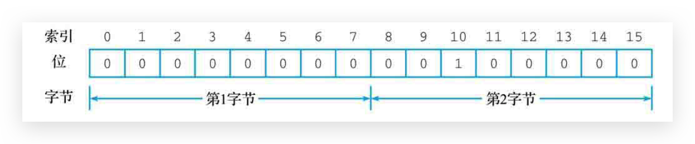
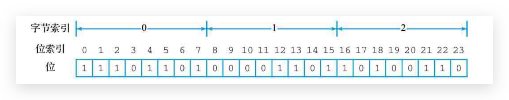
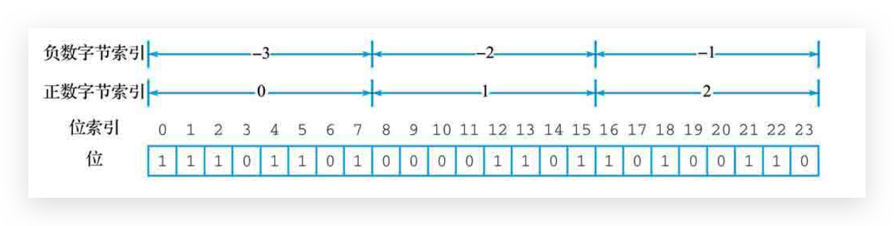
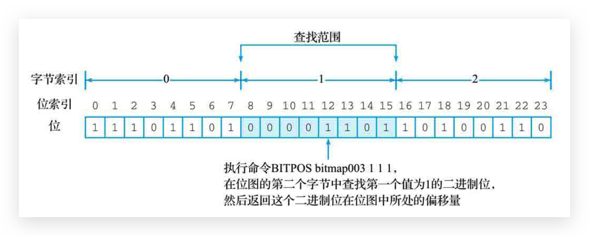
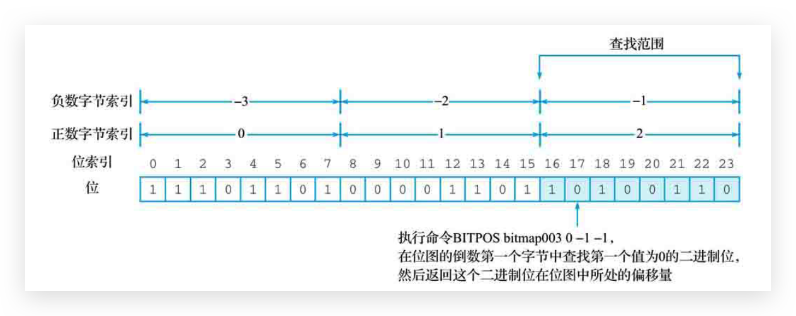

# bitmap—位图

Redis的位图是在**字符串**的基础上实现的，所以它会把位图键看作一个字符串键。所以可以使用字符串命令对位图进行操作

## 🔥SETBIT 设置二进制位的值

通过使用SETBIT命令，用户可以为位图**指定偏移量（从0开始）**上的二进制位设置值

```
setbit bitmap offset value
```

SETBIT命令在对二进制位进行设置之后，将**返回**二进制位被设置之前的**旧值**作为结果

注意：

* 当用户执行SETBIT命令尝试对一个位图进行设置的时候，如果**位图不存在**，或者位图当前的大小无法满足用户想要执行的设置操作，那么Redis将对**被设置的位图进行扩展**，使得位图可以满足用户的设置请求
* 因为Redis对位图的扩展操作是以字节为单位进行的，所以扩展之后的位图包含的**二进制位数量**可能会比用户要求的**稍微多一些**，并且在扩展位图的同时，Redis还会将**所有未被设置的二进制**位的值**初始化为0**。
* SETBIT命令**只能使用正数偏移量**，尝试输入负数作为偏移量将引发一个错误



## 🔥GETBIT 获取二进制位的值

使用GETBIT命令，用户可以获取位图指定偏移量上的二进制位的值：

```
getbit bitmap offset
```

注意：

* 与SETBIT命令一样，GETBIT命令也只能接受**正数作为偏移量**
* 如果用户输入的**偏移量超过了**位图目前拥有的**最大偏移量**，那么GETBIT命令将**返回0作为结果**

## 🔥BITCOUNT 统计被设置的二进制位数量

用户可以通过执行BITCOUNT命令统计位图中**值为1**的二进制位**数量**

```
bitcount key [start end]
```

::: danger 注意

* start参数和end参数与本章之前介绍的SETBIT命令和GETBIT命令的offset参数并不相同，这两个参数是用来指定**字节偏移量**而**不是二进制位偏移量**的。位图的字节偏移量与Redis其他数据结构的偏移量一样，都是从0开始的：位图第一个字节的偏移量为0，第二个字节的偏移量为1，第三个字节的偏移量为2，以此类推。

  
* start参数和end参数的值除了可以是正数之外，还可以是负数

  

:::

## BITPOS 查找第一个指定的二进制位值

通过执行BITPOS命令，在位图中查找第一个被设置为指定值的二进制位，并返回这个所处**整个位图**的**二进制位的偏移量**

```
bitpos bitmap value [start end]
```

::: danger 注意

* 通过可选的start参数和end参数，让BITPOS命令只在**指定字节范围（注意）**内的**二进制位**中进行查找

  
* start参数和end参数也可以是负数

  
* 当用户尝试对一个**不存在的位图**或者一个**所有位都被设置成了0**的位图中查**找值为1**的二进制位时，该命令将返回-1作为结果
* 如果用户在一个**所有位都被设置成1**的位图中查**找值为0**的二进制位，那么该命令将返回位图**最大偏移量加上1**（Redis会把位图中不存在的二进制位的值看作0）作为结果

:::

## 🔥BITOP 执行二进制位运算

通过BITOP命令，对一个或多个位图执行指定的二进制位运算，并将运算结果存储到指定的键中

```
bitop operation result_key bitmap [bitmap ...]
```

* and
* or
* not
* xor

当BITOP命令在对两个长度不同的位图执行运算时，会将**长度较短的那个位图中不存在的二进制位的值看作0**

## BITFIELD 在位图中存储整数值—未完

BITFIELD命令允许用户在位图中的任意区域（field）存储指定长度的整数值，并对这些整数值执行加法或减法操作。BITFIELD命令支持SET、GET、INCRBY、OVERFLOW这4个子命令

## =======================================

## 🔥【场景】应用于信息状态统计

### 业务场景

电影网站，要统计：

* 统计每天某一部电影是否被点播
* 统计每天有多少部电影被点播
* 统计每周/月/年有多少部电影被点播
* 统计年度哪部电影没有被点播

运用 bitcount，bitop操作即可