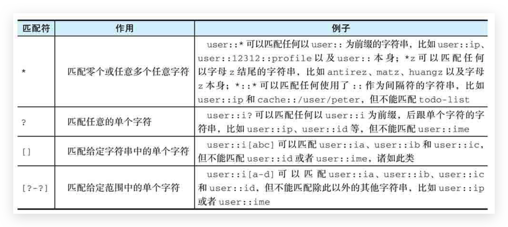

# 通用指令


## EXIST 是否存在

```bash
del key
```


## DEL 删除

```bash
exists key
```


## TYPE 类型

```bash
type key
```


## KEYS 获取所有与给定匹配符相匹配的键

### 简介

KEYS命令接受一个全局匹配符作为参数，然后返回数据库中所有与这个匹配符相匹配的键作为结果

```bash
keys pattern
```

*   获取数据库包含的所有键

    ```bash
    keys *
    ```

*   获取所有以`user::`为前缀的键

    ```bash
    keys user::*
    ```

*   如果数据库中没有任何键与给定的匹配符相匹配，那么KEYS命令将返回一个空值

    ```bash
    127.0.0.1:6379> keys user::*
    (empty array)
    ```

    

### 全局匹配符

KEYS命令允许使用多种不同的全局匹配符作为pattern参数的值，如下展示了一些常见的全局匹配符，并举例说明了这些匹配符的作用。或参考 [WIKI](https://en.wikipedia.org/wiki/Glob_(programming))、[glob程序手册](https://man7.org/linux/man-pages/man7/glob.7.html)。



```
keys *  查询所有
keys it*  查询所有以it开头
keys *heima  查询所有以heima结尾
keys ??heima  查询所有前面两个字符任意，后面以heima结尾
keys user:?  查询所有以user:开头，最后一个字符任意
keys u[st]er:1  查询所有以u开头，以er:1结尾，中间包含一个字母，s或t
```


## SCAN 以渐进方式迭代数据库中的键

因为KEYS命令需要检查数据库包含的所有键，并一次性将符合条件的所有键全部返回给客户端，所以当数据库包含的键数量比较大时，使用KEYS命令可能会导致服务器被阻塞。为了解决这个问题，Redis从2.8.0版本开始提供SCAN命令，该命令是一个迭代器，它每次被调用的时候都会从数据库中获取一部分键，用户可以通过重复调用SCAN命令来迭代数据库包含的所有键

```bash
scan cursor
```

*   cursor参数用于指定迭代时使用的游标，游标记录了迭代的轨迹和进度。在开始一次新的迭代时，用户需要将游标设置为0

SCAN命令的执行结果由两个元素组成

*   第一个元素是进行下一次迭代所需的游标，如果这个游标为0，那么说明客户端已经对数据库完成了一次完整的迭代。
*   第二个元素是一个列表，这个列表包含了本次迭代取得的数据库键；如果SCAN命令在某次迭代中没有获取到任何键，那么这个元素将是一个空列表

关于SCAN命令返回的键列表，有两点需要注意

*   SCAN命令可能会返回重复的键，用户如果不想在结果中包含重复的键，那么就需要自己在客户端中进行检测和过滤。
*   SCAN命令返回的键数量是不确定的，有时甚至会不返回任何键，但只要命令返回的游标不为0，迭代就没有结束。


## RENAME、RENAMENX 修改键名

```bash
rename key new
```

RENAME命令在执行成功时将返回OK作为结果

```bash
127.0.0.1:6379> set name conan
OK
127.0.0.1:6379> get name
"conan"
127.0.0.1:6379> rename name username
OK
127.0.0.1:6379> get name
(nil)
127.0.0.1:6379> get username
"conan"
```

注意：

*   **覆盖已存在的键**。如果用户指定的新键名已经被占用，那么RENAME命令会先移除占用了新键名的那个键，然后再执行改名操作
*   RENAMENX 只在新键名尚未被占用的情况下进行改名。推荐！如果用户指定的新键名已经被占用，那么RENAMENX将放弃执行改名操作


## SORT 对键的值进行排序

### 介绍

通过执行SORT命令对 **list** 元素、**set** 元素或者 **sorted_set** 成员进行排序。为了让用户能够以不同的方式进行排序，Redis为SORT命令提供了非常多的可选项，如果我们以不给定任何可选项的方式直接调用SORT命令，那么命令将对指定键存储的元素执行**数字值排序**。默认情况下，SORT命令将按照**从小到大**的顺序依次返回排序后的各个值

```bash
sort key [asc|desc]
```


### 字符串排序

如果我们尝试直接使用SORT命令去**对字符串元素进行排序**，那么命令将产生一个**错误**

为了让SORT命令能够对字符串值进行排序，我们必须让SORT命令执行字符串排序操作而不是数字值排序操作，这一点可以通过使用**ALPHA选项**来实现

```bash
sort key alpha
```


### LIMIT

在默认情况下，SORT命令将返回所有被排序的元素，但如果我们只需要其中一部分排序结果，那么可以使用可选的LIMIT选项

```bash
sort key [limit offset count]
```

其中offset参数用于指定返回结果之前需要跳过的元素数量，而count参数则用于指定需要获取的元素数量


### 未完...

在默认情况下，SORT命令将返回被排序的元素作为结果，但如果用户有需要，也可以使用GET选项去获取其他值作为排序结果


## HELP @GENERIC

```bash
help @generic
help set
```


## 自动过期

### 🔥EXPIRE / PEXPIRE 设置、更新生存时间

```bash
expire key seconds
pexpire key milliseconds
```

EXPIRE命令和PEXPIRE命令在生存时间设置成功时返回1；如果用户给定的键并不存在，那么命令返回0表示设置失败。

对一个已经带有生存时间的键执行EXPIRE命令或PEXPIRE命令时，键原有的生存时间将会被**移除**，并**设置新的生存时间**

注意：

*   SET 命令有 EX、PX 选项，无需再使用 SETEX、SETPX、EXPIRE（除非更新时）

    可以减少命令的调用数量并提升程序的执行速度之外，更重要的是保证了操作的原子性，使得“为键设置值”和“为键设置生存时间”这两个操作可以一起执行。当然后续可以通过事务来解决！


### 🔥EXPIREAT / PEXPIREAT 设置、更新过期时间

```bash
expireat key timestamp
pexpireat key milliseconds-timestamp
```

通过设置过期时间（expire time），让Redis在指定UNIX时间来临之后自动移除给定的键

*   EXPIREAT命令接受一个键和一个秒级精度的UNIX时间戳为参数，当系统的当前UNIX时间超过命令指定的UNIX时间时，给定的键就会被移除
*   PEXPIREAT命令接受一个键和一个毫秒级精度的UNIX时间戳为参数，当系统的当前UNIX时间超过命令指定的UNIX时间时，给定的键就会被移除


### 自动过期特性的不足之处

EXPIRE、PEXIRE、EXPIREAT、PEXPIREAT，它们都只能对整个键进行设置，而无法对键中的某个元素进行设置，比如，用户只能对整个集合或者整个散列设置生存时间/过期时间，但是却无法为集合中的某个元素或者散列中的某个字段单独设置生存时间/过期时间，这也是目前Redis的自动过期功能的一个缺陷


### 🔥TTL / PTTL 获取键的剩余生存时间

```bash
ttl key
pttl key
```

*   TTL命令将以秒为单位返回键的剩余生存时间
*   PTTL命令则会以毫秒为单位返回键的剩余生存时间

*   如果给定的**键存在**，但是并**没有设置生存时间或者过期时间**，那么TTL命令和PTTL命令将**返回-1**

*   如果给定的**键并不存在**，那么TTL命令和PTTL命令将**返回-2**

*   TTL命令的精度问题

    出现这种情况的原因在于TTL命令只能返回秒级精度的生存时间，所以当给定键的剩余生存时间不足1s时，TTL命令只能返回0作为结果。这时，如果使用精度更高的PTTL命令去检查这些键，就会看到它们实际的剩余生存时间


### 🔥自动淘汰冷门数据


### PERSIST 时效转永久

```bash
persist key
```


## SELECT 切换至指定的数据库

一个Redis服务器可以包含多个数据库。在**默认**情况下，**Redis服务器在启动时将会创建16个数据库**：这些数据库都使用号码进行标识，其中第一个数据库为0号数据库，第二个数据库为1号数据库，而第三个数据库则为2号数据库，以此类推。

Redis虽然不允许在同一个数据库中使用两个同名的键，但是由于不同数据库拥有不同的命名空间，因此在不同数据库中使用同名的键是完全没有问题的，而用户也可以通过使用不同数据库来存储不同的数据，以此来达到重用键名并且减少键冲突的目的。

比如，如果我们将用户的个人信息和会话信息都存放在同一个数据库中，那么为了区分这两种信息，程序就需要使用`user::<id>::profile`格式的键来存储用户信息，并使用`user::<id>::session`格式的键来存储用户会话；但如果将这两种信息分别存储在0号数据库和1号数据库中，那么程序就可以在0号数据库中使用`user::<id>`格式的键来存储用户信息，并在1号数据库中继续使用`user::<id>`格式的键来存储用户会话。

当用户使用客户端与Redis服务器进行连接时，客户端一般默认都会使用0号数据库，但是通过使用SELECT命令，用户可以从当前正在使用的数据库切换到自己想要使用的数据库

```bash
select 0
```


## MOVE 将给定的键移动到另一个数据库

```bash
move key db
```

当MOVE命令成功将给定键从当前数据库移动至目标数据库时，命令返回1；

如果给定键并不存在于当前数据库，或者目标数据库中存在与给定键同名的键，那么MOVE命令将不做动作，只返回0表示移动失败。


## DBSIZE 获取数据库包含的键值对数量


## FLUSHDB 清空当前数据库

```bash
flushdb [async]
```

FLUSHDB命令会遍历用户正在使用的数据库，移除其中包含的所有键值对，然后返回OK表示数据库已被清空。

与DEL命令一样，FLUSHDB命令也是一个**同步移除命令**，并且因为FLUSHDB移除的是整个数据库而不是单个键，所以它常常会引发比DEL命令更为严重的服务器阻塞现象

如果用户在调用FLUSHDB命令时使用了async选项，那么实际的数据库清空操作将放在后台线程中以**异步方式进行**，这样FLUSHDB命令就不会再阻塞服务器了。


## FLUSHALL 清空所有数据库

```bash
flushall [async]
```

FLUSHALL命令会遍历服务器包含的所有数据库，并移除其中包含的所有键值对，然后返回OK表示所有数据库均已被清空。

通过指定async选项，FLUSHALL命令将以异步方式在后台线程中执行所有实际的数据库清空操作，因此它将不会再阻塞服务器


## 其他命令

```bash
quit
ping --测试服务器是否连通
echo message
```

