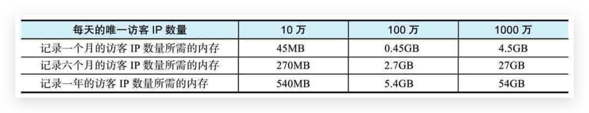

# HyperLogLog

## 问题引入

使用Redis集合构建唯一计数器，并将这个计数器用于计算网站的唯一访客IP。但是如果考虑得更长远一些，就会发现这个使用Redis集合实现的唯一计数器有一个明显的缺陷：随着被计数元素的不断增多，唯一计数器占用的内存也会越来越大；计数器越多，它们的体积越大，这一情况就会越严峻。

以计算唯一访客**IP**为例：

*   存储一个IPv4格式的IP地址最多需要15个字节（比如"127.234.122.101"）。
*   根据网站的规模不同，每天出现的唯一IP可能会有数十万、数百万甚至数千万个。
*   为了记录网站在不同时期的访客，并进行相关的数据分析，网站可能需要持续地记录每天的唯一访客IP数量，短则几个月，长则数年。

综合以上条件，如果一个网站想要长时间记录访客的IP，就必须创建多个唯一计数器。如果网站的访客比较多，那么它创建的每个唯一计数器都将包含大量元素，并因此占用相当一部分内存

如下展示了不同规模的网站在不同时间段中，存储唯一访客IP所需的最大内存



为了高效地解决计算唯一访客IP数量这类问题，研究人员开发了很多不同的方法，其中一个就是本章要介绍的HyperLogLog算法。


## HyperLogLog简介

HyperLogLog是一个专门为了计算**集合**的**基数（去重数量）**而创建的概率算法，对于一个给定的集合，HyperLogLog可以计算出这个集合的近似基数：近似基数并非集合的实际基数，它可能会比实际的基数小一点或者大一点，但是估算基数和实际基数之间的误差会处于一个合理的范围之内，因此那些不需要知道实际基数或者因为条件限制而无法计算出实际基数的程序就可以把这个近似基数当作集合的基数来使用。

HyperLogLog的优点在于它计算近似基数所需的内存并不会因为集合的大小而改变，无论集合包含的元素有多少个，HyperLogLog进行计算所需的内存总是固定的，并且是非常少的。具体到实现上，Redis的**每个HyperLogLog最多只需要使用12KB内存空间**，就可以对接近：**2^64个元素**进行计数，而算法的**标准误差仅为0.81%**，因此它计算出的近似基数是相当可信的。


## 🔥PFADD 对集合元素进行计数

通过执行PFADD命令，使用HyperLogLog对给定的一个或多个集合元素进行计数

```
pfadd hyperloglog element [element ...]
```

根据给定的元素是否已经进行过计数，PFADD命令可能返回0，也可能返回1：

*   如果给定的所有元素都已经进行过计数，那么PFADD命令将返回0，表示HyperLog-Log计算出的近似基数没有发生变化
*   与此相反，如果给定的元素中出现了至少一个之前没有进行过计数的元素，导致HyperLogLog计算出的近似基数发生了变化，那么PFADD命令将返回1

举个例子，通过执行以下命令，我们可以使用alphabets这个HyperLogLog对"a"、"b"、"c"这3个元素进行计数：

```
redis> pfadd alphabets "a" "b" "c"
(integer) 1
```

因为这是alphabets第一次对元素"a"、"b"、"c"进行计数，所以alphabets计算的近似基数将发生变化，并使PFADD命令返回1

但是如果我们再次要求alphabets对元素"a"进行计数，那么这次PFADD命令将返回0，这是因为已经计数过的元素"a"并不会对alphabets计算的近似基数产生影响


## 🔥PFCOUNT 返回集合的近似基数

在使用PFADD命令对元素进行计数之后，用户可以通过执行PFCOUNT命令来获取HyperLogLog为集合计算出的近似基数

```
pfcount hyperloglog [hyperloglog ...]
```

通过执行以下命令，我们可以获取到alphabets这个HyperLogLog计算出的近似基数

```
redis> pfcount alphabets
(integer) 3
```

PFCOUNT命令的返回值为3，这表示HyperLogLog算法认为alphabets目前已经计数过**3个不同的元素**

当用户给定的HyperLogLog**不存在**时，PFCOUNT命令将**返回0**作为结果

**对多个HyperLogLog执行并集计算**的效果与多个集合首先执行并集计算，然后再使用HyperLogLog去计算并集集合的近似基数的效果类似


## 🔥PFMERGE 计算多个HyperLogLog的并集

PFMERGE命令可以对多个给定的HyperLogLog执行并集计算，然后把计算得出的并集HyperLogLog**保存到指定的键中**

```
pfmerger destination hyperloglog [hyperloglog ...]
```

如果指定的键已经存在，那么PFMERGE命令将覆盖已有的键。PFMERGE命令在成功执行并集计算之后将返回OK作为结果

HyperLogLog并集计算的近似基数接近于所有给定HyperLogLog的被计数集合的并集基数。举个例子，假如有h1、h2、h33个HyperLogLog，它们分别对集合s1、s2、s3进行计数，那么h1、h2、h3这3个HyperLogLog的并集所计算出的近似基数将接近于s1、s2、s3这3个集合的并集的基数


## PFCOUNT与PFMERGE

PFCOUNT命令在计算多个HyperLogLog的近似基数时会执行以下操作：

1.  在内部调用PFMERGE命令，计算所有给定HyperLogLog的并集，并将这个并集存储到一个临时的HyperLogLog中。
2.  对临时HyperLogLog执行PFCOUNT命令，得到它的近似基数（因为这是针对单个HyperLogLog的PFCOUNT，所以这个操作不会引起循环调用）。
3.  删除临时HyperLogLog。
4.  向用户返回之前得到的近似基数。

PFCOUNT将执行以下以下操作：

1.  执行`PFMERGE <temp-hyperloglog> numbers1 numbers2 numbers3`，把3个给定HyperLogLog的并集结果存储到临时HyperLogLog中。
2.  执行`PFCOUNT <temp-hyperloglog>`，取得并集HyperLogLog的近似基数4。
3.  执行`DEL <temp-hyperloglog>`，删除临时HyperLogLog。
4.  向用户返回之前得到的近似基数4。

基于上述原因，当程序需要对多个HyperLogLog调用PFCOUNT命令，并且这个调用可能会重复执行多次时，我们可以考虑把这一调用替换成相应的PFMERGE命令调用：通过把并集的计算结果存储到指定的HyperLogLog中而不是每次都重新计算并集，程序可以最大程度地减少不必要的并集计算


## ===========================

## 🔥【场景】IP计数器

略