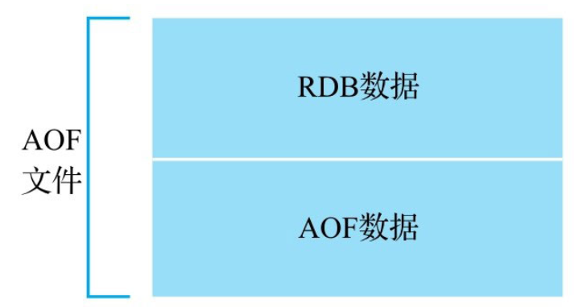
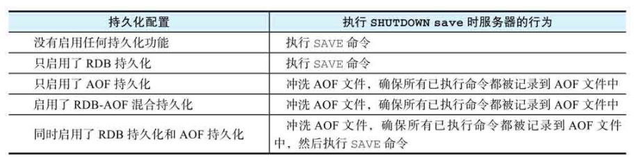

# 持久化

## 简介

### 什么是持久化？

利用**永久性**存储介质将数据进行保存，在特定的时间将保存的数据进行恢复的工作机制称为持久化。

### 为什么要持久化？

**防止**数据的意外**丢失**，确保数据**安全性**

### 持久化过程**保存什么**

*   将当前**数据状态**进行保存，**快照**形式，存储数据结果，存储格式简单，关注点在**数据**。RDB
*   将数据的**操作过程**进行保存，**日志**形式，存储操作过程，存储格式复杂，关注点在数据的操作**过程**。AOF


## RDB—全量快照

### RDB 配置 🔥

-   dbfilename dump.rdb

    -   说明：设置本地数据库**文件名**，默认值为 dump.rdb
    -   经验：通常设置为`dump-端口号.rdb`

-   dir

    -   说明：设置存储.rdb文件的**路径**
    -   经验：通常设置成存储空间较大的目录中，目录名称**data**

-   rdbcompression yes

    -   说明：设置存储至本地数据库时是否**压缩数据**，默认为 **yes**，采用 LZF 压缩
    -   经验：通常默认为开启状态，如果设置为no，可以节省 CPU 运行时间，但会使存储的文件变大（巨大）

-   rdbchecksum yes

    -   说明：设置是否**进行RDB文件格式校验**，该校验过程在**写文件和读文件过程均进行**
    -   经验：通常默认为开启状态，如果设置为no，可以节约读写性过程约10%**时间消耗**，但是存储一定的数据损坏风险

-   stop-writes-on-bgsave-error yes

    -   说明：[bgsave相关]。后台存储过程中如果**出现错误**现象，是否**停止保存**操作 
    -   经验：通常默认为开启状态

-   save second changes

    -   作用：满足**限定时间范围内key的变化数量达到指定数量**即进行持久化

    *   参数
        *   second：监控时间范围，秒！
        *   changes：监控 key 的**变化**量

常见配置如下：

```
protected-mode no
# bind 127.0.0.1
port 6379
daemonize yes
logfile "/usr/local/redis-6.2.1/logs/redis-6379.log"
dir ./data
dbfilename dump-6379.rdb
rdbcompression yes
rdbchecksum yes
stop-writes-on-bgsave-error yes
save 60 10000
save 300 100
save 3600 1
```


### RDB 启动方式—save 阻塞指令

**手动执行**一次保存操作


#### save 工作原理 🔥


步骤：

* 接收到SAVE命令的Redis服务器将遍历数据库包含的所有数据库，并将各个数据库包含的键值对全部记录到RDB文件中。
* 在SAVE命令执行期间，Redis服务器将阻塞，直到RDB文件创建完毕为止。
* 如果Redis服务器在执行SAVE命令时已经拥有了相应的RDB文件，那么服务器将使用**新创建的RDB文件代替已有的RDB文件**

注意：

* **save指令**的执行会**阻塞**当前Redis服务器，直到当前RDB过程完成为止，有可能会造成**长时间阻塞**，线上**不建议使用**。


#### 数据量大、单线程阻塞问题？

那么**数据量过大，单线程执行方式造成效率过低如何处理**?

可以采用**后台执行**（见 bgsave）：

*   谁：Redis操作者**（用户）发起指令**；Redis **服务器控制指令执行**
*   什么时间：**即时（发起）**；**合理的时间（执行）**
*   干什么事情：保存数据


### RDB 启动方式—bgsave 异步指令 🔥

**手动启动后台保存**操作，但不是立即执行。它不会直接使用**Redis服务器进程**创建RDB文件，而是使用**子进程**创建RDB文件


#### bgsave 工作原理 🔥


步骤：

* 创建一个子进程。
* 子进程执行SAVE命令，创建新的RDB文件。
* RDB文件创建完毕之后，子进程退出并通知Redis服务器进程（父进程）新RDB文件已经完成。
* **Redis服务器进程**使用新RDB文件替换已有的RDB文件。

注意：

* bgsave命令是针对save阻塞问题做的优化。Redis 内部所有涉及到RDB操作都采用bgsave的方式，save命令可以放弃。
* 虽然BGSAVE命令不会像SAVE命令那样一直阻塞Redis服务器，但由于执行BGSAVE命令需要创建子进程，所以**父进程占用的内存数量越大，创建子进程这一操作耗费的时间也会越长**，因此Redis服务器在执行BGSAVE命令时，仍然可能会由于创建子进程而被**短暂地阻塞**

* **bgsave的保存操作可以通过redis的日志查看**。并且执行时就已经返回 background...


#### 何时执行保存指令问题？

**反复执行保存指令，忘记了怎么办**？不知道数据产生了多少变化，**何时保存**？

自动执行

*   谁：Redis**服务器发起指令（基于条件）**
*   什么时间：**满足条件**

*   干什么事情：保存数据


### RDB 启动方式—save 配置 🔥

#### 简介

```
save second changes
```

作用：满足**限定时间范围内key的变化数量达到指定数量**即进行持久化

参数

*   second：监控时间范围，秒！
*   changes：监控 key 的**变化**量

位置：在conf文件中进行配置

RDB持久化是Redis默认使用的持久化方式，如果用户在启动Redis服务器时，既**没有显式地关闭RDB持久化功能**，也**没有启用AOF持久化功能**，那么Redis**默认将使用以下save选项进行RDB持久化**

```
save 60 10000
save 300 100
save 3600 1
```

注意：

* Redis允许用户同时向服务器提供**多个save选项**，当给定选项中的**任意一个条件被满足时**，服务器就会**执行一次BGSAVE**
* 为了避免由于同时使用多个触发条件而导致服务器过于频繁地执行BGSAVE命令，Redis服务器在**每次成功创建RDB文件之后**，**负责自动触发BGSAVE命令的时间计数器以及修改次数计数器都会被清零并重新开始计数**：无论这个RDB文件是由自动触发的BGSAVE命令创建的，还是由用户执行的SAVE命令或BGSAVE命令创建的，都是如此


#### save 配置原理 🔥


注意：

*   save配置要**根据实际业务情况进行设置**，频度过高或过低都会出现性能问题，结果可能是**灾难性**的
*   save配置中对于second与changes设置通常具有**互补对应关系**（一大一小），尽量不要设置成包含性关系
*   save配置启动后执行的是**bgsave**操作


### RDB三种启动方式对比 🔥

| 方式           | save 指令 | bgsave 指令 |
| -------------- | --------- | ----------- |
| 读写           | 同步      | 异步        |
| 阻塞客户端指令 | 是        | 否          |
| 额外内存消耗   | 否        | 是          |
| 启动新进程     | 否        | 是          |

* SAVE命令在创建RDB文件期间会**阻塞**Redis服务器，所以如果我们需要在创建RDB文件的同时让Redis服务器继续为其他客户端服务，那么就只能使用BGSAVE命令来创建RDB文件
* SAVE命令**无须创建子进程**，它**不会因为创建子进程而消耗额外的内存**，所以在**维护离线的Redis服务器**时，使用SAVE命令能够比使用BGSAVE命令**更快地完成创建RDB文件**的工作


### RDB 特殊启动方式 🔥

*   全量复制：在**主从复制**中详细讲解

*   服务器**运行过程中重启**

    ```
    debug reload
    ```

*   **关闭服务器时指定保存数据**

    ```
    shutdown save
    ```

    **默认**情况下执行 shutdown 命令时，**自动执行 save（如果没有开启AOF持久化功能）**


### RDB 优缺点 🔥

优点：

*   RDB是一个**紧凑压缩**的二进制文件，**存储效率较高**
*   RDB内部存储的是Redis在某个时间点的**数据快照**，非常适合用于**数据备份**，**全量复制**等场景
*   **RDB恢复数据的速度要比AOF快很多**
*   应用：服务器中每X小时执行bgsave备份，并将RDB文件拷贝到远程机器中，用于**灾难恢复**。


缺点：

* RDB方式无论是执行指令还是利用配置，**无法做到实时持久化**，具有较大的**可能性丢失数据**

* bgsave指令每次运行要执行**fork操作创建子进程**，要**牺牲掉一些性能**。甚至数据量大的时候还会**短暂阻塞**

* **存储数据量大时，效率低**。因为是"全量"数据

* Redis的众多版本中**未进行RDB文件格式的版本统一**，有可能出现各版本服务之间数据格式无法**兼容**现象

  

  

### 场景 🔥

**所以RDB更像是一种数据备份手段而非一种普通的数据持久化手段**


## AOF—增量 🔥

### RDB 缺点如何解决

缺点：

*   存储数据量较大，效率较低。基于**快照**思想，每次读写都是全部数据，当数据量巨大时，效率非常低
*   所以大数据量下的IO性能较低
*   基于fork创建子进程，内存产生额外消耗
*   宕机带来的数据丢失风险

解决思路：

*   不写全数据，仅记录**部分数据**
*   降低区分数据**是否改变**的难度，改记录数据为**记录操作过程**
*   对**所有操作均进行记录**，**排除丢失数据**的风险


### AOF 简介

*   **AOF（append only file）持久化**：以**独立日志**的方式记录每次**写命令**，**重启时再重新执行AOF文件中命令**达到恢复数据的目的。与RDB相比可以简单描述为改记录数据为**记录数据产生的过程**
*   AOF的主要作用是**解决了数据持久化的实时性**，目前已经是Redis持久化的**主流方式**


### AOF 配置启动 🔥

```
appendonly yes|no
```

作用：是否开启AOF持久化功能，**默认为不开启状态**

```
appendfsync always|everysec|no
```

作用：AOF**写数据（刷盘）策略**

```
appendfilename filename
```

作用：AOF**持久化文件名**，默认文件名未appendonly.aof，建议配置为`appendonly-端口号.aof`

```
dir
```

作用：AOF 持久化文件保存路径，与RDB持久化文件保持一致即可


常见配置如下：

```
protected-mode no
# bind 127.0.0.1
port 6379
daemonize yes
logfile "/usr/local/redis-6.2.1/logs/redis-6379.log"
dir ./data
dbfilename dump-6379.rdb
rdbcompression yes
rdbchecksum yes
stop-writes-on-bgsave-error yes
save 60 2
appendonly yes
appendfsync everysec
appendfilename appendonly-6379.aof
```


### AOF写数据过程 & 三种策略 appendfsync 🔥


*   **always**（每次）：每次写入操作均同步到AOF文件中，**数据零误差，性能较低**
*   **everysec🔥**（每秒）：**默认**。每秒将缓冲区中的指令同步到AOF文件中，**数据准确性较高，性能较高**。在系统突然宕机的情况下**丢失1秒内**的数据
*   **no**（系统控制）：由**操作系统控制**每次同步到AOF文件的周期，整体过程**不可控**


### AOF 重写 & 重写规则 🔥

#### AOF 重写

如果连续执行如下指令该如何处理


随着命令不断写入AOF，**文件会越来越大**，为了解决这个问题，Redis引入了AOF重写机制压缩文件体积。AOF文件重写是**将Redis进程内的数据转化为写命令同步到新AOF文件的过程**。简单说就是**将对同一个数据的若干个条命令执行结果转化成最终结果数据对应的指令进行记录**。

AOF重写作用：

*   降低磁盘占用量，提高磁盘利用率
*   提高持久化效率，降低持久化写时间，提高IO性能
*   降低数据恢复用时，提高数据恢复效率


#### AOF 重写规则

*   进程内**已超时的数据不再写入**文件

*   **忽略无效指令**，重写时使用进程内数据直接生成，这样新的AOF文件只保留最终数据的写入命令

    如 del key1、 hdel key2、srem key3、set key4 111、set key4 222等

*   **对同一数据的多条写命令合并为一条命令**
    如lpush list1 a、lpush list1 b、 lpush list1 c 可以转化为:lpush list1 a b c。 为防止数据量过大造成客户端缓冲区溢出，对list、set、hash、zset等类型，每条指令最多写入64个元素


### AOF 重写方式—bgrewriteaof 指令🔥

#### bgrewriteaof 异步指令

*   手动重写，创建**子进程**

    ```
    bgrewriteaof
    ```


#### bgrewriteaof 工作原理


注意：

* 如果用户发送BGREWRITEAOF命令请求时，服务器正在创建RDB文件，那么服务器将把AOF重写操作延后到RDB文件创建完毕之后再执行，从而避免两个写硬盘操作同时执行导致机器性能下降

* 如果服务器在执行重写操作的过程中，又接收到了新的BGREWRITEAOF命令请求，那么服务器将返回以下错误：

  ```
  redis> BGREWRITEAOF
  (error) ERR Background append only file rewriting already in progress
  ```

  


### AOF 重写方式—配置 🔥

自动重写触发条件设置

```
auto-aof-rewrite-min-size size 
auto-aof-rewrite-percentage percentage
```

* `auto-aof-rewrite-min-size`选项用于设置**触发自动AOF文件重写所需的最小AOF文件体积**，当AOF文件的体积小于给定值时，服务器将不会自动执行BGREWRITEAOF命令。在**默认**情况下，该选项的值为 **64mb**

* `auto-aof-rewrite-percentage`控制的是触发自动AOF文件重写所需的文件体积**增大比例**。默认值**100**

  默认值表示如果当前AOF文件的体积比最后一次AOF文件重写之后的体积增大了一倍（100%），那么将自动执行一次BGREWRITEAOF命令

自动重写触发比对参数（执行 `info`指令，查看 Persistence获取具体信息）

```
aof_current_size # 这个值会不断变化
aof_base_size # 这个值会在rewrite后变化
```

自动重写触发条件


### AOF 工作流程 🔥


### AOF 重写流程 🔥


## RDB-AOF混合持久化 4.0 🔥

RDB 与 AOF 对比：

* RDB持久化可以生成紧凑的RDB文件，并且使用RDB文件进行数据恢复的速度也非常快，但是RDB的全量持久化模式可能会让服务器在停机时丢失大量数据。
* 与RDB持久化相比，AOF持久化可以将丢失数据的时间窗口限制在1s之内，但是协议文本格式的AOF文件的体积将比RDB文件要大得多，并且数据恢复过程也会相对较慢。相比RDB优先级高！

Redis从**4.0版本**开始引入RDB-AOF混合持久化模式，这种模式是基于AOF持久化模式构建而来的——如果用户**打开了服务器的AOF持久化功能**，并且将

```
aof-use-rdb-preamble <value>
```

**选项的值设置成了yes（默认为no）**，那么Redis服务器在执行**AOF重写**操作时，就会像执行BGSAVE命令那样，根据数据库当前的状态**生成出相应的RDB数据**，并将这些数据**写入新建的AOF文件**中，至于那些**在AOF重写开始之后执行的Redis命令**，则会继续以**协议文本**的方式**追加到新AOF文件的末尾**，即已有的RDB数据的后面。

换句话说，在开启了RDB-AOF混合持久化功能之后，服务器生成的AOF文件将由两个部分组成，其中位于AOF文件**开头的是RDB格式的数据**，而**跟在RDB数据后面的则是AOF格式的数据**，如图所示




## RDB与AOF区别与选择（旧）

| 持久化方式   | RDB                    | AOF                         |
| ------------ | ---------------------- | --------------------------- |
| 占用存储空间 | 小（数据级：压缩）     | 大（指令级：重写）          |
| 存储速度     | 慢（数据量大时非常慢） | 快                          |
| 恢复速度     | 快（直接复制）         | 慢（执行指令）              |
| 数据安全性   | 会丢失数据             | 依据策略决定                |
| 资源消耗     | 高/重量级（文件大）    | 低/轻量级（文件小）         |
| 启动优先级   | 低                     | **高**                      |
|              | bgsave 时可能短暂阻塞  | bgrewriteaof 时可能短暂阻塞 |

*   对**数据非常敏感**，建议使用默认的**AOF**持久化方案

    -   AOF持久化策略使用everysecond，每秒钟fsync一次。该策略redis仍可以保持很好的处理性能，当出现问题时，最多丢失0-1秒内的数据。
    -   注意：由于AOF文件存储体积较大，且恢复速度较慢

*   **数据呈现阶段有效性**，建议使用 **RDB** 持久化方案

*   -   数据可以良好的做到阶段内无丢失（该阶段是开发者或运维人员手工维护的），且恢复速度较快，阶段点数据恢复通常采用RDB方案
    -   注意：利用RDB实现紧凑的数据持久化会使Redis降的很低，慎重

*   综合比对：
    *   RDB与AOF的选择实际上是在做一种权衡，每种都有利有弊
    *   如不能承受数分钟以内的数据丢失，对业务数据非常敏感，选用AOF
    *   如能承受数分钟以内的数据丢失，且追求大数据集的恢复速度，选用RDB
    *   灾难恢复选用RDB
    *   双保险策略，同时开启 RDB 和 AOF，重启后，Redis优先使用 AOF 来恢复数据，降低丢失数据的量


## 持久化应用场景

*   ~~Tips 1:redis用于控制数据库表主键id，为数据库表主键提供生成策略，保障数据库表的主键唯一性~~。数据库读最大值+1
*   ~~Tips 3:redis应用于各种结构型和非结构型高热度数据访问加速~~。数据库也存了
*   ~~Tips 4:redis 应用于购物车数据存储设计~~。数据库也存了
*   Tips 5:redis 应用于抢购，限购类、限量发放优惠卷、激活码等业务的数据存储设计
*   Tips 6:redis 应用于具有操作先后顺序的数据控制
*   Tips 7:redis 应用于最新消息展示
*   ~~Tips 9:redis 应用于同类信息的关联搜索，二度关联搜索，深度关联搜索~~
*   Tips 12:redis 应用于基于黑名单（数据库不一定有）与白名单（数据库肯定有）设定的服务控制
*   Tips 13:redis 应用于计数器组合排序功能对应的排名
*   ~~Tips 15:redis 应用于即时任务/消息队列执行管理~~。MQ
*   ~~Tips 16:redis 应用于按次结算的服务控制~~

不同**库**（不是那16个db）里不同持久化方式！


## 无持久化

```
save ""
```


## SHUTDOWN

用户可以通过执行SHUTDOWN命令来关闭Redis服务器

```
SHUTDOWN
```

在默认情况下，当Redis服务器接收到SHUTDOWN命令时，它将执行以下动作：

1. 停止处理客户端发送的命令请求。
2. 根据服务器的持久化配置选项，决定是否执行数据保存操作：
   * 如果服务器启用了RDB持久化功能，并且数据库距离最后一次成功创建RDB文件之后已经发生了改变，那么服务器将执行SAVE命令，创建一个新的RDB文件。
   * 如果服务器启用了AOF持久化功能或者RDB-AOF混合持久化功能，那么它将冲洗AOF文件，确保所有已执行的命令都被记录到了AOF文件中。
   * 如果服务器既没有启用RDB持久化功能，也没有启用AOF持久化功能，那么服务器将略过这一步。
3. 服务器进程退出

因为Redis服务器在接收到SHUTDOWN命令并关闭自身的过程中，会根据配置选项来决定是否执行数据保存操作，所以只要服务器**启用了持久化功能**，那么**使用SHUTDOWN命令来关闭服务器就不会造成任何数据丢失**

使用SHUTDOWN命令提供的`save`选项或者`nosave`选项，显式地指示服务器在关闭之前是否需要执行持久化操作：

```
SHUTDOWN [save|nosave]
```

如果用户给定的是save选项，那么无论服务器是否启用了持久化功能，服务器都会在关闭之前执行一次持久化操作。下图展示了服务器在不同持久化配置下，执行SHUTDOWN save命令时的行为



如果用户给定的是nosave选项，那么服务器将不执行持久化操作，直接关闭服务器。会丢失尚未保存的数据