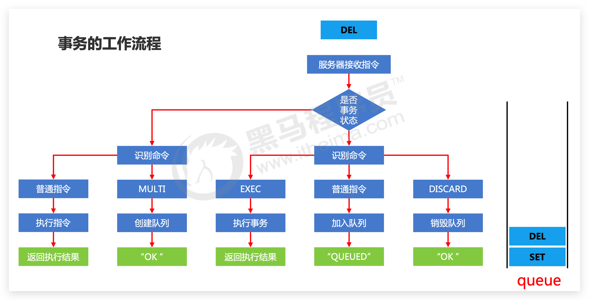

# 事务&锁

## 事务

### 什么是事务

**Redis 事务就是一个命令执行的队列**，将一系列预定义命令包装成一个整体（一个**队列**）。当执行时，一次性按照添加顺序依次执行，中间不会被打断或者干扰。一个队列中，一次性、顺序性、排他性的执行一系列命令。

### 事务的基本操作

```
multi
```

开启事务。作用：设定事务的开启位置，此指令执行后，后续的所有指令均加入到事务中

```
exec
```

执行事务。作用：设定事务的结束位置，同时执行事务。与 multi 成对出现，成对使用

注意：加入事务的命令**暂时进入到任务队列中**，并没有立即执行，只有执行 exec 命令才开始执行

```
discard
```

取消事务。作用：终止当前事务的定义，发生在 multi 之后，exec 之前

### 事务的工作流程



### 事务的注意事项

定义事务的过程中，命令格式及**语法输入错误**怎么办？

- 语法错误：指命令书写格式有误
- 处理结果：如果定义的事务中所包含的命令存在语法错误，**整体事务中所有命令均不会执行**，**包括那些语法正确的命令**

定义事务的过程中，命令执**行出现错误**怎么办?

- 运行错误：指命令格式正确，但是无法正确的执行。例如对 list 进行 incr 操作

- 处理结果：**能够正确运行的命令会执行，运行错误的命令不会被执行**

  注意：**已经执行完毕的命令对应的数据不会自动回滚，需要程序员自己在代码中实现回滚**。

### 手动进行事务回滚

- 记录操作过程中被影响的数据之前的状态
  - 单数据：string
  - 多数据：hash、list、set、zset
- 设置指令恢复所有的被修改的项
  - 单数据：直接 set（注意周边属性，例如时效）
  - 多数据：修改对应值或整体克隆复制


## 基于特定条件的事务执行—锁

业务场景

天猫双11热卖过程中，对已经售罄的货物追加补货，4个业务员都有权限进行补货。补货的操作可能是一系 列的操作，牵扯到多个连续操作，如何保障不会重复操作?

业务分析

*   多个客户端有可能**同时操作同一组数据，并且该数据一旦被操作修改后，将不适用于继续操作**

*   在**操作之前锁定要操作的数据**，一旦发生变化，终止当前操作

解决方案

*   对 key 添加监视锁，在执行exec前如果key发生了变化，终止事务执行

    ```
    watch key1 [key2......]
    ```

*   取消对所有 key 的监视

    ```
    unwatch
    ```

```
set name conan
set age 18

watch name
muti
set name conanan
set age 188
---还未执行exec时，被其他client修改了name. set name ccc
exec --此时返回nil
unwatch -- 手动unwatch
```

场景：redis 应用基于状态控制的批量任务执行


## 基于特定条件的事务执行—分布式锁 🔥

业务场景

天猫双11热卖过程中，对已经售罄的货物追加补货，且补货完成。客户购买热情高涨，3秒内将所有商品购 买完毕。本次补货已经将库存全部清空，如何避免**最后一件商品**不被多人同时购买?【**超卖**问题】

业务分析

*   使用watch监控一个key有没有改变已经不能解决问题，此处要监控的是**具体数据**
*   虽然redis是单线程的，但是多个客户端对同一数据同时进行操作时，如何避免不被同时修改?

解决方案

*   使用 setnx 设置一个**公共锁，必须是同一把锁**

    ```
    setnx lock-key value
    ```

    利用setnx命令的返回值特征，有值则返回设置失败，无值则返回设置成功

    *   对于返回设置成功的，拥有控制权，进行下一步的具体业务操作
    *   对于返回设置失败的，不具有控制权，排队或等待

*   操作完毕通过del操作释放锁

注意：上述解决方案是一种设计概念，依赖规范保障，具有风险性

场景：redis 应用基于分布式锁对应的场景控制


## 基于特定条件的事务执行——分布式锁改良 🔥

业务场景

依赖分布式锁的机制，某个用户操作时对应客户端宕机，且此时已经获取到锁。如何解决?

业务分析

*   由于**锁操作由用户控制加锁解锁**，**必定会存在加锁后未解锁的风险**
*   需要解锁操作不能仅依赖用户控制，**系统级别要给出对应的保底处理方案**

解决方案

*   使用 expire 为锁key添加时间限定，到时不释放，放弃锁

    ```
    expire lock-key second 
    pexpire lock-key milliseconds
    ```

    由于操作通常都是微秒或毫秒级，因此该锁定时间不宜设置过大。具体时间需要业务测试后确认

    *   例如：持有锁的操作最长执行时间127ms，最短执行时间7ms。
    *   测试百万次最长执行时间对应命令的最大耗时，测试百万次网络延迟平均耗时
    *   锁时间设定推荐：最大耗时*120%+平均网络延迟*110%
    *   如果业务最大耗时<<网络平均延迟，通常为2个数量级，取其中单个耗时较长即可


