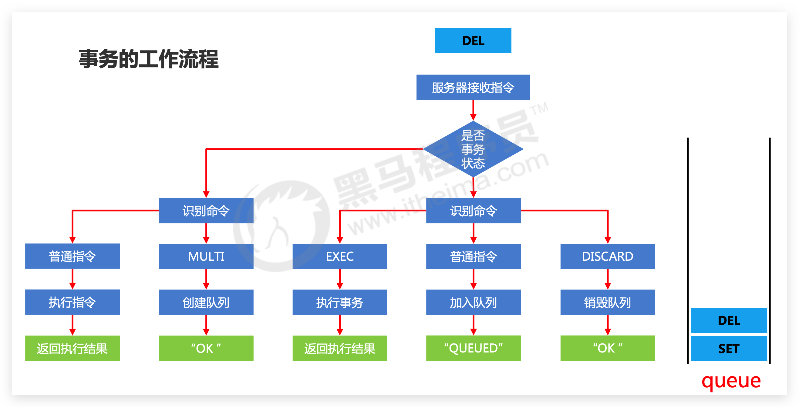

# 流水线 & 事务 & 锁

## 流水线

在一般情况下，用户每执行一个Redis命令，Redis客户端和Redis服务器就需要执行以下步骤：

1.  客户端向服务器发送命令请求。
2.  服务器接收命令请求，并执行用户指定的命令调用，然后产生相应的命令执行结果。
3.  服务器向客户端返回命令的执行结果。
4.  客户端接收命令的执行结果，并向用户进行展示

与大多数网络程序一样，执行Redis命令所消耗的大部分时间都用在了发送命令请求和接收命令结果上面：Redis服务器处理一个命令请求通常只需要很短的时间，但客户端将命令请求发送给服务器以及服务器向客户端返回命令结果的过程却需要花费不少时间。通常情况下，程序需要执行的Redis命令越多，它需要进行的网络通信操作也会越多，程序的执行速度也会因此而变慢。

为了解决这个问题，我们可以使用Redis提供的流水线特性：这个特性**允许客户端把任意多条Redis命令请求打包在一起，然后一次性地将它们全部发送给服务器，而服务器则会在流水线包含的所有命令请求都处理完毕之后，一次性地将它们的执行结果全部返回给客户端**。

通过使用流水线特性，我们可以将执行多个命令所需的网络通信次数从原来的N次降低为1次，这可以大幅度地减少程序在网络通信方面耗费的时间，使得程序的执行效率得到显著的提升。

虽然Redis服务器提供了流水线特性，但这个特性还需要客户端支持才能使用。自己看客户端 API。


::: tip 注意

虽然Redis服务器并不会限制客户端在流水线中包含的命令数量，但是却会为**客户端的输入缓冲区**设置默认值为**1GB的体积上限**：当客户端发送的数据量超过这一限制时，Redis服务器将强制关闭该客户端。因此用户在使用流水线特性时，最好不要一下把大量命令或者一些体积非常庞大的命令放到同一个流水线中执行，以免触碰到Redis的这一限制。

:::


## 事务

### 什么是事务

**Redis 事务就是一个命令执行的队列**，将一系列预定义命令包装成一个整体（一个**队列**）。当执行时，一次性按照添加顺序依次执行，中间不会被打断或者干扰。一个队列中，一次性、顺序性、排他性的执行一系列命令。

### 事务的基本操作

```
multi
```

开启事务。作用：设定事务的开启位置，此指令执行后，后续的所有指令均加入到事务中

```
exec
```

执行事务。作用：设定事务的结束位置，同时执行事务。与 multi 成对出现，成对使用

注意：加入事务的命令**暂时进入到任务队列中**，并没有立即执行，只有执行 exec 命令才开始执行

```
discard
```

取消事务。作用：终止当前事务的定义，发生在 multi 之后，exec 之前


### 事务的工作流程




### 事务的注意事项

定义事务的过程中，命令格式及**语法输入错误**怎么办？

- 语法错误：指命令书写格式有误
- 处理结果：如果定义的事务中所包含的命令存在语法错误，**整体事务中所有命令均不会执行**，**包括那些语法正确的命令**

定义事务的过程中，命令执**行出现错误**怎么办?

- 运行错误：指命令格式正确，但是无法正确的执行。例如对 list 进行 incr 操作

- 处理结果：**能够正确运行的命令会执行，运行错误的命令不会被执行**

  注意：**已经执行完毕的命令对应的数据不会自动回滚，需要程序员自己在代码中实现回滚**。


### 手动进行事务回滚

- 记录操作过程中被影响的数据之前的状态
  - 单数据：string
  - 多数据：hash、list、set、zset
- 设置指令恢复所有的被修改的项
  - 单数据：直接 set（注意周边属性，例如时效）
  - 多数据：修改对应值或整体克隆复制


### 流水线、事务区别

*   流水线的作用是将多个命令打包，然后**一并发送**至服务器
*   事务的作用则是将多个命令打包，然后让服务器**一并执行**它们。


## 带锁的事务

### 基于特定条件的事务执行—锁

业务场景

天猫双11热卖过程中，对已经售罄的货物追加补货，4个业务员都有权限进行补货。补货的操作可能是一系 列的操作，牵扯到多个连续操作，如何保障不会重复操作?

业务分析

*   多个客户端有可能**同时操作同一组数据，并且该数据一旦被操作修改后，将不适用于继续操作**

*   在**操作之前锁定要操作的数据**，一旦发生变化，终止当前操作

解决方案

*   **对 key 添加监视锁**，**在执行exec前如果key发生了变化，终止事务执行**

    ```
    watch key1 [key2......]
    ```

*   取消对所有 key 的监视

    ```
    unwatch
    ```

示例：

```
set name conan
set age 18

watch name
muti
set name conanan
set age 188
---还未执行exec时，被其他client修改了name. set name ccc
exec --此时返回nil
unwatch -- 手动unwatch
```

场景：redis 应用基于状态控制的批量任务执行


### 基于特定条件的事务执行—分布式锁 🔥

业务场景

天猫双11热卖过程中，对已经售罄的货物追加补货，且补货完成。客户购买热情高涨，3秒内将所有商品购 买完毕。本次补货已经将库存全部清空，如何避免**最后一件商品**不被多人同时购买?【**超卖**问题】

业务分析

*   使用watch监控一个key有没有改变已经不能解决问题，此处要监控的是**具体数据**
*   虽然redis是单线程的，但是多个客户端对同一数据同时进行操作时，如何避免不被同时修改?

解决方案

*   使用 setnx 设置一个**公共锁，必须是同一把锁**

    ```
    setnx lock-key value
    ```

    **利用setnx命令的返回值特征**，有值则返回设置失败，无值则返回设置成功

    *   对于返回设置成功的，拥有控制权，进行下一步的具体业务操作
    *   对于返回设置失败的，不具有控制权，排队或等待

*   操作完毕通过del操作释放锁

注意：上述解决方案是一种设计概念，依赖规范保障，具有风险性

场景：redis 应用基于分布式锁对应的场景控制


### 基于特定条件的事务执行—分布式锁改良 🔥

业务场景

依赖分布式锁的机制，某个用户操作时对应客户端宕机，且此时已经获取到锁。如何解决?

业务分析

*   由于**锁操作由用户控制加锁解锁**，**必定会存在加锁后未解锁的风险**
*   需要解锁操作不能仅依赖用户控制，**系统级别要给出对应的保底处理方案**

解决方案

*   **使用 expire 为锁key添加时间限定**，到时不释放，放弃锁

    ```
    expire lock-key second 
    pexpire lock-key milliseconds
    ```

    由于操作通常都是微秒或毫秒级，因此该锁定时间不宜设置过大。具体时间需要业务测试后确认

    *   例如：持有锁的操作最长执行时间127ms，最短执行时间7ms。
    *   测试百万次最长执行时间对应命令的最大耗时，测试百万次网络延迟平均耗时
    *   锁时间设定推荐：最大耗时*120%+平均网络延迟*110%
    *   如果业务最大耗时<<网络平均延迟，通常为2个数量级，取其中单个耗时较长即可


