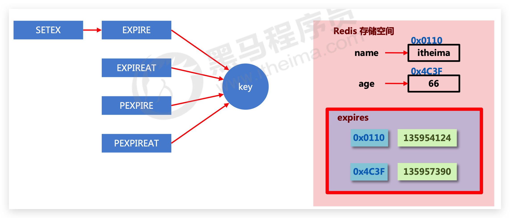
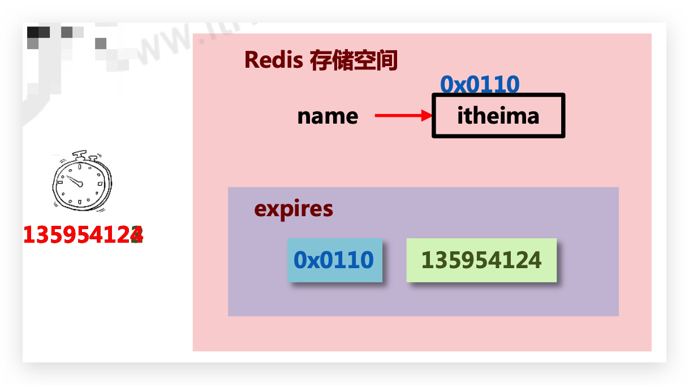
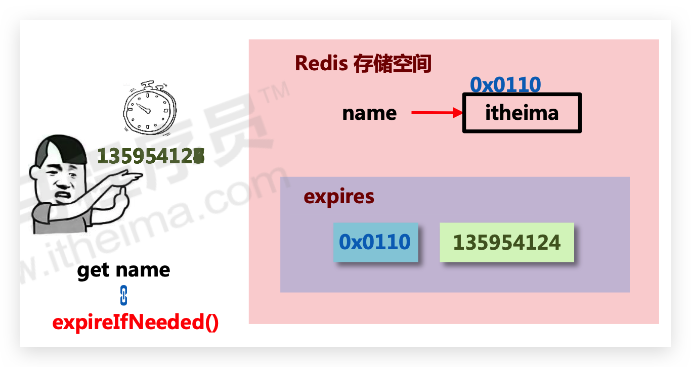
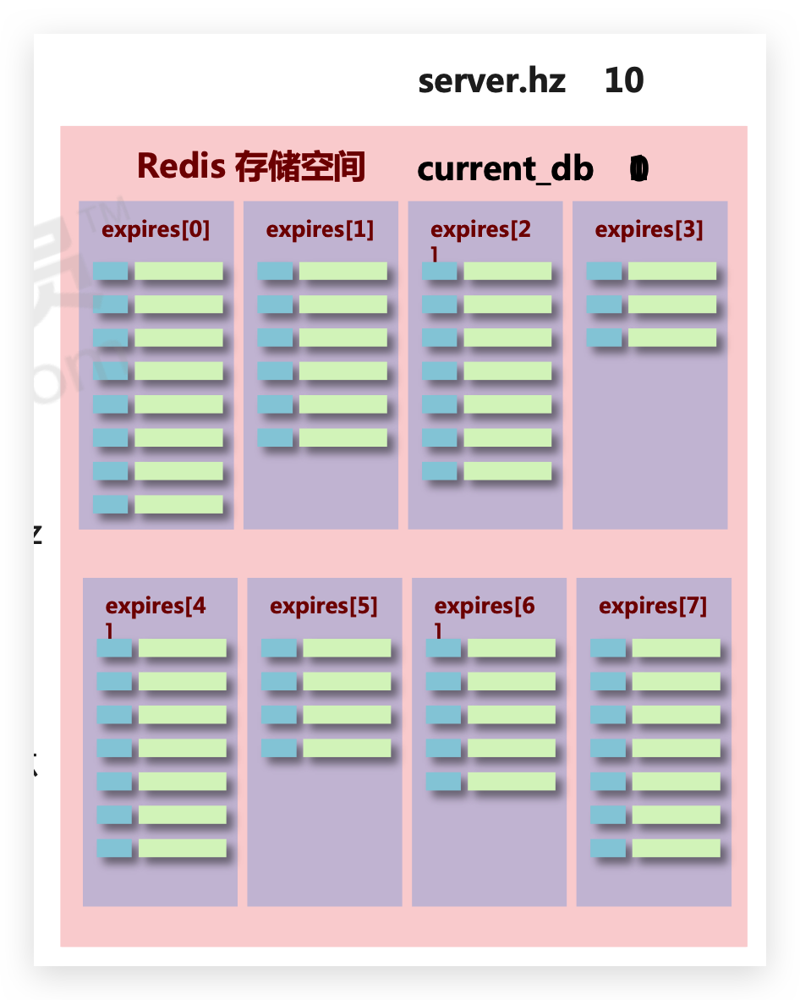
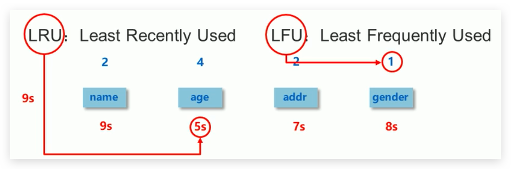

# 过期键删除、逐出策略

## 🔥EXPIRE / PEXPIRE 设置、更新生存时间

```bash
expire key seconds
pexpire key milliseconds
```

EXPIRE命令和PEXPIRE命令在生存时间设置成功时返回1；如果用户给定的键并不存在，那么命令返回0表示设置失败。

对一个已经带有生存时间的键执行EXPIRE命令或PEXPIRE命令时，键原有的生存时间将会被**移除**，并**设置新的生存时间**

注意：

SET 命令有 EX、PX 选项，无需再使用 SETEX、SETPX、EXPIRE（即使是更新，也无需使用）

可以减少命令的调用数量并提升程序的执行速度之外，更重要的是保证了操作的原子性，使得“为键设置值”和“为键设置生存时间”这两个操作可以一起执行。当然后续可以通过事务来解决！


## 🔥EXPIREAT / PEXPIREAT 设置、更新过期时间

```bash
expireat key timestamp
pexpireat key milliseconds-timestamp
```

通过设置过期时间（expire time），让Redis在指定UNIX时间来临之后自动移除给定的键

*   EXPIREAT命令接受一个键和一个秒级精度的UNIX时间戳为参数，当系统的当前UNIX时间超过命令指定的UNIX时间时，给定的键就会被移除
*   PEXPIREAT命令接受一个键和一个毫秒级精度的UNIX时间戳为参数，当系统的当前UNIX时间超过命令指定的UNIX时间时，给定的键就会被移除


## 自动过期特性的不足之处

EXPIRE、PEXIRE、EXPIREAT、PEXPIREAT，它们都只能对整个键进行设置，而无法对键中的某个元素进行设置，比如，用户只能对整个集合或者整个散列设置生存时间/过期时间，但是却无法为集合中的某个元素或者散列中的某个字段单独设置生存时间/过期时间，这也是目前Redis的自动过期功能的一个缺陷


## 🔥TTL / PTTL 获取键的剩余生存时间

```bash
ttl key
pttl key
```

TTL命令将以秒为单位返回键的剩余生存时间；PTTL命令则会以毫秒为单位返回键的剩余生存时间

*   如果给定的**键存在**，但是并**没有设置生存时间或者过期时间**，即**永久存在**，那么TTL命令和PTTL命令将**返回-1**

*   如果给定的键**已经过期、被删除、未定义**，即**键并不存在**、，那么TTL命令和PTTL命令将**返回-2**

    注意：**过期的键不会立刻被删除**！但理论上就是不存在！

TTL命令的精度问题

出现这种情况的原因在于TTL命令只能返回秒级精度的生存时间，所以当给定键的剩余生存时间不足1s时，TTL命令只能返回0作为结果。这时，如果使用精度更高的PTTL命令去检查这些键，就会看到它们实际的剩余生存时间


## 🔥过期键删除策略

### 🔥时效性数据的存储结构



**数据库键的过期时间都保存在过期字典中，如上图**

数据删除策略的目标：在内存占用与CPU占用之间寻找一种**平衡**，不是为了立刻删除数据，顾此失彼都会造成整体redis性能的下降，甚至引发服务器宕机或内存泄露


### 定时（器）删除

*   创建一个**定时器**，当key设置有过期时间，且过期时间到达时，由定时器任务立即执行对键的删除操作
*   优点：节约内存，到时就删除，快速释放掉不必要的内存占用
*   缺点：CPU压力很大，无论CPU此时负载量多高，均占用CPU，会影响redis服务器响应时间和指令吞吐量
*   总结：用**处理器性能换取存储空间**（**拿时间换空间**）




### 🔥惰性删除

*   数据到达过期时间，不做处理。等**下次访问该数据时**
    *   如果未过期，返回数据
    *   **发现已过期，删除，返回不存在**
*   优点：节约CPU性能，发现必须删除的时候才删除
*   缺点：**内存压力很大**，出现长期占用内存的数据
*   总结：**用存储空间换取处理器性能**（**拿空间换时间**）




### 🔥定期删除

上述2种方案的折中方案：

*   Redis启动服务器初始化时，读取配置`server.hz`的值，默认为10
*   每秒钟执行`server.hz`次`serverCron()`—>`databasesCron()`—>`activeExpireCycle()`
*   `activeExpireCycle()`对每个`expires[x]`逐一进行检测，每次执行`250ms/server.hz`
*   对某个expires[x]检测时，随机挑选W个key检测
    *   如果key超时，删除key（类似惰性删除）
    *   如果一轮中删除的key的数量>W
    *   如果一轮中删除的key的数量≤W*25%，检查下一个expires[x]，0-15循环
    *   W取值=ACTIVE_EXPIRE_CYCLE_LOOKUPS_PER_LOOP属性值
*   参数`current_db`用于记录`activeExpireCycle()`进入哪个`expires[x]` 执行
*   如果`activeExpireCycle()`执行时间到期，下次从`current_db`继续向下执行



总结：

*   概念：周期性轮询redis库中的时效性数据，采用随机抽取的策略，利用过期数据占比的方式控制删除频度
*   特点1:CPU性能占用设置有峰值，检测频度可自定义设置
*   特点2:内存压力不是很大，长期占用内存的冷数据会被持续清理
*   总结:周期性抽查存储空间(随机抽查，重点抽查)


### 🔥对比总结

*   定时删除
    *   节约内存，无占用 
    *   不分时段占用CPU资源，频度高 
    *   拿时间换空间
*   惰性删除
    *   内存占用严重 
    *   延时执行，CPU利用率高 
    *   拿空间换时间
*   定期删除 
    *   内存定期随机清理 
    *   每秒花费固定的CPU资源维护内存 
    *   随机抽查，重点抽查

Redis服务器实际使用的是**惰性删除**和**定期删除**两种策略：通过**配合**使用这两种删除策略，服务器可以很好地在合理使用CPU时间和避免浪费内存空间之间取得**平衡**


## 🔥逐出策略

### 新数据进入检测

当新数据进入redis时，如果内存不足怎么办?

*   Redis使用内存存储数据，在执行每一个命令前，会调用`freeMemoryIfNeeded()`**检测内存是否充足**。如果内存不满足新加入数据的最低存储要求，redis要**临时删除一些数据为当前指令清理存储空间**。清理数据的策略称为逐出算法。

*   注意：逐出数据的过程**不是100%能够清理出足够的可使用的内存空间**，如果**不成功则反复执行**。当**对所有数据尝试完毕后，如果还不能达到内存清理的要求，将出现错误信息**。

    ```
    (error) OOM command not allowed when used memory >'maxmemory'
    ```

    

### 影响数据逐出的相关配置

*   最大可使用内存

    占用物理内存的比例，默认值为0，表示不限制。生产环境中根据需求设定，通常设置在50%以上。

    ```
    maxmemory
    ```

*   每次选取待删除数据的个数

    选取数据时并不会全库扫描，导致严重的性能消耗，降低读写性能。因此采用随机获取数据的方式作为待检测删除数据

    ```
    maxmemory-samples
    ```

*   **删除策略**

    达到最大内存后的，对被挑选出来的数据进行删除的策略。如下**8种策略**

    ```
    maxmemory-policy
    ```


### 🔥8种逐出策略

*   检测**易失数据**(可能会过期的数据集server.db[i].expires )

    *   volatile-lru:挑选最近最少使用的数据淘汰。推荐！🔥

    *   volatile-lfu:挑选最近使用次数最少的数据淘汰

        

    *   volatile-ttl:挑选将要过期的数据淘汰

    *   volatile-random:任意选择数据淘汰

*   检测**全库数据**(所有数据集server.db[i].dict )

    *   allkeys-lru:挑选最近最少使用的数据淘汰
    *   allkeys-lfu:挑选最近使用次数最少的数据淘汰
    *   allkeys-random:任意选择数据淘汰

*   **放弃数据驱逐**

    *   no-enviction(驱逐)：**禁止驱逐数据**(redis4.0中默认策略)，会引发错误OOM(Out Of Memory)


::: tip

使用INFO命令输出监控信息，查询缓存 hit 和 miss 的次数，根据业务需求调优Redis配置

:::


## PERSIST 时效转永久

```bash
persist key
```


