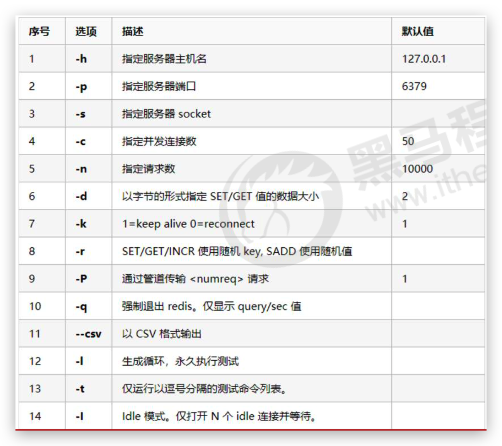

# 企业级解决方案

## 缓存雪崩—大量key

### 数据库服务器崩溃—1

1. 系统平稳运行过程中，忽然数据库连接量激增
2. 应用服务器无法及时处理请求
3. 大量408，500错误页面出现
4. 客户反复刷新页面获取数据
5. 数据库崩溃
6. 应用服务器崩溃
7. 重启应用服务器无效
8. Redis服务器崩溃
9. Redis集群崩溃
10. 重启数据库后再次被瞬间流量放倒

### 问题排查

1. 在一个**较短**的时间内，缓存中**较多**的key**集中过期（或本来就没有缓存到）**
2. 此周期内请求访问过期的数据，redis未命中，redis向数据库获取数据
3. 数据库同时接收到大量的请求无法及时处理
4. Redis大量请求被积压，开始出现超时现象
5. 数据库流量激增，数据库崩溃
6. 重启后仍然面对缓存中无数据可用
7. Redis服务器资源被严重占用，Redis服务器崩溃
8. Redis集群呈现崩塌，集群瓦解
9. 应用服务器无法及时得到数据响应请求，来自客户端的请求数量越来越多，应用服务器崩溃
10. 应用服务器，redis，数据库全部重启，效果不理想

### 问题分析

* 短时间范围内
* 大量key集中过期

### 解决方案（道）

* 更多的页面静态化处理
* 构建多级缓存架构

  Nginx缓存+redis缓存+ehcache缓存
* 检测Mysql严重耗时业务进行优化

  对数据库的瓶颈排查：例如超时查询、耗时较高事务等
* 灾难预警机制：监控redis服务器性能指标

  * CPU占用、CPU使用率
  * 内存容量
  * 查询平均响应时间
  * 线程数
* 限流、降级

  短时间范围内牺牲一些客户体验，限制一部分请求访问，降低应用服务器压力，待业务低速运转后再逐步放开访问

### 解决方案（术）

* LRU与LFU切换
* 数据有效期策略调整

  * 根据业务数据有效期进行**分类错峰**，A类90分钟，B类80分钟，C类70分钟
  * 过期时间使用**固定时间+随机值**的形式，稀释集中到期的key的数量 3. 超热数据使用永久key
* 定期维护(自动+人工)

  对即将过期数据做访问量分析，确认是否延时，配合访问量统计，做热点数据的延时
* 加锁（如单机锁、分布式锁），防止被击穿，但是要注意也是性能瓶颈，慎重！Redis 使用 -nx **加锁**，虽然高并发 Redis 请求都查询不到，但是只有一个能使用 -nx 获取到锁，才能获得 DB 的访问权限（并更新 Redis，释放锁），其他的请求 sleep 等待后下次先查询 Redis（或直接返回）！由此**过滤了无效请求**

### 总结

缓存雪崩就是瞬间过期数据量太大，导致对数据库服务器造成压力。如能够有效避免过期时间集中，可以有效解决雪崩现象的出现 (约40%)，配合其他策略一起使用，并监控服务器的运行数据，根据运行记录做快速调整。

## 缓存击穿—单个key

### 数据库服务器崩溃—2

1. 系统平稳运行过程中
2. 数据库连接量瞬间激增
3. Redis服务器无大量key过期 4. Redis内存平稳，无波动
4. Redis服务器CPU正常
5. 数据库崩溃

### 问题排查

* Redis中某个key过期，该key访问量巨大
* 多个数据请求从服务器直接压到Redis后，均未命中
* Redis在短时间内发起了大量对数据库中同一数据的访问

### 问题分析

* 单个key高热数据
* key过期

### 解决方案（术）

* 预先设定 以电商为例，每个商家根据店铺等级，指定若干款主打商品，在购物节期间，加大此类信息key的过期时长

  注意:购物节不仅仅指当天，以及后续若干天，访问峰值呈现逐渐降低的趋势
* 现场调整

  监控访问量，对自然流量激增的数据延长过期时间或设置为永久性key
* 后台刷新数据

  启动定时任务，高峰期来临之前，刷新数据有效期，确保不丢失
* 二级缓存

  设置不同的失效时间，保障不会被同时淘汰就行
* 加锁（如单机锁、分布式锁），防止被击穿，但是要注意也是性能瓶颈，慎重！Redis 使用 -nx **加锁**，虽然高并发 Redis 请求都查询不到，但是只有一个能使用 -nx 获取到锁，才能获得 DB 的访问权限（并更新 Redis，释放锁），其他的请求 sleep 等待后下次先查询 Redis（或直接返回）！由此**过滤了无效请求**

### 总结

缓存击穿就是单个高热数据过期的瞬间，数据访问量较大，未命中redis后，发起了大量对同一数据的数据库访问，导致对数据库服务器造成压力。应对策略应该在业务数据分析与预防方面进行，配合运行监控测试与即时调整策略，毕竟单个key的过期监控难度较高，配合雪崩处理策略即可。

## 缓存穿透—没有的key—网警

### 数据库服务器崩溃—3

1. 系统平稳运行过程中
2. 应用服务器流量随时间增量较大
3. Redis服务器命中率随时间逐步降低
4. Redis内存平稳，内存无压力
5. Redis服务器CPU占用激增
6. 数据库服务器压力激增
7. 数据库崩溃

### 问题排查

* Redis中**大面积出现未命中**
* 出现**非正常URL访问**

### 问题分析

* 获取的数据在**数据库中也不存在**，数据库查询未得到对应数据
* **Redis获取到null数据未进行持久化，直接返回**
* 下次此类数据到达重复上述过程
* 出现黑客攻击服务器
* 注意：Redis 服务端缓冲区的存在，在**高并发 Redis 请求到达**时（比如30个）都**没有找到该 key**（写缓存是在业务中，需要查询数据库，需要时间的！），此时业务代码中会查询数据库，由于高并发，所以此时大量请求都命中到 DB 上，导致 DB 崩溃

### 解决方案（术）

* 加锁（如单机锁、分布式锁），防止被击穿，但是要注意也是性能瓶颈，慎重！Redis 使用 -nx **加锁**，虽然高并发 Redis 请求都查询不到，但是只有一个能使用 -nx 获取到锁，才能获得 DB 的访问权限（并更新 Redis，释放锁），其他的请求 sleep 等待后下次先查询 Redis（或直接返回）！由此**过滤了无效请求**
* 缓存null值

  **对查询结果为null的数据进行缓存**(长期使用，定期清理)，设定短时限，例如30-60秒，最高5分钟。但是如果**大量 null 值占用空间，则该用布隆过滤器即可**
* 白名单策略

  * 提前预热各种分类数据id对应的bitmaps，id作为bitmaps的offset，相当于设置了数据白名单。当加载正常数据时，放行，加载异常数据时直接拦截(**效率偏低**)
  * 使用**布隆过滤器**(有关布隆过滤器的命中问题对当前状况可以忽略)
* 实施监控

  实时监控redis命中率(业务正常范围时，通常会有一个波动值)与null数据的占比

  * 非活动时段波动:通常检测3-5倍，超过5倍纳入重点排查对象
  * 活动时段波动:通常检测10-50倍，超过50倍纳入重点排查对象

    根据倍数不同，启动不同的排查流程。然后使用黑名单进行防控(运营)
* key加密

  问题出现后，临时启动防灾业务key，对key进行业务层传输加密服务，设定校验程序，过来的key校验

  例如每天随机分配60个加密串，挑选2到3个，混淆到页面数据id中，发现访问key不满足规则，驳回数据访问

### 总结

缓存击穿访问了不存在的数据，跳过了合法数据的redis数据缓存阶段，每次访问数据库，导致对数据库服务器造成压力。通常此类 数据的出现量是一个较低的值，当出现此类情况以毒攻毒，并及时**报警**。应对策略应该在临时预案防范方面多做文章。

无论是黑名单还是白名单，都是对整体系统的压力，警报解除后尽快移除。


## 缓存预热

### 宕机

**Redis 服务器启动后迅速宕机**

### 问题排查

特别是 Redis 里没有数据时

* 请求数量较高
* 主从之间数据吞吐量较大，数据同步操作频度较高

### 解决方案

前置准备工作:

* 日常例行统计数据访问记录，统计访问频度较高的热点数据
* 利用LRU数据删除策略，构建数据留存队列

  例如：storm与kafka配合

准备工作:

* 将统计结果中的数据分类，根据级别，redis优先加载级别较高的热点数据
* 利用分布式多服务器同时进行数据读取，提速数据加载过程
* 热点数据主从同时预热

实施:

* 使用脚本程序固定触发数据预热过程
* 如果条件允许，使用了CDN(内容分发网络)，效果会更好

### 总结

缓存预热就是**系统启动前**，提前**将相关的缓存数据直接加载到缓存系统**。避免在用户请求的时候，先查询数据库，然后再将数据缓 存的问题!用户直接查询事先被预热的缓存数据!


### 布隆过滤器 🔥—未完

## 性能指标监控

### 性能指标:Performance


### 内存指标:Memory


### 基本活动指标:Basic activity


### 持久性指标:Persistence


### 错误指标:Error


## 监控方式

### 工具

* Cloud Insight Redis
* Prometheus
* Redis-stat
* Redis-faina
* RedisLive
* zabbix

### 命令 🔥

* benchmark
* redis cli

  * monitor
  * showlog

### benchmark

命令

```
src/redis-benchmark [-h ] [-p ] [-c ] [-n <requests]> [-k ]
```

范例1。说明:50个连接，10000次请求对应的性能

```
src/redis-benchmark
```

范例2。说明:100个连接，5000次请求对应的性能

```
src/redis-benchmark -c 100 -n 5000
```



### monitor

命令。进入 redis-cli 后

```
monitor
```

打印服务器调试信息

### showlong

命令

```
showlong [operator]
```

* get :获取慢查询日志
* len :获取慢查询日志条目数
* reset :重置慢查询日志

相关配置

```
slowlog-log-slower-than 1000 #设置慢查询的时间下线，单位:微妙 
slowlog-max-len 100 #设置慢查询命令对应的日志显示长度，单位:命令数
```