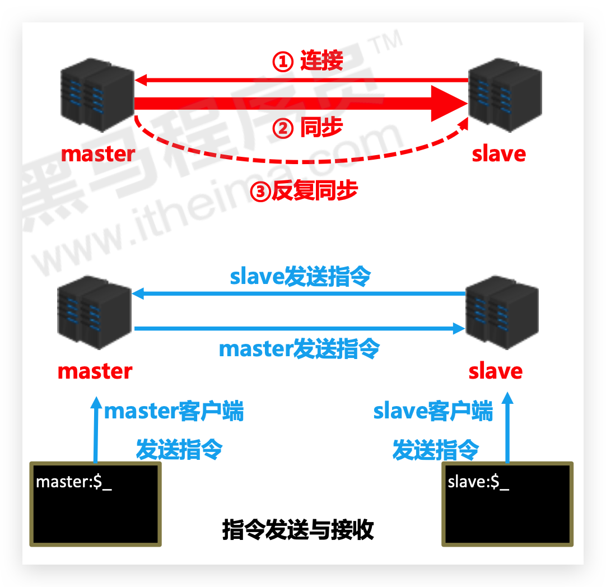
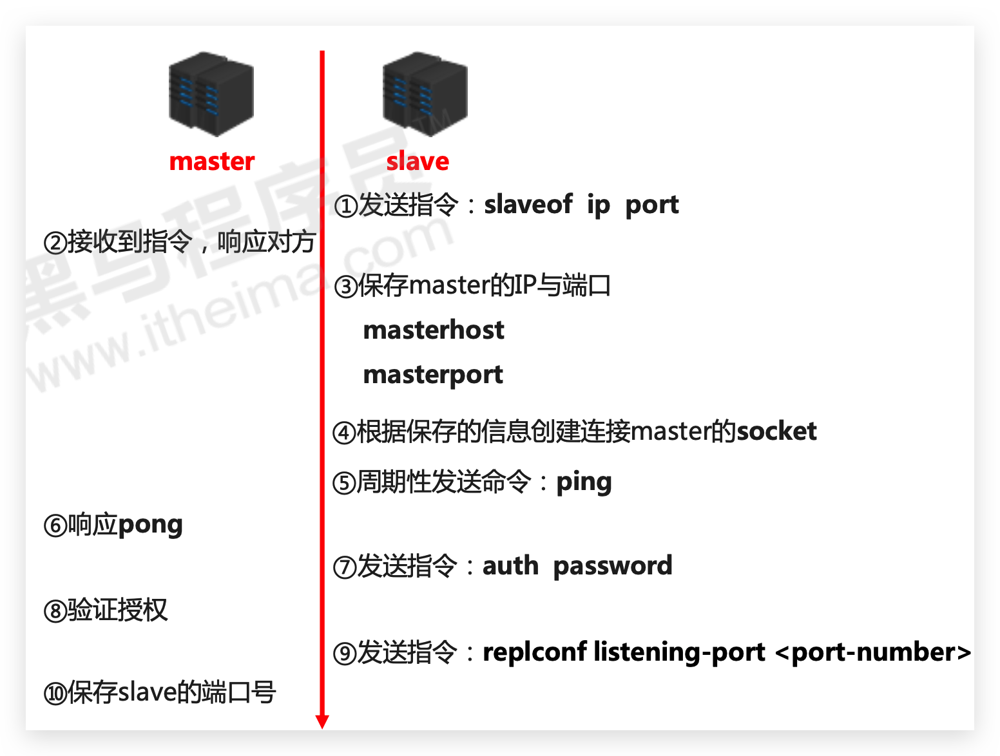
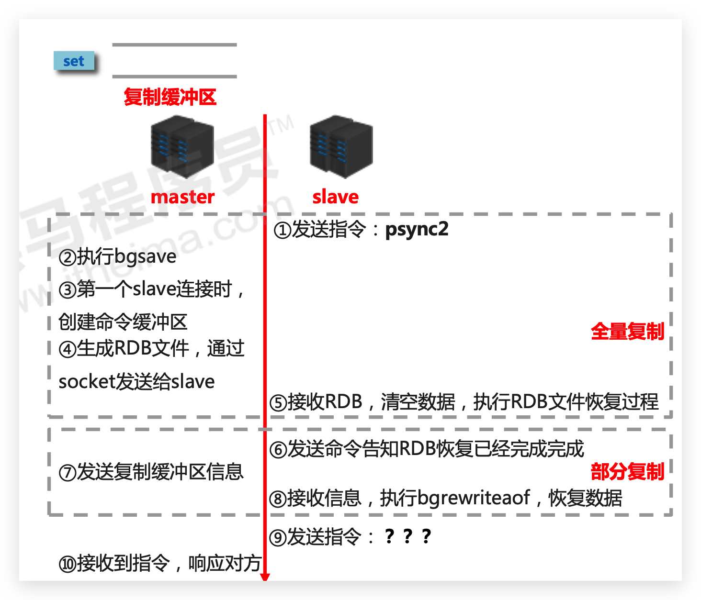
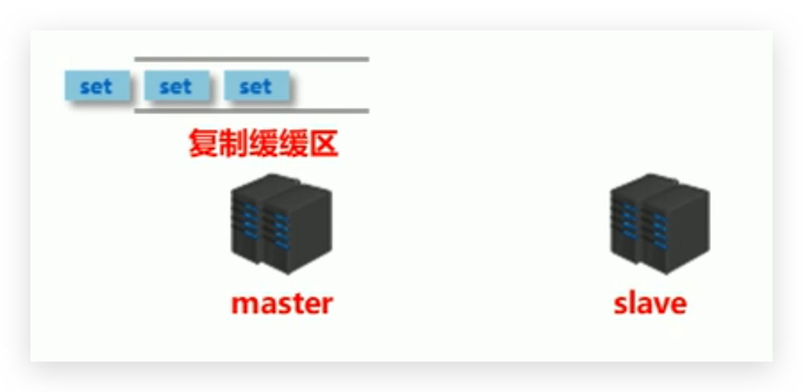
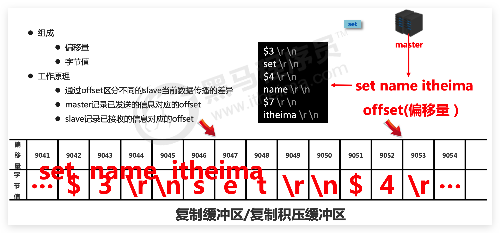
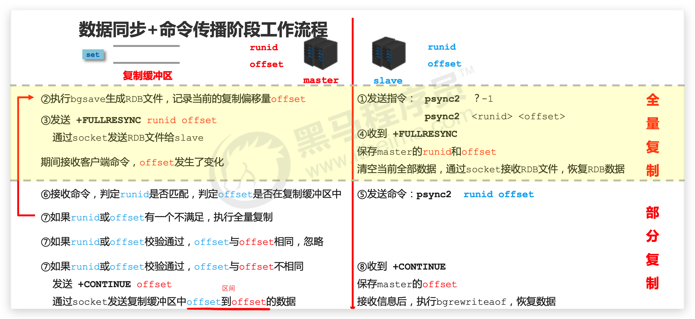
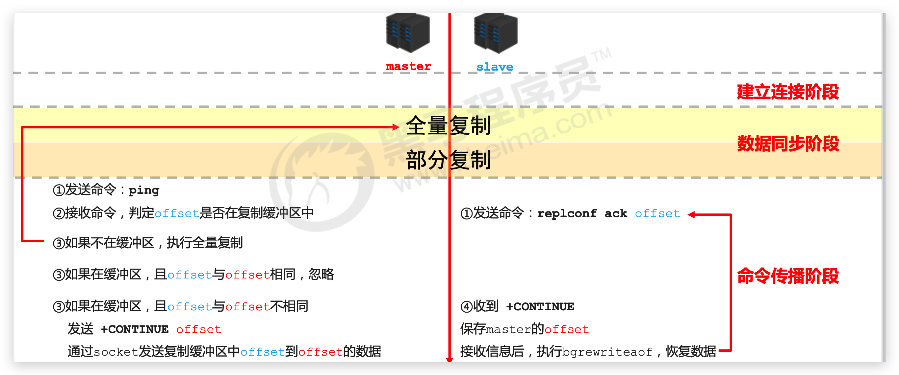

# 主从复制—高可用

## 问题 & 解决方案

### 单机 Redis 的风险与问题

- 机器故障

  - 现象：硬盘故障、系统崩溃
  - 本质：数据丢失，很可能对业务造成灾难性打击
- 容量瓶颈

  - 现象：内存不足，从 16G 升级到 64G，从 64G 升级到 128G，无限升级内存
  - 本质：穷，硬件条件跟不上
- 结论

  为了避免单点 Redis 服务器故障，准备多台服务器，互相连通。将数据**复制多个副本保存在不同的服务器上**，**连接在一起**，并保证数据是**同步**的。即使有其中一台服务器宕机，其他服务器依然可以继续 提供服务，实现 Redis 的高可用，同时实现数据**冗余备份**。

### 多台服务器连接方案

- master：提供数据方，主服务器，主节点，主库，主客户端
- slave：接收数据方，从服务器，从节点，从库，从客户端
- 需要解决的问题：数据同步
- 核心工作：**master 的数据复制到 slave 中**

## 主从复制

### 简介

主从复制即**将 master 中的数据即时、有效的复制到 slave 中**

一个 master 可以拥有多个 slave，一个 slave 只对应一个 master。一对多。

master 职责：

- **写数据**
- 执行**写操作时**，将**出现变化的数据自动同步到 slave**
- 读数据（可忽略）

slave 职责：

- **读数据**
- 写数据（禁止）

### 作用

- **读写分离**：master 写、slave 读，提高服务器的读写负载能力
- **负载均衡**：基于主从结构，配合读写分离，由 slave 分担 master 负载，并根据需求的变化，改变 slave 的数量，通过多个从节点分担数据读取负载，大大提高 Redis 服务器并发量与数据吞吐量
- **故障恢复**：当 master 出现问题时，由 slave 提供服务，实现快速的故障恢复
- **数据冗余**：实现**数据热备份**，是持久化之外的一种数据冗余方式
- **高可用基石**：基于主从复制，构建哨兵模式与集群，实现 Redis 的高可用方案

### 流程总述 🔥

主从复制过程大体可以分为 3 个阶段：

- 建立连接阶段（即准备阶段）：**slave 连接 master**
- 数据同步阶段：同步
- 命令传播阶段：反复同步



## 主从复制流程—建立连接

### 流程介绍

**建立 slave 到 master 的连接**，使 master 能够识别 slave，并**保存 slave 的端口号**



1. **设置 master 的地址和端口，并保存 master 的各种信息**
2. **建立 socket 连接**
3. 发送 ping 命令(定时器任务)
4. 身份验证（由于 Redis 一般不对外开放，所以可以不设置外网访问以及身份认证）
5. **master 保存 slave 的端口号**

### 实践

可以使用如下配置，关掉日志，并前台运行，方便查看

```
daemonize no
#logfile "6379.log"
```

**slave 连接 master**（如下操作都是在 slave 客户端或服务器进行）：

方式 1：客户端发送命令

```
slaveof <masterip> <masterport>
```

方式 2：启动服务器参数

```
redis-server -slaveof <masterip> <masterport>
```

方式 3：**服务器配置**

```
slaveof <masterip> <masterport>
```

最后可以通过`info`指令查看信息

```
# slave

master_link_down_since_seconds
masterhost
masterport
```

```
# master

slave_listening_port(多个)
```

主动断开连接（客户端发送命令）：

```
slaveof no one
```

注意：slave 断开连接后，**不会删除已有数据**，只是**不再接受 master 发送的数据**

### 授权访问

服务端：

- master 客户端发送命令设置密码

  ```
  requirepass <password>
  ```
- **master 配置文件设置密码**

  ```
  config set requirepass <password>
  config get requirepass
  ```

客户端：

- slave 客户端发送命令设置密码

  ```
  auth <password>
  ```
- slave 启动服务器设置密码

  ```
  redis-server –a <password>
  ```
- **slave 配置文件设置密码**

  ```
  masterauth <password>
  ```

## 主从复制流程—数据同步

### 流程介绍

在 slave 初次连接 master 后，复制 master 中的所有数据到 slave。并将 slave 的数据库状态更新成 master 当前的数据库状态。



1. 请求同步数据
2. 创建 RDB 同步数据
3. 恢复 RDB 同步数据
4. 请求部分同步数据
5. 恢复部分同步数据。至此，数据同步工作完成!

此时状态：

- slave：具有 master 端全部数据，包含 RDB 过程接收的数据
- master：**保存 slave 当前数据同步的位置**

### 数据同步阶段 master 说明

- 如果 master 数据量巨大，数据同步阶段应**避开流量高峰期**，避免造成 master 阻塞，影响业务正常执行。如新增 slave 节点
- 复制缓冲区大小设定不合理，会导致数据溢出。如进行全量复制周期太长，进行部分复制时发现数据已经存在丢失的情况，必须进行第二次全量复制，致使 slave 陷入死循环状态。

  ```
  repl-backlog-size 1mb
  ```
- master 单机内存占用主机内存的比例不应过大，建议使用 50%-70%的内存，留下 30%-50%的内存用于执 行 bgsave 命令和创建复制缓冲区

  

### 数据同步阶段 slave 说明

- 为避免 slave 进行全量复制、部分复制时服务器响应阻塞或数据不同步，建议关闭此期间的对外服务

  ```
  slave-serve-stale-data yes|no
  ```
- 数据同步阶段，master 发送给 slave 信息可以理解 master 是 slave 的一个客户端，主动向 slave 发送命令
- 多个 slave 同时对 master 请求数据同步，master 发送的 RDB 文件增多，会对带宽造成巨大冲击，如果 master 带宽不足，因此数据同步需要根据业务需求，适量错峰
- slave 过多时，建议调整拓扑结构，由一主多从结构变为树状结构，中间的节点既是 master，也是 slave。注意使用树状结构时，由于层级深度，导致深度越高的 slave 与最顶层 master 间数据同步延迟 较大，数据一致性变差，应谨慎选择

## 主从复制流程—命令传播阶段

### 简介

- 当 master 数据库状态被修改后，导致主从服务器数据库状态不一致，此时需要让主从数据同步到一致的状态，同步的动作称为命令传播
- master 将接收到的数据变更命令发送给 slave，slave 接收命令后执行命令

### 命令传播阶段的部分复制

命令传播阶段出现了断网现象：

- 网络闪断闪连 忽略
- **短时间**网络中断 **部分复制**
- **长时间**网络中断 **全量复制**

部分复制的三个核心要素：

- 服务器的运行 id（**run id**）
- 主服务器的**复制积压缓冲区**
- 主从服务器的**复制偏移量**

### 服务器运行 ID—runid

- 概念：服务器运行 ID 是每一台服务器每次运行的身份识别码，一台服务器多次运行可以生成多个运行 id
- 组成：运行 id 由**40 位字符**组成，是一个**随机的十六进制字符**。如：fdc9ff13b9bbaab28db42b3d50f852bb5e3fcdce
- 作用：运行 id 被用于在服务器间进行传输，**识别身份**。如果想两次操作均对同一台服务器进行，必须每次操作携带对应的运行 id，用于对方识别
- 实现方式：运行 id 在每台**服务器启动时自动生成**的，**master**在**首次连接 slave**时，会将自己的运行 ID**发送**给 slave，**slave 保存此 ID**，通过 info Server 命令，可以查看节点的 runid

### 复制缓冲区

介绍：

- 复制缓冲区，又名复制积压缓冲区，是一个先进先出(**FIFO**)的队列，用于存储服务器执行过的命令，每次传播命令，master 都会将传播的命令记录下来，并存储在复制缓冲区。**对应 slave 有多少则该缓冲区有多少个**！

  复制缓冲区默认数据存储空间大小是**1M**，由于存储空间大小是固定的，当入队元素的数量大于队列长度时，最先入队的元素会**被弹出**，而新元素会被放入队列
- 由来：每台服务器启动时，如果开启有 AOF 或被连接成为 master 节点，即创建复制缓冲区
- 作用：用于保存 master 收到的所有指令(仅影响数据变更的指令，例如 set，select)
- 数据来源：当 master 接收到主客户端的指令时，除了将指令执行，会将该指令存储到缓冲区中



### 主从服务器复制偏移量—offset

- 概念：一个数字，描述复制缓冲区中的指令字节位置
- 分类：

  - master 复制偏移量：记录发送给所有 slave 的指令字节对应的位置（多个）
  - slave 复制偏移量：记录 slave 接收 master 发送过来的指令字节对应的位置（一个）
- 数据来源

  - master 端：发送一次记录一次
  - slave 端：接收一次记录一次
- 作用：同步信息，比对 master 与 slave 的差异，当 slave 断线后，恢复数据使用

## 数据同步+命令传播阶段工作流程 🔥



## 心跳机制 🔥

### 简介

- 进入命令传播阶段候，master 与 slave 间需要进行信息交换，使用心跳机制进行维护，实现双方连接保持在线
- master 心跳：

  - 指令：PING
  - 周期：由`repl-ping-slave-period`决定，默认 10 秒
  - 作用：判断 slave 是否在线
  - 查询：INFO replication 获取 slave 最后一次**连接时间间隔**，lag 项维持在 0 或 1 视为正常
- slave 心跳任务：

  - 指令：`REPLCONF ACK {offset}`
  - 周期：1 秒
  - 作用 1：汇报 slave 自己的复制偏移量，获取最新的数据变更指令
  - 作用 2：判断 master 是否在线

### 注意

- 当 slave 多数掉线，或延迟过高时，master 为保障数据稳定性，将拒绝所有信息同步操作

  ```
  min-slaves-to-write 2
  min-slaves-max-lag 10
  ```

  **slave 数量少于 2 个**，或者**所有 slave 的延迟都大于等于 10 秒**时，强制关闭 master 写功能，停止数据同步（写没意义）
- slave 数量由 slave 发送 REPLCONF ACK 命令做确认
- slave 延迟由 slave 发送 REPLCONF ACK 命令做确认

## 主从复制工作流程（完整）🔥

建立连接+数据同步见上面的



注意，① 发送的命令在数据同步和命令传播阶段不同

## 常见问题

### 频繁的全量复制1

伴随着系统的运行，master的数据量会越来越大，一旦**master重启，runid将发生变化**，会**导致全部slave的全量复制**操作

内部优化调整方案：

* master内部创建`master_replid`变量，使用runid相同的策略生成，长度41位，并发送给所有slave
* 在master关闭时执行命令 shutdown save，进行RDB持久化，**将runid与offset保存到RDB文件中**

  * repl-id repl-offset
  * 通过redis-check-rdb dump.rdb命令可以查看该信息
* master重启后加载RDB文件，恢复数据。重启后，将RDB文件中保存的repl-id与repl-offset加载到内存中

  * master_repl_id = repl master_repl_offset = repl-offset
  * 通过info命令可以查看该信息

作用：**本机保存上次runid**，重启后恢复该值，使所有slave认为还是之前的master

### 频繁的全量复制2

* 问题现象
  网络环境不佳，出现网络中断，slave不提供服务
* 问题原因

  复制缓冲区过小，断网后slave的offset越界，触发全量复制
* 最终结果

  slave反复进行全量复制
* 解决方案
  修改复制缓冲区大小

  ```
  repl-backlog-size
  ```
* 建议设置如下

  * 测算从master到slave的重连平均时长second
  * 获取master平均每秒产生写命令数据总量write_size_per_second
  * 最优复制缓冲区空间 = 2 * second * write_size_per_second

### 频繁的网络中断1

* 问题现象
  master的CPU占用过高 或 slave频繁断开连接
* 问题原因

  * slave每1秒发送REPLCONF ACK命令到master
  * 当slave接到了慢查询时(keys * ，hgetall等)，会大量占用CPU性能
  * master每1秒调用复制定时函数replicationCron()，比对slave发现长时间没有进行响应
* 最终结果
  master各种资源(输出缓冲区、带宽、连接等)被严重占用
* 解决方案
  通过设置合理的超时时间，确认是否释放slave

  ```
  repl-timeout
  ```

  该参数定义了超时时间的阈值(默认60秒)，超过该值，释放slave

### 频繁的网络中断2

* 问题现象

  slave与master连接断开
* 问题原因

  * master发送ping指令频度较低
  * master设定超时时间较短
  * ping指令在网络中存在丢包
* 解决方案

  提高ping指令发送的频度

  ```
  repl-ping-slave-period
  ```

  **超时时间repl-time的时间至少是ping指令频度的5到10倍，否则slave很容易判定超时**

### 数据不一致

* 问题现象

  多个slave获取相同数据不同步
* 问题原因

  网络信息不同步，数据发送有延迟
* 解决方案

  * 优化主从间的网络环境，通常放置在同一个机房部署，如使用阿里云等云服务器时要注意此现象
  * 监控主从节点延迟(通过offset)判断，如果slave延迟过大，暂时屏蔽程序对该slave的数据访问

    ```
    slave-serve-stale-data yes|no
    ```

    开启后仅响应info、slaveof等少数命令(慎用，除非对数据一致性要求很高)