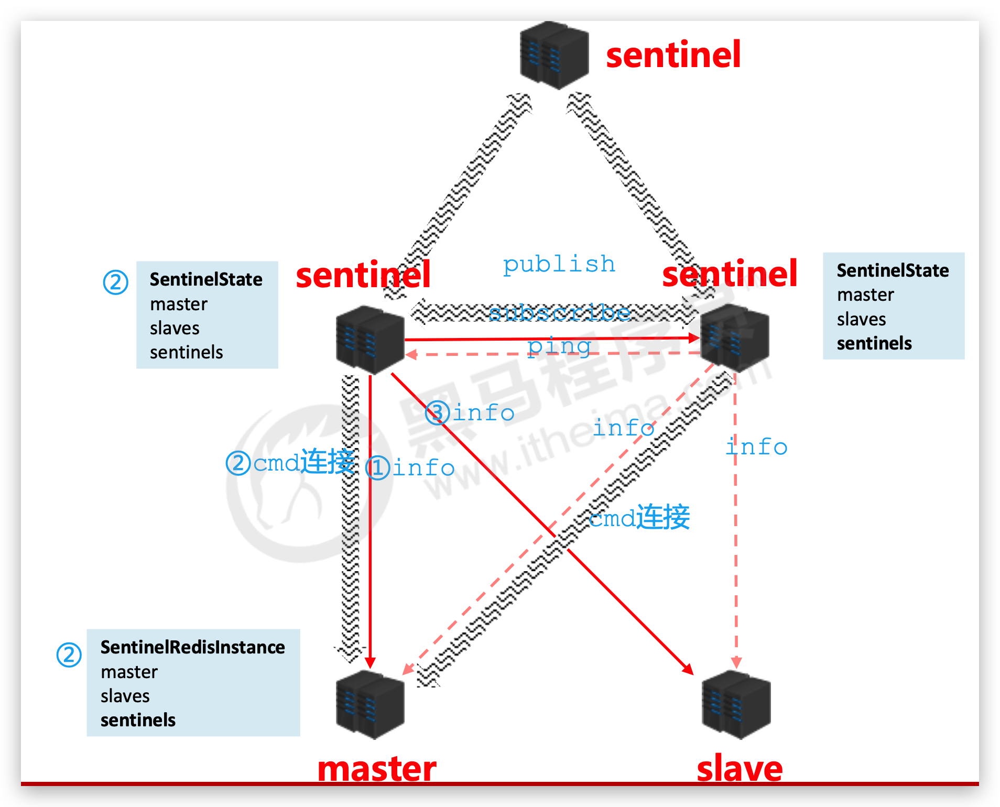
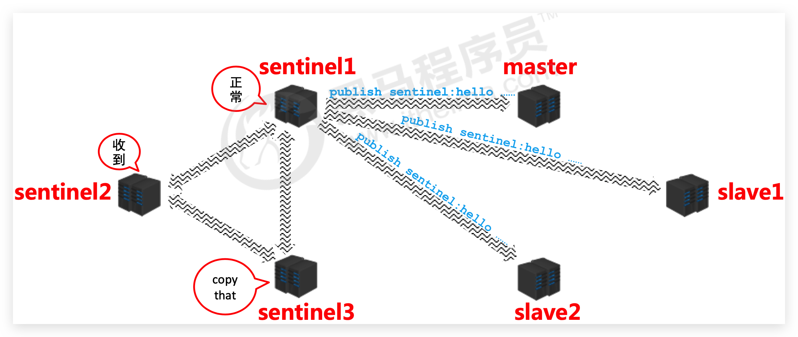
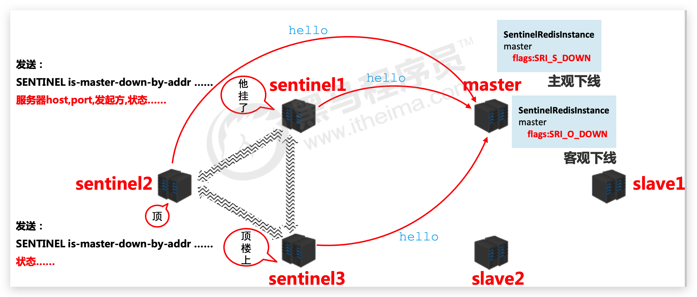
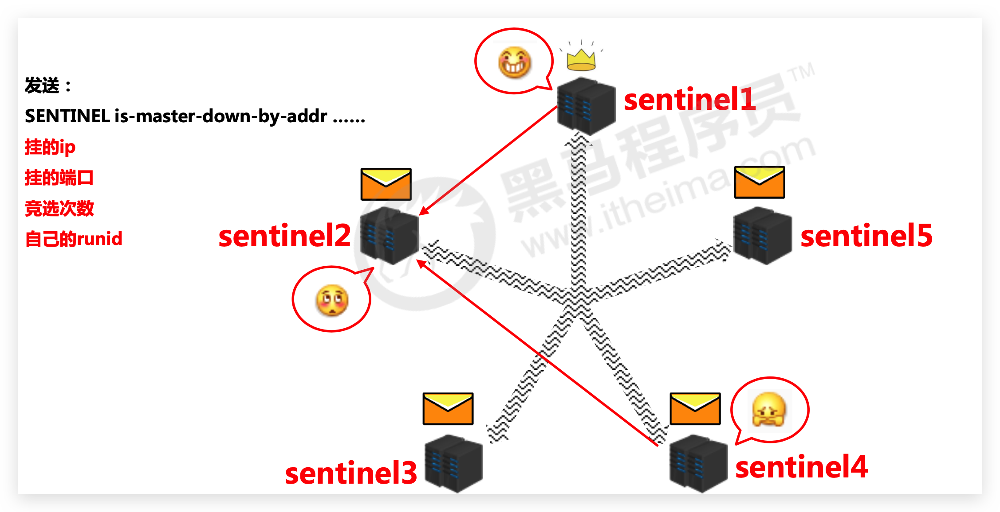
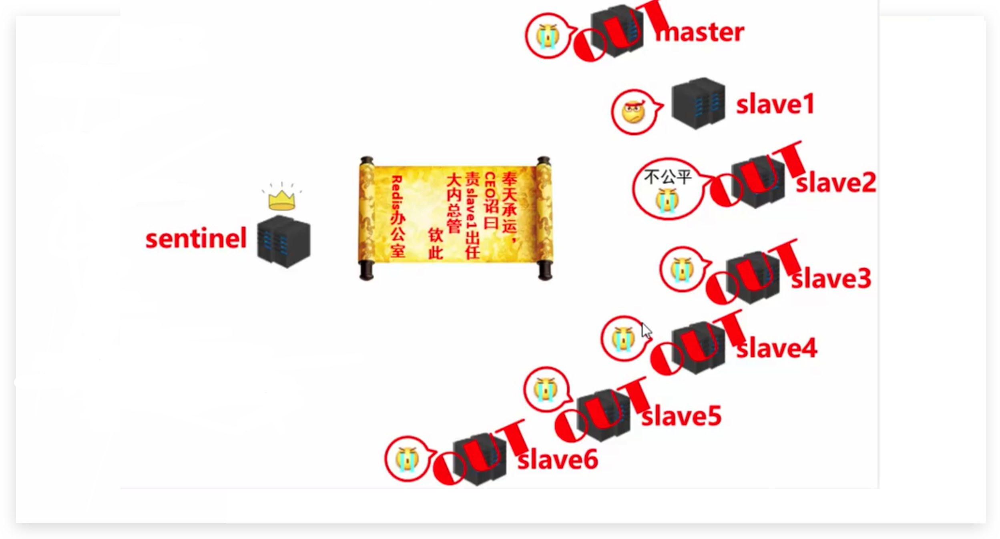

# 哨兵 Sentinel—故障自动切换

## master 宕机

### 补救措施

master 宕机后，我们需要做如下操作：

* 将宕机的 master 下线
* 找一个 slave 作为 master
* 通知所有的 slave 连接新的 master
* 启动新的 master 和 slave
* 有可能会全量复制 x N + 部分复制 x N

那么问题来了：

* 谁来确认 master 宕机了，标准是什么？
* 如何从众多 slave 中找一个 master，规则是什么？
* 修改配置后，原有的 master 恢复了怎么版？

### 哨兵

哨兵（Sentinel） 是一个分布式系统，用于对**主从结构中的每台服务器**进行**监控**，当出现故障时通过**投票机制**选择新的 master 并将所有 slave 连接到新的 master。

其作用有：

* 监控：

  不断的检查master和slave是否正常运行。 master存活检测、master与slave运行情况检测。
* 通知（提醒）

  当被监控的服务器出现问题时，向其他（哨兵间，客户端）发送通知。
* 自动故障转移

  断开master与slave连接，选取一个slave作为master，将其他slave连接到新的master，并告知客户端新的服务器地址

注意：**哨兵也是一台redis服务器**，只是**不提供数据服务**。通常哨兵配置数量为**单数！！！**

## 配置哨兵

### 简介

* 配置一拖二的主从结构
* 配置三个哨兵（配置相同，端口不同）。参看 Redis 中的 `sentinel.conf`

  ```
  cat sentinel.conf | grep -v '#' | grep -v '^$'
  ```

  ```
  port 26379
  daemonize no
  pidfile /var/run/redis-sentinel.pid
  logfile ""
  dir /tmp

  sentinel monitor mymaster 127.0.0.1 6379 2
  sentinel down-after-milliseconds mymaster 30000
  acllog-max-len 128
  sentinel parallel-syncs mymaster 1
  sentinel failover-timeout mymaster 180000
  sentinel deny-scripts-reconfig yes
  SENTINEL resolve-hostnames no
  SENTINEL announce-hostnames no
  ```

  提示：复制并修改文件中**端口**时可以直接使用 `sed` 命令！！！

  ```
  sed 's/26379/26380/g' sentinel-26379.conf > sentinel-26380.conf
  ```
* 启动哨兵

  ```
  redis-sentinel sentinel-端口号.conf
  ```

### 配置

上面5个就不多说了。也无需改变（特别是 daemonize 无需后台运行）。一般只改 port ！！！

| 配置项                                                        | 范例                                            | 说明                                                                                                        |
| ------------------------------------------------------------- | ----------------------------------------------- | ----------------------------------------------------------------------------------------------------------- |
| sentinel monitor \<master-name> \<ip> \<redis-port> \<quorum>     | sentinel monitor mymaster 127.0.0.1 6379 2      | 设置哨兵监听的**主服务器信息**，最后的参数决定了最终**参与选举的服务器数量**（即多半）                      |
| sentinel down-after-milliseconds \<master-name> \<milliseconds> | sentinel down-after-milliseconds mymaster 30000 | 指定哨兵在监控Redis服务时，**判定master服务器挂掉的时间周期**，默认30秒 (30000)，也是主从切换的启动条件之一 |
| sentinel parallel-syncs \<master-name> \<numreplicas>           | sentinel parallel-syncs mymaster 1              | 指定**同时进行主从的slave数量**，数值越大，要求网络资源越高，要求约小，同步时间约长                         |
| sentinel failover-timeout \<master-name> \<milliseconds>        | sentinel failover-timeout mymaster 180000       | 指定出现故障后，**故障切换的最大超时时间**，超过该值，认定切换失败， 默认3分钟                              |
| sentinel notification-script \<master-name> \<script-path>      |                                                 | 服务器无法正常联通时，设定的执行脚本，通常调试使用                                                          |

## 哨兵工作原理 🔥

### 监控阶段



用于同步各个节点

* 获取各个sentinel的状态(是否在线)
* 获取master的状态

  * master属性：runid、role:master 等
  * 各个slave的详细信息
* 获取所有slave的状态(根据master中的slave信息获取)

  * slave属性：runid、role:slave、master_host、master_port、offset

### 通知阶段



### 故障转移阶段

众 sentinel 观察并确认 master 是否下线



推选一个主 sentinel



主 sentinel 来从 slave 中选 master



服务器列表中挑选备选master规则：

* 必须是在线的
* pass 响应慢的
* pass 与原master断开时间久的
* 优先原则

  * 优先级
  * offset，小的就会被认为数据不够
  * runid，小的优先（老员工）

发送指令(sentinel)：

* 向新的master发送slaveof no one
* 向其他slave发送slaveof 新masterIP端口

### 总结

* 监控

  * 同步信息
* 通知

  * 保持联通
* 故障转移

  * 发现问题
  * 竞选负责人
  * 优选新master
  * 新master上任，其他slave切换master，原master作为slave故障回复后连接