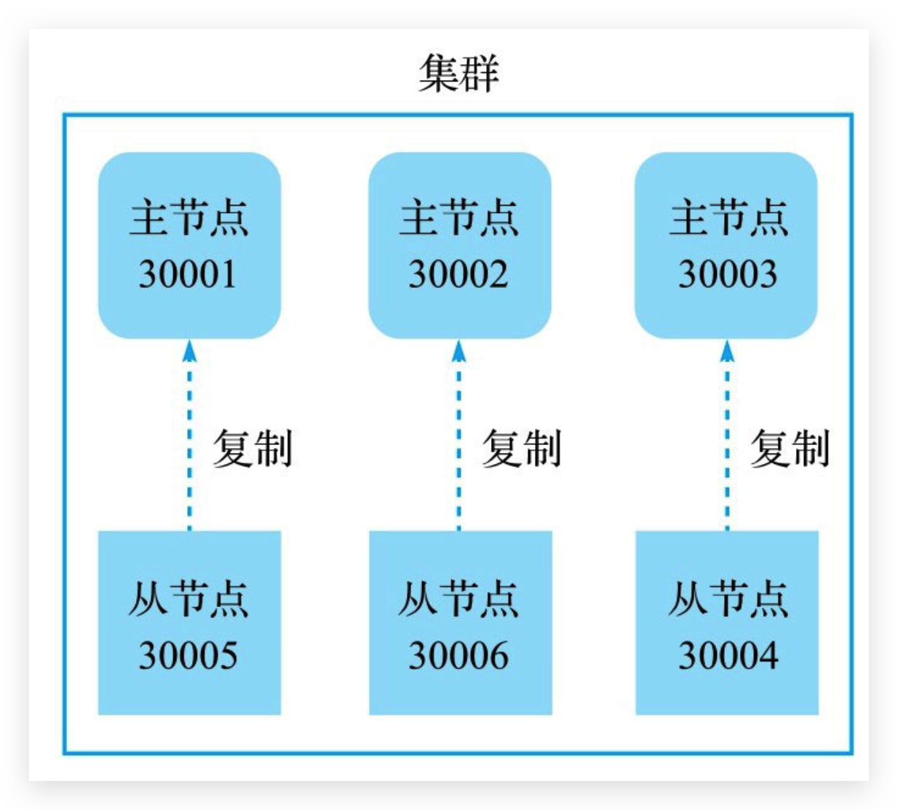

# 集群

## 业务发展过程中遇到的峰值瓶颈

*   Redis 提供的服务 **OPS** 可以达到**10万/秒**，当前业务 OPS 已经达到20万/秒

*   内存单机容量达到256G，当前业务需求内存容量1T。但内存也没有那么多


## 集群

### 简介

集群就是使用网络将**若干台计算机联通**起来，并提供统一的管理方式，使其**对外呈现单机**的服务效果。

Redis 集群是 3.0 版本引入的，在 5.0 后搭建更方便！


### 作用

*   分散单台服务器的**访问压力**，实现**负载均衡**
*   分散单台服务器的**存储压力**，实现**可扩展性**
*   降低单台服务器**宕机带来的业务灾难**


## 架构设计 🔥

### 数据存储设计—数据分片

*   Redis 集群将整个**数据库空间**划分为**16384个槽**来实现**数据分片**。集群中各个 master 负责处理一部分的槽。每份槽代表的是**一个存储空间**，**不是一个key的保存空间**

*   通过算法设计，计算出key应该保存的位置
*   将key按照计算出的结果放到对应的存储空间
*   **集群添加节点时**，会**将相应的槽以及槽中存储的数据迁移至新节点**！且都是**在线**进行！**无需停机**！


### 集群内部通讯设计

*   各个数据库相互通信，保存各个库中**槽的编号数据**
*   **一次命中，直接返回**
*   **一次未命中，告知具体位置**。然后**客户端**访问**重定向（redirect）**的位置！
*   Redis 集群采用**无代理模式**，客户端的命令直接交由节点执行！对于优化过的集群客户端来说，大部分情况下命令不需要实施转向或仅需要一次转向


### 主从复制、Sentinel

Redis 集群也提供了与单机版 Redis 服务器一样的**主从复制**功能；

还提供了类似于单机版 **Sentinel** 的功能！当集群中的某个 master 下线时，会提升该节点的 slave 为新 master 继续提供服务


## 搭建方式1—集群自动搭建程序

### 帮助

在 utils/create-cluster/create-cluster 位置的 create-cluster 程序专门用来快速构建起一个完整可用的集群以供用户测试。

`./create-cluster help`可以查看用法

创建一个群集，请按照以下步骤进行：

1. 编辑create-cluster，并更改开始/结束端口，这取决于要创建的实例数量。
2. 使用"./creat-cluster start "来运行实例。
3. 使用"./create-cluster create "来执行redis-cli --cluster create，这样将会创建一个Redis集群。(如果您通过本地容器访问您的设置，请确保CLUSTER_HOST值被更改为您的本地IP)
4. 现在你已经准备好玩集群了。每个实例的AOF文件和日志会创建在在当前目录下。

停止一个集群：

1. 使用"./cake-cluster stop "来停止所有实例。在你停止实例后，如果你改变主意，你可以使用"./cake-cluster start "来重新启动它们。
2. 使用"./creat-cluster clean "删除所有AOF/日志文件，以干净的环境重新启动。


### 创建集群

通过执行start命令来创建出6个节点，这6个节点的IP地址都为本机，而端口号则为30001～30006

```
ubuntu@VM-0-3-ubuntu:/usr/local/redis-6.2.1/utils/create-cluster$ sudo ./create-cluster start
Starting 30001
Starting 30002
Starting 30003
Starting 30004
Starting 30005
Starting 30006
```

使用create命令，把上述6个节点组合成一个集群，其中包含3个主节点和3个从节点

```
ubuntu@VM-0-3-ubuntu:/usr/local/redis-6.2.1/utils/create-cluster$ sudo ./create-cluster create
>>> Performing hash slots allocation on 6 nodes...
Master[0] -> Slots 0 - 5460
Master[1] -> Slots 5461 - 10922
Master[2] -> Slots 10923 - 16383
Adding replica 127.0.0.1:30005 to 127.0.0.1:30001
Adding replica 127.0.0.1:30006 to 127.0.0.1:30002
Adding replica 127.0.0.1:30004 to 127.0.0.1:30003
>>> Trying to optimize slaves allocation for anti-affinity
[WARNING] Some slaves are in the same host as their master
M: 01577c26ceb76eec6716563170826517f321d968 127.0.0.1:30001
   slots:[0-5460] (5461 slots) master
M: 97fd26fcdc24382afe81b8d0c45f514ecb67a2f8 127.0.0.1:30002
   slots:[5461-10922] (5462 slots) master
M: 81c5a05a97fe697e834e388ce318f3bb2b6155cd 127.0.0.1:30003
   slots:[10923-16383] (5461 slots) master
S: 7162dc4ebcb149b140639da0f229363276416a32 127.0.0.1:30004
   replicates 01577c26ceb76eec6716563170826517f321d968
S: e71361e154517888a63470b56343e16a88f91c6e 127.0.0.1:30005
   replicates 97fd26fcdc24382afe81b8d0c45f514ecb67a2f8
S: 3947e6ab1101ad12c8ddd18157edb7848712aa4a 127.0.0.1:30006
   replicates 81c5a05a97fe697e834e388ce318f3bb2b6155cd
Can I set the above configuration? (type 'yes' to accept): yes
>>> Nodes configuration updated
>>> Assign a different config epoch to each node
>>> Sending CLUSTER MEET messages to join the cluster
Waiting for the cluster to join

>>> Performing Cluster Check (using node 127.0.0.1:30001)
M: 01577c26ceb76eec6716563170826517f321d968 127.0.0.1:30001
   slots:[0-5460] (5461 slots) master
   1 additional replica(s)
S: 7162dc4ebcb149b140639da0f229363276416a32 127.0.0.1:30004
   slots: (0 slots) slave
   replicates 01577c26ceb76eec6716563170826517f321d968
S: 3947e6ab1101ad12c8ddd18157edb7848712aa4a 127.0.0.1:30006
   slots: (0 slots) slave
   replicates 81c5a05a97fe697e834e388ce318f3bb2b6155cd
M: 81c5a05a97fe697e834e388ce318f3bb2b6155cd 127.0.0.1:30003
   slots:[10923-16383] (5461 slots) master
   1 additional replica(s)
M: 97fd26fcdc24382afe81b8d0c45f514ecb67a2f8 127.0.0.1:30002
   slots:[5461-10922] (5462 slots) master
   1 additional replica(s)
S: e71361e154517888a63470b56343e16a88f91c6e 127.0.0.1:30005
   slots: (0 slots) slave
   replicates 97fd26fcdc24382afe81b8d0c45f514ecb67a2f8
[OK] All nodes agree about slots configuration.
>>> Check for open slots...
>>> Check slots coverage...
[OK] All 16384 slots covered.
```

create命令会根据现有的节点制定出一个相应的角色和槽分配计划，然后询问你的意见。以上面打印出的计划为例：

*   节点30001、30002和30003将被设置为主节点，并且分别负责槽0～5460、槽5461～10922和槽10923～16383。
*   节点30004、30005和30006分别被设置为以上3个主节点的从节点。

搭建完成后的集群：




## 搭建方式2—配置文件手动搭建

### 方式1问题

使用create-cluster程序快速搭建Redis集群虽然非常方便，但是由于该程序搭建的Redis集群**不具备配置文件**、**主从节点数量固定**以及**槽分配模式固定**等原因，这些快速搭建的集群通常**只能够用于测试**，但是无法应用在实际的生产环境中

搭建真正能够在生产环境中使用的Redis集群，我们需要创建相应的配置文件，并使用集群管理命令对集群进行配置和管理


### 创建集群

为了保证集群的各项功能可以正常运转，一个集群至少需要3个主节点和3个从节点。不过为了与之前使用create-cluster程序搭建的集群区别开来，这次我们将搭建一个由5个主节点和5个从节点组成的Redis集群。

我们需要先创建出10个文件夹，用于存放相应节点的数据以及配置文件

```
ubuntu@VM-0-3-ubuntu:/usr/local/redis-6.2.1/utils/create-cluster$ sudo mkdir my-cluster
ubuntu@VM-0-3-ubuntu:/usr/local/redis-6.2.1/utils/create-cluster$ cd my-cluster/
ubuntu@VM-0-3-ubuntu:/usr/local/redis-6.2.1/utils/create-cluster/my-cluster$ sudo mkdir node1 node2 node3 node4 node5 node6 node7 node8 node9 node10
```

接着，我们需要在每个节点文件夹中创建一个包含以下内容的`redis.conf`配置文件

```
cluster-enabled yes
port 30001
```

*   cluster-enabled选项的值为yes表示将Redis实例设置成集群节点而不是单机服务器
*   port选项则用于为每个节点设置不同的端口号。本例中，我们为10个节点分别设置了从30001～30010的端口号

在为每个节点都设置好相应的配置文件之后，我们需要通过以下命令（目录自己调整），陆续启动各个文件夹中的集群节点：

```
ubuntu@VM-0-3-ubuntu:/usr/local/redis-6.2.1$ src/redis-server /node1/redis.conf
```

连接这10个集群节点并为它们分配槽：

```
ubuntu@VM-0-3-ubuntu:/usr/local/redis-6.2.1$ src/redis-cli --cluster create 
127.0.0.1:30001
127.0.0.1:30002
127.0.0.1:30003
127.0.0.1:30004
127.0.0.1:30005
127.0.0.1:30006
127.0.0.1:30007
127.0.0.1:30008
127.0.0.1:30009
127.0.0.1:30010
-- cluster-replicas 1
```

*   redis-cli --cluster是Redis客户端附带的集群管理工具，它的create子命令**接受任意多个节点的IP地址和端口号**作为参数，然后使用这些节点组建起一个Redis集群。

*   cluster-replicas用于指定集群中**每个主节点的从节点数量**。在上面的命令调用中，该参数的值为1，这表示我们想要**为每个主节点设置一个从节点**

执行完上述命令后，会定制出节点角色、槽分配计划等（略）


## 连接集群

### redis-cli

使用Redis附带的redis-cli客户端，`-c`用于**连接集群**

```
ubuntu@VM-0-3-ubuntu:/usr/local/redis-6.2.1$ src/redis-cli -c -p 30001
127.0.0.1:30001>
```


### 常用配置

添加节点🔥

```
cluster-enabled yes|no
```

cluster配置文件名，该文件属于自动生成，仅用于快速查找文件并查询文件内容

```
cluster-config-file <filename>
```

节点服务响应超时时间，用于判定该节点是否下线或切换为从节点🔥

```
cluster-node-timeout <milliseconds>
```

master连接的slave最小数量

```
cluster-migration-barrier <count>
```


### 常用命令

redis-cli 常用命令：

查看集群节点信息🔥

```
cluster nodes
```

进入一个从节点 redis，切换其主节点

```
cluster replicate <master-id>
```

发现一个新节点，新增主节点

```
cluster meet ip:port
```

忽略一个没有solt的节点

```
cluster forget <id>
```

手动故障转移

```
cluster failover
```


