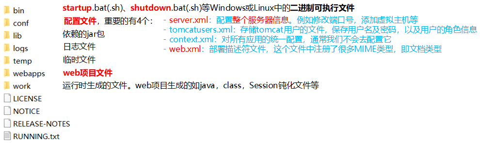

# 0 Primer

## 服务器

* **服务器**：**安装**了**服务器软件**的**计算机**

    * **服务器软件**：接收用户的请求，处理请求，做出响应
    * **web服务器软件**：接收用户的请求，处理请求，做出响应。
        * 在web服务器软件中，可以**部署web项目**，让用户通过浏览器来访问这些项目
        * web容器（动态资源的容器）

* 常见与Java相关的web服务器软件：

    * webLogic：oracle公司，大型的JavaEE服务器，支持所有的JavaEE规范，收费的。

    * webSphere：IBM公司，大型的JavaEE服务器，支持所有的JavaEE规范，收费的。

    * JBOSS：JBOSS公司的，大型的JavaEE服务器，支持所有的JavaEE规范，收费的。

    * **Tomcat**：Apache基金组织，中小型的JavaEE服务器，仅仅支持少量的JavaEE规范如servlet/jsp。开源的，免费的。

        > JavaEE：Java语言在企业级开发中使用的技术规范的总和，一共规定了13项大的规范


## 静态项目和动态项目

* 静态项目：如，在webapps目录下创建一个目录（项目目录），在目录中创建一个html文件

* **Java 动态项目**：在webapps目录下放置如下：

    ```
    |——hello   项目目录
    	|——index.html   应用资源，可以放在文件夹中
      	|——WEB-INF   大写，这个目录下的东西是无法通过浏览器直接访问
      		|——web.xml   web项目的核心配置文件，对项目进行配置。可以用注解替代
      		|——classes   存放class字节码文件的目录
      		|——lib   放置依赖的jar包
    ```

    

    

## Tomcat 入门 

1. 下载：[Tomcat官网](https://tomcat.apache.org/)，下载二进制文件中核心文件解压版。（以8.0为例）

2. 安装：解压安装，目录建议不要有中文和空格

3. 权限：在 Mac 和 Linux 中可能和 IDEA 配合运行时有权限问题，只需赋予权限即可

    ```bash
    chmod a+x /${TOMCAT_HOME}/bin/*
    ```

4. 卸载：删除目录即可

    

5. **启动**：`startup.*`。访问：http://localhost:8080 或 http://127.0.0.1:8080 或 替换为服务器所在的IP

    - 若出现启动时黑窗口一闪而过，则需要正确配置`JAVA_HOME`环境变量
    - 若出现启动报错，如端口已被占用，
        - 可以杀死占用的进程（`netstat -ano`查找PID）
        - 在`server.xml`中的`<Connector>`标签修改自身的端口号。可将Tomcat端口号修改为80(HTTP协议默认)

6. **关闭**：`shutdown.*`或在启动窗口`Ctrl+C`。不建议强制关闭窗口来关闭


## Tomcat 配置

### 部署项目的方式

*   **直接将项目放到webapps目录下**；或打为**war包**后放入，war包会自动解压缩，删除war包后自动删除项目

    `/hello`：项目访问路径—>**虚拟目录（IDEA中Application context，若为“/”则访问时不用写项目路径）**

*   不用复制，**配置server.xml**，在`<Host>`元素中添加`<Context>`元素

    `<Context docBase="C:\hello" path="/hello" />`，分别为项目的绝对路径、虚拟目录

*   在`conf/catalana/localhost`目录下创建`虚拟目录名称.xml`文件，也称**热部署**。

    `<Context docBase="C:\hello">`


### 理解server.xml

```
|——Server：根元素，表示整个服务器的配置信息
	|——Service：在Server中只能有一个，表示服务
	|——Connector：可以有N个，它表示连接
		|——Engine：只能有一个，表示引擎，它是Service组件的核心
			|——Host：可以有N个，每个表示一个虚拟主机
				|——Context：可以有N个，每个表示一个应用，外部应用必须部署，也可以用如下第3种
```


### web.xml文件的继承

 - 在`${CATALINA_HOME}\conf\web.xml`中，相当于写到了每个项目的web.xml中，它是所有web.xml的父文件

     ```xml
     //它的优先级最低，如果一个请求没有人处理，那么它来处理！
     //当访问路径不存在时，会执行该Servlet！其实我们在访问index.html时也是在执行这个Servlet
     <servlet-name>default</servlet-name>
     <servlet-class>org.apache.catalina.servlets.DefaultServlet</servlet-class>
     <servlet-name>default</servlet-name>
     <url-pattern>/</url-pattern>//匹配所有URL,优先级最低
     ```

     ```xml
     //任何URL后缀为jsp的访问，都会执行名为jsp的Servlet
     <servlet-name>jsp</servlet-name>
     <url-pattern>*.jsp</url-pattern>
     <url-pattern>*.jspx</url-pattern>
     ```

     ```xml
     <session-timeout>30</session-timeout>//session的默认超时时间为30分钟
     ```

     ```xml
     //MIME类型用来标识网络上资源的媒体类型
     <mime-mapping>
         <extension>bmp</extension>
         <mime-type>image/bmp</mime-type>
     </mime-mapping>
     ```

     ```xml
     //在应用的web.xml中如果没有对<welcome-file-list>进行覆盖，那么默认主页为...
     <welcome-file-list>
         <welcome-file>index.html</welcome-file>
         <welcome-file>index.htm</welcome-file>
         <welcome-file>index.jsp</welcome-file>
     </welcome-file-list>
     ```


### 映射虚拟主机

我们的目标是，在浏览器中输出：<http://www.hello.cn>就可以访问我们的项目

 1. 修改Tomcat端口号为80

 2. 在本机上可以解析域名为127.0.0.1，这需要修改C:\WINDOWS\system32\drivers\etc\hosts文件，添加对<http://www.hello.cn>和127.0.01的绑定关系

 3. 在server.xml文件中添加一个`<Host>`（主机）

     ```xml
     <Host name="www.hello.cn" appBase="F:/hello" unpackWARs="true" autoDeploy="true">
     </Host>
     //1.虚拟主机名 2.当前虚拟主机的应用程序存放目录 
     //3.目录下创建名为ROOT的应用，因为一个主机只可以有一个名为ROOT的应用,访问是可以不给出应用名称
     ```


## IDEA与tomcat的相关配置

* IDEA会为每一个tomcat部署的项目**单独建立一份配置文件**
    
    * 控制台的LOG：`Using CATALINA_BASE:"C:\Users\Conanan\.IntelliJIdea2018.2\system\tomcat\test"`
    
* 工作空间项目和tomcat部署的web项目
    * tomcat真正访问的是“tomcat部署的web项目”，从上述目录配置文件中即可找到目录的配置，"tomcat部署的web项目"对应着"工作空间项目" 的web目录下的所有资源
    * WEB-INF目录下的资源不能被浏览器直接访问。
    
* 断点调试：使用"小虫子"启动 dubug 启动

    注意端口问题，可以在配置中的 Startup/Connection 选项中配置，注意范围

